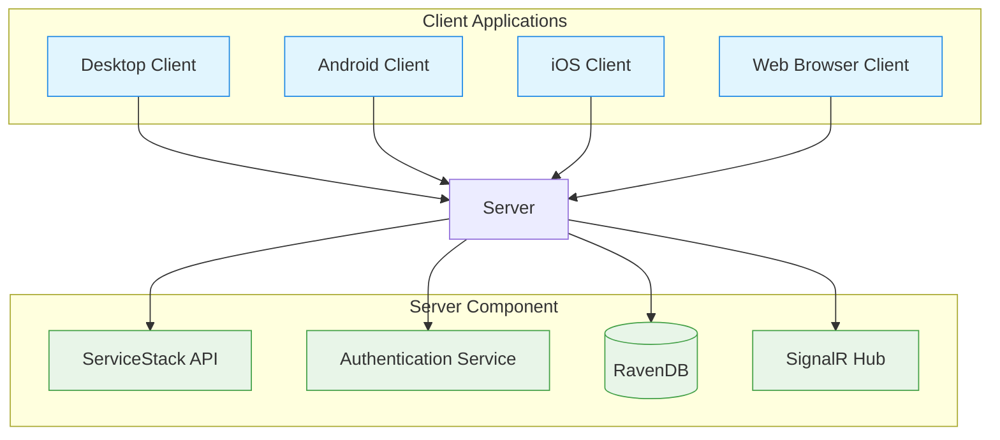
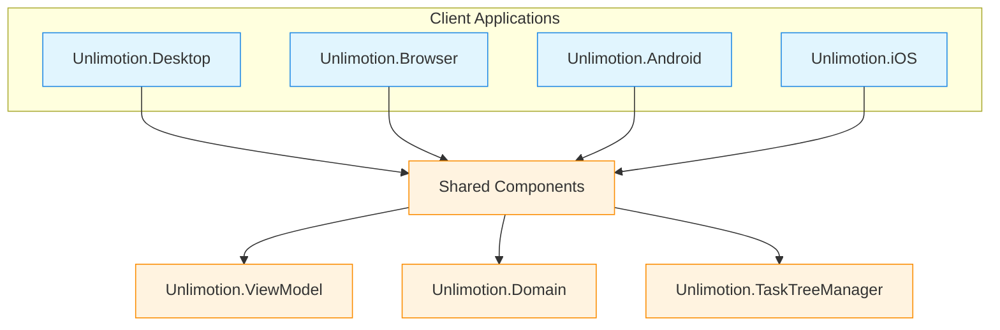
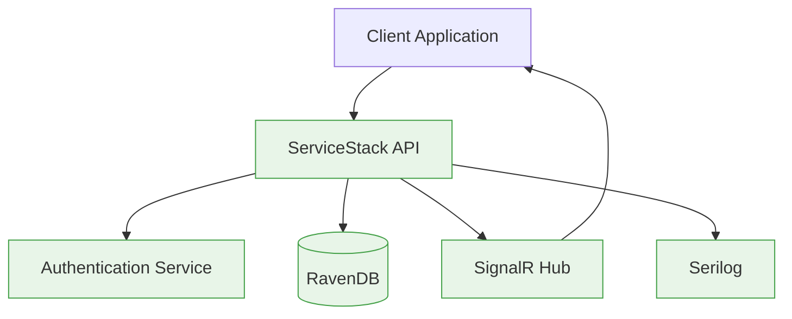
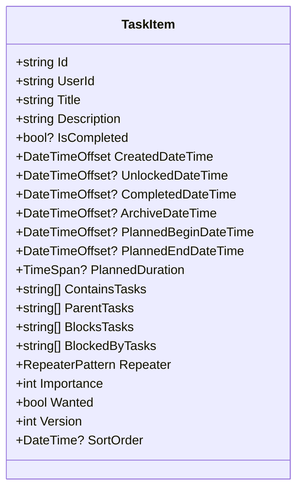
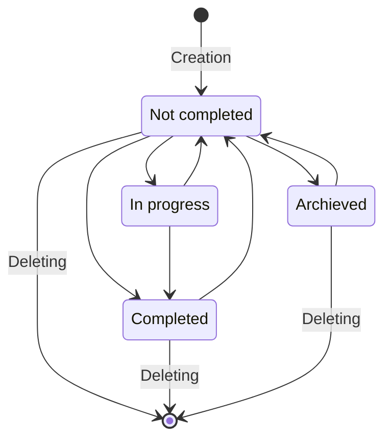
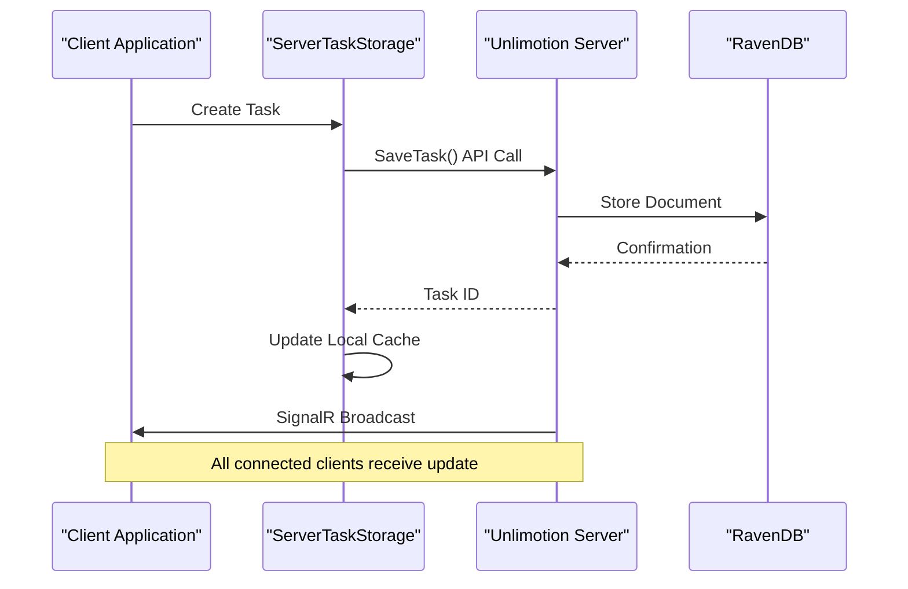
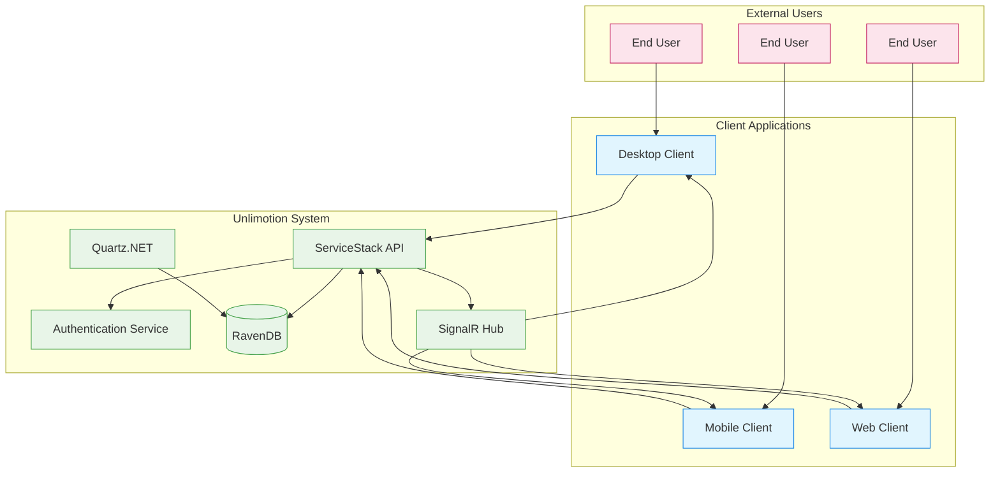
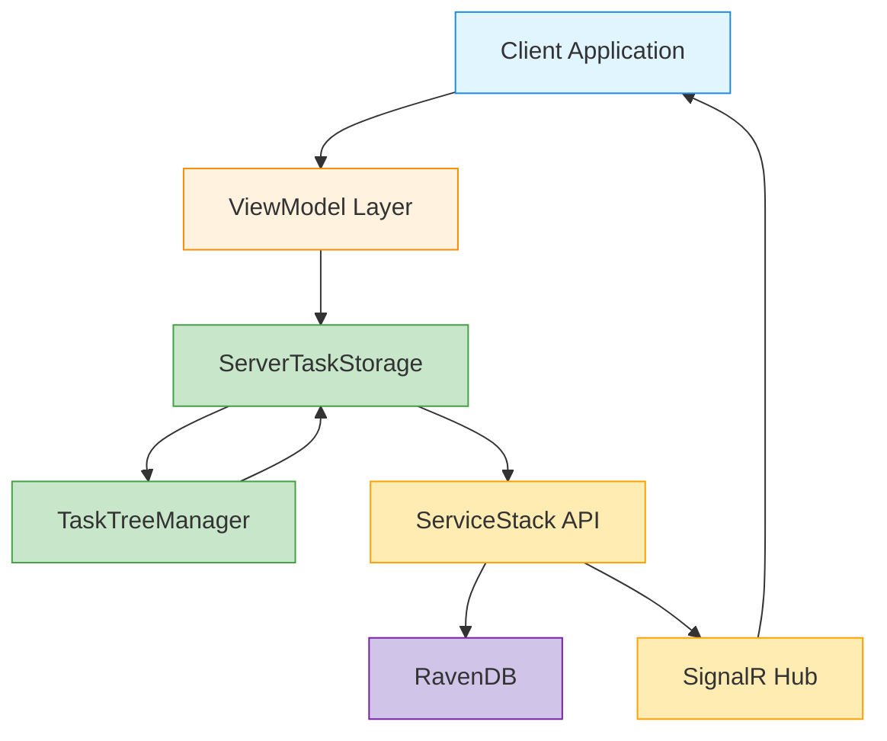

# System Overview

<cite>
**Referenced Files in This Document**   
- [README.md](file://README.md)
- [Unlimotion.csproj](file://src/Unlimotion/Unlimotion.csproj)
- [Unlimotion.Server.csproj](file://src/Unlimotion.Server/Unlimotion.Server.csproj)
- [Unlimotion.Desktop.csproj](file://src/Unlimotion.Desktop/Unlimotion.Desktop.csproj)
- [Unlimotion.Browser.csproj](file://src/Unlimotion.Browser/Unlimotion.Browser.csproj)
- [TaskItem.cs](file://src/Unlimotion.Domain/TaskItem.cs)
- [AppHost.cs](file://src/Unlimotion.Server/AppHost.cs)
- [Program.cs](file://src/Unlimotion.Server/Program.cs)
- [ServerTaskStorage.cs](file://src/Unlimotion/ServerTaskStorage.cs)
- [TaskTreeManager.cs](file://src/Unlimotion.TaskTreeManager/TaskTreeManager.cs)
- [TaskStorages.cs](file://src/Unlimotion/TaskStorages.cs)
- [MainWindowViewModel.cs](file://src/Unlimotion.ViewModel/MainWindowViewModel.cs)
</cite>

## Table of Contents
1. [Introduction](#introduction)
2. [Core Features](#core-features)
3. [System Architecture](#system-architecture)
4. [Client Applications](#client-applications)
5. [Server Component](#server-component)
6. [Data Model](#data-model)
7. [Task Relationships](#task-relationships)
8. [Synchronization and Storage](#synchronization-and-storage)
9. [Practical Examples](#practical-examples)
10. [System Context Diagram](#system-context-diagram)
11. [Component Interaction Diagram](#component-interaction-diagram)

## Introduction

Unlimotion is a full-stack, cross-platform task management application designed to provide unlimited nesting, multi-parent relationships, and roadmap visualization capabilities. The system enables users to organize tasks with complex hierarchical and dependency relationships while offering seamless synchronization across multiple platforms. Built with modern .NET technologies, Unlimotion combines a rich client interface with a robust server backend to deliver a comprehensive task management solution.

The application supports multiple client interfaces including desktop (Windows, macOS, Linux), mobile (Android, iOS), and web browser versions, all connecting to a central server component for data synchronization and persistence. This architecture allows users to access their task data from any device while maintaining data consistency and integrity.

**Section sources**
- [README.md](file://README.md#L1-L186)

## Core Features

Unlimotion offers several distinctive features that differentiate it from traditional task management applications:

**Unlimited Nesting**: Tasks can be nested to unlimited levels, allowing users to create deeply hierarchical task structures that reflect complex projects and workflows.

**Multi-Parent Relationships**: A single task can have multiple parent tasks simultaneously, enabling the same task to appear in different contexts or projects without duplication.

**Roadmap Visualization**: Tasks can be displayed as a directed graph, visualizing the progression paths needed to achieve goals, with green arrows indicating parent-child relationships and red arrows showing blocking relationships.

**Task Blocking**: Tasks can be blocked by other tasks, preventing completion until all blocking tasks are finished. Blocking can occur through direct blocking relationships or inherited from parent tasks.

**Cross-Platform Synchronization**: The system synchronizes task data across desktop, mobile, and web clients through a central server, ensuring consistent data access from any device.

**Emoji-Based Filtering**: Tasks with emojis in their titles can be quickly filtered, with emojis inherited by subtasks for consistent categorization.

**Section sources**
- [README.md](file://README.md#L20-L186)

## System Architecture

The Unlimotion system follows a client-server architecture with a clear separation between presentation, business logic, and data persistence layers. The architecture combines several key technologies:

- **AvaloniaUI** for the cross-platform user interface, enabling native-like experiences on desktop and mobile platforms
- **ServiceStack** for server-side APIs, providing RESTful endpoints and authentication
- **RavenDB** for data persistence, serving as an embedded document database for storing task information
- **Quartz.NET** for scheduling background tasks such as Git-based backups
- **SignalR** for real-time communication between clients and server

The system is designed with modularity in mind, with distinct components handling specific responsibilities. The client applications connect to the central server component, which manages data persistence and synchronization across all connected clients.

**Diagram sources**
- [Unlimotion.csproj](file://src/Unlimotion/Unlimotion.csproj#L1-L45)
- [Unlimotion.Server.csproj](file://src/Unlimotion.Server/Unlimotion.Server.csproj#L1-L43)

**Section sources**
- [Unlimotion.csproj](file://src/Unlimotion/Unlimotion.csproj#L1-L45)
- [Unlimotion.Server.csproj](file://src/Unlimotion.Server/Unlimotion.Server.csproj#L1-L43)

## Client Applications

Unlimotion provides multiple client applications that share a common codebase while adapting to platform-specific requirements. The client architecture is built on AvaloniaUI, a cross-platform UI framework for .NET that enables consistent user experiences across different operating systems.

The desktop client (Unlimotion.Desktop) targets Windows, macOS, and Linux platforms, with specific build configurations for each operating system. It uses the .NET 9.0 runtime and includes platform-specific resources and configurations.

The browser client (Unlimotion.Browser) is implemented as a WebAssembly application, allowing users to access their tasks directly through a web browser without installation. This client uses Avalonia.Browser to render the UI within the browser environment.

Mobile clients for Android (Unlimotion.Android) and iOS (Unlimotion.iOS) provide native mobile experiences while sharing the core business logic with other clients. These applications can run on mobile devices and synchronize data with the central server.

All clients share the same core functionality and user interface components, ensuring a consistent user experience regardless of the platform. They communicate with the server component through REST APIs and SignalR for real-time updates.

**Diagram sources**
- [Unlimotion.Desktop.csproj](file://src/Unlimotion.Desktop/Unlimotion.Desktop.csproj#L1-L35)
- [Unlimotion.Browser.csproj](file://src/Unlimotion.Browser/Unlimotion.Browser.csproj#L1-L17)
- [Unlimotion.csproj](file://src/Unlimotion/Unlimotion.csproj#L1-L45)

**Section sources**
- [Unlimotion.Desktop.csproj](file://src/Unlimotion.Desktop/Unlimotion.Desktop.csproj#L1-L35)
- [Unlimotion.Browser.csproj](file://src/Unlimotion.Browser/Unlimotion.Browser.csproj#L1-L17)

## Server Component

The server component (Unlimotion.Server) serves as the central hub for data persistence and synchronization across all clients. Built on ASP.NET Core and ServiceStack, it provides RESTful APIs for client applications to interact with the task management system.

The server uses RavenDB as an embedded document database for storing task data, providing efficient querying and indexing capabilities. Authentication is implemented using JWT (JSON Web Tokens) with RS512 encryption, ensuring secure access to user data.

SignalR is used for real-time communication between the server and connected clients, enabling immediate synchronization of task changes across all devices. When a task is modified on one client, the change is propagated to the server and then broadcast to all other connected clients.

The server configuration includes CORS (Cross-Origin Resource Sharing) support, allowing clients from different domains to connect securely. It also implements comprehensive error handling and logging through Serilog, facilitating troubleshooting and monitoring.

**Diagram sources**
- [AppHost.cs](file://src/Unlimotion.Server/AppHost.cs#L1-L122)
- [Program.cs](file://src/Unlimotion.Server/Program.cs#L1-L50)

**Section sources**
- [AppHost.cs](file://src/Unlimotion.Server/AppHost.cs#L1-L122)
- [Program.cs](file://src/Unlimotion.Server/Program.cs#L1-L50)

## Data Model

The core data model of Unlimotion revolves around the TaskItem entity, which represents a single task in the system. Each task contains comprehensive metadata and relationship information that enables the application's advanced features.

The TaskItem class includes properties for basic task information such as title, description, creation date, and completion status. It also tracks temporal aspects with planned start and end dates, planned duration, and timestamps for various state changes.

Key to Unlimotion's functionality is the task's relationship properties, which enable the system's distinctive features:

- **ContainsTasks**: List of child task IDs, representing the decomposition of a task into subtasks
- **ParentTasks**: List of parent task IDs, allowing a task to belong to multiple parents simultaneously
- **BlocksTasks**: List of task IDs that this task blocks, preventing their completion
- **BlockedByTasks**: List of task IDs that block this task from being completed

Additional properties support advanced functionality such as repeatable tasks (Repeater), importance levels, and versioning for conflict detection during synchronization.

**Diagram sources**
- [TaskItem.cs](file://src/Unlimotion.Domain/TaskItem.cs#L1-L32)

**Section sources**
- [TaskItem.cs](file://src/Unlimotion.Domain/TaskItem.cs#L1-L32)

## Task Relationships

Unlimotion implements a sophisticated system of task relationships that enables complex project structures and dependency management. These relationships go beyond simple hierarchical nesting to provide powerful organizational capabilities.

The system supports four types of task links:

**Parent Tasks**: Represent the tasks that contain the current task as a subtask. Unlike traditional task managers, Unlimotion allows multiple parents, enabling a task to exist in multiple contexts simultaneously.

**Containing Tasks**: Represent child tasks that are part of the current task's decomposition. This creates the hierarchical structure that users navigate in the "All Tasks" view.

**Blocking By Tasks**: Represent tasks that must be completed before the current task can be unblocked. This creates dependency chains that enforce task completion order.

**Blocked Tasks**: Represent tasks that cannot be completed while the current task remains incomplete. This relationship is the inverse of blocking.

These relationships create a directed graph structure that can be visualized in the Roadmap view, showing the paths users must follow to achieve their goals. The system automatically calculates task blocking status based on these relationships, preventing completion of blocked tasks.

**Diagram sources**
- [README.md](file://README.md#L40-L60)

**Section sources**
- [README.md](file://README.md#L40-L60)

## Synchronization and Storage

Unlimotion implements a robust synchronization system that ensures data consistency across all client applications. The system uses a combination of immediate API calls and real-time SignalR notifications to propagate changes.

The ServerTaskStorage class serves as the primary interface between client applications and the server, handling all data operations. It manages the connection to the server, authentication with JWT tokens, and synchronization of task data. When a task is modified, the storage layer sends the update to the server and receives real-time updates from other clients through SignalR.

For offline scenarios, the system can operate in file-based storage mode, saving tasks as JSON files in a specified directory. This provides local data persistence when the server is unavailable, with synchronization occurring when connectivity is restored.

The TaskTreeManager component handles complex operations that affect multiple tasks, such as creating parent-child relationships or blocking dependencies. It ensures that all related tasks are updated consistently and that version conflicts are properly managed.

**Diagram sources**
- [ServerTaskStorage.cs](file://src/Unlimotion/ServerTaskStorage.cs#L1-L716)
- [TaskTreeManager.cs](file://src/Unlimotion.TaskTreeManager/TaskTreeManager.cs#L1-L459)

**Section sources**
- [ServerTaskStorage.cs](file://src/Unlimotion/ServerTaskStorage.cs#L1-L716)
- [TaskTreeManager.cs](file://src/Unlimotion.TaskTreeManager/TaskTreeManager.cs#L1-L459)

## Practical Examples

### Task Creation
When creating a new task, users can choose from several options:
- **Sibling Task**: Created at the same level as the selected task (Ctrl+Enter)
- **Blocked Sibling**: Created at the same level and blocked by the selected task (Shift+Enter)
- **Inner Task**: Created as a child of the selected task (Ctrl+Tab)

The MainWindowViewModel handles these operations through reactive commands that interact with the TaskTreeManager to create the appropriate relationships.

### Task Blocking
Tasks become blocked when they have incomplete blocking tasks or when any of their parent tasks are blocked. The system automatically calculates blocking status based on the task's BlockedByTasks relationships and propagates this status to dependent tasks.

### Drag and Drop Operations
The interface supports several drag-and-drop operations:
- **No keys**: Attach task to target as a child
- **Shift**: Move task to target as a child
- **Ctrl**: Make dragged task block the target task
- **Alt**: Make target task block the dragged task
- **Ctrl+Shift**: Clone dragged task to target as a subtask

These operations are handled by the TaskStorages class, which translates user actions into appropriate TaskTreeManager operations.

**Section sources**
- [MainWindowViewModel.cs](file://src/Unlimotion.ViewModel/MainWindowViewModel.cs#L1-L1063)
- [TaskStorages.cs](file://src/Unlimotion/TaskStorages.cs#L1-L224)

## System Context Diagram

**Diagram sources**
- [README.md](file://README.md#L1-L186)
- [Unlimotion.csproj](file://src/Unlimotion/Unlimotion.csproj#L1-L45)
- [Unlimotion.Server.csproj](file://src/Unlimotion.Server/Unlimotion.Server.csproj#L1-L43)

## Component Interaction Diagram

**Diagram sources**
- [MainWindowViewModel.cs](file://src/Unlimotion.ViewModel/MainWindowViewModel.cs#L1-L1063)
- [ServerTaskStorage.cs](file://src/Unlimotion/ServerTaskStorage.cs#L1-L716)
- [TaskTreeManager.cs](file://src/Unlimotion.TaskTreeManager/TaskTreeManager.cs#L1-L459)
- [AppHost.cs](file://src/Unlimotion.Server/AppHost.cs#L1-L122)