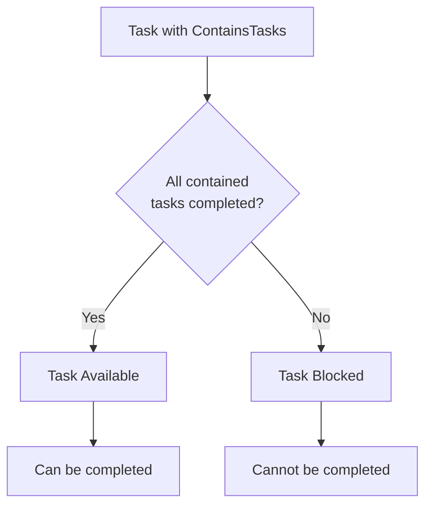
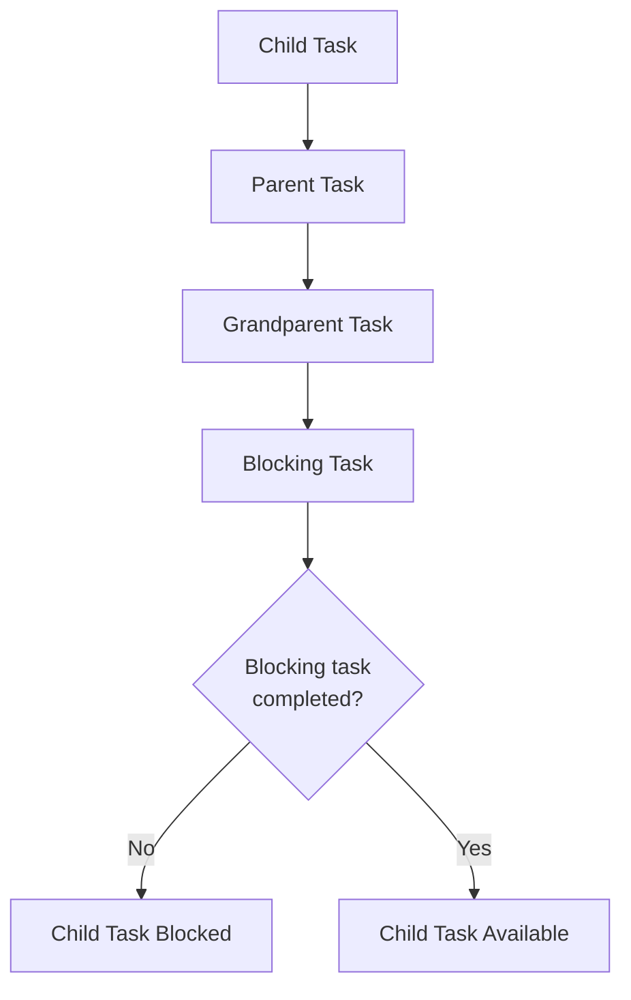
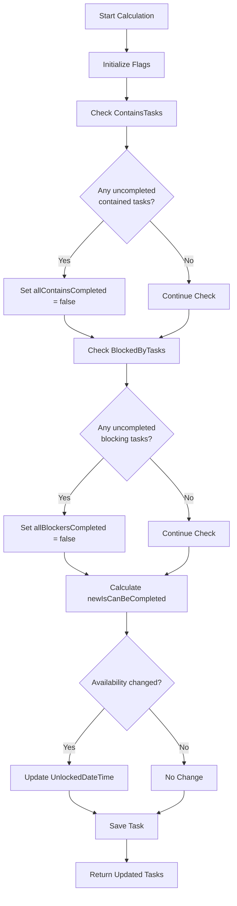
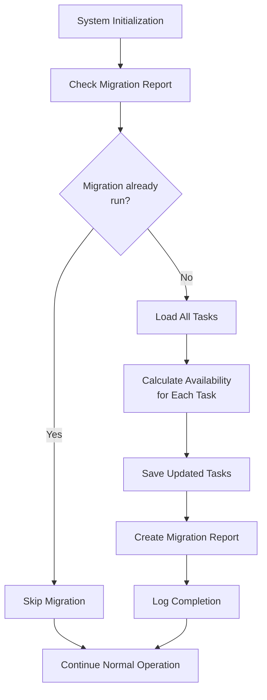
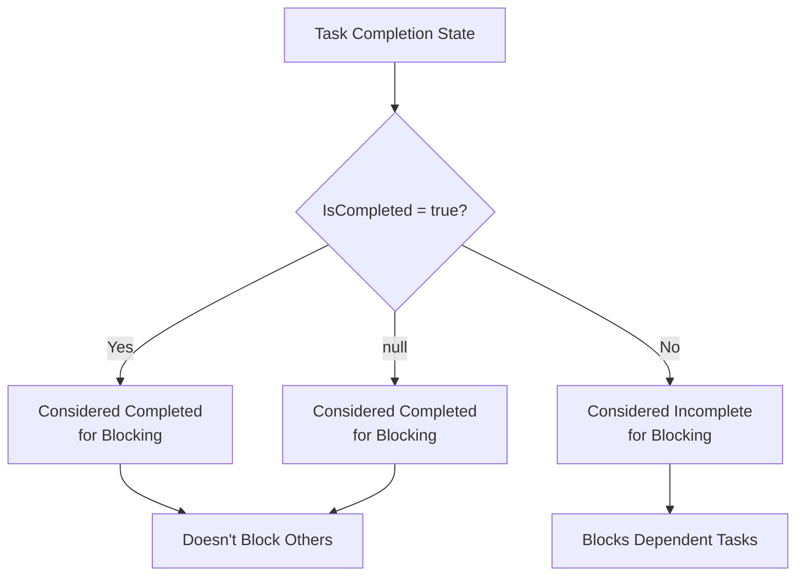

# Blocking Logic

<cite>
**Referenced Files in This Document**
- [IMPLEMENTATION_SUMMARY.md](file://IMPLEMENTATION_SUMMARY.md)
- [TaskItem.cs](file://src/Unlimotion.Domain/TaskItem.cs)
- [TaskTreeManager.cs](file://src/Unlimotion.TaskTreeManager/TaskTreeManager.cs)
- [ITaskTreeManager.cs](file://src/Unlimotion.TaskTreeManager/ITaskTreeManager.cs)
- [TaskAvailabilityCalculationTests.cs](file://src/Unlimotion.Test/TaskAvailabilityCalculationTests.cs)
- [FileTaskStorage.cs](file://src/Unlimotion\FileTaskStorage.cs)
- [TaskItemViewModel.cs](file://src\Unlimotion.ViewModel\TaskItemViewModel.cs)
- [README.RU.md](file://README.RU.md)
</cite>

## Table of Contents
1. [Introduction](#introduction)
2. [Three Conditions for Blocked Tasks](#three-conditions-for-blocked-tasks)
3. [Visual Representation](#visual-representation)
4. [Business Logic Implementation](#business-logic-implementation)
5. [UnlockedDateTime Property](#unlockeddatetime-property)
6. [Migration Strategy](#migration-strategy)
7. [Archived Tasks Handling](#archived-tasks-handling)
8. [Unit Tests and Edge Cases](#unit-tests-and-edge-cases)
9. [Performance Considerations](#performance-considerations)
10. [Conclusion](#conclusion)

## Introduction

Unlimotion's task blocking system is a sophisticated mechanism that determines whether a task can be completed based on the completion status of its dependencies. This system ensures that tasks are only marked as available for completion when all prerequisite conditions are met, maintaining logical consistency in task hierarchies and preventing premature completion of dependent tasks.

The blocking logic operates on three fundamental conditions that collectively determine a task's availability for completion. This system has been carefully architected to separate business logic from presentation concerns, enabling reusability across different components while maintaining optimal performance.

## Three Conditions for Blocked Tasks

A task is considered blocked (unable to be completed) when any of the following three conditions are met:

### Condition 1: Uncompleted Contained Tasks
A task is blocked if it contains child tasks that have not been completed. The system evaluates all tasks listed in the `ContainsTasks` collection and checks their `IsCompleted` status.



**Diagram sources**
- [TaskTreeManager.cs](file://src\Unlimotion.TaskTreeManager\TaskTreeManager.cs#L640-L655)

### Condition 2: Uncompleted Blocking Tasks
A task is blocked if there are tasks that block it from being completed. These blocking tasks are stored in the `BlockedByTasks` collection, and the system verifies their completion status.


**Diagram sources**
- [TaskTreeManager.cs](file://src\Unlimotion.TaskTreeManager\TaskTreeManager.cs#L656-L671)

### Condition 3: Uncompleted Blocking Tasks in Any Parent
A task is blocked if any of its parent tasks have blocking tasks that are not completed. This creates a cascading effect where the completion status of parent tasks affects their children.



**Diagram sources**
- [TaskTreeManager.cs](file://src\Unlimotion.TaskTreeManager\TaskTreeManager.cs#L700-L730)

**Section sources**
- [IMPLEMENTATION_SUMMARY.md](file://IMPLEMENTATION_SUMMARY.md#L84-L93)
- [TaskTreeManager.cs](file://src\Unlimotion.TaskTreeManager\TaskTreeManager.cs#L640-L671)

## Visual Representation

The visual representation of blocked tasks in Unlimotion's user interface employs a transparency effect to clearly communicate the blocking state to users. This visual cue serves as an immediate indicator of a task's availability for completion.

### Transparency Effects
Blocked tasks are rendered with reduced opacity compared to available tasks, creating a visual distinction that helps users quickly identify which tasks are currently actionable. The transparency level provides a clear visual hierarchy that enhances user experience and task management efficiency.

### Color Coding
In addition to transparency, the system may employ color coding to further distinguish between different task states. Available tasks typically appear with full opacity and standard colors, while blocked tasks exhibit the reduced transparency effect combined with potentially muted color schemes.

**Section sources**
- [README.RU.md](file://README.RU.md#L72-L90)

## Business Logic Implementation

The core business logic for determining task availability is implemented in the `TaskTreeManager` class, specifically within the `CalculateAvailabilityForTask` method. This method encapsulates the complete blocking logic and manages the propagation of availability changes throughout the task hierarchy.

### CalculateAvailabilityForTask Method

The `CalculateAvailabilityForTask` method performs the primary availability calculation using the following algorithm:



**Diagram sources**
- [TaskTreeManager.cs](file://src\Unlimotion.TaskTreeManager\TaskTreeManager.cs#L632-L710)

### IsCanBeCompleted Calculation

The `IsCanBeCompleted` property is calculated through a logical AND operation between two boolean flags:

1. **allContainsCompleted**: Tracks whether all contained tasks are completed
2. **allBlockersCompleted**: Tracks whether all blocking tasks are completed

The final calculation follows this formula:
```
newIsCanBeCompleted = allContainsCompleted && allBlockersCompleted
```

This calculation ensures that a task is only marked as available when both dependency conditions are satisfied.

### Propagation Logic

When a task's availability changes, the system automatically identifies and recalculates affected tasks using the `GetAffectedTasks` method. This propagation mechanism ensures that changes ripple through the task hierarchy appropriately:

- **Parent tasks**: Recalculated upward to reflect changes in child completion status
- **Blocked tasks**: Recalculated forward to reflect changes in blocking task status
- **Blocking tasks**: Not recalculated (blocking others doesn't affect own availability)

**Section sources**
- [TaskTreeManager.cs](file://src\Unlimotion.TaskTreeManager\TaskTreeManager.cs#L632-L710)
- [TaskTreeManager.cs](file://src\Unlimotion.TaskTreeManager\TaskTreeManager.cs#L712-L750)
- [ITaskTreeManager.cs](file://src\Unlimotion.TaskTreeManager\ITaskTreeManager.cs#L30-L35)

## UnlockedDateTime Property

The `UnlockedDateTime` property plays a crucial role in tracking when tasks become available for completion. This timestamp property provides valuable audit trail information and enables various system functionalities.

### Role in Availability Tracking

The `UnlockedDateTime` property is managed according to the following rules:

| Event | Action | Purpose |
|-------|--------|---------|
| Task becomes available (false → true) | Set to current UTC time | Records when task was unlocked |
| Task becomes blocked (true → false) | Clear to null | Indicates task is now blocked |
| No change | No action | Maintains existing state |

### Use Cases for UnlockedDateTime

1. **Audit Trail**: Provides historical record of when tasks became available
2. **Performance Monitoring**: Enables analysis of task unlocking patterns
3. **Reporting**: Supports generation of completion timing reports
4. **Analytics**: Facilitates trend analysis of task availability patterns

### Implementation Details

The `UnlockedDateTime` management occurs within the `CalculateAvailabilityForTask` method, where the property is updated based on the change in availability status. The system only sets the timestamp when a task transitions from blocked to available, ensuring that the property accurately reflects meaningful state changes.

**Section sources**
- [TaskTreeManager.cs](file://src\Unlimotion.TaskTreeManager\TaskTreeManager.cs#L690-L710)
- [IMPLEMENTATION_SUMMARY.md](file://IMPLEMENTATION_SUMMARY.md#L99-L103)

## Migration Strategy

Unlimotion implements a comprehensive migration strategy to handle existing tasks that predate the introduction of the blocking logic system. This ensures seamless integration of legacy data with the new functionality.

### Migration Process

The migration process is implemented in the `FileTaskStorage` class and follows these steps:



**Diagram sources**
- [FileTaskStorage.cs](file://src\Unlimotion\FileTaskStorage.cs#L102-L142)

### Migration Implementation

The migration process involves several key components:

1. **Migration Detection**: Uses a report file to prevent duplicate migrations
2. **Batch Processing**: Processes all tasks in a single pass to optimize performance
3. **Atomic Operations**: Ensures data consistency during migration
4. **Progress Tracking**: Creates detailed reports for monitoring and auditing

### Integration with Storage System

The migration is integrated into the storage initialization process, ensuring that it runs automatically when the system starts for the first time after the blocking logic implementation. This approach minimizes user intervention while guaranteeing complete data coverage.

**Section sources**
- [FileTaskStorage.cs](file://src\Unlimotion\FileTaskStorage.cs#L102-L142)
- [IMPLEMENTATION_SUMMARY.md](file://IMPLEMENTATION_SUMMARY.md#L61-L67)

## Archived Tasks Handling

The blocking system treats archived tasks (those with `IsCompleted = null`) as completed for the purposes of blocking calculations. This design choice ensures that archived tasks don't unnecessarily block other tasks while maintaining logical consistency.

### Archival Status in Blocking Calculations

Archived tasks are handled according to the following rules:

1. **Treated as Completed**: Archived tasks are considered equivalent to completed tasks in blocking logic
2. **No Blocking Effect**: Archived tasks do not prevent their parent tasks from becoming available
3. **Preserved History**: The archival status is maintained for historical and reporting purposes

### Business Logic Impact

This approach simplifies the blocking calculation by reducing the number of states that need to be evaluated. Instead of managing three distinct completion states (completed, incomplete, archived), the system effectively reduces them to two relevant states for blocking purposes.



**Diagram sources**
- [TaskTreeManager.cs](file://src\Unlimotion.TaskTreeManager\TaskTreeManager.cs#L645-L655)

**Section sources**
- [TaskAvailabilityCalculationTests.cs](file://src\Unlimotion.Test\TaskAvailabilityCalculationTests.cs#L95-L115)
- [IMPLEMENTATION_SUMMARY.md](file://IMPLEMENTATION_SUMMARY.md#L84-L93)

## Unit Tests and Edge Cases

Unlimotion includes comprehensive unit tests that cover a wide range of scenarios and edge cases for the blocking logic system. These tests ensure robust behavior across various task configurations and dependency structures.

### Core Test Coverage

The unit test suite covers the following critical scenarios:

#### Basic Availability Tests
- Tasks with no dependencies should be available
- Tasks with completed child tasks should be available  
- Tasks with incomplete child tasks should not be available
- Tasks with archived child tasks should be available

#### Blocking Relationship Tests
- Tasks with completed blocking tasks should be available
- Tasks with incomplete blocking tasks should not be available
- Mixed dependency scenarios with one incomplete dependency should not be available

#### State Change Tests
- UnlockedDateTime should be set when task becomes available
- UnlockedDateTime should be cleared when task becomes blocked
- AddChildTask should recalculate parent availability
- CreateBlockingRelation should recalculate blocked task availability
- BreakBlockingRelation should recalculate unblocked task availability
- UpdateTask with IsCompleted change should recalculate affected tasks

### Edge Case Scenarios

The tests address several edge cases that demonstrate the system's robustness:

#### Complex Dependency Chains
Tests verify that the blocking logic correctly handles deep dependency hierarchies and propagates availability changes through multiple levels of the task tree.

#### Self-Referential Relationships
The system handles cases where tasks might inadvertently create self-referential relationships, ensuring that such scenarios don't cause infinite loops or incorrect blocking states.

#### Concurrent Modifications
Tests validate that the blocking logic remains consistent even when multiple operations occur concurrently, maintaining data integrity throughout the calculation process.

### Test Architecture

The unit tests utilize an in-memory storage system that allows for isolated testing without external dependencies. This approach enables comprehensive testing of the blocking logic without requiring complex setup procedures.

**Section sources**
- [TaskAvailabilityCalculationTests.cs](file://src\Unlimotion.Test\TaskAvailabilityCalculationTests.cs#L0-L47)
- [TaskAvailabilityCalculationTests.cs](file://src\Unlimotion.Test\TaskAvailabilityCalculationTests.cs#L125-L200)
- [TaskAvailabilityCalculationTests.cs](file://src\Unlimotion.Test\TaskAvailabilityCalculationTests.cs#L231-L311)

## Performance Considerations

The blocking logic system is designed with performance optimization in mind, particularly for applications dealing with large task graphs and complex dependency relationships.

### Dependency Resolution Efficiency

The system employs several optimization strategies to minimize computational overhead:

#### Lazy Loading
Dependencies are loaded only when needed, reducing memory usage and improving response times for tasks with extensive dependency chains.

#### Affected Task Propagation
Instead of recalculating availability for all tasks, the system identifies and processes only the affected tasks using the `GetAffectedTasks` method. This targeted approach significantly reduces computational overhead.

#### Batch Operations
Multiple availability calculations are batched together to minimize database round-trips and improve overall throughput.

### Scalability Considerations

For large task graphs, the system implements several scalability measures:

#### Memory Management
The system uses efficient data structures and memory management techniques to handle large numbers of tasks without excessive memory consumption.

#### Asynchronous Processing
Critical operations are performed asynchronously to maintain responsive user interfaces while processing complex dependency calculations.

#### Caching Strategies
Frequently accessed task data is cached to reduce redundant database queries and improve performance for repeated operations.

### Performance Monitoring

The system includes built-in performance monitoring capabilities that track calculation times and identify potential bottlenecks. This information enables continuous optimization and helps maintain acceptable performance levels as task volumes grow.

### Optimization Opportunities

While the current implementation provides excellent performance for typical use cases, several optimization opportunities exist for extremely large task graphs:

1. **Topological Sorting**: Implementing topological sorting could optimize dependency resolution for complex task hierarchies
2. **Parallel Processing**: Leveraging multi-core processors for concurrent availability calculations
3. **Index Optimization**: Creating specialized database indexes for frequently queried task relationships

**Section sources**
- [TaskTreeManager.cs](file://src\Unlimotion.TaskTreeManager\TaskTreeManager.cs#L632-L710)
- [TaskTreeManager.cs](file://src\Unlimotion.TaskTreeManager\TaskTreeManager.cs#L712-L750)

## Conclusion

Unlimotion's task blocking system represents a sophisticated approach to dependency management that balances functionality, performance, and maintainability. The system successfully implements three core conditions for task blocking while providing clear visual feedback and comprehensive migration support for existing data.

The separation of business logic from presentation concerns ensures that the blocking system can be reused across different components, from the user interface to server-side APIs and automated bots. This architectural decision enhances the system's flexibility and maintainability while preserving optimal performance characteristics.

Through comprehensive unit testing and careful consideration of edge cases, the system demonstrates robust behavior across a wide range of scenarios. The migration strategy ensures seamless integration of legacy data, while the performance optimizations enable the system to scale effectively with growing task volumes.

The blocking logic system serves as a foundation for reliable task management, ensuring that users can only complete tasks when all prerequisites are satisfied, thereby maintaining logical consistency and preventing workflow disruptions.