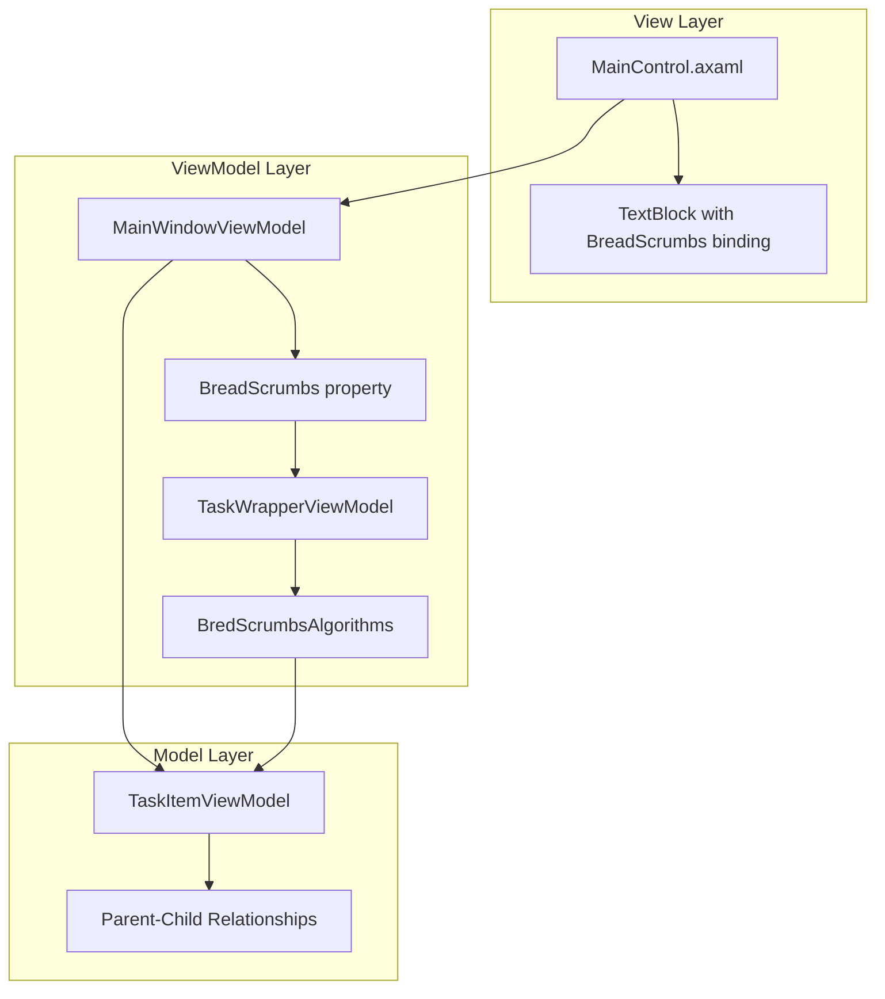
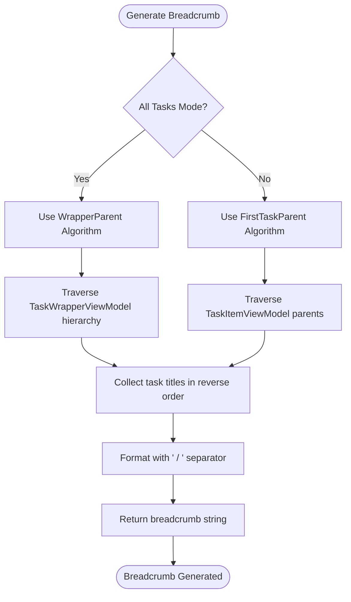
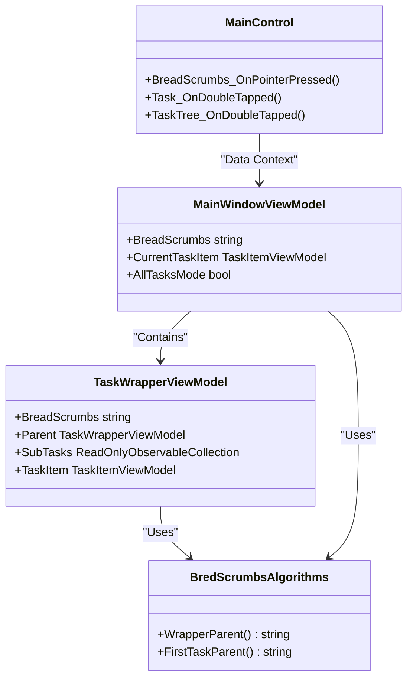

# Breadcrumbs Navigation

<cite>
**Referenced Files in This Document**   
- [MainScreen.axaml.cs](file://src/Unlimotion/Views/MainScreen.axaml.cs)
- [MainWindowViewModel.cs](file://src/Unlimotion.ViewModel/MainWindowViewModel.cs)
- [TaskWrapperViewModel.cs](file://src/Unlimotion.ViewModel/TaskWrapperViewModel.cs)
- [MainControl.axaml](file://src/Unlimotion/Views/MainControl.axaml)
- [MainControl.axaml.cs](file://src/Unlimotion/Views/MainControl.axaml.cs)
</cite>

## Table of Contents
1. [Introduction](#introduction)
2. [Architecture Overview](#architecture-overview)
3. [Core Components](#core-components)
4. [Breadcrumb Generation Algorithms](#breadcrumb-generation-algorithms)
5. [Data Flow and Reactive Updates](#data-flow-and-reactive-updates)
6. [UI Integration and Visual Representation](#ui-integration-and-visual-representation)
7. [Accessibility Considerations](#accessibility-considerations)
8. [Responsive Behavior](#responsive-behavior)
9. [Conclusion](#conclusion)

## Introduction
The breadcrumbs navigation component in Unlimotion provides a hierarchical navigation system that enables users to traverse parent-child relationships within nested task structures. This documentation details the implementation of the breadcrumb trail system, focusing on how it facilitates efficient navigation through the task hierarchy. The component is integrated into the MainScreen interface and works in conjunction with MainWindowViewModel to maintain context across different views. The BredScrumbsAlgorithms class provides the core functionality for generating navigation paths, while reactive programming patterns ensure that the UI updates dynamically as users navigate between tasks. This system allows users to understand their current position within the task hierarchy and easily navigate to parent tasks or related contexts.

## Architecture Overview
The breadcrumbs navigation system follows a reactive MVVM (Model-View-ViewModel) architecture pattern, where the UI components are decoupled from the business logic and data management layers. The MainScreen.axaml view contains the visual representation of the breadcrumb trail, which is bound to the BreadScrumbs property in the MainWindowViewModel. This property is computed based on the current navigation context and task selection. The TaskWrapperViewModel serves as a wrapper around the TaskItemViewModel, providing additional functionality such as breadcrumb generation and hierarchical navigation. The BredScrumbsAlgorithms class contains static methods for generating breadcrumb paths using different traversal strategies. The system leverages ReactiveUI to ensure that changes in the application state are automatically reflected in the UI, creating a seamless user experience. Data flows from the task model through the view model layer to the view, with transformations and formatting applied at each stage.

**Diagram sources**
- [MainControl.axaml](file://src/Unlimotion/Views/MainControl.axaml#L70)
- [MainWindowViewModel.cs](file://src/Unlimotion.ViewModel/MainWindowViewModel.cs#L967)
- [TaskWrapperViewModel.cs](file://src/Unlimotion.ViewModel/TaskWrapperViewModel.cs#L93)

## Core Components
The breadcrumbs navigation system consists of several key components that work together to provide hierarchical navigation functionality. The TaskWrapperViewModel class serves as the foundation, wrapping task items and providing hierarchical context through its Parent property and SubTasks collection. This class implements the DisposableList interface, ensuring proper resource management. The TaskWrapperActions class defines the behavior for breadcrumb generation, child selection, and task removal, with the GetBreadScrumbs property specifying which algorithm to use for path generation. The MainWindowViewModel manages the overall application state and provides the CurrentTaskItem property that determines the context for breadcrumb generation. The MainControl.axaml view contains the UI element that displays the breadcrumb trail, with its Text property bound to the BreadScrumbs property in the view model. The system uses ReactiveUI's WhenAnyValue method to subscribe to changes in the current task selection, ensuring that the breadcrumb trail updates reactively when users navigate between tasks.

**Section sources**
- [TaskWrapperViewModel.cs](file://src/Unlimotion.ViewModel/TaskWrapperViewModel.cs#L0-L124)
- [MainWindowViewModel.cs](file://src/Unlimotion.ViewModel/MainWindowViewModel.cs#L0-L1075)
- [MainControl.axaml](file://src/Unlimotion/Views/MainControl.axaml#L70)

## Breadcrumb Generation Algorithms
The BredScrumbsAlgorithms class provides two primary methods for generating breadcrumb paths: WrapperParent and FirstTaskParent. The WrapperParent method traverses the TaskWrapperViewModel hierarchy, collecting task titles from the current wrapper up to the root parent. It uses a List<string> to store the nodes in reverse order, inserting each title at the beginning of the list to maintain the correct hierarchical sequence. The method continues until it reaches a null parent, indicating the root of the hierarchy. The FirstTaskParent method operates on TaskItemViewModel objects, traversing the ParentsTasks collection to build the breadcrumb path. It uses FirstOrDefault() to retrieve the first parent task, reflecting the application's assumption that tasks typically have a single parent. Both methods use String.Join(" / ", nodes) to format the breadcrumb trail with forward slashes as separators, creating a clear visual hierarchy. The choice between these algorithms depends on the navigation context, with WrapperParent used in the All Tasks view and FirstTaskParent used in other contexts.

**Diagram sources**
- [TaskWrapperViewModel.cs](file://src/Unlimotion.ViewModel/TaskWrapperViewModel.cs#L17-L44)
- [MainWindowViewModel.cs](file://src/Unlimotion.ViewModel/MainWindowViewModel.cs#L967)

## Data Flow and Reactive Updates
The breadcrumbs navigation system implements a reactive data flow pattern to ensure that the UI updates automatically when the application state changes. In MainWindowViewModel, the BreadScrumbs property is computed based on the current navigation mode (AllTasksMode) and the selected task (CurrentTaskItem). The property uses a ternary operator to determine which breadcrumb algorithm to apply, calling either CurrentItem?.BreadScrumbs or BredScrumbsAlgorithms.FirstTaskParent(CurrentTaskItem). The system leverages ReactiveUI's WhenAnyValue method to subscribe to changes in the CurrentTaskItem and DetailsAreOpen properties, triggering updates to the LastOpenedSource collection when appropriate. When a new task is selected, a new TaskWrapperViewModel is created with the appropriate TaskWrapperActions, including the GetBreadScrumbs function. The SubTasks property in TaskWrapperViewModel uses DynamicData to create a reactive pipeline that transforms child tasks into wrapped view models, applies filters, and sorts the results. This reactive approach ensures that changes to the task hierarchy are automatically reflected in the breadcrumb trail without requiring manual UI updates.

**Section sources**
- [MainWindowViewModel.cs](file://src/Unlimotion.ViewModel/MainWindowViewModel.cs#L719-L750)
- [TaskWrapperViewModel.cs](file://src/Unlimotion.ViewModel/TaskWrapperViewModel.cs#L100-L124)

## UI Integration and Visual Representation
The breadcrumb trail is visually represented in the MainControl.axaml view as a TextBlock element positioned in the top grid row of the interface. The Text property is bound to the BreadScrumbs property in the MainWindowViewModel, ensuring that the displayed text reflects the current navigation context. The TextBlock has TextWrapping="Wrap" to accommodate long breadcrumb trails that may not fit in the available horizontal space. The FontWeight is set to "Bold" to make the breadcrumb trail stand out from other interface elements. The PointerPressed event is handled by the BreadScrumbs_OnPointerPressed method in MainControl.axaml.cs, which initiates a drag operation allowing users to drag the current task. This integration with the drag-and-drop system provides an additional interaction method beyond simple navigation. The horizontal alignment is set to "Stretch" to utilize the full width of the container, maximizing the available space for displaying the breadcrumb path. The visual design prioritizes readability and context awareness, helping users understand their position within the task hierarchy at a glance.

**Diagram sources**
- [MainControl.axaml](file://src/Unlimotion/Views/MainControl.axaml#L70)
- [MainControl.axaml.cs](file://src/Unlimotion/Views/MainControl.axaml.cs#L237)
- [MainWindowViewModel.cs](file://src/Unlimotion.ViewModel/MainWindowViewModel.cs#L967)
- [TaskWrapperViewModel.cs](file://src/Unlimotion.ViewModel/TaskWrapperViewModel.cs#L93)

## Accessibility Considerations
The breadcrumbs navigation system incorporates several accessibility features to ensure usability for all users. The TextBlock element used for displaying the breadcrumb trail inherits accessibility properties from the Avalonia UI framework, making it accessible to screen readers. The use of semantic text formatting with forward slashes as separators creates a clear hierarchical structure that can be easily interpreted by assistive technologies. While the codebase does not explicitly implement keyboard navigation for the breadcrumb trail itself, the surrounding interface elements follow standard accessibility patterns. The PointerPressed event handler for drag operations could potentially be extended to support keyboard-based interactions, such as using the Enter key to initiate a drag operation. The visual design with bold text and high contrast colors improves readability for users with visual impairments. The system's reactive nature ensures that screen readers receive timely updates when the breadcrumb trail changes, maintaining synchronization between the visual interface and assistive technologies. Future enhancements could include ARIA labels or roles to provide additional context for screen reader users.

**Section sources**
- [MainControl.axaml](file://src/Unlimotion/Views/MainControl.axaml#L70)
- [MainControl.axaml.cs](file://src/Unlimotion/Views/MainControl.axaml.cs#L237)

## Responsive Behavior
The breadcrumbs navigation component demonstrates responsive behavior to accommodate varying screen sizes and available space. The TextBlock element uses TextWrapping="Wrap" to allow the breadcrumb trail to span multiple lines when the available horizontal space is limited. This ensures that even long breadcrumb paths remain visible and readable on smaller screens. The horizontal alignment is set to "Stretch", causing the TextBlock to expand to fill the available width in its container. This maximizes the use of available space while allowing the text to wrap naturally when necessary. The font size and styling are inherited from the application's global styles, ensuring consistency across different screen sizes and resolutions. The system does not implement responsive truncation or collapsible breadcrumb patterns, instead relying on text wrapping to handle overflow. This approach prioritizes complete visibility of the breadcrumb trail over compactness, ensuring that users can always see their full navigation path regardless of screen size. The integration with the MainControl layout ensures that the breadcrumb area adjusts proportionally as the window is resized.

**Section sources**
- [MainControl.axaml](file://src/Unlimotion/Views/MainControl.axaml#L70)

## Conclusion
The breadcrumbs navigation system in Unlimotion provides an effective solution for hierarchical navigation through nested task structures. By leveraging the MVVM pattern and reactive programming principles, the system maintains a clean separation between UI presentation and business logic while ensuring that the interface updates automatically in response to state changes. The implementation of multiple breadcrumb generation algorithms allows for context-specific navigation patterns, adapting to different views within the application. The integration with the TaskWrapperViewModel provides a robust foundation for hierarchical data representation, while the use of ReactiveUI ensures efficient and responsive updates. The visual design prioritizes clarity and context awareness, helping users understand their position within the task hierarchy. While the current implementation focuses on mouse-driven interactions, there are opportunities to enhance accessibility through keyboard navigation support. The responsive design ensures usability across different screen sizes, making the system adaptable to various device form factors. Overall, the breadcrumbs navigation component effectively supports the application's goal of providing intuitive navigation through complex task hierarchies.