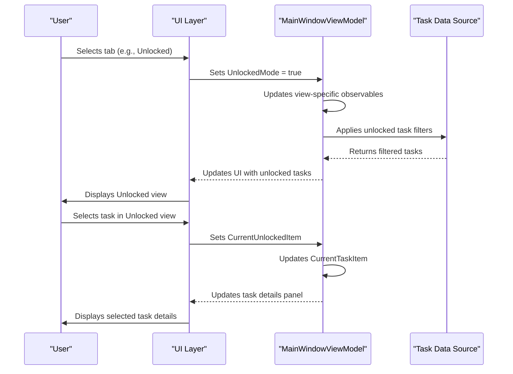

# Interface Components

<cite>
**Referenced Files in This Document**   
- [MainWindow.axaml.cs](file://src/Unlimotion/Views/MainWindow.axaml.cs)
- [MainScreen.axaml.cs](file://src/Unlimotion/Views/MainScreen.axaml.cs)
- [MainWindowViewModel.cs](file://src/Unlimotion.ViewModel/MainWindowViewModel.cs)
- [TaskWrapperViewModel.cs](file://src/Unlimotion.ViewModel/TaskWrapperViewModel.cs)
- [GraphControl.axaml.cs](file://src/Unlimotion/Views/GraphControl.axaml.cs)
- [README.md](file://README.md)
</cite>

## Table of Contents
1. [Three-Part Interface Layout](#three-part-interface-layout)
2. [Tabbed Views and Navigation](#tabbed-views-and-navigation)
3. [View Switching Implementation](#view-switching-implementation)
4. [Visual Design Elements](#visual-design-elements)
5. [Core Task Management Workflow](#core-task-management-workflow)
6. [Accessibility and Responsive Design](#accessibility-and-responsive-design)

## Three-Part Interface Layout

The Unlimotion interface follows a three-part layout designed to provide comprehensive task management capabilities while maintaining intuitive navigation. The top section displays breadcrumbs that show the hierarchical path of the currently selected task, allowing users to understand the task's position within the overall task tree structure. This breadcrumb navigation is implemented through the `BreadScrumbsAlgorithms.FirstTaskParent` method in the `TaskWrapperViewModel` class, which traverses parent tasks to construct the hierarchical path.

The right panel contains the detailed information view for the currently selected task, displaying all available fields for viewing and editing. This task details panel provides access to task properties such as title, description, planned dates, importance, and completion status. The left panel houses the tabbed interface that allows users to switch between different task perspectives, providing multiple ways to view and organize tasks based on various criteria.

This three-part layout supports the core task management workflow by simultaneously providing context (breadcrumbs), detailed information (task panel), and organizational views (tabs), enabling users to efficiently navigate complex task hierarchies while maintaining focus on specific tasks.

**Section sources**
- [README.md](file://README.md#L82-L87)
- [TaskWrapperViewModel.cs](file://src/Unlimotion.ViewModel/TaskWrapperViewModel.cs#L45-L57)
- [MainWindowViewModel.cs](file://src/Unlimotion.ViewModel/MainWindowViewModel.cs#L970-L972)

## Tabbed Views and Navigation

The left panel of the Unlimotion interface features a tabbed navigation system that provides multiple perspectives on task data. Each tab serves a specific purpose in the task management workflow:

### All Tasks
The All Tasks tab presents a hierarchical view of all tasks, with root-level tasks (those without parents) displayed at the top level. This view allows users to navigate the complete task tree structure, expand and collapse nested tasks, and visualize the relationships between parent and child tasks. The hierarchical representation is particularly useful for understanding the overall project structure and managing complex task dependencies.

### Last Created
The Last Created tab displays tasks in chronological order based on their creation date, with the most recently created tasks appearing at the top. This view helps users quickly access recently added tasks and track their recent workflow activities. The implementation uses a descending sort order on the `CreatedDateTime` property to ensure the most recent tasks are immediately visible.

### Unlocked
The Unlocked tab, also referred to as the "Window of Opportunity," shows only tasks that are currently available for execution. A task is considered unlocked when it has no uncompleted blocking tasks and meets all prerequisites for completion. This view helps users focus on actionable items and prioritize their immediate work, filtering out tasks that cannot be worked on yet due to dependencies.

### Completed
The Completed tab displays a list of finished tasks in reverse chronological order, with the most recently completed tasks at the top. This view serves as a record of accomplishments and allows users to review completed work. The implementation sorts tasks by `CompletedDateTime` in descending order to maintain this chronological presentation.

### Archived
The Archived tab shows tasks that have been archived, typically tasks that are no longer relevant but should be preserved for reference. These tasks are displayed in reverse chronological order based on their archive date. Archiving provides a way to remove tasks from active views without permanent deletion, maintaining a clean workspace while preserving historical information.

### Roadmap
The Roadmap tab presents tasks as a directed graph, visualizing the relationships between tasks in a manner inspired by development trees in games. This graph view uses green arrows to represent parent-child relationships and red arrows to indicate blocking relationships. The implementation in `GraphControl.axaml.cs` constructs the graph by analyzing task relationships and rendering them as a visual network, allowing users to understand complex dependency chains and identify critical paths to goals.

### Settings
The Settings tab provides access to application configuration options, including storage paths, server connections, and backup settings. Users can modify parameters that affect the application's behavior, such as the task storage location, Git integration settings, and server connection details. This centralized configuration interface ensures that all settings are easily accessible and modifiable.

**Section sources**
- [README.md](file://README.md#L88-L114)
- [MainWindowViewModel.cs](file://src/Unlimotion.ViewModel/MainWindowViewModel.cs#L960-L972)
- [GraphControl.axaml.cs](file://src/Unlimotion/Views/GraphControl.axaml.cs#L100-L200)

## View Switching Implementation

The view switching functionality in Unlimotion is implemented through boolean properties in the `MainWindowViewModel` class that control which tab is currently active. The implementation uses a set of boolean flags (`AllTasksMode`, `UnlockedMode`, `CompletedMode`, etc.) to track the current view state. When a user selects a different tab, the corresponding boolean property is set to true while others are set to false, triggering UI updates through data binding.

The `MainWindowViewModel` class manages the data sources for each view through observable collections that are filtered and sorted according to the current view's requirements. For example, the `CurrentItems` collection is used for the All Tasks view, while `UnlockedItems` is used for the Unlocked view. These collections are populated through reactive programming patterns using DynamicData, which automatically updates the UI when underlying data changes.

The implementation uses ReactiveUI's `WhenAnyValue` method to subscribe to changes in the current task selection across all tabs. This ensures that when a task is selected in any view, it becomes the current task throughout the application. The code in `MainWindowViewModel.cs` includes subscriptions that synchronize the `CurrentTaskItem` property across different tab-specific current item properties (`CurrentItem`, `CurrentUnlockedItem`, etc.).

**Diagram sources**
- [MainWindowViewModel.cs](file://src/Unlimotion.ViewModel/MainWindowViewModel.cs#L117-L152)
- [MainWindowViewModel.cs](file://src/Unlimotion.ViewModel/MainWindowViewModel.cs#L941-L972)

## Visual Design Elements

Unlimotion incorporates several visual design elements to enhance usability and provide immediate context about tasks. The most distinctive feature is emoji inheritance, where emoji from parent tasks are displayed alongside child tasks in non-hierarchical views. This visual cue helps users quickly identify the origin and context of tasks, even when viewing them in chronological or filtered lists. The emoji is extracted from the task title using a regular expression pattern that matches Unicode emoji characters.

The filtering system is tightly integrated with the visual design, allowing users to quickly filter tasks by emoji. When a user enables an emoji filter, all tasks containing that emoji (or containing tasks with that emoji) are highlighted or made visible according to the filter settings. This creates a visual grouping effect that helps users focus on specific categories of tasks without relying solely on text-based tags.

The interface also uses visual indicators to communicate task states and relationships. Blocked tasks are displayed with reduced opacity to indicate they are not currently actionable. The roadmap view uses color-coded arrows (green for parent-child relationships, red for blocking relationships) to make complex dependencies immediately understandable. These visual cues reduce cognitive load by providing instant recognition of task status and relationships without requiring users to interpret text labels.

The breadcrumb navigation at the top of the interface provides a visual representation of the task hierarchy, showing the path from root tasks to the currently selected task. This hierarchical context helps users understand where a task fits within the larger project structure, preventing disorientation when navigating deep task hierarchies.

**Section sources**
- [README.md](file://README.md#L180-L186)
- [TaskItemViewModel.cs](file://src/Unlimotion.ViewModel/TaskItemViewModel.cs#L600-L605)
- [MainWindowViewModel.cs](file://src/Unlimotion.ViewModel/MainWindowViewModel.cs#L200-L300)

## Core Task Management Workflow

The Unlimotion interface components work together to support a comprehensive task management workflow that emphasizes flexibility, visibility, and efficiency. The three-part layout enables users to simultaneously maintain context (through breadcrumbs), focus on details (through the task panel), and organize tasks (through tabbed views), creating a seamless workflow for managing complex task hierarchies.

The tabbed navigation system supports different phases of task management: planning (All Tasks), execution (Unlocked), review (Completed, Archived), and strategic planning (Roadmap). Users can start with the All Tasks view to understand the overall project structure, switch to the Unlocked view to focus on immediate priorities, and use the Roadmap view to visualize long-term goals and dependencies.

The implementation supports efficient task creation and organization through keyboard shortcuts and drag-and-drop functionality. Users can create sibling tasks (Ctrl+Enter), blocked sibling tasks (Shift+Enter), and inner tasks (Ctrl+Tab) directly from the interface. Drag-and-drop operations allow for quick reorganization of tasks, with modifier keys enabling different operations: Shift for moving, Ctrl for blocking, Alt for being blocked by, and Ctrl+Shift for cloning.

The visual design elements, particularly emoji inheritance and filtering, support rapid task identification and grouping. This reduces the need for formal tagging systems while providing similar benefits in terms of task organization and retrieval. The combination of hierarchical, chronological, and dependency-based views ensures that users can approach their tasks from multiple perspectives, adapting the interface to their current workflow needs.

**Section sources**
- [README.md](file://README.md#L140-L180)
- [MainWindowViewModel.cs](file://src/Unlimotion.ViewModel/MainWindowViewModel.cs#L80-L119)
- [TaskWrapperViewModel.cs](file://src/Unlimotion.ViewModel/TaskWrapperViewModel.cs#L0-L44)

## Accessibility and Responsive Design

The Unlimotion interface is designed to be accessible and responsive across different screen sizes and user needs. The three-part layout adapts to available screen space, with the tabbed navigation on the left, breadcrumbs on top, and task details on the right providing a balanced distribution of interface elements. On smaller screens, the layout can be adjusted to prioritize the most relevant information based on the current task management context.

The implementation uses Avalonia UI framework, which provides cross-platform compatibility and responsive design capabilities. The interface components are designed to scale appropriately on different devices, from desktop monitors to smaller laptop screens. The tabbed navigation system ensures that users can access all functionality without requiring excessive scrolling or navigation.

Accessibility features include keyboard navigation support, with dedicated shortcuts for common operations. The use of visual indicators (emoji, color-coded arrows, opacity changes) provides alternative ways to understand task relationships and status beyond text alone, benefiting users with different cognitive preferences. The breadcrumb navigation provides clear hierarchical context, reducing the cognitive load of tracking task relationships in complex hierarchies.

The responsive design ensures that the interface remains functional and usable regardless of screen size. The separation of concerns between the three main interface components (breadcrumbs, task details, and tabbed views) allows each section to adapt independently to available space while maintaining overall coherence. This approach ensures that users can effectively manage tasks whether working on a large desktop monitor or a smaller portable device.

**Section sources**
- [MainWindow.axaml.cs](file://src/Unlimotion/Views/MainWindow.axaml.cs#L0-L12)
- [MainScreen.axaml.cs](file://src/Unlimotion/Views/MainScreen.axaml.cs#L0-L12)
- [README.md](file://README.md#L20-L35)