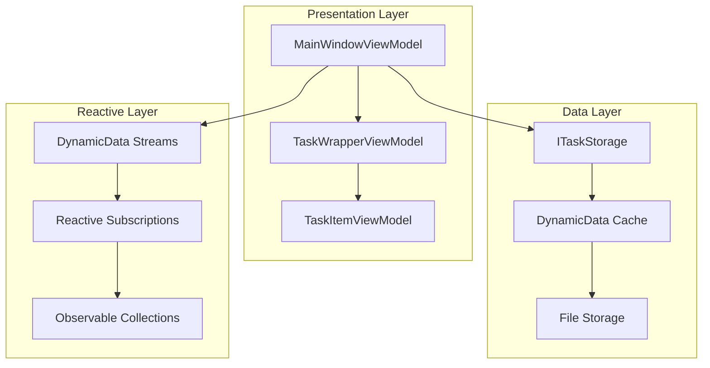
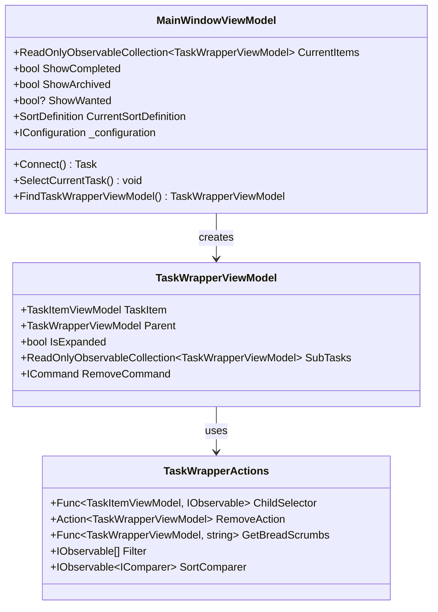
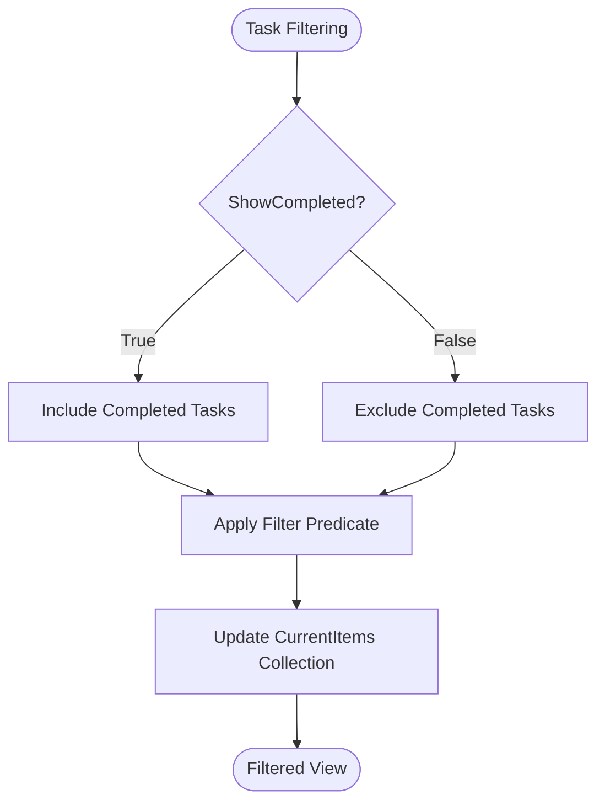
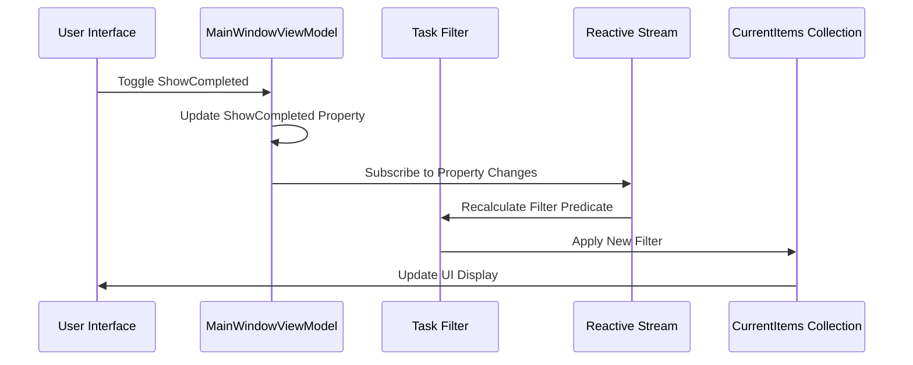
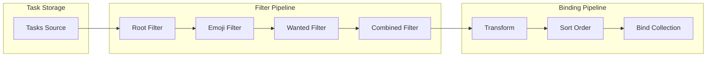
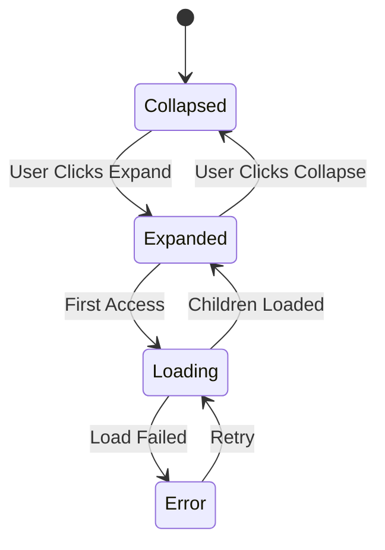
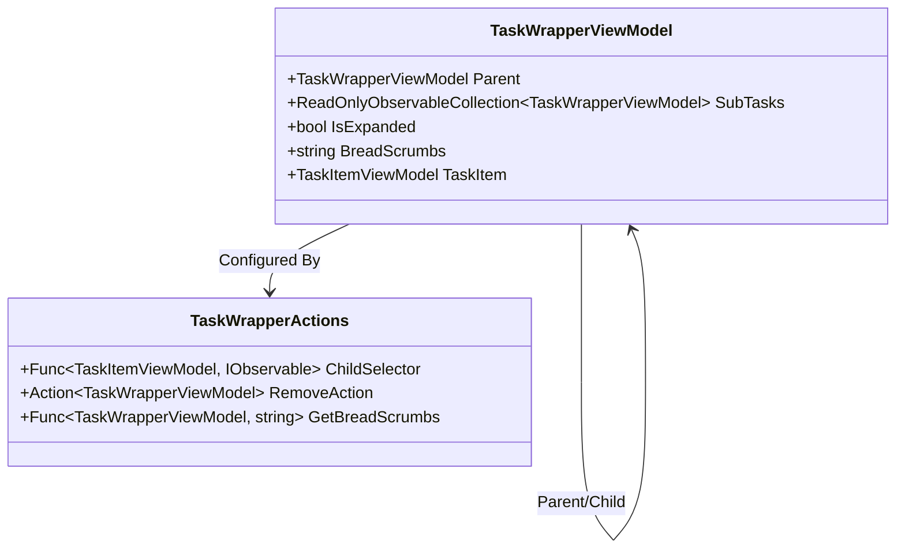
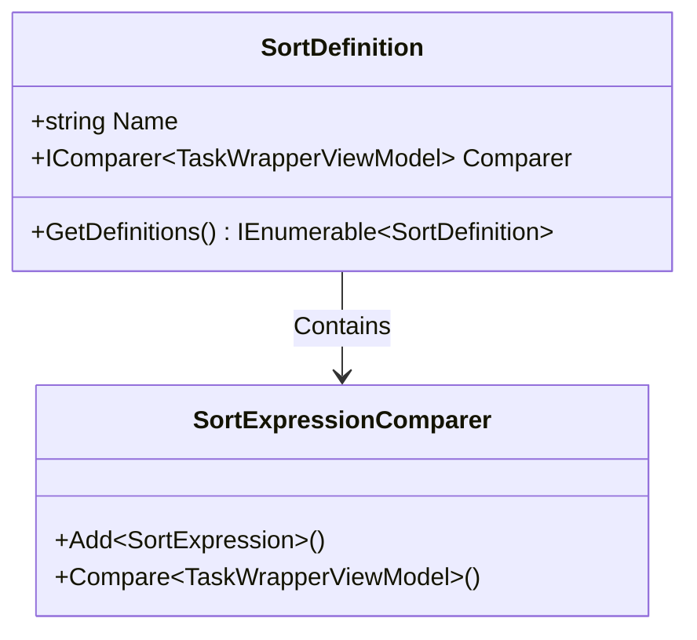
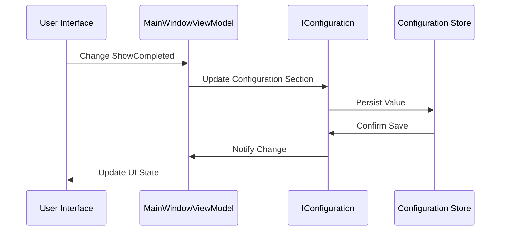

# All Tasks View

<cite>
**Referenced Files in This Document**
- [MainWindowViewModel.cs](file://src/Unlimotion.ViewModel/MainWindowViewModel.cs)
- [TaskWrapperViewModel.cs](file://src/Unlimotion.ViewModel/TaskWrapperViewModel.cs)
- [TaskItemViewModel.cs](file://src/Unlimotion.ViewModel/TaskItemViewModel.cs)
- [SortDefinition.cs](file://src/Unlimotion.ViewModel/SortDefinition.cs)
- [Options.cs](file://src/Unlimotion.ViewModel/Options.cs)
- [UnlockedTimeFilter.cs](file://src/Unlimotion.ViewModel/UnlockedTimeFilter.cs)
- [README.md](file://README.md)
</cite>

## Table of Contents
1. [Introduction](#introduction)
2. [System Architecture Overview](#system-architecture-overview)
3. [Core Components](#core-components)
4. [Task Filtering and Visibility Control](#task-filtering-and-visibility-control)
5. [DynamicData Binding and Reactive Streams](#dynamicdata-binding-and-reactive-streams)
6. [TaskWrapperViewModel and Tree Structure](#taskwrapperviewmodel-and-tree-structure)
7. [Sorting Mechanisms](#sorting-mechanisms)
8. [Configuration Persistence](#configuration-persistence)
9. [Keyboard Navigation](#keyboard-navigation)
10. [Performance Considerations](#performance-considerations)
11. [Troubleshooting Guide](#troubleshooting-guide)
12. [Conclusion](#conclusion)

## Introduction

The All Tasks view in Unlimotion represents the hierarchical task management system that forms the core of the application's functionality. This view displays the complete tree structure of tasks, allowing users to navigate through unlimited levels of task nesting while maintaining parent-child relationships and task dependencies. The implementation leverages ReactiveUI and DynamicData libraries to provide real-time updates and responsive user interactions.

The All Tasks view serves as the primary interface for task management, displaying root-level tasks that form the foundation of the task hierarchy. Users can expand and collapse task branches, apply various filters, and sort tasks according to multiple criteria to efficiently manage their workload.

## System Architecture Overview

The All Tasks view architecture follows a layered approach with clear separation of concerns:

**Diagram sources**
- [MainWindowViewModel.cs](file://src/Unlimotion.ViewModel/MainWindowViewModel.cs#L1-L50)
- [TaskWrapperViewModel.cs](file://src/Unlimotion.ViewModel/TaskWrapperViewModel.cs#L1-L30)

The architecture implements a reactive pattern where changes in the underlying data automatically propagate through the view model hierarchy, ensuring that the UI remains synchronized with the data state.

**Section sources**
- [MainWindowViewModel.cs](file://src/Unlimotion.ViewModel/MainWindowViewModel.cs#L1-L100)
- [TaskWrapperViewModel.cs](file://src/Unlimotion.ViewModel/TaskWrapperViewModel.cs#L1-L50)

## Core Components

### MainWindowViewModel

The MainWindowViewModel serves as the central coordinator for the All Tasks view, managing collections of tasks and coordinating filtering, sorting, and display logic.

**Diagram sources**
- [MainWindowViewModel.cs](file://src/Unlimotion.ViewModel/MainWindowViewModel.cs#L20-L80)
- [TaskWrapperViewModel.cs](file://src/Unlimotion.ViewModel/TaskWrapperViewModel.cs#L12-L25)

### TaskItemViewModel

The TaskItemViewModel represents individual tasks with full data binding capabilities and reactive property change notifications.

**Section sources**
- [MainWindowViewModel.cs](file://src/Unlimotion.ViewModel/MainWindowViewModel.cs#L20-L100)
- [TaskWrapperViewModel.cs](file://src/Unlimotion.ViewModel/TaskWrapperViewModel.cs#L12-L50)
- [TaskItemViewModel.cs](file://src/Unlimotion.ViewModel/TaskItemViewModel.cs#L20-L80)

## Task Filtering and Visibility Control

The All Tasks view implements a sophisticated filtering system controlled by three primary flags: ShowCompleted, ShowArchived, and ShowWanted.

### ShowCompleted Flag

The ShowCompleted flag controls whether completed tasks are visible in the All Tasks view. When enabled, completed tasks appear in their respective positions within the hierarchy, maintaining their parent-child relationships.

**Diagram sources**
- [MainWindowViewModel.cs](file://src/Unlimotion.ViewModel/MainWindowViewModel.cs#L280-L290)

### ShowArchived Flag

The ShowArchived flag manages the visibility of archived tasks, which represent tasks that are no longer actively worked on but are retained for historical reference.

### ShowWanted Flag

The ShowWanted flag provides granular control over tasks marked as "wanted," allowing users to focus on tasks they've specifically designated as important or desired.

### Filter Implementation

The filtering logic is implemented as a reactive stream that automatically updates when any filter flag changes:

**Diagram sources**
- [MainWindowViewModel.cs](file://src/Unlimotion.ViewModel/MainWindowViewModel.cs#L45-L55)

**Section sources**
- [MainWindowViewModel.cs](file://src/Unlimotion.ViewModel/MainWindowViewModel.cs#L280-L300)
- [MainWindowViewModel.cs](file://src/Unlimotion.ViewModel/MainWindowViewModel.cs#L36-L55)

## DynamicData Binding and Reactive Streams

The All Tasks view leverages DynamicData for efficient data binding and reactive updates. The system establishes multiple reactive streams that automatically propagate changes through the task hierarchy.

### Root-Level Task Binding

Root-level tasks are identified and bound using a specialized filter that excludes tasks with parent relationships:

**Diagram sources**
- [MainWindowViewModel.cs](file://src/Unlimotion.ViewModel/MainWindowViewModel.cs#L320-L350)

### Reactive Subscription Management

The MainWindowViewModel manages numerous reactive subscriptions that ensure the UI stays synchronized with data changes:

| Subscription Type | Purpose | Trigger Conditions |
|------------------|---------|-------------------|
| Property Changes | Configuration persistence | ShowCompleted, ShowArchived, ShowWanted, SortDefinition |
| Task Changes | Real-time updates | Task additions, modifications, deletions |
| Filter Changes | Dynamic filtering | Emoji filters, date filters, custom filters |
| Sort Changes | Dynamic sorting | SortDefinition changes, sort direction changes |

**Section sources**
- [MainWindowViewModel.cs](file://src/Unlimotion.ViewModel/MainWindowViewModel.cs#L320-L400)
- [MainWindowViewModel.cs](file://src/Unlimotion.ViewModel/MainWindowViewModel.cs#L45-L55)

## TaskWrapperViewModel and Tree Structure

The TaskWrapperViewModel serves as the bridge between the raw task data and the UI presentation layer, providing expandable tree behavior and maintaining parent-child relationships.

### Tree Expansion Behavior

**Diagram sources**
- [TaskWrapperViewModel.cs](file://src/Unlimotion.ViewModel/TaskWrapperViewModel.cs#L85-L120)

### Parent-Child Relationship Management

The TaskWrapperViewModel maintains bidirectional relationships between parent and child tasks:

**Diagram sources**
- [TaskWrapperViewModel.cs](file://src/Unlimotion.ViewModel/TaskWrapperViewModel.cs#L85-L124)

### Lazy Loading Implementation

The SubTasks collection implements lazy loading to optimize performance:

**Section sources**
- [TaskWrapperViewModel.cs](file://src/Unlimotion.ViewModel/TaskWrapperViewModel.cs#L85-L124)
- [TaskItemViewModel.cs](file://src/Unlimotion.ViewModel/TaskItemViewModel.cs#L474-L512)

## Sorting Mechanisms

The All Tasks view supports multiple sorting criteria through the SortDefinition system, with separate configurations for different views.

### Available Sort Definitions

| Sort Type | Criteria | Direction | Use Case |
|-----------|----------|-----------|----------|
| Comfort | Completion, Archive, Unlock, Creation dates | Ascending | Natural workflow progression |
| Emodji | Emoji presence and ordering | Ascending | Visual organization |
| Created Ascending | Task creation timestamp | Ascending | Chronological order |
| Created Descending | Task creation timestamp | Descending | Recent tasks first |
| Title Ascending | Task title text | Ascending | Alphabetical organization |
| Title Descending | Task title text | Descending | Reverse alphabetical |
| Importance | Task importance rating | Ascending | Priority-based sorting |

### Sort Definition Implementation

**Diagram sources**
- [SortDefinition.cs](file://src/Unlimotion.ViewModel/SortDefinition.cs#L5-L15)

**Section sources**
- [SortDefinition.cs](file://src/Unlimotion.ViewModel/SortDefinition.cs#L1-L50)
- [MainWindowViewModel.cs](file://src/Unlimotion.ViewModel/MainWindowViewModel.cs#L1021-L1047)

## Configuration Persistence

The All Tasks view state is persisted across sessions using the IConfiguration system, ensuring that user preferences are maintained between application launches.

### Persistence Mechanism

Configuration persistence is implemented through reactive subscriptions that automatically save state changes:

**Diagram sources**
- [MainWindowViewModel.cs](file://src/Unlimotion.ViewModel/MainWindowViewModel.cs#L45-L55)

### Configuration Sections

| Setting | Section | Type | Purpose |
|---------|---------|------|---------|
| ShowCompleted | AllTasks:ShowCompleted | bool | Control completed task visibility |
| ShowArchived | AllTasks:ShowArchived | bool | Control archived task visibility |
| ShowWanted | AllTasks:ShowWanted | bool? | Control wanted task filtering |
| CurrentSortDefinition | AllTasks:CurrentSortDefinition | string | Active sort definition name |
| CurrentSortDefinitionForUnlocked | AllTasks:CurrentSortDefinitionForUnlocked | string | Unlocked view sort definition |

**Section sources**
- [MainWindowViewModel.cs](file://src/Unlimotion.ViewModel/MainWindowViewModel.cs#L36-L55)

## Keyboard Navigation

While the primary documentation focuses on the All Tasks view's filtering and sorting capabilities, the system supports keyboard navigation for efficient task management. Users can navigate through the task hierarchy using standard keyboard shortcuts and perform actions without relying solely on mouse interactions.

## Performance Considerations

The All Tasks view implements several performance optimization strategies:

### Memory Management

- **Lazy Loading**: SubTasks are loaded only when a task is expanded
- **Disposable Pattern**: Proper cleanup of reactive subscriptions
- **Weak References**: Prevention of memory leaks in long-running applications

### Reactive Stream Optimization

- **Throttling**: Property change events are throttled to prevent excessive updates
- **Selective Updates**: Only affected portions of the tree are re-rendered
- **Batch Operations**: Multiple changes are batched together for efficiency

### Data Structure Efficiency

- **Indexed Collections**: Fast lookup of tasks by ID
- **Cached Calculations**: Pre-computed values for frequently accessed data
- **Incremental Updates**: Minimal DOM/Drawing updates for partial changes

## Troubleshooting Guide

### Common Issues and Solutions

**Issue**: Tasks not updating in real-time
- **Cause**: Reactive subscription failure
- **Solution**: Check subscription disposal and ensure proper initialization order

**Issue**: Performance degradation with large task trees
- **Cause**: Excessive reactive updates
- **Solution**: Implement throttling and optimize filter predicates

**Issue**: Configuration persistence failures
- **Cause**: Configuration service unavailable
- **Solution**: Implement fallback mechanisms and error handling

**Issue**: Memory leaks in long-running sessions
- **Cause**: Unclosed reactive subscriptions
- **Solution**: Ensure proper disposal of DisposableList instances

**Section sources**
- [MainWindowViewModel.cs](file://src/Unlimotion.ViewModel/MainWindowViewModel.cs#L799-L850)

## Conclusion

The All Tasks view in Unlimotion represents a sophisticated implementation of hierarchical task management with real-time updates, flexible filtering, and robust persistence. The combination of ReactiveUI and DynamicData libraries enables a responsive user experience while maintaining clean separation of concerns.

The system's architecture supports unlimited task nesting, complex parent-child relationships, and multiple filtering criteria, making it suitable for both personal productivity and complex project management scenarios. The reactive nature of the implementation ensures that changes propagate instantly throughout the application, providing users with immediate feedback on their actions.

Future enhancements could include advanced search capabilities, improved keyboard navigation, and enhanced collaboration features, building upon the solid foundation established by the current implementation.