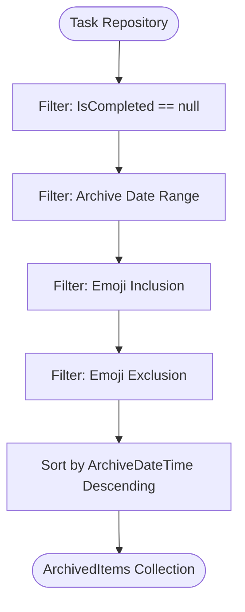
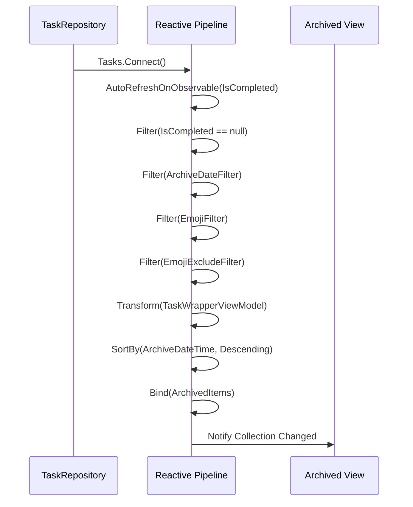
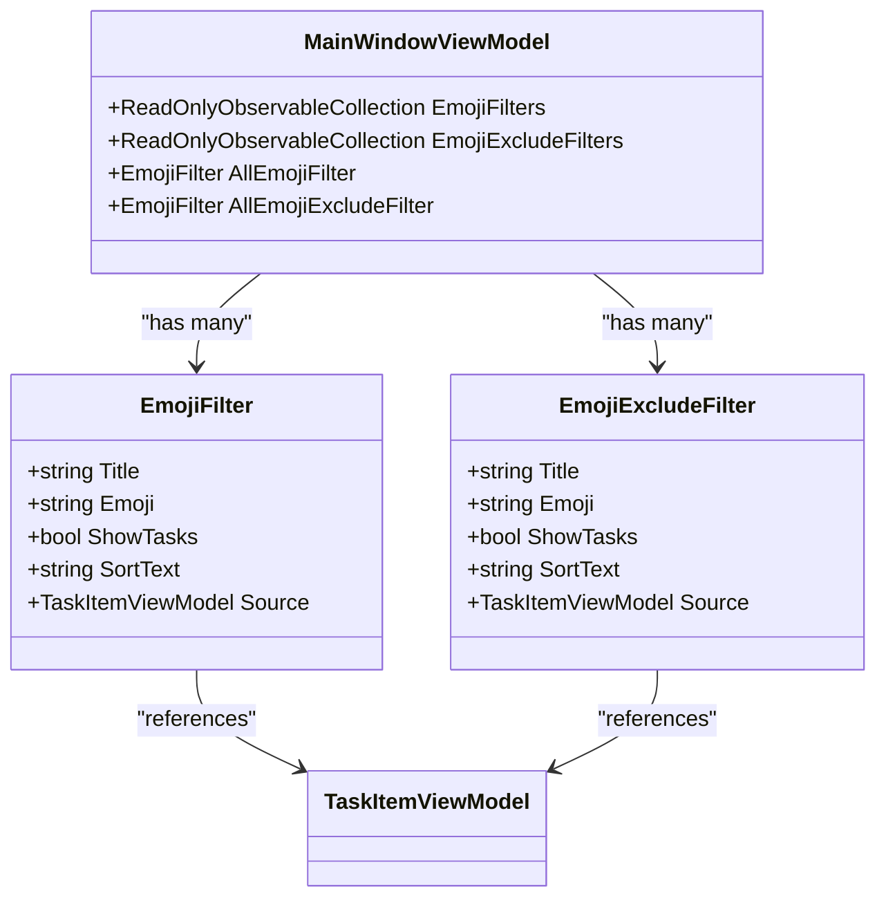
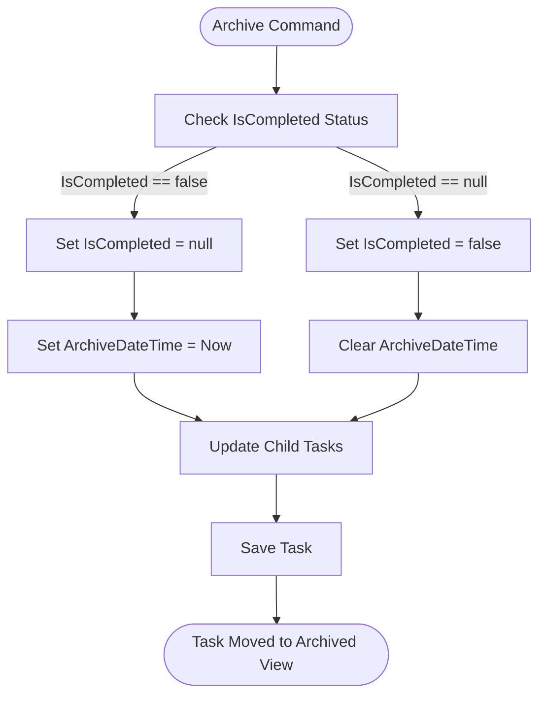
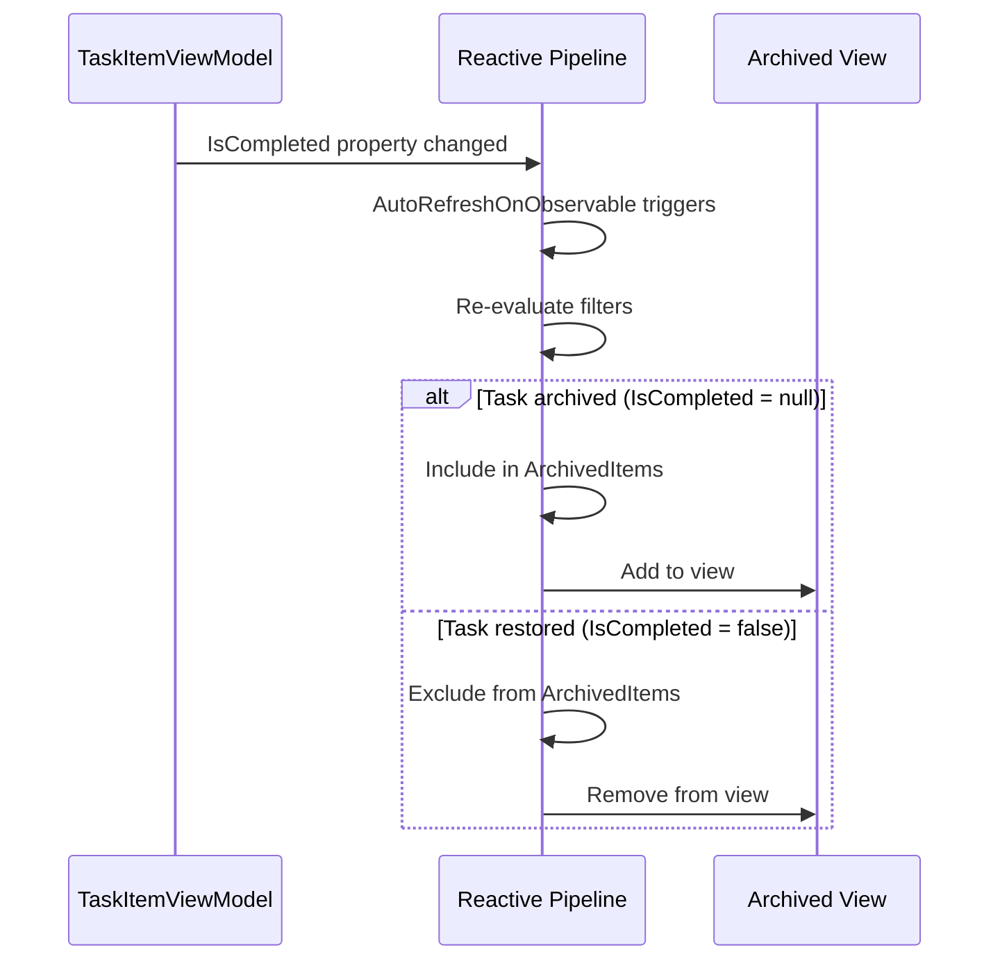
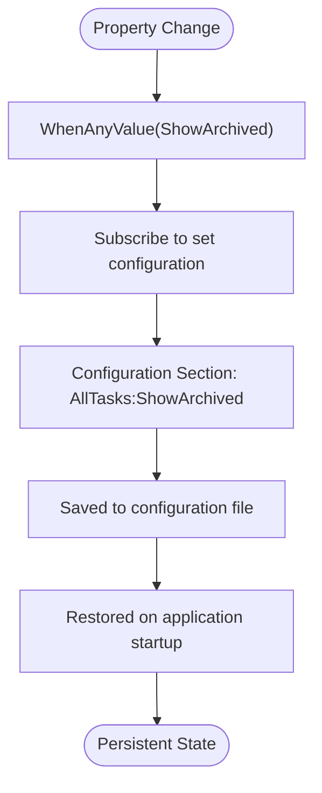
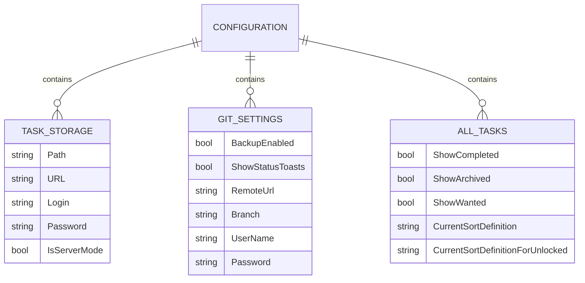

# Archived View

<cite>
**Referenced Files in This Document**   
- [MainWindowViewModel.cs](file://src/Unlimotion.ViewModel/MainWindowViewModel.cs)
- [TaskItemViewModel.cs](file://src/Unlimotion.ViewModel/TaskItemViewModel.cs)
- [DateFilter.cs](file://src/Unlimotion.ViewModel/DateFilter.cs)
- [TaskStorageSettings.cs](file://src/Unlimotion.ViewModel/TaskStorageSettings.cs)
- [SettingsViewModel.cs](file://src/Unlimotion.ViewModel/SettingsViewModel.cs)
</cite>

## Table of Contents
1. [Introduction](#introduction)
2. [Archived View Data Filtering](#archived-view-data-filtering)
3. [Reactive Binding Pipeline](#reactive-binding-pipeline)
4. [Emoji and Exclusion Filters](#emoji-and-exclusion-filters)
5. [Task Archiving and Restoration](#task-archiving-and-restoration)
6. [Dynamic Updates and State Persistence](#dynamic-updates-and-state-persistence)
7. [Configuration and Settings](#configuration-and-settings)

## Introduction
The Archived view in Unlimotion displays tasks that are neither completed nor active, specifically those with `IsCompleted == null`. This view provides users with a dedicated space to manage tasks that have been archived for future reference or temporary removal from active workflows. The implementation leverages ReactiveUI and DynamicData libraries to create a responsive, reactive pipeline that connects the task repository to the UI, ensuring real-time updates and efficient filtering.

**Section sources**
- [MainWindowViewModel.cs](file://src/Unlimotion.ViewModel/MainWindowViewModel.cs#L622-L655)

## Archived View Data Filtering
The Archived view filters tasks based on their completion status and archive date. The primary filter condition is `IsCompleted == null`, which identifies tasks that have been archived but not completed. This filtering is implemented in the `MainWindowViewModel` using DynamicData's filtering capabilities:

**Diagram sources**
- [MainWindowViewModel.cs](file://src/Unlimotion.ViewModel/MainWindowViewModel.cs#L622-L655)
- [DateFilter.cs](file://src/Unlimotion.ViewModel/DateFilter.cs#L0-L75)

**Section sources**
- [MainWindowViewModel.cs](file://src/Unlimotion.ViewModel/MainWindowViewModel.cs#L622-L655)
- [DateFilter.cs](file://src/Unlimotion.ViewModel/DateFilter.cs#L0-L75)

## Reactive Binding Pipeline
The reactive binding pipeline connects the task repository to the UI through a series of observable transformations. This pipeline ensures that changes in the task repository are automatically reflected in the Archived view:

The pipeline uses DynamicData's `Connect()` method to establish a continuous stream of updates from the task repository. Each transformation in the pipeline is applied reactively, ensuring that the view remains synchronized with the underlying data.

**Diagram sources**
- [MainWindowViewModel.cs](file://src/Unlimotion.ViewModel/MainWindowViewModel.cs#L622-L655)

**Section sources**
- [MainWindowViewModel.cs](file://src/Unlimotion.ViewModel/MainWindowViewModel.cs#L622-L655)

## Emoji and Exclusion Filters
The Archived view supports emoji-based filtering to help users organize and find tasks more efficiently. Two types of emoji filters are implemented: inclusion filters and exclusion filters. These filters allow users to refine the displayed tasks based on emoji tags:

The inclusion filter shows only tasks that match the selected emoji, while the exclusion filter hides tasks containing the selected emoji. Both filters are applied in the reactive pipeline after the date filter, ensuring that emoji filtering operates on the already date-filtered collection.

**Diagram sources**
- [MainWindowViewModel.cs](file://src/Unlimotion.ViewModel/MainWindowViewModel.cs#L280-L315)
- [MainWindowViewModel.cs](file://src/Unlimotion.ViewModel/MainWindowViewModel.cs#L313-L350)

**Section sources**
- [MainWindowViewModel.cs](file://src/Unlimotion.ViewModel/MainWindowViewModel.cs#L280-L350)

## Task Archiving and Restoration
Tasks are moved to the Archived view through the archiving process, which sets `IsCompleted` to `null` and records the `ArchiveDateTime`. The archiving functionality is implemented in the `TaskItemViewModel` class:

When a task is archived, all its child tasks are also archived recursively. This ensures that entire task hierarchies can be moved to the archive together. The archiving process is confirmed through a user dialog to prevent accidental archiving.

**Diagram sources**
- [TaskItemViewModel.cs](file://src/Unlimotion.ViewModel/TaskItemViewModel.cs#L136-L171)
- [TaskItemViewModel.cs](file://src/Unlimotion.ViewModel/TaskItemViewModel.cs#L534-L573)

**Section sources**
- [TaskItemViewModel.cs](file://src/Unlimotion.ViewModel/TaskItemViewModel.cs#L136-L171)
- [TaskItemViewModel.cs](file://src/Unlimotion.ViewModel/TaskItemViewModel.cs#L534-L573)

## Dynamic Updates and State Persistence
The Archived view handles dynamic updates when tasks are archived or restored through the reactive binding pipeline. When a task's `IsCompleted` status changes, the `AutoRefreshOnObservable` mechanism triggers a refresh of the filtered collection:

The view state, including filter settings and sort order, is persisted across application restarts through the configuration system. The `MainWindowViewModel` subscribes to property changes and saves them to the configuration:

**Diagram sources**
- [MainWindowViewModel.cs](file://src/Unlimotion.ViewModel/MainWindowViewModel.cs#L149-L185)
- [MainWindowViewModel.cs](file://src/Unlimotion.ViewModel/MainWindowViewModel.cs#L971-L994)

**Section sources**
- [MainWindowViewModel.cs](file://src/Unlimotion.ViewModel/MainWindowViewModel.cs#L149-L185)
- [MainWindowViewModel.cs](file://src/Unlimotion.ViewModel/MainWindowViewModel.cs#L971-L994)

## Configuration and Settings
The Archived view's behavior is configurable through the application settings system. Various settings control the visibility and filtering of archived tasks:

The `ShowArchived` setting controls whether archived tasks are displayed in the All Tasks view, while the `ArchivedDateFilter` allows users to filter archived tasks by date range. These settings are persisted in the configuration file and restored on application startup.

**Diagram sources**
- [SettingsViewModel.cs](file://src/Unlimotion.ViewModel/SettingsViewModel.cs#L40-L75)
- [TaskStorageSettings.cs](file://src/Unlimotion.ViewModel/TaskStorageSettings.cs#L0-L34)

**Section sources**
- [SettingsViewModel.cs](file://src/Unlimotion.ViewModel/SettingsViewModel.cs#L40-L75)
- [TaskStorageSettings.cs](file://src/Unlimotion.ViewModel/TaskStorageSettings.cs#L0-L34)