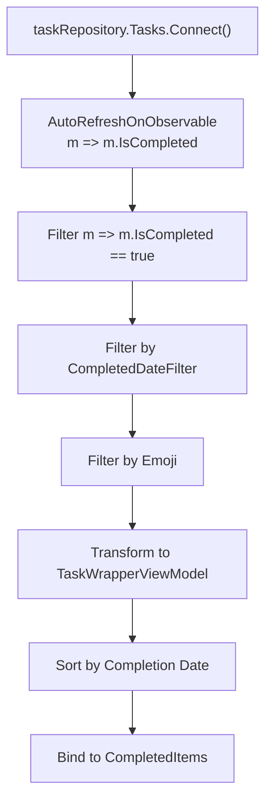
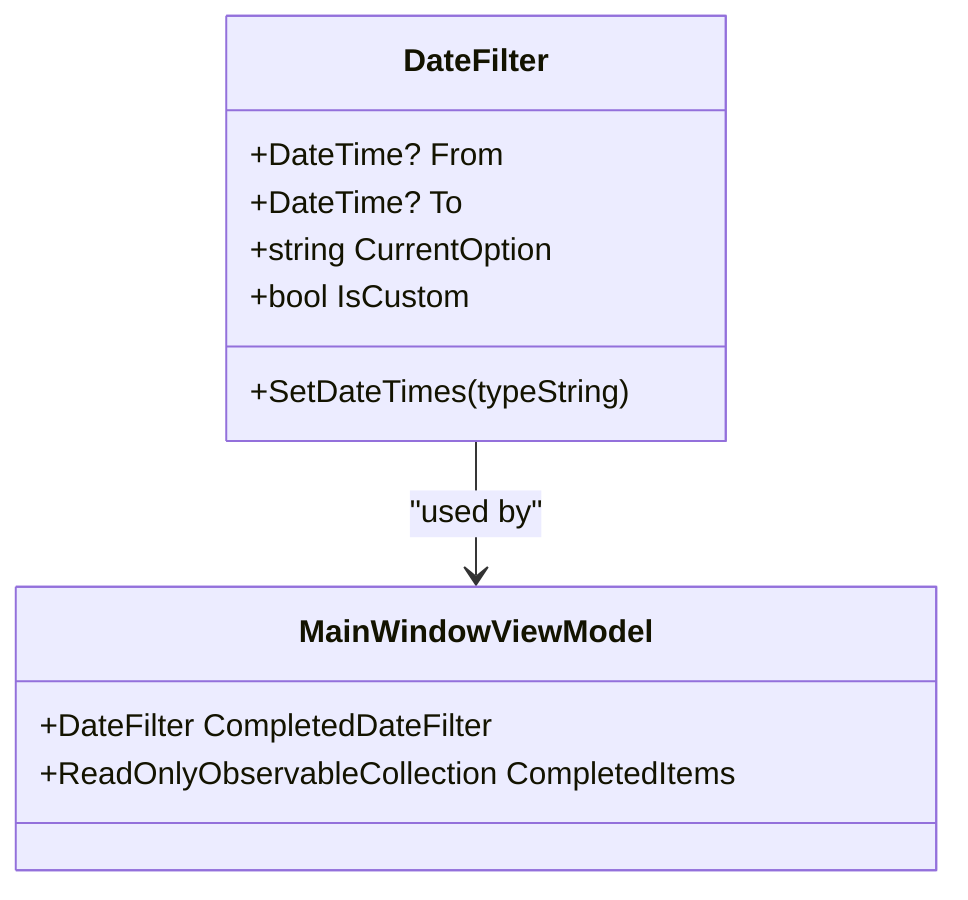
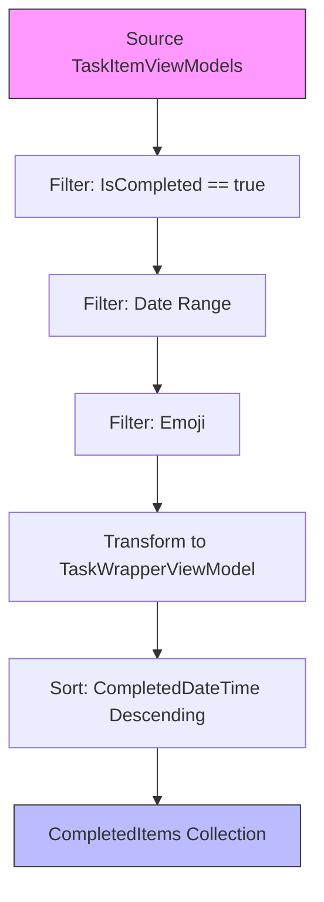
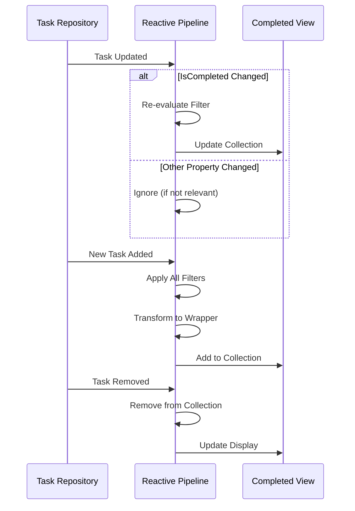
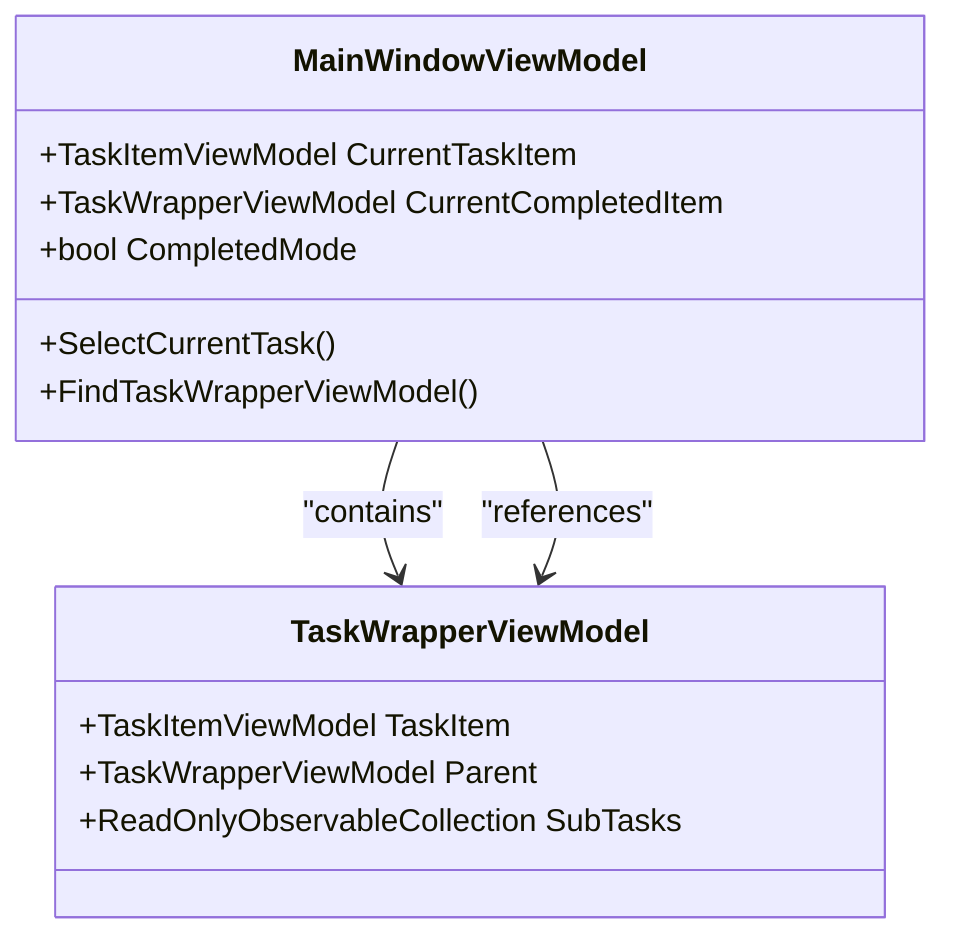

# Completed View

<cite>
**Referenced Files in This Document**   
- [MainWindowViewModel.cs](file://src/Unlimotion.ViewModel/MainWindowViewModel.cs)
- [TaskWrapperViewModel.cs](file://src/Unlimotion.ViewModel/TaskWrapperViewModel.cs)
- [DateFilter.cs](file://src/Unlimotion.ViewModel/DateFilter.cs)
- [TaskItemViewModel.cs](file://src/Unlimotion.ViewModel/TaskItemViewModel.cs)
</cite>

## Table of Contents
1. [Introduction](#introduction)
2. [Completed Items Filtering](#completed-items-filtering)
3. [Date-Based Filtering](#date-based-filtering)
4. [Data Transformation and Sorting](#data-transformation-and-sorting)
5. [Reactive Updates](#reactive-updates)
6. [Emoji Filtering](#emoji-filtering)
7. [State Preservation](#state-preservation)
8. [Example Scenarios](#example-scenarios)

## Introduction
The Completed view in Unlimotion displays tasks that have been marked as finished, providing users with a chronological history of completed work. This documentation details the implementation of the Completed view, focusing on how tasks are filtered, transformed, and displayed. The view leverages ReactiveUI and DynamicData libraries to create a responsive interface that automatically updates when tasks change in the repository. The implementation centers around the MainWindowViewModel's CompletedItems property, which maintains a filtered, sorted collection of completed tasks that responds to user interactions and data changes.

**Section sources**
- [MainWindowViewModel.cs](file://src/Unlimotion.ViewModel/MainWindowViewModel.cs#L591-L628)

## Completed Items Filtering
The CompletedItems collection in MainWindowViewModel filters tasks based on their completion status using DynamicData's filtering capabilities. The implementation begins by connecting to the task repository's observable collection and applying multiple filters to isolate completed tasks. The primary filter checks if a task's IsCompleted property equals true, ensuring only finished tasks appear in the view. This filtering is implemented through a chain of DynamicData operators that create a reactive pipeline from the source task collection to the final displayed items.

The filtering process is optimized through AutoRefreshOnObservable, which monitors changes to the IsCompleted property and automatically triggers re-evaluation of the filter when completion status changes. This ensures the view remains synchronized with the underlying data without requiring manual refresh operations. The filter is applied at the observable level, meaning it operates on the stream of changes rather than requiring a complete reprocessing of all tasks when a single task is updated.

**Diagram sources**
- [MainWindowViewModel.cs](file://src/Unlimotion.ViewModel/MainWindowViewModel.cs#L591-L628)

**Section sources**
- [MainWindowViewModel.cs](file://src/Unlimotion.ViewModel/MainWindowViewModel.cs#L591-L628)
- [TaskItemViewModel.cs](file://src/Unlimotion.ViewModel/TaskItemViewModel.cs#L102-L139)

## Date-Based Filtering
The Completed view implements date-based filtering through the CompletedDateFilter property, which allows users to narrow the displayed tasks by completion date range. The filter is implemented as a reactive observable that combines the current date range selection with a predicate function to determine which tasks should be visible. When the user changes the date filter option (e.g., from "Today" to "Last Week"), the filter automatically updates the From and To date properties accordingly.

The date filtering logic handles both standard and custom date ranges. For standard ranges like "Today," "Last Week," or "Last Month," the system calculates the appropriate date boundaries based on the current date. For custom ranges, users can specify exact start and end dates. The filtering predicate compares each task's CompletedDateTime with the selected range, taking into account timezone offsets to ensure accurate date matching. When either the start or end date is null, the filter returns true for all tasks, effectively disabling that boundary of the filter.

**Diagram sources**
- [DateFilter.cs](file://src/Unlimotion.ViewModel/DateFilter.cs#L0-L75)
- [MainWindowViewModel.cs](file://src/Unlimotion.ViewModel/MainWindowViewModel.cs#L1045-L1075)

**Section sources**
- [MainWindowViewModel.cs](file://src/Unlimotion.ViewModel/MainWindowViewModel.cs#L563-L597)
- [DateFilter.cs](file://src/Unlimotion.ViewModel/DateFilter.cs#L0-L75)

## Data Transformation and Sorting
The Completed view transforms TaskItemViewModels into TaskWrapperViewModels using DynamicData's Transform operator, creating a display-oriented representation of each task. This transformation wraps each completed task in a TaskWrapperViewModel that provides additional functionality for the UI, such as hierarchical navigation and command execution. The transformation process creates a new TaskWrapperViewModel for each filtered task, configuring it with appropriate actions for child selection, removal, and breadcrumb generation.

Completed tasks are sorted in descending order by their completion date, ensuring the most recently completed tasks appear at the top of the list. This sorting is implemented using DynamicData's SortBy operator with a descending sort direction. The sorting is applied after all filtering operations, ensuring only the visible tasks are sorted, which improves performance when dealing with large task collections. The sorting is stable, meaning tasks with identical completion dates maintain their relative order from the source collection.

**Diagram sources**
- [MainWindowViewModel.cs](file://src/Unlimotion.ViewModel/MainWindowViewModel.cs#L591-L628)
- [TaskWrapperViewModel.cs](file://src/Unlimotion.ViewModel/TaskWrapperViewModel.cs#L0-L124)

**Section sources**
- [MainWindowViewModel.cs](file://src/Unlimotion.ViewModel/MainWindowViewModel.cs#L591-L628)
- [TaskWrapperViewModel.cs](file://src/Unlimotion.ViewModel/TaskWrapperViewModel.cs#L0-L124)

## Reactive Updates
The Completed view maintains real-time synchronization with the task repository through reactive subscriptions that respond to changes in the underlying data. The implementation uses Connect() to establish a continuous observable connection to the task collection, ensuring the view automatically updates when tasks are added, removed, or modified. When a task is updated in the repository, the OnItemUpdated subscription checks if the task's completion status has changed and updates the CurrentTaskItem if necessary.

The reactive pipeline is designed to minimize unnecessary updates by using targeted observables that only trigger when relevant properties change. For example, the AutoRefreshOnObservable operator specifically monitors changes to the IsCompleted property, preventing the filter from re-evaluating when other task properties are modified. This selective observation improves performance and reduces UI flicker. The entire pipeline is disposed and recreated during the Connect() method call, ensuring proper resource management and preventing memory leaks.

**Diagram sources**
- [MainWindowViewModel.cs](file://src/Unlimotion.ViewModel/MainWindowViewModel.cs#L300-L305)
- [MainWindowViewModel.cs](file://src/Unlimotion.ViewModel/MainWindowViewModel.cs#L591-L628)

**Section sources**
- [MainWindowViewModel.cs](file://src/Unlimotion.ViewModel/MainWindowViewModel.cs#L300-L305)
- [MainWindowViewModel.cs](file://src/Unlimotion.ViewModel/MainWindowViewModel.cs#L591-L628)

## Emoji Filtering
The Completed view supports emoji-based filtering, allowing users to show or hide tasks based on their emoji content. This filtering is implemented through a combination of emoji-specific filters that are applied in addition to the completion status and date filters. The emoji filtering system creates a collection of EmojiFilter objects, each representing a unique emoji found in the task titles, and binds them to the UI for user interaction.

When emoji filters are applied, the system evaluates each task to determine if it contains any of the selected emojis in either its title or emoji collection. Tasks that match the selected emoji filters are included in the view, while those that don't match are excluded. The filtering also supports exclusion filters, allowing users to hide tasks containing specific emojis. The emoji filtering is reactive, automatically updating when users toggle emoji filters or when task titles are modified.

**Section sources**
- [MainWindowViewModel.cs](file://src/Unlimotion.ViewModel/MainWindowViewModel.cs#L408-L439)
- [MainWindowViewModel.cs](file://src/Unlimotion.ViewModel/MainWindowViewModel.cs#L591-L628)

## State Preservation
The Completed view maintains user interface state across updates by preserving selection and scroll position when the task collection changes. When a task is selected in the Completed view, the CurrentCompletedItem property is updated, and this selection is maintained even as the underlying collection is re-sorted or filtered. The view uses the FindTaskWrapperViewModel method to locate the selected task in the updated collection, ensuring continuity of the user's context.

Selection state is synchronized across different views through the CurrentTaskItem property, which serves as a central point for tracking the currently selected task regardless of which tab is active. When a user selects a task in the Completed view, the CurrentTaskItem is updated, and this change is reflected in other parts of the interface. The system also handles the case where a selected task is removed from the view (e.g., when its completion status changes), clearing the selection appropriately to prevent stale references.

**Diagram sources**
- [MainWindowViewModel.cs](file://src/Unlimotion.ViewModel/MainWindowViewModel.cs#L941-L972)
- [TaskWrapperViewModel.cs](file://src/Unlimotion.ViewModel/TaskWrapperViewModel.cs#L0-L124)

**Section sources**
- [MainWindowViewModel.cs](file://src/Unlimotion.ViewModel/MainWindowViewModel.cs#L840-L876)
- [MainWindowViewModel.cs](file://src/Unlimotion.ViewModel/MainWindowViewModel.cs#L941-L972)

## Example Scenarios
The Completed view responds dynamically to changes in the date filter range, updating the visible tasks accordingly. When a user selects a different date range (e.g., changing from "Today" to "Last Week"), the CompletedDateFilter's CurrentOption property is updated, triggering the subscription that calls SetDateTimes with the new option. This updates the From and To date properties, which in turn triggers the reactive filter predicate to re-evaluate all tasks against the new date range.

For example, when switching from "Today" to "Last Week," the system calculates the date range as seven days prior to the current date through the current date. The filter predicate then includes only tasks with a CompletedDateTime within this range. Tasks completed outside this window are removed from the CompletedItems collection, while newly qualifying tasks are added. The sorting is automatically reapplied to the updated collection, ensuring tasks remain ordered by completion date. This entire process occurs reactively without requiring explicit refresh commands, providing a seamless user experience as the view content updates in response to filter changes.

**Section sources**
- [MainWindowViewModel.cs](file://src/Unlimotion.ViewModel/MainWindowViewModel.cs#L563-L597)
- [DateFilter.cs](file://src/Unlimotion.ViewModel/DateFilter.cs#L0-L75)