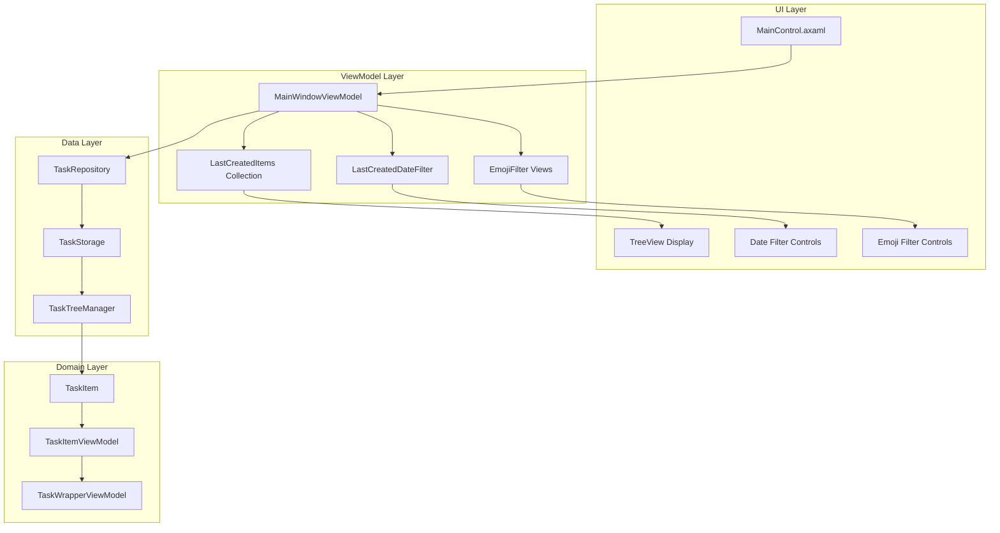
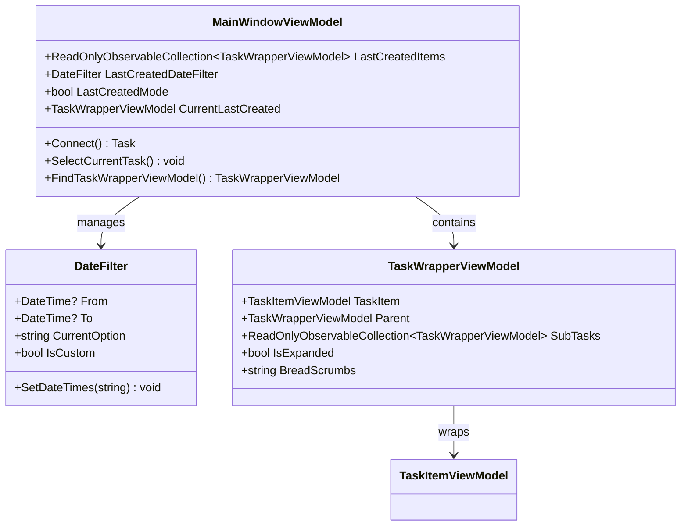
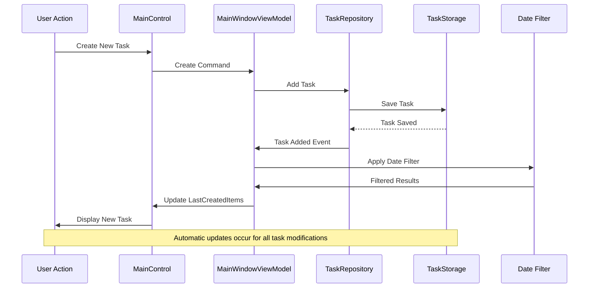
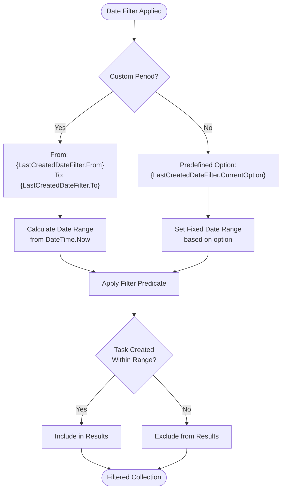
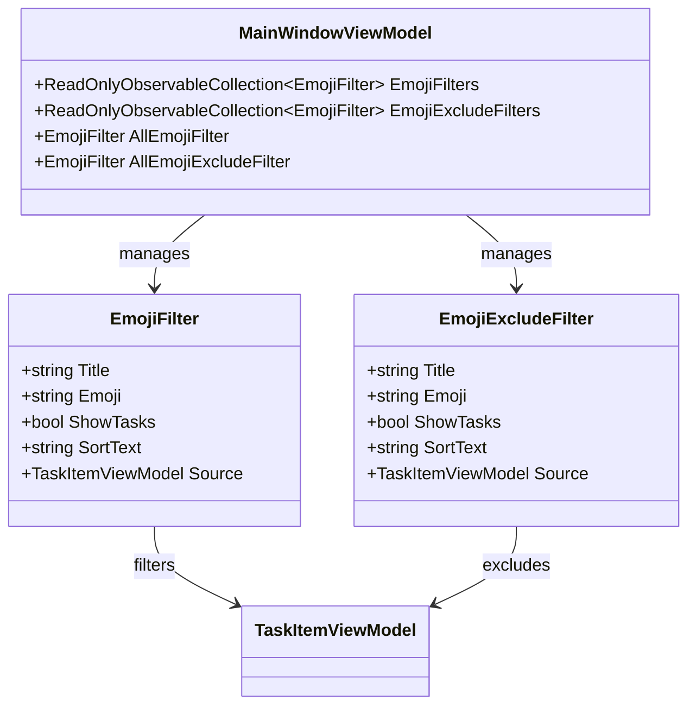
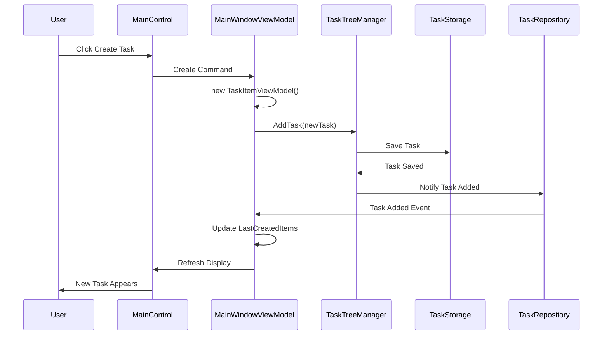
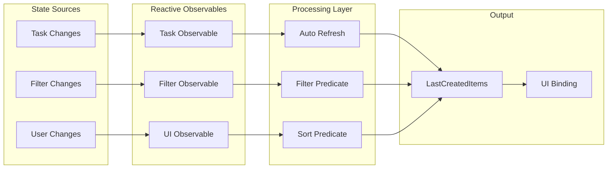

# Last Created View

<cite>
**Referenced Files in This Document**
- [MainWindowViewModel.cs](file://src/Unlimotion.ViewModel/MainWindowViewModel.cs)
- [MainControl.axaml](file://src/Unlimotion/Views/MainControl.axaml)
- [DateFilter.cs](file://src/Unlimotion.ViewModel/DateFilter.cs)
- [TaskItemViewModel.cs](file://src/Unlimotion.ViewModel/TaskItemViewModel.cs)
- [TaskWrapperViewModel.cs](file://src/Unlimotion.ViewModel/TaskWrapperViewModel.cs)
- [MainWindow.axaml.cs](file://src/Unlimotion/Views/MainWindow.axaml.cs)
- [TaskTreeManager.cs](file://src/Unlimotion.TaskTreeManager/TaskTreeManager.cs)
- [MainWindowViewModelTests.cs](file://src/Unlimotion.Test/MainWindowViewModelTests.cs)
</cite>

## Table of Contents
1. [Introduction](#introduction)
2. [Architecture Overview](#architecture-overview)
3. [Core Components](#core-components)
4. [Reactive Pipeline Implementation](#reactive-pipeline-implementation)
5. [Date Range Filtering](#date-range-filtering)
6. [Emoji and Exclusion Filters](#emoji-and-exclusion-filters)
7. [Task Creation and Updates](#task-creation-and-updates)
8. [Dynamic State Management](#dynamic-state-management)
9. [UI Integration](#ui-integration)
10. [Persistence and Session Management](#persistence-and-session-management)
11. [Performance Considerations](#performance-considerations)
12. [Troubleshooting Guide](#troubleshooting-guide)
13. [Conclusion](#conclusion)

## Introduction

The Last Created View is a specialized tab within the Unlimotion application that displays recently added tasks sorted by creation time. This view serves as a powerful tool for users to quickly access and manage newly created tasks, providing immediate visibility into recent activity and enabling efficient task organization workflows.

The view implements a sophisticated reactive data pipeline that automatically updates when new tasks are created, existing tasks are modified, or filtering criteria are adjusted. It combines multiple filtering mechanisms including date range filtering, emoji-based categorization, and exclusion filters to provide highly customizable task browsing experiences.

## Architecture Overview

The Last Created View follows a MVVM (Model-View-ViewModel) architecture pattern with reactive programming principles. The system consists of several interconnected layers that work together to provide real-time task management capabilities.

**Diagram sources**
- [MainWindowViewModel.cs](file://src/Unlimotion.ViewModel/MainWindowViewModel.cs#L20-L50)
- [MainControl.axaml](file://src/Unlimotion/Views/MainControl.axaml#L128-L149)

## Core Components

### MainWindowViewModel Integration

The MainWindowViewModel serves as the central orchestrator for the Last Created View, managing the reactive data pipeline and coordinating between the UI and underlying data storage systems.

**Diagram sources**
- [MainWindowViewModel.cs](file://src/Unlimotion.ViewModel/MainWindowViewModel.cs#L1000-L1050)
- [DateFilter.cs](file://src/Unlimotion.ViewModel/DateFilter.cs#L8-L20)
- [TaskWrapperViewModel.cs](file://src/Unlimotion.ViewModel/TaskWrapperViewModel.cs#L15-L30)

### LastCreatedItems Collection

The LastCreatedItems collection represents the primary data source for the view, containing TaskWrapperViewModel instances that wrap individual tasks with additional presentation logic and navigation capabilities.

**Section sources**
- [MainWindowViewModel.cs](file://src/Unlimotion.ViewModel/MainWindowViewModel.cs#L1020-L1030)

## Reactive Pipeline Implementation

The reactive pipeline forms the backbone of the Last Created View's real-time functionality, implementing a sophisticated data transformation chain that responds to various events and state changes.

**Diagram sources**
- [MainWindowViewModel.cs](file://src/Unlimotion.ViewModel/MainWindowViewModel.cs#L680-L720)
- [TaskTreeManager.cs](file://src/Unlimotion.TaskTreeManager/TaskTreeManager.cs#L43-L80)

### Data Transformation Chain

The reactive pipeline implements a multi-stage transformation process:

1. **Source Stream**: TaskRepository.Tasks.Connect() provides the initial observable stream
2. **Filter Stages**: Multiple filter predicates are applied sequentially
3. **Transformation**: TaskItemViewModel instances are transformed into TaskWrapperViewModel
4. **Sorting**: Results are sorted by CreatedDateTime in descending order
5. **Binding**: Final results are bound to the UI collection

**Section sources**
- [MainWindowViewModel.cs](file://src/Unlimotion.ViewModel/MainWindowViewModel.cs#L680-L720)

## Date Range Filtering

The Last Created View implements comprehensive date range filtering capabilities through the LastCreatedDateFilter property, allowing users to view tasks created within specific time periods.

### Date Filter Implementation

**Diagram sources**
- [DateFilter.cs](file://src/Unlimotion.ViewModel/DateFilter.cs#L20-L70)
- [MainWindowViewModel.cs](file://src/Unlimotion.ViewModel/MainWindowViewModel.cs#L660-L680)

### Filter Predicate Logic

The date filtering implementation uses a predicate function that compares task creation dates against the configured date range:

**Section sources**
- [MainWindowViewModel.cs](file://src/Unlimotion.ViewModel/MainWindowViewModel.cs#L665-L675)

## Emoji and Exclusion Filters

The Last Created View integrates sophisticated emoji-based filtering capabilities that allow users to organize and filter tasks based on emoji categories and exclusions.

### Emoji Filter Architecture

**Diagram sources**
- [MainWindowViewModel.cs](file://src/Unlimotion.ViewModel/MainWindowViewModel.cs#L1050-L1075)

### Filter Application Process

The emoji filters operate through a two-phase filtering process:

1. **Inclusion Phase**: Tasks are included if they match any selected emoji filters
2. **Exclusion Phase**: Tasks are excluded if they match any selected exclusion filters

**Section sources**
- [MainWindowViewModel.cs](file://src/Unlimotion.ViewModel/MainWindowViewModel.cs#L340-L390)

## Task Creation and Updates

The Last Created View seamlessly handles task creation and updates through a coordinated system involving the MainWindowViewModel, TaskTreeManager, and reactive data bindings.

### Task Creation Workflow

**Diagram sources**
- [MainWindowViewModel.cs](file://src/Unlimotion.ViewModel/MainWindowViewModel.cs#L75-L95)
- [TaskTreeManager.cs](file://src/Unlimotion.TaskTreeManager/TaskTreeManager.cs#L43-L80)

### Dynamic Update Mechanisms

The view responds to various types of task modifications:

- **New Task Creation**: Automatically appears in the Last Created view
- **Task Modification**: Updated tasks remain in the view with refreshed display
- **Task Deletion**: Removed tasks are automatically filtered out
- **Property Changes**: Updates to task properties trigger UI refreshes

**Section sources**
- [MainWindowViewModel.cs](file://src/Unlimotion.ViewModel/MainWindowViewModel.cs#L100-L120)

## Dynamic State Management

The Last Created View maintains dynamic state through reactive programming patterns that automatically respond to changes in task data, filter configurations, and user interactions.

### State Change Propagation

**Diagram sources**
- [MainWindowViewModel.cs](file://src/Unlimotion.ViewModel/MainWindowViewModel.cs#L680-L720)

### Memory Management

The reactive pipeline includes comprehensive memory management through the DisposableList pattern, ensuring that event subscriptions are properly cleaned up when the view is closed or disposed.

**Section sources**
- [MainWindowViewModel.cs](file://src/Unlimotion.ViewModel/MainWindowViewModel.cs#L20-L30)

## UI Integration

The Last Created View integrates seamlessly with the main application interface through the MainControl.axaml layout, providing intuitive controls for task management and filtering.

### Layout Structure

The view utilizes a structured grid layout with multiple functional areas:

- **Filter Panel**: Contains emoji filters, date range controls, and completion status toggles
- **Task TreeView**: Displays hierarchical task organization with expandable/collapsible nodes
- **Selection Controls**: Enables single-task selection with keyboard shortcuts

**Section sources**
- [MainControl.axaml](file://src/Unlimotion/Views/MainControl.axaml#L128-L149)

### Keyboard Shortcuts

The view supports several keyboard shortcuts for efficient task management:

- **Ctrl+Enter**: Create sibling task
- **Shift+Enter**: Create blocked sibling task  
- **Ctrl+Tab**: Create inner task
- **Shift+Delete**: Remove selected task

**Section sources**
- [MainControl.axaml](file://src/Unlimotion/Views/MainControl.axaml#L45-L50)

## Persistence and Session Management

The Last Created View participates in the application's broader persistence strategy, maintaining state across sessions while respecting user preferences and filter configurations.

### Configuration Persistence

Filter settings, sort orders, and display preferences are automatically persisted through the application's configuration system:

- **Date Filter Settings**: Custom date ranges and predefined options
- **Emoji Filter States**: Which emoji categories are shown or hidden
- **Completion Filter Preferences**: Whether completed tasks are displayed
- **Archive Filter Preferences**: Whether archived tasks are displayed

**Section sources**
- [MainWindowViewModel.cs](file://src/Unlimotion.ViewModel/MainWindowViewModel.cs#L40-L60)

### Session State Recovery

Upon application startup, the Last Created View automatically restores previous filter configurations and maintains the current task selection state, providing continuity for user workflows.

## Performance Considerations

The Last Created View implements several performance optimization strategies to ensure responsive operation even with large task collections.

### Reactive Optimization

- **Auto Refresh**: Selective automatic refreshing based on relevant task properties
- **Throttling**: Property change throttling to prevent excessive updates
- **Lazy Loading**: Task content loaded only when expanded in the tree view
- **Memory Management**: Proper disposal of reactive subscriptions

### Data Access Patterns

- **Indexed Queries**: Efficient task lookup using task IDs
- **Batch Operations**: Grouped updates to minimize UI refresh cycles
- **Caching**: Strategic caching of frequently accessed task data

**Section sources**
- [MainWindowViewModel.cs](file://src/Unlimotion.ViewModel/MainWindowViewModel.cs#L680-L720)

## Troubleshooting Guide

### Common Issues and Solutions

**Issue**: New tasks don't appear in Last Created view
- **Cause**: Date filter set to exclude recent tasks
- **Solution**: Adjust date filter to include today's date range

**Issue**: Filtered results are incorrect
- **Cause**: Emoji filter conflicts with exclusion filters
- **Solution**: Review emoji filter selections and ensure logical consistency

**Issue**: Performance degradation with large task collections
- **Cause**: Excessive reactive subscriptions or inefficient filters
- **Solution**: Optimize filter predicates and review subscription cleanup

**Section sources**
- [MainWindowViewModelTests.cs](file://src/Unlimotion.Test/MainWindowViewModelTests.cs#L68-L131)

### Debugging Techniques

For troubleshooting reactive pipeline issues:

1. **Subscription Monitoring**: Track reactive subscription lifecycle
2. **Filter Validation**: Verify filter predicate logic correctness
3. **State Inspection**: Monitor ViewModel property changes
4. **Event Tracing**: Log task repository events and updates

## Conclusion

The Last Created View represents a sophisticated implementation of reactive task management, combining real-time data updates, flexible filtering capabilities, and intuitive user interfaces. Its architecture demonstrates best practices in MVVM pattern implementation, reactive programming, and performance optimization.

The view's ability to automatically adapt to task changes while maintaining consistent user experience makes it an essential component of the Unlimotion application. Its modular design allows for easy extension and customization while preserving core functionality and performance characteristics.

Future enhancements could include additional filtering dimensions, improved performance for very large task collections, and enhanced accessibility features to support diverse user needs.