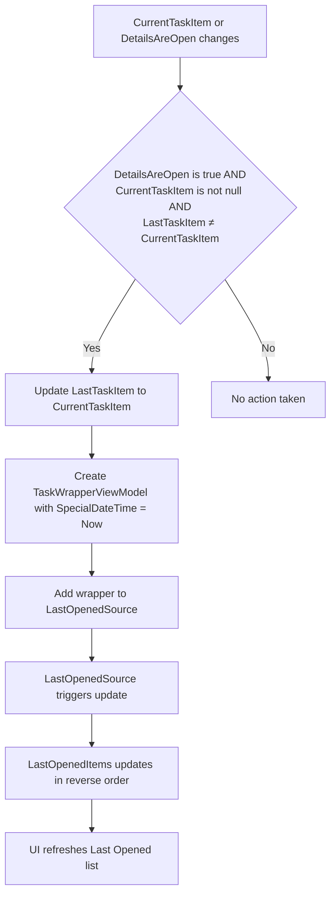
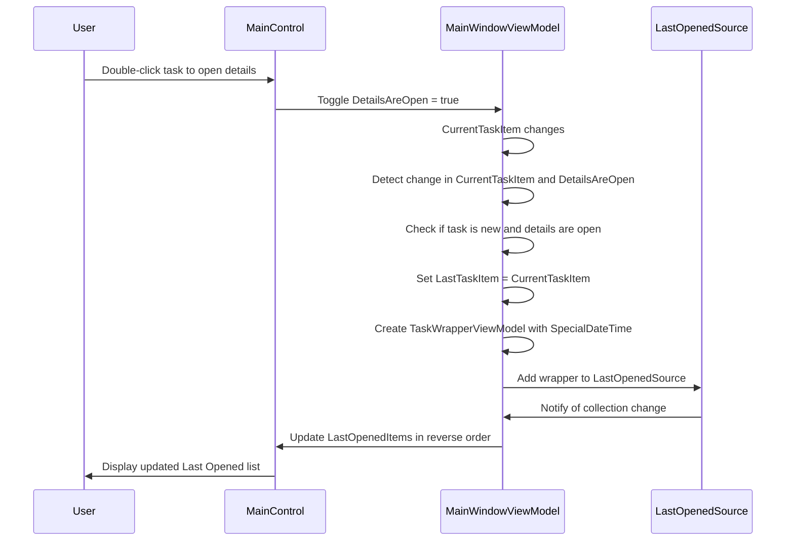
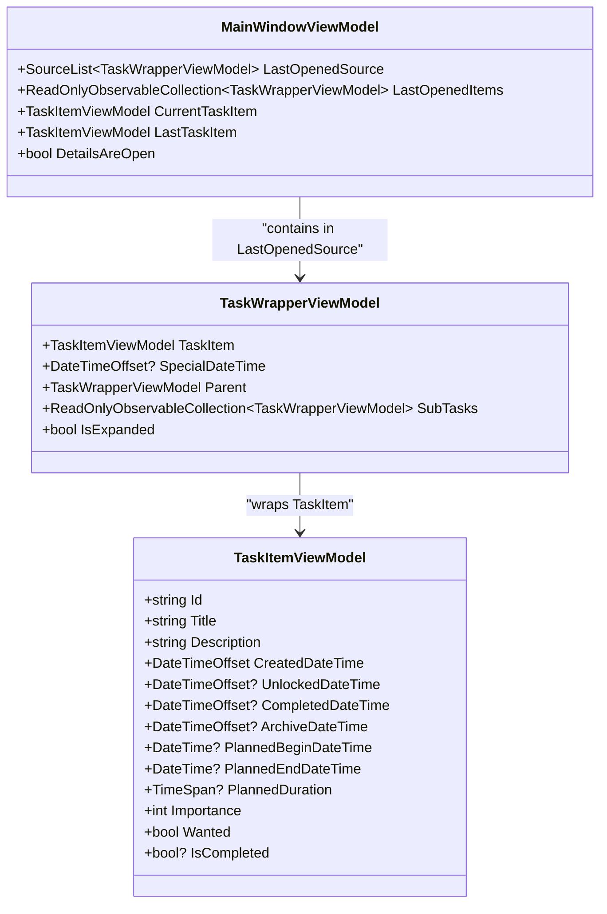

# Last Opened View

<cite>
**Referenced Files in This Document**   
- [MainWindowViewModel.cs](file://src/Unlimotion.ViewModel/MainWindowViewModel.cs)
- [TaskWrapperViewModel.cs](file://src/Unlimotion.ViewModel/TaskWrapperViewModel.cs)
- [MainControl.axaml.cs](file://src/Unlimotion/Views/MainControl.axaml.cs)
</cite>

## Table of Contents
1. [Introduction](#introduction)
2. [Core Components](#core-components)
3. [Implementation Details](#implementation-details)
4. [User Interaction Flow](#user-interaction-flow)
5. [Data Structure and Persistence](#data-structure-and-persistence)
6. [Limitations and Constraints](#limitations-and-constraints)

## Introduction
The Last Opened View is a feature designed to enhance user productivity by maintaining a history of recently viewed tasks for quick access. This functionality allows users to easily return to previously viewed tasks without navigating through the entire task hierarchy. The implementation leverages reactive programming patterns to automatically track task access and maintain a reverse-chronological list of visited tasks. This document details the architecture, implementation, and behavior of the Last Opened feature, including how it integrates with the application's view model and user interface components.

## Core Components
The Last Opened View functionality is implemented through several interconnected components in the application's view model layer. The primary components include the `LastOpenedSource` collection, the `LastOpenedItems` observable collection, and the subscription mechanism that responds to changes in the current task selection and detail panel state. These components work together to maintain a dynamic list of recently accessed tasks, with the most recently viewed tasks appearing at the top of the list.

**Section sources**
- [MainWindowViewModel.cs](file://src/Unlimotion.ViewModel/MainWindowViewModel.cs#L971-L994)

## Implementation Details
The Last Opened View is implemented through a subscription to two observable properties: `CurrentTaskItem` and `DetailsAreOpen`. When a user opens the detail panel for a task, the `DetailsAreOpen` property is set to true, triggering the addition of the current task to the Last Opened list. The implementation uses a `SourceList<TaskWrapperViewModel>` called `LastOpenedSource` as the backing collection, which is then bound to the `LastOpenedItems` observable collection in reverse order to display the most recent items first.

The subscription logic ensures that a task is only added to the list when the detail panel is open and the current task is different from the previously recorded task. When a task is added to the list, it is wrapped in a `TaskWrapperViewModel` with a `SpecialDateTime` property set to the current timestamp, which serves as both a unique identifier and a chronological marker for the visit.

**Diagram sources**
- [MainWindowViewModel.cs](file://src/Unlimotion.ViewModel/MainWindowViewModel.cs#L719-L750)

**Section sources**
- [MainWindowViewModel.cs](file://src/Unlimotion.ViewModel/MainWindowViewModel.cs#L719-L750)

## User Interaction Flow
The user interaction flow for the Last Opened View begins when a user selects a task and opens its detail panel. In the UI, this is typically accomplished by double-clicking on a task in the task tree or clicking a dedicated button to open the details. The `MainControl.axaml.cs` file contains the event handler for the double-tap gesture on the task tree, which toggles the `DetailsAreOpen` property on the `MainWindowViewModel`.

When the detail panel is opened for a task, the subscription in the `MainWindowViewModel` detects the change in both `CurrentTaskItem` and `DetailsAreOpen` properties. If the conditions are met (detail panel is open, a task is selected, and it's different from the previously recorded task), the system creates a new `TaskWrapperViewModel` instance with the current timestamp and adds it to the `LastOpenedSource` collection. This addition automatically triggers an update to the `LastOpenedItems` collection, which is displayed in the UI in reverse chronological order.

**Diagram sources**
- [MainControl.axaml.cs](file://src/Unlimotion/Views/MainControl.axaml.cs#L267)
- [MainWindowViewModel.cs](file://src/Unlimotion.ViewModel/MainWindowViewModel.cs#L719-L750)

**Section sources**
- [MainControl.axaml.cs](file://src/Unlimotion/Views/MainControl.axaml.cs#L267)
- [MainWindowViewModel.cs](file://src/Unlimotion.ViewModel/MainWindowViewModel.cs#L719-L750)

## Data Structure and Persistence
The data structure for the Last Opened View consists of a `SourceList<TaskWrapperViewModel>` called `LastOpenedSource`, which serves as the backing collection for the feature. Each `TaskWrapperViewModel` in this collection contains a reference to the original `TaskItemViewModel` and includes a `SpecialDateTime` property that records when the task was last accessed. This timestamp serves both as a chronological marker and a unique identifier for the visit.

The `LastOpenedItems` collection is derived from `LastOpenedSource` through a reactive binding that reverses the order of items, ensuring that the most recently visited tasks appear at the top of the list. This implementation leverages the DynamicData library to efficiently manage collection changes and propagate updates to the UI.

It's important to note that the current implementation does not persist the Last Opened list across application restarts. When the application is closed and reopened, the `LastOpenedSource` collection starts empty, and the list is rebuilt based on subsequent user interactions. This behavior is consistent with the application's overall design philosophy of maintaining a clean state between sessions while allowing users to quickly rebuild their context through recent activity.

**Diagram sources**
- [MainWindowViewModel.cs](file://src/Unlimotion.ViewModel/MainWindowViewModel.cs#L971-L994)
- [TaskWrapperViewModel.cs](file://src/Unlimotion.ViewModel/TaskWrapperViewModel.cs#L0-L124)

**Section sources**
- [MainWindowViewModel.cs](file://src/Unlimotion.ViewModel/MainWindowViewModel.cs#L971-L994)
- [TaskWrapperViewModel.cs](file://src/Unlimotion.ViewModel/TaskWrapperViewModel.cs#L0-L124)

## Limitations and Constraints
The Last Opened View implementation has several limitations and constraints that affect its behavior and usability. The most significant limitation is the lack of persistence across application restarts. Since the `LastOpenedSource` collection is not saved to disk, users lose their recently accessed task history when they close and reopen the application. This means that the list must be rebuilt from scratch with each new session, potentially reducing the feature's effectiveness for users who work on tasks over multiple sessions.

Another constraint is the absence of a maximum list size limit in the current implementation. While this allows users to access their complete history of visited tasks, it could potentially lead to performance issues if the list grows very large over time. The implementation does not include any mechanism to automatically trim or archive older entries, which could result in memory bloat for long-term users.

Additionally, the feature only tracks tasks when their detail panel is explicitly opened. Tasks that are merely selected in the task tree without opening their details are not added to the Last Opened list. This behavior ensures that only intentionally viewed tasks are included in the history, but it may not capture all user interactions that could be considered "visits" to a task.

Finally, the implementation does not provide any user interface controls for managing the Last Opened list, such as clearing the history or pinning specific tasks. Users cannot customize the behavior or appearance of the list, which limits their ability to tailor the feature to their specific workflow needs.

**Section sources**
- [MainWindowViewModel.cs](file://src/Unlimotion.ViewModel/MainWindowViewModel.cs#L719-L750)
- [MainWindowViewModel.cs](file://src/Unlimotion.ViewModel/MainWindowViewModel.cs#L971-L994)