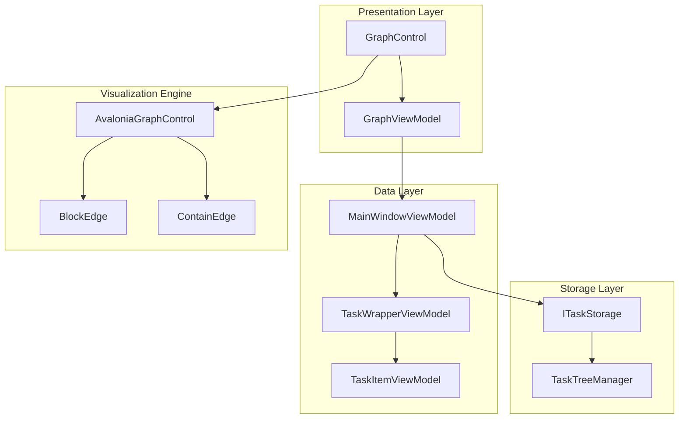
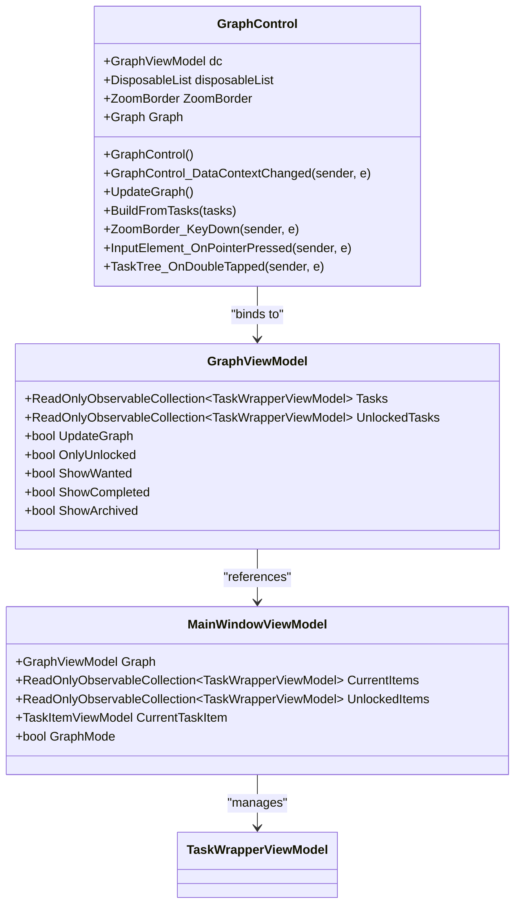
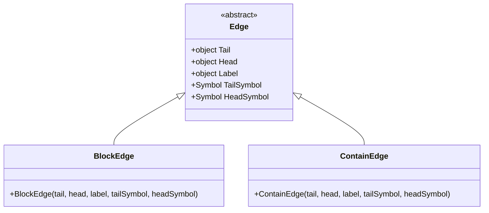
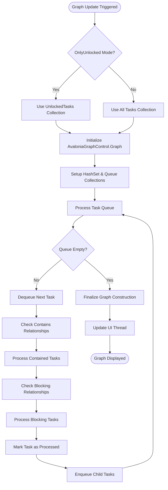
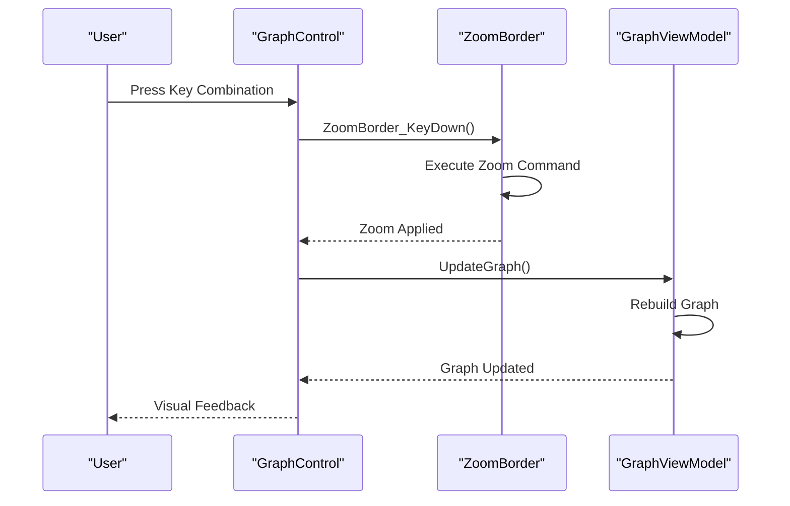

# Roadmap View

<cite>
**Referenced Files in This Document**
- [GraphControl.axaml.cs](file://src/Unlimotion/Views/GraphControl.axaml.cs)
- [BlockEdge.cs](file://src/Unlimotion/Views/Graph/BlockEdge.cs)
- [ContainEdge.cs](file://src/Unlimotion/Views/Graph/ContainEdge.cs)
- [GraphViewModel.cs](file://src/Unlimotion.ViewModel/GraphViewModel.cs)
- [MainWindowViewModel.cs](file://src/Unlimotion.ViewModel/MainWindowViewModel.cs)
- [TaskItemViewModel.cs](file://src/Unlimotion.ViewModel/TaskItemViewModel.cs)
- [TaskWrapperViewModel.cs](file://src/Unlimotion.ViewModel/TaskWrapperViewModel.cs)
- [MainWindow.axaml.cs](file://src/Unlimotion/Views/MainWindow.axaml.cs)
- [MainScreen.axaml.cs](file://src/Unlimotion/Views/MainScreen.axaml.cs)
</cite>

## Table of Contents
1. [Introduction](#introduction)
2. [Architecture Overview](#architecture-overview)
3. [Core Components](#core-components)
4. [Graph Visualization Engine](#graph-visualization-engine)
5. [Interactive Features](#interactive-features)
6. [Task Relationship Management](#task-relationship-management)
7. [Performance Optimization](#performance-optimization)
8. [Accessibility Considerations](#accessibility-considerations)
9. [Implementation Examples](#implementation-examples)
10. [Troubleshooting Guide](#troubleshooting-guide)

## Introduction

The Roadmap (Graph) view in Unlimotion provides a sophisticated node-based visualization of task relationships, enabling users to understand complex project structures through intuitive graphical representation. This view transforms hierarchical task data into interconnected nodes connected by various relationship types, offering both analytical insights and interactive manipulation capabilities.

The graph visualization serves as a central hub for understanding task dependencies, blocking relationships, and containment hierarchies, making it essential for project planning and progress tracking. The system dynamically updates the graph in real-time as task relationships change, ensuring users always see the most current project structure.

## Architecture Overview

The Roadmap view follows a layered architecture pattern with clear separation of concerns between data management, visualization logic, and user interaction handling.

**Diagram sources**
- [GraphControl.axaml.cs](file://src/Unlimotion/Views/GraphControl.axaml.cs#L1-L229)
- [GraphViewModel.cs](file://src/Unlimotion.ViewModel/GraphViewModel.cs#L1-L31)
- [MainWindowViewModel.cs](file://src/Unlimotion.ViewModel/MainWindowViewModel.cs#L1-L100)

**Section sources**
- [GraphControl.axaml.cs](file://src/Unlimotion/Views/GraphControl.axaml.cs#L1-L50)
- [GraphViewModel.cs](file://src/Unlimotion.ViewModel/GraphViewModel.cs#L1-L31)

## Core Components

### GraphControl - The Visualization Engine

The GraphControl serves as the primary visualization component, responsible for rendering the task graph and managing user interactions. It acts as a bridge between the ViewModel layer and the underlying graph rendering engine.

**Diagram sources**
- [GraphControl.axaml.cs](file://src/Unlimotion/Views/GraphControl.axaml.cs#L17-L45)
- [GraphViewModel.cs](file://src/Unlimotion.ViewModel/GraphViewModel.cs#L7-L31)
- [MainWindowViewModel.cs](file://src/Unlimotion.ViewModel/MainWindowViewModel.cs#L25-L35)

### Relationship Types

The system defines two primary relationship types that visually represent different aspects of task dependencies:

#### BlockEdge - Blocking Relationships
Represents tasks that prevent other tasks from being completed. These edges indicate dependencies where the completion of one task is contingent upon another task's completion.

#### ContainEdge - Containment Relationships  
Represents hierarchical containment where tasks contain subtasks. These edges show the parent-child relationship structure within the task tree.

**Diagram sources**
- [BlockEdge.cs](file://src/Unlimotion/Views/Graph/BlockEdge.cs#L1-L10)
- [ContainEdge.cs](file://src/Unlimotion/Views/Graph/ContainEdge.cs#L1-L12)

**Section sources**
- [GraphControl.axaml.cs](file://src/Unlimotion/Views/GraphControl.axaml.cs#L17-L50)
- [BlockEdge.cs](file://src/Unlimotion/Views/Graph/BlockEdge.cs#L1-L10)
- [ContainEdge.cs](file://src/Unlimotion/Views/Graph/ContainEdge.cs#L1-L12)

## Graph Visualization Engine

### Dynamic Graph Building Process

The graph construction process follows a sophisticated algorithm that traverses task relationships and builds the visual representation incrementally.

**Diagram sources**
- [GraphControl.axaml.cs](file://src/Unlimotion/Views/GraphControl.axaml.cs#L81-L170)

### Real-Time Graph Updates

The graph system implements reactive programming patterns to ensure immediate visual updates when task relationships change. The UpdateGraph method responds to multiple trigger conditions:

- **Mode Changes**: Switching between All Tasks and Only Unlocked modes
- **Task Collection Changes**: Modifications to the Tasks or UnlockedTasks collections
- **Individual Task Updates**: Changes to specific task properties affecting graph layout
- **Filter Changes**: Updates to display filters affecting task visibility

**Section sources**
- [GraphControl.axaml.cs](file://src/Unlimotion/Views/GraphControl.axaml.cs#L45-L80)
- [GraphControl.axaml.cs](file://src/Unlimotion/Views/GraphControl.axaml.cs#L81-L170)

## Interactive Features

### Panning and Zooming Capabilities

The graph control provides comprehensive navigation controls through keyboard shortcuts and mouse interactions:

#### Keyboard Navigation Shortcuts
- **F**: Fill mode - Adjusts zoom to fit the graph within the viewport
- **U**: Uniform mode - Maintains aspect ratio while fitting the graph
- **R**: Reset mode - Returns to the default zoom level and position
- **T**: Toggle stretch mode - Enables automatic fitting with stretch mode

#### Mouse Interaction Support
The system supports drag-and-drop operations for task reorganization and provides contextual menu access for task manipulation.

**Diagram sources**
- [GraphControl.axaml.cs](file://src/Unlimotion/Views/GraphControl.axaml.cs#L171-L185)

### Node Selection and Manipulation

The graph provides sophisticated node selection mechanisms with support for:

- **Single-click Selection**: Selects individual tasks for detailed viewing
- **Multi-selection**: Supports selecting multiple related tasks
- **Drag-and-Drop**: Enables task reorganization through visual manipulation
- **Context Menus**: Provides task-specific actions through right-click menus

**Section sources**
- [GraphControl.axaml.cs](file://src/Unlimotion/Views/GraphControl.axaml.cs#L186-L229)

## Task Relationship Management

### Blocking Relationship Implementation

Creating a blocking relationship between tasks demonstrates the system's real-time graph update capabilities. When a blocking relationship is established:

1. **Relationship Creation**: The TaskTreeManager processes the blocking relationship
2. **Graph Rebuilding**: The GraphControl triggers a complete graph rebuild
3. **Visual Update**: New BlockEdge connections appear in the visualization
4. **Layout Adjustment**: The graph automatically adjusts to accommodate new relationships

### Containment Relationship Management

Containment relationships form the hierarchical structure of tasks, with parent-child connections forming the backbone of the task tree visualization.

**Section sources**
- [TaskItemViewModel.cs](file://src/Unlimotion.ViewModel/TaskItemViewModel.cs#L200-L250)
- [TaskTreeManager.cs](file://src/Unlimotion.TaskTreeManager/TaskTreeManager.cs#L486-L527)

## Performance Optimization

### Throttled Updates

The system implements throttling mechanisms to prevent excessive graph rebuilding during rapid data changes:

- **Collection Change Throttling**: Uses 100ms throttle on collection change events
- **Property Change Optimization**: Implements intelligent property change detection
- **Batch Processing**: Groups related changes to minimize update cycles

### Memory Management

Efficient memory usage through:

- **Disposable Pattern**: Proper cleanup of event subscriptions and resources
- **Lazy Loading**: Task wrapper creation on-demand to reduce initial load
- **Weak References**: Prevents memory leaks in long-running applications

### Large Graph Handling

For projects with extensive task hierarchies, the system employs several optimization strategies:

- **Incremental Updates**: Only affected portions of the graph are rebuilt
- **Visibility Filtering**: Hidden tasks are excluded from rendering calculations
- **Level-of-Detail**: Simplified representations for distant relationships

**Section sources**
- [GraphControl.axaml.cs](file://src/Unlimotion/Views/GraphControl.axaml.cs#L45-L60)

## Accessibility Considerations

### Visual Accessibility Features

The graph visualization incorporates several accessibility enhancements:

- **Color Contrast**: High contrast ratios for task states and relationships
- **Focus Indicators**: Clear visual indicators for keyboard navigation
- **Alternative Text**: Descriptive labels for complex relationship types
- **Keyboard Navigation**: Full keyboard support for all interactive elements

### Screen Reader Support

The system provides screen reader compatibility through:

- **Semantic Markup**: Proper ARIA labels and roles for graph elements
- **Descriptive Text**: Meaningful text descriptions of task relationships
- **Progressive Enhancement**: Core functionality works without JavaScript

### Motor Accessibility

Support for users with motor impairments includes:

- **Gesture Recognition**: Alternative input methods for complex operations
- **Predictive Navigation**: Intelligent suggestion systems for common operations
- **Adaptive Interfaces**: Adjustable interaction thresholds and response times

## Implementation Examples

### Creating a Blocking Relationship

When creating a blocking relationship between tasks, the system follows this sequence:

1. **User Action**: Select two tasks and initiate blocking relationship
2. **Validation**: System validates that the relationship doesn't create cycles
3. **Storage Update**: TaskTreeManager processes the relationship change
4. **Graph Refresh**: GraphControl triggers immediate graph reconstruction
5. **Visual Feedback**: New BlockEdge appears connecting the tasks

### Real-Time Layout Updates

The graph automatically adjusts its layout when:
- New tasks are added to the project
- Existing task relationships are modified
- Display filters are applied or removed
- Task completion states change

### Task State Visualization

Different task states are represented through visual indicators:

- **Completed Tasks**: Dimmed appearance with completion date indicators
- **Locked Tasks**: Special border styles indicating availability restrictions
- **Blocked Tasks**: Red indicators showing blocking relationships
- **Active Tasks**: Standard appearance with hover effects

**Section sources**
- [GraphControl.axaml.cs](file://src/Unlimotion/Views/GraphControl.axaml.cs#L81-L170)
- [TaskItemViewModel.cs](file://src/Unlimotion.ViewModel/TaskItemViewModel.cs#L200-L250)

## Troubleshooting Guide

### Common Issues and Solutions

#### Graph Not Updating
**Symptoms**: Changes to task relationships don't appear in the graph
**Causes**: Event subscription issues or throttling delays
**Solutions**: Verify DataContext binding and check for error messages in console

#### Performance Degradation
**Symptoms**: Slow graph updates with large task sets
**Causes**: Excessive collection changes or memory leaks
**Solutions**: Implement batch updates and verify proper disposal patterns

#### Visual Artifacts
**Symptoms**: Incorrect edge connections or overlapping nodes
**Causes**: Race conditions in graph building or invalid task data
**Solutions**: Ensure thread-safe operations and validate task relationships

### Debugging Tools

The system provides several debugging capabilities:

- **Console Logging**: Detailed operation logs for development
- **Graph Validation**: Automatic checking of task relationship integrity
- **Performance Metrics**: Built-in timing for optimization identification

**Section sources**
- [GraphControl.axaml.cs](file://src/Unlimotion/Views/GraphControl.axaml.cs#L25-L45)
- [MainWindowViewModel.cs](file://src/Unlimotion.ViewModel/MainWindowViewModel.cs#L840-L876)