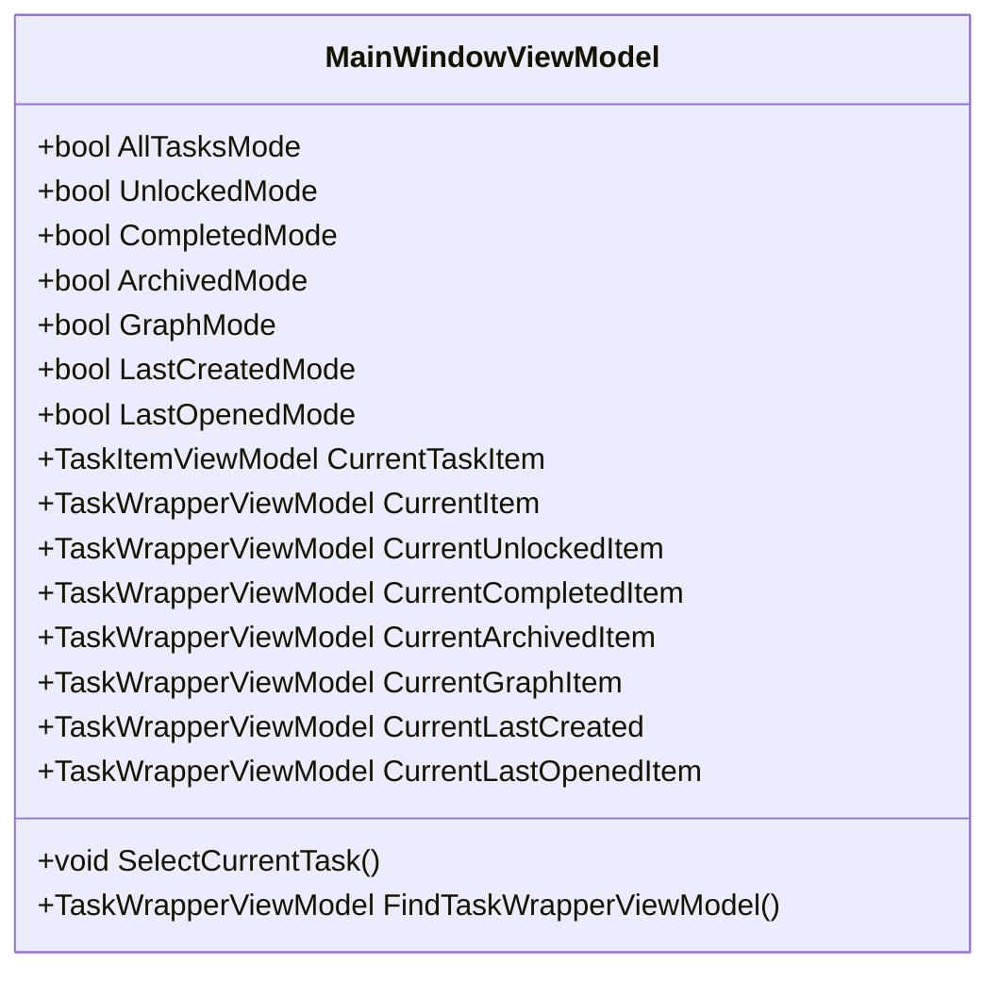
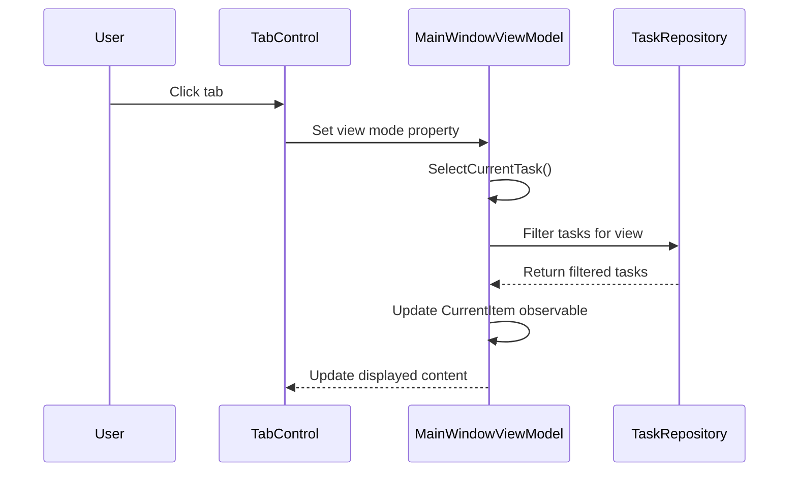
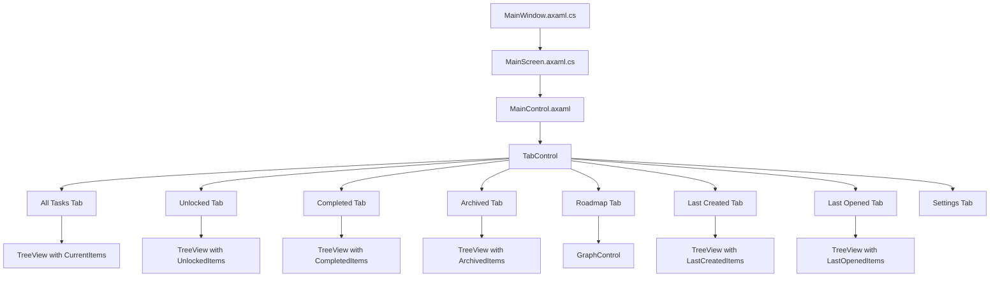
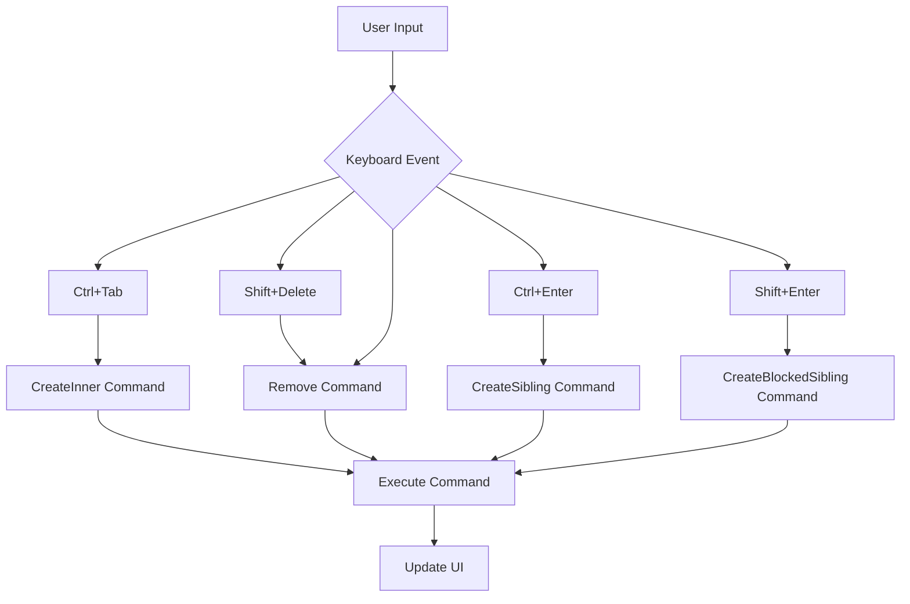
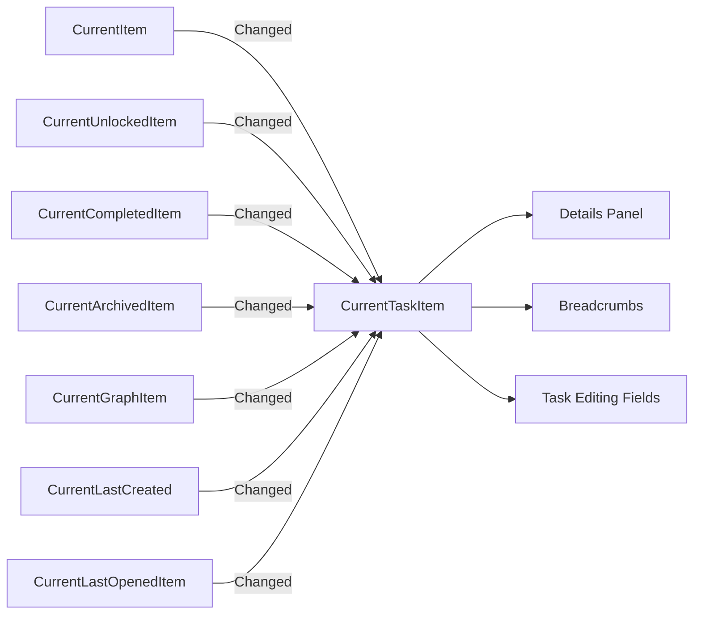

# Tabbed Views Navigation

<cite>
**Referenced Files in This Document**   
- [MainWindowViewModel.cs](file://src/Unlimotion.ViewModel/MainWindowViewModel.cs)
- [MainControl.axaml](file://src/Unlimotion/Views/MainControl.axaml)
- [MainWindow.axaml.cs](file://src/Unlimotion/Views/MainWindow.axaml.cs)
- [MainScreen.axaml.cs](file://src/Unlimotion/Views/MainScreen.axaml.cs)
</cite>

## Table of Contents
1. [Introduction](#introduction)
2. [View Modes Implementation](#view-modes-implementation)
3. [Tab Navigation and State Management](#tab-navigation-and-state-management)
4. [UI Layout and Rendering](#ui-layout-and-rendering)
5. [State Persistence](#state-persistence)
6. [Keyboard Shortcuts](#keyboard-shortcuts)
7. [Visual Indicators](#visual-indicators)
8. [Cross-Tab Context Synchronization](#cross-tab-context-synchronization)

## Introduction
Unlimotion implements a comprehensive tabbed navigation system that allows users to switch between different perspectives of their tasks. The system provides multiple views including All Tasks, Unlocked, Completed, Archived, Roadmap, Last Created, and Last Opened, each offering a unique way to organize and interact with tasks. This documentation details the implementation of this navigation system, focusing on the ViewModel logic, UI rendering, state management, and user interaction patterns.

## View Modes Implementation

The tabbed navigation system in Unlimotion is implemented through boolean properties in the MainWindowViewModel class that control which view mode is active. These properties include AllTasksMode, UnlockedMode, CompletedMode, ArchivedMode, GraphMode, LastCreatedMode, and LastOpenedMode, each corresponding to a specific tab in the interface.

Each view mode displays tasks according to specific criteria:
- **All Tasks**: Hierarchical representation of all tasks, showing parent-child relationships
- **Unlocked**: Tasks currently available for execution based on their unlocked status
- **Completed**: Tasks that have been completed, sorted by completion date
- **Archived**: Tasks that are no longer active but preserved for reference
- **Roadmap**: Graph-based visualization of task relationships and dependencies
- **Last Created**: Tasks sorted by creation date in descending order
- **Last Opened**: Recently accessed tasks in reverse chronological order

The implementation uses ReactiveUI's reactive programming model to manage the state of these view modes. When a user switches between tabs, the corresponding boolean property is updated, triggering a cascade of reactive operations that update the displayed content.

**Diagram sources**
- [MainWindowViewModel.cs](file://src/Unlimotion.ViewModel/MainWindowViewModel.cs#L1021-L1075)

**Section sources**
- [MainWindowViewModel.cs](file://src/Unlimotion.ViewModel/MainWindowViewModel.cs#L1021-L1075)

## Tab Navigation and State Management

The tab navigation system is managed through reactive commands and property subscriptions in the MainWindowViewModel. The implementation uses ReactiveUI's WhenAnyValue method to subscribe to changes in the view mode properties and update the CurrentItem observables accordingly.

When a user selects a tab, the corresponding boolean property is set to true while others are set to false. This change triggers the SelectCurrentTask method, which determines which CurrentItem observable should be updated based on the active view mode. The method uses a logical XOR operation to ensure only one view mode is active at a time.

The navigation system maintains separate collections of tasks for each view mode:
- CurrentItems: Tasks for the All Tasks view
- UnlockedItems: Tasks for the Unlocked view
- CompletedItems: Tasks for the Completed view
- ArchivedItems: Tasks for the Archived view
- LastCreatedItems: Tasks for the Last Created view
- LastOpenedItems: Tasks for the Last Opened view

Each collection is populated through DynamicData bindings that filter and transform the main task repository based on the specific criteria for each view mode.

**Diagram sources**
- [MainWindowViewModel.cs](file://src/Unlimotion.ViewModel/MainWindowViewModel.cs#L840-L876)
- [MainWindowViewModel.cs](file://src/Unlimotion.ViewModel/MainWindowViewModel.cs#L183-L216)

**Section sources**
- [MainWindowViewModel.cs](file://src/Unlimotion.ViewModel/MainWindowViewModel.cs#L840-L876)
- [MainWindowViewModel.cs](file://src/Unlimotion.ViewModel/MainWindowViewModel.cs#L183-L216)

## UI Layout and Rendering

The UI layout for the tabbed navigation system is defined in the MainControl.axaml file, which uses Avalonia's TabControl to implement the tabbed interface. Each tab is represented by a TabItem with a header corresponding to the view mode and content that displays the appropriate task list or visualization.

The MainWindow.axaml.cs and MainScreen.axaml.cs files serve as the primary window and screen components, respectively, coordinating the overall layout and rendering of the application. MainWindow.axaml.cs extends the Window class and serves as the main application window, while MainScreen.axaml.cs extends UserControl and contains the primary content of the application.

The MainControl.axaml file defines the tab structure with specific bindings for each tab:
- The IsSelected property of each TabItem is bound to the corresponding view mode property in MainWindowViewModel using OneWayToSource binding
- Each tab's content is bound to the appropriate task collection (CurrentItems, UnlockedItems, etc.)
- The SelectedItem property of each TreeView is bound to the corresponding CurrentItem observable

This binding architecture ensures that when a user selects a tab, the appropriate view mode property is updated, which in turn updates the displayed content and selection state.

**Diagram sources**
- [MainControl.axaml](file://src/Unlimotion/Views/MainControl.axaml#L81-L331)
- [MainWindow.axaml.cs](file://src/Unlimotion/Views/MainWindow.axaml.cs#L1-L12)
- [MainScreen.axaml.cs](file://src/Unlimotion/Views/MainScreen.axaml.cs#L1-L12)

**Section sources**
- [MainControl.axaml](file://src/Unlimotion/Views/MainControl.axaml#L81-L331)
- [MainWindow.axaml.cs](file://src/Unlimotion/Views/MainWindow.axaml.cs#L1-L12)
- [MainScreen.axaml.cs](file://src/Unlimotion/Views/MainScreen.axaml.cs#L1-L12)

## State Persistence

Unlimotion implements state persistence between sessions through configuration settings stored in JSON format. The application uses Microsoft.Extensions.Configuration to manage user preferences and view settings, ensuring that the user's preferred view modes and filters are restored when the application is reopened.

The MainWindowViewModel constructor reads configuration values for various display options:
- ShowCompleted: Whether completed tasks should be displayed in the All Tasks view
- ShowArchived: Whether archived tasks should be displayed in the All Tasks view
- ShowWanted: Whether only "wanted" tasks should be displayed in the Unlocked view
- CurrentSortDefinition: The selected sorting method for the All Tasks view
- CurrentSortDefinitionForUnlocked: The selected sorting method for the Unlocked view

When these properties change, the application automatically updates the configuration using the Set method, ensuring that the changes are persisted to disk. This reactive persistence mechanism ensures that user preferences are saved immediately without requiring explicit save operations.

The configuration system also persists date filter settings for views that support date-based filtering, such as Completed, Archived, and Last Created views. This allows users to return to their preferred date ranges when switching between sessions.

**Section sources**
- [MainWindowViewModel.cs](file://src/Unlimotion.ViewModel/MainWindowViewModel.cs#L36-L54)
- [MainWindowViewModel.cs](file://src/Unlimotion.ViewModel/MainWindowViewModel.cs#L53-L83)

## Keyboard Shortcuts

The tabbed navigation system supports keyboard shortcuts for efficient navigation between views. While the primary implementation of keyboard shortcuts is not explicitly visible in the provided code, the application follows standard accessibility patterns for tab navigation.

Users can navigate between tabs using standard keyboard navigation:
- Tab and Shift+Tab to move between interactive elements
- Arrow keys to navigate within tab groups
- Ctrl+Tab for creating inner tasks (as shown in the KeyBindings section of MainControl.axaml)

Additional keyboard shortcuts are available for task manipulation within each view:
- Shift+Delete: Remove the currently selected task
- Ctrl+Enter: Create a sibling task
- Shift+Enter: Create a blocked sibling task
- Ctrl+Tab: Create an inner task

These shortcuts enhance productivity by allowing users to perform common actions without switching to the mouse.

**Diagram sources**
- [MainControl.axaml](file://src/Unlimotion/Views/MainControl.axaml#L78-L80)

**Section sources**
- [MainControl.axaml](file://src/Unlimotion/Views/MainControl.axaml#L78-L80)

## Visual Indicators

The tabbed navigation system includes several visual indicators to enhance user experience and provide clear feedback about the current state:

1. **Active Tab Highlighting**: The currently selected tab is visually distinguished from inactive tabs through styling defined in the TabControl.Styles section of MainControl.axaml, which sets properties like font weight and padding.

2. **Breadcrumbs**: A breadcrumb trail at the top of the interface shows the hierarchical path of the currently selected task, providing context about its position in the task hierarchy.

3. **Task Status Indicators**: Various visual cues indicate task status:
   - Checkbox for completion status
   - Emoji indicators for task categorization
   - Date labels showing creation, completion, or archive dates
   - Special formatting for "wanted" tasks

4. **Expand/Collapse Indicators**: In hierarchical views, visual indicators show whether a task has subtasks and whether they are expanded or collapsed.

5. **Selection Highlighting**: The currently selected task is visually highlighted in the active view, making it easy to identify.

The visual design follows a consistent pattern across all views, with common elements like the remove button (❌) positioned consistently on the right side of each task item.

**Section sources**
- [MainControl.axaml](file://src/Unlimotion/Views/MainControl.axaml#L81-L331)

## Cross-Tab Context Synchronization

A key feature of Unlimotion's tabbed navigation system is the cross-tab context synchronization, which ensures that selecting a task in one tab automatically updates the context in other tabs. This is implemented through reactive subscriptions in the MainWindowViewModel that monitor changes to the CurrentItem observables.

The implementation uses multiple WhenAnyValue subscriptions to synchronize the CurrentTaskItem property across different views:
- When CurrentItem changes, CurrentTaskItem is updated
- When CurrentUnlockedItem changes, CurrentTaskItem is updated
- When CurrentCompletedItem changes, CurrentTaskItem is updated
- When CurrentArchivedItem changes, CurrentTaskItem is updated
- When CurrentGraphItem changes, CurrentTaskItem is updated
- When CurrentLastCreated changes, CurrentTaskItem is updated
- When CurrentLastOpenedItem changes, CurrentTaskItem is updated

This bidirectional synchronization ensures that regardless of which tab a user selects a task from, the detailed information panel on the right side of the interface displays the correct task details. The synchronization logic includes a null check to prevent clearing the current task when switching between tabs.

The FindTaskWrapperViewModel method plays a crucial role in this synchronization by locating the appropriate TaskWrapperViewModel in the source collection that corresponds to the currently selected task. This method handles both direct matches and hierarchical relationships, ensuring that tasks are properly highlighted even when they are nested within parent tasks.

**Diagram sources**
- [MainWindowViewModel.cs](file://src/Unlimotion.ViewModel/MainWindowViewModel.cs#L117-L185)

**Section sources**
- [MainWindowViewModel.cs](file://src/Unlimotion.ViewModel/MainWindowViewModel.cs#L117-L185)