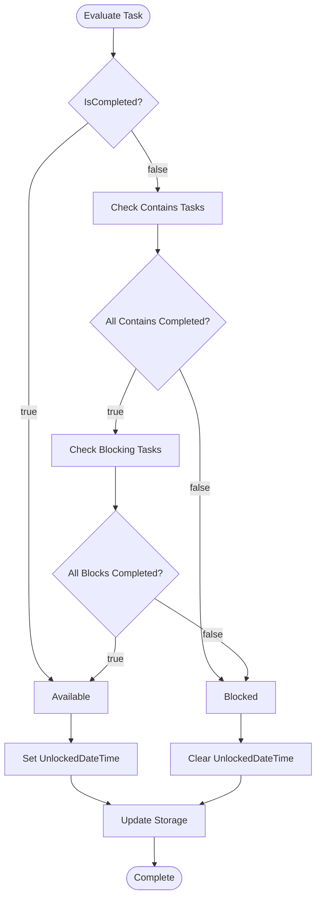

# Unlocked View

<cite>
**Referenced Files in This Document**
- [MainWindowViewModel.cs](file://src/Unlimotion.ViewModel/MainWindowViewModel.cs)
- [UnlockedTimeFilter.cs](file://src/Unlimotion.ViewModel/UnlockedTimeFilter.cs)
- [DurationFilter.cs](file://src/Unlimotion.ViewModel/DurationFilter.cs)
- [SortDefinition.cs](file://src/Unlimotion.ViewModel/SortDefinition.cs)
- [TaskItem.cs](file://src/Unlimotion.Domain/TaskItem.cs)
- [TaskItemViewModel.cs](file://src/Unlimotion.ViewModel/TaskItemViewModel.cs)
- [GraphViewModel.cs](file://src/Unlimotion.ViewModel/GraphViewModel.cs)
- [GraphControl.axaml.cs](file://src/Unlimotion\Views\GraphControl.axaml.cs)
- [TaskTreeManager.cs](file://src/Unlimotion.TaskTreeManager\TaskTreeManager.cs)
- [TaskAvailabilityCalculationTests.cs](file://src/Unlimotion.Test\TaskAvailabilityCalculationTests.cs)
</cite>

## Table of Contents
1. [Introduction](#introduction)
2. [System Architecture](#system-architecture)
3. [Core Components](#core-components)
4. [Reactive Pipeline](#reactive-pipeline)
5. [Filtering Logic](#filtering-logic)
6. [Task Availability Calculation](#task-availability-calculation)
7. [Graph View Integration](#graph-view-integration)
8. [Performance Considerations](#performance-considerations)
9. [Code Examples](#code-examples)
10. [Troubleshooting Guide](#troubleshooting-guide)
11. [Conclusion](#conclusion)

## Introduction

The Unlocked View is a sophisticated task management feature in the Unlimotion application that displays tasks currently available for work based on complex time-based unlocking logic. This system implements a reactive pipeline that monitors task properties and dynamically updates the task list in real-time, providing users with immediate visibility into available work items.

The Unlocked View serves as the primary interface for users to identify and prioritize tasks that can be worked on immediately, combining multiple filtering criteria including time-based availability, duration preferences, emoji categories, and user-defined wanted status filters.

## System Architecture

The Unlocked View architecture follows a reactive programming pattern built on the DynamicData library, enabling real-time updates as task properties change. The system consists of several interconnected layers that work together to provide seamless task availability management.

**Diagram sources**
- [MainWindowViewModel.cs](file://src/Unlimotion.ViewModel/MainWindowViewModel.cs#L15-L50)
- [GraphViewModel.cs](file://src/Unlimotion.ViewModel/GraphViewModel.cs#L8-L30)
- [TaskTreeManager.cs](file://src/Unlimotion.TaskTreeManager\TaskTreeManager.cs#L597-L737)

## Core Components

### MainWindowViewModel UnlockedItems Property

The `UnlockedItems` property serves as the central collection for displaying tasks available for work. This reactive collection is automatically updated whenever task properties change, ensuring real-time synchronization with the underlying data.

**Diagram sources**
- [MainWindowViewModel.cs](file://src/Unlimotion.ViewModel/MainWindowViewModel.cs#L971-L994)
- [TaskItemViewModel.cs](file://src/Unlimotion.ViewModel/TaskItemViewModel.cs#L20-L50)

### UnlockedTimeFilter Implementation

The `UnlockedTimeFilter` class defines six distinct time-based categories that determine task availability:

| Filter Category | Predicate Logic | Use Case |
|----------------|-----------------|----------|
| Unplanned | `PlannedBeginDateTime == null && PlannedEndDateTime == null` | Tasks without scheduling |
| Overdue | `PlannedEndDateTime != null && DateTime.Now.Date > PlannedEndDateTime?.Date` | Missed deadlines |
| Urgent | `PlannedEndDateTime != null && DateTime.Now.Date == PlannedEndDateTime?.Date` | Same-day deadlines |
| Today | `PlannedBeginDateTime != null && DateTime.Now.Date == PlannedBeginDateTime?.Date` | Scheduled for today |
| Maybe | Complex logic for future or partially scheduled tasks | Flexible scheduling |
| Future | `PlannedBeginDateTime != null && PlannedBeginDateTime?.Date > DateTime.Now.Date` | Upcoming tasks |

**Section sources**
- [UnlockedTimeFilter.cs](file://src/Unlimotion.ViewModel/UnlockedTimeFilter.cs#L15-L56)

### DurationFilter Categories

The `DurationFilter` provides granular control over task duration preferences, allowing users to focus on tasks of appropriate time commitment:

| Duration Range | Predicate | Typical Use Cases |
|---------------|-----------|-------------------|
| No duration | `PlannedDuration == null` | Tasks without time estimates |
| ≤5m | `PlannedDuration <= TimeSpan.FromMinutes(5)` | Quick tasks |
| 5m< & ≤30m | `5m < PlannedDuration <= 30m` | Short tasks |
| 30m< & ≤2h | `30m < PlannedDuration <= 2h` | Medium tasks |
| 2h< & ≤1d | `2h < PlannedDuration <= 1d` | Long tasks |
| 1d< | `PlannedDuration > 1d` | Extended projects |

**Section sources**
- [DurationFilter.cs](file://src/Unlimotion.ViewModel/DurationFilter.cs#L13-L47)

## Reactive Pipeline

The reactive pipeline forms the backbone of the Unlocked View's real-time functionality, continuously monitoring task properties and updating the display accordingly.

**Diagram sources**
- [MainWindowViewModel.cs](file://src/Unlimotion.ViewModel/MainWindowViewModel.cs#L499-L535)
- [TaskTreeManager.cs](file://src/Unlimotion.TaskTreeManager\TaskTreeManager.cs#L662-L737)

### AutoRefresh Mechanism

The system employs sophisticated auto-refresh capabilities that monitor specific task properties for changes:

**Diagram sources**
- [MainWindowViewModel.cs](file://src/Unlimotion.ViewModel/MainWindowViewModel.cs#L499-L535)
- [TaskItemViewModel.cs](file://src/Unlimotion.ViewModel\TaskItemViewModel.cs#L203-L232)

**Section sources**
- [MainWindowViewModel.cs](file://src/Unlimotion.ViewModel/MainWindowViewModel.cs#L499-L535)
- [TaskItemViewModel.cs](file://src/Unlimotion.ViewModel\TaskItemViewModel.cs#L203-L232)

## Filtering Logic

The Unlocked View implements a multi-layered filtering system that combines time-based, duration-based, and user-defined filters to present the most relevant tasks.

### Combined Filter Pipeline

**Diagram sources**
- [MainWindowViewModel.cs](file://src/Unlimotion.ViewModel\MainWindowViewModel.cs#L507-L525)

### Emoji Filter System

The emoji filter system allows users to categorize and filter tasks by emoji tags, with special handling for exclusion filters:

| Filter Type | Purpose | Implementation |
|------------|---------|----------------|
| Standard Emoji Filter | Show tasks with specific emojis | `task.GetAllEmoji.Contains(item.Emoji)` |
| Exclude Emoji Filter | Hide tasks with specific emojis | `!task.GetAllEmoji.Contains(item.Emoji)` |
| All Emoji Filter | Show all tasks regardless of emoji | `filter.All(e => e.ShowTasks == false)` |

**Section sources**
- [MainWindowViewModel.cs](file://src/Unlimotion.ViewModel\MainWindowViewModel.cs#L280-L350)

## Task Availability Calculation

The core business logic for determining task availability resides in the `TaskTreeManager` class, which calculates whether a task can be completed based on its dependencies and blocking relationships.

### Availability Calculation Rules

**Diagram sources**
- [TaskTreeManager.cs](file://src/Unlimotion.TaskTreeManager\TaskTreeManager.cs#L662-L737)

### UnlockedDateTime Management

The `UnlockedDateTime` property serves as a timestamp marker indicating when a task became available for work:

| Scenario | Action | Timestamp |
|----------|--------|-----------|
| Task becomes available | Set to current UTC time | `DateTimeOffset.UtcNow` |
| Task becomes blocked | Clear to null | `null` |
| No availability change | No action | No change |

**Section sources**
- [TaskTreeManager.cs](file://src/Unlimotion.TaskTreeManager\TaskTreeManager.cs#L697-L737)
- [TaskAvailabilityCalculationTests.cs](file://src/Unlimotion.Test\TaskAvailabilityCalculationTests.cs#L231-L272)

## Graph View Integration

The Graph View consumes a filtered subset of tasks from the Unlocked View, specifically designed for visual representation of task relationships and availability.

### Graph Data Flow

**Diagram sources**
- [GraphViewModel.cs](file://src\Unlimotion.ViewModel\GraphViewModel.cs#L15-L30)
- [GraphControl.axaml.cs](file://src\Unlimotion\Views\GraphControl.axaml.cs#L41-L79)

### Graph Rendering Logic

The Graph Control implements specialized rendering logic for the Unlocked View subset:

| Feature | Implementation | Purpose |
|---------|---------------|---------|
| Throttled Updates | `Throttle(TimeSpan.FromMilliseconds(100))` | Prevent excessive redraws |
| OnlyUnlocked Mode | Conditional task source selection | Focus on available tasks |
| Relationship Processing | BlockEdge and ContainEdge creation | Visualize task dependencies |
| Self-Links | Automatic self-edge for orphaned tasks | Complete graph representation |

**Section sources**
- [GraphControl.axaml.cs](file://src\Unlimotion\Views\GraphControl.axaml.cs#L41-L79)
- [GraphViewModel.cs](file://src\Unlimotion.ViewModel\GraphViewModel.cs#L15-L30)

## Performance Considerations

The Unlocked View is designed to handle large datasets efficiently through several optimization strategies:

### Reactive Performance Optimizations

| Technique | Implementation | Benefit |
|-----------|---------------|---------|
| Property Throttling | `PropertyChangedThrottleTimeSpanDefault` | Reduces excessive updates |
| AutoRefresh Optimization | Targeted property monitoring | Minimizes unnecessary recalculations |
| Collection Throttling | 100ms throttling for Graph updates | Prevents UI freezing |
| Selective Filtering | Multi-stage filter pipeline | Early termination of irrelevant tasks |

### Memory Management Strategies

### Scalability Guidelines

For optimal performance with large datasets:

1. **Filter Early**: Apply filters as early as possible in the reactive pipeline
2. **Throttle Updates**: Use appropriate throttling intervals for different operations
3. **Selective Monitoring**: Monitor only essential task properties
4. **Memory Cleanup**: Dispose of reactive subscriptions properly
5. **Batch Operations**: Group related updates together

## Code Examples

### Task Duration Modification Impact

When modifying a task's planned duration, the following sequence demonstrates the reactive pipeline in action:

**Diagram sources**
- [TaskItemViewModel.cs](file://src\Unlimotion.ViewModel\TaskItemViewModel.cs#L203-L232)
- [DurationFilter.cs](file://src\Unlimotion.ViewModel\DurationFilter.cs#L13-L47)

### Task Becomes Available Example

When a task transitions from blocked to available:

**Diagram sources**
- [TaskTreeManager.cs](file://src\Unlimotion.TaskTreeManager\TaskTreeManager.cs#L697-L737)
- [MainWindowViewModel.cs](file://src\Unlimotion.ViewModel\MainWindowViewModel.cs#L499-L535)

**Section sources**
- [TaskTreeManager.cs](file://src\Unlimotion.TaskTreeManager\TaskTreeManager.cs#L697-L737)
- [TaskItemViewModel.cs](file://src\Unlimotion.ViewModel\TaskItemViewModel.cs#L203-L232)

## Troubleshooting Guide

### Common Issues and Solutions

| Issue | Symptoms | Solution |
|-------|----------|----------|
| Tasks not appearing in Unlocked View | Expected tasks missing | Check `IsCanBeCompleted` and `IsCompleted` properties |
| Performance degradation | Slow UI updates | Verify throttling settings and filter efficiency |
| Incorrect task availability | Wrong tasks shown | Review `UnlockedTimeFilter` predicates |
| Graph view not updating | Static graph display | Check `OnlyUnlocked` mode and subscription timing |

### Debugging Techniques

1. **Property Monitoring**: Enable detailed logging for task property changes
2. **Filter Validation**: Verify filter predicates return expected results
3. **Reactive Chain Inspection**: Trace the reactive pipeline for bottlenecks
4. **Memory Profiling**: Monitor memory usage during large dataset operations

### Performance Tuning

For optimal performance:

- Adjust throttling intervals based on dataset size
- Optimize filter predicates for early termination
- Monitor reactive subscription lifecycle
- Implement selective property monitoring

## Conclusion

The Unlocked View represents a sophisticated implementation of reactive task management, combining real-time filtering, complex availability calculations, and efficient performance optimization. Through its multi-layered architecture and reactive pipeline, it provides users with immediate visibility into available work items while maintaining excellent performance characteristics even with large datasets.

The system's design emphasizes separation of concerns, with business logic residing in the domain layer while presentation logic remains focused on UI coordination. This architectural approach ensures maintainability, testability, and scalability for future enhancements.

Key strengths of the implementation include:

- **Real-time responsiveness**: Immediate updates as task properties change
- **Flexible filtering**: Multi-dimensional task categorization and sorting
- **Performance optimization**: Intelligent throttling and selective monitoring
- **Visual integration**: Seamless Graph View consumption of filtered data
- **Extensible design**: Modular filter system supporting future enhancements

The Unlocked View serves as an excellent example of modern reactive programming patterns applied to task management, demonstrating how complex business logic can be effectively separated from presentation concerns while maintaining excellent user experience.