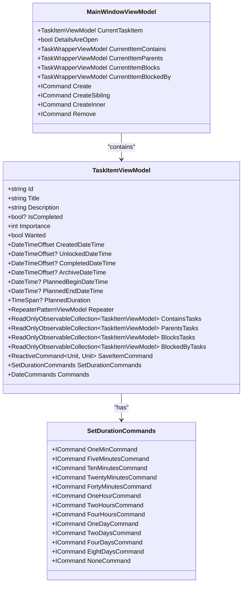

# Task Panel Details

<cite>
**Referenced Files in This Document**   
- [MainControl.axaml](file://src/Unlimotion/Views/MainControl.axaml)
- [MainWindowViewModel.cs](file://src/Unlimotion.ViewModel/MainWindowViewModel.cs)
- [TaskItemViewModel.cs](file://src/Unlimotion.ViewModel/TaskItemViewModel.cs)
- [SetDurationCommands.cs](file://src/Unlimotion.ViewModel/SetDurationCommands.cs)
</cite>

## Table of Contents
1. [Introduction](#introduction)
2. [Task Panel Architecture](#task-panel-architecture)
3. [Data Binding and Reactive Flow](#data-binding-and-reactive-flow)
4. [Property Display and Editing](#property-display-and-editing)
5. [Reactive Data Flow System](#reactive-data-flow-system)
6. [Layout and Form Controls](#layout-and-form-controls)
7. [Expandable Sections and Task Relationships](#expandable-sections-and-task-relationships)
8. [Validation and State Management](#validation-and-state-management)

## Introduction
The task panel component in Unlimotion provides a detailed view of selected tasks, offering comprehensive information and editing capabilities. This panel dynamically updates when a new task is selected across any view in the application, ensuring a consistent user experience. The component is integrated with the MainWindowViewModel's CurrentTaskItem property, which serves as the central binding point for task selection throughout the application. The implementation leverages ReactiveUI's reactive programming model to ensure immediate UI updates when task properties change, creating a responsive and seamless user interface.

**Section sources**
- [MainControl.axaml](file://src/Unlimotion/Views/MainControl.axaml#L346-L347)
- [MainWindowViewModel.cs](file://src/Unlimotion.ViewModel/MainWindowViewModel.cs#L993-L1021)

## Task Panel Architecture
The task panel is implemented as a split view pane in the MainControl.axaml file, which contains a scrollable stack panel with various controls for displaying and editing task properties. The panel's visibility is controlled by the DetailsAreOpen property in MainWindowViewModel, which toggles the split view's pane. When a task is selected in any of the application's views (All Tasks, Unlocked, Completed, etc.), the CurrentTaskItem property in MainWindowViewModel is updated, which in turn updates the DataContext of the task panel to display the selected task's details.

The architecture follows the MVVM pattern, with the TaskItemViewModel serving as the view model for individual tasks. This view model contains all the properties that are displayed in the task panel, including title, emoji, planned duration, completion status, and other metadata. The MainWindowViewModel acts as the container view model, managing the current selection and providing commands for task operations.

**Diagram sources**
- [MainWindowViewModel.cs](file://src/Unlimotion.ViewModel/MainWindowViewModel.cs#L993-L1021)
- [TaskItemViewModel.cs](file://src/Unlimotion.ViewModel/TaskItemViewModel.cs#L0-L40)
- [SetDurationCommands.cs](file://src/Unlimotion.ViewModel/SetDurationCommands.cs#L0-L16)

## Data Binding and Reactive Flow
The task panel binds to the CurrentTaskItem property in MainWindowViewModel through a two-way binding mechanism. When a task is selected in any view, the corresponding CurrentItem property (CurrentItem, CurrentUnlockedItem, etc.) is updated, which triggers the CurrentTaskItem update through reactive subscriptions. The MainWindowViewModel contains multiple WhenAnyValue subscriptions that listen to changes in the current item properties across different views:

**Diagram sources**
- [MainWindowViewModel.cs](file://src/Unlimotion.ViewModel/MainWindowViewModel.cs#L117-L152)
- [MainControl.axaml](file://src/Unlimotion/Views/MainControl.axaml#L346-L347)

## Property Display and Editing
The task panel displays and allows editing of various task properties through appropriate form controls. The title is displayed in a TextBox with a watermark placeholder, allowing users to edit the task title directly. The completion status is represented by a CheckBox bound to the IsCompleted property, which is only enabled when the task can be completed (IsCanBeCompleted is true).

The emoji is extracted from the title using a regular expression pattern that matches Unicode emoji characters. The OnlyTextTitle property in TaskItemViewModel returns the title without the emoji, allowing the UI to display the emoji separately from the text content. The planned duration is displayed and edited through a TextBox with a LostFocusUpdateBindingBehavior, which ensures the binding is updated when the control loses focus.

For planned dates (begin and end), CalendarDatePicker controls are used, providing a user-friendly interface for selecting dates. The planned duration can also be set through a dropdown menu with predefined duration options (1 minute, 5 minutes, 1 hour, 1 day, etc.), implemented through the SetDurationCommands class.

**Section sources**
- [MainControl.axaml](file://src/Unlimotion/Views/MainControl.axaml#L350-L352)
- [TaskItemViewModel.cs](file://src/Unlimotion.ViewModel/TaskItemViewModel.cs#L626-L666)

## Reactive Data Flow System
The task panel leverages ReactiveUI's WhenAnyValue and DynamicData bindings to create a reactive data flow that ensures immediate UI updates when task properties change. In the TaskItemViewModel constructor, a propertyChanged observable is created that listens to changes in specific properties (Title, Description, Planned dates, Duration, Repeater, Importance, Wanted). This observable is throttled to prevent excessive updates, with a default throttle time of 10 seconds.

When a property changes, the SaveItemCommand is executed, which calls the Update method on the task storage. This creates a reactive chain where UI changes are automatically persisted to storage after a short delay, providing a smooth user experience without immediate saving on every keystroke.

The planned date and duration properties have additional reactive logic to maintain consistency. When the planned begin date changes, the planned end date is automatically recalculated based on the planned period. Similarly, when the planned end date changes, the planned period is recalculated based on the difference between the begin and end dates.

**Diagram sources**
- [TaskItemViewModel.cs](file://src/Unlimotion.ViewModel/TaskItemViewModel.cs#L203-L232)
- [TaskItemViewModel.cs](file://src/Unlimotion.ViewModel/TaskItemViewModel.cs#L270-L300)

## Layout and Form Controls
The task panel uses a structured layout with StackPanel and Grid containers to organize the various controls. The main layout consists of a StackPanel containing multiple sections for different types of task information. Each section uses appropriate form controls for the specific data type:

- TextBox for text input (title, description)
- CheckBox for boolean values (completion status, wanted status)
- NumericUpDown for numeric values (importance)
- CalendarDatePicker for date selection (planned begin/end dates)
- ComboBox for selection from predefined options (repeater templates)
- DropDownButton with MenuFlyout for quick actions (setting dates and durations)

The panel also includes expandable sections for task relationships (parents, blocking tasks, containing tasks, blocked tasks), each displayed in a TreeView control. These sections show the hierarchical relationships between tasks, allowing users to navigate the task structure.

The layout is responsive, with the split view pane that can be toggled open or closed. When open, the pane displays the full task details; when closed, it shows only a minimal interface with a toggle button.

**Section sources**
- [MainControl.axaml](file://src/Unlimotion/Views/MainControl.axaml#L346-L514)

## Expandable Sections and Task Relationships
The task panel includes expandable sections that display the relationships between the current task and other tasks in the system. These sections are implemented using TreeView controls bound to TaskWrapperViewModel instances that represent the different relationship types:

- Parents Tasks: Shows tasks that contain the current task
- Blocking Tasks: Shows tasks that block the current task from being completed
- Containing Tasks: Shows tasks contained within the current task
- Blocked Tasks: Shows tasks that are blocked by the current task

These relationships are managed through ObservableCollection properties in the TaskItemViewModel (Parents, Blocks, Contains, BlockedBy) that store the IDs of related tasks. The TaskItemViewModel uses DynamicData to create observable collections (ParentsTasks, BlocksTasks, ContainsTasks, BlockedByTasks) that are automatically updated when the underlying ID collections change.

The MainWindowViewModel contains reactive bindings that create TaskWrapperViewModel instances for each relationship type when the CurrentTaskItem changes. These bindings use the ChildSelector property to specify which collection to use for child tasks, enabling the TreeView to display the hierarchical structure.

**Diagram sources**
- [MainWindowViewModel.cs](file://src/Unlimotion.ViewModel/MainWindowViewModel.cs#L748-L781)
- [MainWindowViewModel.cs](file://src/Unlimotion.ViewModel/MainWindowViewModel.cs#L780-L811)

## Validation and State Management
The task panel implements several validation and state management mechanisms to ensure data integrity and provide a smooth user experience. The auto-save functionality is throttled to prevent excessive updates, with immediate saving only when the application is not yet initialized.

For date and duration properties, validation is performed to ensure consistency. When the planned begin date is after the planned end date, the planned period is set to null to indicate an invalid state. The UI reflects this state by clearing the duration display.

The task panel also handles special cases such as task archiving, which requires confirmation when the task has children. The ArchiveCommand in TaskItemViewModel shows a confirmation dialog when archiving or unarchiving a task with contained tasks, preventing accidental state changes.

State changes are propagated through the system using reactive commands and property change notifications. When a task property changes, the change is first applied to the TaskItemViewModel, then propagated to the underlying TaskItem model, and finally persisted to storage through the task repository.

**Section sources**
- [TaskItemViewModel.cs](file://src/Unlimotion.ViewModel/TaskItemViewModel.cs#L139-L170)
- [TaskItemViewModel.cs](file://src/Unlimotion.ViewModel/TaskItemViewModel.cs#L588-L625)