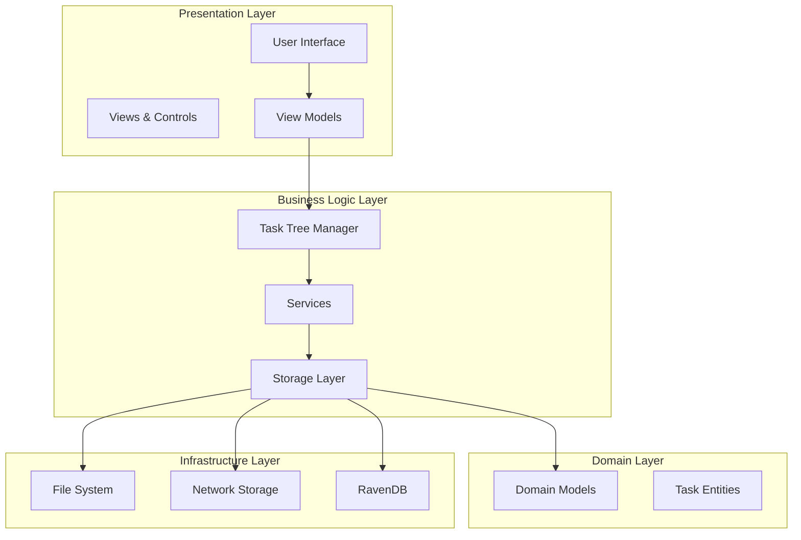
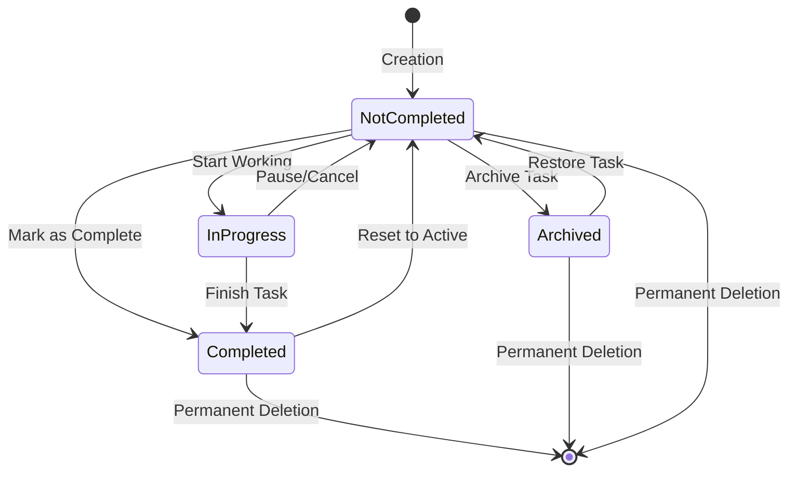
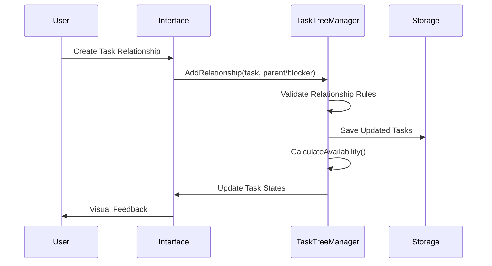

# System Overview

<cite>
**Referenced Files in This Document**
- [README.md](file://README.md)
- [TaskItem.cs](file://src/Unlimotion.Domain/TaskItem.cs)
- [TaskItemViewModel.cs](file://src/Unlimotion.ViewModel/TaskItemViewModel.cs)
- [MainWindowViewModel.cs](file://src/Unlimotion.ViewModel/MainWindowViewModel.cs)
- [TaskTreeManager.cs](file://src/Unlimotion.TaskTreeManager/TaskTreeManager.cs)
- [GraphControl.axaml.cs](file://src/Unlimotion/Views/GraphControl.axaml.cs)
- [MainControl.axaml.cs](file://src/Unlimotion/Views/MainControl.axaml.cs)
- [SettingsViewModel.cs](file://src/Unlimotion.ViewModel/SettingsViewModel.cs)
- [AppModelMapping.cs](file://src/Unlimotion/AppModelMapping.cs)
- [ApplicationViewModel.cs](file://src/Unlimotion/ApplicationViewModel.cs)
</cite>

## Table of Contents
1. [Introduction](#introduction)
2. [System Architecture](#system-architecture)
3. [Core Features](#core-features)
4. [Task Management System](#task-management-system)
5. [User Interface Components](#user-interface-components)
6. [Task Relationships and States](#task-relationships-and-states)
7. [Advanced Functionality](#advanced-functionality)
8. [Cross-Platform Accessibility](#cross-platform-accessibility)
9. [Comparison with Traditional Task Managers](#comparison-with-traditional-task-managers)
10. [Getting Started](#getting-started)

## Introduction

Unlimotion is a sophisticated hierarchical task management application designed to handle complex project planning through unlimited nesting, multi-parent relationships, and blocking dependencies. Unlike conventional task managers, Unlimotion enables users to create intricate task hierarchies where a single task can belong to multiple parent tasks simultaneously, forming complex dependency chains that mirror real-world project structures.

The system serves both personal productivity enthusiasts and professional teams by providing visual roadmap views, cross-platform accessibility, and intuitive drag-and-drop interactions. Its unique approach to task relationships and availability calculations makes it particularly suited for managing complex projects with interdependent tasks and multiple perspectives.

**Section sources**
- [README.md](file://README.md#L1-L20)

## System Architecture

Unlimotion follows a layered architecture pattern with clear separation of concerns across multiple specialized components:

**Diagram sources**
- [MainWindowViewModel.cs](file://src/Unlimotion.ViewModel/MainWindowViewModel.cs#L1-L50)
- [TaskTreeManager.cs](file://src/Unlimotion.TaskTreeManager/TaskTreeManager.cs#L1-L30)

The architecture consists of five main layers:

### Presentation Layer
- **User Interface**: Avalonia-based cross-platform UI framework
- **Views & Controls**: Modular UI components for different task views
- **View Models**: ReactiveUI-based presentation logic

### Business Logic Layer  
- **Task Tree Manager**: Core business logic for task relationships and availability
- **Services**: Application services for notifications, backups, and file operations
- **Storage Layer**: Abstraction for different storage backends

### Domain Layer
- **Domain Models**: Core task entity definitions
- **Entities**: TaskItem and related domain objects

### Infrastructure Layer
- **File System**: Local file-based storage
- **Network Storage**: Remote server storage capabilities
- **Database**: RavenDB integration for scalable storage

**Section sources**
- [MainWindowViewModel.cs](file://src/Unlimotion.ViewModel/MainWindowViewModel.cs#L1-L100)
- [TaskTreeManager.cs](file://src/Unlimotion.TaskTreeManager/TaskTreeManager.cs#L1-L50)

## Core Features

### Unlimited Task Nesting
Unlimotion breaks the limitations of traditional task managers by allowing unlimited nesting levels. Tasks can be organized in complex hierarchies where each task can contain multiple subtasks, and subtasks can themselves contain further subtasks without restriction.

### Multi-Parent Task Relationships
Unlike conventional task managers that enforce a strict single-parent hierarchy, Unlimotion allows tasks to have multiple parent relationships. This enables:
- **Inter-project Tasks**: Tasks that span multiple projects or contexts
- **Tag-like Organization**: Using parent tasks as categories or themes
- **Multiple Perspectives**: Viewing the same task from different organizational angles

### Blocking Dependencies
The system implements sophisticated blocking mechanisms where tasks can prevent others from becoming available:
- **Blocking Tasks**: Tasks that must be completed before others can proceed
- **Blocked Tasks**: Tasks that cannot be marked as complete until their blockers are finished
- **Recursive Blocking**: Blocking relationships cascade through task hierarchies

### Visual Roadmap Views
The roadmap view presents tasks as a directed graph, making complex dependency relationships visually apparent:
- **Green Arrows**: Parent-child relationships indicating containment
- **Red Arrows**: Blocking relationships showing dependencies
- **Interactive Navigation**: Clickable nodes for quick task access

**Section sources**
- [README.md](file://README.md#L5-L20)
- [GraphControl.axaml.cs](file://src/Unlimotion/Views/GraphControl.axaml.cs#L50-L100)

## Task Management System

### Task States and Transitions

Unlimotion implements a comprehensive state management system with four distinct states and clear transition rules:

**Diagram sources**
- [README.md](file://README.md#L28-L37)
- [TaskItemViewModel.cs](file://src/Unlimotion.ViewModel/TaskItemViewModel.cs#L100-L150)

### Task Availability Calculation

The system employs sophisticated logic to determine task availability based on several factors:

#### Core Availability Rules
1. **Contained Tasks**: All child tasks must be completed
2. **Blocking Tasks**: All blocking dependencies must be completed  
3. **Parent Dependencies**: All parent blocking relationships must be satisfied

#### Visual Indicators
Blocked tasks are visually distinguished through:
- **Transparency**: Reduced opacity of checkboxes and text
- **Color Coding**: Different visual states for various availability conditions
- **Interactive Feedback**: Real-time updates as dependencies change

**Section sources**
- [TaskTreeManager.cs](file://src/Unlimotion.TaskTreeManager/TaskTreeManager.cs#L524-L563)
- [TaskAvailabilityCalculationTests.cs](file://src/Unlimotion.Test/TaskAvailabilityCalculationTests.cs#L158-L200)

## User Interface Components

### Three-Panel Layout

Unlimotion's interface is structured around three primary components:

#### Breadcrumb Navigation
Located at the top, breadcrumbs provide contextual navigation showing the hierarchical path to the currently selected task. This enables users to understand their position within the task tree and navigate efficiently between different levels of the hierarchy.

#### Task Details Panel
On the right side, a comprehensive details panel displays and allows editing of all task attributes including:
- Title and description fields
- Planning dates (start/end)
- Duration estimates
- Priority and importance settings
- Repeating patterns
- Related task connections

#### Tabbed View System
The left panel offers six distinct views for different task management perspectives:

| View | Purpose | Key Features |
|------|---------|--------------|
| **All Tasks** | Hierarchical overview | Root-level organization, nested display |
| **Last Created** | Recent activity | Chronological sorting, creation timestamps |
| **Unlocked** | Available tasks | Current actionable items, availability filtering |
| **Completed** | Task history | Completion tracking, reverse chronological order |
| **Archived** | Historical tasks | Long-term storage, selective restoration |
| **Roadmap** | Dependency visualization | Graph-based relationships, interactive navigation |

**Section sources**
- [README.md](file://README.md#L82-L114)
- [MainWindowViewModel.cs](file://src/Unlimotion.ViewModel/MainWindowViewModel.cs#L200-L300)

### Drag-and-Drop Operations

The system provides intuitive drag-and-drop functionality with modifier-key combinations for different operations:

#### Mouse Operation Matrix

| Modifier Keys | Operation | Effect |
|---------------|-----------|--------|
| **None** | Attach | Adds task as child/subtask |
| **Shift** | Move | Relocates task within hierarchy |
| **Ctrl** | Block | Creates blocking relationship |
| **Alt** | Reverse Block | Makes target task block the dragged task |
| **Ctrl+Shift** | Clone | Duplicates task as subtask |

#### Keyboard Shortcuts
- **Ctrl+Enter**: Create sibling task
- **Shift+Enter**: Create sibling task and block it
- **Ctrl+Tab**: Create inner/nested task

**Section sources**
- [README.md](file://README.md#L136-L154)
- [MainControl.axaml.cs](file://src/Unlimotion/Views/MainControl.axaml.cs#L69-L236)

## Task Relationships and States

### Four Types of Task Relationships

Unlimotion defines four fundamental task relationship types that enable complex organizational structures:

#### 1. Parent Tasks
Parent tasks contain child tasks as integral components necessary for execution. These relationships establish the primary hierarchical structure where child tasks represent steps or components of larger objectives.

#### 2. Containing Tasks  
Containing tasks decompose into child tasks that represent parts or steps of the parent task. This relationship type supports the breakdown of complex tasks into manageable components.

#### 3. Blocking By Tasks
Blocking tasks must be completed before the current task can become available. This creates forward dependencies where task completion drives progress through the system.

#### 4. Blocked Tasks
Blocked tasks cannot be marked as complete until their blocking dependencies are satisfied. This establishes backward dependencies that prevent premature task completion.

### Relationship Management Workflow

**Diagram sources**
- [TaskTreeManager.cs](file://src/Unlimotion.TaskTreeManager/TaskTreeManager.cs#L486-L527)
- [MainControl.axaml.cs](file://src/Unlimotion/Views/MainControl.axaml.cs#L137-L203)

**Section sources**
- [README.md](file://README.md#L57-L79)
- [TaskItem.cs](file://src/Unlimotion.Domain/TaskItem.cs#L15-L25)

## Advanced Functionality

### Emoji-Based Organization
Unlimotion supports emoji-based task categorization and filtering. When emojis appear in task titles, they enable:
- **Quick Filtering**: Filter tasks by emoji categories
- **Visual Grouping**: See related tasks grouped visually
- **Hierarchical Display**: Emojis from parent tasks shown alongside child tasks

### Repeatable Tasks
The system supports recurring task patterns with configurable frequencies:
- **Daily, Weekly, Monthly, Yearly** recurrence
- **Workday-only** scheduling
- **Custom Patterns** with specific day selections

### Automatic Backup and Sync
Built-in backup capabilities include:
- **Git Integration**: Automatic version control through Git
- **Remote Storage**: Server-based synchronization
- **Conflict Resolution**: Intelligent merge strategies

**Section sources**
- [README.md](file://README.md#L155-L186)
- [SettingsViewModel.cs](file://src/Unlimotion.ViewModel/SettingsViewModel.cs#L40-L80)

## Cross-Platform Accessibility

Unlimotion is built on the Avalonia framework, providing native cross-platform support:

### Supported Platforms
- **Windows**: Native desktop application with Windows-specific optimizations
- **macOS**: Full native integration with macOS design patterns
- **Linux**: Debian-based distributions with native package support
- **Web**: Browser-based access through WebAssembly
- **Mobile**: Android and iOS applications for on-the-go access

### Platform-Specific Features
- **Windows**: Win+. emoji picker, native file dialogs
- **macOS**: Cmd+Ctrl+Space emoji picker, dock integration
- **Linux**: Ctrl+. emoji picker, desktop environment integration

### Data Portability
All task data is stored in human-readable JSON format, ensuring:
- **Data Independence**: No vendor lock-in
- **Manual Access**: Direct file manipulation when needed
- **Migration Support**: Easy data export and import

**Section sources**
- [README.md](file://README.md#L21-L50)

## Comparison with Traditional Task Managers

### Key Differentiators

| Feature | Traditional Task Managers | Unlimotion |
|---------|--------------------------|------------|
| **Hierarchy Depth** | Limited nesting | Unlimited nesting |
| **Parent Relationships** | Single parent only | Multiple parents allowed |
| **Dependency Management** | Basic blocking | Sophisticated blocking chains |
| **Visualization** | Linear lists | Interactive graphs |
| **Multi-Perspective** | Single organization | Multiple organizational views |

### Unique Advantages

#### Multi-Parent Flexibility
Traditional systems force rigid single-parent hierarchies, limiting organizational flexibility. Unlimotion's multi-parent capability enables:
- **Inter-project Tasks**: Tasks spanning multiple projects
- **Tag Replacement**: Using parent tasks as categories
- **Dual Perspectives**: Viewing tasks from different organizational angles

#### Complex Dependency Chains
While basic task managers handle simple blocking relationships, Unlimotion excels at:
- **Recursive Dependencies**: Blocking relationships that propagate through hierarchies
- **Conditional Availability**: Tasks that become available based on complex criteria
- **Visual Dependency Tracking**: Clear visualization of complex dependency networks

#### Advanced State Management
Unlimotion's state system goes beyond simple completion tracking to include:
- **Availability Calculations**: Dynamic task availability based on dependencies
- **Automatic State Updates**: Real-time state changes as dependencies shift
- **Visual Transparency**: Clear indication of blocked vs. available tasks

**Section sources**
- [README.md](file://README.md#L5-L20)
- [TaskTreeManager.cs](file://src/Unlimotion.TaskTreeManager/TaskTreeManager.cs#L524-L563)

## Getting Started

### Creating Tasks

#### Basic Task Creation
New tasks are always created relative to the currently selected task. The system provides multiple creation methods:

**Keyboard Shortcuts**:
- **Ctrl+Enter**: Create sibling task at the same level
- **Shift+Enter**: Create sibling task and block it with the current task  
- **Ctrl+Tab**: Create nested task inside the current task

**Interface Buttons**:
- **➕Sibling**: Add task at the same hierarchy level
- **➕🔒Sibling**: Add task and create blocking relationship
- **➕Inner**: Create nested task within the current task

#### Task Creation Workflow
1. Select a parent task or work area
2. Choose creation method (keyboard shortcut or button)
3. Enter task title (required for activation)
4. Configure additional properties as needed
5. Task appears in appropriate view based on selection context

### Managing Task Hierarchies

#### Drag-and-Drop Operations
The system supports intuitive drag-and-drop interactions for task reorganization:

**Basic Operations**:
- **Simple Drag**: Attach task as child
- **Shift+Drag**: Move task within hierarchy
- **Ctrl+Drag**: Create blocking relationship
- **Alt+Drag**: Make target task block the dragged task
- **Ctrl+Shift+Drag**: Clone task as subtask

#### Mouse Interaction Patterns
- **Single-click**: Select task for editing/viewing
- **Double-click**: Expand/collapse task hierarchy
- **Right-click**: Context menu for additional operations
- **Drag-and-drop**: Reorganize task structure

### Practical Examples

#### Example 1: Project Planning
1. Create main project task
2. Add subtasks representing major milestones
3. Break down milestones into smaller steps
4. Use blocking relationships to establish dependencies
5. Monitor availability through the Unlocked view

#### Example 2: Multi-Project Task
1. Create task with relevant title
2. Add as child to multiple project parent tasks
3. Use Roadmap view to visualize cross-project dependencies
4. Manage task through different project perspectives

#### Example 3: Complex Dependency Chain
1. Create initial task
2. Add dependent tasks with blocking relationships
3. Use Roadmap view to visualize dependency flow
4. Monitor task availability as dependencies change
5. Adjust relationships through drag-and-drop operations

**Section sources**
- [README.md](file://README.md#L115-L135)
- [MainWindowViewModel.cs](file://src/Unlimotion.ViewModel/MainWindowViewModel.cs#L80-L150)