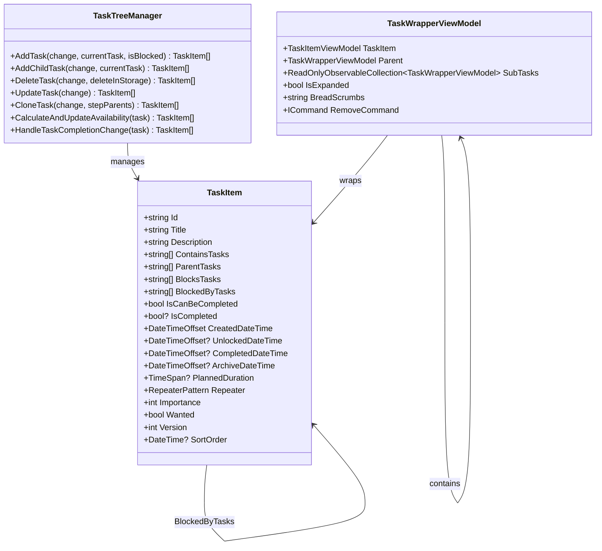
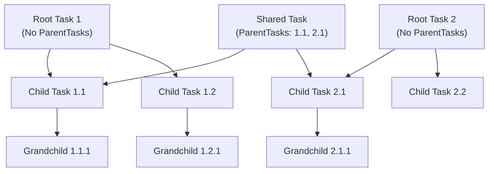
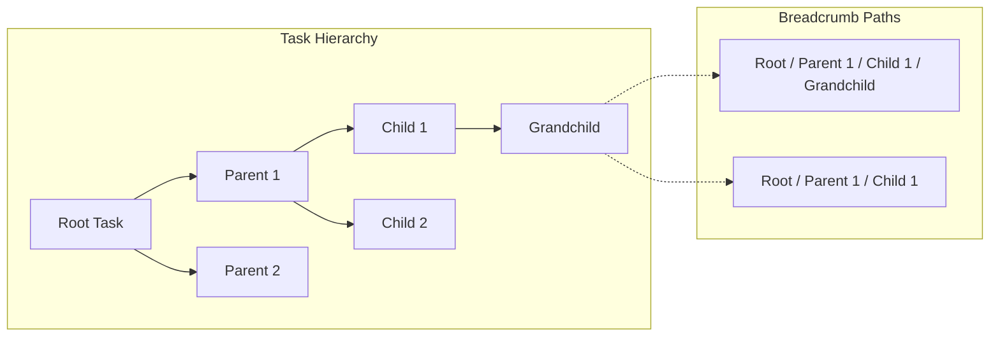
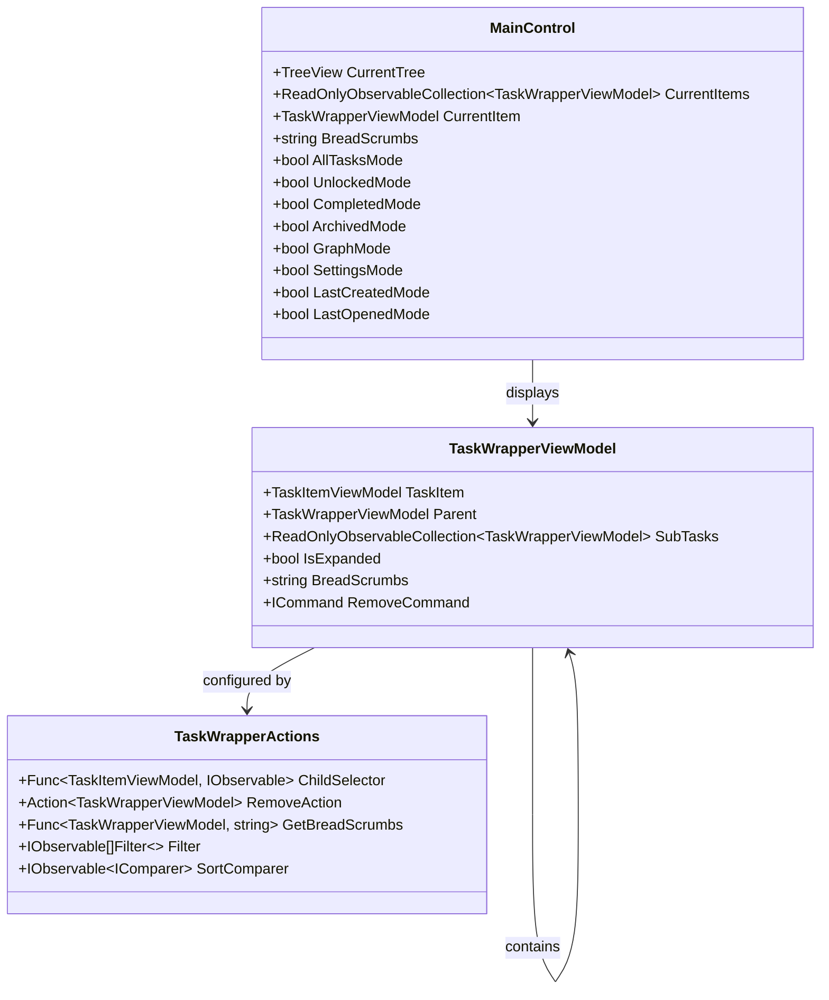

# Task Hierarchy

<cite>
**Referenced Files in This Document**
- [TaskItem.cs](file://src/Unlimotion.Domain/TaskItem.cs)
- [MainWindowViewModel.cs](file://src/Unlimotion.ViewModel/MainWindowViewModel.cs)
- [TaskTreeManager.cs](file://src/Unlimotion.TaskTreeManager/TaskTreeManager.cs)
- [TaskItemViewModel.cs](file://src/Unlimotion.ViewModel/TaskItemViewModel.cs)
- [TaskWrapperViewModel.cs](file://src/Unlimotion.ViewModel/TaskWrapperViewModel.cs)
- [AutoUpdatingDictionary.cs](file://src/Unlimotion.TaskTreeManager/AutoUpdatingDictionary.cs)
- [MainControl.axaml](file://src/Unlimotion/Views/MainControl.axaml)
- [MainScreen.axaml](file://src/Unlimotion/Views/MainScreen.axaml)
- [README.md](file://README.md)
</cite>

## Table of Contents
1. [Introduction](#introduction)
2. [Unlimited Nesting Architecture](#unlimited-nesting-architecture)
3. [Root-Level Task Structure](#root-level-task-structure)
4. [Hierarchical Data Model](#hierarchical-data-model)
5. [Breadcrumb Navigation System](#breadcrumb-navigation-system)
6. [UI Implementation](#ui-implementation)
7. [Tree Rendering Performance](#tree-rendering-performance)
8. [Task Creation Workflows](#task-creation-workflows)
9. [Performance Considerations](#performance-considerations)
10. [Best Practices](#best-practices)

## Introduction

Unlimotion implements an innovative hierarchical task organization system that enables unlimited nesting levels, allowing users to create complex task decomposition structures. Unlike traditional task managers that limit nesting depth, Unlimotion's architecture supports arbitrary levels of task hierarchy, enabling sophisticated project management scenarios with parent-child relationships and blocking dependencies.

The system's strength lies in its ability to treat a single task as a child of multiple parent tasks simultaneously, providing flexibility for cross-project relationships and tag-like functionality. This design enables users to organize tasks in multiple contexts while maintaining a unified task tree structure.

## Unlimited Nesting Architecture

### Recursive Data Patterns

The task hierarchy is built on recursive data patterns where each task maintains references to its parent and child relationships. The [`TaskItem`](file://src/Unlimotion.Domain/TaskItem.cs) class serves as the foundation for this recursive structure:

**Diagram sources**
- [TaskItem.cs](file://src/Unlimotion.Domain/TaskItem.cs#L5-L32)
- [TaskTreeManager.cs](file://src/Unlimotion.TaskTreeManager/TaskTreeManager.cs#L10-L837)
- [TaskWrapperViewModel.cs](file://src/Unlimotion.ViewModel/TaskWrapperViewModel.cs#L50-L124)

### Multi-Parent Relationships

One of Unlimotion's distinctive features is its support for multiple parent relationships. A task can belong to multiple parent tasks simultaneously, enabling:

- **Cross-project organization**: Tasks can appear in multiple project contexts
- **Tag-like functionality**: Parent tasks serve as organizational categories
- **Flexible categorization**: Tasks can be organized by multiple criteria

This is achieved through the `ParentTasks` collection, which maintains a list of parent task identifiers rather than enforcing a strict single-parent hierarchy.

**Section sources**
- [TaskItem.cs](file://src/Unlimotion.Domain/TaskItem.cs#L18-L20)
- [TaskTreeManager.cs](file://src/Unlimotion.TaskTreeManager/TaskTreeManager.cs#L25-L85)

## Root-Level Task Structure

### Definition of Root Tasks

Root-level tasks are those that have no parent relationships. The system identifies root tasks by checking the absence of entries in the `ParentTasks` collection. This creates a natural hierarchy where root tasks form the base of the task tree.

### Root Task Identification

The system uses reactive filtering to identify and display root tasks. The [`GetRoots`](file://src/Unlimotion/TaskStorageExtensions.cs) extension method demonstrates how root tasks are identified by checking for tasks that don't appear in any other task's `ContainsTasks` collection.

**Section sources**
- [TaskStorageExtensions.cs](file://src/Unlimotion/TaskStorageExtensions.cs#L8-L34)

## Hierarchical Data Model

### Task Relationships

The hierarchical structure is maintained through four primary relationship collections:

| Relationship Type | Purpose | Directionality |
|------------------|---------|----------------|
| `ContainsTasks` | Child tasks belonging to this parent | Parent → Children |
| `ParentTasks` | Parent tasks containing this child | Child → Parents |
| `BlocksTasks` | Tasks blocked by this task | Blocking → Blocked |
| `BlockedByTasks` | Tasks blocking this task | Blocked ← Blocking |

### Availability Calculation

The system implements sophisticated availability logic to determine when tasks can be completed. A task is considered available (can be completed) when:

1. **All contained tasks are completed** (`IsCompleted != false`)
2. **All blocking tasks are completed** (`IsCompleted != false`)
3. **All parent tasks are available** (propagated upward)

This recursive availability calculation ensures that task completion follows logical dependencies and prevents premature completion of dependent tasks.

**Section sources**
- [TaskTreeManager.cs](file://src/Unlimotion.TaskTreeManager/TaskTreeManager.cs#L700-L750)

## Breadcrumb Navigation System

### Path Construction Algorithms

The breadcrumb navigation system provides contextual awareness of the current task's position within the hierarchy. Two primary algorithms construct breadcrumb paths:

#### Wrapper Parent Algorithm
Uses the hierarchical parent-child relationships to build a complete path from the current task to the root.

#### First Task Parent Algorithm  
Constructs a simplified path using only the immediate parent relationships, providing a more streamlined navigation experience.

**Diagram sources**
- [TaskWrapperViewModel.cs](file://src/Unlimotion.ViewModel/TaskWrapperViewModel.cs#L18-L44)

### Dynamic Path Updates

The breadcrumb system responds dynamically to task selection changes. When a user selects a different task, the breadcrumb path updates to reflect the new task's position in the hierarchy, providing immediate context about the current task's relationship to the overall task structure.

**Section sources**
- [TaskWrapperViewModel.cs](file://src/Unlimotion.ViewModel/TaskWrapperViewModel.cs#L18-L44)
- [MainWindowViewModel.cs](file://src/Unlimotion.ViewModel/MainWindowViewModel.cs#L941-L972)

## UI Implementation

### Tree Control Architecture

The UI implementation uses a sophisticated tree control architecture that efficiently renders hierarchical task structures. The [`MainControl.axaml`](file://src/Unlimotion/Views/MainControl.axaml) file defines the tree structure using Avalonia's `TreeView` control with custom templates.

**Diagram sources**
- [MainControl.axaml](file://src/Unlimotion/Views/MainControl.axaml#L1-L514)
- [TaskWrapperViewModel.cs](file://src/Unlimotion.ViewModel/TaskWrapperViewModel.cs#L12-L25)

### Lazy Loading Implementation

The tree structure implements lazy loading to optimize performance with large hierarchies. Sub-tasks are loaded on-demand when a parent task is expanded, preventing unnecessary memory usage and improving initial load times.

### Reactive Data Binding

The UI leverages ReactiveUI and DynamicData for real-time updates. Changes to task relationships trigger automatic UI updates, ensuring the tree structure remains synchronized with the underlying data model.

**Section sources**
- [MainControl.axaml](file://src/Unlimotion/Views/MainControl.axaml#L130-L150)
- [TaskWrapperViewModel.cs](file://src/Unlimotion.ViewModel/TaskWrapperViewModel.cs#L85-L124)

## Tree Rendering Performance

### Memory Management

The system implements efficient memory management through several mechanisms:

#### AutoUpdatingDictionary
The [`AutoUpdatingDictionary`](file://src/Unlimotion.TaskTreeManager/AutoUpdatingDictionary.cs) class provides optimized dictionary operations for batch updates, reducing memory allocation during task relationship modifications.

#### Disposable Pattern
All view models implement the disposable pattern to prevent memory leaks in long-running applications. The [`DisposableList`](file://src/Unlimotion.ViewModel/DisposableList) base class manages resource cleanup.

### Rendering Optimization

#### Virtualization Support
The tree control supports virtualization to render large lists efficiently. Only visible items are rendered, with off-screen items being unloaded to conserve memory.

#### Incremental Updates
Changes to the task hierarchy trigger incremental updates rather than full redraws, minimizing performance impact during frequent modifications.

**Section sources**
- [AutoUpdatingDictionary.cs](file://src/Unlimotion.TaskTreeManager/AutoUpdatingDictionary.cs#L5-L27)
- [TaskItemViewModel.cs](file://src/Unlimotion.ViewModel/TaskItemViewModel.cs#L20-L25)

## Task Creation Workflows

### Sibling Task Creation

Creating sibling tasks adds a new task at the same level as the currently selected task. This workflow involves:

1. **Selection Validation**: Ensuring the current task has a valid title
2. **Relationship Establishment**: Adding the new task to the parent's `ContainsTasks` collection
3. **UI Update**: Refreshing the parent task's sub-task collection

### Inner Task Creation

Inner task creation places a new task as a child of the currently selected task:

1. **Parent Validation**: Verifying the current task is expandable
2. **Hierarchy Establishment**: Creating parent-child relationships
3. **Automatic Expansion**: Automatically expanding the parent task to show the new child
4. **Visual Feedback**: Providing immediate visual confirmation of the new relationship

### Blocked Task Creation

The system supports creating tasks that are blocked by the current task, establishing dependency relationships for complex project scheduling.

**Section sources**
- [MainWindowViewModel.cs](file://src/Unlimotion.ViewModel/MainWindowViewModel.cs#L60-L120)
- [README.md](file://README.md#L140-L155)

## Performance Considerations

### Large Hierarchy Management

For applications with deeply nested task structures, several performance optimizations are implemented:

#### Depth Limiting
While technically unlimited nesting is supported, practical depth limits are enforced to prevent excessive memory usage and rendering complexity.

#### Batch Operations
Multiple task modifications are batched together to minimize database writes and UI updates, improving overall responsiveness.

#### Caching Strategies
Frequently accessed task relationships are cached to reduce database queries and improve navigation speed.

### Scalability Best Practices

#### Relationship Complexity
Monitor the number of parent-child relationships per task. Excessive relationships can impact performance during availability calculations.

#### Filtering Efficiency
Use appropriate filtering strategies to reduce the number of tasks presented in the UI, especially in large task collections.

#### Memory Monitoring
Regularly monitor memory usage patterns, particularly when dealing with large task trees or frequent modifications.

## Best Practices

### Organizing Complex Projects

#### Logical Grouping
Use root tasks to create logical project boundaries while leveraging child tasks for detailed task breakdowns.

#### Cross-Reference Tasks
Leverage multi-parent relationships to create cross-reference tasks that appear in multiple organizational contexts.

#### Dependency Management
Establish clear blocking relationships to ensure proper task sequencing and prevent premature task completion.

### Maintenance Guidelines

#### Regular Cleanup
Periodically review and clean up orphaned tasks and broken relationships to maintain system health.

#### Relationship Auditing
Monitor task relationship patterns to identify potential organizational improvements or bottlenecks.

#### Performance Monitoring
Track system performance metrics to identify and address scalability concerns early.

### User Experience Optimization

#### Intuitive Navigation
Design task hierarchies with intuitive parent-child relationships that mirror natural organizational thinking patterns.

#### Clear Context
Ensure breadcrumb navigation provides clear context about the current task's position in the overall structure.

#### Responsive Design
Optimize the UI for various screen sizes and interaction patterns to maintain usability across different devices.