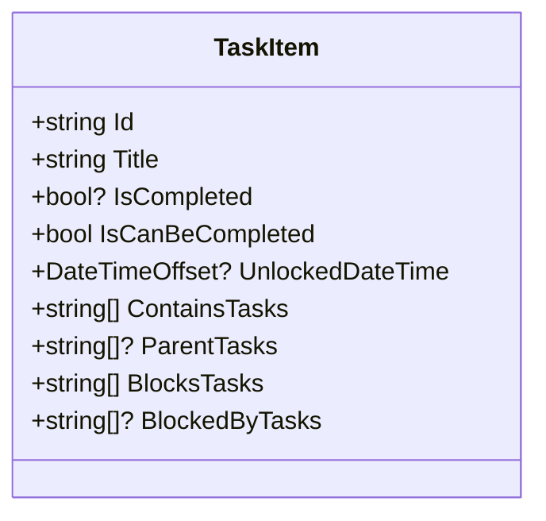
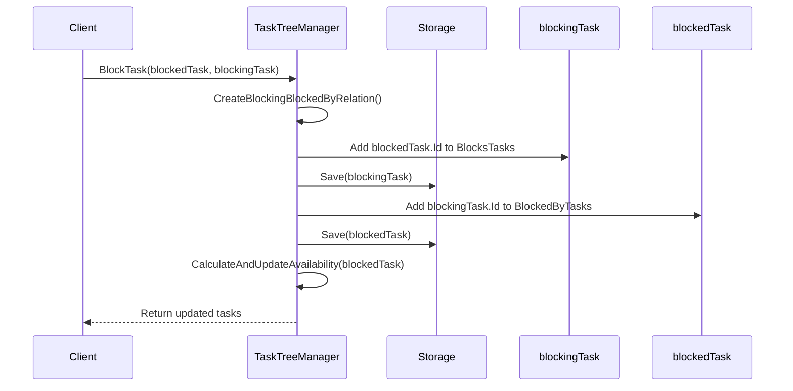
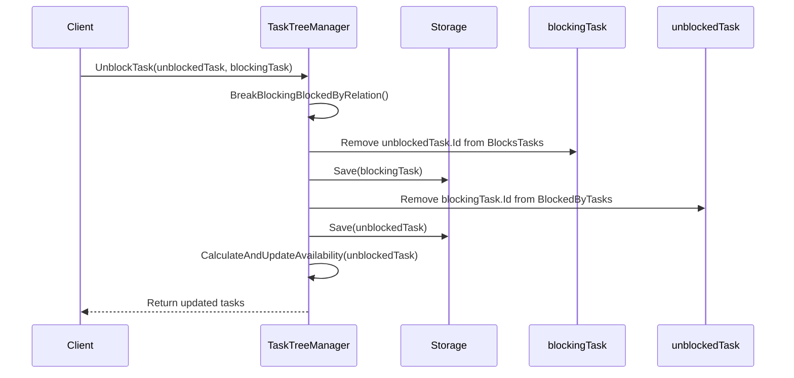
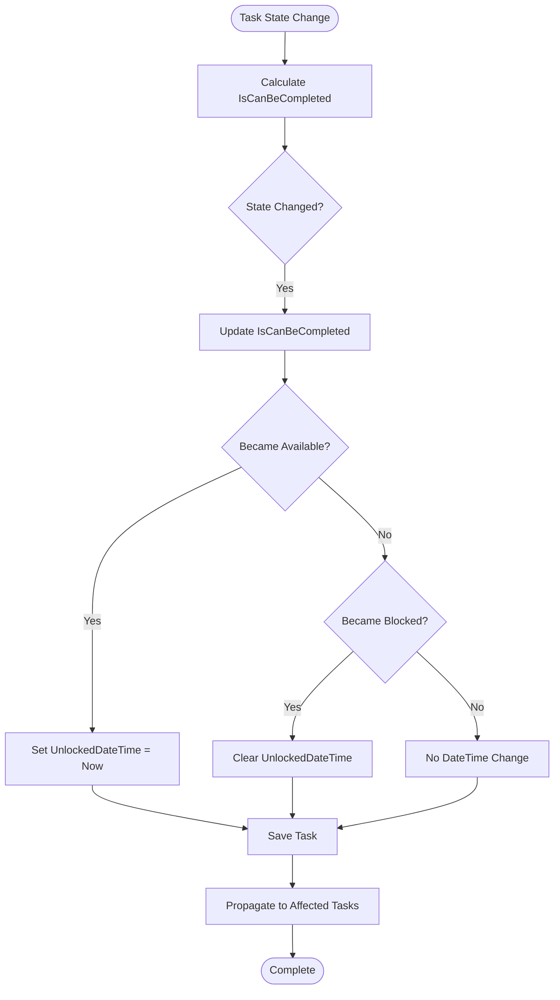
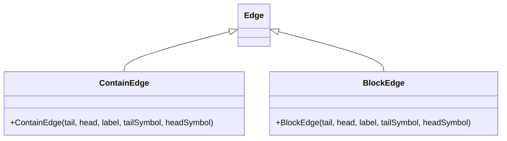
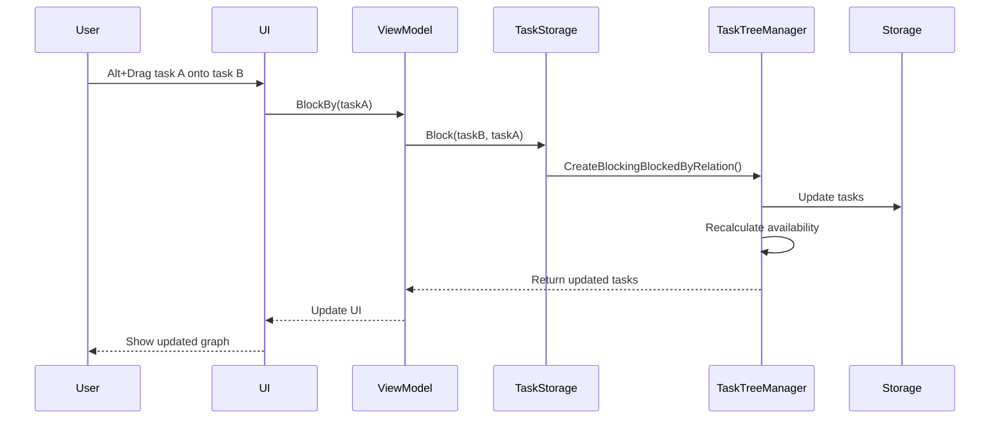

# Blocking Relationships

<cite>
**Referenced Files in This Document**   
- [TaskItem.cs](file://src/Unlimotion.Domain/TaskItem.cs)
- [TaskTreeManager.cs](file://src/Unlimotion.TaskTreeManager/TaskTreeManager.cs)
- [TaskAvailabilityCalculationTests.cs](file://src/Unlimotion.Test/TaskAvailabilityCalculationTests.cs)
- [BlockEdge.cs](file://src/Unlimotion/Views/Graph/BlockEdge.cs)
- [GraphControl.axaml.cs](file://src/Unlimotion/Views/GraphControl.axaml.cs)
- [TaskItemViewModel.cs](file://src/Unlimotion.ViewModel/TaskItemViewModel.cs)
- [MainWindowViewModel.cs](file://src/Unlimotion.ViewModel/MainWindowViewModel.cs)
- [IMPLEMENTATION_SUMMARY.md](file://src/Unlimotion.Domain/IMPLEMENTATION_SUMMARY.md)
</cite>

## Table of Contents
1. [Introduction](#introduction)
2. [Core Data Structures](#core-data-structures)
3. [Blocking Relationship Management](#blocking-relationship-management)
4. [Task Availability Calculation](#task-availability-calculation)
5. [UI Representation](#ui-representation)
6. [Blocking vs Parent-Child Relationships](#blocking-vs-parent-child-relationships)
7. [Troubleshooting](#troubleshooting)
8. [Conclusion](#conclusion)

## Introduction
Blocking relationships in Unlimotion provide a mechanism to establish dependency chains between tasks, ensuring that certain tasks cannot be completed until their blocking dependencies are resolved. This documentation details the implementation of blocking relationships through the `BlockedByTasks` and `BlocksTasks` collections in the `TaskItem` class, the methods in `TaskTreeManager` that manage these relationships, and how they affect task availability and completion states. The system ensures proper propagation of availability changes and provides visual feedback in the UI.

**Section sources**
- [TaskItem.cs](file://src/Unlimotion.Domain/TaskItem.cs)
- [TaskTreeManager.cs](file://src/Unlimotion.TaskTreeManager/TaskTreeManager.cs)

## Core Data Structures

The blocking relationship system in Unlimotion is built around two key collections in the `TaskItem` class:

- **BlockedByTasks**: A collection of task IDs that must be completed before this task can be completed
- **BlocksTasks**: A collection of task IDs that are blocked by the completion of this task

These collections create directed dependency links between tasks, forming a dependency graph that determines task availability. When a task is blocked by another task, it cannot be marked as completed until all tasks in its `BlockedByTasks` collection are completed.

The `TaskItem` class also includes the `IsCanBeCompleted` property, which reflects the current availability state of the task based on its dependencies, and the `UnlockedDateTime` property, which tracks when the task became available for completion.

**Diagram sources**
- [TaskItem.cs](file://src/Unlimotion.Domain/TaskItem.cs#L1-L33)

**Section sources**
- [TaskItem.cs](file://src/Unlimotion.Domain/TaskItem.cs#L1-L33)

## Blocking Relationship Management

### CreateBlockingBlockedByRelation Method

The `CreateBlockingBlockedByRelation` method in `TaskTreeManager` establishes a blocking relationship between two tasks. When task A blocks task B, task A is added to task B's `BlockedByTasks` collection, and task B is added to task A's `BlocksTasks` collection.

The method ensures data consistency by:
1. Adding the blocking task ID to the blocked task's `BlockedByTasks` collection
2. Adding the blocked task ID to the blocking task's `BlocksTasks` collection
3. Persisting both updated tasks to storage
4. Recalculating availability for the affected (blocked) task

**Diagram sources**
- [TaskTreeManager.cs](file://src/Unlimotion.TaskTreeManager/TaskTreeManager.cs#L523-L562)

### BreakBlockingBlockedByRelation Method

The `BreakBlockingBlockedByRelation` method removes an existing blocking relationship between two tasks. It performs the inverse operations of `CreateBlockingBlockedByRelation`:

1. Removing the blocked task ID from the blocking task's `BlocksTasks` collection
2. Removing the blocking task ID from the blocked task's `BlockedByTasks` collection
3. Persisting both updated tasks to storage
4. Recalculating availability for the affected (formerly blocked) task

This method is called when a blocking relationship is no longer needed, such as when a dependency has been resolved or when the relationship was created in error.

**Diagram sources**
- [TaskTreeManager.cs](file://src/Unlimotion.TaskTreeManager/TaskTreeManager.cs#L562-L598)

**Section sources**
- [TaskTreeManager.cs](file://src/Unlimotion.TaskTreeManager/TaskTreeManager.cs#L523-L598)

## Task Availability Calculation

### IsCanBeCompleted State Management

The `IsCanBeCompleted` property of a `TaskItem` is calculated based on two business rules:
1. All contained tasks must be completed (IsCompleted != false)
2. All blocking tasks must be completed (IsCompleted != false)

A task can only be marked as completed when `IsCanBeCompleted` is true. This state is automatically recalculated whenever:
- A task's completion status changes
- A blocking relationship is created or broken
- A parent-child relationship is modified
- The task is loaded or updated

The calculation is performed by the `CalculateAvailabilityForTask` method in `TaskTreeManager`, which evaluates both the `ContainsTasks` and `BlockedByTasks` collections to determine availability.

### UnlockedDateTime Management

The `UnlockedDateTime` property is managed in conjunction with the `IsCanBeCompleted` state:

- When a task becomes available (`IsCanBeCompleted` changes from false to true), `UnlockedDateTime` is set to the current timestamp
- When a task becomes blocked (`IsCanBeCompleted` changes from true to false), `UnlockedDateTime` is cleared (set to null)

This provides a historical record of when tasks became available, which can be useful for tracking workflow progress and identifying bottlenecks.

**Diagram sources**
- [TaskTreeManager.cs](file://src/Unlimotion.TaskTreeManager/TaskTreeManager.cs#L662-L737)

### Availability Propagation

When a task's availability changes, the system propagates this change to affected tasks through the `GetAffectedTasks` method. Affected tasks include:
- Parent tasks (because their availability depends on contained tasks)
- Tasks blocked by this task (because their availability depends on blocking tasks)

This ensures that availability calculations are consistently updated throughout the dependency graph, maintaining data integrity across the entire task hierarchy.

**Section sources**
- [TaskTreeManager.cs](file://src/Unlimotion.TaskTreeManager/TaskTreeManager.cs#L629-L737)
- [TaskAvailabilityCalculationTests.cs](file://src/Unlimotion.Test/TaskAvailabilityCalculationTests.cs#L0-L717)

## UI Representation

### Graph Visualization

Blocking relationships are visually represented in the task graph using the `BlockEdge` class, which extends the base `Edge` class from the AvaloniaGraphControl library. The graph visualization differentiates between containment relationships (parent-child) and blocking relationships through distinct edge types.

The `GraphControl` component renders blocking relationships as directed edges from the blocking task to the blocked task, with arrowheads indicating the direction of dependency.

**Diagram sources**
- [BlockEdge.cs](file://src/Unlimotion/Views/Graph/BlockEdge.cs#L0-L9)
- [ContainEdge.cs](file://src/Unlimotion/Views/Graph/ContainEdge.cs#L0-L10)

### User Interaction

In the UI, users can create blocking relationships through drag-and-drop interactions:
- **Alt + Drag**: Creates a blocking relationship where the target task blocks the dragged task
- **Ctrl + Drag**: Creates a reverse blocking relationship where the dragged task blocks the target task

The `MainWindowViewModel` binds to the current task's blocking relationships through observable collections, enabling real-time updates to the UI when relationships change.

**Diagram sources**
- [GraphControl.axaml.cs](file://src/Unlimotion/Views/GraphControl.axaml.cs#L0-L228)
- [TaskItemViewModel.cs](file://src/Unlimotion.ViewModel/TaskItemViewModel.cs#L429-L472)
- [MainWindowViewModel.cs](file://src/Unlimotion.ViewModel/MainWindowViewModel.cs#L810-L841)

**Section sources**
- [BlockEdge.cs](file://src/Unlimotion/Views/Graph/BlockEdge.cs#L0-L9)
- [GraphControl.axaml.cs](file://src/Unlimotion/Views/GraphControl.axaml.cs#L0-L228)
- [TaskItemViewModel.cs](file://src/Unlimotion.ViewModel/TaskItemViewModel.cs#L429-L472)
- [MainWindowViewModel.cs](file://src/Unlimotion.ViewModel/MainWindowViewModel.cs#L810-L841)

## Blocking vs Parent-Child Relationships

While both blocking and parent-child relationships create dependencies between tasks, they serve different purposes and have distinct characteristics:

| Relationship Type | Purpose | Direction | Completion Rule | UI Representation |
|------------------|-------|---------|----------------|------------------|
| **Parent-Child** | Hierarchical organization | Parent → Child | Parent cannot complete until all children are completed | Solid line with arrow |
| **Blocking** | Dependency management | Blocker → Blocked | Blocked task cannot complete until blocker is completed | Dashed line with arrow |

Key differences:
- **Parent-child relationships** represent hierarchical containment, where a parent task contains subtasks
- **Blocking relationships** represent dependency constraints, where one task must be completed before another can proceed
- A task can have multiple parents (multiple containment) but is typically blocked by specific prerequisite tasks
- The availability calculation considers both types of relationships: a task must have all contained tasks completed AND all blocking tasks completed to be available for completion

**Section sources**
- [TaskItem.cs](file://src/Unlimotion.Domain/TaskItem.cs#L1-L33)
- [TaskTreeManager.cs](file://src/Unlimotion.TaskTreeManager/TaskTreeManager.cs#L486-L527)
- [GraphControl.axaml.cs](file://src/Unlimotion/Views/GraphControl.axaml.cs#L0-L228)

## Troubleshooting

### Unintended Blocking Chains

Issue: Users may accidentally create long blocking chains that prevent multiple tasks from being completed.

Solution: 
- Review the `BlockedByTasks` collection of affected tasks
- Use the UI to remove unnecessary blocking relationships
- Verify that blocking relationships represent genuine dependencies

### Circular Blocking Dependencies

Issue: Two or more tasks block each other, creating an impossible completion scenario.

Detection:
- Tasks remain unavailable (`IsCanBeCompleted = false`) even when all other conditions are met
- `UnlockedDateTime` remains null despite no apparent blockers

Prevention:
- The system includes validation to prevent direct circular dependencies
- Users are warned when attempting to create blocking relationships that would create cycles
- Regular audits of blocking relationships can identify potential circular patterns

### Availability Calculation Issues

Issue: Tasks not updating availability state correctly after dependency changes.

Diagnosis:
- Verify that `CalculateAndUpdateAvailability` is being called after relationship changes
- Check that the `GetAffectedTasks` method correctly identifies parent and blocked tasks
- Ensure that storage operations are successful and changes are persisted

Common fixes:
- Restart the application to refresh the task graph
- Manually trigger availability recalculation through the UI
- Check for storage errors in the application logs

**Section sources**
- [TaskAvailabilityCalculationTests.cs](file://src/Unlimotion.Test/TaskAvailabilityCalculationTests.cs#L0-L717)
- [TaskTreeManager.cs](file://src/Unlimotion.TaskTreeManager/TaskTreeManager.cs#L629-L737)
- [MainWindowViewModelTests.cs](file://src/Unlimotion.Test/MainWindowViewModelTests.cs#L567-L656)

## Conclusion

Blocking relationships in Unlimotion provide a powerful mechanism for managing task dependencies and ensuring proper workflow progression. By using the `BlockedByTasks` and `BlocksTasks` collections in conjunction with the `CreateBlockingBlockedByRelation` and `BreakBlockingBlockedByRelation` methods, the system maintains a consistent state across the task hierarchy. The integration with availability calculation ensures that tasks are only available for completion when all dependencies are satisfied, while the UI representation provides clear visual feedback of dependency relationships. Understanding the distinction between blocking and parent-child relationships is crucial for effective task management, and the troubleshooting guidance helps resolve common issues that may arise in complex dependency scenarios.