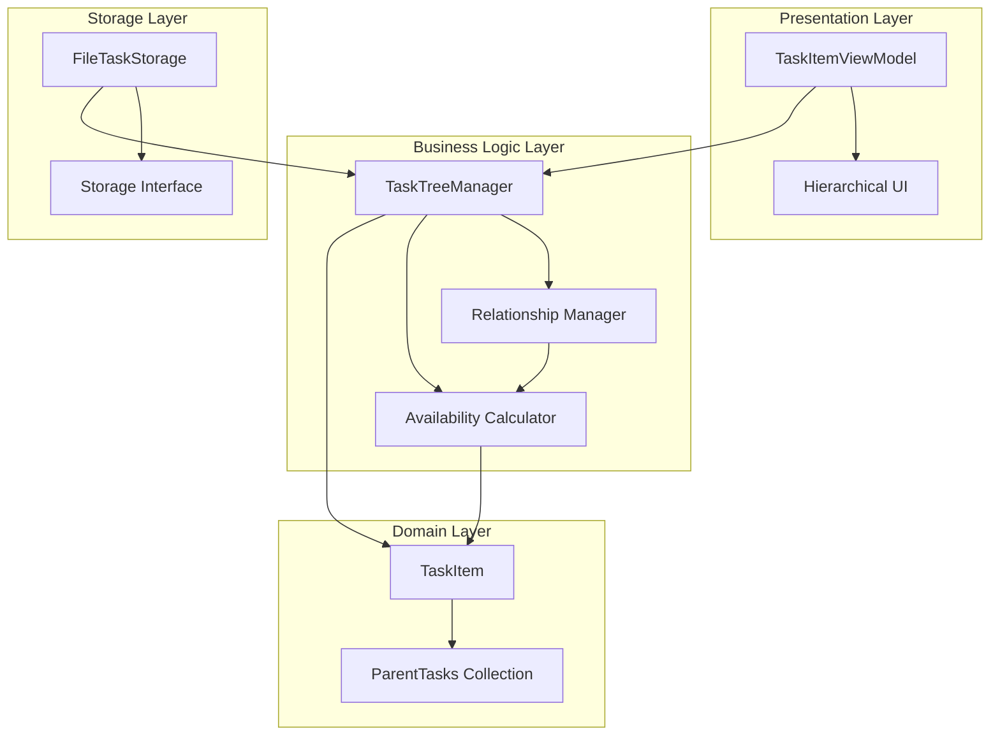
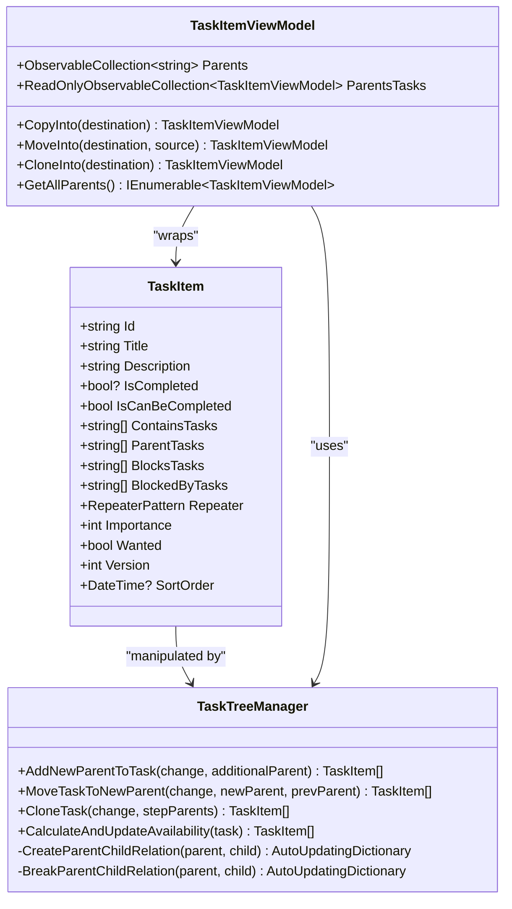
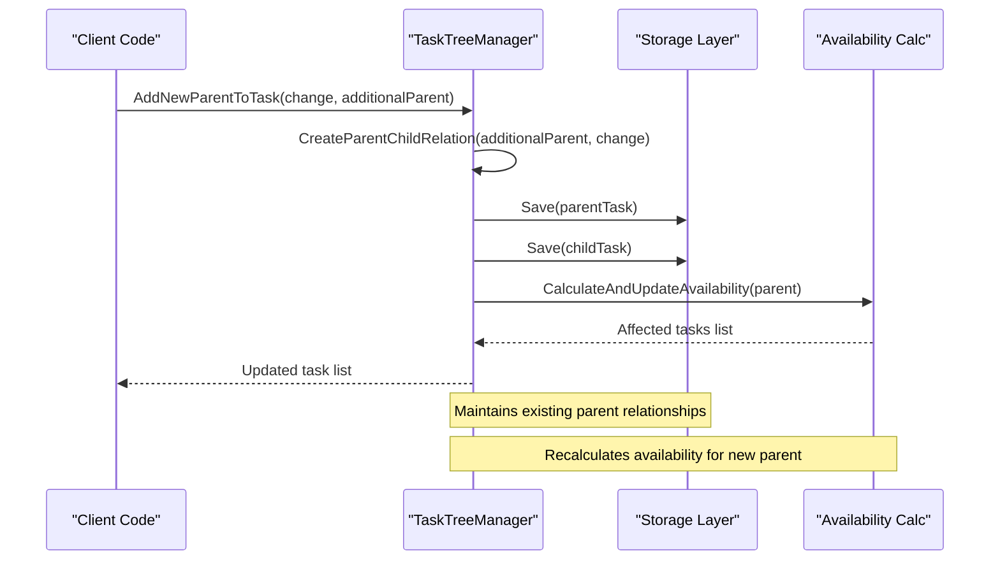
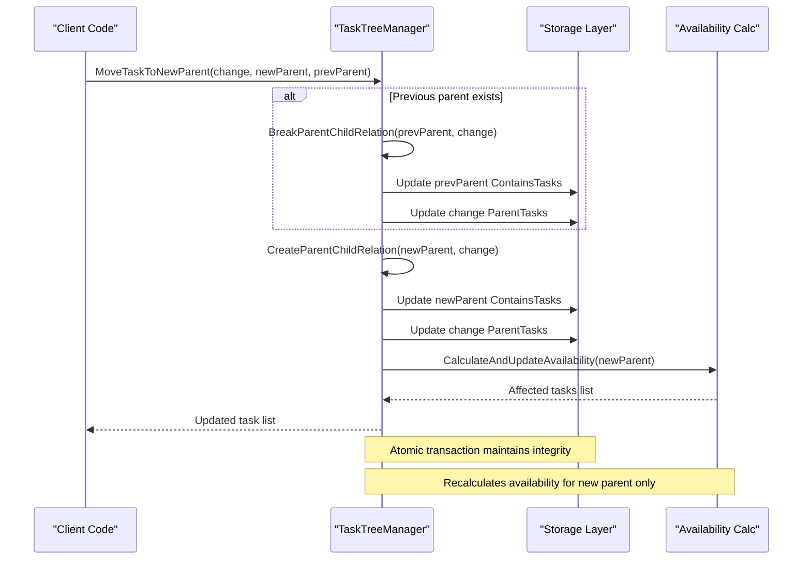
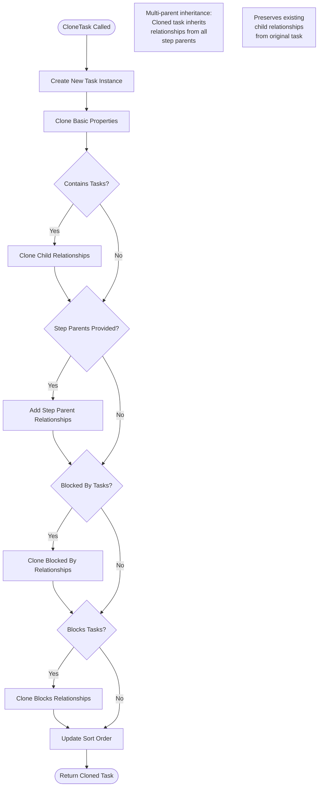
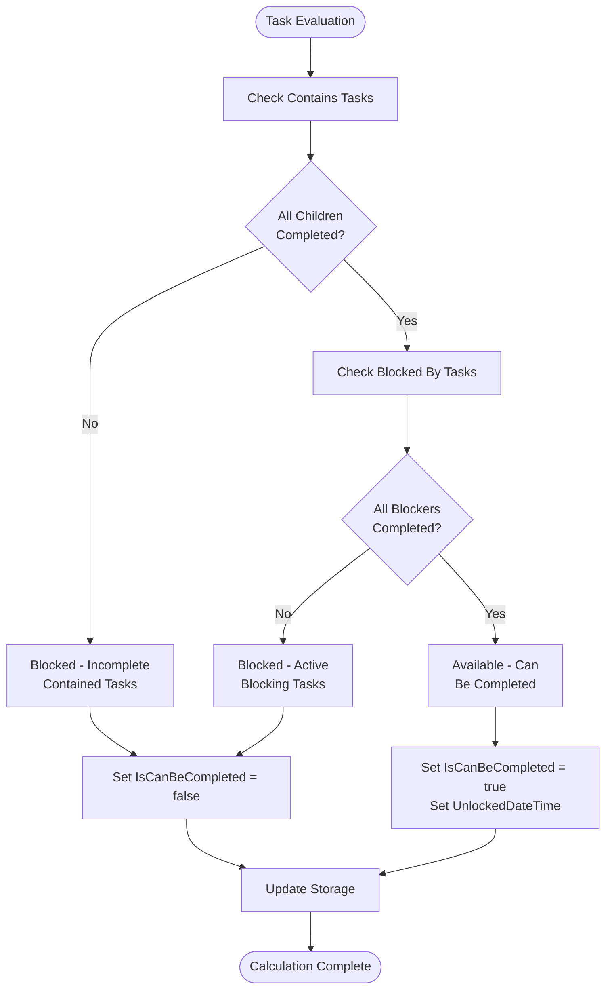
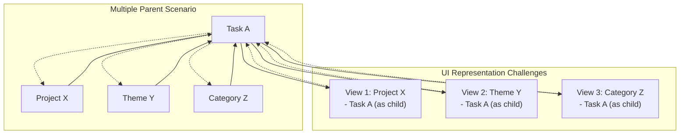
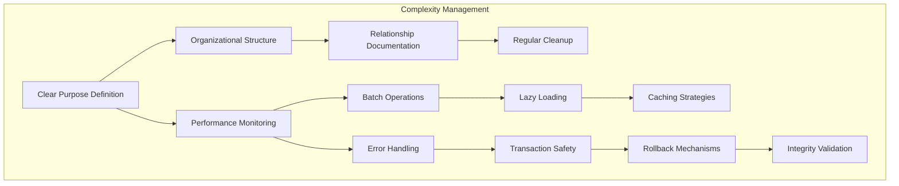
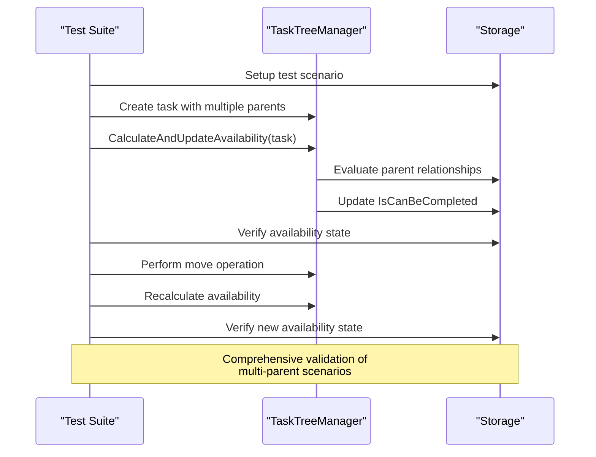

# Multiple Parents

<cite>
**Referenced Files in This Document**
- [TaskItem.cs](file://src/Unlimotion.Domain/TaskItem.cs)
- [TaskTreeManager.cs](file://src/Unlimotion.TaskTreeManager/TaskTreeManager.cs)
- [ITaskTreeManager.cs](file://src/Unlimotion.TaskTreeManager/ITaskTreeManager.cs)
- [TaskItemViewModel.cs](file://src/Unlimotion.ViewModel/TaskItemViewModel.cs)
- [FileTaskStorage.cs](file://src/Unlimotion/FileTaskStorage.cs)
- [AutoUpdatingDictionary.cs](file://src/Unlimotion.TaskTreeManager/AutoUpdatingDictionary.cs)
- [TaskAvailabilityCalculationTests.cs](file://src/Unlimotion.Test/TaskAvailabilityCalculationTests.cs)
- [MainWindowViewModelTests.cs](file://src/Unlimotion.Test/MainWindowViewModelTests.cs)
</cite>

## Table of Contents
1. [Introduction](#introduction)
2. [Architecture Overview](#architecture-overview)
3. [Core Data Structure](#core-data-structure)
4. [TaskTreeManager Operations](#tasktreemanager-operations)
5. [CloneTask Implementation](#clonetask-implementation)
6. [Availability Calculations](#availability-calculations)
7. [UI Representation Challenges](#ui-representation-challenges)
8. [Best Practices and Complexity Management](#best-practices-and-complexity-management)
9. [Testing and Validation](#testing-and-validation)
10. [Conclusion](#conclusion)

## Introduction

Unlimotion implements a sophisticated multiple parent support system that allows a single task to belong to multiple parent tasks simultaneously. This feature serves as an alternative to traditional tagging systems, enabling cross-project organization and providing flexible task categorization. Unlike conventional hierarchical task management systems where a task can only have one direct parent, Unlimotion's approach allows tasks to participate in multiple organizational contexts.

The multiple parent system transforms task relationships from a strict tree structure to a directed acyclic graph (DAG), where tasks can have multiple incoming edges (parents) while maintaining the ability to form complex organizational patterns. This design enables powerful use cases such as cross-project tasks, thematic groupings, and flexible categorization without compromising the underlying availability calculation engine.

## Architecture Overview

The multiple parent support system in Unlimotion is built around several interconnected components that work together to maintain referential integrity and provide seamless user experience.

**Diagram sources**
- [TaskItem.cs](file://src/Unlimotion.Domain/TaskItem.cs#L1-L33)
- [TaskTreeManager.cs](file://src/Unlimotion.TaskTreeManager/TaskTreeManager.cs#L1-L50)
- [TaskItemViewModel.cs](file://src/Unlimotion.ViewModel/TaskItemViewModel.cs#L1-L100)

The architecture follows a layered approach where the domain model defines the core data structure, the TaskTreeManager handles business logic and relationships, the ViewModel manages UI presentation, and the storage layer persists data across sessions.

**Section sources**
- [TaskItem.cs](file://src/Unlimotion.Domain/TaskItem.cs#L1-L33)
- [TaskTreeManager.cs](file://src/Unlimotion.TaskTreeManager/TaskTreeManager.cs#L1-L100)

## Core Data Structure

The TaskItem class serves as the foundation for multiple parent support, featuring a specialized collection that maintains parent-child relationships.

**Diagram sources**
- [TaskItem.cs](file://src/Unlimotion.Domain/TaskItem.cs#L6-L32)
- [TaskTreeManager.cs](file://src/Unlimotion.TaskTreeManager/TaskTreeManager.cs#L12-L50)
- [TaskItemViewModel.cs](file://src/Unlimotion.ViewModel/TaskItemViewModel.cs#L20-L150)

The ParentTasks collection is the key component that enables multiple parent relationships. Unlike ContainsTasks which establishes child-to-parent relationships, ParentTasks maintains parent-to-child relationships, allowing a task to reference multiple parent identifiers.

**Section sources**
- [TaskItem.cs](file://src/Unlimotion.Domain/TaskItem.cs#L6-L32)
- [TaskTreeManager.cs](file://src/Unlimotion.TaskTreeManager/TaskTreeManager.cs#L12-L50)

## TaskTreeManager Operations

The TaskTreeManager provides the core functionality for managing multiple parent relationships through specialized methods that maintain referential integrity across complex task hierarchies.

### AddNewParentToTask Method

The AddNewParentToTask method enables a task to gain additional parent relationships without removing existing ones. This operation creates bidirectional relationships between the task and its new parent.

**Diagram sources**
- [TaskTreeManager.cs](file://src/Unlimotion.TaskTreeManager/TaskTreeManager.cs#L375-L382)

The method ensures that when a task gains a new parent, both the parent's ContainsTasks collection and the child's ParentTasks collection are updated atomically. This maintains referential integrity while preserving existing relationships.

### MoveTaskToNewParent Method

The MoveTaskToNewParent method provides the capability to transfer a task from one parent to another, handling the removal of old relationships and establishment of new ones.

**Diagram sources**
- [TaskTreeManager.cs](file://src/Unlimotion.TaskTreeManager/TaskTreeManager.cs#L384-L408)

The move operation carefully handles the transition by first breaking the relationship with the previous parent (if any) and then establishing the new relationship. This ensures that the task maintains its multiple parent relationships while properly transitioning between organizational contexts.

**Section sources**
- [TaskTreeManager.cs](file://src/Unlimotion.TaskTreeManager/TaskTreeManager.cs#L375-L408)

## CloneTask Implementation

The CloneTask method demonstrates how multiple parent inheritance works during task duplication, allowing cloned tasks to inherit relationships from multiple source tasks.

**Diagram sources**
- [TaskTreeManager.cs](file://src/Unlimotion.TaskTreeManager/TaskTreeManager.cs#L281-L380)

The CloneTask implementation showcases the power of multiple parent support by allowing cloned tasks to inherit relationships from multiple source tasks. When stepParents are provided, each parent receives a copy of the cloned task, creating multiple parent relationships that reflect the original task's organizational context.

During cloning, the system:
1. Creates a new task with copied basic properties
2. Preserves existing child relationships from the original task
3. Establishes new parent-child relationships with each step parent
4. Maintains blocking relationships from the original task
5. Updates availability calculations for all involved tasks

**Section sources**
- [TaskTreeManager.cs](file://src/Unlimotion.TaskTreeManager/TaskTreeManager.cs#L281-L380)

## Availability Calculations

The availability calculation system is designed to handle the complexities introduced by multiple parent relationships while maintaining the core business rules for task completion eligibility.

### Business Rules for Availability

A task can be completed when both conditions are met:
1. **All contained tasks are completed** (IsCompleted != false)
2. **All blocking tasks are completed** (IsCompleted != false)

**Diagram sources**
- [TaskTreeManager.cs](file://src/Unlimotion.TaskTreeManager/TaskTreeManager.cs#L632-L680)

### Impact of Multiple Parents on Availability

When a task has multiple parents, availability calculations become more complex because the task's state affects multiple organizational contexts simultaneously. The system must evaluate the task against all parent relationships to determine its overall availability.

The availability calculation process considers:
- **Direct containment relationships**: Tasks contained by each parent
- **Blocking relationships**: Tasks that block the current task
- **Transitive effects**: Changes in one parent relationship affecting others

**Section sources**
- [TaskTreeManager.cs](file://src/Unlimotion.TaskTreeManager/TaskTreeManager.cs#L632-L680)
- [TaskAvailabilityCalculationTests.cs](file://src/Unlimotion.Test/TaskAvailabilityCalculationTests.cs#L400-L500)

## UI Representation Challenges

Representing multiply-parented tasks in hierarchical views presents significant challenges for user interface design, requiring careful consideration of how relationships are visualized and navigated.

### Hierarchical View Complexity

Traditional hierarchical task views struggle with multiple parents because they assume a strict tree structure. In Unlimotion's model, a single task may appear in multiple locations within the hierarchy, creating potential confusion for users.

### ViewModel Synchronization Issues

The TaskItemViewModel class faces challenges in maintaining consistency across multiple parent relationships. When a task's state changes, all parent contexts must be updated to reflect the new state.

The synchronization mechanism uses reactive programming patterns to keep UI representations consistent:
- Observable collections track relationship changes
- Automatic updates propagate to all parent contexts
- Throttled updates prevent excessive recalculations

**Section sources**
- [TaskItemViewModel.cs](file://src/Unlimotion.ViewModel/TaskItemViewModel.cs#L20-L150)
- [FileTaskStorage.cs](file://src/Unlimotion/FileTaskStorage.cs#L366-L403)

## Best Practices and Complexity Management

Managing multiple parent relationships effectively requires adherence to established patterns and avoidance of common pitfalls that can lead to system complexity and maintenance challenges.

### Recommended Patterns

1. **Single Responsibility Principle**: Each parent relationship should serve a clear organizational purpose
2. **Explicit Naming Conventions**: Use descriptive titles for parent tasks to indicate their organizational role
3. **Hierarchical Organization**: Group related tasks under meaningful parent categories
4. **Avoid Circular Dependencies**: Ensure the relationship graph remains a DAG

### Complexity Mitigation Strategies

### Common Pitfalls to Avoid

1. **Over-Relationalization**: Creating too many parent relationships can make navigation difficult
2. **Circular References**: While prevented by the DAG constraint, improper relationship management can create logical cycles
3. **Performance Degradation**: Excessive parent relationships can impact availability calculations
4. **UI Confusion**: Multiple appearances of the same task can confuse users

### Maintenance Guidelines

- **Regular Audits**: Periodically review parent relationships for relevance
- **Documentation**: Maintain clear documentation of relationship purposes
- **Testing**: Implement comprehensive tests for complex relationship scenarios
- **Monitoring**: Track performance impacts of multiple parent relationships

**Section sources**
- [TaskTreeManager.cs](file://src/Unlimotion.TaskTreeManager/TaskTreeManager.cs#L1-L100)
- [TaskAvailabilityCalculationTests.cs](file://src/Unlimotion.Test/TaskAvailabilityCalculationTests.cs#L1-L50)

## Testing and Validation

The multiple parent system requires comprehensive testing to ensure referential integrity, availability calculations, and UI consistency across various scenarios.

### Test Coverage Areas

The testing framework covers critical scenarios including:
- Basic multiple parent creation and deletion
- Complex relationship transitions (move operations)
- Availability calculation correctness
- UI synchronization across multiple contexts
- Edge cases involving nested relationships

### Availability Calculation Tests

The test suite validates that availability calculations work correctly with multiple parents:

**Diagram sources**
- [TaskAvailabilityCalculationTests.cs](file://src/Unlimotion.Test/TaskAvailabilityCalculationTests.cs#L400-L500)

### UI Integration Testing

The UI testing framework validates that multiple parent relationships are correctly represented in hierarchical views and that user interactions maintain data consistency.

**Section sources**
- [TaskAvailabilityCalculationTests.cs](file://src/Unlimotion.Test/TaskAvailabilityCalculationTests.cs#L1-L100)
- [MainWindowViewModelTests.cs](file://src/Unlimotion.Test/MainWindowViewModelTests.cs#L700-L800)

## Conclusion

Unlimotion's multiple parent support system represents a sophisticated approach to task organization that balances flexibility with maintainability. The implementation successfully addresses the challenge of cross-project task management while preserving the core availability calculation engine that drives task completion logic.

Key achievements of the system include:

- **Flexible Organization**: Tasks can participate in multiple organizational contexts simultaneously
- **Referential Integrity**: Atomic operations maintain data consistency across relationships
- **Performance Optimization**: Efficient availability calculations handle complex relationship graphs
- **UI Adaptability**: Reactive patterns ensure consistent representation across multiple views
- **Extensibility**: The modular design supports future enhancements and variations

The system demonstrates that multiple parent relationships can be effectively managed in task management applications, providing users with powerful organizational capabilities while maintaining system reliability and performance. The comprehensive testing framework and established best practices provide a solid foundation for continued development and enhancement of this feature.

Future enhancements could include visual indicators for multiple parent relationships, improved filtering mechanisms for multi-context tasks, and enhanced performance optimizations for large-scale relationship graphs. The current implementation provides a robust foundation for these potential improvements while maintaining backward compatibility and system stability.