# Parent-Child Relationships

<cite>
**Referenced Files in This Document**
- [TaskItem.cs](file://src/Unlimotion.Domain/TaskItem.cs)
- [TaskTreeManager.cs](file://src/Unlimotion.TaskTreeManager/TaskTreeManager.cs)
- [ITaskTreeManager.cs](file://src/Unlimotion.TaskTreeManager/ITaskTreeManager.cs)
- [AutoUpdatingDictionary.cs](file://src/Unlimotion.TaskTreeManager/AutoUpdatingDictionary.cs)
- [TaskItemViewModel.cs](file://src/Unlimotion.ViewModel/TaskItemViewModel.cs)
- [TaskAvailabilityCalculationTests.cs](file://src/Unlimotion.Test/TaskAvailabilityCalculationTests.cs)
- [TaskCompletionChangeTests.cs](file://src/Unlimotion.Test/TaskCompletionChangeTests.cs)
- [GraphControl.axaml.cs](file://src/Unlimotion/Views/GraphControl.axaml.cs)
- [MainControl.axaml.cs](file://src/Unlimotion/Views/MainControl.axaml.cs)
- [ContainEdge.cs](file://src/Unlimotion/Views/Graph/ContainEdge.cs)
- [BlockEdge.cs](file://src/Unlimotion/Views/Graph/BlockEdge.cs)
</cite>

## Table of Contents
1. [Introduction](#introduction)
2. [Core Data Structures](#core-data-structures)
3. [Bidirectional Relationship Management](#bidirectional-relationship-management)
4. [Transaction Safety and Operations](#transaction-safety-and-operations)
5. [Availability Calculation System](#availability-calculation-system)
6. [UI Representation](#ui-representation)
7. [Cross-Project Task Organization](#cross-project-task-organization)
8. [Common Issues and Troubleshooting](#common-issues-and-troubleshooting)
9. [Best Practices](#best-practices)
10. [Conclusion](#conclusion)

## Introduction

Unlimotion's task management system implements sophisticated parent-child relationships that enable hierarchical task organization and availability-based task unlocking. The system maintains bidirectional relationships between tasks through two primary collections: `ContainsTasks` (parent-to-child) and `ParentTasks` (child-to-parent), ensuring consistency and enabling complex task dependency management.

The parent-child relationship system serves as the foundation for task availability calculations, where a parent task becomes available for completion only when all its contained child tasks are completed. This creates a cascading effect that enables granular task decomposition while maintaining logical task progression.

## Core Data Structures

### TaskItem Class Architecture

The TaskItem class defines the fundamental structure for parent-child relationships:

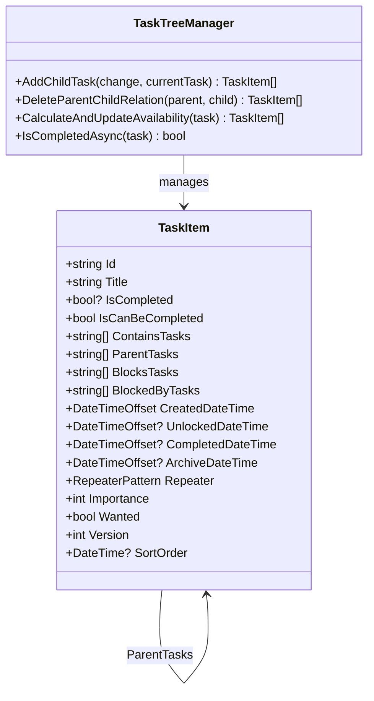

**Diagram sources**
- [TaskItem.cs](file://src/Unlimotion.Domain/TaskItem.cs#L5-L32)
- [TaskTreeManager.cs](file://src/Unlimotion.TaskTreeManager/TaskTreeManager.cs#L10-L15)

### Relationship Collections

The TaskItem class maintains four critical relationship collections:

| Collection | Direction | Purpose | Validation |
|------------|-----------|---------|------------|
| `ContainsTasks` | Parent → Children | Lists child task IDs contained by this parent | Prevents duplicates, maintains consistency |
| `ParentTasks` | Child → Parents | Lists parent task IDs containing this child | Supports multiple parents, prevents cycles |
| `BlocksTasks` | Blocking → Blocked | Tasks this task blocks from completion | Enables task dependencies |
| `BlockedByTasks` | Blocked → Blocking | Tasks blocking this task from completion | Creates dependency chains |

**Section sources**
- [TaskItem.cs](file://src/Unlimotion.Domain/TaskItem.cs#L18-L23)

## Bidirectional Relationship Management

### CreateParentChildRelation Method

The `CreateParentChildRelation` method establishes bidirectional relationships between parent and child tasks:

**Diagram sources**
- [TaskTreeManager.cs](file://src/Unlimotion.TaskTreeManager/TaskTreeManager.cs#L488-L527)

### BreakParentChildRelation Method

The `BreakParentChildRelation` method removes bidirectional relationships:

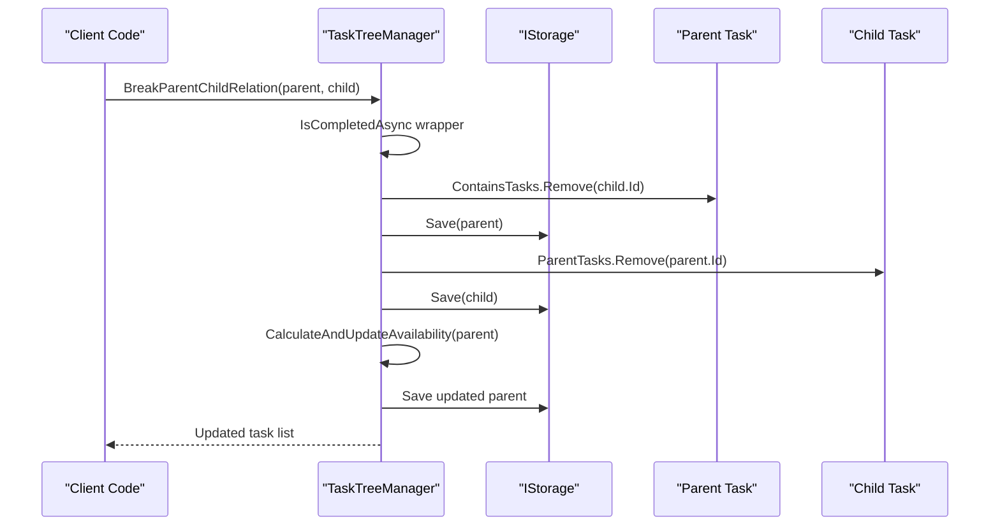

**Diagram sources**
- [TaskTreeManager.cs](file://src/Unlimotion.TaskTreeManager/TaskTreeManager.cs#L420-L465)

**Section sources**
- [TaskTreeManager.cs](file://src/Unlimotion.TaskTreeManager/TaskTreeManager.cs#L488-L527)
- [TaskTreeManager.cs](file://src/Unlimotion.TaskTreeManager/TaskTreeManager.cs#L420-L465)

## Transaction Safety and Operations

### IsCompletedAsync Wrapper

The `IsCompletedAsync` method provides transaction safety through retry policies:

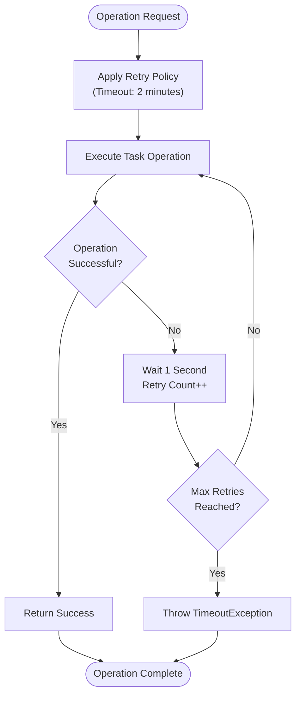

**Diagram sources**
- [TaskTreeManager.cs](file://src/Unlimotion.TaskTreeManager/TaskTreeManager.cs#L597-L631)

### Atomic Operations

All parent-child relationship operations are atomic and transaction-safe:

- **AddChildTask**: Creates both parent-child and child-parent relationships atomically
- **DeleteParentChildRelation**: Removes both directions of the relationship atomically  
- **MoveTaskToNewParent**: Breaks old relationships and creates new ones atomically
- **AddNewParentToTask**: Adds a new parent relationship without affecting existing ones

**Section sources**
- [TaskTreeManager.cs](file://src/Unlimotion.TaskTreeManager/TaskTreeManager.cs#L597-L631)
- [TaskTreeManager.cs](file://src/Unlimotion.TaskTreeManager/TaskTreeManager.cs#L77-L121)

## Availability Calculation System

### Core Business Rules

The availability calculation system implements two fundamental business rules:

1. **Contained Tasks Rule**: A parent task can be completed only when all contained child tasks are completed
2. **Blocking Tasks Rule**: A task can be completed only when all blocking tasks are completed

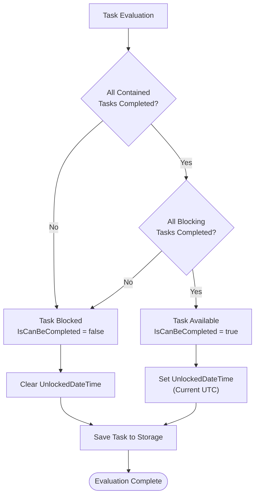

**Diagram sources**
- [TaskTreeManager.cs](file://src/Unlimotion.TaskTreeManager/TaskTreeManager.cs#L667-L720)

### CalculateAndUpdateAvailability Method

The `CalculateAndUpdateAvailability` method orchestrates availability recalculation:

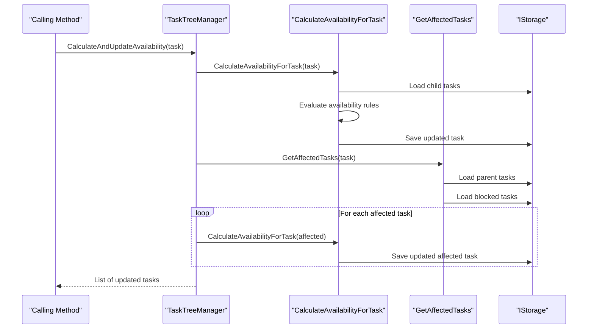

**Diagram sources**
- [TaskTreeManager.cs](file://src/Unlimotion.TaskTreeManager/TaskTreeManager.cs#L629-L665)

### Availability Propagation

The system automatically propagates availability changes upward and forward:

- **Upward Propagation**: When a child task's completion status changes, parent tasks are recalculated
- **Forward Propagation**: When a task becomes available, tasks blocked by it are recalculated

**Section sources**
- [TaskTreeManager.cs](file://src/Unlimotion.TaskTreeManager/TaskTreeManager.cs#L667-L720)
- [TaskTreeManager.cs](file://src/Unlimotion.TaskTreeManager/TaskTreeManager.cs#L722-L778)

## UI Representation

### Hierarchical Views

The UI presents parent-child relationships through hierarchical task lists:

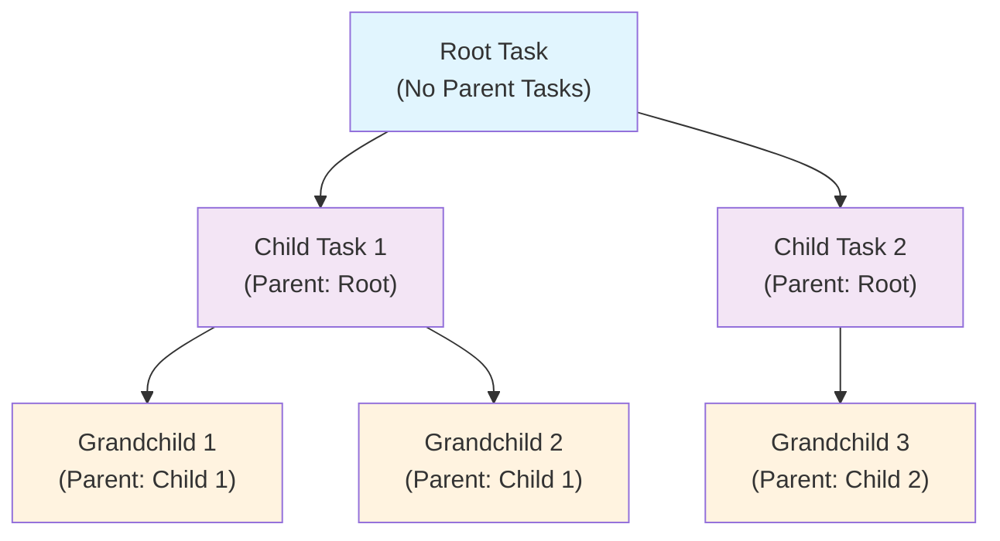

### Roadmap Graph Visualization

The roadmap graph uses specialized edges to represent relationships:

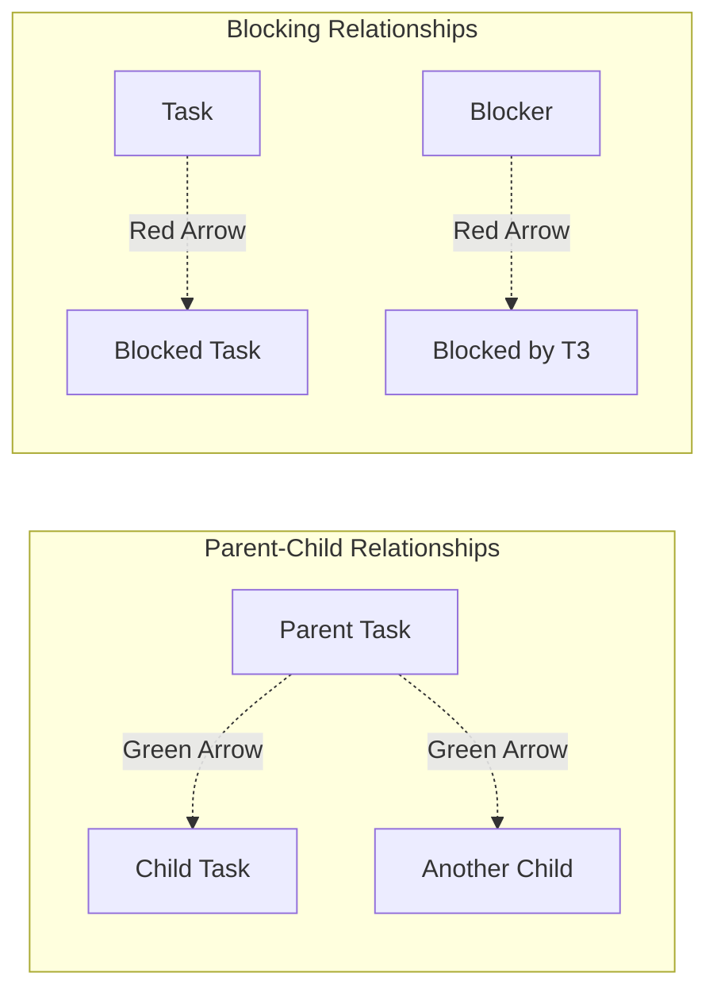

**Diagram sources**
- [ContainEdge.cs](file://src/Unlimotion/Views/Graph/ContainEdge.cs#L4-L10)
- [BlockEdge.cs](file://src/Unlimotion/Views/Graph/BlockEdge.cs#L4-L9)

### TaskItemViewModel Integration

The ViewModel layer maintains reactive collections for relationship management:

| Property | Type | Purpose |
|----------|------|---------|
| `ContainsTasks` | `ReadOnlyObservableCollection<TaskItemViewModel>` | Child tasks collection |
| `ParentsTasks` | `ReadOnlyObservableCollection<TaskItemViewModel>` | Parent tasks collection |
| `BlocksTasks` | `ReadOnlyObservableCollection<TaskItemViewModel>` | Tasks this task blocks |
| `BlockedByTasks` | `ReadOnlyObservableCollection<TaskItemViewModel>` | Tasks blocking this task |

**Section sources**
- [TaskItemViewModel.cs](file://src/Unlimotion.ViewModel/TaskItemViewModel.cs#L40-L85)
- [GraphControl.axaml.cs](file://src/Unlimotion/Views/GraphControl.axaml.cs#L75-L104)

## Cross-Project Task Organization

### Multiple Parent Support

Unlimotion supports multiple parents per task, enabling cross-project task organization:

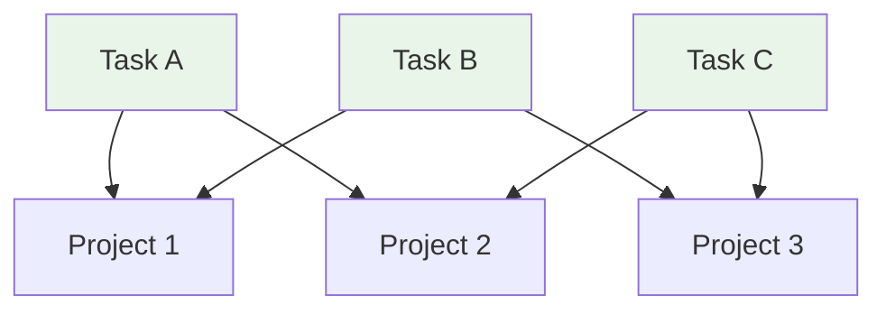

### Benefits of Multiple Parents

1. **Cross-Project Dependencies**: Tasks can belong to multiple projects simultaneously
2. **Flexible Organization**: Tasks can be organized in multiple ways
3. **Dependency Tracking**: Complex dependency chains across projects
4. **Resource Sharing**: Shared resources across different project contexts

**Section sources**
- [TaskTreeManager.cs](file://src/Unlimotion.TaskTreeManager/TaskTreeManager.cs#L379-L385)

## Common Issues and Troubleshooting

### Circular Dependencies

Circular dependencies occur when tasks form closed loops in their relationships:

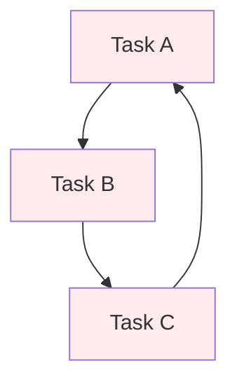

### Orphaned Tasks

Orphaned tasks occur when relationships are broken incorrectly:

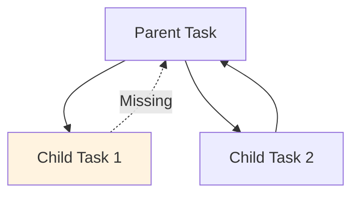

### Validation Patterns

The system implements several validation patterns to prevent issues:

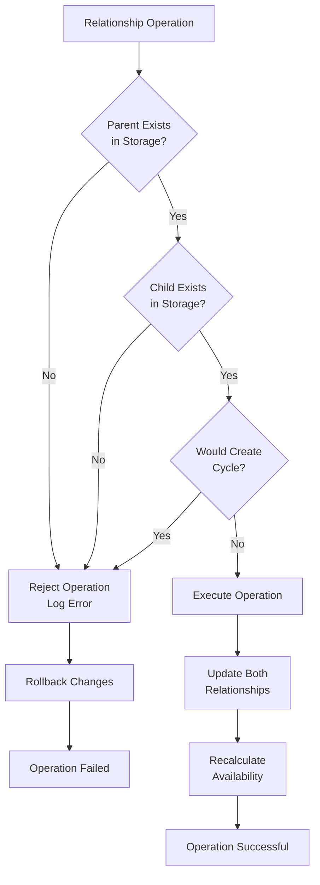

### Troubleshooting Guidelines

1. **Check Relationship Integrity**: Verify that all relationships are bidirectional
2. **Validate Task Existence**: Ensure all referenced tasks exist in storage
3. **Detect Cycles**: Implement cycle detection during relationship creation
4. **Monitor Availability**: Track availability changes after relationship modifications
5. **Log Operations**: Maintain audit logs for relationship changes

**Section sources**
- [TaskTreeManager.cs](file://src/Unlimotion.TaskTreeManager/TaskTreeManager.cs#L488-L527)

## Best Practices

### Relationship Management

1. **Always Use Transaction Wrappers**: Wrap all relationship operations in `IsCompletedAsync`
2. **Maintain Bidirectional Consistency**: Ensure both parent and child relationships are updated
3. **Recalculate Availability**: Trigger availability recalculation after relationship changes
4. **Validate Before Operations**: Check task existence and relationship validity
5. **Handle Edge Cases**: Properly manage empty collections and null values

### Performance Optimization

1. **Batch Operations**: Group related operations to minimize storage writes
2. **Lazy Loading**: Load task relationships only when needed
3. **Caching**: Cache frequently accessed relationship data
4. **Indexing**: Maintain efficient indexing for relationship lookups
5. **Async Operations**: Use asynchronous operations for all storage interactions

### Error Handling

1. **Graceful Degradation**: Handle missing or corrupted relationships gracefully
2. **Recovery Mechanisms**: Implement relationship repair and recovery procedures
3. **Validation Feedback**: Provide clear feedback for relationship validation failures
4. **Logging**: Maintain comprehensive logs for debugging and monitoring
5. **Testing**: Implement comprehensive unit tests for relationship operations

## Conclusion

Unlimotion's parent-child relationship system provides a robust foundation for hierarchical task management with sophisticated availability calculations. The bidirectional relationship model ensures consistency, while the transaction safety mechanisms guarantee data integrity. The system's support for multiple parents enables flexible cross-project organization, and the comprehensive availability calculation system ensures logical task progression.

The combination of strong data structures, transaction-safe operations, and intuitive UI representation makes this system suitable for complex task management scenarios while maintaining usability and reliability. The built-in validation patterns and troubleshooting guidelines help prevent common issues, ensuring a stable and predictable user experience.