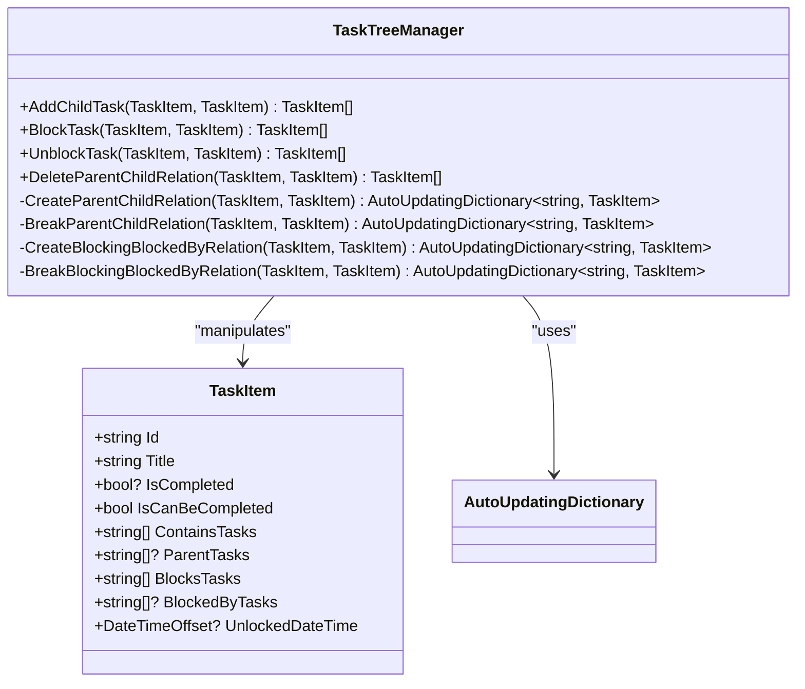
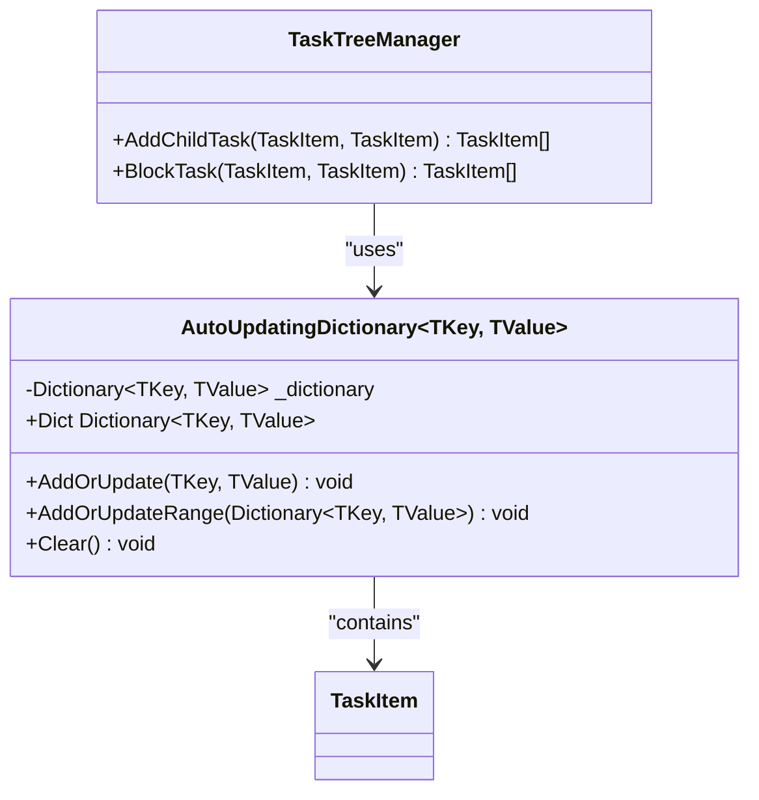
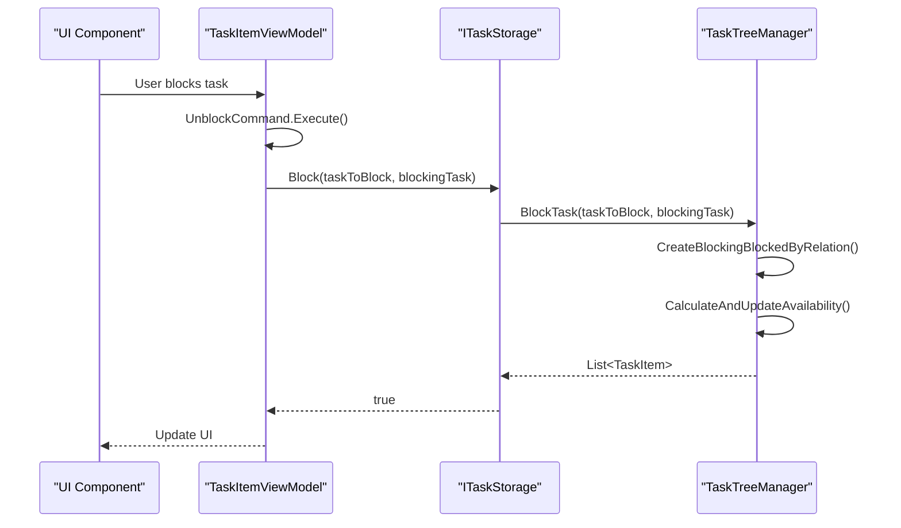
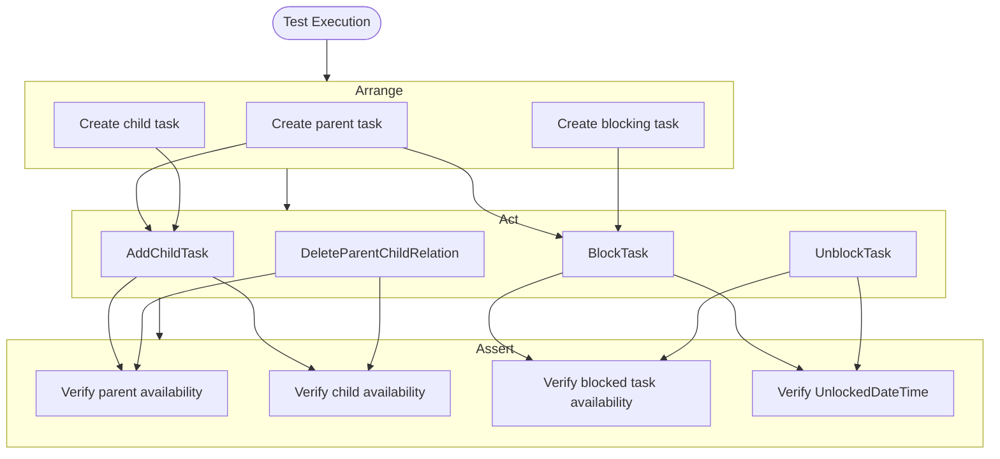
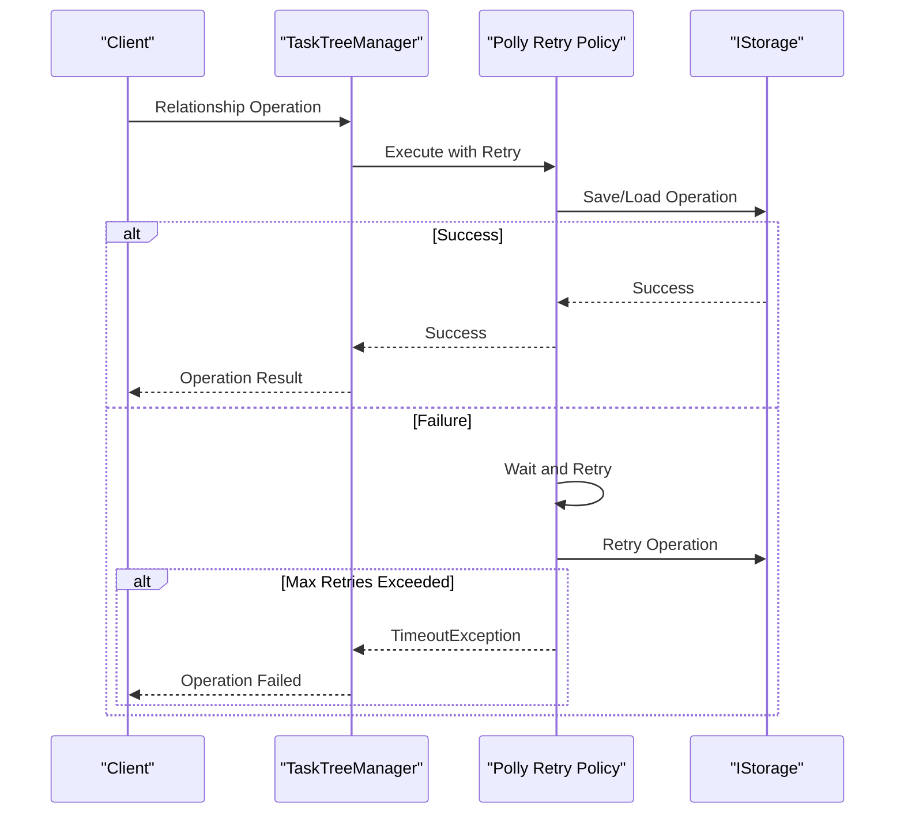

# Relationship Management

<cite>
**Referenced Files in This Document**   
- [TaskTreeManager.cs](file://src/Unlimotion.TaskTreeManager/TaskTreeManager.cs)
- [ITaskTreeManager.cs](file://src/Unlimotion.TaskTreeManager/ITaskTreeManager.cs)
- [AutoUpdatingDictionary.cs](file://src/Unlimotion.TaskTreeManager/AutoUpdatingDictionary.cs)
- [TaskItem.cs](file://src/Unlimotion.Domain/TaskItem.cs)
- [Action.cs](file://src/Unlimotion.ViewModel/Action.cs)
- [ITaskStorage.cs](file://src/Unlimotion.ViewModel/ITaskStorage.cs)
- [TaskItemViewModel.cs](file://src/Unlimotion.ViewModel/TaskItemViewModel.cs)
- [TaskAvailabilityCalculationTests.cs](file://src/Unlimotion.Test/TaskAvailabilityCalculationTests.cs)
</cite>

## Table of Contents
1. [Introduction](#introduction)
2. [Core Relationship Operations](#core-relationship-operations)
3. [AutoUpdatingDictionary for Change Tracking](#autoupdatingdictionary-for-change-tracking)
4. [Integration with Reactive ViewModel Layer](#integration-with-reactive-viewmodel-layer)
5. [Complex Relationship Changes in Integration Tests](#complex-relationship-changes-in-integration-tests)
6. [Performance Considerations](#performance-considerations)
7. [Error Handling and Transactional Behavior](#error-handling-and-transactional-behavior)
8. [Conclusion](#conclusion)

## Introduction
Unlimotion implements a comprehensive task relationship management system through its TaskTreeManager component. This system provides a complete API for manipulating task relationships including parent-child hierarchies and blocking dependencies. The architecture separates business logic from presentation concerns, enabling consistent relationship management across different application components. This document details how the AddChildTask, BlockTask, UnblockTask, and DeleteParentChildRelation methods form the core API for relationship manipulation, how changes are tracked through AutoUpdatingDictionary, and how these operations integrate with the reactive ViewModel layer through the TaskAction enum and command patterns.

**Section sources**
- [TaskTreeManager.cs](file://src/Unlimotion.TaskTreeManager/TaskTreeManager.cs#L0-L837)
- [ITaskTreeManager.cs](file://src/Unlimotion.TaskTreeManager/ITaskTreeManager.cs#L0-L43)

## Core Relationship Operations

The TaskTreeManager class provides a comprehensive API for managing task relationships through four primary methods: AddChildTask, BlockTask, UnblockTask, and DeleteParentChildRelation. These methods implement the complete set of operations needed to manipulate task dependencies in the Unlimotion system.

The AddChildTask method establishes a parent-child relationship between tasks, where the parent task contains the child task. This relationship affects task availability, as a parent task can only be completed when all its child tasks are completed. The method creates bidirectional links by adding the child's ID to the parent's ContainsTasks collection and the parent's ID to the child's ParentTasks collection.

The BlockTask and UnblockTask methods manage blocking relationships between tasks. When one task blocks another, the blocked task cannot be completed until the blocking task is completed. This is implemented through the BlocksTasks and BlockedByTasks collections on the TaskItem model. The BlockTask method adds the appropriate references in both directions, while UnblockTask removes them.

The DeleteParentChildRelation method specifically breaks a parent-child relationship without deleting either task. This operation maintains data integrity by properly updating both tasks' relationship collections and recalculating availability for affected tasks.

All relationship operations are transactional in nature, ensuring that either all changes are applied successfully or none are, maintaining data consistency. Each operation also triggers recalculation of task availability for affected tasks, ensuring the system state remains consistent.

**Diagram sources**
- [TaskTreeManager.cs](file://src/Unlimotion.TaskTreeManager/TaskTreeManager.cs#L0-L837)
- [TaskItem.cs](file://src/Unlimotion.Domain/TaskItem.cs#L0-L33)

**Section sources**
- [TaskTreeManager.cs](file://src/Unlimotion.TaskTreeManager/TaskTreeManager.cs#L100-L200)
- [TaskItem.cs](file://src/Unlimotion.Domain/TaskItem.cs#L0-L33)

## AutoUpdatingDictionary for Change Tracking

The AutoUpdatingDictionary class plays a critical role in tracking changes across multiple related tasks during relationship operations. This specialized dictionary implementation serves as a change tracking mechanism that collects all modified tasks during a single operation, ensuring that all affected entities are properly persisted and updated in the UI.

The AutoUpdatingDictionary provides two primary methods for updating its contents: AddOrUpdate and AddOrUpdateRange. The AddOrUpdate method adds or updates a single key-value pair, while AddOrUpdateRange allows bulk updates from another dictionary. Both methods ensure that the latest version of each task is maintained in the dictionary.

During relationship operations, the AutoUpdatingDictionary acts as a temporary container for all tasks that are modified as a result of the operation. For example, when creating a parent-child relationship, both the parent and child tasks are updated and added to the dictionary. Additionally, any tasks whose availability is affected by the relationship change are also added to ensure they are properly updated.

The dictionary is implemented with a private Dictionary<TKey, TValue> field that stores the actual data, with the public Dict property providing read-only access to the underlying dictionary. This design pattern ensures encapsulation while allowing efficient access to the collected changes.

The AutoUpdatingDictionary enables the TaskTreeManager to return a comprehensive list of all affected tasks after each operation, which is essential for the reactive ViewModel layer to update the UI with all relevant changes in a single batch.

**Diagram sources**
- [AutoUpdatingDictionary.cs](file://src/Unlimotion.TaskTreeManager/AutoUpdatingDictionary.cs#L0-L28)
- [TaskTreeManager.cs](file://src/Unlimotion.TaskTreeManager/TaskTreeManager.cs#L0-L837)

**Section sources**
- [AutoUpdatingDictionary.cs](file://src/Unlimotion.TaskTreeManager/AutoUpdatingDictionary.cs#L0-L28)
- [TaskTreeManager.cs](file://src/Unlimotion.TaskTreeManager/TaskTreeManager.cs#L100-L200)

## Integration with Reactive ViewModel Layer

The relationship management operations in TaskTreeManager integrate seamlessly with the reactive ViewModel layer through the TaskAction enum and command patterns. This integration enables a clean separation between business logic and presentation concerns while maintaining responsive user interfaces.

The TaskAction enum in the ViewModel namespace defines the complete set of operations that can be performed on tasks, including Add, AddChild, Delete, Update, Clone, CopyInto, MoveInto, Unblock, and Block. These enum values correspond directly to the methods in TaskTreeManager, providing a consistent interface for the UI layer to interact with the task management system.

The ITaskStorage interface serves as the bridge between the ViewModel layer and the TaskTreeManager. It exposes the TaskTreeManager instance as a property and defines asynchronous methods for all task operations. These methods return boolean values indicating success or failure, which the ViewModel can use to update the UI state accordingly.

The reactive pattern is implemented through the use of ReactiveCommand from the ReactiveUI framework. In the TaskItemViewModel class, commands like SaveItemCommand, UnblockCommand, and DeleteParentChildRelationCommand are created using ReactiveCommand.CreateFromTask, which automatically handles asynchronous operations and UI thread marshaling.

When a user performs an action in the UI, such as blocking a task, the corresponding command in the ViewModel is executed. This command calls the appropriate method on ITaskStorage, which in turn invokes the corresponding method in TaskTreeManager. The result is then used to update the UI, often through observable collections that automatically reflect changes.

**Diagram sources**
- [Action.cs](file://src/Unlimotion.ViewModel/Action.cs#L0-L22)
- [ITaskStorage.cs](file://src/Unlimotion.ViewModel/ITaskStorage.cs#L0-L33)
- [TaskItemViewModel.cs](file://src/Unlimotion.ViewModel/TaskItemViewModel.cs#L0-L203)

**Section sources**
- [Action.cs](file://src/Unlimotion.ViewModel/Action.cs#L0-L22)
- [ITaskStorage.cs](file://src/Unlimotion.ViewModel/ITaskStorage.cs#L0-L33)
- [TaskItemViewModel.cs](file://src/Unlimotion.ViewModel/TaskItemViewModel.cs#L39-L203)

## Complex Relationship Changes in Integration Tests

The integration tests for Unlimotion demonstrate complex relationship changes and validate the correctness of the relationship management system. These tests cover various scenarios involving parent-child relationships, blocking dependencies, and availability calculations.

The TaskAvailabilityCalculationTests class contains comprehensive test cases that verify the business rules for task availability. A task can be completed only when all its contained tasks are completed and all its blocking tasks are completed. Tests validate that tasks with no dependencies are available, tasks with completed children are available, and tasks with incomplete children are not available.

Additional tests verify the behavior of blocking relationships. When a task is blocked by another task, it cannot be completed until the blocking task is completed. The tests confirm that creating a blocking relationship correctly updates the availability of the blocked task, and that removing a blocking relationship properly recalculates availability.

The tests also cover edge cases such as archived tasks (where IsCompleted is null) being treated as completed for availability purposes, ensuring that parent tasks can be completed even if they contain archived child tasks.

Each test follows the Arrange-Act-Assert pattern, creating test data, performing operations through the TaskTreeManager API, and verifying the expected outcomes. The use of InMemoryStorage in tests allows for fast, isolated testing without dependencies on external storage systems.

These integration tests demonstrate the system's ability to handle complex relationship changes while maintaining data consistency and proper availability calculations across the task graph.

**Diagram sources**
- [TaskAvailabilityCalculationTests.cs](file://src/Unlimotion.Test/TaskAvailabilityCalculationTests.cs#L0-L718)
- [TaskTreeManager.cs](file://src/Unlimotion.TaskTreeManager/TaskTreeManager.cs#L0-L837)

**Section sources**
- [TaskAvailabilityCalculationTests.cs](file://src/Unlimotion.Test/TaskAvailabilityCalculationTests.cs#L0-L718)

## Performance Considerations

The relationship management system in Unlimotion incorporates several performance optimizations to handle large task graphs efficiently. These considerations address both the computational complexity of relationship operations and the efficiency of change tracking and propagation.

For large task graphs, the system minimizes database operations by batching changes through the AutoUpdatingDictionary. Instead of performing individual database saves for each modified task, all changes are collected and can be processed in bulk. This reduces the number of I/O operations and improves overall performance.

The availability calculation algorithm is optimized to avoid unnecessary computations. When a task's state changes, only directly affected tasks (parents and blocked tasks) have their availability recalculated. This targeted approach prevents the need to traverse the entire task graph for every operation.

The system also implements efficient filtering and subscription mechanisms in the ViewModel layer. The TaskItemViewModel uses ReactiveUI's observable change sets to subscribe to relevant task collections, ensuring that UI updates are performed only when necessary and for the specific tasks that have changed.

For batch operations, the system could be extended to process multiple relationship changes in a single transaction, further improving performance when importing or migrating large numbers of tasks. The current architecture with AutoUpdatingDictionary already provides a foundation for such batch operations.

Memory usage is optimized by using reference types efficiently and avoiding unnecessary object creation during relationship operations. The use of async/await patterns ensures that the UI remains responsive during potentially long-running operations on large task graphs.

**Section sources**
- [TaskTreeManager.cs](file://src/Unlimotion.TaskTreeManager/TaskTreeManager.cs#L0-L837)
- [AutoUpdatingDictionary.cs](file://src/Unlimotion.TaskTreeManager/AutoUpdatingDictionary.cs#L0-L28)
- [TaskItemViewModel.cs](file://src/Unlimotion.ViewModel/TaskItemViewModel.cs#L39-L71)

## Error Handling and Transactional Behavior

The relationship management system in Unlimotion implements robust error handling and transactional behavior to ensure data integrity and system reliability. These mechanisms protect against data corruption and provide consistent user experiences even in the face of failures.

The IsCompletedAsync method implements a Polly retry policy to handle transient failures during task operations. This policy retries failed operations up to two minutes with one-second intervals between attempts. If the operation still fails after the retry period, a TimeoutException is thrown. This approach handles temporary issues like database connectivity problems while preventing indefinite hanging.

All relationship operations are designed to be atomic in nature. The use of AutoUpdatingDictionary ensures that either all changes from a single operation are applied, or none are, maintaining data consistency. If an error occurs during an operation, the entire operation is rolled back, preventing partial updates that could lead to inconsistent states.

The transactional behavior is implemented through careful ordering of operations and error handling. For example, when deleting a task, all relationship breaks are processed before the task itself is removed from storage. This prevents orphaned references in the task graph. Similarly, when creating relationships, both sides of the bidirectional link are updated within the same operation context.

The system also handles circular dependencies and other invalid states gracefully. While the current implementation doesn't explicitly prevent circular parent-child relationships, the availability calculation logic would detect such cases and prevent completion of the involved tasks, alerting users to the issue.

Error handling is integrated throughout the call stack, from the TaskTreeManager down to the storage layer. Exceptions are caught and handled appropriately at each level, with meaningful error information propagated to the UI layer for user feedback.

**Diagram sources**
- [TaskTreeManager.cs](file://src/Unlimotion.TaskTreeManager/TaskTreeManager.cs#L597-L631)
- [IStorage.cs](file://src/Unlimotion.TaskTreeManager/IStorage.cs#L0-L11)

**Section sources**
- [TaskTreeManager.cs](file://src/Unlimotion.TaskTreeManager/TaskTreeManager.cs#L597-L631)
- [IStorage.cs](file://src/Unlimotion.TaskTreeManager/IStorage.cs#L0-L11)

## Conclusion

The relationship management system in Unlimotion provides a comprehensive and robust API for manipulating task relationships through the TaskTreeManager component. The AddChildTask, BlockTask, UnblockTask, and DeleteParentChildRelation methods form a complete set of operations for managing both hierarchical and dependency-based relationships between tasks.

The AutoUpdatingDictionary class plays a crucial role in tracking changes across multiple related tasks, ensuring that all affected entities are properly updated and persisted. This change tracking mechanism enables efficient batch operations and maintains data consistency throughout the task graph.

Integration with the reactive ViewModel layer through the TaskAction enum and command patterns provides a clean separation of concerns while enabling responsive user interfaces. The system's architecture allows business logic to be reused across different application components while maintaining a consistent user experience.

The implementation demonstrates careful attention to performance considerations, particularly in handling large task graphs through optimized availability calculations and efficient change tracking. The use of Polly retry policies and transactional operation design ensures reliability and data integrity even in the face of transient failures.

Overall, the relationship management system in Unlimotion represents a well-designed, maintainable, and extensible architecture that effectively addresses the complex requirements of task relationship management in a productivity application.

**Section sources**
- [TaskTreeManager.cs](file://src/Unlimotion.TaskTreeManager/TaskTreeManager.cs#L0-L837)
- [IMPLEMENTATION_SUMMARY.md](file://IMPLEMENTATION_SUMMARY.md#L158-L167)