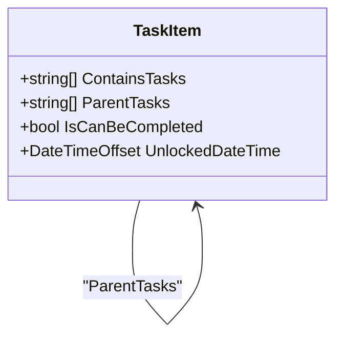
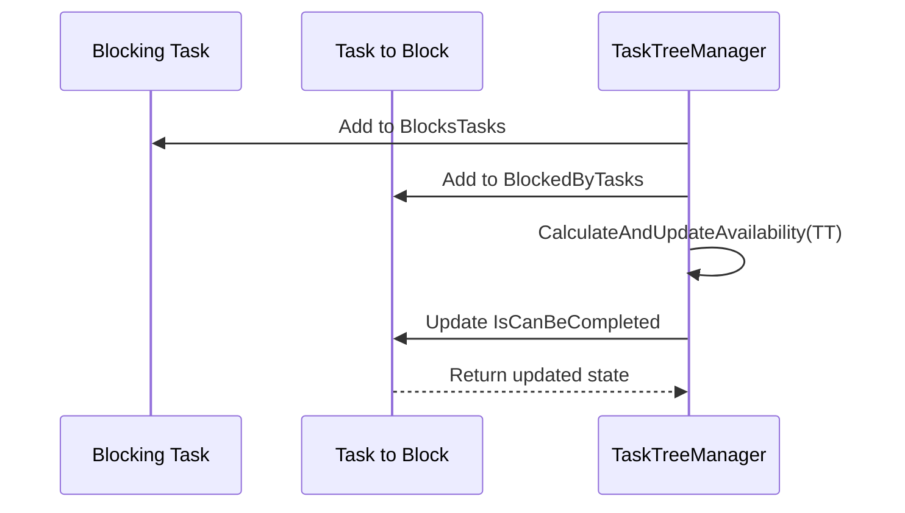
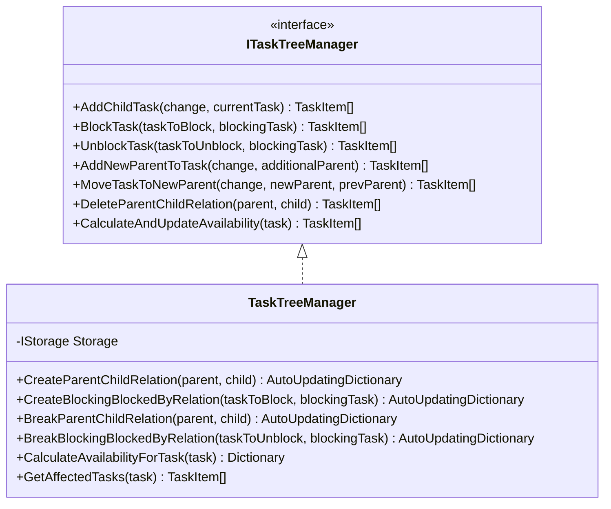
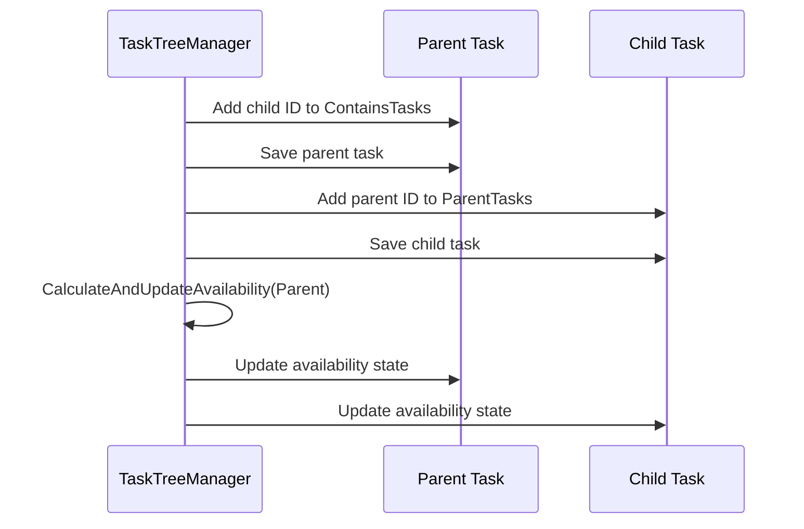
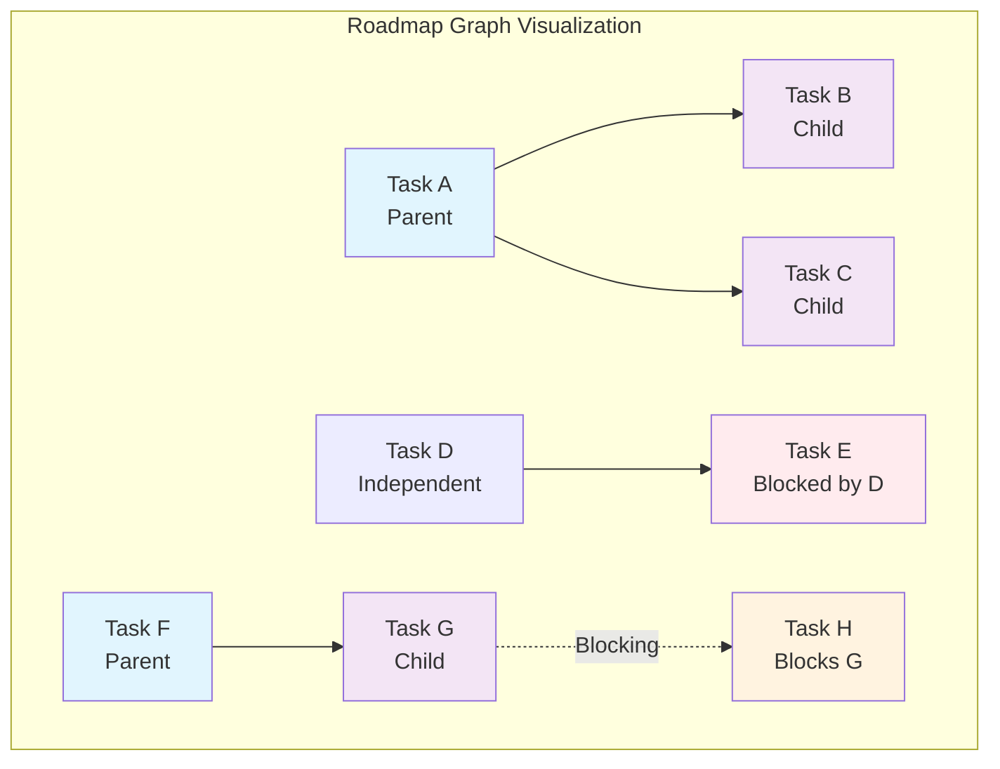
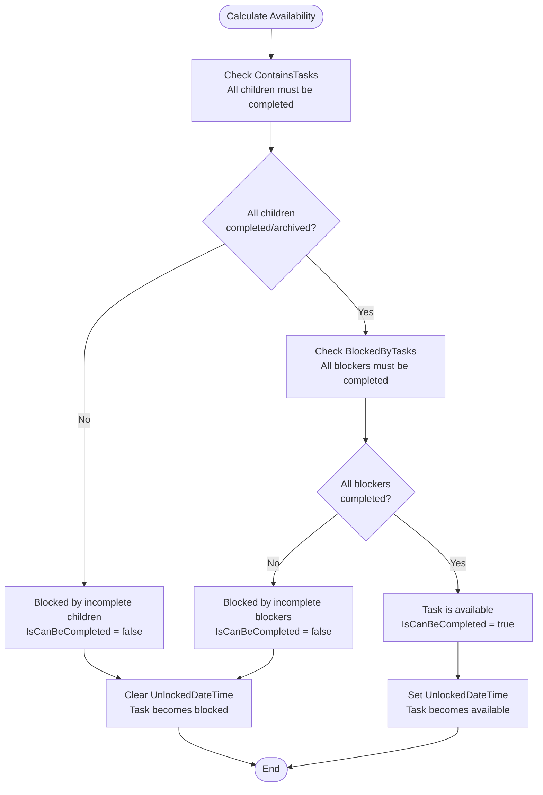

# Task Relationships

<cite>
**Referenced Files in This Document**
- [TaskItem.cs](file://src/Unlimotion.Domain/TaskItem.cs)
- [TaskTreeManager.cs](file://src/Unlimotion.TaskTreeManager/TaskTreeManager.cs)
- [ITaskTreeManager.cs](file://src/Unlimotion.TaskTreeManager/ITaskTreeManager.cs)
- [README.md](file://README.md)
- [TaskAvailabilityCalculationTests.cs](file://src/Unlimotion.Test/TaskAvailabilityCalculationTests.cs)
- [GraphControl.axaml.cs](file://src/Unlimotion/Views/GraphControl.axaml.cs)
- [ContainEdge.cs](file://src/Unlimotion/Views/Graph/ContainEdge.cs)
- [BlockEdge.cs](file://src/Unlimotion/Views/Graph/BlockEdge.cs)
- [MainWindowViewModel.cs](file://src/Unlimotion.ViewModel/MainWindowViewModel.cs)
- [MainControl.axaml.cs](file://src/Unlimotion/Views/MainControl.axaml.cs)
</cite>

## Table of Contents
1. [Introduction](#introduction)
2. [Task Relationship Types](#task-relationship-types)
3. [TaskItem Model Structure](#taskitem-model-structure)
4. [Relationship Management Architecture](#relationship-management-architecture)
5. [Bidirectional Relationship Handling](#bidirectional-relationship-handling)
6. [Visual Representation](#visual-representation)
7. [Task Availability Calculations](#task-availability-calculations)
8. [Common Operations and UI Interactions](#common-operations-and-ui-interactions)
9. [Troubleshooting and Best Practices](#troubleshooting-and-best-practices)
10. [Code Examples and Implementation Details](#code-examples-and-implementation-details)

## Introduction

Unlimotion implements a sophisticated task relationship system that enables flexible task organization and dependency management. Unlike traditional task managers, Unlimotion supports multiple relationship types that allow for complex task hierarchies, cross-project organization, and intelligent blocking mechanisms. This system forms the foundation for Unlimotion's unique approach to task management, enabling users to organize tasks in ways that mirror real-world project structures and dependencies.

The relationship system consists of four fundamental types: Parents, Containing, Blocking By, and Blocked. These relationships work together to create a dynamic task ecosystem where tasks can belong to multiple projects simultaneously, block each other in complex chains, and maintain availability states based on their dependencies.

## Task Relationship Types

### Parents Relationships

Parents relationships represent containment in a hierarchical sense where a parent task contains child tasks as integral parts necessary for execution. This relationship type enables the classic parent-child task structure familiar to most task management systems.

**Key Characteristics:**
- Hierarchical containment
- Child tasks inherit properties from parents
- Completion of all child tasks is required for parent availability
- Supports unlimited nesting depth
- Enables cross-project task organization

**Implementation Example:**


**Diagram sources**
- [TaskItem.cs](file://src/Unlimotion.Domain/TaskItem.cs#L18-L21)
- [TaskTreeManager.cs](file://src/Unlimotion.TaskTreeManager/TaskTreeManager.cs#L486-L527)

### Containing Relationships

Containing relationships establish parent-child connections where child tasks are part or steps of a parent task arising during decomposition. These relationships are bidirectional and automatically maintained by the system.

**Key Characteristics:**
- Bidirectional relationship maintenance
- Automatic synchronization between parent and child
- Used for task decomposition and organization
- Enables hierarchical task display
- Supports complex task structures

**Implementation Example:**
The containing relationship is established through the `CreateParentChildRelation` method, which ensures both sides of the relationship are properly maintained.

### Blocking By Relationships

Blocking By relationships define dependencies where a blocking task must be completed before the current task can become available. This creates forward-looking dependencies that prevent tasks from becoming executable prematurely.

**Key Characteristics:**
- Forward-looking dependencies
- Prevents premature task execution
- Creates chain reactions in availability
- Supports complex dependency chains
- Enables logical task sequencing

**Implementation Example:**


**Diagram sources**
- [TaskTreeManager.cs](file://src/Unlimotion.TaskTreeManager/TaskTreeManager.cs#L523-L562)

### Blocked Relationships

Blocked relationships represent the inverse of blocking relationships, indicating that a task cannot be unblocked while the current task is not completed. This creates backward dependencies that ensure prerequisite tasks remain available.

**Key Characteristics:**
- Backward dependencies
- Ensures prerequisite availability
- Creates dependency chains
- Supports complex blocking scenarios
- Maintains logical task flow

**Implementation Example:**
Blocked relationships are managed through the `CreateBlockingBlockedByRelation` method, which handles the bidirectional aspect of blocking relationships.

**Section sources**
- [TaskItem.cs](file://src/Unlimotion.Domain/TaskItem.cs#L18-L21)
- [TaskTreeManager.cs](file://src/Unlimotion.TaskTreeManager/TaskTreeManager.cs#L486-L562)

## TaskItem Model Structure

The TaskItem model serves as the foundation for all relationship management in Unlimotion. It contains four primary relationship collections that define how tasks connect to each other.

### Core Relationship Properties

| Property | Type | Purpose | Bidirectional |
|----------|------|---------|---------------|
| `ContainsTasks` | `List<string>` | Child tasks contained by this task | No |
| `ParentTasks` | `List<string>` | Parent tasks containing this task | No |
| `BlocksTasks` | `List<string>` | Tasks this task blocks from execution | No |
| `BlockedByTasks` | `List<string>` | Tasks that block this task from execution | No |

### Relationship Cardinality

**Parents Relationships:**
- A task can have multiple parent tasks
- Enables cross-project task organization
- Functions as a tagging alternative
- Supports complex project structures

**Containing Relationships:**
- A task can contain multiple child tasks
- Enables hierarchical task decomposition
- Supports unlimited nesting depth
- Maintains parent-child relationships

**Blocking Relationships:**
- Both blocking and blocked relationships support multiple entries
- Enables complex dependency chains
- Supports parallel blocking scenarios
- Creates sophisticated task sequences

**Section sources**
- [TaskItem.cs](file://src/Unlimotion.Domain/TaskItem.cs#L18-L21)

## Relationship Management Architecture

The TaskTreeManager serves as the central orchestrator for all relationship operations, providing a comprehensive API for managing task connections and maintaining system consistency.

### Core Relationship Methods



**Diagram sources**
- [ITaskTreeManager.cs](file://src/Unlimotion.TaskTreeManager/ITaskTreeManager.cs#L7-L42)
- [TaskTreeManager.cs](file://src/Unlimotion.TaskTreeManager/TaskTreeManager.cs#L11-L15)

### Relationship Operation Patterns

**Creation Operations:**
- `AddChildTask`: Creates parent-child relationships
- `BlockTask`: Establishes blocking dependencies
- `AddNewParentToTask`: Adds additional parent relationships

**Modification Operations:**
- `MoveTaskToNewParent`: Changes parent relationships
- `UnblockTask`: Removes blocking dependencies
- `DeleteParentChildRelation`: Breaks parent-child relationships

**Cleanup Operations:**
- Automatic relationship cleanup during task deletion
- Cascade effect handling for dependent tasks
- Availability recalculation for affected tasks

**Section sources**
- [TaskTreeManager.cs](file://src/Unlimotion.TaskTreeManager/TaskTreeManager.cs#L11-L837)

## Bidirectional Relationship Handling

Unlimotion's relationship system maintains bidirectional consistency through carefully orchestrated operations that ensure both sides of each relationship are properly synchronized.

### Parent-Child Relationship Synchronization

The parent-child relationship operates bidirectionally, requiring updates to both the parent's `ContainsTasks` collection and the child's `ParentTasks` collection.

**Synchronization Process:**
1. Add child ID to parent's `ContainsTasks`
2. Add parent ID to child's `ParentTasks`
3. Recalculate availability for the parent task
4. Update both tasks in the result dictionary

**Implementation Pattern:**


**Diagram sources**
- [TaskTreeManager.cs](file://src/Unlimotion.TaskTreeManager/TaskTreeManager.cs#L486-L527)

### Blocking Relationship Synchronization

Blocking relationships also maintain bidirectional consistency, ensuring that both the blocking task and the blocked task are properly updated.

**Synchronization Process:**
1. Add blocked task ID to blocking task's `BlocksTasks`
2. Add blocking task ID to blocked task's `BlockedByTasks`
3. Recalculate availability for the blocked task only
4. Update both tasks in the result dictionary

**Section sources**
- [TaskTreeManager.cs](file://src/Unlimotion.TaskTreeManager/TaskTreeManager.cs#L486-L562)

## Visual Representation

Unlimotion provides two primary visual representations for task relationships: hierarchical tree view and roadmap graph view.

### Hierarchical Tree View

The tree view displays tasks in a traditional parent-child hierarchy, showing the containment relationships that form the core organizational structure.

**Visual Elements:**
- Nested indentation for child tasks
- Expand/collapse functionality for task branches
- Clear parent-child relationship indicators
- Cross-project visibility through multiple parent assignments

### Roadmap Graph View

The roadmap graph provides a sophisticated visual representation of all task relationships, showing both containment and blocking dependencies.



**Diagram sources**
- [GraphControl.axaml.cs](file://src/Unlimotion/Views/GraphControl.axaml.cs#L122-L143)
- [ContainEdge.cs](file://src/Unlimotion/Views/Graph/ContainEdge.cs#L5-L10)
- [BlockEdge.cs](file://src/Unlimotion/Views/Graph/BlockEdge.cs#L5-L9)

### Graph Edge Types

**Containment Edges (Green Arrows):**
- Represent parent-child relationships
- Indicate task decomposition
- Shown as solid green arrows in the roadmap view

**Blocking Edges (Red Arrows):**
- Represent blocking dependencies
- Indicate prerequisite relationships
- Shown as solid red arrows in the roadmap view

**Section sources**
- [GraphControl.axaml.cs](file://src/Unlimotion/Views/GraphControl.axaml.cs#L122-L143)
- [ContainEdge.cs](file://src/Unlimotion/Views/Graph/ContainEdge.cs#L5-L10)
- [BlockEdge.cs](file://src/Unlimotion/Views/Graph/BlockEdge.cs#L5-L9)

## Task Availability Calculations

Task availability is determined by evaluating all relationship dependencies and calculating whether a task meets its prerequisites for execution.

### Availability Calculation Logic



**Diagram sources**
- [TaskTreeManager.cs](file://src/Unlimotion.TaskTreeManager/TaskTreeManager.cs#L680-L750)

### Availability Calculation Algorithm

The availability calculation follows a comprehensive evaluation process:

**Step 1: Child Task Evaluation**
- Check all tasks in `ContainsTasks`
- All child tasks must be completed or archived
- Incomplete child tasks block parent availability

**Step 2: Blocking Task Evaluation**
- Check all tasks in `BlockedByTasks`
- All blocking tasks must be completed
- Incomplete blockers block task availability

**Step 3: Availability Determination**
- Task is available only if both conditions are met
- Updates `IsCanBeCompleted` property accordingly
- Manages `UnlockedDateTime` for availability tracking

**Step 4: Cascade Effects**
- Recalculates availability for affected tasks
- Propagates changes through relationship chains
- Maintains system consistency

**Section sources**
- [TaskTreeManager.cs](file://src/Unlimotion.TaskTreeManager/TaskTreeManager.cs#L680-L750)

## Common Operations and UI Interactions

Unlimotion provides intuitive UI interactions for managing task relationships through drag-and-drop operations and keyboard shortcuts.

### Drag-and-Drop Operations

**Standard Drag (No Modifier Keys):**
- Creates parent-child relationships
- Moves task into target task as child
- Maintains existing parent relationships

**Shift + Drag:**
- Moves task to new parent
- Breaks existing parent-child relationships
- Creates new parent-child relationship

**Ctrl + Drag:**
- Creates blocking relationship
- Task being dragged blocks target task
- Establishes forward dependency

**Alt + Drag:**
- Creates blocking relationship
- Target task blocks task being dragged
- Establishes backward dependency

**Ctrl + Shift + Drag:**
- Clones task into target task
- Creates copy as child task
- Preserves original task relationships

### Keyboard Shortcuts

**Task Creation:**
- `Ctrl+Enter`: Create sibling task
- `Shift+Enter`: Create blocked sibling task  
- `Ctrl+Tab`: Create inner (child) task

**Relationship Management:**
- `Ctrl+D`: Duplicate task
- `Delete`: Delete task
- `Shift+Delete`: Force delete task

### Relationship Validation

The system includes built-in validation to prevent circular dependencies and maintain relationship integrity:

**Circular Dependency Prevention:**
- Validates relationship chains during creation
- Prevents tasks from becoming their own ancestors
- Detects and rejects invalid relationship combinations

**Integrity Checks:**
- Ensures relationship consistency
- Validates task existence before establishing relationships
- Maintains referential integrity across the task graph

**Section sources**
- [MainControl.axaml.cs](file://src/Unlimotion/Views/MainControl.axaml.cs#L69-L236)
- [MainWindowViewModel.cs](file://src/Unlimotion.ViewModel/MainWindowViewModel.cs#L60-L120)

## Troubleshooting and Best Practices

### Common Issues and Solutions

**Circular Dependencies:**
- **Problem**: Tasks forming circular relationship chains
- **Solution**: The system prevents circular dependencies through validation checks
- **Prevention**: Design task hierarchies with clear dependency directions

**Unintended Blocking:**
- **Problem**: Tasks becoming unintentionally blocked
- **Solution**: Review blocking relationships and adjust dependencies
- **Prevention**: Use blocking relationships judiciously and review impact

**Performance Issues:**
- **Problem**: Slow relationship operations with large task trees
- **Solution**: Optimize relationship queries and use caching
- **Prevention**: Limit deep nesting and excessive relationship complexity

### Best Practices

**Relationship Organization:**
- Use parents relationships for project organization
- Reserve blocking relationships for logical dependencies
- Leverage multiple parents for cross-project tasks
- Maintain clear relationship hierarchies

**Task Decomposition:**
- Break down complex tasks into manageable child tasks
- Ensure child tasks are atomic and meaningful
- Use containment relationships for natural task progression
- Maintain consistent task granularity

**Dependency Management:**
- Establish clear prerequisite relationships
- Avoid overly complex blocking chains
- Use blocking relationships for mandatory dependencies
- Monitor cascade effects of relationship changes

### Debugging Tools

**Relationship Visualization:**
- Use roadmap graph view to visualize complex relationships
- Examine relationship collections in task details
- Trace relationship chains through the task tree

**Availability Tracking:**
- Monitor `IsCanBeCompleted` property changes
- Track `UnlockedDateTime` for availability timing
- Review relationship impact on task availability

**Section sources**
- [TaskAvailabilityCalculationTests.cs](file://src/Unlimotion.Test/TaskAvailabilityCalculationTests.cs#L200-L400)

## Code Examples and Implementation Details

### Creating Parent-Child Relationships

The `AddChildTask` method demonstrates how parent-child relationships are established:

**Method Signature:**
```csharp
public async Task<List<TaskItem>> AddChildTask(TaskItem change, TaskItem currentTask)
```

**Implementation Highlights:**
- Creates bidirectional parent-child relationships
- Recalculates availability for the parent task
- Maintains relationship consistency
- Handles concurrent operations safely

### Establishing Blocking Relationships

The `BlockTask` method shows how blocking relationships are created:

**Method Signature:**
```csharp
public async Task<List<TaskItem>> BlockTask(TaskItem taskToBlock, TaskItem blockingTask)
```

**Implementation Features:**
- Maintains bidirectional blocking relationships
- Recalculates availability for the blocked task
- Handles relationship conflicts gracefully
- Provides atomic operation guarantees

### Relationship Cleanup

The `DeleteTask` method illustrates comprehensive relationship cleanup:

**Cleanup Process:**
1. Collect tasks requiring availability recalculation
2. Break containment relationships with children
3. Break parent relationships with parents
4. Break blocking relationships with blockers
5. Break blocked relationships with blocked tasks
6. Recalculate availability for affected tasks
7. Remove the task from storage

### Availability Calculation Implementation

The `CalculateAvailabilityForTask` method provides the core availability logic:

**Calculation Steps:**
1. Evaluate all contained tasks for completion status
2. Evaluate all blocking tasks for completion status
3. Determine overall availability based on criteria
4. Update `IsCanBeCompleted` property accordingly
5. Manage `UnlockedDateTime` based on availability changes
6. Save updated task state to storage

**Section sources**
- [TaskTreeManager.cs](file://src/Unlimotion.TaskTreeManager/TaskTreeManager.cs#L48-L120)
- [TaskTreeManager.cs](file://src/Unlimotion.TaskTreeManager/TaskTreeManager.cs#L564-L620)
- [TaskTreeManager.cs](file://src/Unlimotion.TaskTreeManager/TaskTreeManager.cs#L680-L750)