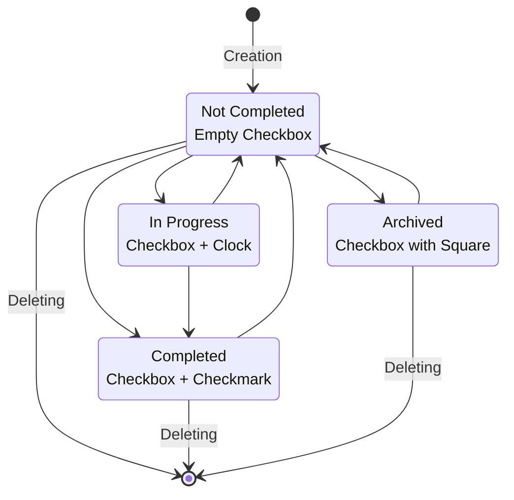
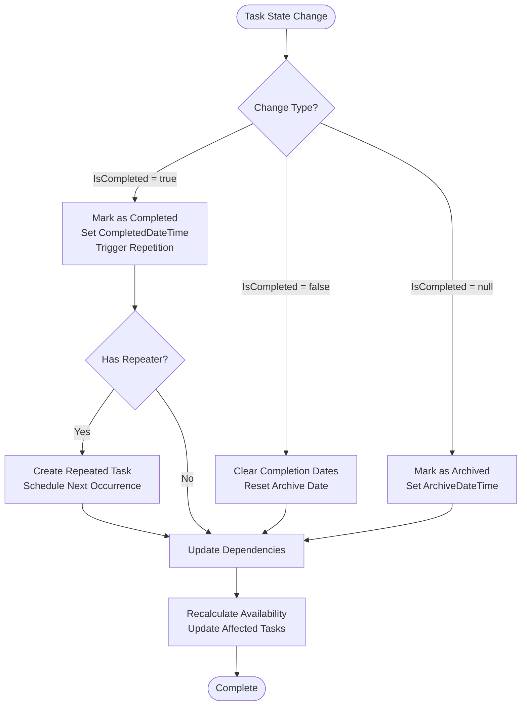
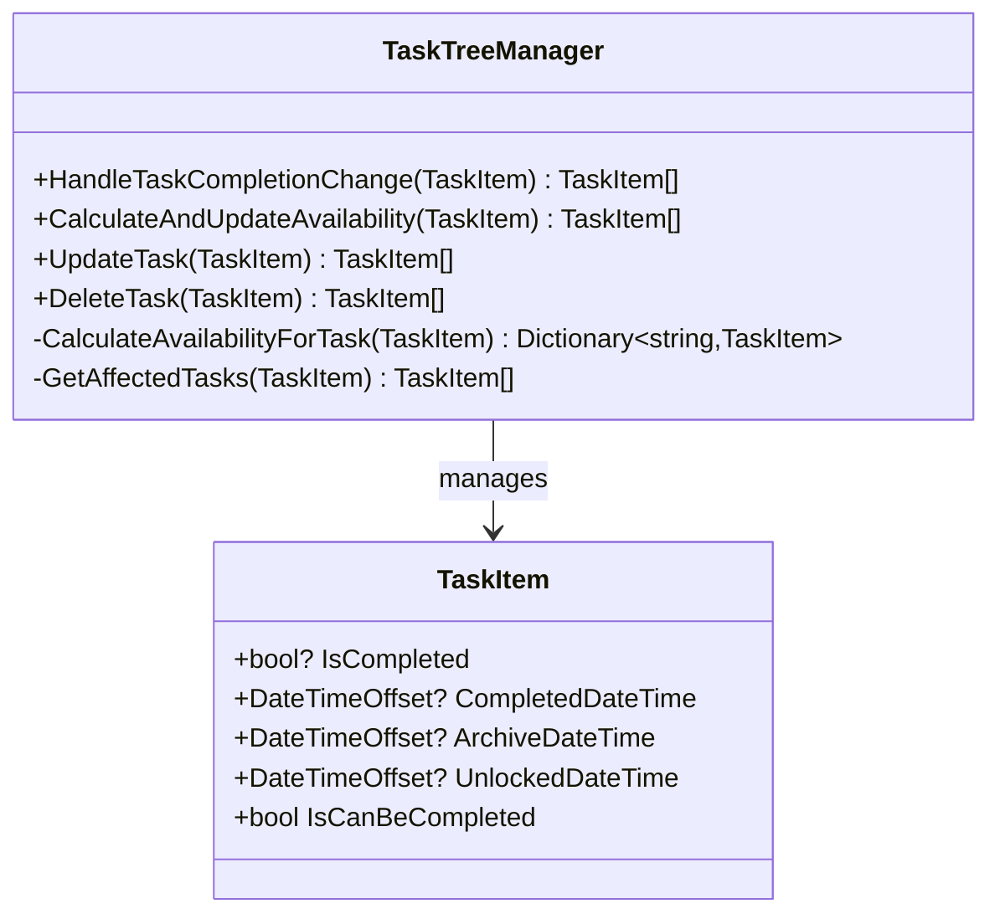
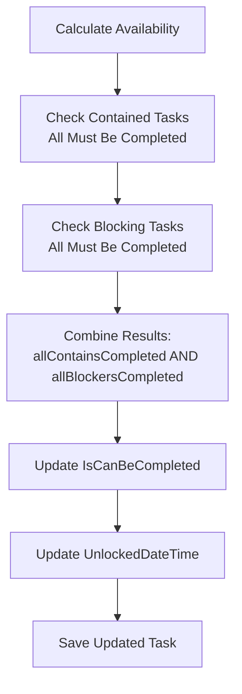
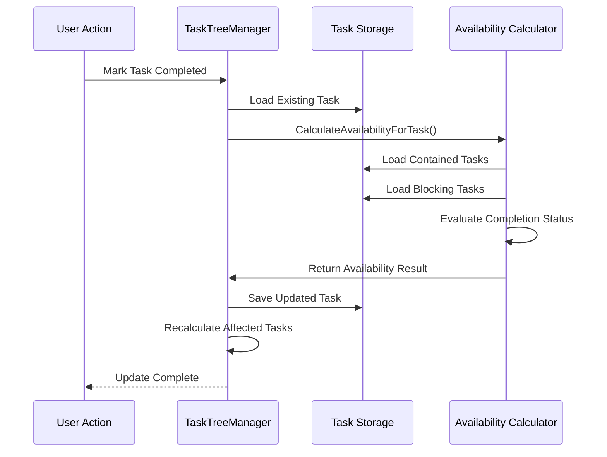

# Task States

<cite>
**Referenced Files in This Document**
- [TaskItem.cs](file://src/Unlimotion.Domain/TaskItem.cs)
- [TaskTreeManager.cs](file://src/Unlimotion.TaskTreeManager/TaskTreeManager.cs)
- [ITaskTreeManager.cs](file://src/Unlimotion.TaskTreeManager/ITaskTreeManager.cs)
- [TaskItemViewModel.cs](file://src/Unlimotion.ViewModel/TaskItemViewModel.cs)
- [TaskCompletionChangeTests.cs](file://src/Unlimotion.Test/TaskCompletionChangeTests.cs)
- [TaskAvailabilityCalculationTests.cs](file://src/Unlimotion.Test/TaskAvailabilityCalculationTests.cs)
- [README.md](file://README.md)
- [RepeaterPattern.cs](file://src/Unlimotion.Domain/RepeaterPattern.cs)
- [RepeaterType.cs](file://src/Unlimotion.Domain/RepeaterType.cs)
</cite>

## Table of Contents
1. [Introduction](#introduction)
2. [Task State System Overview](#task-state-system-overview)
3. [Four Distinct States](#four-distinct-states)
4. [State Transitions and Valid Paths](#state-transitions-and-valid-paths)
5. [Visual Representation in UI](#visual-representation-in-ui)
6. [State Management Implementation](#state-management-implementation)
7. [Availability and Blocking Logic](#availability-and-blocking-logic)
8. [Practical Usage Scenarios](#practical-usage-scenarios)
9. [Best Practices](#best-practices)
10. [Testing and Validation](#testing-and-validation)

## Introduction

Unlimotion implements a sophisticated four-state task management system that provides granular control over task lifecycle management. The system goes beyond simple binary completion states by introducing distinct states for different task conditions, enabling powerful workflow management and dependency resolution capabilities.

The task state system serves as the foundation for Unlimotion's advanced scheduling and project management features, allowing users to track task progress accurately while maintaining flexibility in workflow organization.

## Task State System Overview

The Unlimotion task state system operates on a four-state model where each task can exist in one of four mutually exclusive states. This design enables precise tracking of task conditions and facilitates complex dependency relationships between tasks.

**Diagram sources**
- [README.md](file://README.md#L38-L50)

**Section sources**
- [README.md](file://README.md#L38-L50)

## Four Distinct States

### 1. Not Completed State

The **Not Completed** state represents tasks that are neither archived nor completed. These tasks are actively available for work and can be marked as in progress or completed.

**Characteristics:**
- `IsCompleted = false`
- Available for immediate work
- Can be transitioned to In Progress, Completed, or Archived
- Triggers availability calculations when dependencies change

**Implementation Details:**
- Visual representation: Empty checkbox
- Default state for newly created tasks
- Automatically becomes available when dependencies are resolved

### 2. In Progress State

The **In Progress** state indicates tasks that are currently being worked on. This state provides visual feedback about ongoing work and helps prevent multiple simultaneous work on the same task.

**Characteristics:**
- `IsCompleted = false` (same as Not Completed)
- Visual indicator: Empty checkbox with clock icon nearby
- Cannot be directly marked as completed while in progress
- Requires explicit completion action

**Implementation Details:**
- No separate boolean flag - uses `IsCompleted = false` with visual indicators
- Useful for tracking active work sessions
- Prevents accidental completion during active work

### 3. Completed State

The **Completed** state marks tasks that have been finished and are ready for archival or repetition. This state includes timestamp tracking and supports automated task repetition.

**Characteristics:**
- `IsCompleted = true`
- Automatic timestamp recording (`CompletedDateTime`)
- Supports task repetition through repeater patterns
- Can be reverted to Not Completed state
- Triggers availability recalculation for dependent tasks

**Implementation Details:**
- Automatic completion timestamp assignment
- Repeater pattern support for recurring tasks
- Cloning mechanism for repeated tasks

### 4. Archived State

The **Archived** state preserves completed tasks without cluttering active task lists. Archived tasks are treated as completed for dependency resolution purposes.

**Characteristics:**
- `IsCompleted = null` (special null state)
- Manual archival from Not Completed or Completed states
- Treated as completed in dependency calculations
- Preserves historical information
- Can be unarchived to restore to active state

**Implementation Details:**
- Special null value for `IsCompleted` property
- Automatic archive timestamp (`ArchiveDateTime`) assignment
- Preserved for historical reference
- Does not participate in active workflow

**Section sources**
- [TaskItem.cs](file://src/Unlimotion.Domain/TaskItem.cs#L8-L10)
- [TaskTreeManager.cs](file://src/Unlimotion.TaskTreeManager/TaskTreeManager.cs#L750-L780)

## State Transitions and Valid Paths

The task state system implements a carefully designed transition matrix that ensures logical workflow progression while preventing invalid state combinations.

### Creation Workflow

New tasks are always created in the **Not Completed** state with automatic initialization of timestamps and version tracking.

### Deletion Workflow

Tasks can be permanently deleted from any state except when they have active dependencies that would violate data integrity.

### Modification Workflows

State modifications trigger comprehensive availability recalculation to maintain dependency consistency:

**Diagram sources**
- [TaskTreeManager.cs](file://src/Unlimotion.TaskTreeManager/TaskTreeManager.cs#L750-L837)

**Section sources**
- [TaskTreeManager.cs](file://src/Unlimotion.TaskTreeManager/TaskTreeManager.cs#L240-L284)
- [TaskCompletionChangeTests.cs](file://src/Unlimotion.Test/TaskCompletionChangeTests.cs#L15-L46)

## Visual Representation in UI

The Unlimotion interface provides intuitive visual indicators for each task state, making it easy for users to understand task conditions at a glance.

### Checkbox Styles and Icons

| State | Visual Indicator | Icon Description |
|-------|------------------|------------------|
| Not Completed | Empty checkbox | Standard unchecked state |
| In Progress | Empty checkbox + Clock | Indicates active work |
| Completed | Checkbox with checkmark | Indicates finished task |
| Archived | Checkbox with square | Indicates archived task |

### UI State Indicators

**Not Completed Tasks:**
- Standard checkbox appearance
- No additional visual indicators
- Available for immediate action

**In Progress Tasks:**
- Checkbox with adjacent clock icon
- May include duration tracking
- Prevents accidental completion

**Completed Tasks:**
- Checked checkbox with completion timestamp
- May show completion date/time
- Supports repetition indicators

**Archived Tasks:**
- Checkbox with square outline
- Archive timestamp display
- Reduced visual prominence

**Section sources**
- [README.md](file://README.md#L38-L45)

## State Management Implementation

The state management system is implemented through a centralized approach in the `TaskTreeManager` class, which handles all state transitions and maintains consistency across the application.

### Core State Management Methods

The `TaskTreeManager` provides specialized methods for handling state changes:

**Diagram sources**
- [TaskTreeManager.cs](file://src/Unlimotion.TaskTreeManager/TaskTreeManager.cs#L750-L837)
- [TaskItem.cs](file://src/Unlimotion.Domain/TaskItem.cs#L8-L10)

### State Change Processing

The `HandleTaskCompletionChange` method orchestrates state transitions and triggers appropriate side effects:

**Completion State Changes:**
- Sets/unsets completion timestamps
- Manages repeater pattern execution
- Updates archive timestamps
- Triggers availability recalculation

**Availability Calculations:**
The system calculates task availability based on dependency relationships:

**Diagram sources**
- [TaskTreeManager.cs](file://src/Unlimotion.TaskTreeManager/TaskTreeManager.cs#L640-L690)

**Section sources**
- [TaskTreeManager.cs](file://src/Unlimotion.TaskTreeManager/TaskTreeManager.cs#L750-L837)
- [ITaskTreeManager.cs](file://src/Unlimotion.TaskTreeManager/ITaskTreeManager.cs#L35-L42)

## Availability and Blocking Logic

The task state system integrates closely with Unlimotion's availability calculation engine, which determines when tasks become available for work based on their state and dependencies.

### Dependency Resolution Rules

**Availability Conditions:**
1. **All contained tasks must be completed** (`IsCompleted != false`)
2. **All blocking tasks must be completed** (`IsCompleted != false`)

**Archived Task Treatment:**
- Archived tasks (`IsCompleted = null`) are treated as completed for dependency resolution
- This allows tasks to depend on archived predecessors
- Maintains logical workflow continuity

### Availability Calculation Process

**Diagram sources**
- [TaskTreeManager.cs](file://src/Unlimotion.TaskTreeManager/TaskTreeManager.cs#L629-L665)

### Blocking Logic Implementation

The availability system prevents tasks from becoming available until all prerequisites are met:

**Blocked Task Conditions:**
- Contains incomplete tasks
- Has incomplete blocking tasks
- Parent tasks have incomplete blockers

**Automatic Unlocking:**
- Tasks become available when dependencies are resolved
- Automatic `UnlockedDateTime` assignment
- Immediate availability for work

**Section sources**
- [TaskTreeManager.cs](file://src/Unlimotion.TaskTreeManager/TaskTreeManager.cs#L640-L720)
- [TaskAvailabilityCalculationTests.cs](file://src/Unlimotion.Test/TaskAvailabilityCalculationTests.cs#L15-L47)

## Practical Usage Scenarios

### Scenario 1: Pausing and Resuming Tasks

Users frequently need to pause active work on tasks while maintaining their completion status. The system supports this workflow through careful state management.

**Workflow:**
1. Start working on a task (remains Not Completed)
2. Pause work (no state change)
3. Resume work (continues as Not Completed)
4. Complete task (transitions to Completed)

### Scenario 2: Final Task Completion

The Completed state provides permanent completion tracking with repetition support.

**Workflow:**
1. Complete task manually
2. System records completion timestamp
3. If task has repeater pattern, creates next occurrence
4. Task becomes available for future work

### Scenario 3: Archiving Without Deletion

The Archived state allows users to preserve completed tasks without removing them from the system.

**Workflow:**
1. Select task for archival
2. Transition to Archived state
3. System records archive timestamp
4. Task remains accessible for reference
5. Can be unarchived to restore to active state

### Scenario 4: Historical Task Preservation

Archived tasks serve as historical records while maintaining dependency relationships.

**Benefits:**
- Preserves completed task history
- Maintains dependency integrity
- Allows future reference
- Prevents accidental deletion

**Section sources**
- [TaskItemViewModel.cs](file://src/Unlimotion.ViewModel/TaskItemViewModel.cs#L136-L171)

## Best Practices

### State Selection Guidelines

**Use Not Completed for:**
- Active tasks requiring immediate attention
- Tasks with unresolved dependencies
- New tasks awaiting work initiation

**Use In Progress for:**
- Tasks currently being worked on
- Preventing accidental completion during active work
- Tracking ongoing work sessions

**Use Completed for:**
- Final task completion
- Enabling task repetition
- Permanent completion tracking

**Use Archived for:**
- Preserving completed tasks
- Reducing active task list clutter
- Historical record keeping
- Long-term task preservation

### Workflow Management Recommendations

**Dependency Management:**
- Ensure contained tasks are properly completed before parent tasks
- Use blocking relationships to enforce logical workflow order
- Archive completed prerequisite tasks to maintain clarity

**Repetition Planning:**
- Configure repeater patterns for recurring tasks
- Plan repetition intervals based on task nature
- Consider AfterComplete vs. Absolute timing

**Historical Preservation:**
- Archive completed tasks regularly to maintain clean active lists
- Use archived tasks for historical reference and trend analysis
- Maintain separation between active and historical task management

### Performance Considerations

**Availability Calculation:**
- State changes trigger availability recalculation for affected tasks
- Complex dependency trees may impact performance
- Monitor performance in large task hierarchies

**Storage Efficiency:**
- Archived tasks consume minimal storage overhead
- State changes are atomic operations
- Consistent state management prevents data corruption

## Testing and Validation

The task state system includes comprehensive testing to ensure reliability and correctness across all state transitions and availability calculations.

### Test Coverage Areas

**State Transition Tests:**
- Completion state changes
- Archive/unarchive operations
- Repeater pattern execution
- Timestamp management

**Availability Calculation Tests:**
- Dependency resolution logic
- Blocked task detection
- Automatic unlocking mechanisms
- Complex dependency scenarios

### Validation Scenarios

**Basic State Operations:**
- Verify state transitions occur correctly
- Confirm timestamp assignments
- Validate repeater pattern execution

**Complex Dependency Scenarios:**
- Multi-level task hierarchies
- Circular dependency detection
- Mixed completion states
- Large-scale availability recalculation

**Edge Case Handling:**
- Null state values
- Concurrent state changes
- Storage failures during state updates
- Recovery from inconsistent states

**Section sources**
- [TaskCompletionChangeTests.cs](file://src/Unlimotion.Test/TaskCompletionChangeTests.cs#L15-L127)
- [TaskAvailabilityCalculationTests.cs](file://src/Unlimotion.Test/TaskAvailabilityCalculationTests.cs#L15-L47)