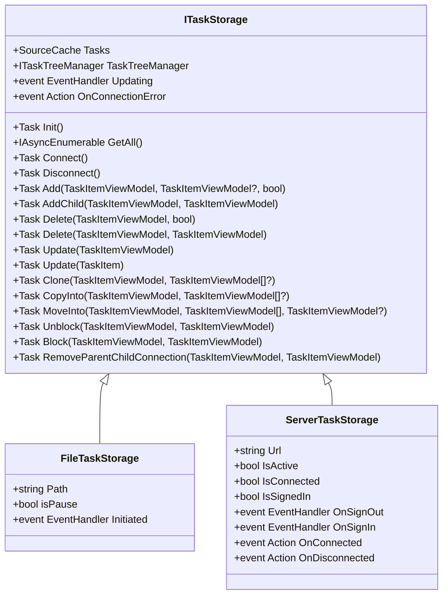
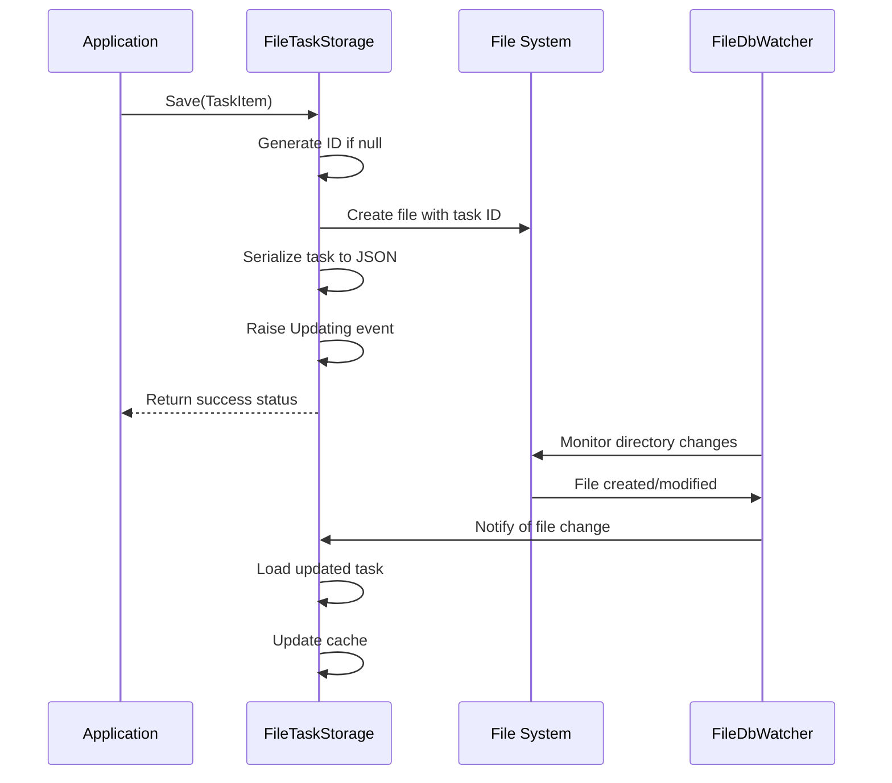
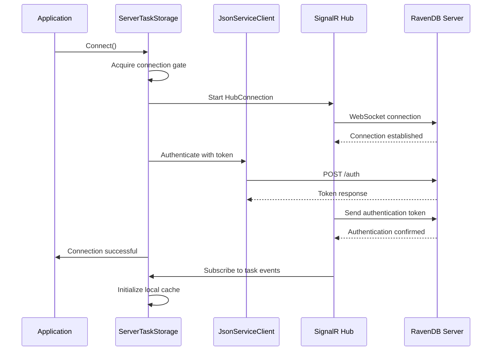
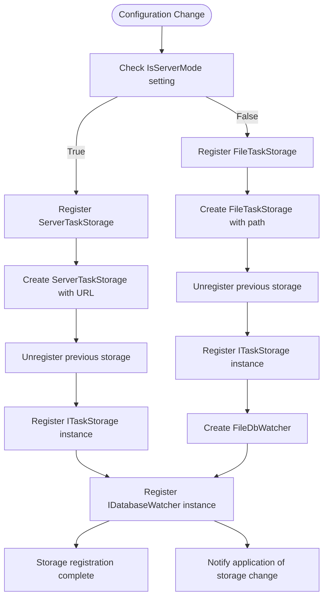
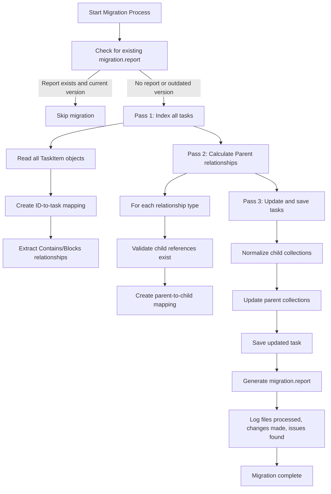
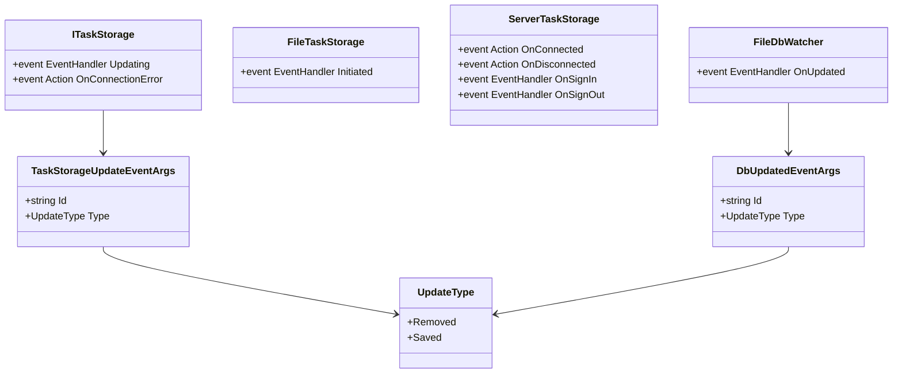

# Data Synchronization

<cite>
**Referenced Files in This Document**   
- [FileTaskStorage.cs](file://src/Unlimotion/FileTaskStorage.cs)
- [ServerTaskStorage.cs](file://src/Unlimotion/ServerTaskStorage.cs)
- [TaskStorages.cs](file://src/Unlimotion/TaskStorages.cs)
- [FileTaskMigrator.cs](file://src/Unlimotion/FileTaskMigrator.cs)
- [ITaskStorage.cs](file://src/Unlimotion.ViewModel/ITaskStorage.cs)
- [TaskStorageSettings.cs](file://src/Unlimotion.ViewModel/TaskStorageSettings.cs)
- [FileDbWatcher.cs](file://src/Unlimotion.ViewModel/FileDbWatcher.cs)
- [TaskItem.cs](file://src/Unlimotion.Domain/TaskItem.cs)
- [TaskStorageUpdateEventArgs.cs](file://src/Unlimotion.ViewModel/TaskStorageUpdateEventArgs.cs)
- [ClientSettings.cs](file://src/Unlimotion/ClientSettings.cs)
</cite>

## Table of Contents
1. [Introduction](#introduction)
2. [Storage Abstraction Layer](#storage-abstraction-layer)
3. [File-Based Storage Implementation](#file-based-storage-implementation)
4. [Server-Based Storage Implementation](#server-based-storage-implementation)
5. [Storage Registration and Configuration](#storage-registration-and-configuration)
6. [Data Migration Mechanism](#data-migration-mechanism)
7. [Event Notification System](#event-notification-system)
8. [Configuration Considerations](#configuration-considerations)
9. [Storage Trade-offs and Recommendations](#storage-trade-offs-and-recommendations)

## Introduction
Unlimotion implements a flexible data synchronization mechanism that allows users to store task data either locally in JSON files or remotely in a RavenDB document database. This dual-storage architecture provides flexibility for different deployment scenarios, from standalone desktop applications to collaborative server-based environments. The system is designed with an abstraction layer that enables seamless switching between storage backends while maintaining consistent data access patterns and event notifications throughout the application.

**Section sources**
- [FileTaskStorage.cs](file://src/Unlimotion/FileTaskStorage.cs)
- [ServerTaskStorage.cs](file://src/Unlimotion/ServerTaskStorage.cs)
- [TaskStorages.cs](file://src/Unlimotion/TaskStorages.cs)

## Storage Abstraction Layer
The ITaskStorage interface serves as the core abstraction that decouples the application logic from specific storage implementations. This interface defines a comprehensive contract for task data operations, including CRUD operations, hierarchical relationships, and event notifications. By implementing this interface, both FileTaskStorage and ServerTaskStorage provide identical method signatures and behavioral patterns, allowing the rest of the application to interact with task data without knowledge of the underlying persistence mechanism.

The interface exposes a SourceCache of TaskItemViewModel objects, enabling reactive data binding and real-time updates across the user interface. It also provides access to the TaskTreeManager, which handles complex operations involving task hierarchies, dependencies, and relationships. The abstraction includes methods for adding tasks, establishing parent-child relationships, blocking/unblocking tasks, and managing task clones and movements within the hierarchy.

**Diagram sources**
- [ITaskStorage.cs](file://src/Unlimotion.ViewModel/ITaskStorage.cs)
- [FileTaskStorage.cs](file://src/Unlimotion/FileTaskStorage.cs)
- [ServerTaskStorage.cs](file://src/Unlimotion/ServerTaskStorage.cs)

**Section sources**
- [ITaskStorage.cs](file://src/Unlimotion.ViewModel/ITaskStorage.cs)
- [FileTaskStorage.cs](file://src/Unlimotion/FileTaskStorage.cs)
- [ServerTaskStorage.cs](file://src/Unlimotion/ServerTaskStorage.cs)

## File-Based Storage Implementation
The FileTaskStorage implementation persists TaskItem objects as individual JSON files in a specified directory, with each file named using the task's unique identifier. This approach provides a simple, transparent storage mechanism that allows for easy backup, version control, and manual inspection of task data. The implementation leverages the .NET FileSystemWatcher to monitor the storage directory for external changes, ensuring that modifications made outside the application (such as through version control systems) are properly synchronized.

During initialization, FileTaskStorage enumerates all files in the designated directory and loads each task into memory, creating corresponding TaskItemViewModel instances. The storage system automatically handles file corruption by attempting to repair malformed JSON and removing irrecoverable files. Each task operation (save, delete, update) triggers appropriate file system operations while maintaining data consistency through the TaskTreeManager, which coordinates changes across related tasks in the hierarchy.

The implementation includes a migration mechanism that ensures data integrity when upgrading between application versions. This process validates and normalizes task relationships, removing self-references and dangling pointers while generating comprehensive migration reports. The storage system also supports pausing operations during bulk updates to prevent race conditions and ensure data consistency.

**Diagram sources**
- [FileTaskStorage.cs](file://src/Unlimotion/FileTaskStorage.cs)
- [FileDbWatcher.cs](file://src/Unlimotion.ViewModel/FileDbWatcher.cs)

**Section sources**
- [FileTaskStorage.cs](file://src/Unlimotion/FileTaskStorage.cs)
- [FileDbWatcher.cs](file://src/Unlimotion.ViewModel/FileDbWatcher.cs)

## Server-Based Storage Implementation
The ServerTaskStorage implementation connects to a RavenDB document database through a server API, utilizing SignalR for real-time communication and ServiceStack for RESTful operations. This implementation enables collaborative task management across multiple clients with immediate synchronization of changes. The storage system establishes a persistent WebSocket connection to the server's ChatHub, allowing for bidirectional communication and push notifications of data changes.

Authentication is handled through a token-based system, with access and refresh tokens stored in the ClientSettings configuration. The implementation automatically manages the authentication lifecycle, including initial login, token refresh when expired, and reconnection after network interruptions. When the connection is lost, the system implements an exponential backoff strategy with randomization to prevent thundering herd problems during server recovery.

Data operations are performed through a combination of REST API calls and SignalR hub invocations. Read operations (GetAll, Load) use HTTP GET requests, while write operations (Save, Remove) are executed through SignalR hub methods for immediate feedback. The implementation subscribes to server-side events for task creation, updates, and deletions, automatically synchronizing these changes with the local cache. Bulk operations are supported through specialized endpoints that optimize performance when migrating large datasets between storage systems.

**Diagram sources**
- [ServerTaskStorage.cs](file://src/Unlimotion/ServerTaskStorage.cs)

**Section sources**
- [ServerTaskStorage.cs](file://src/Unlimotion/ServerTaskStorage.cs)
- [ClientSettings.cs](file://src/Unlimotion/ClientSettings.cs)

## Storage Registration and Configuration
The TaskStorages utility class manages the registration and switching between different storage implementations based on application configuration. This class uses Splat's service locator pattern to register the appropriate ITaskStorage implementation as a singleton, ensuring that all components in the application receive the same storage instance. The registration process is controlled by the IsServerMode flag in the TaskStorageSettings configuration, allowing users to switch between local file storage and server-based storage without code changes.

When registering a storage implementation, the system first disconnects any existing storage to release resources and prevent conflicts. For file-based storage, the system also registers a FileDbWatcher instance to monitor the storage directory for external changes. The registration process is designed to be idempotent, allowing repeated calls without side effects, which is particularly important during configuration changes or application restarts.

The TaskStorages class also provides utility methods for data migration between storage systems, enabling users to transfer their task data from server to file storage or vice versa. These migration methods handle the necessary data transformations, such as removing the "TaskItem/" prefix from document IDs when migrating from RavenDB to file storage. The class includes additional functionality for Git-based backup and synchronization, integrating version control capabilities directly into the storage management system.

**Diagram sources**
- [TaskStorages.cs](file://src/Unlimotion/TaskStorages.cs)
- [TaskStorageSettings.cs](file://src/Unlimotion.ViewModel/TaskStorageSettings.cs)

**Section sources**
- [TaskStorages.cs](file://src/Unlimotion/TaskStorages.cs)
- [TaskStorageSettings.cs](file://src/Unlimotion.ViewModel/TaskStorageSettings.cs)

## Data Migration Mechanism
The data migration system in Unlimotion ensures data integrity when transitioning between storage implementations or upgrading application versions. The FileTaskMigrator class performs a comprehensive analysis of task relationships, identifying and correcting issues such as self-references, dangling pointers, and inconsistent parent-child relationships. This three-pass migration process first indexes all tasks, then calculates parent relationships from child references, and finally updates each task with normalized relationship data.

When migrating from server to file storage, the system automatically removes the "TaskItem/" prefix from document IDs to maintain compatibility with the file-based naming convention. This transformation is applied not only to the task's own ID but also to all references in ContainsTasks, ParentTasks, BlocksTasks, and BlockedByTasks collections. The migration process generates detailed reports that document the number of tasks processed, changes made, and any issues encountered, providing transparency and auditability.

The migration system is designed to be idempotent and safe for repeated execution. It checks for the presence of a migration report file before proceeding, skipping the migration if the current version has already been processed. This prevents unnecessary processing and potential data corruption when restarting the application. The system also supports dry-run mode for testing and validation, allowing administrators to preview the effects of migration without making permanent changes.

**Diagram sources**
- [FileTaskMigrator.cs](file://src/Unlimotion/FileTaskMigrator.cs)
- [TaskStorages.cs](file://src/Unlimotion/TaskStorages.cs)

**Section sources**
- [FileTaskMigrator.cs](file://src/Unlimotion/FileTaskMigrator.cs)
- [TaskStorages.cs](file://src/Unlimotion/TaskStorages.cs)

## Event Notification System
Unlimotion's storage implementations provide a comprehensive event notification system that keeps the application informed of data changes and connection status. The Updating event is raised whenever a task is saved or removed, providing the task ID and operation type through the TaskStorageUpdateEventArgs object. This event is used by the FileDbWatcher to ignore subsequent file system notifications for operations initiated by the application, preventing infinite loops of change detection.

The OnConnectionError event provides error handling for both storage implementations, allowing the application to respond appropriately to network issues, authentication failures, or file system errors. ServerTaskStorage extends this with additional events such as OnConnected, OnDisconnected, OnSignIn, and OnSignOut, enabling fine-grained control over the user interface based on authentication and connection status.

The event system is designed to be thread-safe and asynchronous, ensuring that event handlers do not block critical storage operations. Events are raised on appropriate synchronization contexts to ensure safe access to UI elements when needed. The system also includes throttling mechanisms, particularly in the FileDbWatcher, to prevent overwhelming the application with rapid-fire change notifications during bulk operations or file system synchronization.

**Diagram sources**
- [TaskStorageUpdateEventArgs.cs](file://src/Unlimotion.ViewModel/TaskStorageUpdateEventArgs.cs)
- [FileTaskStorage.cs](file://src/Unlimotion/FileTaskStorage.cs)
- [ServerTaskStorage.cs](file://src/Unlimotion/ServerTaskStorage.cs)
- [FileDbWatcher.cs](file://src/Unlimotion.ViewModel/FileDbWatcher.cs)

**Section sources**
- [TaskStorageUpdateEventArgs.cs](file://src/Unlimotion.ViewModel/TaskStorageUpdateEventArgs.cs)
- [FileTaskStorage.cs](file://src/Unlimotion/FileTaskStorage.cs)
- [ServerTaskStorage.cs](file://src/Unlimotion/ServerTaskStorage.cs)
- [FileDbWatcher.cs](file://src/Unlimotion.ViewModel/FileDbWatcher.cs)

## Configuration Considerations
The TaskStorageSettings class defines the configuration options for both storage implementations, including the file system path for local storage and the server URL for remote storage. Additional settings include authentication credentials (login and password) and the IsServerMode flag that determines which storage implementation to use. These settings are typically loaded from a configuration file or user preferences, allowing for flexible deployment scenarios.

For server-based storage, the ClientSettings class manages authentication tokens, including access and refresh tokens, expiration times, and user identification. These settings are automatically persisted and restored between application sessions, providing a seamless user experience. The system handles token expiration by automatically requesting new tokens using the refresh token, minimizing interruptions to the user workflow.

When configuring file-based storage, users should ensure that the specified directory has appropriate read/write permissions and sufficient storage capacity. For server-based storage, network connectivity and firewall settings must allow connections to the specified server URL, typically over HTTPS. The system supports self-signed certificates for development and testing environments through certificate validation callbacks that bypass standard certificate chain verification.

**Section sources**
- [TaskStorageSettings.cs](file://src/Unlimotion.ViewModel/TaskStorageSettings.cs)
- [ClientSettings.cs](file://src/Unlimotion/ClientSettings.cs)

## Storage Trade-offs and Recommendations
The choice between file-based and server-based storage involves several trade-offs that should be considered based on the specific use case. File-based storage offers simplicity, transparency, and easy integration with version control systems like Git, making it ideal for individual users or small teams that value data ownership and offline access. The JSON file format allows for manual inspection and editing, and the directory structure can be easily backed up or synchronized across devices.

Server-based storage provides real-time collaboration, centralized data management, and enhanced security features, making it suitable for larger teams or organizations that require concurrent access and audit trails. The RavenDB backend offers robust querying capabilities, data indexing, and high availability features that are not available with file-based storage. However, it requires a persistent network connection and introduces dependency on the server infrastructure.

For most users, file-based storage with Git backup provides an excellent balance of reliability, portability, and collaboration features. This approach combines the benefits of local data ownership with the synchronization capabilities of distributed version control. Server-based storage is recommended primarily for enterprise deployments where centralized administration, compliance requirements, or real-time collaboration are critical requirements.

**Section sources**
- [FileTaskStorage.cs](file://src/Unlimotion/FileTaskStorage.cs)
- [ServerTaskStorage.cs](file://src/Unlimotion/ServerTaskStorage.cs)
- [TaskStorageSettings.cs](file://src/Unlimotion.ViewModel/TaskStorageSettings.cs)