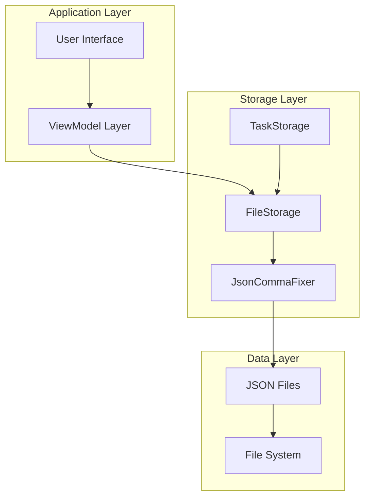
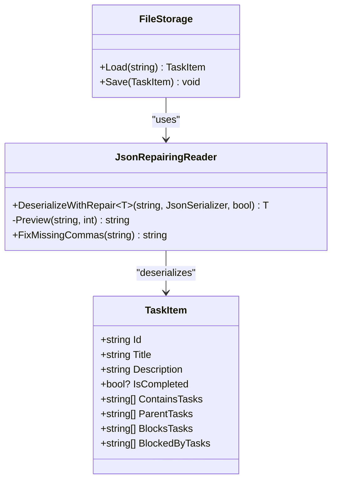
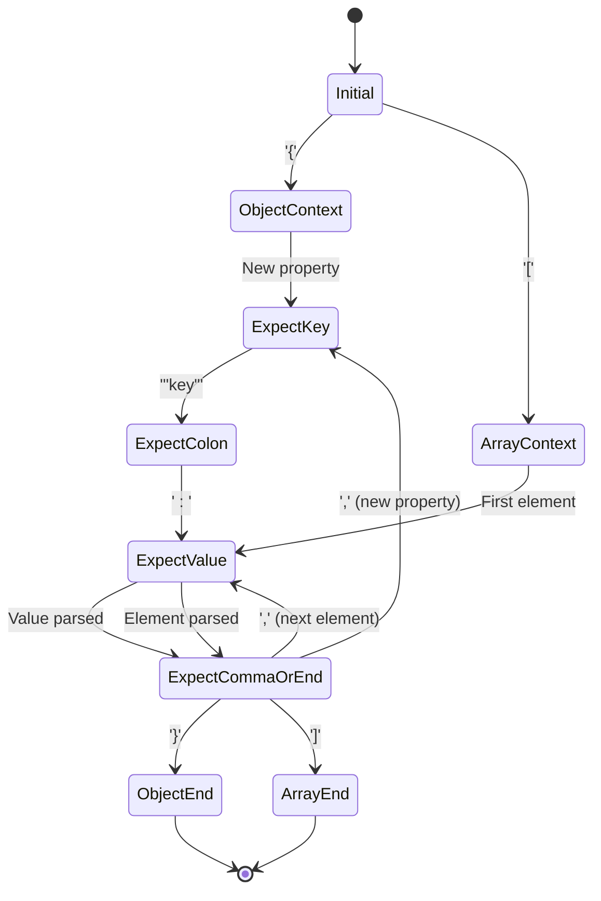
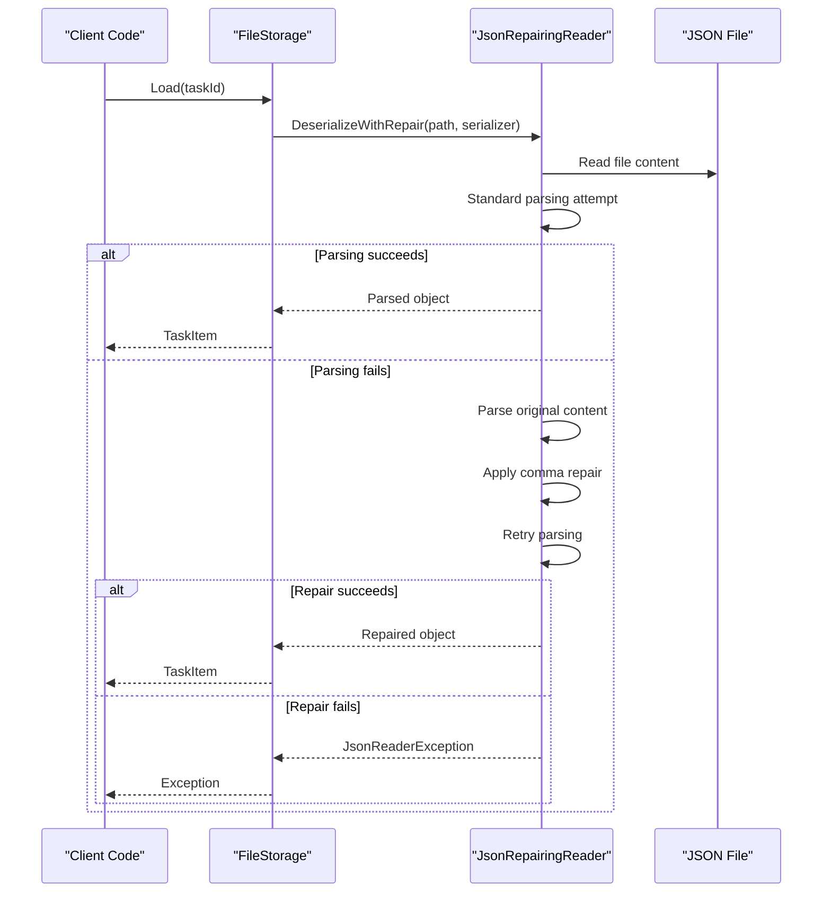
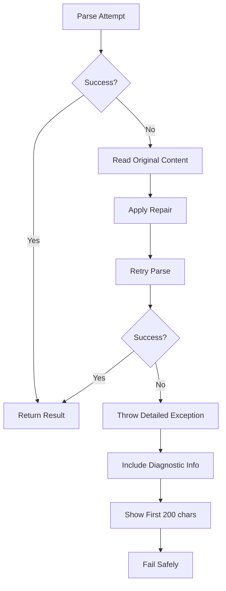

# Json Comma Fixer

<cite>
**Referenced Files in This Document**
- [JsonCommaFixer.cs](file://src/Unlimotion/JsonCommaFixer.cs)
- [JsonRepairingReaderTests.cs](file://src/Unlimotion.Test/JsonRepairingReaderTests.cs)
- [FileStorage.cs](file://src/Unlimotion/FileStorage.cs)
- [TaskItem.cs](file://src/Unlimotion.Domain/TaskItem.cs)
- [README.md](file://README.md)
</cite>

## Table of Contents
1. [Introduction](#introduction)
2. [System Architecture](#system-architecture)
3. [Core Components](#core-components)
4. [JSON Repair Algorithm](#json-repair-algorithm)
5. [Usage Patterns](#usage-patterns)
6. [Testing and Validation](#testing-and-validation)
7. [Performance Considerations](#performance-considerations)
8. [Error Handling](#error-handling)
9. [Integration Examples](#integration-examples)
10. [Troubleshooting Guide](#troubleshooting-guide)

## Introduction

The Json Comma Fixer is a sophisticated JSON parser enhancement component within the Unlimotion task management system. It provides automatic correction of missing commas in JSON files, enabling robust file-based task storage with graceful error recovery. This component addresses the common issue of malformed JSON files that can occur during manual editing or interrupted file operations.

The JsonCommaFixer operates as a safety net for the task storage system, ensuring that corrupted JSON files don't cause application failures. It implements a two-phase approach: initial standard parsing followed by intelligent comma insertion when parsing fails, preserving data integrity while maintaining backward compatibility.

## System Architecture

The Json Comma Fixer integrates seamlessly into the Unlimotion architecture as a utility component within the FileStorage subsystem. It operates independently of the main business logic while providing critical infrastructure support for data persistence.



**Diagram sources**
- [FileStorage.cs](file://src/Unlimotion/FileStorage.cs#L120-L130)
- [JsonCommaFixer.cs](file://src/Unlimotion/JsonCommaFixer.cs#L14-L47)

**Section sources**
- [FileStorage.cs](file://src/Unlimotion/FileStorage.cs#L120-L130)
- [JsonCommaFixer.cs](file://src/Unlimotion/JsonCommaFixer.cs#L1-L60)

## Core Components

### JsonRepairingReader Class

The JsonRepairingReader serves as the primary interface for JSON repair operations. It encapsulates the two-phase parsing strategy and provides a clean API for JSON deserialization with automatic error recovery.



**Diagram sources**
- [JsonCommaFixer.cs](file://src/Unlimotion/JsonCommaFixer.cs#L9-L60)
- [TaskItem.cs](file://src/Unlimotion.Domain/TaskItem.cs#L6-L32)
- [FileStorage.cs](file://src/Unlimotion/FileStorage.cs#L120-L130)

### State Management Structure

The repair algorithm utilizes a sophisticated state machine to track JSON structure context during parsing:



**Diagram sources**
- [JsonCommaFixer.cs](file://src/Unlimotion/JsonCommaFixer.cs#L62-L64)

**Section sources**
- [JsonCommaFixer.cs](file://src/Unlimotion/JsonCommaFixer.cs#L62-L64)

## JSON Repair Algorithm

### Two-Phase Parsing Strategy

The JsonCommaFixer implements a robust two-phase parsing approach designed to handle malformed JSON gracefully:

1. **Standard Parsing Phase**: Attempts to parse JSON using standard streaming methods
2. **Repair Phase**: Automatically inserts missing commas when parsing fails

### Comma Insertion Logic

The repair algorithm employs context-aware comma insertion based on JSON structure analysis:

```mermaid
flowchart TD
Start([Input Character]) --> CheckString{"In String?"}
CheckString --> |Yes| HandleString[Handle String Logic]
CheckString --> |No| CheckWhitespace{"Whitespace?"}
CheckWhitespace --> |Yes| Skip[Skip Character]
CheckWhitespace --> |No| CheckQuote{"Quote?"}
CheckQuote --> |Yes| StartString[Start String Mode]
CheckQuote --> |No| CheckBracket{"Bracket/Brace?"}
CheckBracket --> |{ or [| PushContext[Push Context to Stack]
CheckBracket --> |} or ]| PopContext[Pop Context from Stack]
CheckBracket --> |:| SetExpectValue[Set Expect Value State]
CheckBracket --> |,| SetExpectKey[Set Expect Key State]
CheckBracket --> |Other| CheckValueEnd[Check Value End]
CheckValueEnd --> CheckArray{"In Array?"}
CheckArray --> |Yes| CheckNextValue[Check Next Value Start]
CheckArray --> |No| CheckObject[Check Object Context]
CheckNextValue --> InsertComma[Insert Comma]
CheckObject --> CheckNewKey[Check New Key]
CheckNewKey --> InsertCommaBeforeKey[Insert Comma Before Key]
HandleString --> CheckEscape{"Escape Char?"}
CheckEscape --> |Yes| ContinueString[Continue String]
CheckEscape --> |No| EndString[End String Mode]
PushContext --> Continue
PopContext --> Continue
SetExpectValue --> Continue
SetExpectKey --> Continue
InsertComma --> Continue
InsertCommaBeforeKey --> Continue
EndString --> Continue
Skip --> Continue
StartString --> Continue
Continue --> End([Continue Processing])
```

**Diagram sources**
- [JsonCommaFixer.cs](file://src/Unlimotion/JsonCommaFixer.cs#L124-L240)

### Context Tracking System

The algorithm maintains precise context awareness through a stack-based state management system:

| Context Type | State | Purpose |
|--------------|-------|---------|
| Object Context | ExpectKey, ExpectColon, ExpectValue, ExpectCommaOrEnd | Track property key-value pairs |
| Array Context | ExpectValue, ExpectCommaOrEnd | Track array elements |
| String Context | Active | Handle quoted strings with escape sequences |
| Escape Context | Active | Process escaped characters within strings |

**Section sources**
- [JsonCommaFixer.cs](file://src/Unlimotion/JsonCommaFixer.cs#L62-L64)
- [JsonCommaFixer.cs](file://src/Unlimotion/JsonCommaFixer.cs#L124-L240)

## Usage Patterns

### Basic Deserialization with Repair

The primary usage pattern involves safe JSON deserialization with automatic repair capabilities:

```csharp
// Usage example pattern (not actual code)
var jsonSerializer = new JsonSerializer();
var taskItem = JsonRepairingReader.DeserializeWithRepair<TaskItem>(
    "path/to/task.json", 
    jsonSerializer, 
    saveRepairedSidecar: false
);
```

### File Storage Integration

The JsonCommaFixer integrates seamlessly with the FileStorage system for robust task persistence:



**Diagram sources**
- [FileStorage.cs](file://src/Unlimotion/FileStorage.cs#L120-L130)
- [JsonCommaFixer.cs](file://src/Unlimotion/JsonCommaFixer.cs#L14-L47)

**Section sources**
- [FileStorage.cs](file://src/Unlimotion/FileStorage.cs#L120-L130)
- [JsonCommaFixer.cs](file://src/Unlimotion/JsonCommaFixer.cs#L14-L47)

## Testing and Validation

### Comprehensive Test Suite

The JsonCommaFixer includes extensive unit tests covering various JSON corruption scenarios:

| Test Category | Coverage | Examples |
|---------------|----------|----------|
| Basic Object Repair | Property omission | `{ "id": "1" "title": "Task" }` |
| Nested Array Repair | Element omission | `[ "item1", "item2" "item3" ]` |
| Mixed Structure Repair | Complex nesting | Objects containing arrays with missing commas |
| Edge Case Handling | Boundary conditions | Empty structures, escape sequences, comments |

### Test Validation Patterns

The test suite validates the repair algorithm's ability to handle real-world JSON corruption scenarios commonly encountered in manual editing situations.

**Section sources**
- [JsonRepairingReaderTests.cs](file://src/Unlimotion.Test/JsonRepairingReaderTests.cs#L1-L119)

## Performance Considerations

### Memory Efficiency

The JsonCommaFixer optimizes memory usage through careful StringBuilder allocation and minimal temporary object creation:

- **Initial Capacity**: Allocates capacity based on input size plus buffer for repairs
- **Streaming Processing**: Processes JSON character-by-character without loading entire files
- **Stack Management**: Uses efficient stack operations for context tracking

### Processing Complexity

| Operation | Time Complexity | Space Complexity | Notes |
|-----------|----------------|------------------|-------|
| Standard Parsing | O(n) | O(1) | Native JSON.NET performance |
| Repair Analysis | O(n) | O(d) | d = nesting depth, worst case O(n) |
| String Reconstruction | O(n) | O(n) | StringBuilder growth strategy |

Where n is the input length and d is the maximum nesting depth.

## Error Handling

### Graceful Degradation

The JsonCommaFixer implements comprehensive error handling with meaningful diagnostic information:



**Diagram sources**
- [JsonCommaFixer.cs](file://src/Unlimotion/JsonCommaFixer.cs#L48-L55)

### Exception Information

When repair attempts fail, the system provides detailed diagnostic information including:
- Original file path
- First 200 characters of repaired content
- Context information for debugging

**Section sources**
- [JsonCommaFixer.cs](file://src/Unlimotion/JsonCommaFixer.cs#L48-L55)

## Integration Examples

### Task Storage Integration

The JsonCommaFixer integrates with the TaskItem domain model for robust task persistence:

```csharp
// Integration pattern (conceptual)
public class TaskStorage : ITaskStorage
{
    public TaskItem LoadTask(string taskId)
    {
        var fullPath = Path.Combine(_storagePath, taskId);
        var jsonSerializer = new JsonSerializer();
        
        return JsonRepairingReader.DeserializeWithRepair<TaskItem>(
            fullPath, 
            jsonSerializer, 
            saveRepairedSidecar: false
        );
    }
}
```

### Sidecar Backup Feature

The system supports optional backup of repaired files for debugging and recovery purposes:

```csharp
// Sidecar backup configuration
var result = JsonRepairingReader.DeserializeWithRepair<TaskItem>(
    fullPath, 
    jsonSerializer, 
    saveRepairedSidecar: true  // Creates .repaired.json backup
);
```

**Section sources**
- [FileStorage.cs](file://src/Unlimotion/FileStorage.cs#L120-L130)
- [JsonCommaFixer.cs](file://src/Unlimotion/JsonCommaFixer.cs#L40-L44)

## Troubleshooting Guide

### Common Issues and Solutions

| Issue | Symptoms | Solution |
|-------|----------|----------|
| Infinite Loop | Parser hangs on complex structures | Review context stack management |
| Incorrect Repairs | Malformed JSON after repair | Verify comma insertion logic |
| Memory Issues | High memory usage with large files | Monitor StringBuilder growth |
| False Positives | Valid JSON incorrectly repaired | Enhance parsing context validation |

### Debugging Strategies

1. **Enable Sidecar Logging**: Set `saveRepairedSidecar = true` to preserve repaired files
2. **Review Diagnostic Messages**: Examine exception messages for parsing clues
3. **Test with Minimal Examples**: Isolate problematic JSON structures
4. **Monitor Context Stack**: Ensure proper push/pop operations

### Performance Optimization

- **File Size Limits**: Consider processing limits for extremely large JSON files
- **Context Depth**: Monitor stack depth for deeply nested structures
- **Memory Monitoring**: Track StringBuilder growth patterns

**Section sources**
- [JsonCommaFixer.cs](file://src/Unlimotion/JsonCommaFixer.cs#L40-L44)
- [JsonCommaFixer.cs](file://src/Unlimotion/JsonCommaFixer.cs#L48-L55)