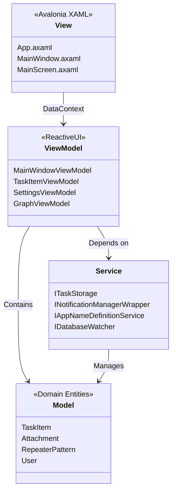
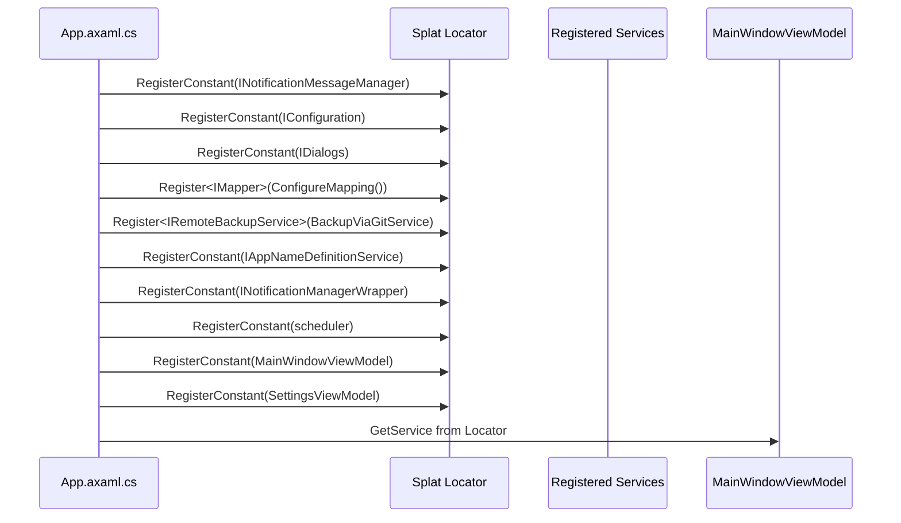
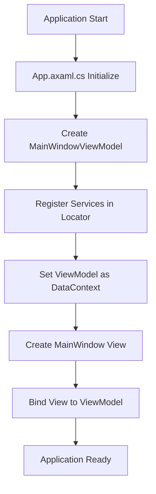
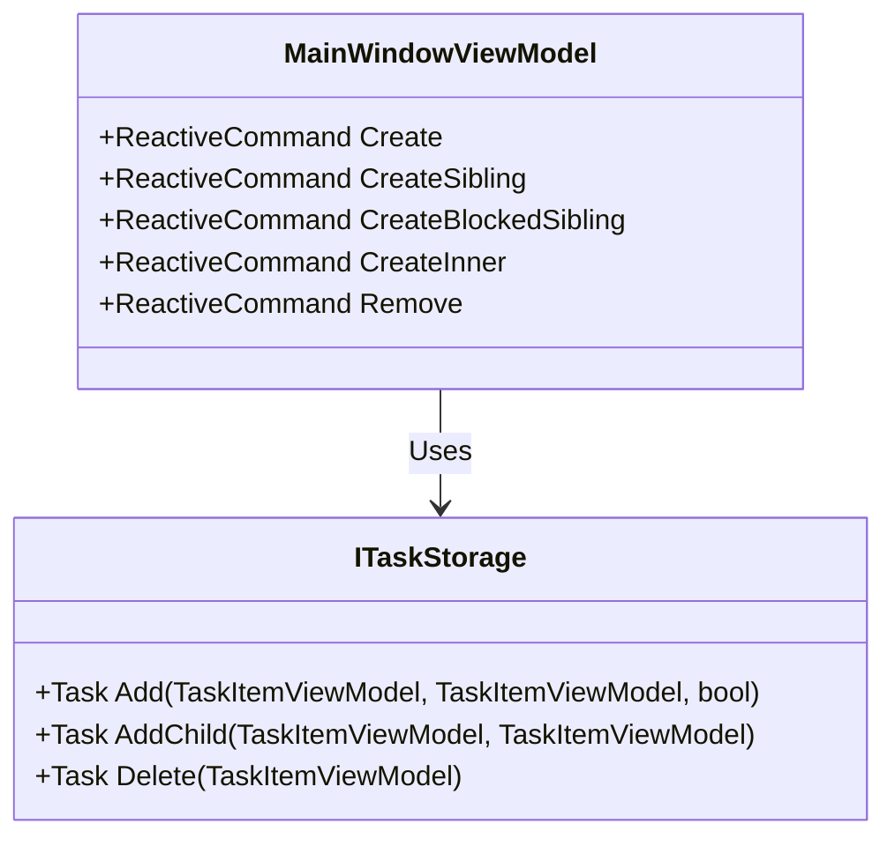
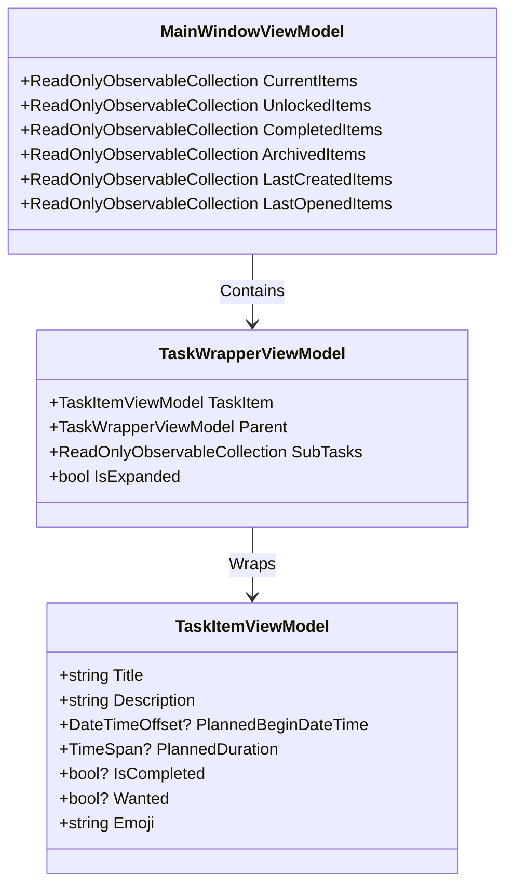

# MVVM Implementation

<cite>
**Referenced Files in This Document**   
- [App.axaml.cs](file://src/Unlimotion/App.axaml.cs)
- [MainWindowViewModel.cs](file://src/Unlimotion.ViewModel/MainWindowViewModel.cs)
- [TaskItemViewModel.cs](file://src/Unlimotion.ViewModel/TaskItemViewModel.cs)
- [App.axaml](file://src/Unlimotion/App.axaml)
- [MainWindow.axaml](file://src/Unlimotion/Views/MainWindow.axaml)
- [ViewLocator.cs](file://src/Unlimotion/ViewLocator.cs)
- [ITaskStorage.cs](file://src/Unlimotion.ViewModel/ITaskStorage.cs)
- [INotificationManagerWrapper.cs](file://src/Unlimotion.ViewModel/INotificationManagerWrapper.cs)
- [SettingsViewModel.cs](file://src/Unlimotion.ViewModel/SettingsViewModel.cs)
- [GraphViewModel.cs](file://src/Unlimotion.ViewModel/GraphViewModel.cs)
- [TaskWrapperViewModel.cs](file://src/Unlimotion.ViewModel/TaskWrapperViewModel.cs)
- [FileTaskStorage.cs](file://src/Unlimotion/FileTaskStorage.cs)
- [AppModelMapping.cs](file://src/Unlimotion/AppModelMapping.cs)
</cite>

## Table of Contents
1. [MVVM Architecture Overview](#mvvm-architecture-overview)
2. [Component Separation](#component-separation)
3. [Service Registration and Dependency Injection](#service-registration-and-dependency-injection)
4. [ViewModel-First Approach](#viewmodel-first-approach)
5. [ReactiveUI Implementation](#reactiveui-implementation)
6. [Command Implementation](#command-implementation)
7. [Task Collection Management](#task-collection-management)
8. [Extending the MVVM Structure](#extending-the-mvvm-structure)

## MVVM Architecture Overview

The Unlimotion application implements a clean MVVM (Model-View-ViewModel) architecture using Avalonia UI framework and ReactiveUI. This pattern provides a clear separation of concerns between the user interface (View), business logic (ViewModel), and domain data (Model). The architecture follows the ViewModel-first approach where ViewModels are created and managed independently of Views, allowing for better testability and separation of concerns.



**Diagram sources**
- [App.axaml](file://src/Unlimotion/App.axaml)
- [MainWindow.axaml](file://src/Unlimotion/Views/MainWindow.axaml)
- [MainWindowViewModel.cs](file://src/Unlimotion.ViewModel/MainWindowViewModel.cs)
- [TaskItemViewModel.cs](file://src/Unlimotion.ViewModel/TaskItemViewModel.cs)
- [ITaskStorage.cs](file://src/Unlimotion.ViewModel/ITaskStorage.cs)

**Section sources**
- [App.axaml.cs](file://src/Unlimotion/App.axaml.cs#L1-L232)
- [MainWindowViewModel.cs](file://src/Unlimotion.ViewModel/MainWindowViewModel.cs#L1-L1076)

## Component Separation

The MVVM pattern in Unlimotion clearly separates responsibilities across three main components:

### Views (Avalonia XAML files)
The Views are implemented as Avalonia XAML files that define the user interface structure and layout. The main View components include:
- App.axaml: Application-level resources and styles
- MainWindow.axaml: Main application window with title binding
- MainScreen.axaml: Primary content area of the application
- SettingsControl.axaml: Settings interface
- GraphControl.axaml: Visual graph representation

The Views follow Avalonia's data binding conventions, using the DataContext property to connect to their corresponding ViewModels. The ViewLocator class automatically resolves View-ViewModel pairs by convention, replacing "ViewModel" with "View" in type names.

### ViewModels (ReactiveUI classes)
The ViewModels implement the ReactiveUI framework and contain the application's presentation logic. Key ViewModel classes include:
- MainWindowViewModel: Central ViewModel managing application state
- TaskItemViewModel: Represents individual tasks with business logic
- SettingsViewModel: Manages application settings
- GraphViewModel: Handles graph visualization logic
- TaskWrapperViewModel: Wraps tasks for hierarchical display

ViewModels implement the INotifyPropertyChanged interface (via Fody.PropertyChanged) to enable data binding and property change notifications.

### Models (domain entities)
The Models represent the application's domain entities and are defined in the Unlimotion.Domain project:
- TaskItem: Core entity representing tasks with properties like Title, Description, PlannedDuration
- Attachment: Represents file attachments to tasks
- RepeaterPattern: Defines repeating task patterns
- User: Represents user entities

These domain models are independent of the UI framework and contain only business data without presentation logic.

**Section sources**
- [App.axaml](file://src/Unlimotion/App.axaml#L1-L72)
- [MainWindow.axaml](file://src/Unlimotion/Views/MainWindow.axaml#L1-L17)
- [MainWindowViewModel.cs](file://src/Unlimotion.ViewModel/MainWindowViewModel.cs#L1-L1076)
- [TaskItemViewModel.cs](file://src/Unlimotion.ViewModel/TaskItemViewModel.cs#L1-L666)
- [AppModelMapping.cs](file://src/Unlimotion/AppModelMapping.cs#L1-L39)

## Service Registration and Dependency Injection

The application uses Splat's Locator.CurrentMutable for service registration and dependency injection, configured in the App.axaml.cs file. This approach enables loose coupling between components and facilitates testing.



**Diagram sources**
- [App.axaml.cs](file://src/Unlimotion/App.axaml.cs#L1-L232)
- [MainWindowViewModel.cs](file://src/Unlimotion.ViewModel/MainWindowViewModel.cs#L1-L1076)

**Section sources**
- [App.axaml.cs](file://src/Unlimotion/App.axaml.cs#L1-L232)
- [MainWindowViewModel.cs](file://src/Unlimotion.ViewModel/MainWindowViewModel.cs#L1-L1076)

The App class registers several key services:

1. **INotificationMessageManager**: For displaying toast notifications in the UI
2. **IConfiguration**: Application configuration from JSON files
3. **IDialogs**: Dialog service for user interactions
4. **IMapper**: AutoMapper instance for object mapping (configured in AppModelMapping.cs)
5. **IRemoteBackupService**: Backup service using Git
6. **IAppNameDefinitionService**: Service for retrieving the application name
7. **INotificationManagerWrapper**: Wrapper for notification functionality
8. **IScheduler**: Quartz scheduler for background jobs
9. **MainWindowViewModel**: Main application ViewModel
10. **SettingsViewModel**: Settings management ViewModel

The Init method in App.axaml.cs handles the registration of these services, making them available throughout the application via Locator.Current.GetService<T>().

## ViewModel-First Approach

Unlimotion implements a ViewModel-first approach, where the MainWindowViewModel is instantiated in App.axaml.cs before the View is created. This pattern provides several advantages:

1. **Decoupling**: ViewModels can be created and tested independently of Views
2. **Lifecycle Management**: ViewModel lifecycle is managed separately from UI lifecycle
3. **Dependency Resolution**: All dependencies are resolved before the View is created
4. **State Preservation**: ViewModel state persists across View recreations

The implementation follows this sequence:



**Diagram sources**
- [App.axaml.cs](file://src/Unlimotion/App.axaml.cs#L1-L232)
- [MainWindow.axaml](file://src/Unlimotion/Views/MainWindow.axaml#L1-L17)

**Section sources**
- [App.axaml.cs](file://src/Unlimotion/App.axaml.cs#L1-L232)
- [MainWindow.axaml](file://src/Unlimotion/Views/MainWindow.axaml#L1-L17)

In App.axaml.cs, the GetMainWindowViewModel method creates the MainWindowViewModel instance and registers it with Splat's locator:

```csharp
private MainWindowViewModel GetMainWindowViewModel()
{
    var notificationMessageManager = new NotificationMessageManager();
    Locator.CurrentMutable.RegisterConstant<INotificationMessageManager>(notificationMessageManager);
    RxApp.DefaultExceptionHandler = new ObservableExceptionHandler();
    return new MainWindowViewModel
    {
        ToastNotificationManager = notificationMessageManager
    };
}
```

This approach ensures that the ViewModel is fully initialized with all its dependencies before being assigned as the DataContext of the MainWindow View.

## ReactiveUI Implementation

The application extensively uses ReactiveUI for reactive programming patterns, enabling responsive and maintainable code. Key ReactiveUI features implemented include:

### WhenAnyValue for Property Binding
The WhenAnyValue method creates observable streams from property changes, allowing automatic configuration persistence:

```csharp
this.WhenAnyValue(m => m.ShowCompleted)
    .Subscribe(b => _configuration?.GetSection("AllTasks:ShowCompleted").Set(b))
    .AddToDispose(this);
```

This pattern is used throughout MainWindowViewModel to automatically save user preferences to the configuration when they change.

### Reactive Commands
Commands are implemented as ReactiveCommand instances, providing built-in support for asynchronous operations, error handling, and execution state management:

```csharp
Create = ReactiveCommand.CreateFromTask(async () =>
{
    var task = new TaskItemViewModel(new TaskItem(), taskRepository);
    await taskRepository?.Add(task);
    CurrentTaskItem = task;
    SelectCurrentTask();
}).AddToDisposeAndReturn(connectionDisposableList);
```

### Observable Collections with DynamicData
The application uses DynamicData's observable collections to manage task collections with automatic filtering, sorting, and binding:

```csharp
taskRepository.Tasks
    .Connect()
    .Filter(taskFilter)
    .Sort(sortObservable)
    .Bind(out _currentItems)
    .Subscribe()
    .AddToDispose(connectionDisposableList);
```

This creates a reactive pipeline that automatically updates the CurrentItems collection when tasks are added, removed, or modified.

**Section sources**
- [MainWindowViewModel.cs](file://src/Unlimotion.ViewModel/MainWindowViewModel.cs#L1-L1076)
- [TaskItemViewModel.cs](file://src/Unlimotion.ViewModel/TaskItemViewModel.cs#L1-L666)

## Command Implementation

The MainWindowViewModel implements several ReactiveCommand instances for task management operations. These commands interact with the ITaskStorage implementation (typically FileTaskStorage) to persist changes.

### Create Commands
The application implements three distinct creation commands for different task relationships:



**Diagram sources**
- [MainWindowViewModel.cs](file://src/Unlimotion.ViewModel/MainWindowViewModel.cs#L1-L1076)
- [ITaskStorage.cs](file://src/Unlimotion.ViewModel/ITaskStorage.cs#L1-L32)

**Section sources**
- [MainWindowViewModel.cs](file://src/Unlimotion.ViewModel/MainWindowViewModel.cs#L1-L1076)

#### Create Command
Creates a new task at the root level:
```csharp
Create = ReactiveCommand.CreateFromTask(async () =>
{
    var task = new TaskItemViewModel(new TaskItem(), taskRepository);
    await taskRepository?.Add(task);
    CurrentTaskItem = task;
    SelectCurrentTask();
});
```

#### CreateSibling Command
Creates a sibling task to the currently selected task:
```csharp
CreateSibling = ReactiveCommand.CreateFromTask(async (bool isBlocked = false) =>
{
    if (CurrentTaskItem != null && string.IsNullOrWhiteSpace(CurrentTaskItem.Title))
        return;

    var task = new TaskItemViewModel(new TaskItem(), taskRepository);

    if (CurrentTaskItem != null)
    {
        if (AllTasksMode)
        {
            await taskRepository?.Add(task, CurrentTaskItem, isBlocked);
        }
    }

    CurrentTaskItem = task;
    SelectCurrentTask();
});
```

#### CreateBlockedSibling Command
Creates a sibling task that blocks the currently selected task:
```csharp
CreateBlockedSibling = ReactiveCommand.CreateFromTask(async () =>
{
    var parent = CurrentTaskItem;
    if (CurrentTaskItem != null)
    {
        CreateSibling.Execute(true);
    }
});
```

#### CreateInner Command
Creates a child task within the currently selected task:
```csharp
CreateInner = ReactiveCommand.CreateFromTask(async () =>
{
    if (CurrentTaskItem == null)
        return;
    if (string.IsNullOrWhiteSpace(CurrentTaskItem.Title))
        return;

    var parent = CurrentTaskItem;
    var task = new TaskItemViewModel(new TaskItem(), taskRepository);

    await taskRepository?.AddChild(task, parent);

    CurrentTaskItem = task;
    SelectCurrentTask();

    var wrapper = FindTaskWrapperViewModel(parent, CurrentItems);
    if (wrapper != null)
    {
        wrapper.IsExpanded = true;
        var p = wrapper.Parent;
        while (p != null)
        {
            p.IsExpanded = true;
            p = p.Parent;
        }
    }
});
```

#### Remove Command
Removes the currently selected task:
```csharp
Remove = ReactiveCommand.CreateFromTask(async () => await RemoveTaskItem(CurrentTaskItem));
```

Each command is properly disposed of using the DisposableList pattern to prevent memory leaks.

## Task Collection Management

The ViewModel manages multiple task collections using DynamicData's observable collections, which provide reactive filtering, sorting, and binding capabilities.

### Multiple Task Collections
The MainWindowViewModel maintains several collections for different task views:



**Diagram sources**
- [MainWindowViewModel.cs](file://src/Unlimotion.ViewModel/MainWindowViewModel.cs#L1-L1076)
- [TaskWrapperViewModel.cs](file://src/Unlimotion.ViewModel/TaskWrapperViewModel.cs#L1-L124)
- [TaskItemViewModel.cs](file://src/Unlimotion.ViewModel/TaskItemViewModel.cs#L1-L666)

**Section sources**
- [MainWindowViewModel.cs](file://src/Unlimotion.ViewModel/MainWindowViewModel.cs#L1-L1076)

### Collection Implementation
Each collection is created using a reactive pipeline that connects to the ITaskStorage.Tasks source cache:

```csharp
taskRepository.Tasks
    .Connect()
    .AutoRefreshOnObservable(m => m.WhenAny(
        m => m.IsCanBeCompleted,
        m => m.IsCompleted,
        m => m.UnlockedDateTime))
    .Filter(unlockedTimeFilter)
    .Filter(durationFilter)
    .Filter(emojiFilter)
    .Filter(emojiExcludeFilter)
    .Filter(wantedFilter)
    .Transform(item =>
    {
        var actions = new TaskWrapperActions()
        {
            ChildSelector = m => m.ContainsTasks.ToObservableChangeSet(),
            RemoveAction = RemoveTask,
            GetBreadScrumbs = BredScrumbsAlgorithms.FirstTaskParent,
        };
        var wrapper = new TaskWrapperViewModel(null, item, actions);
        return wrapper;
    })
    .Sort(sortObservableForUnlocked)
    .Bind(out _unlockedItems)
    .Subscribe()
    .AddToDispose(connectionDisposableList);
```

### Filtering Mechanism
The application implements a sophisticated filtering system based on user preferences:

1. **Configuration-based filters**: ShowCompleted, ShowArchived, ShowWanted
2. **Emoji filters**: Tasks can be filtered by emoji tags
3. **Date filters**: Completed, archived, and last created tasks can be filtered by date ranges
4. **Duration filters**: Tasks can be filtered by planned duration
5. **Unlocked time filters**: Tasks can be filtered by availability

The filters are implemented as observable streams that automatically update when user preferences change, ensuring the UI stays in sync with the current configuration.

## Extending the MVVM Structure

To extend the MVVM structure with new commands or views, follow these patterns established in the codebase:

### Adding New Commands
1. Define the command as a ReactiveCommand in the appropriate ViewModel
2. Implement the command logic using async/await for I/O operations
3. Register the command in the RegisterCommands method
4. Ensure proper disposal using AddToDisposeAndReturn
5. Connect the command to the View via data binding

Example pattern:
```csharp
NewCommand = ReactiveCommand.CreateFromTask(async () =>
{
    // Command logic here
    await SomeService.DoSomething();
}, canExecuteObservable)
.AddToDisposeAndReturn(connectionDisposableList);
```

### Adding New Views
1. Create a new XAML file in the Views directory following the naming convention
2. Set the x:DataType attribute to the corresponding ViewModel type
3. Use data binding to connect UI elements to ViewModel properties
4. Ensure the ViewLocator can resolve the View-ViewModel pair
5. If needed, register the ViewModel with Splat's locator

### Adding New Services
1. Define the service interface in the appropriate project
2. Implement the service class
3. Register the service in App.axaml.cs using Locator.CurrentMutable
4. Inject the service into ViewModels using Locator.Current.GetService<T>()
5. Consider lifetime management (constant vs. factory registration)

The existing architecture provides a solid foundation for extension while maintaining the clear separation of concerns that is central to the MVVM pattern.

**Section sources**
- [App.axaml.cs](file://src/Unlimotion/App.axaml.cs#L1-L232)
- [MainWindowViewModel.cs](file://src/Unlimotion.ViewModel/MainWindowViewModel.cs#L1-L1076)
- [ViewLocator.cs](file://src/Unlimotion/ViewLocator.cs#L1-L30)