# Reactive Programming Model

<cite>
**Referenced Files in This Document**
- [MainWindowViewModel.cs](file://src/Unlimotion.ViewModel/MainWindowViewModel.cs)
- [TaskItemViewModel.cs](file://src/Unlimotion.ViewModel/TaskItemViewModel.cs)
- [TaskWrapperViewModel.cs](file://src/Unlimotion.ViewModel/TaskWrapperViewModel.cs)
- [DisposableList.cs](file://src/Unlimotion.ViewModel/DisposableList.cs)
- [DisposableListExtensions.cs](file://src/Unlimotion.ViewModel/DisposableListExtensions.cs)
- [UnlockedTimeFilter.cs](file://src/Unlimotion.ViewModel/UnlockedTimeFilter.cs)
- [DurationFilter.cs](file://src/Unlimotion.ViewModel/DurationFilter.cs)
- [SortDefinition.cs](file://src/Unlimotion.ViewModel/SortDefinition.cs)
- [SettingsViewModel.cs](file://src/Unlimotion.ViewModel/SettingsViewModel.cs)
- [TaskStorageExtensions.cs](file://src/Unlimotion/TaskStorageExtensions.cs)
</cite>

## Table of Contents
1. [Introduction](#introduction)
2. [Architecture Overview](#architecture-overview)
3. [Core Reactive Patterns](#core-reactive-patterns)
4. [WhenAnyValue Property Change Detection](#whenanyvalue-property-change-detection)
5. [DynamicData Observable Streams](#dynamicdata-observable-streams)
6. [Reactive Filtering and Transformation](#reactive-filtering-and-transformation)
7. [Subscription Lifecycle Management](#subscription-lifecycle-management)
8. [Performance Optimizations](#performance-optimizations)
9. [Configuration Persistence](#configuration-persistence)
10. [Advanced Reactive Patterns](#advanced-reactive-patterns)
11. [Troubleshooting and Best Practices](#troubleshooting-and-best-practices)

## Introduction

Unlimotion implements a sophisticated reactive programming model built on ReactiveUI and DynamicData frameworks. This reactive architecture enables real-time updates, automatic synchronization, and efficient memory management throughout the application. The system demonstrates advanced reactive patterns including property change detection, observable streams, filtering, transformation, and lifecycle management.

The reactive model serves as the backbone for the task management interface, providing seamless updates to the user interface as tasks are created, modified, or deleted. It ensures that all views remain synchronized with the underlying data while maintaining optimal performance through careful subscription management and throttling mechanisms.

## Architecture Overview

The reactive programming architecture in Unlimotion follows a layered approach with clear separation of concerns:

```mermaid
graph TB
subgraph "Presentation Layer"
MWVM[MainWindowViewModel]
TWVM[TaskWrapperViewModel]
TVM[TaskItemViewModel]
end
subgraph "Reactive Infrastructure"
RU[ReactiveUI Framework]
DD[DynamicData Framework]
RX[Reactive Extensions]
end
subgraph "Data Layer"
TS[TaskStorage]
FS[File Storage]
SS[Server Storage]
end
subgraph "Configuration"
IC[IConfiguration]
CS[ClientSettings]
end
MWVM --> RU
MWVM --> DD
MWVM --> TS
TWVM --> DD
TVM --> RU
TS --> FS
TS --> SS
MWVM --> IC
MWVM --> CS
MWVM -.->|WhenAnyValue| MWVM
MWVM -.->|Connect()| MWVM
MWVM -.->|Transform| MWVM
MWVM -.->|Filter| MWVM
MWVM -.->|Sort| MWVM
```

**Diagram sources**
- [MainWindowViewModel.cs](file://src/Unlimotion.ViewModel/MainWindowViewModel.cs#L20-L50)
- [TaskWrapperViewModel.cs](file://src/Unlimotion.ViewModel/TaskWrapperViewModel.cs#L40-L80)

The architecture demonstrates several key reactive programming principles:

- **Observable Data Binding**: Properties automatically notify subscribers of changes
- **Stream Composition**: Multiple reactive streams are combined and transformed
- **Automatic Synchronization**: UI updates occur in response to data changes
- **Lifecycle Management**: Subscriptions are properly disposed to prevent memory leaks

**Section sources**
- [MainWindowViewModel.cs](file://src/Unlimotion.ViewModel/MainWindowViewModel.cs#L1-L50)
- [TaskWrapperViewModel.cs](file://src/Unlimotion.ViewModel/TaskWrapperViewModel.cs#L1-L50)

## Core Reactive Patterns

### Property Change Detection Pipeline

The reactive system employs a sophisticated property change detection mechanism that distinguishes between initialization and runtime changes:

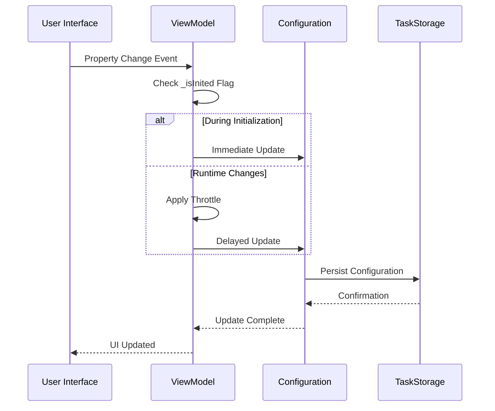

**Diagram sources**
- [MainWindowViewModel.cs](file://src/Unlimotion.ViewModel/MainWindowViewModel.cs#L38-L55)
- [TaskItemViewModel.cs](file://src/Unlimotion.ViewModel/TaskItemViewModel.cs#L203-L232)

### Observable Stream Composition

The system creates complex observable streams through composition of multiple reactive operators:

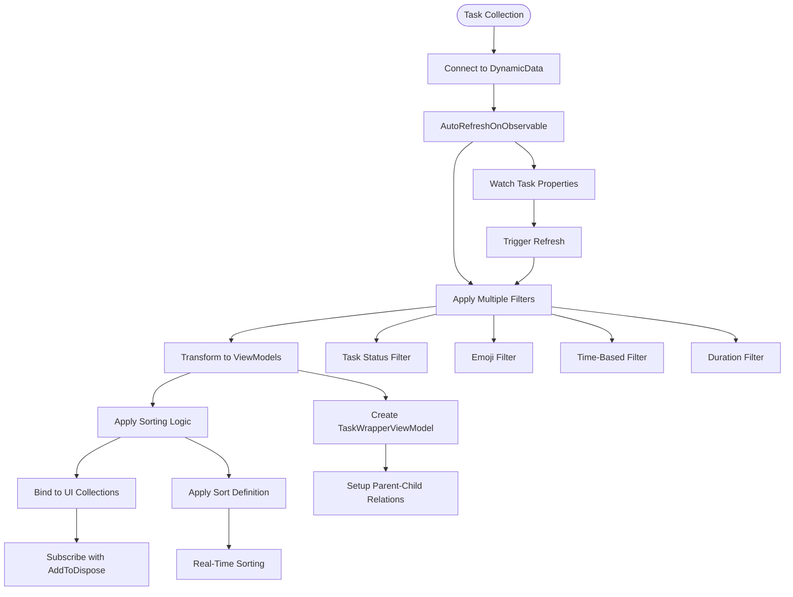

**Diagram sources**
- [MainWindowViewModel.cs](file://src/Unlimotion.ViewModel/MainWindowViewModel.cs#L130-L200)
- [MainWindowViewModel.cs](file://src/Unlimotion.ViewModel/MainWindowViewModel.cs#L480-L550)

**Section sources**
- [MainWindowViewModel.cs](file://src/Unlimotion.ViewModel/MainWindowViewModel.cs#L130-L200)
- [MainWindowViewModel.cs](file://src/Unlimotion.ViewModel/MainWindowViewModel.cs#L480-L550)

## WhenAnyValue Property Change Detection

### Configuration Persistence Implementation

The `WhenAnyValue` operator serves as the primary mechanism for observing property changes and automatically persisting configuration settings:

| Property | Configuration Path | Persistence Behavior | Throttling |
|----------|-------------------|---------------------|------------|
| ShowCompleted | AllTasks:ShowCompleted | Immediate during init, delayed runtime | No |
| ShowArchived | AllTasks:ShowArchived | Immediate during init, delayed runtime | No |
| ShowWanted | AllTasks:ShowWanted | Immediate during init, delayed runtime | No |
| CurrentSortDefinition | AllTasks:CurrentSortDefinition | Immediate during init, delayed runtime | No |
| CurrentSortDefinitionForUnlocked | AllTasks:CurrentSortDefinitionForUnlocked | Immediate during init, delayed runtime | No |

The implementation demonstrates intelligent throttling based on initialization state:

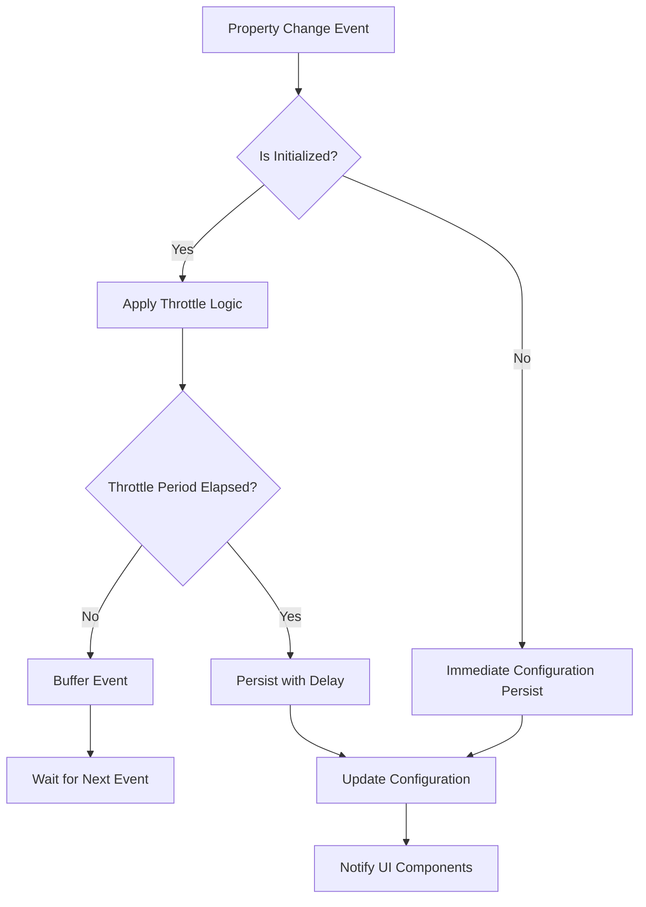

**Diagram sources**
- [MainWindowViewModel.cs](file://src/Unlimotion.ViewModel/MainWindowViewModel.cs#L38-L55)
- [TaskItemViewModel.cs](file://src/Unlimotion.ViewModel/TaskItemViewModel.cs#L203-L232)

### Reactive Command Integration

The system integrates `WhenAnyValue` with reactive commands for complex property interactions:

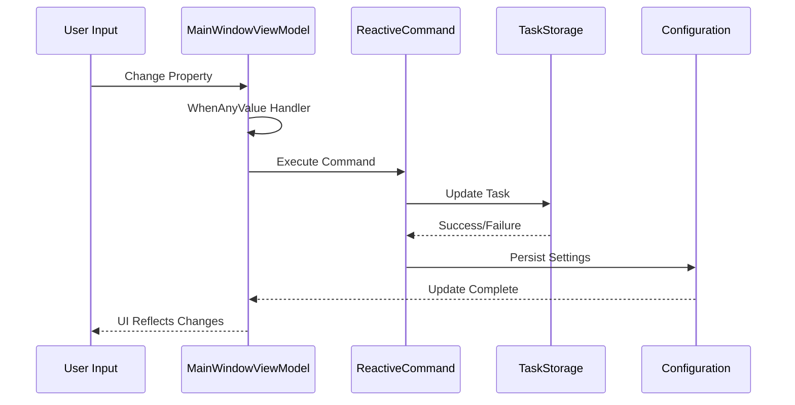

**Diagram sources**
- [MainWindowViewModel.cs](file://src/Unlimotion.ViewModel/MainWindowViewModel.cs#L200-L280)
- [TaskItemViewModel.cs](file://src/Unlimotion.ViewModel/TaskItemViewModel.cs#L45-L55)

**Section sources**
- [MainWindowViewModel.cs](file://src/Unlimotion.ViewModel/MainWindowViewModel.cs#L38-L55)
- [MainWindowViewModel.cs](file://src/Unlimotion.ViewModel/MainWindowViewModel.cs#L200-L280)

## DynamicData Observable Streams

### Connect Method Implementation

The `Connect()` method from DynamicData serves as the foundation for creating observable streams from task collections:

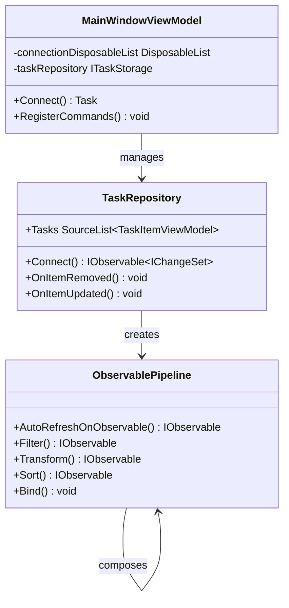

**Diagram sources**
- [MainWindowViewModel.cs](file://src/Unlimotion.ViewModel/MainWindowViewModel.cs#L130-L150)
- [TaskStorageExtensions.cs](file://src/Unlimotion/TaskStorageExtensions.cs#L8-L34)

### Automatic Refresh Mechanisms

The system employs `AutoRefreshOnObservable` to create reactive filters that respond to changes in task properties:

| AutoRefresh Trigger | Property Monitored | Refresh Condition | Use Case |
|-------------------|-------------------|------------------|----------|
| Task Status Changes | IsCompleted, IsCanBeCompleted | Status transitions | Root task filtering |
| Emoji Changes | Emoji property | Null or value changes | Emoji-based filtering |
| Parent Relationships | Parents collection | Collection modifications | Hierarchical display |
| Time Properties | PlannedBeginDateTime, PlannedEndDateTime | Time-based changes | Unlocked time filtering |
| Duration Properties | PlannedDuration | Duration modifications | Duration-based filtering |

The auto-refresh mechanism ensures that filters are recalculated whenever monitored properties change, maintaining real-time synchronization between data and UI.

**Section sources**
- [MainWindowViewModel.cs](file://src/Unlimotion.ViewModel/MainWindowViewModel.cs#L130-L150)
- [MainWindowViewModel.cs](file://src/Unlimotion.ViewModel/MainWindowViewModel.cs#L280-L320)

## Reactive Filtering and Transformation

### Transform Operator Implementation

The `Transform` operator converts `TaskItemViewModel` instances into `TaskWrapperViewModel` instances for hierarchical display:

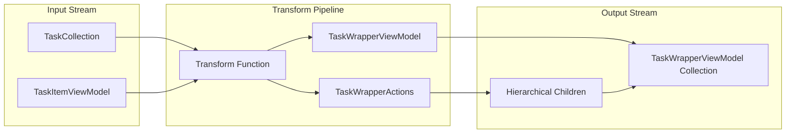

**Diagram sources**
- [MainWindowViewModel.cs](file://src/Unlimotion.ViewModel/MainWindowViewModel.cs#L480-L520)
- [TaskWrapperViewModel.cs](file://src/Unlimotion.ViewModel/TaskWrapperViewModel.cs#L80-L120)

### Sort and Bind Operators

The system maintains sorted collections in real-time using a combination of `Sort` and `Bind` operators:

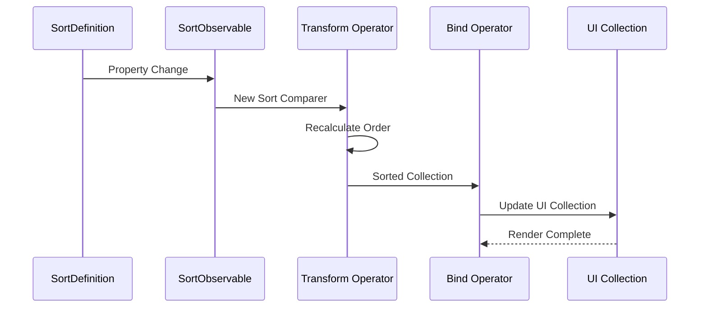

**Diagram sources**
- [MainWindowViewModel.cs](file://src/Unlimotion.ViewModel/MainWindowViewModel.cs#L130-L140)
- [SortDefinition.cs](file://src/Unlimotion.ViewModel/SortDefinition.cs#L15-L50)

### Filter Composition Strategy

The system demonstrates sophisticated filter composition for complex task filtering scenarios:

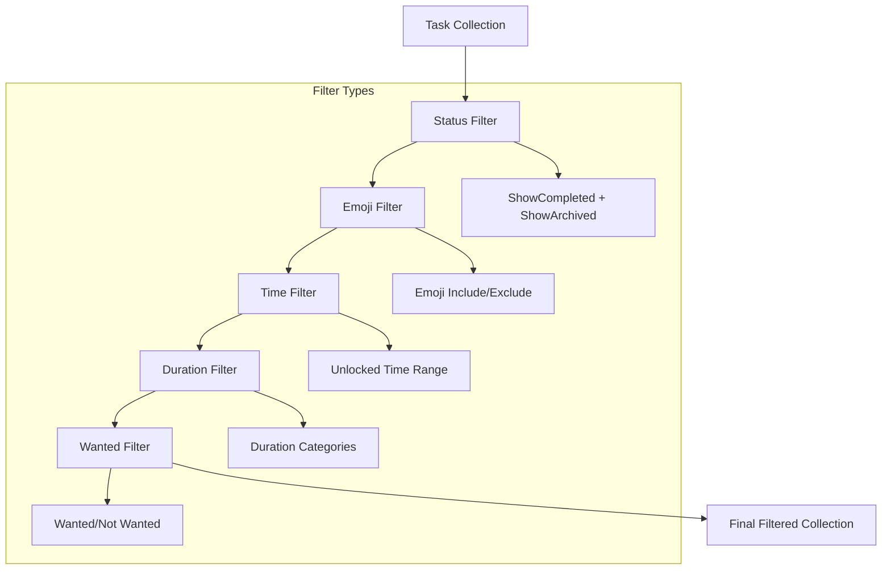

**Diagram sources**
- [MainWindowViewModel.cs](file://src/Unlimotion.ViewModel/MainWindowViewModel.cs#L140-L180)
- [MainWindowViewModel.cs](file://src/Unlimotion.ViewModel/MainWindowViewModel.cs#L320-L420)

**Section sources**
- [MainWindowViewModel.cs](file://src/Unlimotion.ViewModel/MainWindowViewModel.cs#L480-L520)
- [MainWindowViewModel.cs](file://src/Unlimotion.ViewModel/MainWindowViewModel.cs#L130-L180)

## Subscription Lifecycle Management

### DisposableList Pattern

The application implements a comprehensive subscription lifecycle management system using the `DisposableList` pattern:

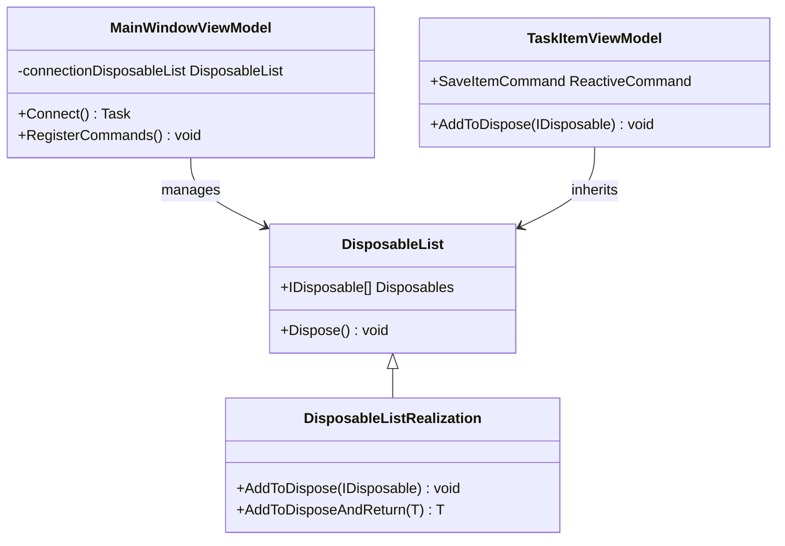

**Diagram sources**
- [DisposableList.cs](file://src/Unlimotion.ViewModel/DisposableList.cs#L5-L28)
- [DisposableListExtensions.cs](file://src/Unlimotion.ViewModel/DisposableListExtensions.cs#L4-L16)

### Subscription Management Strategy

The system employs a hierarchical subscription management approach:

| Scope | Management Strategy | Disposal Timing | Purpose |
|-------|-------------------|-----------------|---------|
| MainWindowViewModel | Global connection scope | Application shutdown | Master task collection |
| TaskItemViewModel | Individual task scope | Task deletion | Task-specific subscriptions |
| TaskWrapperViewModel | Hierarchical scope | Parent disposal | Nested task relationships |
| Filter Collections | Filter-specific scope | Filter removal | Dynamic filter collections |

### Memory Leak Prevention

The reactive programming model prevents memory leaks through several mechanisms:

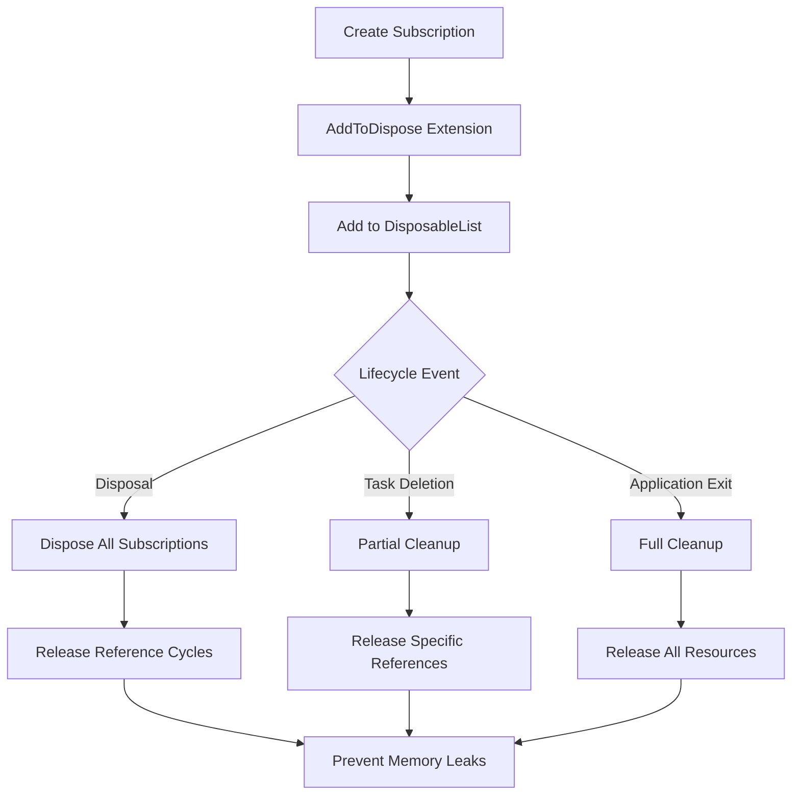

**Diagram sources**
- [DisposableList.cs](file://src/Unlimotion.ViewModel/DisposableList.cs#L10-L25)
- [MainWindowViewModel.cs](file://src/Unlimotion.ViewModel/MainWindowViewModel.cs#L130-L140)

**Section sources**
- [DisposableList.cs](file://src/Unlimotion.ViewModel/DisposableList.cs#L1-L28)
- [DisposableListExtensions.cs](file://src/Unlimotion.ViewModel/DisposableListExtensions.cs#L1-L16)
- [MainWindowViewModel.cs](file://src/Unlimotion.ViewModel/MainWindowViewModel.cs#L130-L140)

## Performance Optimizations

### Throttle Mechanisms

The reactive system implements multiple throttling strategies to optimize performance:

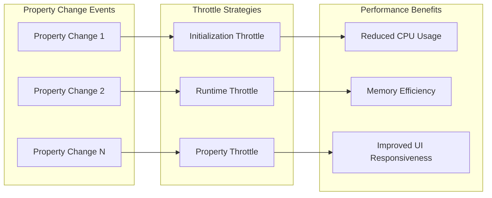

**Diagram sources**
- [TaskItemViewModel.cs](file://src/Unlimotion.ViewModel/TaskItemViewModel.cs#L203-L232)
- [MainWindowViewModel.cs](file://src/Unlimotion.ViewModel/MainWindowViewModel.cs#L38-L55)

### Throttling Configuration

| Throttle Type | Duration | Trigger Conditions | Performance Impact |
|--------------|----------|-------------------|-------------------|
| Initialization Throttle | None | During `_isInited = false` | Immediate updates for UI responsiveness |
| Runtime Throttle | 10 seconds | During `_isInited = true` | Reduced configuration persistence calls |
| Property Throttle | 2 seconds | Repeater property changes | Prevents excessive save operations |
| Event Throttle | 1 second | File system events | Reduces database update frequency |

### Reactive Stream Optimization

The system optimizes reactive streams through several techniques:

- **Selective Property Monitoring**: Only monitoring relevant property changes
- **Stream Composition**: Building complex streams from simple operators
- **Lazy Evaluation**: Creating streams only when needed
- **Resource Cleanup**: Proper disposal of unused subscriptions

**Section sources**
- [TaskItemViewModel.cs](file://src/Unlimotion.ViewModel/TaskItemViewModel.cs#L39-L71)
- [TaskItemViewModel.cs](file://src/Unlimotion.ViewModel/TaskItemViewModel.cs#L203-L232)
- [MainWindowViewModel.cs](file://src/Unlimotion.ViewModel/MainWindowViewModel.cs#L38-L55)

## Configuration Persistence

### Settings Integration

The reactive programming model seamlessly integrates with the configuration system:

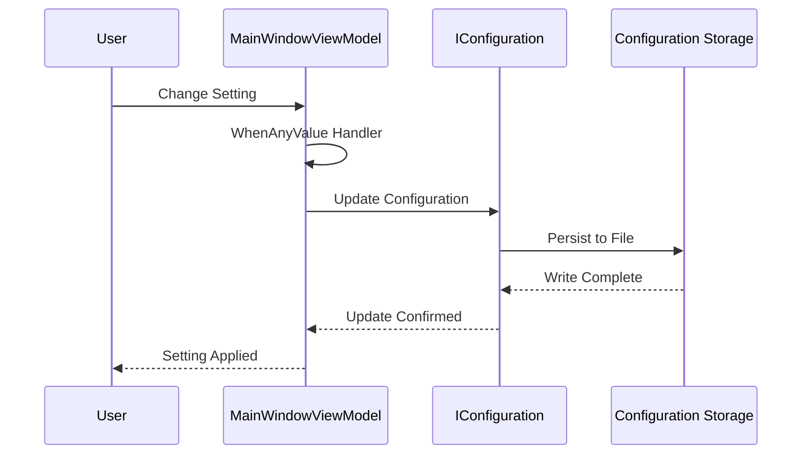

**Diagram sources**
- [MainWindowViewModel.cs](file://src/Unlimotion.ViewModel/MainWindowViewModel.cs#L38-L55)
- [SettingsViewModel.cs](file://src/Unlimotion.ViewModel/SettingsViewModel.cs#L20-L40)

### Configuration Schema

The system persists various configuration settings through the reactive framework:

| Configuration Section | Properties | Persistence Strategy | Recovery Behavior |
|----------------------|------------|---------------------|------------------|
| AllTasks | ShowCompleted, ShowArchived, ShowWanted, CurrentSortDefinition | Immediate + Throttled | Restore previous state on startup |
| AllTasks:CurrentSortDefinition | Sort definition selection | Immediate during init | Default to first definition |
| AllTasks:CurrentSortDefinitionForUnlocked | Unlocked view sort | Immediate during init | Default to comfort sort |
| Git | Backup settings, remote URLs | Immediate + Validation | Validate credentials on change |
| TaskStorage | Path, server URL, authentication | Immediate + Connection | Attempt reconnection on change |

**Section sources**
- [MainWindowViewModel.cs](file://src/Unlimotion.ViewModel/MainWindowViewModel.cs#L38-L55)
- [SettingsViewModel.cs](file://src/Unlimotion.ViewModel/SettingsViewModel.cs#L20-L152)

## Advanced Reactive Patterns

### Hierarchical Data Binding

The system demonstrates advanced hierarchical data binding using nested reactive streams:

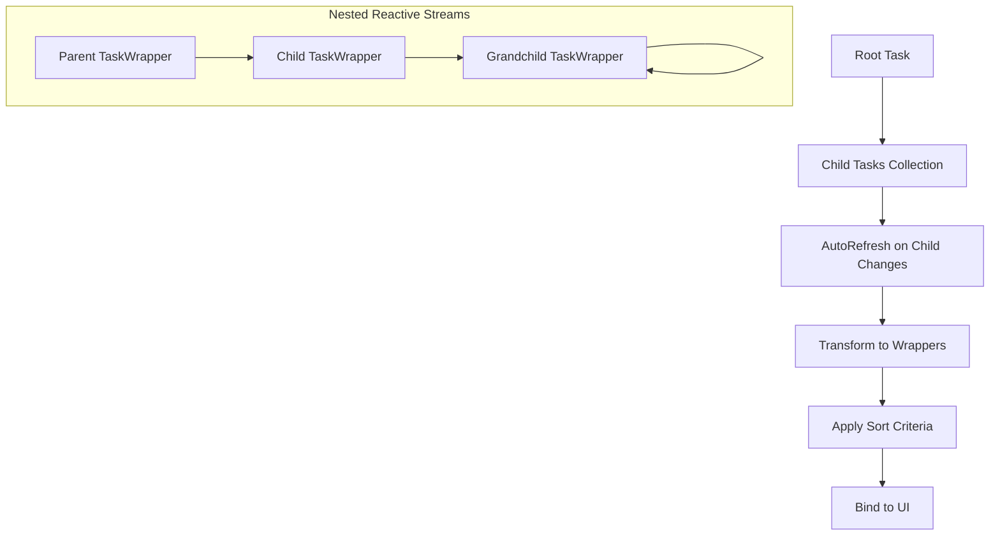

**Diagram sources**
- [TaskWrapperViewModel.cs](file://src/Unlimotion.ViewModel/TaskWrapperViewModel.cs#L80-L120)
- [MainWindowViewModel.cs](file://src/Unlimotion.ViewModel/MainWindowViewModel.cs#L480-L520)

### Reactive Filter Collections

The system maintains reactive collections of filters that automatically update when filter properties change:

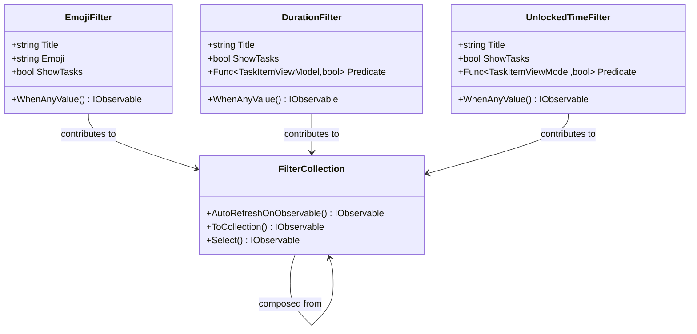

**Diagram sources**
- [UnlockedTimeFilter.cs](file://src/Unlimotion.ViewModel/UnlockedTimeFilter.cs#L8-L57)
- [DurationFilter.cs](file://src/Unlimotion.ViewModel/DurationFilter.cs#L8-L50)

### Reactive Command Chaining

The system demonstrates reactive command chaining for complex operations:

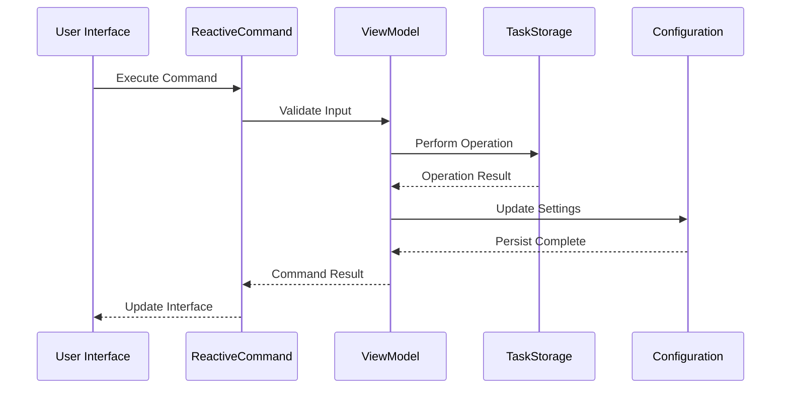

**Diagram sources**
- [MainWindowViewModel.cs](file://src/Unlimotion.ViewModel/MainWindowViewModel.cs#L200-L280)
- [TaskItemViewModel.cs](file://src/Unlimotion.ViewModel/TaskItemViewModel.cs#L45-L55)

**Section sources**
- [TaskWrapperViewModel.cs](file://src/Unlimotion.ViewModel/TaskWrapperViewModel.cs#L80-L120)
- [UnlockedTimeFilter.cs](file://src/Unlimotion.ViewModel/UnlockedTimeFilter.cs#L8-L57)
- [DurationFilter.cs](file://src/Unlimotion.ViewModel/DurationFilter.cs#L8-L50)

## Troubleshooting and Best Practices

### Common Reactive Programming Issues

| Issue | Symptoms | Root Cause | Solution |
|-------|----------|------------|----------|
| Memory Leaks | Increasing memory usage | Unclosed subscriptions | Implement proper `AddToDispose` usage |
| Stale Data | UI not reflecting changes | Missing `AutoRefreshOnObservable` | Add property monitors for relevant changes |
| Performance Issues | Slow UI updates | Excessive subscriptions | Implement throttling and selective property monitoring |
| Configuration Loss | Settings reset on restart | Improper persistence | Verify `WhenAnyValue` handlers are properly configured |

### Best Practices for Reactive Development

1. **Subscription Management**: Always use `AddToDispose` for automatic cleanup
2. **Throttling**: Implement appropriate throttling for expensive operations
3. **Property Selection**: Monitor only necessary properties to reduce overhead
4. **Error Handling**: Implement proper error handling in reactive streams
5. **Testing**: Create unit tests for reactive pipelines and subscriptions

### Debugging Reactive Streams

The system provides several debugging capabilities:

- **Initialization Tracking**: Monitor `_isInited` flag for development insights
- **Subscription Logging**: Track subscription creation and disposal
- **Property Change Monitoring**: Log property change events for debugging
- **Stream Composition**: Visualize stream composition for complex pipelines

### Performance Monitoring

Key metrics to monitor for reactive performance:

- **Subscription Count**: Number of active subscriptions per view model
- **Throttle Effectiveness**: Frequency of throttled vs. unthrottled events
- **Memory Usage**: Garbage collection impact from reactive streams
- **UI Responsiveness**: Latency between data changes and UI updates

**Section sources**
- [MainWindowViewModel.cs](file://src/Unlimotion.ViewModel/MainWindowViewModel.cs#L130-L140)
- [TaskItemViewModel.cs](file://src/Unlimotion.ViewModel/TaskItemViewModel.cs#L203-L232)