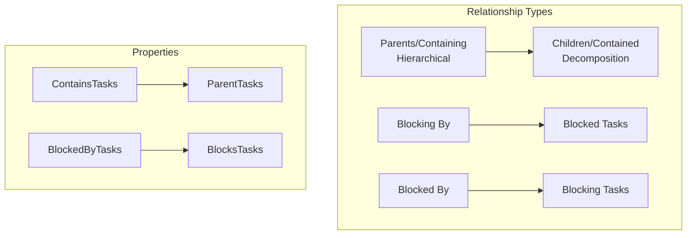
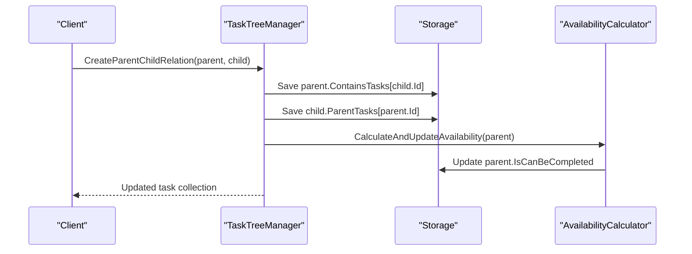
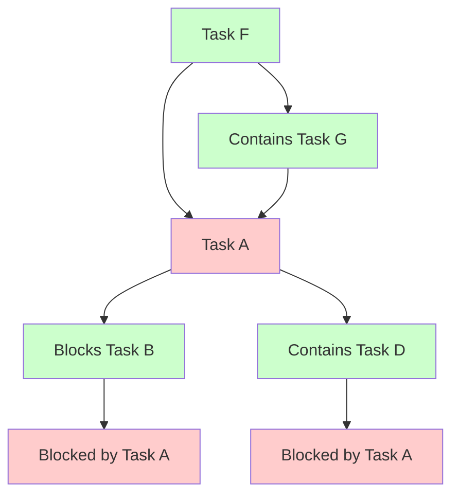
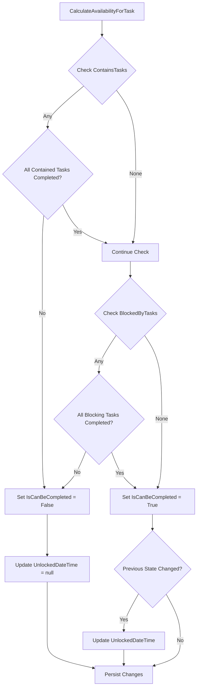
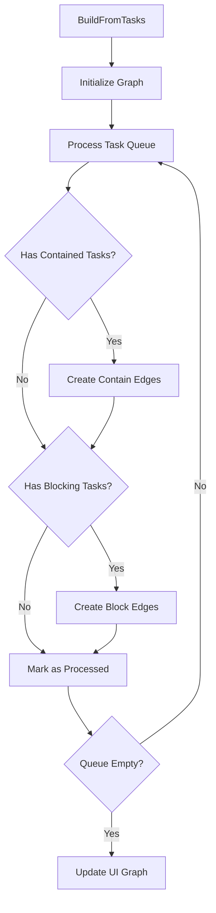

# Relationship Management

<cite>
**Referenced Files in This Document**
- [TaskItem.cs](file://src/Unlimotion.Domain/TaskItem.cs)
- [TaskTreeManager.cs](file://src/Unlimotion.TaskTreeManager/TaskTreeManager.cs)
- [ITaskTreeManager.cs](file://src/Unlimotion.TaskTreeManager/ITaskTreeManager.cs)
- [AutoUpdatingDictionary.cs](file://src/Unlimotion.TaskTreeManager/AutoUpdatingDictionary.cs)
- [TaskItemViewModel.cs](file://src/Unlimotion.ViewModel/TaskItemViewModel.cs)
- [GraphControl.axaml.cs](file://src/Unlimotion\Views\GraphControl.axaml.cs)
- [ContainEdge.cs](file://src\Unlimotion\Views\Graph\ContainEdge.cs)
- [BlockEdge.cs](file://src\Unlimotion\Views\Graph\BlockEdge.cs)
- [TaskAvailabilityCalculationTests.cs](file://src\Unlimotion.Test\TaskAvailabilityCalculationTests.cs)
- [README.md](file://README.md)
</cite>

## Table of Contents
1. [Introduction](#introduction)
2. [Task Relationship Types](#task-relationship-types)
3. [TaskItem Properties](#taskitem-properties)
4. [Relationship Management Methods](#relationship-management-methods)
5. [Hierarchical Relationships](#hierarchical-relationships)
6. [Dependency-Based Relationships](#dependency-based-relationships)
7. [Availability Calculation](#availability-calculation)
8. [Visual Representation](#visual-representation)
9. [Complex Scenarios](#complex-scenarios)
10. [Custom Validation and Constraints](#custom-validation-and-constraints)
11. [Best Practices](#best-practices)

## Introduction

Unlimotion's task relationship management system provides sophisticated capabilities for organizing tasks in hierarchical structures and establishing dependency relationships. The system supports four distinct relationship types that enable complex task organization patterns, including cross-project tasks and intricate dependency chains.

The relationship management system operates through a centralized TaskTreeManager that handles all relationship operations while maintaining automatic availability recalculation to ensure task states remain consistent with their dependencies.

## Task Relationship Types

Unlimotion implements four fundamental relationship types that serve different organizational purposes:

### Parents/Containing Relationships (Hierarchical Decomposition)

**Purpose**: Establish hierarchical containment where child tasks are integral parts of parent tasks necessary for execution.

**Characteristics**:
- One-to-many relationship (one parent can contain multiple children)
- Supports unlimited nesting levels
- Enables task decomposition and organization
- Maintains execution dependencies

**Implementation**: Managed through ContainsTasks (parent → child) and ParentTasks (child → parent) collections.

### Blocking By/Blocked Relationships (Dependency-Based Blocking)

**Purpose**: Establish dependency relationships where completion of blocking tasks enables completion of blocked tasks.

**Characteristics**:
- Many-to-many relationship flexibility
- Enables complex dependency chains
- Supports parallel execution when dependencies are resolved
- Provides visual indication of blocked states

**Implementation**: Managed through BlockedByTasks (blocked task) and BlocksTasks (blocking task) collections.



**Diagram sources**
- [TaskItem.cs](file://src/Unlimotion.Domain/TaskItem.cs#L15-L20)
- [TaskTreeManager.cs](file://src/Unlimotion.TaskTreeManager/TaskTreeManager.cs#L486-L527)

## TaskItem Properties

Task relationships are stored in TaskItem properties as collections of task IDs, enabling efficient relationship management and querying.

### Core Relationship Properties

| Property | Type | Purpose | Cardinality |
|----------|------|---------|-------------|
| `ContainsTasks` | `List<string>` | Child tasks contained by this parent | One-to-many |
| `ParentTasks` | `List<string>?` | Parent tasks containing this child | Many-to-one |
| `BlocksTasks` | `List<string>` | Tasks blocked by this task | One-to-many |
| `BlockedByTasks` | `List<string>?` | Tasks blocking this task | Many-to-one |

### Property Implementation Details

The relationship properties are implemented as nullable collections to support various initialization scenarios:

- **ContainsTasks**: Initialized as empty list for parent tasks
- **ParentTasks**: Nullable to handle orphaned tasks or new creations
- **BlocksTasks**: Initialized as empty list for blocking tasks
- **BlockedByTasks**: Nullable to handle non-blocking tasks

**Section sources**
- [TaskItem.cs](file://src/Unlimotion.Domain/TaskItem.cs#L15-L20)

## Relationship Management Methods

The TaskTreeManager provides comprehensive methods for managing all relationship types with automatic availability recalculation.

### Hierarchical Relationship Methods

#### CreateParentChildRelation
Establishes hierarchical relationships between parent and child tasks.

**Operation Flow**:
1. Adds child ID to parent's ContainsTasks collection
2. Adds parent ID to child's ParentTasks collection  
3. Triggers availability recalculation for the parent task
4. Persists changes to storage

#### BreakParentChildRelation
Removes hierarchical relationships between parent and child tasks.

**Operation Flow**:
1. Removes child ID from parent's ContainsTasks collection
2. Removes parent ID from child's ParentTasks collection
3. Triggers availability recalculation for the parent task
4. Persists changes to storage

### Dependency Relationship Methods

#### CreateBlockingBlockedByRelation
Establishes dependency relationships where blocking tasks prevent completion of blocked tasks.

**Operation Flow**:
1. Adds blocked task ID to blocking task's BlocksTasks collection
2. Adds blocking task ID to blocked task's BlockedByTasks collection
3. Triggers availability recalculation for the blocked task only
4. Persists changes to storage

#### BreakBlockingBlockedByRelation
Removes dependency relationships between blocking and blocked tasks.

**Operation Flow**:
1. Removes blocked task ID from blocking task's BlocksTasks collection
2. Removes blocking task ID from blocked task's BlockedByTasks collection
3. Triggers availability recalculation for the previously blocked task
4. Persists changes to storage

### Specialized Relationship Methods

#### MoveTaskToNewParent
Handles re-parenting operations by breaking old relationships and creating new ones.

**Operation Flow**:
1. Breaks relationship with previous parent (if exists)
2. Creates relationship with new parent
3. Triggers availability recalculation for the new parent
4. Returns updated task collection

#### AddNewParentToTask
Adds a new parent relationship to an existing task.

**Operation Flow**:
1. Establishes relationship with additional parent
2. Triggers availability recalculation for the new parent
3. Returns updated task collection

**Section sources**
- [TaskTreeManager.cs](file://src\Unlimotion.TaskTreeManager\TaskTreeManager.cs#L379-L412)
- [TaskTreeManager.cs](file://src\Unlimotion.TaskTreeManager\TaskTreeManager.cs#L414-L450)
- [TaskTreeManager.cs](file://src\Unlimotion.TaskTreeManager\TaskTreeManager.cs#L452-L527)

## Hierarchical Relationships

Hierarchical relationships enable task decomposition and organization through parent-child structures.

### Cross-Project Task Support

Unlimotion uniquely supports one task being a child of multiple parents simultaneously, enabling cross-project task organization:

**Use Cases**:
- Tasks with inter-project dependencies
- Shared tasks across multiple projects
- Tag-like organization without traditional tagging
- Multi-dimensional task categorization

### Hierarchical Operations

#### Creating Parent-Child Relationships



**Diagram sources**
- [TaskTreeManager.cs](file://src\Unlimotion.TaskTreeManager\TaskTreeManager.cs#L486-L527)

#### Re-parenting with MoveTaskToNewParent

The MoveTaskToNewParent method handles complex re-parenting scenarios:

**Process**:
1. **Break Old Relationship**: Remove task from previous parent's ContainsTasks
2. **Create New Relationship**: Add task to new parent's ContainsTasks  
3. **Update References**: Update child's ParentTasks collection
4. **Trigger Recalculation**: Recalculate availability for new parent
5. **Handle Dependencies**: Manage cascading effects on affected tasks

### Availability Impact

Hierarchical relationships directly impact task availability through contained task completion requirements:

**Availability Rules**:
- A parent task is available only when all contained tasks are completed
- Uncompleted contained tasks block the parent task
- Archived contained tasks don't affect parent availability
- Changes propagate up the hierarchy

**Section sources**
- [TaskTreeManager.cs](file://src\Unlimotion.TaskTreeManager\TaskTreeManager.cs#L379-L412)
- [TaskTreeManager.cs](file://src\Unlimotion.TaskTreeManager\TaskTreeManager.cs#L414-L450)

## Dependency-Based Relationships

Dependency relationships establish blocking relationships where completion of blocking tasks enables completion of blocked tasks.

### Blocking Mechanism

The blocking system operates on the principle that a task cannot be completed until all its blocking dependencies are satisfied:

**Blocking Criteria**:
1. **Contained Tasks**: All contained tasks must be completed
2. **Blocking Tasks**: All blocking tasks must be completed  
3. **Parent Dependencies**: All parent blocking tasks must be completed

### Dependency Chain Management



### Dependency Relationship Operations

#### Creating Blocking Relationships

The CreateBlockingBlockedByRelation method establishes dependency relationships:

**Validation Steps**:
1. Verify blocking task isn't already blocked by the same task
2. Verify blocked task isn't already blocking the same task
3. Prevent circular dependencies where possible
4. Maintain referential integrity

#### Breaking Blocking Relationships

Breaking relationships triggers immediate availability recalculation for the previously blocked task, potentially unlocking it if dependencies are resolved.

**Section sources**
- [TaskTreeManager.cs](file://src\Unlimotion.TaskTreeManager\TaskTreeManager.cs#L529-L585)
- [TaskTreeManager.cs](file://src\Unlimotion.TaskTreeManager\TaskTreeManager.cs#L587-L625)

## Availability Calculation

The availability calculation system ensures task states remain consistent with their relationships and dependencies.

### Availability Determination Algorithm

Task availability is determined by evaluating multiple conditions:



**Diagram sources**
- [TaskTreeManager.cs](file://src\Unlimotion.TaskTreeManager\TaskTreeManager.cs#L629-L665)

### Availability Calculation Rules

**Primary Conditions**:
1. **Contained Tasks**: All contained tasks must be completed (IsCompleted != false)
2. **Blocking Tasks**: All blocking tasks must be completed (IsCompleted != false)

**Special Cases**:
- **Archived Tasks**: Archived contained tasks don't affect availability
- **Circular Dependencies**: System prevents infinite loops in calculations
- **Parent Dependencies**: Parent blocking relationships cascade down

### Cascading Recalculation

When task availability changes, the system automatically recalculates affected tasks:

**Affected Task Collection**:
1. **Parent Tasks**: Tasks that contain the changed task
2. **Blocked Tasks**: Tasks that are blocked by the changed task

**Recalculation Process**:
1. Calculate availability for the changed task
2. Collect affected tasks from parent and blocking relationships
3. Recalculate availability for each affected task
4. Propagate changes through the relationship network

**Section sources**
- [TaskTreeManager.cs](file://src\Unlimotion.TaskTreeManager\TaskTreeManager.cs#L629-L665)
- [TaskTreeManager.cs](file://src\Unlimotion.TaskTreeManager\TaskTreeManager.cs#L720-L750)

## Visual Representation

Unlimotion provides comprehensive visual feedback for task relationships and states.

### Blocked Task Indicators

Blocked tasks are visually distinguished through transparency effects:

**Visual Cues**:
- **Transparent Checkbox**: Indicates blocked state
- **Dimmed Text**: Makes task description less prominent
- **Reduced Opacity**: Applies to both checkbox and text elements

### Graph Visualization

The graph control provides visual representation of task relationships:

#### Edge Types

**Contain Edges** (Green Arrows):
- Represent hierarchical parent-child relationships
- Direction: Parent → Child
- Visual Style: Green arrowhead

**Block Edges** (Red Arrows):  
- Represent blocking dependency relationships
- Direction: Blocking Task → Blocked Task
- Visual Style: Red arrowhead

#### Graph Construction Algorithm



**Diagram sources**
- [GraphControl.axaml.cs](file://src\Unlimotion\Views\GraphControl.axaml.cs#L75-L150)

### Relationship Visualization Features

**Interactive Graph Elements**:
- **Zoom and Pan**: Navigate complex relationship networks
- **Node Selection**: Highlight related tasks and dependencies
- **Edge Labels**: Display relationship types and directions
- **Dynamic Updates**: Real-time reflection of relationship changes

**Section sources**
- [GraphControl.axaml.cs](file://src\Unlimotion\Views\GraphControl.axaml.cs#L75-L150)
- [ContainEdge.cs](file://src\Unlimotion\Views\Graph\ContainEdge.cs#L1-L10)
- [BlockEdge.cs](file://src\Unlimotion\Views\Graph\BlockEdge.cs#L1-L9)

## Complex Scenarios

Unlimotion handles sophisticated relationship scenarios that demonstrate the system's robustness.

### Multiple Parents Scenario

Cross-project tasks with multiple parents illustrate the system's flexibility:

**Scenario**: Task X appears in both Project A and Project B as a shared dependency.

**Implementation**:
- Task X maintains ParentTasks collection with both Project A and Project B IDs
- Changes in either project affect Task X availability
- Task X can be moved independently between projects
- Relationship changes trigger appropriate availability recalculations

### Nested Blocking Chains

Complex dependency chains demonstrate hierarchical blocking:

**Scenario**: Task A → Task B → Task C where each task blocks the next.

**Behavior**:
- Task A blocks Task B (via BlockedByTasks)
- Task B blocks Task C (via BlockedByTasks)  
- Task C inherits blocking from both Task A and Task B
- Completion of Task A unlocks the entire chain

### Circular Dependency Detection

The system implements safeguards against circular dependencies:

**Detection Mechanism**:
1. **Reference Tracking**: Monitor relationship traversal depth
2. **Cycle Prevention**: Prevent self-referencing relationships
3. **Warning Systems**: Alert users to potential circular dependencies
4. **Resolution Strategies**: Provide options for resolving conflicts

### Complex Re-parenting Scenarios

Moving tasks between complex parent-child structures:

**Challenge**: Moving Task X from Parent A to Parent B where both parents have complex child hierarchies.

**Solution**:
1. **Relationship Breakdown**: Remove Task X from Parent A's ContainsTasks
2. **Hierarchy Preservation**: Maintain Parent A's child relationships
3. **New Parent Integration**: Add Task X to Parent B's ContainsTasks
4. **Cascade Recalculation**: Trigger availability updates for both parents
5. **Dependency Resolution**: Handle any blocking relationships affected by the move

**Section sources**
- [TaskAvailabilityCalculationTests.cs](file://src\Unlimotion.Test\TaskAvailabilityCalculationTests.cs#L481-L505)
- [TaskAvailabilityCalculationTests.cs](file://src\Unlimotion.Test\TaskAvailabilityCalculationTests.cs#L505-L537)

## Custom Validation and Constraints

While Unlimotion provides built-in relationship validation, the architecture supports custom validation and constraint implementation.

### Built-in Validation

**Automatic Constraints**:
- **Self-Reference Prevention**: Tasks cannot reference themselves
- **Null Safety**: Proper handling of null collections
- **Consistency Maintenance**: Bidirectional relationship synchronization
- **Availability Integrity**: Automatic recalculation on changes

### Custom Validation Implementation

**Extension Points**:
1. **Pre-Operation Validation**: Validate relationships before applying changes
2. **Post-Operation Verification**: Verify system consistency after changes
3. **Constraint Enforcement**: Implement business-specific rules
4. **Conflict Resolution**: Handle relationship conflicts gracefully

### Constraint Implementation Patterns

#### Business Rule Validation

```csharp
// Example pattern for custom constraint validation
public async Task<bool> ValidateCustomConstraints(TaskItem task, List<TaskItem> relatedTasks)
{
    // Custom business rules validation
    if (await HasCircularDependencies(task, relatedTasks))
    {
        throw new InvalidOperationException("Circular dependencies detected");
    }
    
    if (await ExceedsDepthLimit(task, relatedTasks))
    {
        throw new InvalidOperationException("Depth limit exceeded");
    }
    
    return true;
}
```

#### Relationship Quality Checks

**Validation Categories**:
- **Integrity Checks**: Ensure bidirectional relationship consistency
- **Performance Monitoring**: Track relationship complexity metrics
- **Conflict Detection**: Identify potential relationship conflicts
- **Business Compliance**: Enforce domain-specific rules

### Extensibility Architecture

The TaskTreeManager interface provides extension points for custom validation:

**Interface Extension**:
- **Additional Validation Methods**: Implement specialized validation logic
- **Custom Recalculation Hooks**: Add custom availability calculation logic
- **Constraint Enforcement**: Integrate domain-specific constraints
- **Audit Trail Integration**: Log relationship changes for compliance

**Section sources**
- [ITaskTreeManager.cs](file://src\Unlimotion.TaskTreeManager\ITaskTreeManager.cs#L1-L42)

## Best Practices

Effective use of Unlimotion's relationship management system requires adherence to established patterns and practices.

### Relationship Design Principles

**Hierarchical Organization**:
- Use hierarchical relationships for task decomposition
- Maintain logical parent-child relationships
- Avoid excessive nesting depth
- Group related tasks under meaningful parents

**Dependency Management**:
- Establish blocking relationships for true dependencies
- Avoid over-blocking tasks unnecessarily
- Use blocking relationships for mandatory prerequisites
- Maintain clear dependency chains

### Performance Optimization

**Efficient Relationship Management**:
- Batch relationship operations when possible
- Minimize unnecessary availability recalculations
- Use appropriate filtering for relationship queries
- Cache frequently accessed relationship data

**Memory Management**:
- Dispose of relationship collections properly
- Use weak references for long-lived relationship data
- Monitor relationship complexity growth
- Implement relationship cleanup procedures

### Error Handling and Recovery

**Robust Operation**:
- Implement transaction-like operations for complex changes
- Provide rollback capabilities for failed operations
- Handle concurrent modification scenarios
- Validate relationships before persistence

**User Experience**:
- Provide clear feedback for relationship changes
- Show relationship impact before applying changes
- Offer undo capabilities for relationship modifications
- Display relationship warnings and suggestions

### Testing and Validation

**Comprehensive Testing**:
- Test relationship creation and deletion scenarios
- Validate availability calculation accuracy
- Test complex relationship combinations
- Verify visual representation consistency

**Edge Case Handling**:
- Test circular dependency scenarios
- Validate relationship removal edge cases
- Test concurrent relationship modifications
- Verify system recovery from invalid states

**Section sources**
- [TaskAvailabilityCalculationTests.cs](file://src\Unlimotion.Test\TaskAvailabilityCalculationTests.cs#L1-L100)
- [TaskTreeManager.cs](file://src\Unlimotion.TaskTreeManager\TaskTreeManager.cs#L629-L665)