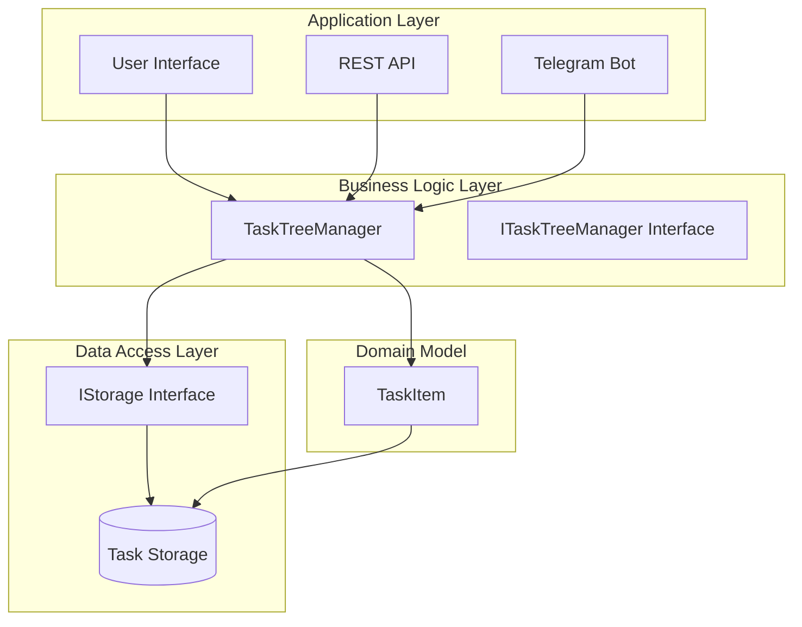
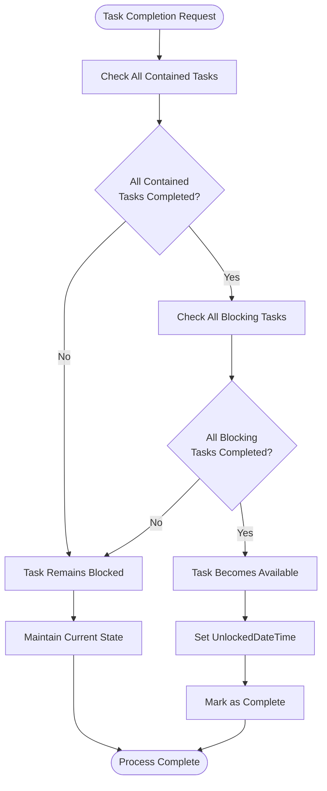
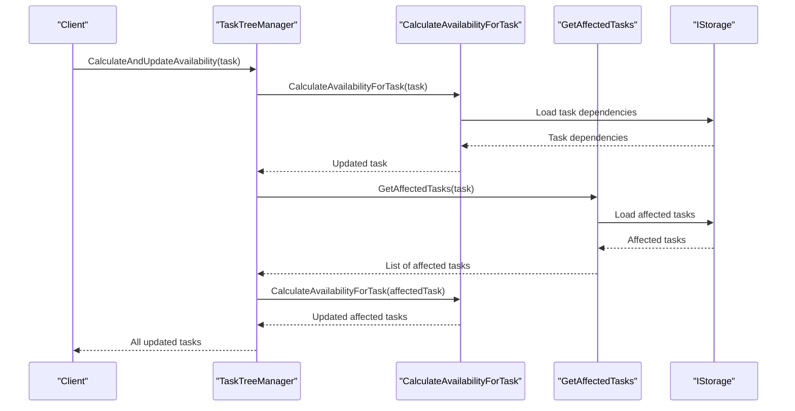
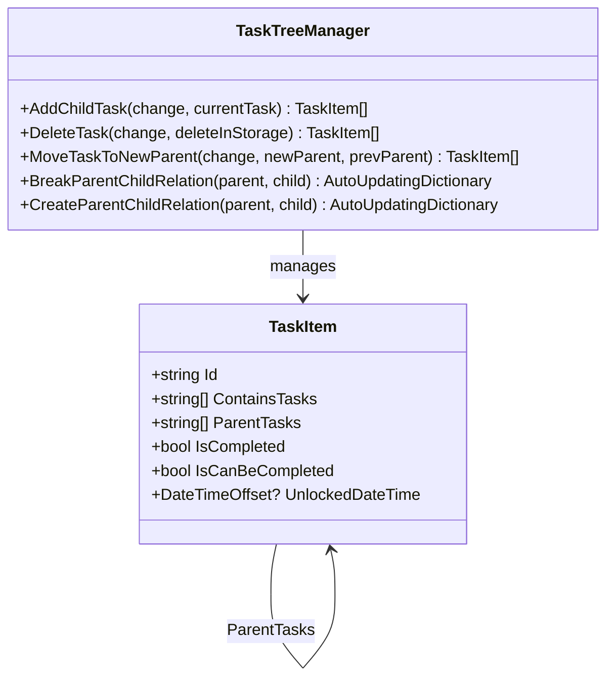
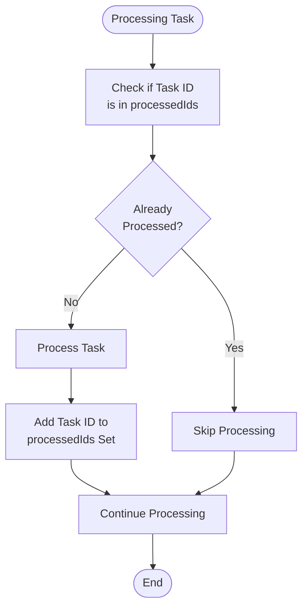
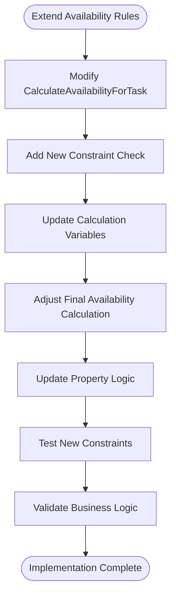

# Task Availability Logic

<cite>
**Referenced Files in This Document**
- [TaskTreeManager.cs](file://src/Unlimotion.TaskTreeManager/TaskTreeManager.cs)
- [ITaskTreeManager.cs](file://src/Unlimotion.TaskTreeManager/ITaskTreeManager.cs)
- [TaskItem.cs](file://src/Unlimotion.Domain/TaskItem.cs)
- [AutoUpdatingDictionary.cs](file://src/Unlimotion.TaskTreeManager/AutoUpdatingDictionary.cs)
- [IStorage.cs](file://src/Unlimotion.TaskTreeManager/IStorage.cs)
- [TaskAvailabilityCalculationTests.cs](file://src/Unlimotion.Test/TaskAvailabilityCalculationTests.cs)
</cite>

## Table of Contents
1. [Introduction](#introduction)
2. [System Architecture](#system-architecture)
3. [Core Business Rules](#core-business-rules)
4. [Main Entry Point Methods](#main-entry-point-methods)
5. [Core Calculation Logic](#core-calculation-logic)
6. [Task Relationship Management](#task-relationship-management)
7. [Propagation Mechanism](#propagation-mechanism)
8. [Performance Optimizations](#performance-optimizations)
9. [Test Coverage](#test-coverage)
10. [Extending Availability Rules](#extending-availability-rules)
11. [Troubleshooting Guide](#troubleshooting-guide)
12. [Conclusion](#conclusion)

## Introduction

The Unlimotion task availability calculation system is implemented through the `TaskTreeManager` class, which manages complex dependency relationships between tasks and determines when tasks can be marked as complete. The system enforces strict business rules where a task can only be completed when all its contained tasks and blocking tasks are completed, ensuring logical consistency in task management workflows.

The availability calculation system operates on a sophisticated propagation mechanism that automatically recalculates affected tasks whenever dependencies change, maintaining data integrity across the entire task hierarchy. This system is crucial for applications that require precise task completion tracking, such as project management systems, workflow engines, and productivity tools.

## System Architecture

The task availability system follows a layered architecture with clear separation of concerns:

**Diagram sources**
- [TaskTreeManager.cs](file://src/Unlimotion.TaskTreeManager/TaskTreeManager.cs#L1-L50)
- [ITaskTreeManager.cs](file://src/Unlimotion.TaskTreeManager/ITaskTreeManager.cs#L1-L43)
- [IStorage.cs](file://src/Unlimotion.TaskTreeManager/IStorage.cs#L1-L11)

**Section sources**
- [TaskTreeManager.cs](file://src/Unlimotion.TaskTreeManager/TaskTreeManager.cs#L1-L50)
- [ITaskTreeManager.cs](file://src/Unlimotion.TaskTreeManager/ITaskTreeManager.cs#L1-L43)

## Core Business Rules

The task availability system implements two fundamental business rules that govern when a task can be marked as complete:

### Primary Availability Rule
A task can be completed only when **all contained tasks are completed**. This ensures that parent tasks remain unavailable until their subtasks are finished, maintaining logical workflow progression.

### Secondary Blocking Rule  
A task can be completed only when **all blocking tasks are completed**. This prevents tasks from being marked as complete when they depend on prerequisite work that hasn't been finished.

**Diagram sources**
- [TaskTreeManager.cs](file://src/Unlimotion.TaskTreeManager/TaskTreeManager.cs#L651-L690)

**Section sources**
- [TaskTreeManager.cs](file://src/Unlimotion.TaskTreeManager/TaskTreeManager.cs#L651-L690)

## Main Entry Point Methods

The `TaskTreeManager` provides several public methods that serve as entry points for availability calculations, each triggering automatic propagation when dependencies change:

### CalculateAndUpdateAvailability Method
The primary entry point that orchestrates the entire availability calculation process:

**Diagram sources**
- [TaskTreeManager.cs](file://src/Unlimotion.TaskTreeManager/TaskTreeManager.cs#L620-L645)

### Relationship Management Methods
Methods that automatically trigger availability recalculation when task relationships change:

| Method | Purpose | Automatic Recalculation |
|--------|---------|------------------------|
| `AddChildTask` | Creates parent-child relationships | Yes (parent task) |
| `DeleteTask` | Removes task and all relationships | Yes (affected tasks) |
| `BlockTask` | Creates blocking relationships | Yes (blocked task) |
| `UnblockTask` | Removes blocking relationships | Yes (unblocked task) |
| `MoveTaskToNewParent` | Changes parent relationships | Yes (new parent) |
| `BreakParentChildRelation` | Removes parent-child relationships | Yes (parent task) |

**Section sources**
- [TaskTreeManager.cs](file://src/Unlimotion.TaskTreeManager/TaskTreeManager.cs#L50-L100)
- [TaskTreeManager.cs](file://src/Unlimotion.TaskTreeManager/TaskTreeManager.cs#L150-L200)

## Core Calculation Logic

### CalculateAvailabilityForTask Implementation

The core calculation logic determines task availability by evaluating both contained and blocking dependencies:

```mermaid
flowchart TD
Start([CalculateAvailabilityForTask]) --> InitVars["Initialize Variables<br/>allContainsCompleted = true<br/>allBlockersCompleted = true"]
InitVars --> CheckContains["Check ContainsTasks"]
CheckContains --> HasContains{"Has Contains<br/>Tasks?"}
HasContains --> |No| SkipContains["Skip Contains Check"]
HasContains --> |Yes| LoopContains["Loop Through Contains"]
LoopContains --> LoadChild["Load Child Task"]
LoadChild --> CheckChildCompleted{"Child IsCompleted<br/>!= false?"}
CheckChildCompleted --> |No| SetContainsFalse["Set allContainsCompleted = false"]
CheckChildCompleted --> |Yes| NextChild["Next Child"]
NextChild --> MoreChildren{"More Children?"}
MoreChildren --> |Yes| LoopContains
MoreChildren --> |No| SkipContains
SetContainsFalse --> SkipContains
SkipContains --> CheckBlocking["Check BlockedByTasks"]
CheckBlocking --> HasBlocking{"Has BlockedBy<br/>Tasks?"}
HasBlocking --> |No| SkipBlocking["Skip Blocking Check"]
HasBlocking --> |Yes| LoopBlocking["Loop Through Blocking"]
LoopBlocking --> LoadBlocker["Load Blocker Task"]
LoadBlocker --> CheckBlockerCompleted{"Blocker IsCompleted<br/>!= false?"}
CheckBlockerCompleted --> |No| SetBlockingFalse["Set allBlockersCompleted = false"]
CheckBlockerCompleted --> |Yes| NextBlocker["Next Blocker"]
NextBlocker --> MoreBlockers{"More Blockers?"}
MoreBlockers --> |Yes| LoopBlocking
MoreBlockers --> |No| SkipBlocking
SetBlockingFalse --> SkipBlocking
SkipBlocking --> CalcFinal["Calculate Final Availability<br/>newIsCanBeCompleted = allContainsCompleted && allBlockersCompleted"]
CalcFinal --> CheckChange["Check for State Change"]
CheckChange --> BecameAvailable{"Became Available?"}
BecameAvailable --> |Yes| SetUnlocked["Set UnlockedDateTime"]
BecameAvailable --> |No| CheckBecameBlocked{"Became Blocked?"}
CheckBecameBlocked --> |Yes| ClearUnlocked["Clear UnlockedDateTime"]
CheckBecameBlocked --> |No| SaveTask["Save Task"]
SetUnlocked --> SaveTask
ClearUnlocked --> SaveTask
SaveTask --> Return["Return Updated Task"]
Return --> End([End])
```

**Diagram sources**
- [TaskTreeManager.cs](file://src/Unlimotion.TaskTreeManager/TaskTreeManager.cs#L651-L690)

### Property Management Logic

The calculation system manages two critical properties that track task availability state:

| Property | Type | Purpose | Update Logic |
|----------|------|---------|-------------|
| `IsCanBeCompleted` | `bool` | Indicates if task meets completion criteria | Calculated from dependency status |
| `UnlockedDateTime` | `DateTimeOffset?` | Timestamp when task became available | Set when becoming available, cleared when blocked |

**Section sources**
- [TaskTreeManager.cs](file://src/Unlimotion.TaskTreeManager/TaskTreeManager.cs#L651-L690)

## Task Relationship Management

### Parent-Child Relationships

The system maintains hierarchical relationships using bidirectional linking:

**Diagram sources**
- [TaskItem.cs](file://src/Unlimotion.Domain/TaskItem.cs#L1-L33)
- [TaskTreeManager.cs](file://src/Unlimotion.TaskTreeManager/TaskTreeManager.cs#L300-L400)

### Blocking Relationships

Blocking relationships enforce sequential dependencies:

| Relationship Type | Direction | Purpose |
|------------------|-----------|---------|
| `BlocksTasks` | Parent → Child | Parent blocks child completion |
| `BlockedByTasks` | Child → Parent | Child blocks parent completion |

**Section sources**
- [TaskTreeManager.cs](file://src/Unlimotion.TaskTreeManager/TaskTreeManager.cs#L400-L500)

## Propagation Mechanism

### GetAffectedTasks Method

The propagation system identifies tasks that need recalculation when a task's availability changes:

```mermaid
flowchart TD
Start([GetAffectedTasks]) --> InitLists["Initialize affectedTasks<br/>and processedIds"]
InitLists --> CheckParents["Check Parent Tasks"]
CheckParents --> HasParents{"Has Parent<br/>Tasks?"}
HasParents --> |No| SkipParents["Skip Parent Check"]
HasParents --> |Yes| LoopParents["Loop Through Parents"]
LoopParents --> CheckProcessed{"Parent ID<br/>Processed?"}
CheckProcessed --> |Yes| NextParent["Next Parent"]
CheckProcessed --> |No| LoadParent["Load Parent Task"]
LoadParent --> ParentExists{"Parent Exists?"}
ParentExists --> |No| NextParent
ParentExists --> |Yes| AddParent["Add to affectedTasks"]
AddParent --> MarkProcessed["Mark as Processed"]
MarkProcessed --> NextParent
NextParent --> MoreParents{"More Parents?"}
MoreParents --> |Yes| LoopParents
MoreParents --> |No| SkipParents
SkipParents --> CheckBlocked["Check Blocked Tasks"]
CheckBlocked --> HasBlocked{"Has Blocked<br/>Tasks?"}
HasBlocked --> |No| SkipBlocked["Skip Blocked Check"]
HasBlocked --> |Yes| LoopBlocked["Loop Through Blocked"]
LoopBlocked --> CheckBlockedProcessed{"Blocked ID<br/>Processed?"}
CheckBlockedProcessed --> |Yes| NextBlocked["Next Blocked"]
CheckBlockedProcessed --> |No| LoadBlocked["Load Blocked Task"]
LoadBlocked --> BlockedExists{"Blocked Exists?"}
BlockedExists --> |No| NextBlocked
BlockedExists --> |Yes| AddBlocked["Add to affectedTasks"]
AddBlocked --> MarkBlockedProcessed["Mark as Processed"]
MarkBlockedProcessed --> NextBlocked
NextBlocked --> MoreBlocked{"More Blocked?"}
MoreBlocked --> |Yes| LoopBlocked
MoreBlocked --> |No| SkipBlocked
SkipBlocked --> Return["Return affectedTasks"]
Return --> End([End])
```

**Diagram sources**
- [TaskTreeManager.cs](file://src/Unlimotion.TaskTreeManager/TaskTreeManager.cs#L714-L740)

### Propagation Scope

The propagation mechanism covers two types of affected tasks:

1. **Upward Propagation**: Parent tasks whose availability depends on the changed task
2. **Forward Propagation**: Tasks blocked by the changed task

**Section sources**
- [TaskTreeManager.cs](file://src/Unlimotion.TaskTreeManager/TaskTreeManager.cs#L714-L740)

## Performance Optimizations

### HashSet for Duplicate Prevention

The system uses `HashSet<string>` to prevent processing duplicate task IDs during propagation:

**Diagram sources**
- [TaskTreeManager.cs](file://src/Unlimotion.TaskTreeManager/TaskTreeManager.cs#L714-L740)

### AutoUpdatingDictionary Pattern

The `AutoUpdatingDictionary` class provides efficient batch updates while maintaining uniqueness:

| Feature | Benefit | Implementation |
|---------|---------|---------------|
| Batch Updates | Reduces storage operations | `AddOrUpdateRange()` method |
| Uniqueness | Prevents duplicate entries | Dictionary internal handling |
| Memory Efficiency | Minimal overhead | Lightweight wrapper around Dictionary |

**Section sources**
- [AutoUpdatingDictionary.cs](file://src/Unlimotion.TaskTreeManager/AutoUpdatingDictionary.cs#L1-L28)

## Test Coverage

The system includes comprehensive test coverage through `TaskAvailabilityCalculationTests`:

### Basic Scenarios
- Tasks with no dependencies are immediately available
- Tasks with completed child tasks become available
- Tasks with incomplete child tasks remain blocked
- Tasks with archived child tasks are considered completed

### Blocking Dependencies
- Tasks with completed blocker tasks become available
- Tasks with incomplete blocker tasks remain blocked
- Mixed dependency scenarios (both contained and blocking)

### State Transitions
- Proper `UnlockedDateTime` management during availability changes
- Correct handling of task completion state transitions

### Complex Propagation
- Parent-child relationship changes
- Blocking relationship modifications
- Task movement between hierarchies

**Section sources**
- [TaskAvailabilityCalculationTests.cs](file://src/Unlimotion.Test/TaskAvailabilityCalculationTests.cs#L1-L718)

## Extending Availability Rules

### Adding Additional Constraints

The system can be extended with additional availability constraints by modifying the `CalculateAvailabilityForTask` method:

### Recommended Extension Points

1. **Custom Business Rules**: Add domain-specific constraints beyond contained/blocking dependencies
2. **Resource Constraints**: Incorporate resource availability checks
3. **Temporal Constraints**: Add time-based availability rules
4. **Priority-Based Rules**: Implement priority-based completion ordering

### Best Practices for Extensions

- Maintain backward compatibility with existing rules
- Ensure atomic updates to prevent race conditions
- Implement comprehensive testing for new constraints
- Document extension points clearly

## Troubleshooting Guide

### Common Issues and Solutions

#### Issue: Task Stays Blocked Indefinitely
**Symptoms**: Task remains `IsCanBeCompleted = false` despite dependencies appearing complete
**Causes**: 
- Circular dependencies in task relationships
- Incorrect task completion state tracking
- Storage inconsistencies

**Solutions**:
- Verify task relationship integrity using `GetAffectedTasks`
- Check for circular dependencies in task hierarchies
- Validate task completion states against stored data

#### Issue: Performance Degradation During Propagation
**Symptoms**: Slow availability calculations with large task hierarchies
**Causes**:
- Excessive propagation depth
- Duplicate task processing
- Inefficient storage operations

**Solutions**:
- Optimize task hierarchy depth
- Verify `HashSet` usage for duplicate prevention
- Monitor storage operation frequency

#### Issue: Incorrect Propagation Scope
**Symptoms**: Changes in task state don't affect expected downstream tasks
**Causes**:
- Missing parent task relationships
- Incorrect blocked task identification
- Incomplete propagation logic

**Solutions**:
- Validate all task relationships are properly established
- Review `GetAffectedTasks` implementation
- Test propagation with complex task hierarchies

### Debugging Strategies

1. **Enable Logging**: Add logging to key calculation points
2. **State Inspection**: Monitor task properties during calculations
3. **Relationship Validation**: Verify task relationship integrity
4. **Propagation Tracing**: Track affected task identification

## Conclusion

The Unlimotion task availability calculation system provides a robust foundation for managing complex task dependencies with automatic propagation and state consistency. The system's design emphasizes:

- **Business Rule Integrity**: Strict enforcement of completion dependencies
- **Automatic Propagation**: Seamless recalculation when dependencies change  
- **Performance Optimization**: Efficient duplicate prevention and batch operations
- **Extensibility**: Clear patterns for adding custom constraints
- **Testability**: Comprehensive test coverage for validation

The system successfully handles complex scenarios including nested hierarchies, blocking relationships, and dynamic task movements while maintaining data consistency and performance. Future enhancements can build upon this solid foundation to support additional business requirements without compromising existing functionality.