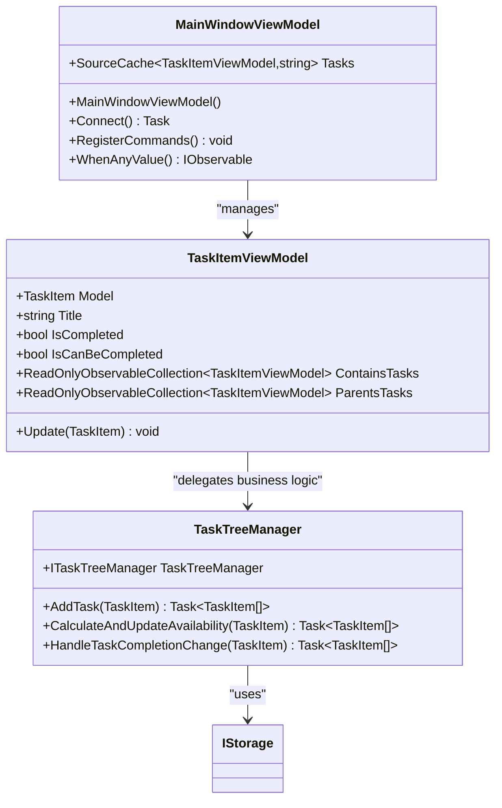
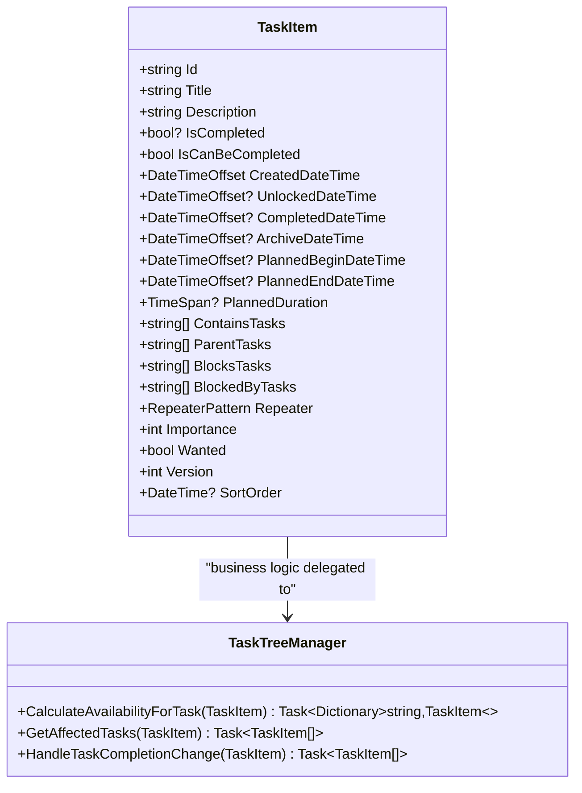
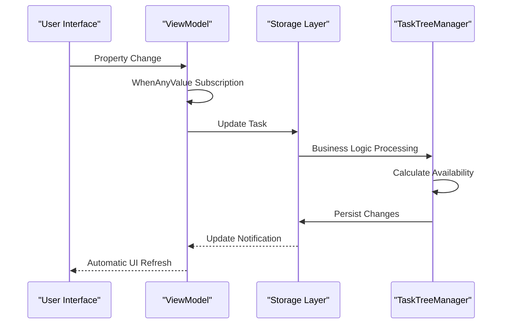
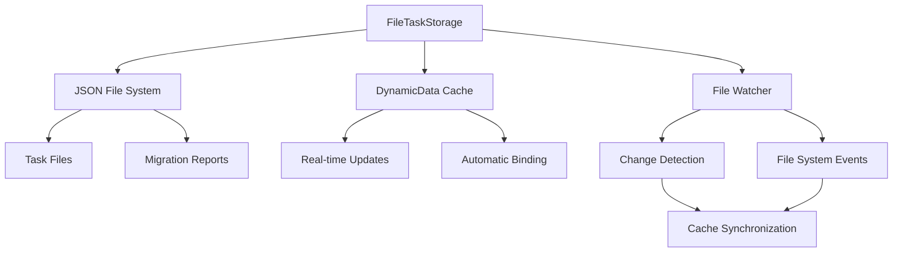
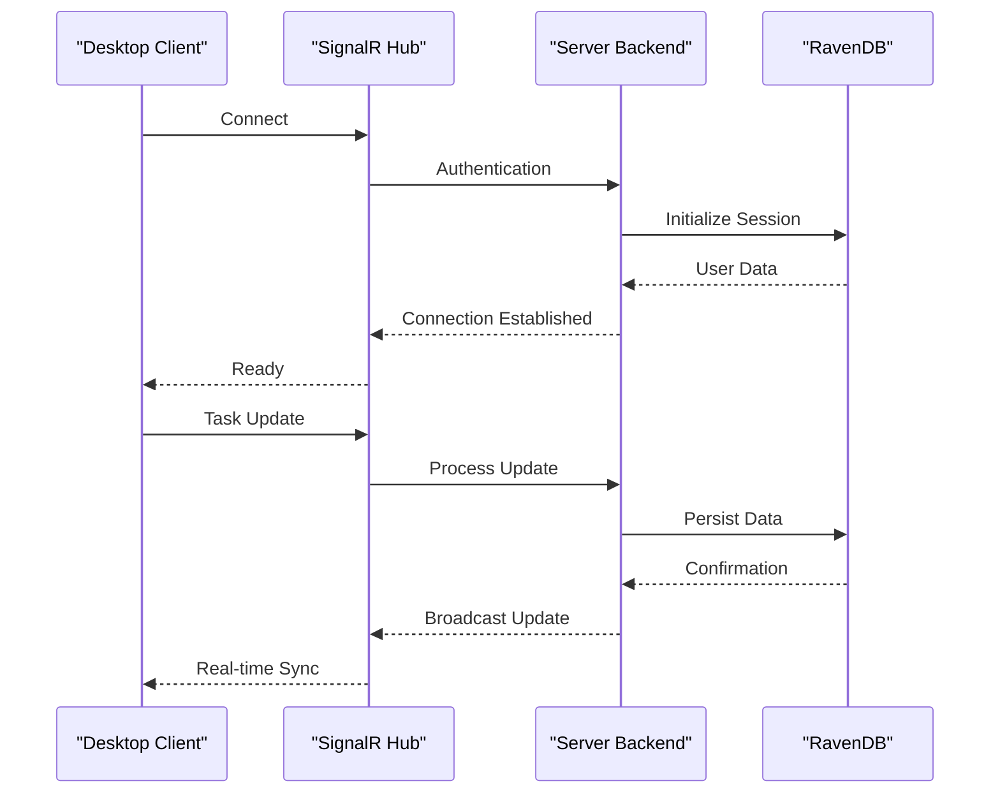
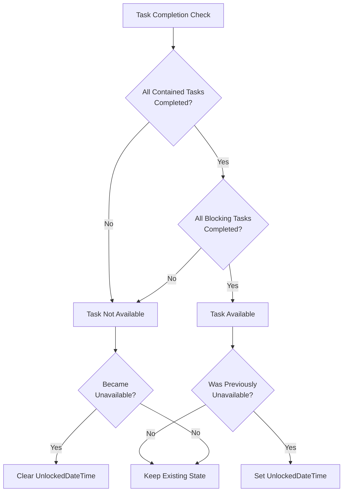
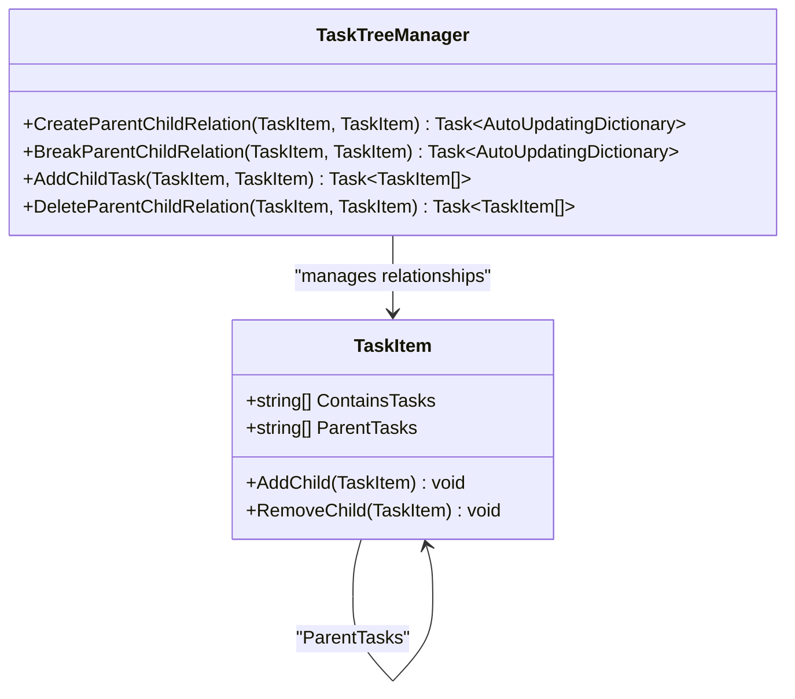
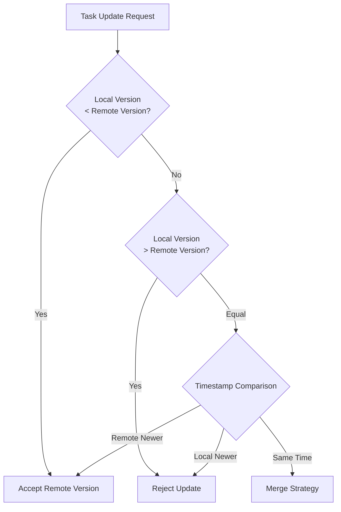
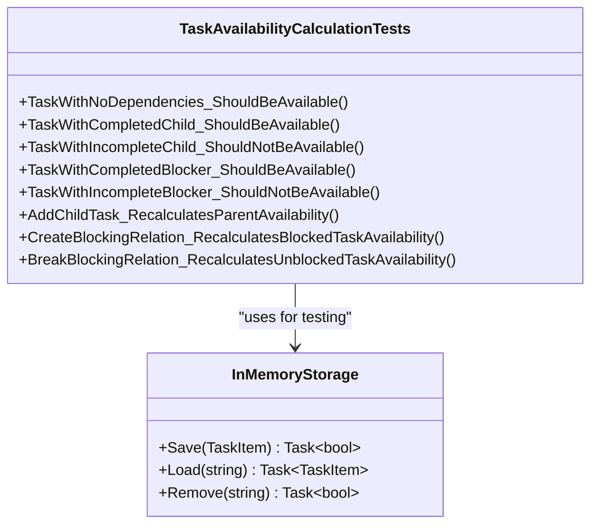

# Technical Design

<cite>
**Referenced Files in This Document**
- [MainWindowViewModel.cs](file://src/Unlimotion.ViewModel/MainWindowViewModel.cs)
- [TaskTreeManager.cs](file://src/Unlimotion.TaskTreeManager/TaskTreeManager.cs)
- [FileTaskStorage.cs](file://src/Unlimotion/FileTaskStorage.cs)
- [ServerTaskStorage.cs](file://src/Unlimotion/ServerTaskStorage.cs)
- [TaskItem.cs](file://src/Unlimotion.Domain/TaskItem.cs)
- [TaskItemViewModel.cs](file://src/Unlimotion.ViewModel/TaskItemViewModel.cs)
- [ITaskTreeManager.cs](file://src/Unlimotion.TaskTreeManager/ITaskTreeManager.cs)
- [AutoUpdatingDictionary.cs](file://src/Unlimotion.TaskTreeManager/AutoUpdatingDictionary.cs)
- [IStorage.cs](file://src/Unlimotion.TaskTreeManager/IStorage.cs)
- [IMPLEMENTATION_SUMMARY.md](file://IMPLEMENTATION_SUMMARY.md)
</cite>

## Table of Contents
1. [Introduction](#introduction)
2. [MVVM Architecture Implementation](#mvvm-architecture-implementation)
3. [Reactive Programming Model](#reactive-programming-model)
4. [Data Synchronization Mechanism](#data-synchronization-mechanism)
5. [Task Availability Logic](#task-availability-logic)
6. [Relationship Management System](#relationship-management-system)
7. [Performance Considerations](#performance-considerations)
8. [Conflict Resolution Strategies](#conflict-resolution-strategies)
9. [Testing and Validation](#testing-and-validation)
10. [Conclusion](#conclusion)

## Introduction

Unlimotion implements a sophisticated task management system built on modern C# architecture patterns. The application demonstrates advanced technical design principles including MVVM architecture with reactive programming, distributed data synchronization, and intelligent task availability calculations. This document explores the technical implementation details that make Unlimotion a robust, scalable, and maintainable task management solution.

The system architecture separates concerns across multiple layers: domain models, business logic managers, storage abstractions, and presentation layers. This separation enables independent development, testing, and maintenance while ensuring consistent behavior across different deployment scenarios.

## MVVM Architecture Implementation

### View Layer (Avalonia XAML Files)

The View layer consists of Avalonia XAML files that define the user interface structure and bindings. These files serve as declarative templates that establish data binding connections between UI elements and ViewModel properties.

**Diagram sources**
- [MainWindowViewModel.cs](file://src/Unlimotion.ViewModel/MainWindowViewModel.cs#L25-L50)
- [TaskItemViewModel.cs](file://src/Unlimotion.ViewModel/TaskItemViewModel.cs#L20-L40)
- [TaskTreeManager.cs](file://src/Unlimotion.TaskTreeManager/TaskTreeManager.cs#L10-L25)

### ViewModel Layer (ReactiveUI Classes)

The ViewModel layer implements the ReactiveUI framework to create responsive, data-bound user interfaces. ViewModels act as intermediaries between Views and Models, handling user interactions and maintaining application state.

Key characteristics of the ViewModel implementation:

- **Property Change Notifications**: Uses ReactiveUI's `WhenAnyValue` for reactive property observation
- **Command Pattern**: Implements `ReactiveCommand` for user action handling
- **Automatic Binding**: Leverages DynamicData for automatic UI updates
- **Resource Management**: Implements `DisposableList` for proper cleanup

**Section sources**
- [MainWindowViewModel.cs](file://src/Unlimotion.ViewModel/MainWindowViewModel.cs#L25-L100)
- [TaskItemViewModel.cs](file://src/Unlimotion.ViewModel/TaskItemViewModel.cs#L20-L80)

### Model Layer (Domain Entities)

The Model layer defines the core domain entities that represent business concepts. The primary entity is `TaskItem`, which encapsulates all task-related data and business rules.

**Diagram sources**
- [TaskItem.cs](file://src/Unlimotion.Domain/TaskItem.cs#L5-L32)
- [TaskTreeManager.cs](file://src/Unlimotion.TaskTreeManager/TaskTreeManager.cs#L640-L680)

**Section sources**
- [TaskItem.cs](file://src/Unlimotion.Domain/TaskItem.cs#L5-L32)
- [TaskTreeManager.cs](file://src/Unlimotion.TaskTreeManager/TaskTreeManager.cs#L640-L700)

## Reactive Programming Model

### WhenAnyValue Implementation

The reactive programming model centers around ReactiveUI's `WhenAnyValue` method, which creates observables that trigger when specified properties change. This pattern enables automatic UI updates without manual refresh logic.

**Diagram sources**
- [MainWindowViewModel.cs](file://src/Unlimotion.ViewModel/MainWindowViewModel.cs#L50-L80)
- [TaskItemViewModel.cs](file://src/Unlimotion.ViewModel/TaskItemViewModel.cs#L150-L200)

### DynamicData Observable Collections

DynamicData provides powerful observable collection capabilities that automatically update UI components when underlying data changes. The system uses several key DynamicData features:

- **AutoRefreshOnObservable**: Triggers collection refresh when specified conditions change
- **Transform**: Applies transformations to data as it flows through the pipeline
- **Filter**: Applies dynamic filtering based on user-defined criteria
- **Sort**: Maintains sorted order based on specified comparers

**Section sources**
- [MainWindowViewModel.cs](file://src/Unlimotion.ViewModel/MainWindowViewModel.cs#L150-L300)
- [TaskItemViewModel.cs](file://src/Unlimotion.ViewModel/TaskItemViewModel.cs#L40-L100)

## Data Synchronization Mechanism

### Local JSON Storage (FileTaskStorage)

The FileTaskStorage component manages local data persistence using JSON files. It provides a complete abstraction over file system operations while maintaining data consistency and integrity.

**Diagram sources**
- [FileTaskStorage.cs](file://src/Unlimotion/FileTaskStorage.cs#L20-L50)

Key features of FileTaskStorage:

- **Automatic Migration**: Handles data format migrations during initialization
- **Change Detection**: Monitors file system changes and updates cache accordingly
- **Batch Operations**: Supports bulk operations for improved performance
- **Error Recovery**: Implements robust error handling and recovery mechanisms

**Section sources**
- [FileTaskStorage.cs](file://src/Unlimotion/FileTaskStorage.cs#L20-L150)

### Server-Based RavenDB Storage (ServerTaskStorage)

The ServerTaskStorage component provides cloud-based data synchronization using SignalR for real-time communication and ServiceStack for RESTful API interactions.

**Diagram sources**
- [ServerTaskStorage.cs](file://src/Unlimotion/ServerTaskStorage.cs#L100-L200)

### Conflict Resolution Strategies

The system implements several conflict resolution strategies to handle concurrent modifications:

1. **Version-based Conflicts**: Uses the `Version` property to detect and resolve conflicts
2. **Timestamp-based Resolution**: Falls back to timestamp comparison when versions are equal
3. **Merge Operations**: Automatically merges compatible changes
4. **User Intervention**: Provides mechanisms for manual conflict resolution

**Section sources**
- [ServerTaskStorage.cs](file://src/Unlimotion/ServerTaskStorage.cs#L150-L300)

## Task Availability Logic

### Business Rules Implementation

The task availability logic implements sophisticated business rules to determine when a task can be marked as complete. The core principle is that a task can only be completed when all its dependencies are satisfied.

**Diagram sources**
- [TaskTreeManager.cs](file://src/Unlimotion.TaskTreeManager/TaskTreeManager.cs#L640-L680)

### Availability Calculation Algorithm

The availability calculation follows these steps:

1. **Dependency Validation**: Check all contained tasks for completion status
2. **Blocking Validation**: Verify all blocking tasks are completed
3. **State Transition**: Update `IsCanBeCompleted` property based on validation results
4. **Timestamp Management**: Set or clear `UnlockedDateTime` based on availability changes
5. **Propagation**: Recalculate affected parent and blocked tasks

**Section sources**
- [TaskTreeManager.cs](file://src/Unlimotion.TaskTreeManager/TaskTreeManager.cs#L640-L700)

### Relationship Propagation

When task availability changes, the system automatically recalculates affected tasks to maintain consistency:

- **Upward Propagation**: Parent tasks are recalculated when child completion status changes
- **Forward Propagation**: Blocked tasks are recalculated when blocking task completion changes
- **Efficient Identification**: Uses graph traversal algorithms to identify affected tasks

**Section sources**
- [TaskTreeManager.cs](file://src/Unlimotion.TaskTreeManager/TaskTreeManager.cs#L700-L750)

## Relationship Management System

### Parent-Child Relationships

The system supports hierarchical task relationships with bidirectional navigation:

**Diagram sources**
- [TaskTreeManager.cs](file://src/Unlimotion.TaskTreeManager/TaskTreeManager.cs#L350-L450)
- [TaskItem.cs](file://src/Unlimotion.Domain/TaskItem.cs#L15-L25)

### Blocking Relationships

Blocking relationships allow tasks to depend on each other in a way that prevents simultaneous completion:

- **One-way Dependencies**: Task A can block Task B from completing
- **Transitive Blocking**: Blocking relationships propagate through the task graph
- **Dynamic Resolution**: Blocked tasks become available when blocking tasks complete

**Section sources**
- [TaskTreeManager.cs](file://src/Unlimotion.TaskTreeManager/TaskTreeManager.cs#L450-L550)

### Relationship Management Methods

The TaskTreeManager provides comprehensive methods for managing task relationships:

| Method | Purpose | Impact |
|--------|---------|---------|
| `AddChildTask` | Creates parent-child relationship | Recalculates parent availability |
| `CreateBlockingBlockedByRelation` | Establishes blocking relationship | Recalculates blocked task availability |
| `BreakParentChildRelation` | Removes parent-child relationship | Recalculates parent availability |
| `BreakBlockingBlockedByRelation` | Removes blocking relationship | Recalculates unblocked task availability |
| `DeleteTask` | Removes task and all relationships | Recalculates affected tasks |

**Section sources**
- [TaskTreeManager.cs](file://src/Unlimotion.TaskTreeManager/TaskTreeManager.cs#L300-L500)

## Performance Considerations

### Caching Strategy

The system implements multiple levels of caching to optimize performance:

1. **In-Memory Cache**: DynamicData maintains real-time caches of filtered and transformed data
2. **Task Availability Cache**: Calculated availability states are cached to avoid recomputation
3. **Relationship Cache**: Task relationships are cached for efficient navigation

### Efficient Task Identification

When recalculating availability, the system uses efficient algorithms to identify affected tasks:

- **Graph Traversal**: Breadth-first search for upward propagation
- **Direct References**: Uses task IDs for O(1) lookups
- **Batch Processing**: Groups related operations for improved throughput

### Throttling and Debouncing

The reactive system implements throttling mechanisms to prevent excessive updates:

- **Property Change Throttling**: Limits update frequency for property changes
- **Batch Operations**: Groups multiple changes into single update cycles
- **Lazy Evaluation**: Defers expensive calculations until necessary

**Section sources**
- [TaskItemViewModel.cs](file://src/Unlimotion.ViewModel/TaskItemViewModel.cs#L300-L400)

## Conflict Resolution Strategies

### Version-Based Conflict Detection

The system uses a versioning scheme to detect and resolve conflicts:

**Diagram sources**
- [TaskTreeManager.cs](file://src/Unlimotion.TaskTreeManager/TaskTreeManager.cs#L550-L600)

### Merge Strategies

When conflicts occur, the system applies intelligent merge strategies:

1. **Last-Write-Wins**: When timestamps differ, the most recent write wins
2. **Manual Resolution**: Provides user interface for resolving complex conflicts
3. **Partial Merge**: Combines compatible changes while preserving conflicting data

### Data Integrity Guarantees

The system ensures data integrity through several mechanisms:

- **Atomic Operations**: All relationship changes are atomic
- **Consistency Checks**: Validates data integrity after each operation
- **Rollback Capability**: Supports rollback for failed operations

**Section sources**
- [TaskTreeManager.cs](file://src/Unlimotion.TaskTreeManager/TaskTreeManager.cs#L550-L650)

## Testing and Validation

### Unit Testing Framework

The system includes comprehensive unit tests that validate business logic independently of the reactive framework:

**Diagram sources**
- [IMPLEMENTATION_SUMMARY.md](file://IMPLEMENTATION_SUMMARY.md#L100-L130)

### Test Coverage Areas

The testing framework covers:

- **Basic Availability Logic**: Fundamental business rules validation
- **Relationship Changes**: Impact of adding/removing relationships
- **Complex Scenarios**: Multi-level dependency chains
- **Edge Cases**: Boundary conditions and error scenarios
- **Performance Tests**: Large-scale operation validation

**Section sources**
- [IMPLEMENTATION_SUMMARY.md](file://IMPLEMENTATION_SUMMARY.md#L100-L140)

## Conclusion

Unlimotion demonstrates a sophisticated approach to task management system design, implementing advanced technical patterns that ensure scalability, maintainability, and reliability. The separation of concerns across MVVM layers, combined with reactive programming and intelligent business logic delegation, creates a robust foundation for task management applications.

Key architectural achievements include:

- **Clean Separation**: Business logic centralized in TaskTreeManager
- **Reactive Efficiency**: DynamicData and ReactiveUI for optimal UI responsiveness
- **Data Consistency**: Robust conflict resolution and synchronization mechanisms
- **Performance Optimization**: Intelligent caching and efficient task identification
- **Extensibility**: Modular design supporting multiple storage backends

The implementation successfully addresses the design challenges outlined in the original specification, providing a production-ready solution that balances complexity with maintainability. The comprehensive testing framework ensures reliability, while the modular architecture supports future enhancements and platform expansions.