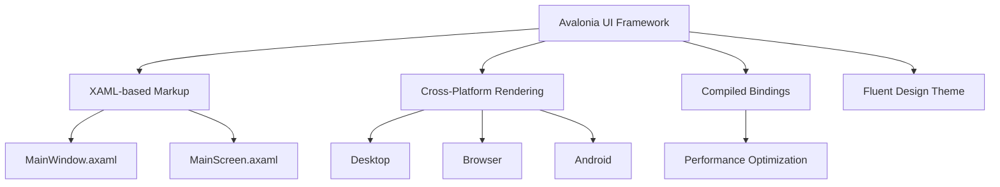
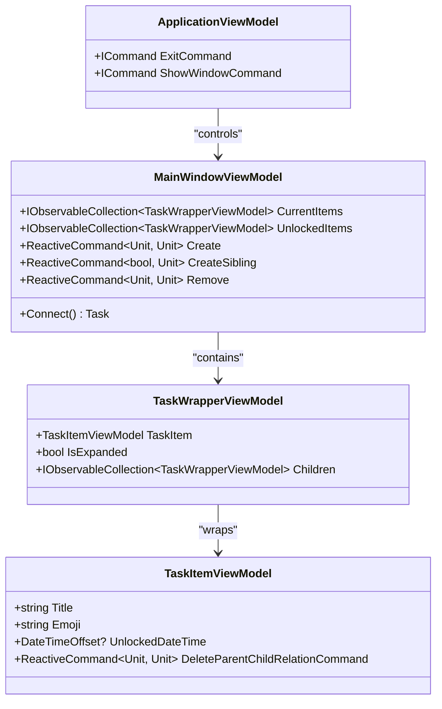
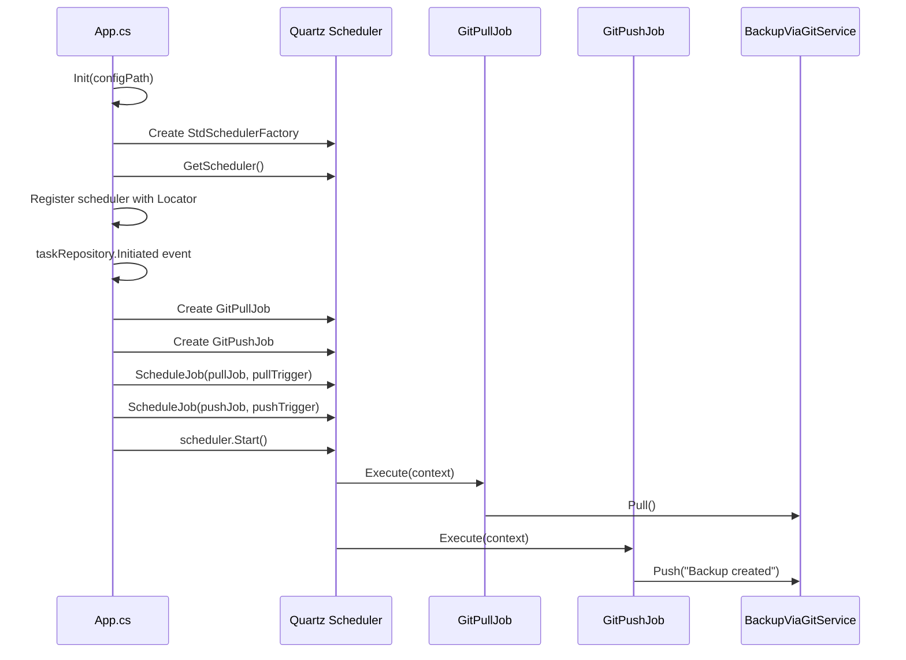
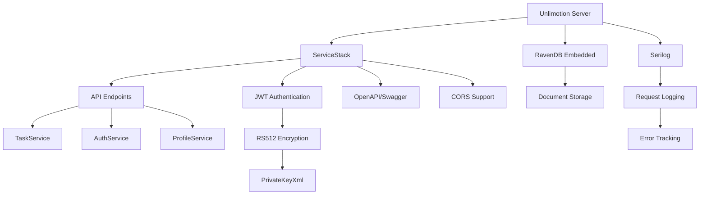
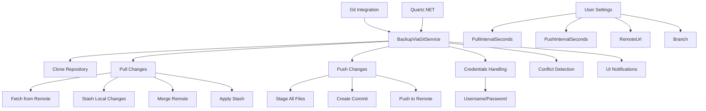
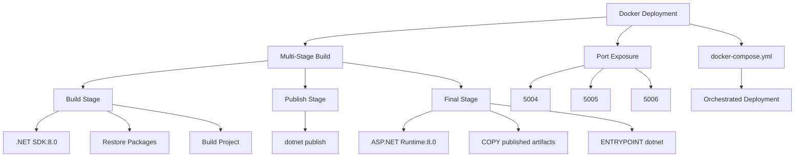

# Technology Stack

<cite>
**Referenced Files in This Document**   
- [Unlimotion.csproj](file://src/Unlimotion/Unlimotion.csproj)
- [Unlimotion.Server.csproj](file://src/Unlimotion.Server/Unlimotion.Server.csproj)
- [Unlimotion.Desktop.csproj](file://src/Unlimotion.Desktop/Unlimotion.Desktop.csproj)
- [Unlimotion.Browser.csproj](file://src/Unlimotion.Browser/Unlimotion.Browser.csproj)
- [Unlimotion.Android.csproj](file://src/Unlimotion.Android/Unlimotion.Android.csproj)
- [App.axaml.cs](file://src/Unlimotion/App.axaml.cs)
- [ApplicationViewModel.cs](file://src/Unlimotion/ApplicationViewModel.cs)
- [GitPullJob.cs](file://src/Unlimotion/Scheduling/Jobs/GitPullJob.cs)
- [GitPushJob.cs](file://src/Unlimotion/Scheduling/Jobs/GitPushJob.cs)
- [BackupViaGitService.cs](file://src/Unlimotion/Services/BackupViaGitService.cs)
- [MainWindowViewModel.cs](file://src/Unlimotion.ViewModel/MainWindowViewModel.cs)
- [Program.cs](file://src/Unlimotion.Server/Program.cs)
- [AppHost.cs](file://src/Unlimotion.Server/AppHost.cs)
- [Dockerfile](file://src/Unlimotion.Server/Dockerfile)
</cite>

## Table of Contents
1. [C# and .NET 9.0](#c-and-net-90)
2. [Avalonia UI Framework](#avalonia-ui-framework)
3. [ReactiveUI and MVVM Architecture](#reactiveui-and-mvvm-architecture)
4. [Quartz.NET for Task Scheduling](#quartznet-for-task-scheduling)
5. [RavenDB and ServiceStack Server Stack](#ravendb-and-servicestack-server-stack)
6. [Data Mapping and Serialization](#data-mapping-and-serialization)
7. [Git Integration for Data Synchronization](#git-integration-for-data-synchronization)
8. [Containerized Deployment with Docker](#containerized-deployment-with-docker)

## C# and .NET 9.0

Unlimotion is built on C# as its primary programming language, leveraging the modern .NET 9.0 runtime environment. The project targets `net9.0` across multiple platforms, as evidenced by the TargetFramework specification in all core project files. This choice provides access to the latest language features, performance improvements, and cross-platform capabilities. The codebase utilizes modern C# features including nullable reference types (enabled via `<Nullable>enable</Nullable>`), latest language version (`<LangVersion>latest</LangVersion>`), and reactive programming patterns. The .NET 9.0 SDK serves as the foundational development tooling requirement, enabling compilation and execution across Windows, Linux, and macOS platforms.

**Section sources**
- [Unlimotion.csproj](file://src/Unlimotion/Unlimotion.csproj#L3-L5)
- [Unlimotion.Server.csproj](file://src/Unlimotion.Server/Unlimotion.Server.csproj#L4-L6)
- [Unlimotion.Desktop.csproj](file://src/Unlimotion.Desktop/Unlimotion.Desktop.csproj#L5-L7)

## Avalonia UI Framework

Unlimotion employs Avalonia UI as its cross-platform user interface framework, enabling consistent desktop and mobile experiences. The framework is referenced via the `Avalonia` package and platform-specific extensions like `Avalonia.Desktop`, `Avalonia.Browser`, and `Avalonia.Android`. The application structure includes `.axaml` files (such as `MainWindow.axaml.cs` and `MainScreen.axaml.cs`) that define UI components using XAML-based markup. Avalonia's compiled bindings (enabled via `<AvaloniaUseCompiledBindingsByDefault>true</AvaloniaUseCompiledBindingsByDefault>`) enhance performance by generating efficient binding code at compile time. The UI layer supports theming through `Avalonia.Themes.Fluent` and font rendering via `Avalonia.Fonts.Inter`, providing a polished user experience across different form factors.

**Diagram sources**
- [Unlimotion.csproj](file://src/Unlimotion/Unlimotion.csproj#L10-L18)
- [MainWindow.axaml.cs](file://src/Unlimotion/Views/MainWindow.axaml.cs)
- [MainScreen.axaml.cs](file://src/Unlimotion/Views/MainScreen.axaml.cs)

**Section sources**
- [Unlimotion.csproj](file://src/Unlimotion/Unlimotion.csproj#L10-L18)
- [Unlimotion.Desktop.csproj](file://src/Unlimotion.Desktop/Unlimotion.Desktop.csproj#L15-L18)
- [Unlimotion.Browser.csproj](file://src/Unlimotion.Browser/Unlimotion.Browser.csproj#L9-L11)
- [Unlimotion.Android.csproj](file://src/Unlimotion.Android/Unlimotion.Android.csproj#L15-L17)

## ReactiveUI and MVVM Architecture

The application implements the Model-View-ViewModel (MVVM) pattern using ReactiveUI and DynamicData libraries to enable reactive programming. ViewModel classes like `MainWindowViewModel` and `ApplicationViewModel` inherit from ReactiveUI's reactive types and utilize `ReactiveCommand` for UI interactions. The architecture establishes automatic data flow from models to views through observable properties and reactive bindings. In `ApplicationViewModel`, commands such as `ExitCommand` and `ShowWindowCommand` are implemented as `ReactiveCommand` instances, ensuring thread-safe execution and automatic UI updates. The integration with DynamicData enables sophisticated collection handling, with observable change sets that automatically update UI components when underlying data changes, eliminating the need for manual event handling.

**Diagram sources**
- [MainWindowViewModel.cs](file://src/Unlimotion.ViewModel/MainWindowViewModel.cs#L1-L1076)
- [ApplicationViewModel.cs](file://src/Unlimotion/ApplicationViewModel.cs#L1-L49)
- [TaskWrapperViewModel.cs](file://src/Unlimotion.ViewModel/TaskWrapperViewModel.cs)

**Section sources**
- [MainWindowViewModel.cs](file://src/Unlimotion.ViewModel/MainWindowViewModel.cs#L1-L1076)
- [ApplicationViewModel.cs](file://src/Unlimotion/ApplicationViewModel.cs#L1-L49)
- [Unlimotion.csproj](file://src/Unlimotion/Unlimotion.csproj#L16)

## Quartz.NET for Task Scheduling

Unlimotion utilizes Quartz.NET for scheduling periodic Git operations, specifically pull and push synchronization tasks. The scheduling infrastructure is initialized in the `App` class where a `StdSchedulerFactory` creates a scheduler instance registered with Splat's dependency injection container. Two dedicated job classes, `GitPullJob` and `GitPushJob`, implement the `IJob` interface and contain the logic for Git synchronization. These jobs are configured with triggers based on user-defined intervals (`PullIntervalSeconds` and `PushIntervalSeconds`) from the application settings. The scheduler activates only in client mode (when `IsServerMode` is false) and starts automatically when the task repository is initiated, ensuring background synchronization without interfering with the main application flow.

**Diagram sources**
- [App.axaml.cs](file://src/Unlimotion/App.axaml.cs#L1-L233)
- [GitPullJob.cs](file://src/Unlimotion/Scheduling/Jobs/GitPullJob.cs#L1-L20)
- [GitPushJob.cs](file://src/Unlimotion/Scheduling/Jobs/GitPushJob.cs#L1-L21)
- [BackupViaGitService.cs](file://src/Unlimotion/Services/BackupViaGitService.cs#L1-L357)

**Section sources**
- [App.axaml.cs](file://src/Unlimotion/App.axaml.cs#L1-L233)
- [GitPullJob.cs](file://src/Unlimotion/Scheduling/Jobs/GitPullJob.cs#L1-L20)
- [GitPushJob.cs](file://src/Unlimotion/Scheduling/Jobs/GitPushJob.cs#L1-L21)

## RavenDB and ServiceStack Server Stack

The server component of Unlimotion leverages RavenDB as its document database and ServiceStack as its web services framework. RavenDB is integrated via the `RavenDB.Embedded` package, providing a lightweight, high-performance NoSQL database for server-side storage. The server application is structured as an ASP.NET Core web application that uses ServiceStack to expose API endpoints, with configuration handled through the `AppHost` class. ServiceStack features such as `OpenApiFeature` and `CorsFeature` enable API documentation and cross-origin resource sharing. Authentication is implemented using JWT tokens with RS512 encryption, and the server configuration allows for secure connections while disabling unnecessary formats like XML and CSV in metadata. The integration with Serilog provides comprehensive logging for monitoring and debugging.

**Diagram sources**
- [Unlimotion.Server.csproj](file://src/Unlimotion.Server/Unlimotion.Server.csproj#L19-L23)
- [Program.cs](file://src/Unlimotion.Server/Program.cs#L1-L50)
- [AppHost.cs](file://src/Unlimotion.Server/AppHost.cs#L1-L122)

**Section sources**
- [Unlimotion.Server.csproj](file://src/Unlimotion.Server/Unlimotion.Server.csproj#L19-L23)
- [Program.cs](file://src/Unlimotion.Server/Program.cs#L1-L50)
- [AppHost.cs](file://src/Unlimotion.Server/AppHost.cs#L1-L122)

## Data Mapping and Serialization

Unlimotion employs AutoMapper for object mapping between domain models and view models, and Newtonsoft.Json for JSON serialization in file-based storage. AutoMapper is referenced as a package dependency and configured through the `AppModelMapping.ConfigureMapping()` method called during application initialization. This enables seamless transformation between different data representations across the application layers. For JSON serialization, the `WritableJsonConfiguration` package provides configuration management with JSON persistence, allowing settings to be read from and written to JSON files. The combination of these libraries ensures type-safe data transformation and reliable configuration storage. The use of `Newtonsoft.Json` (implied by the configuration approach) enables flexible JSON handling for both configuration files and data persistence, supporting complex object graphs and custom serialization requirements.

**Section sources**
- [Unlimotion.csproj](file://src/Unlimotion/Unlimotion.csproj#L11)
- [App.axaml.cs](file://src/Unlimotion/App.axaml.cs#L1-L233)
- [Unlimotion.Server.csproj](file://src/Unlimotion.Server/Unlimotion.Server.csproj#L22)

## Git Integration for Data Synchronization

The application implements Git-based data backup and synchronization through the `BackupViaGitService` class, which uses LibGit2Sharp to interface with Git repositories. This service provides methods for cloning, pulling, and pushing changes to remote repositories, enabling distributed data synchronization and versioning. The `BackupViaGitService` implements the `IRemoteBackupService` interface and handles authentication via username and password credentials. The pull operation includes sophisticated merge logic with stashing to handle concurrent modifications, while the push operation stages all changes and creates commits with configurable messages. Git operations are triggered by Quartz.NET scheduled jobs at user-defined intervals, and the service integrates with the UI through notification mechanisms to inform users of synchronization status. This approach transforms Git into a robust data synchronization mechanism, providing both backup capabilities and multi-device data consistency.

**Diagram sources**
- [BackupViaGitService.cs](file://src/Unlimotion/Services/BackupViaGitService.cs#L1-L357)
- [GitPullJob.cs](file://src/Unlimotion/Scheduling/Jobs/GitPullJob.cs#L1-L20)
- [GitPushJob.cs](file://src/Unlimotion/Scheduling/Jobs/GitPushJob.cs#L1-L21)

**Section sources**
- [BackupViaGitService.cs](file://src/Unlimotion/Services/BackupViaGitService.cs#L1-L357)
- [GitPullJob.cs](file://src/Unlimotion/Scheduling/Jobs/GitPullJob.cs#L1-L20)
- [GitPushJob.cs](file://src/Unlimotion/Scheduling/Jobs/GitPushJob.cs#L1-L21)

## Containerized Deployment with Docker

Unlimotion Server is designed for containerized deployment using Docker, with a comprehensive `Dockerfile` that defines the build and runtime environment. The Docker configuration follows a multi-stage build process, starting with the .NET SDK image for compilation and ending with the smaller ASP.NET runtime image for production. The container exposes multiple ports (5004, 5005, 5006) to support different application endpoints. The build process copies project files individually before the full solution to leverage Docker layer caching, improving build efficiency. The final image is based on `mcr.microsoft.com/dotnet/aspnet:8.0`, indicating compatibility with .NET 8.0 despite the development targeting .NET 9.0, suggesting a production stability consideration. The docker-compose files in the root directory enable orchestrated deployment of the complete application stack, including both client and server components.

**Diagram sources**
- [Dockerfile](file://src/Unlimotion.Server/Dockerfile#L1-L28)
- [docker-compose.yml](file://docker-compose.yml)
- [docker-compose.override.yml](file://docker-compose.override.yml)

**Section sources**
- [Dockerfile](file://src/Unlimotion.Server/Dockerfile#L1-L28)
- [Unlimotion.Server.csproj](file://src/Unlimotion.Server/Unlimotion.Server.csproj#L7-L8)