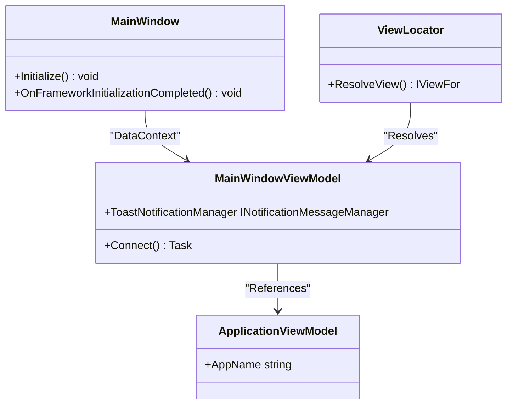
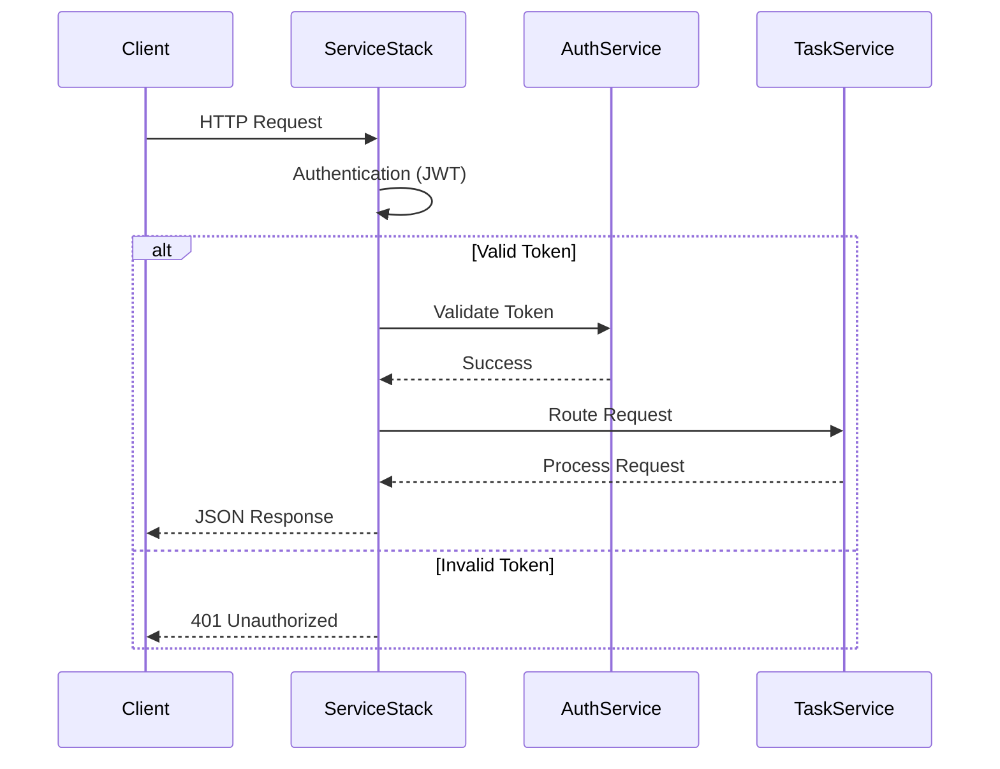
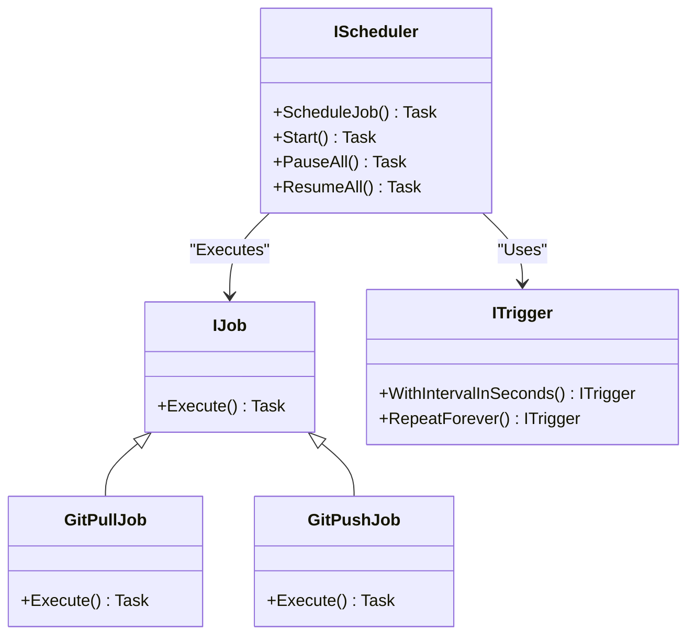
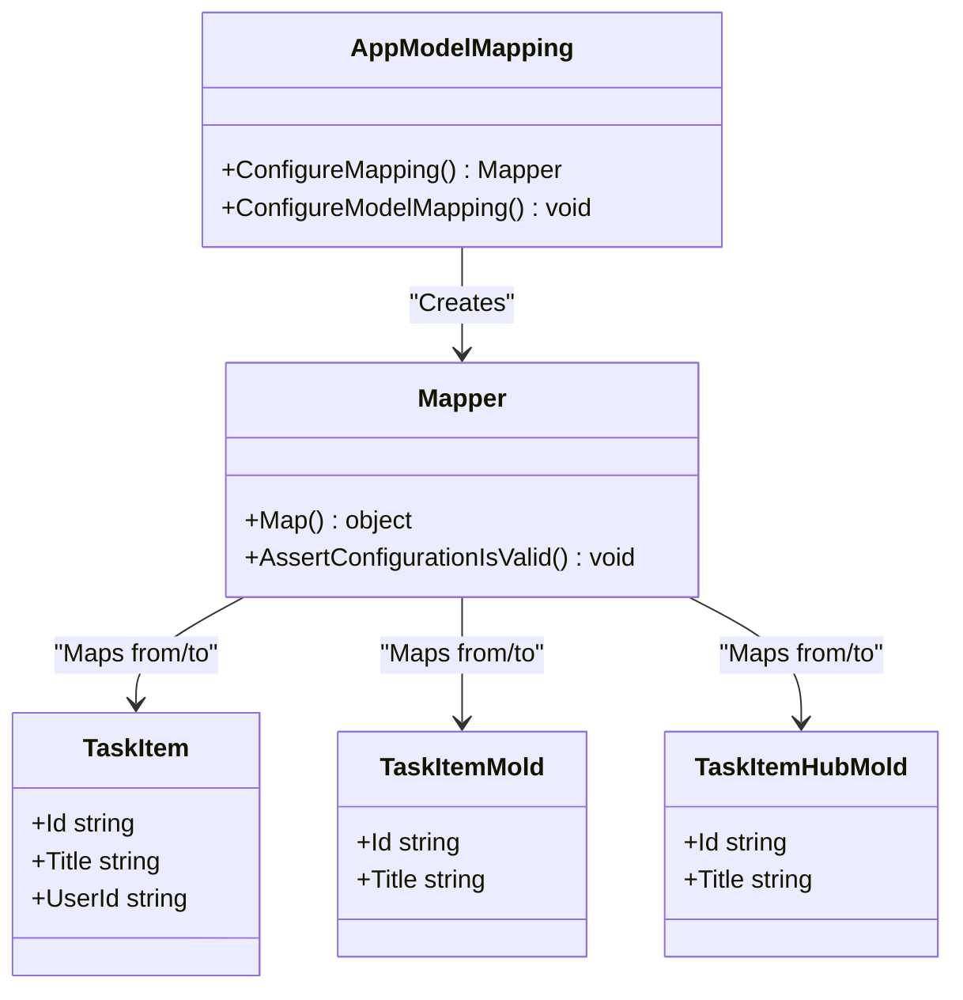
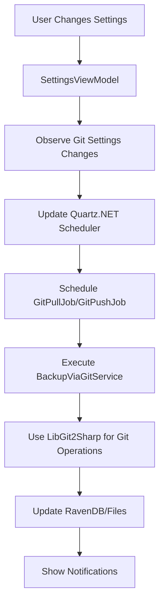

# Technology Stack

<cite>
**Referenced Files in This Document**   
- [App.axaml.cs](file://src/Unlimotion/App.axaml.cs)
- [AppModelMapping.cs](file://src/Unlimotion/AppModelMapping.cs)
- [Directory.Build.props](file://src/Directory.Build.props)
- [Unlimotion.csproj](file://src/Unlimotion/Unlimotion.csproj)
- [Unlimotion.Server.csproj](file://src/Unlimotion.Server/Unlimotion.Server.csproj)
- [Unlimotion.Desktop.csproj](file://src/Unlimotion.Desktop/Unlimotion.Desktop.csproj)
- [Program.cs](file://src/Unlimotion.Server/Program.cs)
- [AppHost.cs](file://src/Unlimotion.Server/AppHost.cs)
- [Startup.cs](file://src/Unlimotion.Server/Startup.cs)
- [TaskStorages.cs](file://src/Unlimotion/TaskStorages.cs)
- [BackupViaGitService.cs](file://src/Unlimotion.Services/BackupViaGitService.cs)
- [GitPullJob.cs](file://src/Unlimotion.Scheduling/Jobs/GitPullJob.cs)
- [nuget.config](file://src/nuget.config)
</cite>

## Table of Contents
1. [Core Technology Overview](#core-technology-overview)
2. [Primary Programming Language and Framework](#primary-programming-language-and-framework)
3. [Cross-Platform UI with AvaloniaUI](#cross-platform-ui-with-avaloniaui)
4. [Server API with ServiceStack](#server-api-with-servicestack)
5. [Document Database with RavenDB](#document-database-with-ravendb)
6. [Job Scheduling with Quartz.NET](#job-scheduling-with-quartznet)
7. [Object Mapping with AutoMapper](#object-mapping-with-automapper)
8. [Reactive Collections with DynamicData](#reactive-collections-with-dynamicdata)
9. [Dependency Management via NuGet](#dependency-management-via-nuget)
10. [Build Configuration through Directory.Build.props](#build-configuration-through-directorybuildprops)
11. [Integration Patterns and Practical Examples](#integration-patterns-and-practical-examples)
12. [Performance Considerations](#performance-considerations)
13. [Best Practices](#best-practices)

## Core Technology Overview

The Unlimotion application is built on a modern C#/.NET technology stack designed for cross-platform functionality, reactive UI patterns, and robust server-client architecture. The system leverages several key frameworks and libraries to achieve its goals of flexibility, maintainability, and performance across desktop, mobile, and web platforms.

**Section sources**
- [Unlimotion.csproj](file://src/Unlimotion/Unlimotion.csproj)
- [Unlimotion.Server.csproj](file://src/Unlimotion.Server/Unlimotion.Server.csproj)

## Primary Programming Language and Framework

Unlimotion is built using C# as the primary programming language, targeting .NET 9.0 across all components of the application. This choice provides access to modern language features, strong typing, and the extensive .NET ecosystem. The application consists of multiple projects targeting different platforms:

- **Unlimotion**: Core application logic (net9.0)
- **Unlimotion.Desktop**: Desktop application (net9.0)
- **Unlimotion.Android**: Android application (net9.0)
- **Unlimotion.iOS**: iOS application (net9.0)
- **Unlimotion.Browser**: Web application (net9.0)
- **Unlimotion.Server**: Server application (net9.0)

The use of .NET 9.0 ensures access to the latest performance improvements, language features, and security updates. The consistent target framework across projects simplifies development and maintenance while enabling code sharing through shared projects and libraries.

**Section sources**
- [Unlimotion.csproj](file://src/Unlimotion/Unlimotion.csproj)
- [Unlimotion.Desktop.csproj](file://src/Unlimotion.Desktop/Unlimotion.Desktop.csproj)
- [Unlimotion.Server.csproj](file://src/Unlimotion.Server/Unlimotion.Server.csproj)

## Cross-Platform UI with AvaloniaUI

Unlimotion utilizes AvaloniaUI as its primary UI framework, enabling true cross-platform development with a single codebase. AvaloniaUI is a modern, flexible framework that supports Windows, macOS, Linux, Android, iOS, and WebAssembly, making it ideal for Unlimotion's multi-platform requirements.

Key features of AvaloniaUI implementation in Unlimotion include:

- **XAML-based UI definition**: Views are defined in .axaml files with code-behind in .axaml.cs files
- **ReactiveUI integration**: The application uses ReactiveUI for MVVM pattern implementation and reactive programming
- **Fluent theme**: The application uses Avalonia.Themes.Fluent for a modern, consistent UI appearance
- **Compiled bindings**: Enabled by default for improved performance
- **Custom behaviors**: Implementation of custom behaviors like AutoCompleteZeroMinimumPrefixLengthDropdownBehaviour and PlannedDurationBehavior

The UI architecture follows the MVVM pattern with clear separation between views (in the Views folder), view models (in Unlimotion.ViewModel project), and domain models (in Unlimotion.Domain project).

**Diagram sources**
- [MainWindow.axaml.cs](file://src/Unlimotion/Views/MainWindow.axaml.cs)
- [MainWindowViewModel.cs](file://src/Unlimotion.ViewModel/MainWindowViewModel.cs)
- [ApplicationViewModel.cs](file://src/Unlimotion/ApplicationViewModel.cs)
- [ViewLocator.cs](file://src/Unlimotion/ViewLocator.cs)

**Section sources**
- [Unlimotion.csproj](file://src/Unlimotion/Unlimotion.csproj)
- [App.axaml.cs](file://src/Unlimotion/App.axaml.cs)
- [MainWindow.axaml.cs](file://src/Unlimotion/Views/MainWindow.axaml.cs)

## Server API with ServiceStack

The server component of Unlimotion uses ServiceStack to provide a robust, high-performance API layer. ServiceStack is chosen for its simplicity, performance, and rich feature set including authentication, validation, and API documentation.

Key aspects of the ServiceStack implementation:

- **AppHost configuration**: The AppHost class configures the ServiceStack application with custom settings
- **JWT authentication**: Implementation of JWT-based authentication with RS512 encryption
- **OpenAPI/Swagger support**: API documentation through OpenApiFeature
- **CORS configuration**: Properly configured CORS to allow cross-origin requests
- **Exception handling**: Custom exception handlers for consistent error responses

The server API follows a clean architecture with service interfaces in Unlimotion.Server.ServiceInterface and service models in Unlimotion.Server.ServiceModel, providing a clear separation between API contracts and implementation.

**Diagram sources**
- [AppHost.cs](file://src/Unlimotion.Server/AppHost.cs)
- [AuthService.cs](file://src/Unlimotion.Server.ServiceInterface/AuthService.cs)
- [TaskService.cs](file://src/Unlimotion.Server.ServiceInterface/TaskService.cs)

**Section sources**
- [AppHost.cs](file://src/Unlimotion.Server/AppHost.cs)
- [Startup.cs](file://src/Unlimotion.Server/Startup.cs)
- [Unlimotion.Server.csproj](file://src/Unlimotion.Server/Unlimotion.Server.csproj)

## Document Database with RavenDB

Unlimotion uses RavenDB as its document database for server-side storage. RavenDB is an ACID-compliant, NoSQL document database that provides excellent performance and scalability for the application's data storage needs.

The implementation uses RavenDB.Embedded, which allows the database to be embedded within the application, simplifying deployment and reducing infrastructure requirements. Key features of the RavenDB integration:

- **Embedded deployment**: RavenDB runs within the same process as the application
- **Automatic service registration**: The AddRavenDbServices extension method registers RavenDB services
- **Async document session**: Use of IAsyncDocumentSession for non-blocking database operations
- **Configuration through WritableJsonConfiguration**: Settings are managed through a custom configuration system

The database schema is designed around the domain models in Unlimotion.Domain, with collections for TaskItem, User, and other entities. RavenDB's document-oriented nature aligns well with the application's data model, allowing for flexible schema evolution.

**Section sources**
- [Program.cs](file://src/Unlimotion.Server/Program.cs)
- [Startup.cs](file://src/Unlimotion.Server/Startup.cs)
- [Unlimotion.Server.csproj](file://src/Unlimotion.Server/Unlimotion.Server.csproj)

## Job Scheduling with Quartz.NET

Unlimotion implements job scheduling functionality using Quartz.NET, a full-featured, open-source job scheduling system. Quartz.NET is used to automate background tasks such as Git synchronization for backup purposes.

Key components of the Quartz.NET implementation:

- **Scheduler initialization**: Created in App.axaml.cs using StdSchedulerFactory
- **Job definitions**: GitPullJob and GitPushJob classes implement IJob interface
- **Trigger configuration**: Jobs are scheduled based on configurable intervals
- **Dynamic rescheduling**: Ability to modify job schedules at runtime through SettingsViewModel

The job scheduling system is integrated with the application's configuration system, allowing users to control backup intervals and enable/disable automatic backups through the UI. Jobs are only scheduled when the application is in client mode (not server mode).

**Diagram sources**
- [App.axaml.cs](file://src/Unlimotion/App.axaml.cs)
- [GitPullJob.cs](file://src/Unlimotion.Scheduling/Jobs/GitPullJob.cs)
- [TaskStorages.cs](file://src/Unlimotion/TaskStorages.cs)

**Section sources**
- [App.axaml.cs](file://src/Unlimotion/App.axaml.cs)
- [GitPullJob.cs](file://src/Unlimotion.Scheduling/Jobs/GitPullJob.cs)
- [TaskStorages.cs](file://src/Unlimotion/TaskStorages.cs)

## Object Mapping with AutoMapper

Unlimotion uses AutoMapper to handle object-to-object mapping between different layers of the application. This is particularly important in the application's architecture, which has distinct models for different concerns:

- **Domain models**: In Unlimotion.Domain project (e.g., TaskItem, User)
- **Service models**: In Unlimotion.Server.ServiceModel (e.g., TaskItemMold, UserProfileMold)
- **Hub models**: In Unlimotion.Interface (e.g., TaskItemHubMold, ReceiveTaskItem)

AutoMapper is configured in the AppModelMapping class, which defines the mapping profiles between these different model types. The configuration includes:

- **Two-way mappings**: Using ReverseMap() for bidirectional conversions
- **Property ignoring**: Selectively ignoring properties that should not be mapped
- **Member configuration**: Customizing how specific members are mapped

The mapper instance is registered with the Splat dependency injection container and made available throughout the application via Locator.Current.GetService<IMapper>().

**Diagram sources**
- [AppModelMapping.cs](file://src/Unlimotion/AppModelMapping.cs)
- [TaskItem.cs](file://src/Unlimotion.Domain/TaskItem.cs)
- [TaskItemMold.cs](file://src/Unlimotion.Server.ServiceModel/Molds/Tasks/TaskItemPage.cs)

**Section sources**
- [AppModelMapping.cs](file://src/Unlimotion/AppModelMapping.cs)
- [App.axaml.cs](file://src/Unlimotion/App.axaml.cs)

## Reactive Collections with DynamicData

While not explicitly referenced in the project files, Unlimotion's use of ReactiveUI implies the use of reactive programming patterns and likely DynamicData for managing collections. ReactiveUI is a MVVM framework that provides reactive extensions for UI development, enabling:

- **Reactive commands**: Commands that can observe changes and update their execution state
- **Observable properties**: Properties that emit change notifications
- **WhenAnyValue**: Observing changes to properties across objects
- **BindTo**: Reactive binding between properties

The application uses these patterns extensively, particularly in the view models which inherit from ReactiveObject. This enables a responsive UI that automatically updates when underlying data changes, without the need for manual event handling.

**Section sources**
- [MainWindowViewModel.cs](file://src/Unlimotion.ViewModel/MainWindowViewModel.cs)
- [SettingsViewModel.cs](file://src/Unlimotion.ViewModel/SettingsViewModel.cs)
- [TaskItemViewModel.cs](file://src/Unlimotion.ViewModel/TaskItemViewModel.cs)

## Dependency Management via NuGet

Unlimotion uses NuGet as its package manager for third-party dependencies. The dependency management strategy includes:

- **Centralized version management**: Using Directory.Build.props to define common package versions
- **Project-specific dependencies**: Each project references only the packages it needs
- **Version ranges**: Using version ranges (e.g., 11.*) for some packages to allow patch updates
- **Configuration file**: nuget.config specifies the package sources

The Directory.Build.props file defines common properties for all projects, including the Avalonia version, which is set to 11.* for all projects. This ensures consistency across the solution while allowing for patch updates without modifying each project file.

Package references are organized by project type:
- **Client projects**: Reference Avalonia packages, ReactiveUI, and client-specific packages
- **Server projects**: Reference ServiceStack, RavenDB, and server-specific packages
- **Shared projects**: Reference only core packages like AutoMapper

**Section sources**
- [Directory.Build.props](file://src/Directory.Build.props)
- [nuget.config](file://src/nuget.config)
- [Unlimotion.csproj](file://src/Unlimotion/Unlimotion.csproj)
- [Unlimotion.Server.csproj](file://src/Unlimotion.Server/Unlimotion.Server.csproj)

## Build Configuration through Directory.Build.props

The Unlimotion solution uses Directory.Build.props for centralized build configuration. This MSBuild feature allows common properties to be defined once and applied to all projects in the directory tree.

Key configurations in Directory.Build.props:
- **Nullable context**: Enabled globally for better null safety
- **Avalonia version**: Defined as 11.* for consistent versioning
- **Avalonia Android version**: Also set to 11.*

This approach reduces duplication and ensures consistency across the solution. When a package version needs to be updated, it can be changed in a single location rather than in each project file.

The use of Directory.Build.props is a best practice for multi-project solutions, making maintenance easier and reducing the risk of version inconsistencies.

**Section sources**
- [Directory.Build.props](file://src/Directory.Build.props)

## Integration Patterns and Practical Examples

The Unlimotion technology stack components work together through well-defined integration patterns. These patterns ensure loose coupling, testability, and maintainability across the application.

### Configuration and Initialization Pattern

The application follows a consistent pattern for configuration and initialization, particularly evident in the App class:

1. **Configuration loading**: Using WritableJsonConfigurationFabric to load settings
2. **Service registration**: Registering services with the Splat dependency container
3. **Mapper configuration**: Setting up AutoMapper with the required mappings
4. **Scheduler initialization**: Creating and configuring the Quartz.NET scheduler

This pattern ensures that all dependencies are available before the application starts processing user requests.

### Git Backup Integration

A practical example of technology integration is the Git backup functionality:

**Diagram sources**
- [TaskStorages.cs](file://src/Unlimotion/TaskStorages.cs)
- [BackupViaGitService.cs](file://src/Unlimotion.Services/BackupViaGitService.cs)
- [GitPullJob.cs](file://src/Unlimotion.Scheduling/Jobs/GitPullJob.cs)

**Section sources**
- [TaskStorages.cs](file://src/Unlimotion/TaskStorages.cs)
- [BackupViaGitService.cs](file://src/Unlimotion.Services/BackupViaGitService.cs)

### Data Flow Pattern

The application follows a consistent data flow pattern from server to client:

1. **Server receives request** via ServiceStack endpoint
2. **Data retrieved** from RavenDB document database
3. **Data transformed** using AutoMapper from domain models to service models
4. **Response sent** to client
5. **Client receives data** and maps to view models using AutoMapper
6. **UI updated** through reactive bindings

This pattern ensures data consistency and type safety throughout the application.

**Section sources**
- [AppModelMapping.cs](file://src/Unlimotion/AppModelMapping.cs)
- [TaskService.cs](file://src/Unlimotion.Server.ServiceInterface/TaskService.cs)
- [MainWindowViewModel.cs](file://src/Unlimotion.ViewModel/MainWindowViewModel.cs)

## Performance Considerations

The Unlimotion technology stack has been selected with performance considerations in mind:

- **AvaloniaUI**: Compiled bindings and efficient rendering pipeline minimize UI overhead
- **ServiceStack**: High-performance API framework with minimal overhead
- **RavenDB**: Embedded document database with excellent read/write performance
- **Quartz.NET**: Efficient job scheduling with minimal resource usage
- **AutoMapper**: Compiled mappings for fast object-to-object conversion

Additional performance optimizations include:
- **Lazy loading**: Data is loaded only when needed
- **Background processing**: Long-running operations are performed on background threads
- **Caching**: Strategic use of in-memory caching for frequently accessed data
- **Batch operations**: Database operations are batched when possible

The use of reactive programming patterns also contributes to performance by eliminating unnecessary UI updates and ensuring that computations are only performed when data changes.

**Section sources**
- [App.axaml.cs](file://src/Unlimotion/App.axaml.cs)
- [TaskStorages.cs](file://src/Unlimotion/TaskStorages.cs)
- [BackupViaGitService.cs](file://src/Unlimotion.Services/BackupViaGitService.cs)

## Best Practices

The Unlimotion codebase demonstrates several best practices in modern C#/.NET development:

### Separation of Concerns

The application follows a clean architecture with clear separation between:
- **UI layer**: Avalonia views and ReactiveUI view models
- **Business logic**: Domain models and services
- **Data access**: RavenDB and file storage
- **Infrastructure**: Configuration, logging, and utilities

### Dependency Injection

Extensive use of the Splat dependency injection framework ensures loose coupling and testability. Services are registered in the App class and retrieved using Locator.Current.GetService<T>().

### Configuration Management

The use of WritableJsonConfiguration allows for runtime configuration changes that are persisted to disk, providing a better user experience.

### Error Handling

Comprehensive error handling is implemented at multiple levels:
- **ServiceStack exception handlers**: Global handling of service exceptions
- **Quartz.NET job error handling**: Robust error handling in scheduled jobs
- **UI error notifications**: User-friendly error messages through the notification system

### Testing

While not directly visible in the provided code, the architecture supports testing through:
- **Dependency injection**: Easy mocking of services
- **Separation of concerns**: Isolated components that can be tested independently
- **Reactive programming**: Deterministic behavior that is easier to test

These best practices contribute to a maintainable, scalable, and robust application architecture.

**Section sources**
- [App.axaml.cs](file://src/Unlimotion/App.axaml.cs)
- [AppHost.cs](file://src/Unlimotion.Server/AppHost.cs)
- [TaskStorages.cs](file://src/Unlimotion/TaskStorages.cs)
- [BackupViaGitService.cs](file://src/Unlimotion.Services/BackupViaGitService.cs)