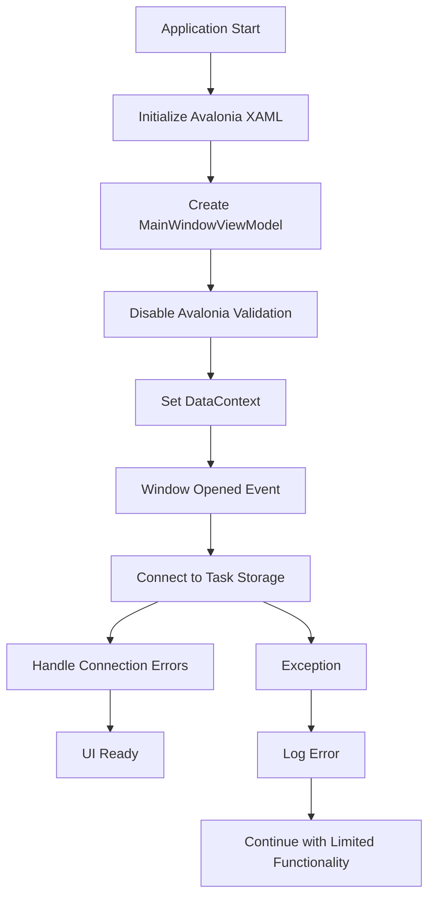
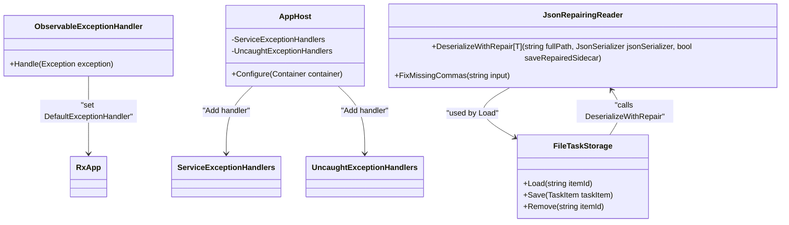
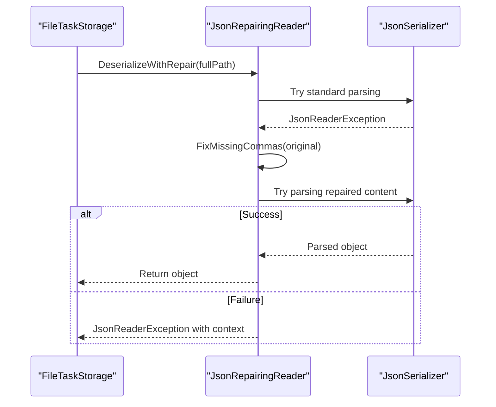
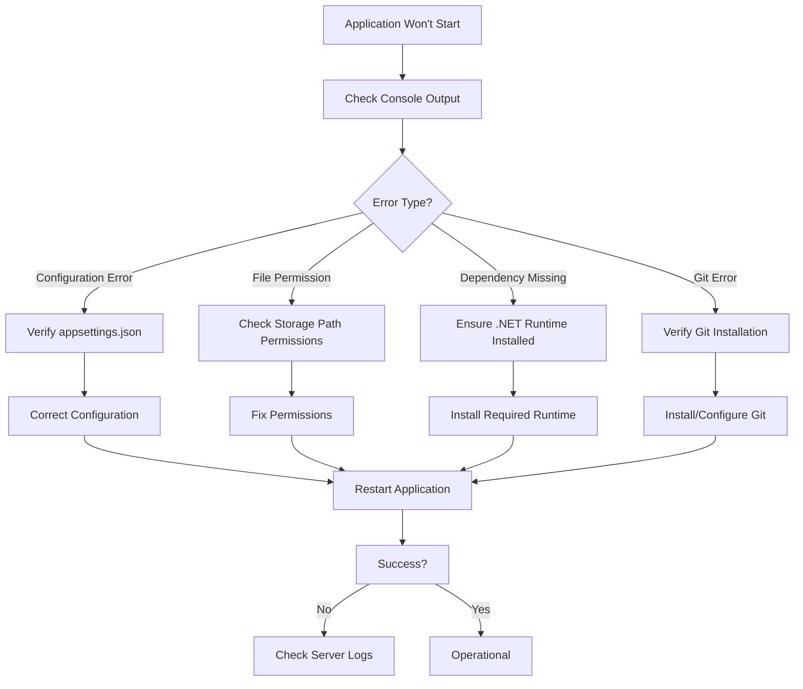
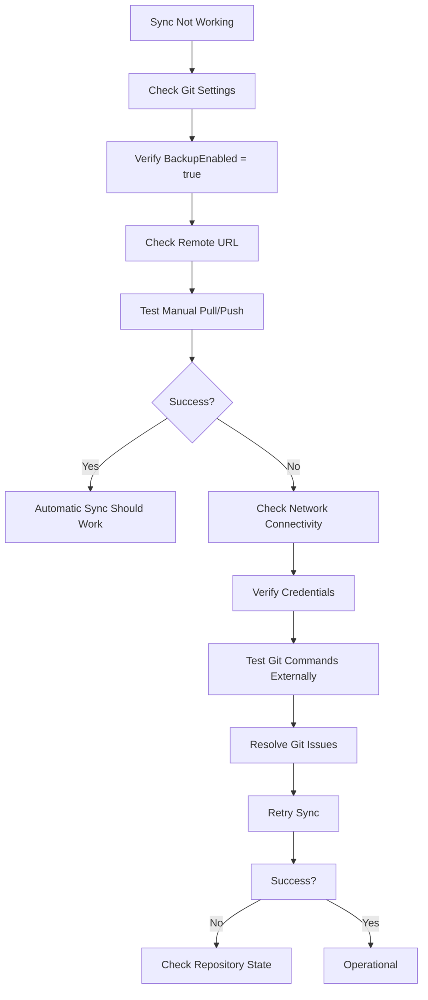
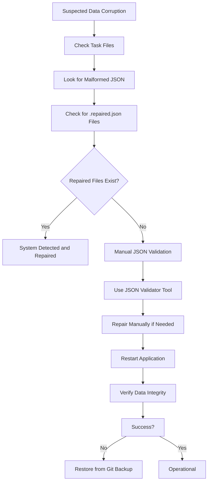

# Troubleshooting

<cite>
**Referenced Files in This Document**   
- [App.axaml.cs](file://src/Unlimotion/App.axaml.cs)
- [FileTaskStorage.cs](file://src/Unlimotion/FileTaskStorage.cs)
- [Program.cs](file://src/Unlimotion.Server/Program.cs)
- [AppHost.cs](file://src/Unlimotion.Server/AppHost.cs)
- [Startup.cs](file://src/Unlimotion.Server/Startup.cs)
- [JsonCommaFixer.cs](file://src/Unlimotion/JsonCommaFixer.cs)
- [TaskStorages.cs](file://src/Unlimotion/TaskStorages.cs)
- [GitPullJob.cs](file://src/Unlimotion/Scheduling/Jobs/GitPullJob.cs)
- [GitPushJob.cs](file://src/Unlimotion/Scheduling/Jobs/GitPushJob.cs)
- [ClientSettings.cs](file://src/Unlimotion/ClientSettings.cs)
- [ObservableExceptionHandler.cs](file://src/Unlimotion.ViewModel/ObservableExceptionHandler.cs)
</cite>

## Table of Contents
1. [Common Issues and Solutions](#common-issues-and-solutions)
2. [Diagnostic Techniques](#diagnostic-techniques)
3. [Error Message Interpretation](#error-message-interpretation)
4. [Recovery Procedures](#recovery-procedures)
5. [Platform-Specific Issues](#platform-specific-issues)
6. [Troubleshooting Workflows](#troubleshooting-workflows)
7. [Preventive Measures](#preventive-measures)

## Common Issues and Solutions

### Startup Failures
Startup failures in Unlimotion typically occur due to configuration issues, missing dependencies, or file system permissions. The application uses a dependency injection container (Splat) to manage services, and failures during initialization can prevent the application from launching.

Common causes include:
- Missing or malformed configuration files (appsettings.json)
- Incorrect task storage path configuration
- RavenDB connection failures on the server side
- Git repository initialization issues when backup is enabled

The server application implements structured exception handling in Program.cs, where unhandled exceptions during startup are logged using Serilog before the process terminates with exit code 1.

**Section sources**
- [App.axaml.cs](file://src/Unlimotion/App.axaml.cs#L1-L232)
- [Program.cs](file://src/Unlimotion.Server/Program.cs#L1-L50)

### Connection Errors
Connection errors primarily occur when the client cannot establish communication with the server. The application supports both server mode (using ServerTaskStorage) and local file storage mode.

Common connection issues include:
- Invalid server URL configuration
- Authentication token expiration
- Network connectivity problems
- SSL/TLS handshake failures when secure connection is required

The AuthService in the server component handles authentication using JWT tokens with RS512 encryption. The RequireSecureConnection setting in the Security configuration determines whether HTTPS is mandatory.

**Section sources**
- [AppHost.cs](file://src/Unlimotion.Server/AppHost.cs#L1-L122)
- [Startup.cs](file://src/Unlimotion.Server/Startup.cs#L1-L63)

### Synchronization Problems
Synchronization issues arise from the Git-based backup system that runs on a scheduled basis using Quartz.NET. The GitPullJob and GitPushJob classes handle automatic synchronization at configurable intervals.

Common synchronization problems:
- Conflicting changes between local and remote repositories
- Authentication failures for Git operations
- Network timeouts during push/pull operations
- File locking issues during concurrent access

The BackupViaGitService handles repository cloning, pulling, and pushing operations, with error handling that allows the application to continue functioning even when synchronization fails.

**Section sources**
- [GitPullJob.cs](file://src/Unlimotion.Scheduling/Jobs/GitPullJob.cs#L1-L20)
- [GitPushJob.cs](file://src/Unlimotion.Scheduling/Jobs/GitPushJob.cs#L1-L21)
- [TaskStorages.cs](file://src/Unlimotion/TaskStorages.cs#L1-L224)

### UI Rendering Issues
UI rendering problems in Unlimotion are typically related to the Avalonia UI framework and data binding. The application uses ReactiveUI for MVVM pattern implementation and observable property changes.

Common UI issues:
- Data binding failures due to missing DataContext
- Threading issues when updating UI from background operations
- Layout rendering problems on different screen resolutions
- Theme/application lifecycle issues on desktop platforms

The application disables Avalonia's built-in data annotation validation to prevent conflicts with the CommunityToolkit, which could otherwise cause validation-related rendering issues.

**Diagram sources**
- [App.axaml.cs](file://src/Unlimotion/App.axaml.cs#L1-L232)

**Section sources**
- [App.axaml.cs](file://src/Unlimotion/App.axaml.cs#L1-L232)
- [MainWindowViewModel.cs](file://src/Unlimotion.ViewModel/MainWindowViewModel.cs#L1-L50)

## Diagnostic Techniques

### Log File Analysis
Unlimotion uses multiple logging mechanisms depending on the component:

- **Server-side**: Serilog for structured logging with configuration from appsettings.json
- **Client-side**: Console output and in-memory exception handling
- **ServiceStack**: Built-in logging for API requests and exceptions

Key log locations:
- Server logs: Standard output when running via start-server.cmd
- Client logs: Console output during development
- Exception details: Captured in ServiceExceptionHandlers and UncaughtExceptionHandlers

The AppHost class configures exception handling that captures both service-level exceptions and unhandled exceptions, ensuring comprehensive error logging.

### Exception Handling Patterns
The application implements a multi-layered exception handling strategy:

1. **Global exception handler**: Set via RxApp.DefaultExceptionHandler in App.axaml.cs
2. **ServiceStack exception handlers**: Configured in AppHost for API endpoints
3. **Task storage error handling**: Individual try-catch blocks in file operations
4. **JSON parsing recovery**: JsonCommaFixer provides automatic repair of malformed JSON

The ObservableExceptionHandler captures reactive exceptions, while the ServiceStack configuration ensures API exceptions are properly formatted and logged.

**Diagram sources**
- [App.axaml.cs](file://src/Unlimotion/App.axaml.cs#L1-L232)
- [AppHost.cs](file://src/Unlimotion.Server/AppHost.cs#L1-L122)
- [JsonCommaFixer.cs](file://src/Unlimotion/JsonCommaFixer.cs#L1-L245)
- [FileTaskStorage.cs](file://src/Unlimotion/FileTaskStorage.cs#L1-L419)

**Section sources**
- [App.axaml.cs](file://src/Unlimotion/App.axaml.cs#L1-L232)
- [AppHost.cs](file://src/Unlimotion.Server/AppHost.cs#L1-L122)
- [JsonCommaFixer.cs](file://src/Unlimotion/JsonCommaFixer.cs#L1-L245)

### Debugging Tools
The application provides several debugging capabilities:

- **Live reloading**: When compiled in DEBUG mode with LIVE symbol, enables hot reloading of XAML
- **ServiceStack Admin UI**: Accessible via OpenApiFeature for API inspection
- **Quartz.NET scheduler**: Provides visibility into scheduled jobs (Git sync operations)
- **RavenDB Studio**: Database management and inspection tool

Development-time debugging is enhanced by the use of WritableJsonConfiguration, which allows runtime modification of configuration settings.

## Error Message Interpretation

### Server Application Errors
Server-side error messages follow ServiceStack's HTTP error format:

- **Status codes**: Mapped from exception types via MapExceptionToStatusCode
- **CryptographicException**: Returns 401 Unauthorized
- **Validation errors**: Handled by ValidationFeature plugin
- **Custom error formatting**: ServiceExceptionHandlers return HttpError objects

The UncaughtExceptionHandlers ensure that even unhandled exceptions result in proper HTTP status codes rather than generic 500 errors.

### Client Application Errors
Client-side error messages are less structured but can be interpreted through:

- **Console output**: Direct exception printing via RxApp.DefaultExceptionHandler
- **Toast notifications**: Success messages for operations like storage connection
- **Silent failures**: Some exceptions are caught without user notification (marked with TODO in code)

Authentication errors are typically related to token expiration or invalid credentials, with tokens having a 1-day lifespan and refresh tokens valid for 30 days.

### JSON Parsing Errors
The application includes sophisticated JSON error recovery through JsonRepairingReader:

1. Attempt standard JSON parsing
2. On failure, invoke FixMissingCommas to repair common syntax errors
3. Retry parsing with repaired content
4. If still failing, throw detailed exception with file context

The FixMissingCommas algorithm handles missing commas between array elements and object properties by tracking parsing context and inserting commas where syntactically appropriate.

**Diagram sources**
- [JsonCommaFixer.cs](file://src/Unlimotion/JsonCommaFixer.cs#L1-L245)
- [FileTaskStorage.cs](file://src/Unlimotion/FileTaskStorage.cs#L1-L419)

**Section sources**
- [JsonCommaFixer.cs](file://src/Unlimotion/JsonCommaFixer.cs#L1-L245)

## Recovery Procedures

### Data Corruption Recovery
The application has built-in protection against JSON data corruption:

- **Automatic repair**: FixMissingCommas handles missing commas in JSON files
- **Sidecar files**: Optionally save repaired JSON as .repaired.json files
- **File migration**: FileTaskMigrator handles schema migrations and data repair

When a JSON file cannot be parsed, the system attempts repair before falling back to skipping the file and continuing with others.

### Synchronization Conflict Resolution
Git-based synchronization conflicts are handled through:

- **Automatic pull before push**: Reduces likelihood of push conflicts
- **Manual conflict resolution**: Users can use external Git tools to resolve conflicts
- **Backup command**: Allows manual backup via SettingsViewModel.BackupCommand

The system does not automatically resolve merge conflicts but prevents data loss by maintaining the Git repository history.

### Authentication Recovery
Authentication issues can be resolved through:

- **Token refresh**: Using RefreshToken when AccessToken expires
- **Re-authentication**: Logging in again to obtain new tokens
- **Configuration reset**: Clearing ClientSettings values

The JWT authentication system uses encrypted tokens with a 1-day expiration policy.

## Platform-Specific Issues

### Windows
Windows-specific considerations:

- **File path handling**: Uses standard Windows path separators
- **Service installation**: Can be run as a Windows service
- **Git integration**: Relies on Git for Windows installation
- **Startup scripts**: start-server.cmd and start-client.cmd for easy launching

### macOS
macOS considerations:

- **Permissions**: May require explicit file system permissions
- **Launch scripts**: run.macos.sh for starting the application
- **Application bundle**: Built as .app bundle for native integration
- **Keychain integration**: Potential for secure credential storage

### Linux
Linux considerations:

- **Shell scripts**: run.linux.sh for starting the application
- **Package formats**: DEB packages supported via build scripts
- **Permissions**: File ownership and execute permissions
- **Systemd services**: Potential for service integration

The cross-platform nature of Avalonia and .NET allows consistent behavior across platforms, with platform-specific build configurations in the .csproj files.

**Section sources**
- [run.windows.cmd](file://run.windows.cmd#L1-L10)
- [run.macos.sh](file://run.macos.sh#L1-L10)
- [run.linux.sh](file://run.linux.sh#L1-L10)

## Troubleshooting Workflows

### Startup Failure Workflow

### Synchronization Problem Workflow

### Data Corruption Workflow

## Preventive Measures

### Configuration Best Practices
- Always backup appsettings.json before modifications
- Use relative paths for task storage when possible
- Regularly update Git remote URL and credentials
- Monitor disk space for task storage directory

### Regular Maintenance
- Periodically run ResaveCommand to normalize JSON files
- Perform manual backups using BackupCommand
- Monitor Git repository health
- Keep client and server versions synchronized

### Monitoring and Alerts
- Implement external monitoring of server process
- Set up alerts for failed synchronization
- Regularly check log files for recurring errors
- Monitor file system for storage issues

The application's design emphasizes resilience through automatic error recovery, structured logging, and multiple layers of exception handling, minimizing the impact of individual component failures on overall system stability.

**Section sources**
- [TaskStorages.cs](file://src/Unlimotion/TaskStorages.cs#L1-L224)
- [App.axaml.cs](file://src/Unlimotion/App.axaml.cs#L1-L232)
- [Program.cs](file://src/Unlimotion.Server/Program.cs#L1-L50)