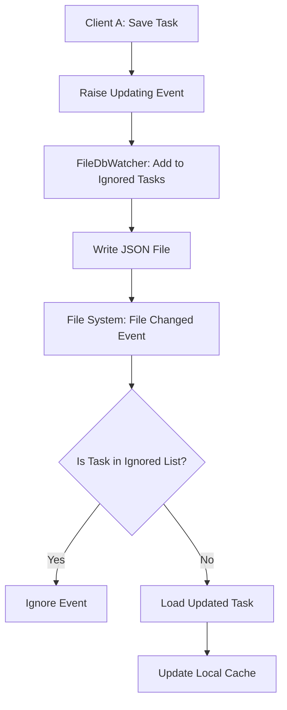
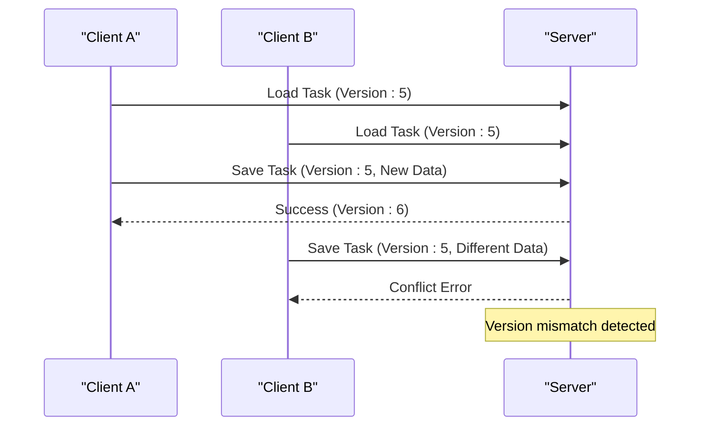
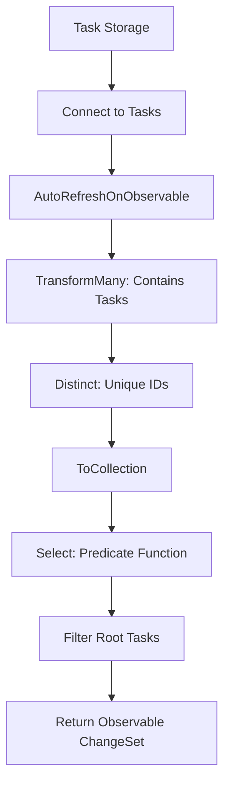
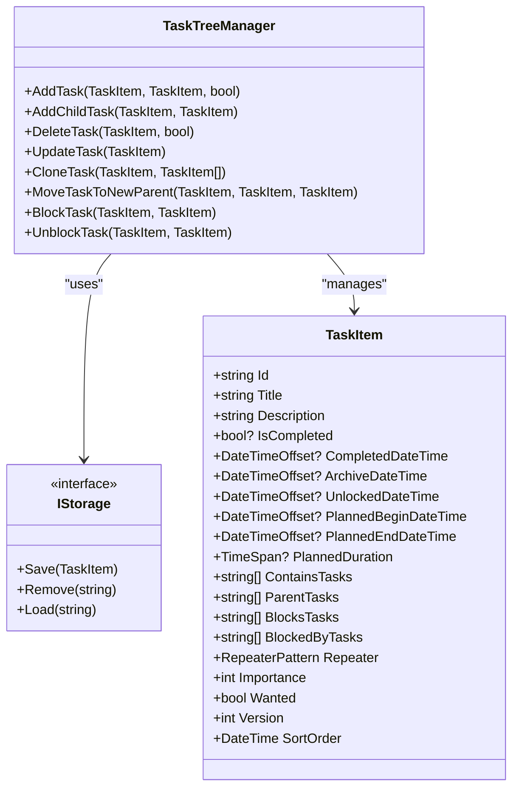
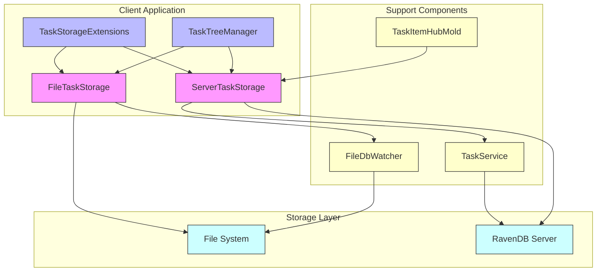

# Concurrent Modification Handling

<cite>
**Referenced Files in This Document**   
- [FileTaskStorage.cs](file://src/Unlimotion/FileTaskStorage.cs)
- [ServerTaskStorage.cs](file://src/Unlimotion/ServerTaskStorage.cs)
- [TaskStorageExtensions.cs](file://src/Unlimotion/TaskStorageExtensions.cs)
- [TaskItemHubMold.cs](file://src/Unlimotion.Interface/TaskItemHubMold.cs)
- [FileDbWatcher.cs](file://src/Unlimotion.ViewModel/FileDbWatcher.cs)
- [TaskTreeManager.cs](file://src/Unlimotion.TaskTreeManager/TaskTreeManager.cs)
- [StartupExtensions.cs](file://src/Unlimotion.Server/StartupExtensions.cs)
- [TaskService.cs](file://src/Unlimotion.Server.ServiceInterface/TaskService.cs)
</cite>

## Table of Contents
1. [Introduction](#introduction)
2. [File-Based Storage Concurrency](#file-based-storage-concurrency)
3. [Server-Based Storage Concurrency](#server-based-storage-concurrency)
4. [Task Storage Extensions](#task-storage-extensions)
5. [Conflict Detection and Resolution](#conflict-detection-and-resolution)
6. [User Experience During Conflicts](#user-experience-during-conflicts)
7. [Best Practices for Conflict-Resistant Workflows](#best-practices-for-conflict-resistant-workflows)
8. [Architecture Overview](#architecture-overview)

## Introduction
Unlimotion's task storage system implements robust mechanisms to handle concurrent modifications across both file-based and server-based storage backends. The system ensures data integrity when multiple clients or processes attempt to modify tasks simultaneously. This document details the concurrency control strategies employed by FileTaskStorage for JSON file storage and ServerTaskStorage for RavenDB-based server storage, including file locking mechanisms, versioning, and optimistic concurrency control. The implementation prevents data loss and provides mechanisms for conflict detection and resolution.

## File-Based Storage Concurrency

Unlimotion's FileTaskStorage handles concurrent modifications through a combination of file system monitoring and application-level coordination. The system uses a FileSystemWatcher-based FileDbWatcher to detect external changes to task files, enabling real-time synchronization across multiple processes or clients accessing the same file storage location.

The FileTaskStorage implements a simple but effective concurrency model where file operations are coordinated through the FileDbWatcher component. When a task is saved, the system raises an Updating event that notifies the FileDbWatcher to temporarily ignore subsequent change notifications for that specific file, preventing infinite update loops. This is implemented through the AddIgnoredTask method which adds the task to a memory cache of recently updated tasks.

**Diagram sources**
- [FileTaskStorage.cs](file://src/Unlimotion/FileTaskStorage.cs#L350-L378)
- [FileDbWatcher.cs](file://src/Unlimotion.ViewModel/FileDbWatcher.cs#L118-L152)

The system does not implement explicit file locking at the operating system level. Instead, it relies on the atomic nature of file write operations and the event queuing mechanism to handle concurrent access. When multiple processes attempt to modify the same task, the last write typically wins, but the FileDbWatcher ensures that all clients eventually converge to the same state by propagating changes through the event system.

**Section sources**
- [FileTaskStorage.cs](file://src/Unlimotion/FileTaskStorage.cs#L350-L378)
- [FileDbWatcher.cs](file://src/Unlimotion.ViewModel/FileDbWatcher.cs#L0-L36)

## Server-Based Storage Concurrency

The ServerTaskStorage implements a more sophisticated concurrency control mechanism using RavenDB's built-in optimistic concurrency features. Unlike the file-based storage, the server-based approach uses ETags (entity tags) and version numbers to detect and prevent conflicting modifications.

The TaskItemHubMold class includes a Version property that serves as a concurrency token. Each time a task is updated on the server, the version number is incremented. When a client attempts to save changes, the server compares the version number in the request with the current version in the database. If they don't match, it indicates that another client has modified the task in the meantime, and the server can reject the update to prevent data loss.

**Diagram sources**
- [ServerTaskStorage.cs](file://src/Unlimotion/ServerTaskStorage.cs#L550-L580)
- [TaskItemHubMold.cs](file://src/Unlimotion.Interface/TaskItemHubMold.cs#L28)

The ServerTaskStorage also implements connection resilience with automatic reconnection logic. When the connection to the server is lost, the client automatically attempts to reconnect with exponential backoff, ensuring that temporary network issues don't result in permanent disconnection. This is particularly important for handling concurrent modifications in unreliable network conditions.

RavenDB's revision system, configured in StartupExtensions.cs, provides additional protection against data loss by maintaining historical versions of documents. This allows administrators to recover from accidental deletions or problematic updates, serving as a safety net for concurrency-related issues.

**Section sources**
- [ServerTaskStorage.cs](file://src/Unlimotion/ServerTaskStorage.cs#L550-L580)
- [TaskItemHubMold.cs](file://src/Unlimotion.Interface/TaskItemHubMold.cs#L28)
- [StartupExtensions.cs](file://src/Unlimotion.Server/StartupExtensions.cs#L101-L115)

## Task Storage Extensions

The TaskStorageExtensions class provides utility methods that help manage task relationships in a thread-safe manner. The GetRoots extension method uses Reactive Extensions (Rx) to create observable filters that automatically update when task relationships change, ensuring that UI components always display the correct hierarchy.

**Diagram sources**
- [TaskStorageExtensions.cs](file://src/Unlimotion/TaskStorageExtensions.cs#L7-L34)

The extension uses DynamicData library features to create a reactive pipeline that automatically recalculates which tasks should be considered "roots" (tasks not contained by any other task) whenever task relationships change. This approach avoids race conditions that could occur if the root calculation were performed imperatively at specific points in time.

The implementation is designed to handle concurrent modifications gracefully by leveraging the observable pattern. When multiple tasks are updated simultaneously, the reactive pipeline processes the changes as a batch, ensuring consistent state across related tasks.

**Section sources**
- [TaskStorageExtensions.cs](file://src/Unlimotion/TaskStorageExtensions.cs#L7-L34)

## Conflict Detection and Resolution

Unlimotion employs different conflict detection strategies for its two storage backends, reflecting the different capabilities and constraints of file-based versus server-based storage.

For file-based storage, conflict detection is primarily reactive rather than preventive. The system relies on the FileDbWatcher to detect when a task file has been modified by another process. When a change is detected, the system loads the updated task and propagates it through the application's reactive data flow system. This approach follows a "last write wins" policy, with the caveat that clients are notified of external changes and can refresh their views accordingly.

The server-based storage implements proactive conflict detection using optimistic concurrency control. The version number in the TaskItemHubMold serves as a concurrency token that prevents clients from overwriting changes made by others. When a client attempts to save a task with an outdated version number, the server rejects the update, forcing the client to resolve the conflict.

The TaskTreeManager plays a crucial role in conflict resolution by managing the complex relationships between tasks. When a task is updated, the TaskTreeManager recalculates availability and other derived properties for related tasks, ensuring that the entire task graph remains consistent even when multiple tasks are modified concurrently.

**Diagram sources**
- [TaskTreeManager.cs](file://src/Unlimotion.TaskTreeManager/TaskTreeManager.cs#L43-L80)
- [TaskItemHubMold.cs](file://src/Unlimotion.Interface/TaskItemHubMold.cs#L7-L28)

The system also handles conflicts that arise from Git-based backup operations. The BackupViaGitService integrates with the FileDbWatcher to force update notifications when files are modified during Git operations, ensuring that the application remains synchronized with the file system state even when changes are made outside the normal application workflow.

**Section sources**
- [TaskTreeManager.cs](file://src/Unlimotion.TaskTreeManager/TaskTreeManager.cs#L43-L80)
- [TaskService.cs](file://src/Unlimotion.Server.ServiceInterface/TaskService.cs#L0-L39)

## User Experience During Conflicts

The user experience when conflicts are detected varies between the file-based and server-based storage implementations, reflecting the different technical constraints of each approach.

With file-based storage, users typically don't receive explicit conflict notifications. Instead, the system silently synchronizes changes from other processes or clients through the FileDbWatcher mechanism. When a task is modified externally, the application automatically reloads the updated version, and the user interface reflects the changes. This seamless synchronization provides a smooth user experience but offers limited visibility into concurrent modifications.

In contrast, the server-based storage provides more explicit feedback when conflicts occur. When a user attempts to save changes to a task that has been modified by another user, the system detects the version mismatch and can notify the user of the conflict. This allows users to review the conflicting changes and decide how to proceed, either by overwriting the other user's changes or by incorporating them into their own.

The application's reactive architecture ensures that users always see the most up-to-date information, even when working offline. When connectivity is restored, the system synchronizes changes with the server, resolving conflicts according to the configured concurrency policy.

For both storage types, the system prevents data loss by ensuring that all modifications are properly persisted and that no changes are silently overwritten without detection. The combination of file system monitoring for local storage and version-based concurrency control for server storage provides robust protection against data loss in collaborative environments.

**Section sources**
- [ServerTaskStorage.cs](file://src/Unlimotion/ServerTaskStorage.cs#L550-L580)
- [FileDbWatcher.cs](file://src/Unlimotion.ViewModel/FileDbWatcher.cs#L0-L36)

## Best Practices for Conflict-Resistant Workflows

To design conflict-resistant workflows in Unlimotion, consider the following best practices:

1. **Use Server Storage for Collaboration**: For teams working on shared tasks, use the server-based storage rather than file-based storage. The server implementation provides superior conflict detection and resolution capabilities through versioning and ETags.

2. **Minimize Long-Running Transactions**: Keep task editing sessions as short as possible to reduce the window for conflicts. The longer a task remains open for editing, the higher the probability of conflicting modifications by other users.

3. **Leverage Task Relationships**: Use parent-child and blocking relationships to structure work in a way that minimizes contention. When tasks are properly organized in a hierarchy, users are more likely to work on different parts of the task tree, reducing the likelihood of conflicts.

4. **Implement Regular Synchronization**: For file-based storage, ensure that all clients synchronize frequently. The FileDbWatcher provides real-time updates, but network latency or system sleep states can delay synchronization.

5. **Design for Eventual Consistency**: Recognize that the file-based storage model follows an eventual consistency pattern rather than strong consistency. Design workflows that can tolerate temporary inconsistencies, knowing that the system will converge to a consistent state.

6. **Use Descriptive Task Titles**: Clear, descriptive task titles help users understand what each task represents, making it easier to resolve conflicts when they do occur. When multiple users modify the same task, clear titles provide context for understanding the intent behind each change.

7. **Monitor Version Numbers**: For server-based storage, monitor the version numbers of frequently modified tasks. Rapidly increasing version numbers may indicate that a task is a contention point that should be broken down into smaller, more focused tasks.

8. **Plan for Offline Work**: The architecture supports offline work with automatic synchronization when connectivity is restored. Design workflows that accommodate intermittent connectivity, especially for mobile users.

These practices help ensure that teams can collaborate effectively while minimizing the impact of concurrent modifications on productivity and data integrity.

## Architecture Overview

The concurrent modification handling system in Unlimotion consists of multiple interconnected components that work together to ensure data consistency across different storage backends.

**Diagram sources**
- [FileTaskStorage.cs](file://src/Unlimotion/FileTaskStorage.cs)
- [ServerTaskStorage.cs](file://src/Unlimotion/ServerTaskStorage.cs)
- [TaskTreeManager.cs](file://src/Unlimotion.TaskTreeManager/TaskTreeManager.cs)
- [FileDbWatcher.cs](file://src/Unlimotion.ViewModel/FileDbWatcher.cs)
- [TaskService.cs](file://src/Unlimotion.Server.ServiceInterface/TaskService.cs)

The architecture separates concerns between storage implementation, concurrency control, and business logic. The TaskTreeManager handles the complex relationships between tasks, while the storage classes focus on persistence and concurrency. The FileDbWatcher provides a bridge between the file system and application state for local storage, and the TaskService exposes server functionality through a well-defined API.

This modular design allows Unlimotion to support multiple storage backends with different concurrency characteristics while providing a consistent interface to the rest of the application. The system can handle both the simplicity of file-based storage for single users and the complexity of server-based storage for collaborative teams.

**Section sources**
- [FileTaskStorage.cs](file://src/Unlimotion/FileTaskStorage.cs)
- [ServerTaskStorage.cs](file://src/Unlimotion/ServerTaskStorage.cs)
- [TaskTreeManager.cs](file://src/Unlimotion.TaskTreeManager/TaskTreeManager.cs)