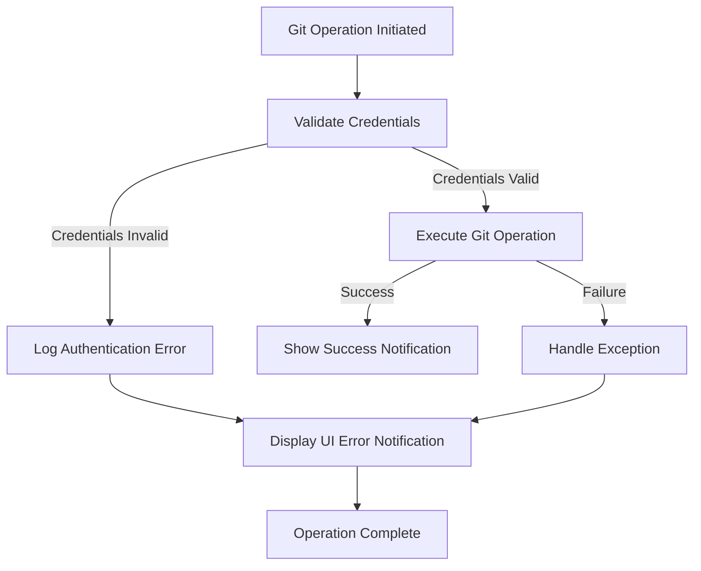
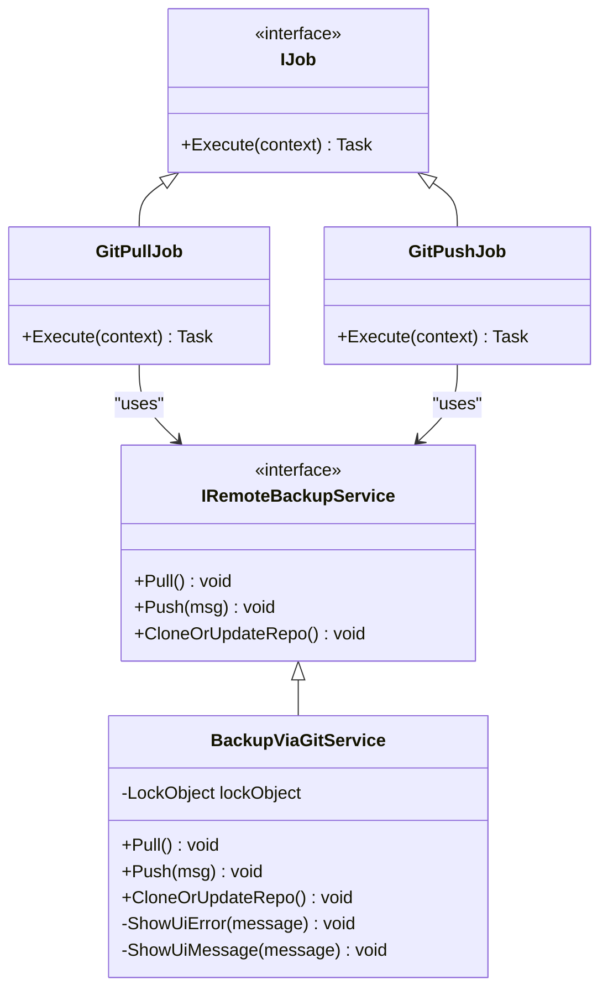
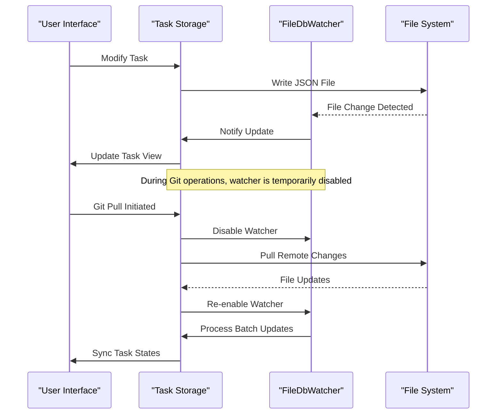
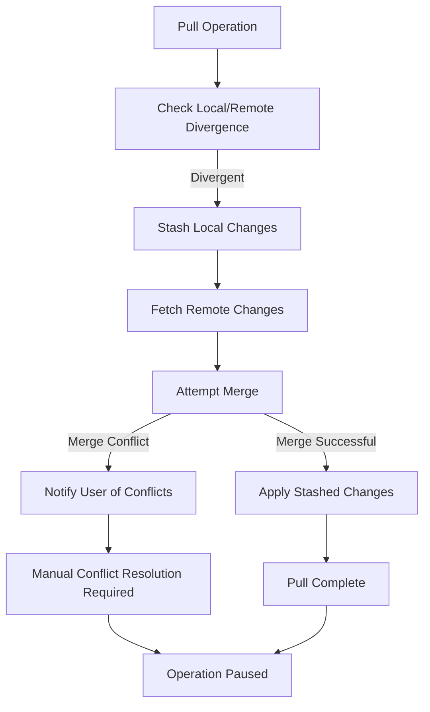
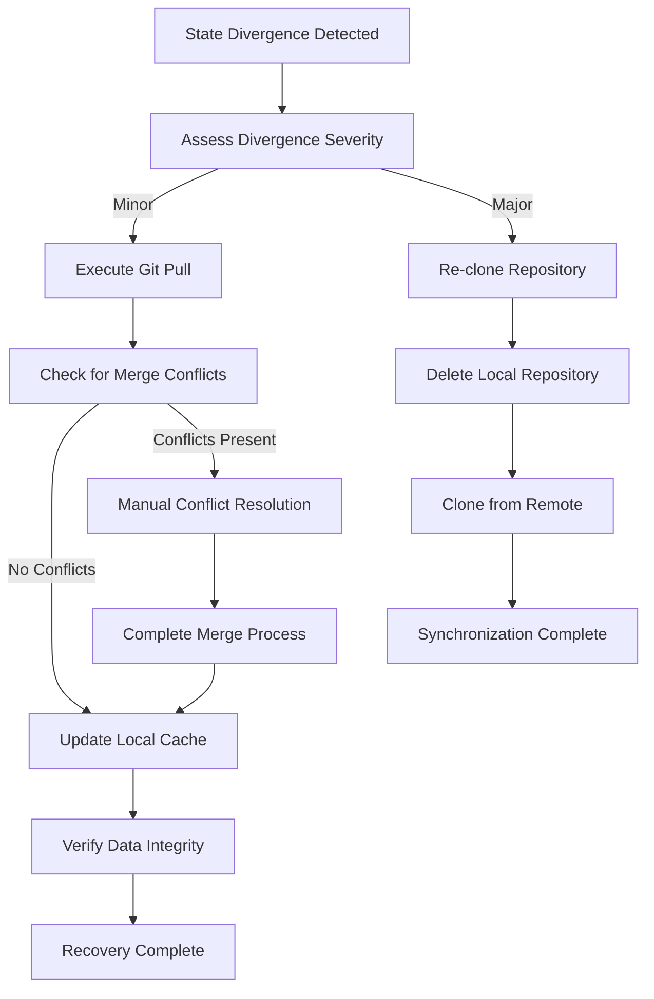
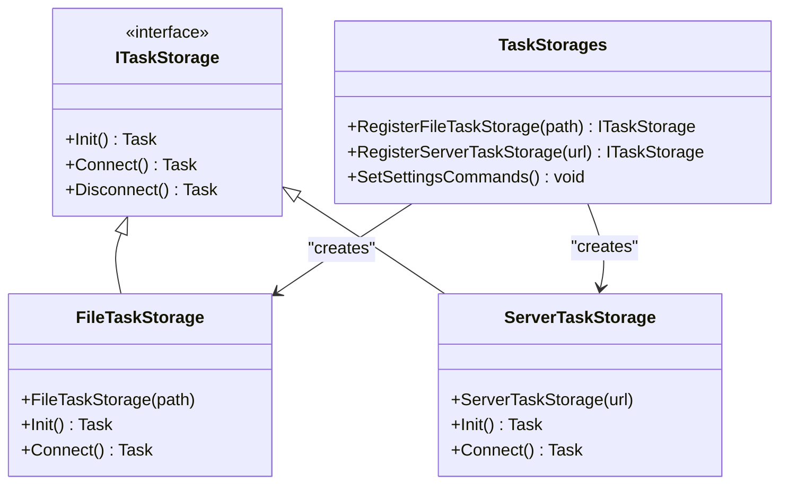

# Data Synchronization Errors

<cite>
**Referenced Files in This Document**   
- [GitPullJob.cs](file://src/Unlimotion/Scheduling/Jobs/GitPullJob.cs)
- [GitPushJob.cs](file://src/Unlimotion/Scheduling/Jobs/GitPushJob.cs)
- [BackupViaGitService.cs](file://src/Unlimotion/Services/BackupViaGitService.cs)
- [FileTaskStorage.cs](file://src/Unlimotion/FileTaskStorage.cs)
- [ServerTaskStorage.cs](file://src/Unlimotion/ServerTaskStorage.cs)
- [TaskStorages.cs](file://src/Unlimotion/TaskStorages.cs)
- [FileDbWatcher.cs](file://src/Unlimotion.ViewModel/FileDbWatcher.cs)
- [NotificationManagerWrapper.cs](file://src/Unlimotion/NotificationManagerWrapper.cs)
- [JsonCommaFixer.cs](file://src/Unlimotion/JsonCommaFixer.cs)
</cite>

## Table of Contents
1. [Introduction](#introduction)
2. [Git Integration Issues](#git-integration-issues)
3. [Repository Synchronization Failures](#repository-synchronization-failures)
4. [Local-Server State Inconsistencies](#local-server-state-inconsistencies)
5. [Conflict Resolution Mechanisms](#conflict-resolution-mechanisms)
6. [Recovery Procedures](#recovery-procedures)
7. [Manual State Repair](#manual-state-repair)
8. [Best Practices](#best-practices)

## Introduction
Unlimotion implements a dual-storage architecture with local JSON file storage and server-side RavenDB persistence, synchronized via Git-based backup mechanisms. This document details the various data synchronization errors that can occur in this system, including Git integration issues, repository conflicts, and state inconsistencies between storage backends. The system employs automated jobs for periodic synchronization and provides recovery mechanisms for handling divergent states and data corruption scenarios.

**Section sources**
- [GitPullJob.cs](file://src/Unlimotion/Scheduling/Jobs/GitPullJob.cs)
- [GitPushJob.cs](file://src/Unlimotion/Scheduling/Jobs/GitPushJob.cs)
- [BackupViaGitService.cs](file://src/Unlimotion/Services/BackupViaGitService.cs)

## Git Integration Issues

### Authentication Failures
Authentication failures occur when Git operations cannot authenticate with the remote repository due to invalid or missing credentials. The system uses username/password authentication through LibGit2Sharp, and failures are handled by the `BackupViaGitService` class. When credentials are empty or incorrect, the system logs debugging information and displays UI error notifications to the user.

The `GetCredentials` method in `BackupViaGitService` creates a `UsernamePasswordCredentials` object from configuration settings, and if either username or password is null or whitespace, a debug message is written indicating the authentication failure. These errors typically occur during push and pull operations when the Git settings in configuration do not contain valid authentication data.

**Diagram sources**
- [BackupViaGitService.cs](file://src/Unlimotion/Services/BackupViaGitService.cs#L95-L115)
- [NotificationManagerWrapper.cs](file://src/Unlimotion/NotificationManagerWrapper.cs#L27-L41)

### Repository Permission Errors
Repository permission errors occur when the application lacks sufficient permissions to access or modify the Git repository. These errors can manifest during clone, pull, or push operations when the remote repository denies access due to insufficient privileges. The system handles these errors through exception handling in the `BackupViaGitService` methods, converting Git exceptions into user-friendly error messages displayed via the notification system.

Permission errors are particularly common when users have read-only access to a repository but attempt to push changes, or when SSH key authentication is required but not configured. The system does not currently support SSH key authentication, relying solely on username/password credentials.

**Section sources**
- [BackupViaGitService.cs](file://src/Unlimotion/Services/BackupViaGitService.cs#L115-L185)
- [GitPullJob.cs](file://src/Unlimotion/Scheduling/Jobs/GitPullJob.cs#L10-L15)

## Repository Synchronization Failures

### GitPullJob and GitPushJob Failures
The `GitPullJob` and `GitPushJob` classes implement Quartz.NET jobs that periodically synchronize the local repository with the remote. These jobs can fail due to network issues, repository corruption, or connectivity problems. The jobs check if Git backup is enabled in configuration before executing, preventing unnecessary operations when backup is disabled.

`GitPullJob` executes the pull operation through the `IRemoteBackupService`, while `GitPushJob` calls the push method with a commit message. Both jobs rely on dependency injection to obtain the backup service instance. Failures in these jobs are typically silent unless they result from configuration issues or service unavailability.

**Diagram sources**
- [GitPullJob.cs](file://src/Unlimotion/Scheduling/Jobs/GitPullJob.cs#L1-L20)
- [GitPushJob.cs](file://src/Unlimotion/Scheduling/Jobs/GitPushJob.cs#L1-L21)
- [BackupViaGitService.cs](file://src/Unlimotion/Services/BackupViaGitService.cs#L1-L357)

### Network and Repository Corruption Issues
Network issues can disrupt Git operations, particularly during push and pull operations that require connectivity to remote repositories. The system handles network failures through exception handling in the `BackupViaGitService` methods. When a push operation fails due to network issues, the exception is caught, and an error message is displayed to the user.

Repository corruption can occur due to incomplete operations, disk errors, or improper shutdowns. The system detects repository validity using `Repository.IsValid(path)` before performing operations. If a repository is corrupted or invalid, pull and push operations are skipped. The `CloneOrUpdateRepo` method handles the case where a repository is invalid by initiating a clone operation to recreate the repository from the remote source.

**Section sources**
- [BackupViaGitService.cs](file://src/Unlimotion/Services/BackupViaGitService.cs#L115-L135)
- [FileTaskStorage.cs](file://src/Unlimotion/FileTaskStorage.cs#L102-L142)

## Local-Server State Inconsistencies

### JSON Storage and RavenDB State Divergence
Unlimotion maintains task data in two locations: local JSON files and server-side RavenDB storage. Inconsistencies between these storage systems can occur due to failed synchronization, concurrent modifications, or application crashes during write operations. The `FileTaskStorage` and `ServerTaskStorage` classes manage these respective storage backends, and divergence can lead to data loss or conflicting task states.

The system uses a database watcher (`FileDbWatcher`) to monitor file system changes and update the in-memory cache accordingly. However, if the watcher is disabled during Git operations, changes made externally may not be immediately reflected in the application state. This temporary inconsistency is resolved after the Git operation completes and the watcher is re-enabled.

**Diagram sources**
- [FileTaskStorage.cs](file://src/Unlimotion/FileTaskStorage.cs#L208-L231)
- [FileDbWatcher.cs](file://src/Unlimotion.ViewModel/FileDbWatcher.cs#L1-L36)
- [ServerTaskStorage.cs](file://src/Unlimotion/ServerTaskStorage.cs#L200-L250)

### Concurrent Modification Scenarios
Concurrent modifications can occur when multiple clients or processes modify the same task data simultaneously. The `FileTaskStorage` and `ServerTaskStorage` classes handle concurrent modifications differently. `FileTaskStorage` uses file system locking and in-memory caching to manage concurrent access, while `ServerTaskStorage` relies on RavenDB's concurrency control mechanisms.

The `TaskTreeManager` coordinates changes across parent-child and blocking relationships, ensuring consistency when tasks are modified. However, conflicts can still arise when the same task is modified in both local and server storage during periods of disconnected operation. These conflicts are typically resolved during the next synchronization cycle, with the most recent change prevailing.

**Section sources**
- [FileTaskStorage.cs](file://src/Unlimotion/FileTaskStorage.cs#L300-L350)
- [ServerTaskStorage.cs](file://src/Unlimotion/ServerTaskStorage.cs#L500-L550)
- [TaskTreeManager.cs](file://src/Unlimotion.TaskTreeManager/TaskTreeManager.cs#L43-L80)

## Conflict Resolution Mechanisms

### Merge Conflict Handling
Merge conflicts occur when the local and remote repositories have divergent histories that cannot be automatically merged. The `BackupViaGitService.Pull` method implements a conflict resolution strategy using Git stashing. Before attempting a merge, the current changes are stashed, the remote changes are pulled and merged, and then the stash is applied.

If conflicts prevent the merge operation, the system displays an error message instructing the user to resolve conflicts manually. The presence of conflicts is detected by checking `repo.Index.Conflicts.Any()`, and when conflicts exist, the user is notified with the message "Fix conflicts and then commit the result". The system does not provide automated conflict resolution, requiring manual intervention.

**Diagram sources**
- [BackupViaGitService.cs](file://src/Unlimotion/Services/BackupViaGitService.cs#L200-L289)
- [NotificationManagerWrapper.cs](file://src/Unlimotion/NotificationManagerWrapper.cs#L27-L41)

### BackupViaGitService Conflict Resolution
The `BackupViaGitService` provides the primary mechanism for resolving synchronization conflicts through its pull and push methods. During pull operations, the service compares the local and remote branch tips using SHA hashes, and only attempts a merge when divergence is detected. The merge process updates the local task storage by forcing updates to files that have changed in the remote repository.

The service temporarily disables the database watcher and pauses the file task storage during synchronization to prevent race conditions. After the merge is complete, the watcher is re-enabled, and any stashed changes are applied. This coordinated approach minimizes the window for conflicts and ensures data consistency during synchronization.

**Section sources**
- [BackupViaGitService.cs](file://src/Unlimotion/Services/BackupViaGitService.cs#L200-L300)
- [TaskStorages.cs](file://src/Unlimotion/TaskStorages.cs#L150-L180)

## Recovery Procedures

### Divergent Task State Recovery
When task states diverge between local and server storage, recovery procedures are required to restore consistency. The system provides several mechanisms for recovery, including manual pull and push operations through the settings interface, and automated periodic synchronization. The `TaskStorages` class provides commands for manual synchronization, allowing users to initiate clone, pull, and push operations as needed.

For severe divergence, the system supports complete repository re-cloning through the `CloneOrUpdateRepo` method. This operation deletes the existing local repository and creates a fresh clone from the remote source, ensuring complete synchronization at the cost of losing any local unpushed changes.

**Diagram sources**
- [BackupViaGitService.cs](file://src/Unlimotion/Services/BackupViaGitService.cs#L95-L135)
- [TaskStorages.cs](file://src/Unlimotion/TaskStorages.cs#L200-L220)

### JSON Corruption Recovery
JSON corruption can occur due to incomplete writes, disk errors, or software crashes. The system implements a JSON repair mechanism through the `JsonRepairingReader` class, which attempts to fix missing commas and other syntax errors in JSON files. When a JSON file cannot be parsed normally, the system applies automated repairs before attempting to deserialize the data.

The repair process is implemented in the `JsonCommaFixer` class, which analyzes JSON structure and inserts missing commas between JSON elements. Repaired files can be saved as sidecar files for auditing purposes. This mechanism helps recover from common JSON syntax errors that might otherwise result in data loss.

**Section sources**
- [JsonCommaFixer.cs](file://src/Unlimotion/JsonCommaFixer.cs#L1-L63)
- [FileTaskStorage.cs](file://src/Unlimotion/FileTaskStorage.cs#L350-L380)

## Manual State Repair

### Synchronization State Reinitialization
Manual repair of synchronization state may be necessary when automated mechanisms fail to resolve conflicts. The system provides several methods for reinitializing storage backends and restoring synchronization. The `TaskStorages` class includes commands for connecting and disconnecting storage, which can be used to reset the synchronization state.

To reinitialize synchronization, users can:
1. Disconnect the current storage backend
2. Manually resolve any Git conflicts in the repository
3. Reconnect the storage backend
4. Initiate a manual pull operation

This process clears any transient state and forces a fresh synchronization cycle, often resolving persistent synchronization issues.

**Section sources**
- [TaskStorages.cs](file://src/Unlimotion/TaskStorages.cs#L50-L100)
- [ServerTaskStorage.cs](file://src/Unlimotion/ServerTaskStorage.cs#L300-L350)

### Storage Backend Reinitialization
Complete reinitialization of storage backends may be required in cases of severe corruption or configuration errors. The `RegisterFileTaskStorage` and `RegisterServerTaskStorage` methods in `TaskStorages` provide the mechanism for reinitializing storage backends. These methods unregister the current storage instance and create a new one with the specified configuration.

For file-based storage, reinitialization involves creating a new `FileTaskStorage` instance and registering it with the dependency injection container. For server storage, a new `ServerTaskStorage` instance is created and connected to the server. This process effectively resets the storage state and can resolve issues related to stale connections or corrupted caches.

**Diagram sources**
- [TaskStorages.cs](file://src/Unlimotion/TaskStorages.cs#L100-L150)
- [FileTaskStorage.cs](file://src/Unlimotion/FileTaskStorage.cs#L50-L100)
- [ServerTaskStorage.cs](file://src/Unlimotion/ServerTaskStorage.cs#L50-L100)

## Best Practices

### Maintaining Consistent Backups
To maintain consistent backups and avoid data loss, follow these best practices:

1. **Regular Synchronization**: Configure appropriate intervals for Git pull and push operations to ensure frequent synchronization. The default configuration should balance data safety with performance considerations.

2. **Monitor Backup Status**: Pay attention to UI notifications for backup success or failure. Success toasts indicate successful operations, while error toasts require immediate attention.

3. **Verify Credentials**: Ensure Git credentials are correctly configured and have sufficient permissions for both read and write operations.

4. **Avoid Concurrent Modifications**: Minimize simultaneous modifications to the same tasks from multiple clients to reduce conflict potential.

5. **Regular Repository Validation**: Periodically verify repository integrity using Git's built-in validation tools.

### Preventing Data Loss
To prevent data loss in the Unlimotion synchronization system:

1. **Enable Automatic Backups**: Ensure Git backup is enabled in settings to maintain regular automated backups.

2. **Use Manual Backups for Critical Changes**: After making significant changes, manually trigger a backup using the push command to ensure immediate persistence.

3. **Monitor Network Connectivity**: Ensure stable network connectivity when performing synchronization operations, especially push operations that require uploading data.

4. **Regularly Check Repository Health**: Monitor for signs of repository corruption and address issues promptly.

5. **Maintain Multiple Backup Locations**: Consider configuring additional backup mechanisms beyond Git for critical data protection.

**Section sources**
- [TaskStorages.cs](file://src/Unlimotion/TaskStorages.cs#L150-L200)
- [BackupViaGitService.cs](file://src/Unlimotion/Services/BackupViaGitService.cs#L300-L357)
- [NotificationManagerWrapper.cs](file://src/Unlimotion/NotificationManagerWrapper.cs#L27-L41)