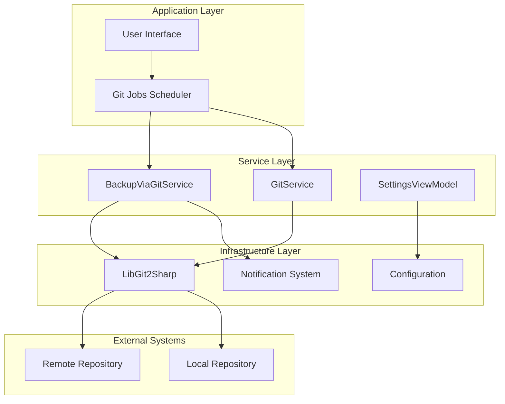
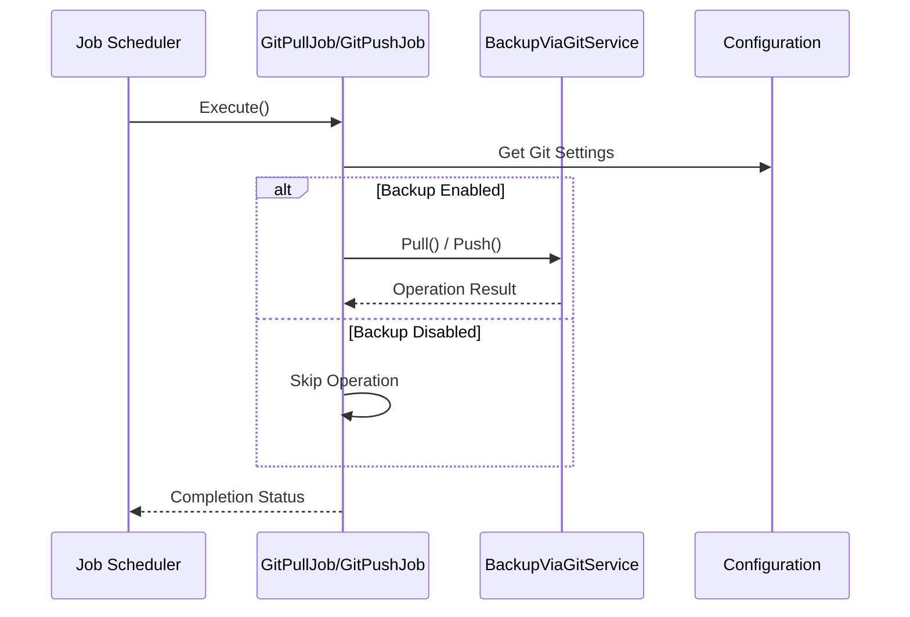
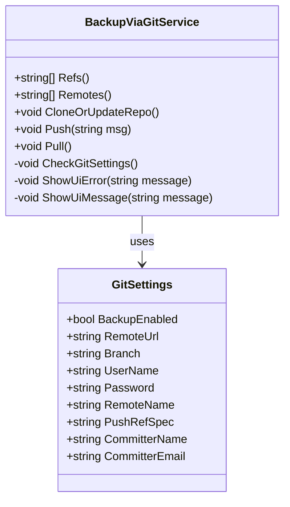
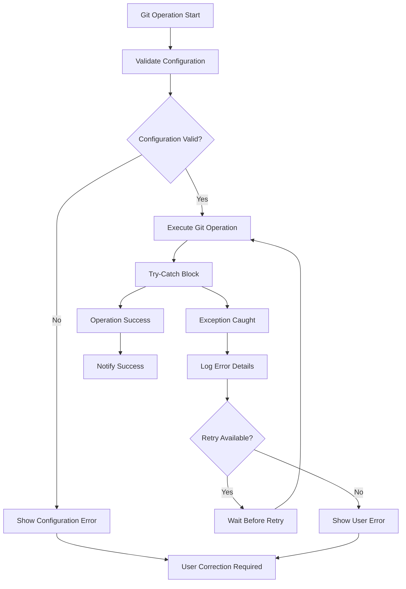
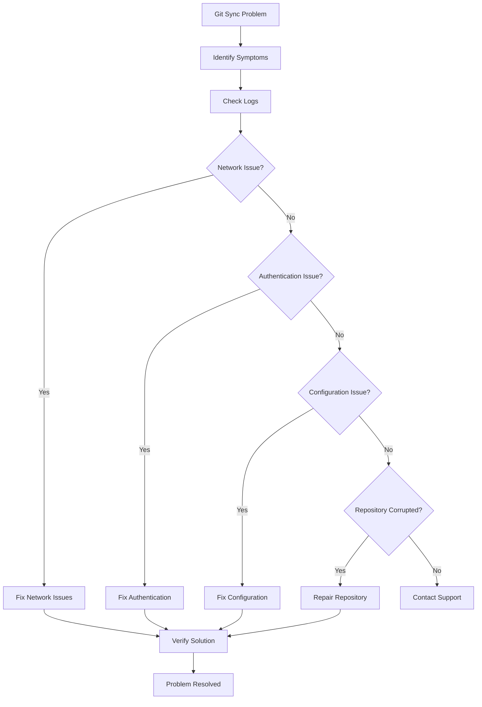

# Git Synchronization Failures

<cite>
**Referenced Files in This Document**
- [GitPullJob.cs](file://src/Unlimotion/Scheduling/Jobs/GitPullJob.cs)
- [GitPushJob.cs](file://src/Unlimotion/Scheduling/Jobs/GitPushJob.cs)
- [BackupViaGitService.cs](file://src/Unlimotion/Services/BackupViaGitService.cs)
- [GitService.cs](file://src/Unlimotion.TelegramBot/GitService.cs)
- [GitSettings.cs](file://src/Unlimotion.TelegramBot/GitSettings.cs)
- [SettingsViewModel.cs](file://src/Unlimotion.ViewModel/SettingsViewModel.cs)
- [ObservableExceptionHandler.cs](file://src/Unlimotion.ViewModel/ObservableExceptionHandler.cs)
- [NotificationManagerWrapper.cs](file://src/Unlimotion/NotificationManagerWrapper.cs)
</cite>

## Table of Contents
1. [Introduction](#introduction)
2. [System Architecture Overview](#system-architecture-overview)
3. [Core Git Components](#core-git-components)
4. [Common Failure Modes](#common-failure-modes)
5. [Error Handling and Recovery](#error-handling-and-recovery)
6. [Configuration Pitfalls](#configuration-pitfalls)
7. [Diagnosis and Troubleshooting](#diagnosis-and-troubleshooting)
8. [Recovery Procedures](#recovery-procedures)
9. [Best Practices](#best-practices)
10. [Conclusion](#conclusion)

## Introduction

Unlimotion implements a sophisticated Git synchronization system that enables automatic backup and synchronization of task data across multiple instances. The system consists of multiple components working together to provide reliable Git operations while handling various failure scenarios gracefully. This document provides comprehensive coverage of Git synchronization failures, their causes, diagnosis methods, and resolution procedures.

The Git synchronization system operates through several key components:
- **GitPullJob and GitPushJob**: Scheduled tasks that trigger Git operations
- **BackupViaGitService**: Core service handling Git operations with robust error handling
- **GitService**: Telegram bot-specific Git operations
- **Configuration Management**: Centralized Git settings management

## System Architecture Overview

The Git synchronization system follows a layered architecture with clear separation of concerns:

**Diagram sources**
- [GitPullJob.cs](file://src/Unlimotion/Scheduling/Jobs/GitPullJob.cs#L1-L20)
- [GitPushJob.cs](file://src/Unlimotion/Scheduling/Jobs/GitPushJob.cs#L1-L21)
- [BackupViaGitService.cs](file://src/Unlimotion/Services/BackupViaGitService.cs#L1-L50)

## Core Git Components

### GitPullJob and GitPushJob

The job system provides scheduled Git operations with basic error handling:

**Diagram sources**
- [GitPullJob.cs](file://src/Unlimotion/Scheduling/Jobs/GitPullJob.cs#L10-L20)
- [GitPushJob.cs](file://src/Unlimotion/Scheduling/Jobs/GitPushJob.cs#L10-L20)

### BackupViaGitService

The core service handles all Git operations with comprehensive error handling:

**Diagram sources**
- [BackupViaGitService.cs](file://src/Unlimotion/Services/BackupViaGitService.cs#L15-L50)
- [GitSettings.cs](file://src/Unlimotion.TelegramBot/GitSettings.cs#L2-L18)

**Section sources**
- [BackupViaGitService.cs](file://src/Unlimotion/Services/BackupViaGitService.cs#L1-L357)
- [GitPullJob.cs](file://src/Unlimotion/Scheduling/Jobs/GitPullJob.cs#L1-L20)
- [GitPushJob.cs](file://src/Unlimotion/Scheduling/Jobs/GitPushJob.cs#L1-L21)

## Common Failure Modes

### Authentication Errors

Authentication failures are among the most common Git synchronization issues:

#### Username/Password Configuration Issues
- **Empty Credentials**: Missing or empty username/password fields
- **Incorrect Credentials**: Wrong username or password combination
- **Token Expiration**: Personal access tokens becoming invalid

#### Network Authentication Problems
- **SSH Key Issues**: Missing or incorrect SSH keys for SSH-based authentication
- **Certificate Problems**: SSL/TLS certificate validation failures
- **Proxy Authentication**: Corporate proxy requiring authentication

### Network Timeouts

Network connectivity issues can cause various timeout scenarios:

#### Connection Timeout
- **DNS Resolution**: Unable to resolve remote repository hostname
- **Network Connectivity**: Intermittent network issues
- **Firewall Blocking**: Corporate firewalls blocking Git traffic

#### Operation Timeout
- **Large Repository**: Cloning or pulling large repositories exceeding timeout limits
- **Slow Network**: High latency networks causing operation delays
- **Bandwidth Limitations**: Limited bandwidth affecting transfer speeds

### Repository Corruption

Local repository corruption can occur due to various factors:

#### Git Repository Issues
- **Corrupted Objects**: Damaged Git objects in `.git/objects`
- **Incomplete Operations**: Interrupted Git operations leaving inconsistent state
- **File System Issues**: File system corruption affecting Git metadata

#### Working Directory Problems
- **Locked Files**: Files locked by other processes preventing Git operations
- **Permission Issues**: Insufficient permissions to modify repository files
- **Disk Space**: Insufficient disk space for Git operations

### Invalid Remote URLs

Configuration errors leading to invalid remote URLs:

#### URL Format Issues
- **Malformed URLs**: Incorrect URL syntax or missing protocol
- **Invalid Hostnames**: Non-existent or unreachable hostnames
- **Port Conflicts**: Incorrect port numbers for Git operations

#### Branch and Reference Issues
- **Non-existent Branches**: Specifying branches that don't exist
- **Reference Conflicts**: Conflicting references causing merge issues
- **Protected Branches**: Attempting operations on protected branches without permissions

**Section sources**
- [BackupViaGitService.cs](file://src/Unlimotion/Services/BackupViaGitService.cs#L280-L300)
- [GitService.cs](file://src/Unlimotion.TelegramBot/GitService.cs#L20-L50)

## Error Handling and Recovery

### Exception Handling Architecture

The system implements a multi-layered exception handling approach:

**Diagram sources**
- [BackupViaGitService.cs](file://src/Unlimotion/Services/BackupViaGitService.cs#L43-L94)
- [ObservableExceptionHandler.cs](file://src/Unlimotion.ViewModel/ObservableExceptionHandler.cs#L15-L39)

### Error Logging and Diagnostics

The system provides comprehensive error logging capabilities:

#### Debug Output
- **Operation Details**: Detailed information about Git operations
- **Error Messages**: Specific error messages from LibGit2Sharp
- **Stack Traces**: Full stack traces for debugging complex issues

#### User Notifications
- **Toast Notifications**: Real-time notifications for successful operations
- **Error Toasts**: Detailed error messages for failed operations
- **Progress Indicators**: Visual feedback during long-running operations

### Retry Mechanisms

The system implements intelligent retry mechanisms:

#### Automatic Retries
- **Network Issues**: Automatic retry for transient network problems
- **Temporary Failures**: Retry for temporary system issues
- **Rate Limiting**: Respect rate limits with exponential backoff

#### Manual Intervention
- **User Prompts**: Requests for user intervention when automatic recovery fails
- **Configuration Updates**: Guidance for updating configuration settings
- **Manual Recovery Steps**: Instructions for manual recovery procedures

**Section sources**
- [BackupViaGitService.cs](file://src/Unlimotion/Services/BackupViaGitService.cs#L327-L357)
- [ObservableExceptionHandler.cs](file://src/Unlimotion.ViewModel/ObservableExceptionHandler.cs#L1-L39)
- [NotificationManagerWrapper.cs](file://src/Unlimotion/NotificationManagerWrapper.cs#L1-L46)

## Configuration Pitfalls

### Common Configuration Issues

Several configuration problems commonly lead to Git synchronization failures:

#### Missing Required Fields
- **Remote URL**: Empty or missing remote repository URL
- **Authentication**: Missing username or password/token
- **Branch Specification**: Incorrect or missing branch configuration

#### Incompatible Settings
- **Mixed Authentication**: Using both username/password and SSH keys
- **Conflicting Branch Settings**: Different branch configurations across components
- **Repository Path Issues**: Invalid or inaccessible repository paths

#### Environment-Specific Problems
- **Path Separators**: Incorrect path separators for different operating systems
- **Environment Variables**: Missing or incorrect environment variable settings
- **Network Configuration**: Proxy settings not properly configured

### Silent Failure Scenarios

Some configuration issues may not immediately manifest as errors:

#### Disabled Backup
- **BackupDisabled Flag**: When backup is intentionally disabled
- **Conditional Execution**: Operations skipped based on configuration
- **Graceful Degradation**: System continues operating despite configuration issues

#### Partial Configuration
- **Incomplete Settings**: Some settings present but others missing
- **Default Values**: System using default values instead of configured values
- **Fallback Behavior**: Alternative behavior when primary configuration fails

**Section sources**
- [SettingsViewModel.cs](file://src/Unlimotion.ViewModel/SettingsViewModel.cs#L40-L75)
- [GitSettings.cs](file://src/Unlimotion.TelegramBot/GitSettings.cs#L1-L18)

## Diagnosis and Troubleshooting

### Diagnostic Tools and Techniques

Effective diagnosis requires understanding the system's diagnostic capabilities:

#### Log Analysis
- **Error Patterns**: Identifying recurring error patterns
- **Timestamp Correlation**: Matching errors with system events
- **Severity Levels**: Understanding different log severity levels

#### System State Inspection
- **Repository Status**: Checking local repository health
- **Network Connectivity**: Verifying network access to remote repositories
- **Authentication Status**: Testing authentication credentials

### Common Diagnostic Scenarios

#### Initial Setup Issues
1. **First-Time Configuration**: Setting up Git synchronization for the first time
2. **Migration Problems**: Moving from one repository to another
3. **Permission Issues**: Setting up appropriate access permissions

#### Ongoing Operation Problems
1. **Intermittent Failures**: Temporary issues that resolve themselves
2. **Gradual Degradation**: Slow performance or increasing failure rates
3. **Configuration Drift**: Settings changing unexpectedly

### Troubleshooting Workflow

**Section sources**
- [BackupViaGitService.cs](file://src/Unlimotion/Services/BackupViaGitService.cs#L25-L50)
- [GitService.cs](file://src/Unlimotion.TelegramBot/GitService.cs#L20-L50)

## Recovery Procedures

### Repository Corruption Recovery

When local repository corruption is detected:

#### Immediate Actions
1. **Stop All Git Operations**: Prevent further damage to the repository
2. **Backup Current State**: Create a backup of the current repository state
3. **Assess Damage**: Determine the extent of repository corruption

#### Recovery Strategies
- **Repository Reset**: Reset repository to last known good state
- **Clean Checkout**: Perform a clean checkout of the repository
- **Full Reclone**: Clone the repository from scratch

### Remote Tracking Recovery

Re-establishing remote tracking relationships:

#### Branch Recovery
1. **Verify Remote Branches**: Check available remote branches
2. **Reset Tracking**: Reset branch tracking to correct remote branch
3. **Force Push**: Force push local changes to remote branch if necessary

#### Conflict Resolution
- **Merge Conflicts**: Resolve merge conflicts between local and remote branches
- **Rebase Operations**: Rebase local changes onto remote branch
- **Stash Management**: Manage stashed changes during conflict resolution

### Configuration Recovery

Restoring proper configuration settings:

#### Validation Steps
1. **Credential Verification**: Verify authentication credentials
2. **URL Validation**: Confirm remote repository URL accessibility
3. **Branch Configuration**: Ensure correct branch settings

#### Automated Recovery
- **Configuration Reset**: Reset configuration to default values
- **Template Application**: Apply known-good configuration templates
- **Incremental Updates**: Gradually update configuration settings

**Section sources**
- [BackupViaGitService.cs](file://src/Unlimotion/Services/BackupViaGitService.cs#L60-L94)
- [GitService.cs](file://src/Unlimotion.TelegramBot/GitService.cs#L20-L50)

## Best Practices

### Configuration Management
- **Secure Credential Storage**: Use secure methods for storing authentication credentials
- **Regular Configuration Reviews**: Periodically review and update configuration settings
- **Documentation Maintenance**: Keep configuration documentation up-to-date

### Monitoring and Alerting
- **Health Checks**: Implement regular health checks for Git operations
- **Alert Configuration**: Set up alerts for critical Git synchronization failures
- **Performance Monitoring**: Monitor Git operation performance and timing

### Operational Procedures
- **Backup Strategies**: Implement comprehensive backup strategies for Git repositories
- **Testing Procedures**: Regularly test Git synchronization functionality
- **Disaster Recovery**: Develop and maintain disaster recovery procedures

### Security Considerations
- **Access Controls**: Implement appropriate access controls for Git repositories
- **Audit Logging**: Maintain audit logs for Git operations
- **Security Updates**: Keep Git client and server software up-to-date

## Conclusion

Git synchronization in Unlimotion provides a robust foundation for data backup and synchronization, but requires careful attention to configuration, monitoring, and maintenance. Understanding common failure modes, implementing proper error handling, and following established recovery procedures ensures reliable operation of the Git synchronization system.

The multi-layered architecture with comprehensive error handling, diagnostic capabilities, and recovery mechanisms provides a solid foundation for handling Git synchronization challenges. By following the guidelines and procedures outlined in this document, administrators can effectively manage Git synchronization operations and quickly resolve any issues that arise.

Regular monitoring, proactive maintenance, and adherence to best practices will help ensure the continued reliability and effectiveness of the Git synchronization system in production environments.