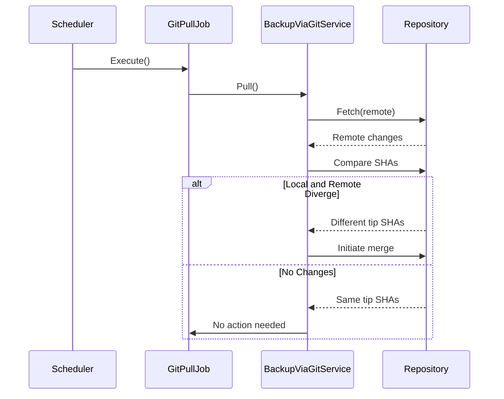
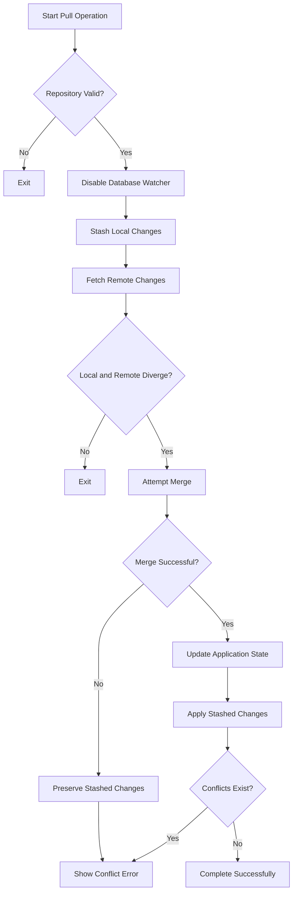
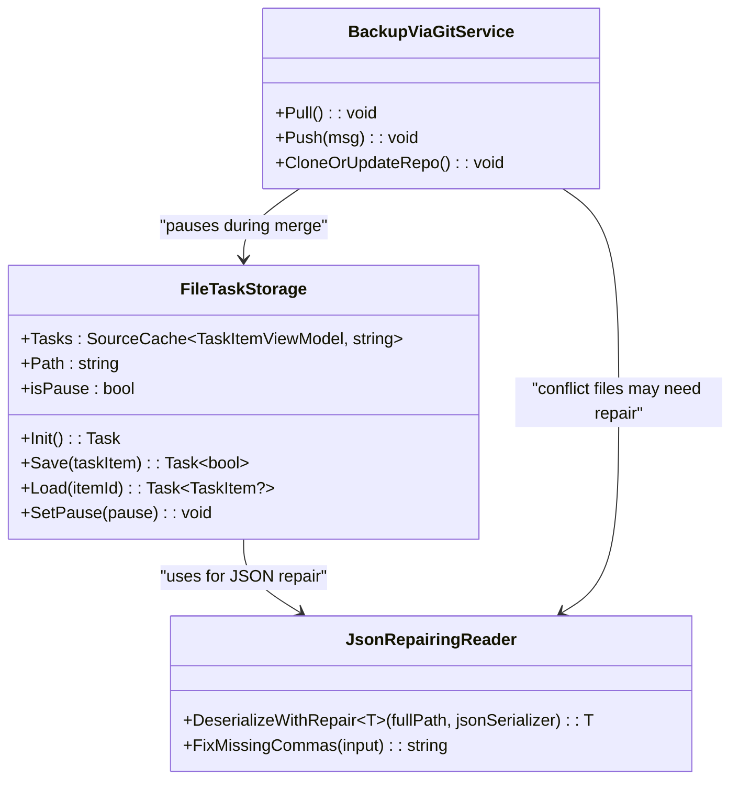

# Merge Conflict Resolution

<cite>
**Referenced Files in This Document**   
- [GitPullJob.cs](file://src/Unlimotion/Scheduling/Jobs/GitPullJob.cs)
- [BackupViaGitService.cs](file://src/Unlimotion/Services/BackupViaGitService.cs)
- [FileTaskStorage.cs](file://src/Unlimotion/FileTaskStorage.cs)
- [JsonCommaFixer.cs](file://src/Unlimotion/JsonCommaFixer.cs)
- [GitSettings.cs](file://src/Unlimotion.ViewModel/TaskStorageSettings.cs)
</cite>

## Table of Contents
1. [Introduction](#introduction)
2. [Conflict Trigger Mechanism](#conflict-trigger-mechanism)
3. [Conflict Resolution Process](#conflict-resolution-process)
4. [Automatic Merge Behavior](#automatic-merge-behavior)
5. [Manual Conflict Resolution](#manual-conflict-resolution)
6. [JSON Conflict Marker Identification](#json-conflict-marker-identification)
7. [Task State Resolution Workflow](#task-state-resolution-workflow)
8. [FileTaskStorage Conflict Handling](#filetaskstorage-conflict-handling)
9. [Post-Resolution Commit Process](#post-resolution-commit-process)
10. [Conflict Prevention Recommendations](#conflict-prevention-recommendations)

## Introduction
This document details the merge conflict resolution system in Unlimotion during Git-based synchronization. It explains how conflicts arise when local and remote task histories diverge, the automated resolution attempts by the BackupViaGitService, and the manual intervention required when automatic merges fail. The documentation covers the complete workflow from conflict detection to final resolution, with specific guidance on handling JSON file conflicts in the task storage system.

## Conflict Trigger Mechanism

The GitPullJob component initiates synchronization conflicts when divergent task histories exist between local and remote repositories. This scheduled job triggers the pull operation at configured intervals, creating potential conflict scenarios when concurrent modifications have occurred.



**Diagram sources**
- [GitPullJob.cs](file://src/Unlimotion/Scheduling/Jobs/GitPullJob.cs#L1-L20)
- [BackupViaGitService.cs](file://src/Unlimotion/Services/BackupViaGitService.cs#L199-L231)

**Section sources**
- [GitPullJob.cs](file://src/Unlimotion/Scheduling/Jobs/GitPullJob.cs#L1-L20)
- [BackupViaGitService.cs](file://src/Unlimotion/Services/BackupViaGitService.cs#L199-L231)

## Conflict Resolution Process

The BackupViaGitService manages the complete conflict resolution lifecycle, implementing a systematic approach to handle divergent task histories. The process begins with a fetch operation to retrieve remote changes, followed by a SHA comparison to detect divergence between local and remote branch tips.

When divergence is detected, the service implements a protective workflow that temporarily stashes local changes before attempting the merge. This ensures that local modifications are preserved even if the merge operation fails. The service then processes the merge results and updates the application's internal state to reflect any changes from the remote repository.



**Diagram sources**
- [BackupViaGitService.cs](file://src/Unlimotion/Services/BackupViaGitService.cs#L199-L323)

**Section sources**
- [BackupViaGitService.cs](file://src/Unlimotion/Services/BackupViaGitService.cs#L199-L323)

## Automatic Merge Behavior

The system attempts automatic merging of conflicting changes using LibGit2Sharp's merge functionality. When the Pull method detects divergent branch tips, it initiates a merge operation between the remote branch and the local branch. The merge process follows Git's standard three-way merge algorithm, attempting to combine changes from both histories.

Automatic merge success depends on the nature of the conflicting changes. The system can successfully merge when:
- Changes occur in different JSON properties of the same task
- Tasks are modified in different files without overlapping changes
- One side has only additions while the other has modifications

The service processes the merge results by identifying changed files and updating the application's internal state through the database watcher mechanism. For each modified file, it determines the appropriate update type (Saved or Removed) based on the change kind and notifies the system of the update.

**Section sources**
- [BackupViaGitService.cs](file://src/Unlimotion/Services/BackupViaGitService.cs#L229-L282)

## Manual Conflict Resolution

When automatic merge attempts fail, the system requires manual intervention to resolve conflicts. The primary indicator of a merge conflict is the presence of Git conflict markers in JSON task files. These markers appear as standard Git conflict indicators:

```
<<<<<<< HEAD
[Local changes]
=======
[Remote changes]
>>>>>>> branch-name
```

Users must manually edit the conflicted JSON files to resolve these markers by:
1. Opening the affected JSON files in a text editor
2. Locating all conflict marker sections
3. Deciding which changes to preserve from each version
4. Removing the conflict markers and creating a unified version
5. Ensuring the resulting JSON maintains valid syntax

After resolving all conflicts, users must save the files and proceed with the commit process to complete the synchronization.

**Section sources**
- [BackupViaGitService.cs](file://src/Unlimotion/Services/BackupViaGitService.cs#L316-L323)

## JSON Conflict Marker Identification

Conflict markers in Unlimotion's JSON task files follow standard Git merge conflict syntax. These markers appear when Git cannot automatically reconcile differences between local and remote versions of the same task file. The markers consist of three distinct sections separated by bracketed labels:

- `<<<<<<< HEAD` - Marks the beginning of the local version (current branch)
- `=======` - Separates the local and remote versions
- `>>>>>>> [branch-name]` - Marks the end of the remote version

Common locations for conflict markers in task JSON files include:
- Task title and description fields
- Parent-child relationship arrays (ContainsTasks, BlocksTasks)
- Status and completion properties
- Timestamps and scheduling information
- Custom field values

The JsonCommaFixer utility may attempt to repair JSON syntax after conflict resolution, but users should ensure proper JSON formatting before proceeding.

**Section sources**
- [JsonCommaFixer.cs](file://src/Unlimotion/JsonCommaFixer.cs#L0-L245)
- [BackupViaGitService.cs](file://src/Unlimotion/Services/BackupViaGitService.cs#L316-L323)

## Task State Resolution Workflow

Resolving divergent task states requires careful consideration of which changes to preserve from each version. The recommended workflow involves:

1. **Assessment**: Review both versions of the conflicting task to understand the nature of changes
2. **Prioritization**: Determine which changes are more current or important
3. **Integration**: Combine valid changes from both versions when possible
4. **Validation**: Ensure the final task state maintains data integrity

For specific task properties:
- **Title/Description**: Choose the most recent or comprehensive version
- **Parent-Child Relationships**: Merge arrays to include all valid relationships
- **Status/Completion**: Preserve the most advanced completion state
- **Timestamps**: Use the most recent modification timestamp
- **Custom Fields**: Evaluate each field individually for the appropriate value

After resolution, verify that all parent-child references remain valid and that the task hierarchy maintains integrity.

**Section sources**
- [FileTaskStorage.cs](file://src/Unlimotion/FileTaskStorage.cs#L0-L458)
- [BackupViaGitService.cs](file://src/Unlimotion/Services/BackupViaGitService.cs#L254-L282)

## FileTaskStorage Conflict Handling

The FileTaskStorage component plays a crucial role in conflict resolution by managing the persistence and loading of task data. During the merge process, it temporarily pauses to prevent concurrent modifications while the Git operation completes. This ensures data consistency during the synchronization process.

The storage system integrates with the conflict resolution workflow through the database watcher mechanism, which receives notifications of file updates after successful merges. When changes are detected, the storage system reloads affected tasks and updates the in-memory cache to reflect the merged state.

For JSON files with unresolved conflicts, the JsonCommaFixer utility attempts to repair syntax issues, but cannot resolve semantic conflicts represented by Git markers. The storage system will fail to load files with unresolved conflict markers, preventing corrupted data from entering the application state.



**Diagram sources**
- [FileTaskStorage.cs](file://src/Unlimotion/FileTaskStorage.cs#L0-L458)
- [BackupViaGitService.cs](file://src/Unlimotion/Services/BackupViaGitService.cs#L0-L357)
- [JsonCommaFixer.cs](file://src/Unlimotion/JsonCommaFixer.cs#L0-L245)

**Section sources**
- [FileTaskStorage.cs](file://src/Unlimotion/FileTaskStorage.cs#L0-L458)
- [JsonCommaFixer.cs](file://src/Unlimotion/JsonCommaFixer.cs#L0-L245)

## Post-Resolution Commit Process

After manually resolving conflicts in JSON files, users must complete the synchronization by committing the resolved state back to the repository. This process involves:

1. **Verification**: Ensure all conflict markers have been removed and JSON syntax is valid
2. **Staging**: The system automatically stages all modified files during the next push operation
3. **Committing**: Create a commit with a descriptive message explaining the resolution
4. **Pushing**: Send the resolved changes to the remote repository

The BackupViaGitService handles the commit and push operations, automatically detecting dirty states and creating commits with the configured committer information. After a successful push, the remote repository reflects the resolved task states, completing the synchronization cycle.

**Section sources**
- [BackupViaGitService.cs](file://src/Unlimotion/Services/BackupViaGitService.cs#L129-L167)

## Conflict Prevention Recommendations

To minimize future merge conflicts in Unlimotion, implement the following best practices:

1. **Coordinate Team Activity**: Schedule intensive task modifications during periods of low concurrent usage
2. **Frequent Synchronization**: Enable shorter pull intervals to reduce the window for divergence
3. **Clear Communication**: Establish protocols for team members to communicate when making significant changes
4. **Small, Focused Changes**: Make incremental updates rather than large batch modifications
5. **Regular Pulls**: Encourage users to pull changes before starting extended editing sessions

Technical configuration recommendations:
- Set GitPullIntervalSeconds to a lower value (e.g., 15-30 seconds) for teams with high collaboration
- Ensure all team members use consistent Git configuration settings
- Regularly verify repository health and backup integrity
- Monitor synchronization logs for recurring conflict patterns

By following these practices, teams can significantly reduce the frequency of merge conflicts while maintaining reliable task synchronization across all Unlimotion instances.

**Section sources**
- [GitSettings.cs](file://src/Unlimotion.ViewModel/TaskStorageSettings.cs#L16-L34)
- [BackupViaGitService.cs](file://src/Unlimotion/Services/BackupViaGitService.cs#L91-L132)
- [TaskStorages.cs](file://src/Unlimotion/TaskStorages.cs#L129-L163)