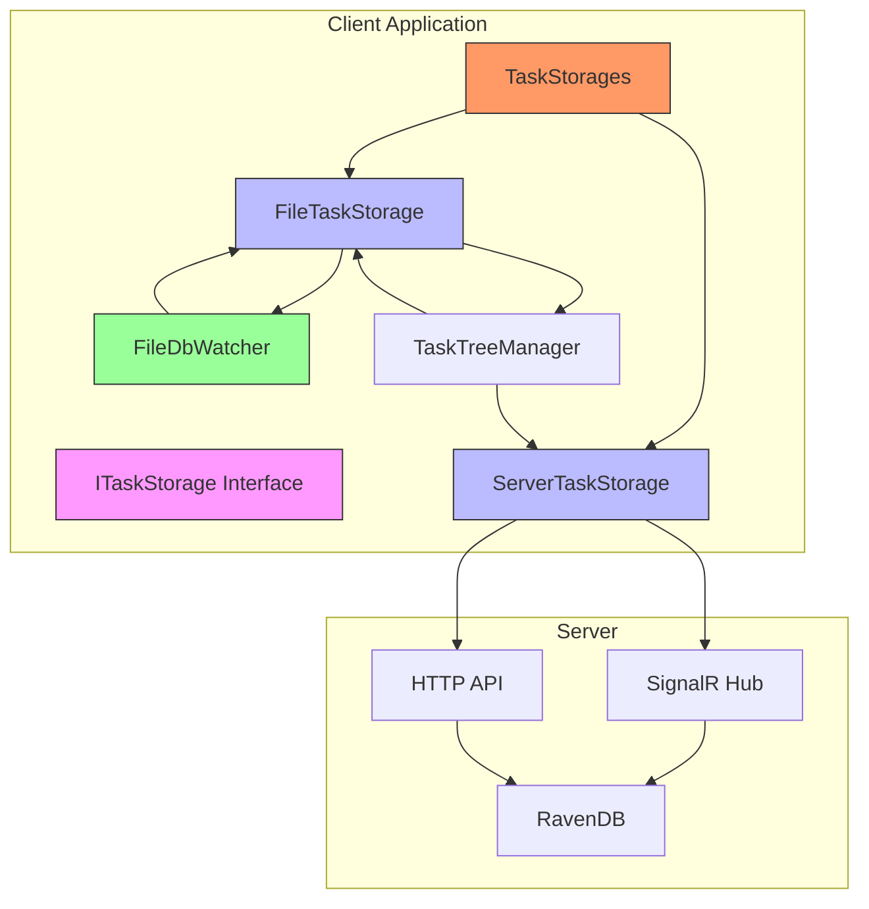
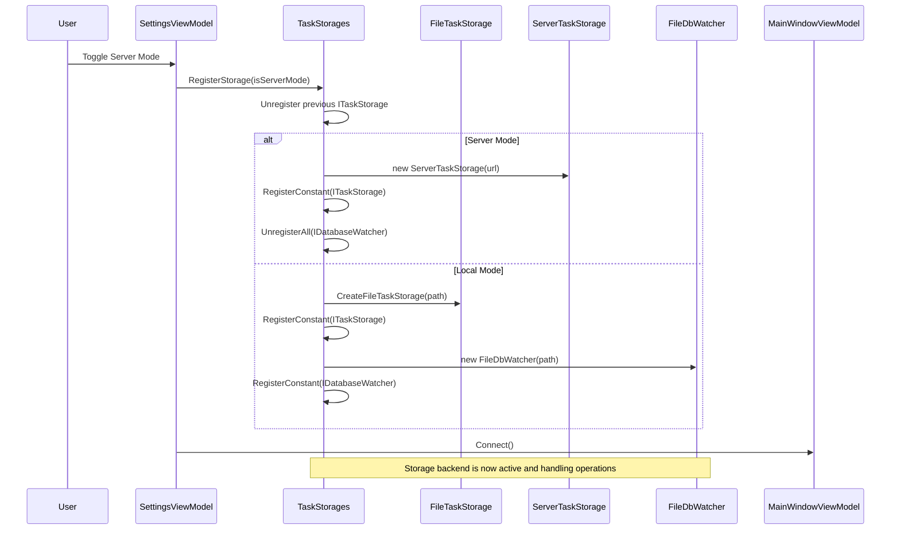
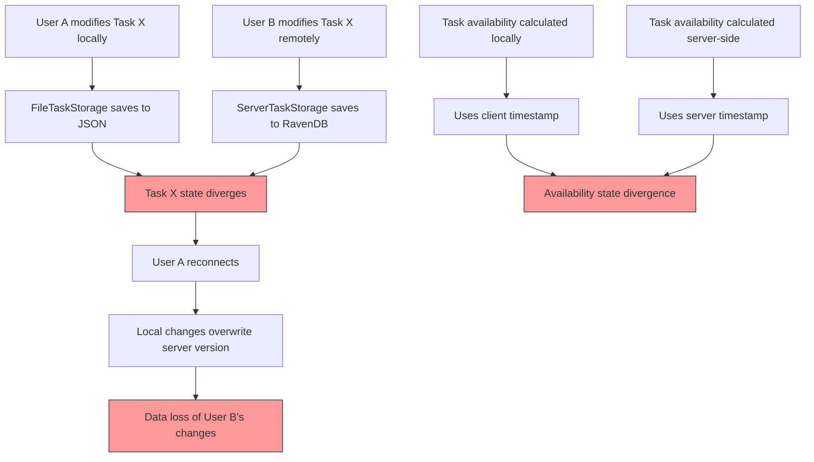
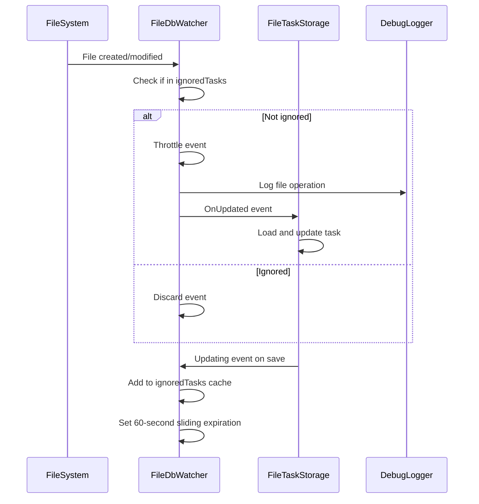

# Storage Inconsistencies Between Backends

<cite>
**Referenced Files in This Document**   
- [FileTaskStorage.cs](file://src/Unlimotion/FileTaskStorage.cs)
- [ServerTaskStorage.cs](file://src/Unlimotion/ServerTaskStorage.cs)
- [TaskStorages.cs](file://src/Unlimotion/TaskStorages.cs)
- [TaskStorageExtensions.cs](file://src/Unlimotion/TaskStorageExtensions.cs)
- [FileDbWatcher.cs](file://src/Unlimotion.ViewModel/FileDbWatcher.cs)
- [TaskStorageUpdateEventArgs.cs](file://src/Unlimotion.ViewModel/TaskStorageUpdateEventArgs.cs)
- [DbUpdatedEventArgs.cs](file://src/Unlimotion.ViewModel/DbUpdatedEventArgs.cs)
- [ITaskStorage.cs](file://src/Unlimotion.ViewModel/ITaskStorage.cs)
</cite>

## Table of Contents
1. [Introduction](#introduction)
2. [Storage Architecture Overview](#storage-architecture-overview)
3. [FileTaskStorage Implementation](#filetaskstorage-implementation)
4. [ServerTaskStorage Implementation](#servertaskstorage-implementation)
5. [TaskStorages Coordination](#taskstorages-coordination)
6. [Race Conditions and State Divergence](#race-conditions-and-state-divergence)
7. [Inconsistency Detection and Logging](#inconsistency-detection-and-logging)
8. [Manual Reconciliation Strategies](#manual-reconciliation-strategies)
9. [Best Practices for Data Integrity](#best-practices-for-data-integrity)
10. [Conclusion](#conclusion)

## Introduction

Unlimotion implements a dual-storage architecture with local JSON file storage and server-side RavenDB storage, enabling both offline and collaborative task management. This document examines the storage inconsistencies that can arise between these backends, particularly during concurrent modifications. The system uses FileTaskStorage for local JSON persistence and ServerTaskStorage for RavenDB operations, coordinated through the TaskStorages class. When operating in mixed mode, race conditions can lead to state divergence between the local and server copies of task data. This document details the mechanisms for detecting, logging, and resolving these inconsistencies to maintain data integrity across storage backends.

## Storage Architecture Overview

Unlimotion's storage architecture implements a dual-backend system with local JSON file storage and server-side RavenDB persistence. The architecture centers around the ITaskStorage interface, which defines a common contract for both storage implementations. FileTaskStorage handles local JSON operations with file system persistence, while ServerTaskStorage manages server communications via SignalR and HTTP APIs to RavenDB. The TaskStorages class coordinates between these implementations, allowing users to switch between local and server modes. A critical component of this architecture is the FileDbWatcher, which monitors file system changes and triggers updates to maintain cache consistency. The system uses event-driven communication through TaskStorageUpdateEventArgs and DbUpdatedEventArgs to propagate changes across components. This design enables offline functionality while supporting cloud synchronization, but introduces complexity in managing concurrent modifications that can lead to state divergence between backends.

**Diagram sources**
- [FileTaskStorage.cs](file://src/Unlimotion/FileTaskStorage.cs#L15-L20)
- [ServerTaskStorage.cs](file://src/Unlimotion/ServerTaskStorage.cs#L15-L20)
- [TaskStorages.cs](file://src/Unlimotion/TaskStorages.cs#L15-L20)
- [FileDbWatcher.cs](file://src/Unlimotion.ViewModel/FileDbWatcher.cs#L15-L20)

**Section sources**
- [FileTaskStorage.cs](file://src/Unlimotion/FileTaskStorage.cs#L1-L50)
- [ServerTaskStorage.cs](file://src/Unlimotion/ServerTaskStorage.cs#L1-L50)
- [TaskStorages.cs](file://src/Unlimotion/TaskStorages.cs#L1-L50)

## FileTaskStorage Implementation

The FileTaskStorage class implements local JSON file storage for Unlimotion tasks, managing individual task files in a designated directory. Each task is stored as a separate JSON file named by its GUID, enabling atomic operations and file system-level concurrency control. The implementation uses a SourceCache to maintain an in-memory cache of TaskItemViewModel objects, synchronized with the file system through the FileDbWatcher component. When a task is saved, the Save method serializes the TaskItem to JSON with ISO-formatted timestamps and writes it to the file system. The GetAll method enumerates all files in the storage directory, deserializing each task while handling potential JSON corruption through the JsonRepairingReader utility. The storage implementation includes migration capabilities for schema updates, such as the MigrateIsCanBeCompleted method that ensures backward compatibility. Event propagation occurs through the Updating event, which notifies the FileDbWatcher to temporarily ignore the updated file to prevent reentrant processing. This file-per-task approach provides resilience against partial writes but introduces challenges when coordinating with the server-side storage during concurrent modifications.

**Section sources**
- [FileTaskStorage.cs](file://src/Unlimotion/FileTaskStorage.cs#L15-L458)

## ServerTaskStorage Implementation

The ServerTaskStorage class manages communication with the RavenDB backend through HTTP APIs and SignalR real-time messaging. It maintains a persistent connection to the server via a HubConnection, enabling bidirectional communication for immediate synchronization of task changes. The implementation uses a JsonServiceClient for RESTful operations and an IChatHub proxy for real-time updates, with automatic token refresh and reconnection logic to handle authentication and network interruptions. When connected, the storage receives real-time notifications of task changes from other clients through SignalR subscriptions, updating its local cache accordingly. The Save operation sends task data to the server via the SaveTask SignalR method, while bulk operations like BulkInsert enable efficient migration of tasks between storage backends. Connection resilience is implemented through a SemaphoreSlim gate that prevents concurrent connection attempts and automatic reconnection with exponential backoff. The storage maintains its own in-memory cache (Tasks SourceCache) that is updated both from local operations and remote notifications, creating potential for state divergence when the same task is modified concurrently through different storage instances.

**Section sources**
- [ServerTaskStorage.cs](file://src/Unlimotion/ServerTaskStorage.cs#L15-L722)

## TaskStorages Coordination

The TaskStorages class serves as the central coordinator for managing multiple storage implementations in Unlimotion, enabling seamless switching between local and server storage modes. Through the RegisterStorage method, it dynamically registers either FileTaskStorage or ServerTaskStorage as the current ITaskStorage implementation using Splat's dependency injection container. The class provides migration commands that facilitate data transfer between storage backends, such as the MigrateCommand that copies all tasks from local storage to the server, and the BackupCommand that performs the reverse operation. These commands leverage the GetAll method from the source storage and Save/BulkInsert operations on the destination storage to synchronize data. The coordination mechanism also manages the FileDbWatcher lifecycle, registering it only when using local storage to monitor file system changes. This architectural pattern allows users to work offline with local JSON storage and later synchronize with the server, but creates opportunities for state divergence when tasks are modified in both locations before synchronization occurs.

**Diagram sources**
- [TaskStorages.cs](file://src/Unlimotion/TaskStorages.cs#L15-L224)
- [FileTaskStorage.cs](file://src/Unlimotion/FileTaskStorage.cs#L15-L20)
- [ServerTaskStorage.cs](file://src/Unlimotion/ServerTaskStorage.cs#L15-L20)
- [FileDbWatcher.cs](file://src/Unlimotion.ViewModel/FileDbWatcher.cs#L15-L20)

**Section sources**
- [TaskStorages.cs](file://src/Unlimotion/TaskStorages.cs#L15-L224)

## Race Conditions and State Divergence

Race conditions in Unlimotion arise when concurrent modifications occur to the same task through different storage backends, leading to state divergence between local JSON and server-side RavenDB copies. A typical scenario occurs when a user modifies a task while offline using FileTaskStorage, and simultaneously another user modifies the same task through ServerTaskStorage. When the first user reconnects, their local changes may overwrite the server version, resulting in data loss. The system lacks a built-in conflict resolution mechanism, relying instead on last-write-wins semantics where the most recent save operation determines the final state. This is particularly problematic for complex task relationships involving parent-child hierarchies or blocking dependencies, as changes to these relationships are processed independently by each storage backend. The TaskTreeManager, which manages these relationships, operates within the context of a single storage instance, meaning relationship changes made through one backend may not be properly reflected in the other. Additionally, timestamp-based operations like task availability calculations can diverge due to clock differences between client and server, further complicating synchronization.

**Diagram sources**
- [FileTaskStorage.cs](file://src/Unlimotion/FileTaskStorage.cs#L15-L20)
- [ServerTaskStorage.cs](file://src/Unlimotion/ServerTaskStorage.cs#L15-L20)
- [TaskTreeManager.cs](file://src/Unlimotion.TaskTreeManager/TaskTreeManager.cs#L15-L20)

**Section sources**
- [FileTaskStorage.cs](file://src/Unlimotion/FileTaskStorage.cs#L15-L458)
- [ServerTaskStorage.cs](file://src/Unlimotion/ServerTaskStorage.cs#L15-L722)

## Inconsistency Detection and Logging

Unlimotion detects storage inconsistencies through a combination of file system monitoring and event-driven notifications, with limited logging capabilities for troubleshooting divergence issues. The FileDbWatcher component monitors the local storage directory for file changes, using a FileSystemWatcher with throttling to prevent event flooding. When a file is modified, the watcher triggers a DbUpdatedEventArgs event that propagates through the system, but only if the file is not in the ignoredTasks cache. This ignore mechanism prevents reentrant processing when the application itself saves a file, but creates a window where external modifications could be missed. The system lacks comprehensive logging of storage operations, with only debug-level messages written by the DebugLogger in the FileDbWatcher. These messages record file operations and their timestamps but do not capture the content of changes or the context of operations. When JSON parsing errors occur, the JsonRepairingReader logs the first 200 characters of repaired content, providing some visibility into data corruption issues. However, there is no centralized logging of storage operations that would enable detection of state divergence between backends, making it difficult to diagnose and resolve synchronization issues after they occur.

**Diagram sources**
- [FileDbWatcher.cs](file://src/Unlimotion.ViewModel/FileDbWatcher.cs#L15-L153)
- [FileTaskStorage.cs](file://src/Unlimotion/FileTaskStorage.cs#L15-L20)
- [DebugLogger.cs](file://src/Unlimotion.ViewModel/DebugLogger.cs#L15-L20)

**Section sources**
- [FileDbWatcher.cs](file://src/Unlimotion.ViewModel/FileDbWatcher.cs#L15-L153)
- [FileTaskStorage.cs](file://src/Unlimotion/FileTaskStorage.cs#L15-L458)

## Manual Reconciliation Strategies

Manual reconciliation of storage inconsistencies in Unlimotion requires careful use of the migration commands provided in the TaskStorages class, as the system lacks automated conflict resolution. The primary strategy involves using the BackupCommand to export all tasks from the server to local storage, effectively overwriting the local state with the server version. Conversely, the MigrateCommand can be used to push local changes to the server, overwriting the server state with the local version. Before performing reconciliation, users should ensure they are connected to the correct storage backend and have the most up-to-date data. For partial reconciliation, users can export data using the BackupCommand, manually edit the JSON files to resolve conflicts, and then re-import using the MigrateCommand. The ResaveCommand can also be used to force all local tasks to be rewritten, potentially fixing corruption issues. However, these strategies result in data loss of conflicting changes rather than true merging, making regular synchronization and clear communication among team members essential for maintaining data integrity.

**Section sources**
- [TaskStorages.cs](file://src/Unlimotion/TaskStorages.cs#L15-L224)

## Best Practices for Data Integrity

To maintain data integrity in Unlimotion's dual-storage environment, users should follow several best practices to minimize the risk of state divergence and data loss. First, establish a clear protocol for storage mode usage, designating specific times or team members for local versus server mode operations to reduce concurrent modifications. Perform regular synchronization by switching to server mode and allowing the system to update, preferably at the beginning and end of work sessions. Avoid prolonged offline work when others may be modifying the same tasks, as this increases the likelihood of conflicting changes. When collaboration is required, coordinate with team members to ensure only one person modifies a particular task at a time. Regularly use the BackupCommand to create server-side snapshots of local data, providing a recovery point in case of corruption. Monitor the application logs for any JSON parsing errors or synchronization warnings that may indicate emerging issues. Finally, consider implementing a manual review process after any migration operation to verify that critical task relationships and dependencies have been preserved correctly across the storage transition.

**Section sources**
- [TaskStorages.cs](file://src/Unlimotion/TaskStorages.cs#L15-L224)
- [FileTaskStorage.cs](file://src/Unlimotion/FileTaskStorage.cs#L15-L20)
- [ServerTaskStorage.cs](file://src/Unlimotion/ServerTaskStorage.cs#L15-L20)

## Conclusion

Unlimotion's dual-storage architecture provides flexibility for both offline and collaborative task management but introduces significant challenges in maintaining data consistency between local JSON and server-side RavenDB backends. The current implementation lacks robust conflict detection and resolution mechanisms, relying on last-write-wins semantics that can result in data loss during concurrent modifications. While the system provides basic migration tools through the TaskStorages class, these operate as overwrite operations rather than true merging, limiting their effectiveness for conflict resolution. The event-driven architecture with FileDbWatcher enables responsive local updates but creates windows for inconsistency when changes occur outside the application's awareness. To improve data integrity, future enhancements should include version vectors or timestamps for conflict detection, a proper merge strategy for task relationships, and comprehensive logging of storage operations. Until such improvements are implemented, users must rely on careful coordination and regular synchronization to minimize the risk of state divergence in mixed-mode operation.