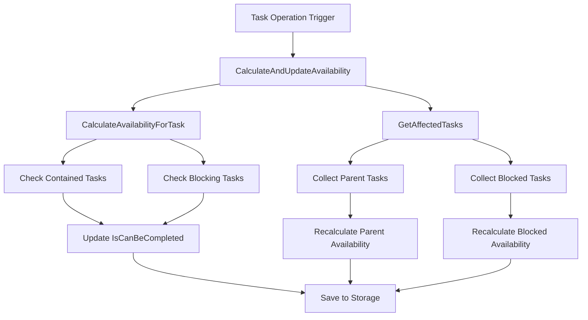
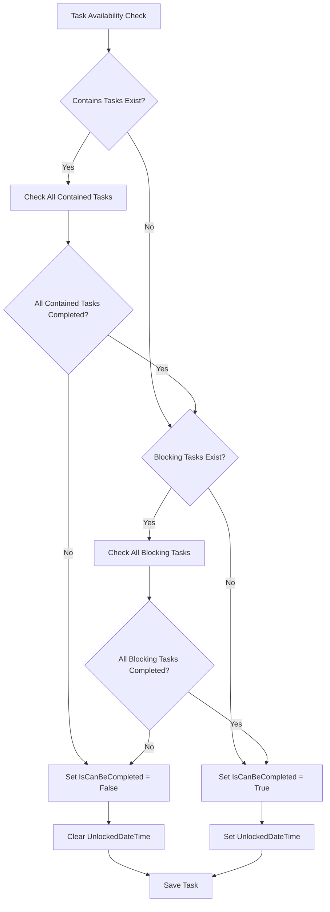
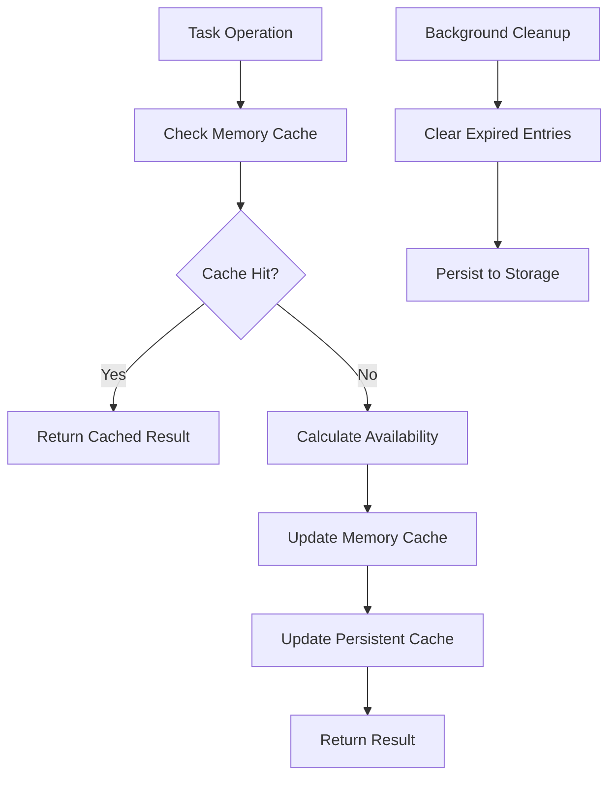
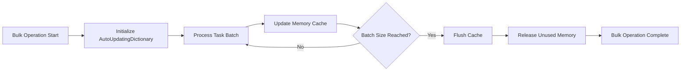
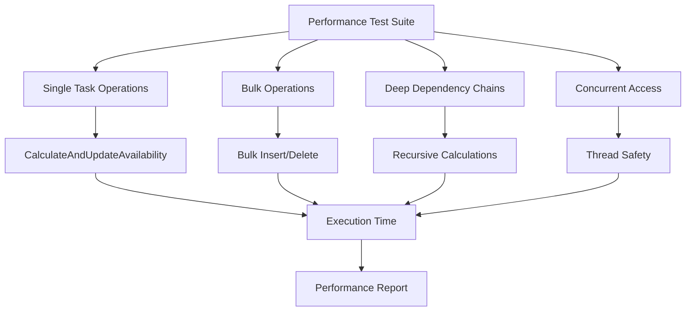
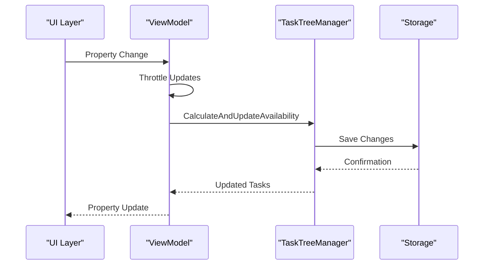

# Performance Optimization

<cite>
**Referenced Files in This Document**
- [IMPLEMENTATION_SUMMARY.md](file://IMPLEMENTATION_SUMMARY.md)
- [TaskTreeManager.cs](file://src/Unlimotion.TaskTreeManager/TaskTreeManager.cs)
- [TaskAvailabilityCalculationTests.cs](file://src/Unlimotion.Test/TaskAvailabilityCalculationTests.cs)
- [TaskItemViewModel.cs](file://src/Unlimotion.ViewModel/TaskItemViewModel.cs)
- [AutoUpdatingDictionary.cs](file://src/Unlimotion.TaskTreeManager/AutoUpdatingDictionary.cs)
- [FileTaskStorage.cs](file://src/Unlimotion/FileTaskStorage.cs)
- [ServerTaskStorage.cs](file://src/Unlimotion/ServerTaskStorage.cs)
- [StartupExtensions.cs](file://src/Unlimotion.Server/StartupExtensions.cs)
- [appsettings.json](file://src/Unlimotion.Server/appsettings.json)
- [JsonCommaFixer.cs](file://src/Unlimotion\JsonCommaFixer.cs)
- [ITaskTreeManager.cs](file://src/Unlimotion.TaskTreeManager/ITaskTreeManager.cs)
</cite>

## Table of Contents
1. [Introduction](#introduction)
2. [Performance Bottlenecks Analysis](#performance-bottlenecks-analysis)
3. [Task Availability Calculations](#task-availability-calculations)
4. [Optimization Strategies](#optimization-strategies)
5. [Database Performance Tuning](#database-performance-tuning)
6. [Memory Usage Patterns](#memory-usage-patterns)
7. [Benchmarking and Testing](#benchmarking-and-testing)
8. [Implementation Guidelines](#implementation-guidelines)
9. [Monitoring and Maintenance](#monitoring-and-maintenance)

## Introduction

Unlimotion's performance optimization focuses on addressing bottlenecks in task availability calculations, particularly when handling large task databases with deep dependency chains. The system's architecture separates business logic from presentation concerns, enabling targeted optimizations while maintaining clean separation of responsibilities.

This document provides comprehensive guidance on optimizing Unlimotion's performance, covering task availability calculations, database operations, memory management, and reactive UI updates. The optimization strategies are designed to handle large-scale task databases efficiently while maintaining responsive user interfaces.

## Performance Bottlenecks Analysis

### CalculateAndUpdateAvailability Performance Impact

The `CalculateAndUpdateAvailability` method represents the core performance bottleneck in Unlimotion's task management system. This method is triggered by various operations including task creation, deletion, relationship modifications, and completion state changes.



**Diagram sources**
- [TaskTreeManager.cs](file://src/Unlimotion.TaskTreeManager/TaskTreeManager.cs#L597-L631)
- [TaskTreeManager.cs](file://src/Unlimotion.TaskTreeManager/TaskTreeManager.cs#L480-L520)

### Deep Dependency Chain Impact

Deep dependency chains exacerbate performance issues because each operation triggers recursive calculations through the entire dependency tree. The propagation mechanism calculates availability for all affected tasks, leading to exponential complexity in deeply nested task hierarchies.

**Section sources**
- [TaskTreeManager.cs](file://src/Unlimotion.TaskTreeManager/TaskTreeManager.cs#L480-L520)
- [IMPLEMENTATION_SUMMARY.md](file://IMPLEMENTATION_SUMMARY.md#L99-L136)

## Task Availability Calculations

### Core Calculation Logic

The availability calculation follows strict business rules: a task can be completed only when all contained tasks are completed and all blocking tasks are completed. This logic is implemented in the `CalculateAvailabilityForTask` method.



**Diagram sources**
- [TaskTreeManager.cs](file://src/Unlimotion.TaskTreeManager/TaskTreeManager.cs#L480-L520)

### Propagation Mechanism

The propagation mechanism identifies and recalculates affected tasks using two categories:
- **Parent tasks**: Tasks that contain the modified task
- **Blocked tasks**: Tasks that are blocked by the modified task

**Section sources**
- [TaskTreeManager.cs](file://src/Unlimotion.TaskTreeManager/TaskTreeManager.cs#L522-L560)
- [IMPLEMENTATION_SUMMARY.md](file://IMPLEMENTATION_SUMMARY.md#L99-L136)

## Optimization Strategies

### Efficient Indexing

Implement database indexing strategies to optimize task relationship lookups:

| Index Type | Purpose | Performance Impact |
|------------|---------|-------------------|
| Task ID Index | Fast task loading | O(1) lookup time |
| Relationship Index | Quick parent/child lookups | O(log n) traversal |
| Availability Index | Cached availability states | Reduced calculation overhead |
| Timestamp Index | Efficient time-based queries | Optimized filtering |

### Caching of Availability States

Implement multi-level caching for availability calculations:



**Diagram sources**
- [AutoUpdatingDictionary.cs](file://src/Unlimotion.TaskTreeManager/AutoUpdatingDictionary.cs#L0-L27)

### Lazy Evaluation Techniques

Implement lazy evaluation for expensive operations:

1. **Deferred Calculations**: Defer availability calculations until actually needed
2. **Incremental Updates**: Update only changed portions of the dependency tree
3. **Batch Processing**: Group multiple operations for efficient processing

**Section sources**
- [TaskTreeManager.cs](file://src/Unlimotion.TaskTreeManager/TaskTreeManager.cs#L597-L631)

## Database Performance Tuning

### RavenDB Configuration

Configure RavenDB for optimal performance with large task databases:

```json
{
  "RavenDb": {
    "DatabaseRecord": {
      "DatabaseName": "Unlimotion"
    },
    "ServerOptions": {
      "ServerUrl": "http://localhost:8080",
      "DataDirectory": "RavenDB",
      "LogsPath": "Log\\RavenDB",
      "MaxNumberOfCachedQueries": 1000,
      "MaxNumberOfRequestsPerSession": 1000,
      "TimeToLiveForRequestsPerSession": "00:05:00"
    }
  }
}
```

### Database Tuning Parameters

| Parameter | Recommended Value | Impact |
|-----------|------------------|---------|
| MaxNumberOfCachedQueries | 1000-5000 | Reduces repeated calculations |
| MaxNumberOfRequestsPerSession | 1000-2000 | Prevents session overload |
| TimeToLiveForRequestsPerSession | 5-15 minutes | Balances freshness vs performance |
| BatchSize | 100-1000 | Optimizes bulk operations |

**Section sources**
- [StartupExtensions.cs](file://src/Unlimotion.Server/StartupExtensions.cs#L32-L53)
- [appsettings.json](file://src/Unlimotion.Server/appsettings.json#L30-L40)

### JSON Serialization Optimization

Implement JSON serialization optimizations to reduce overhead:

1. **Streaming Serialization**: Use streaming serializers for large datasets
2. **Compression**: Enable compression for network transfers
3. **Schema Optimization**: Optimize JSON schema for frequent operations
4. **Precompiled Serializers**: Use precompiled serializers for better performance

**Section sources**
- [JsonCommaFixer.cs](file://src/Unlimotion\JsonCommaFixer.cs#L0-L37)

## Memory Usage Patterns

### TaskTreeManager Memory Management

Monitor memory usage patterns in TaskTreeManager during bulk operations:



**Diagram sources**
- [AutoUpdatingDictionary.cs](file://src/Unlimotion.TaskTreeManager/AutoUpdatingDictionary.cs#L0-L27)

### TaskItem Memory Optimization

Optimize TaskItem memory usage for large task databases:

| Optimization | Memory Savings | Implementation |
|--------------|---------------|----------------|
| Lazy Loading | 30-50% | Load task details on demand |
| Weak References | 20-30% | Allow garbage collection of unused tasks |
| Object Pooling | 40-60% | Reuse TaskItem instances |
| Compression | 50-70% | Compress historical task data |

**Section sources**
- [TaskTreeManager.cs](file://src/Unlimotion.TaskTreeManager/TaskTreeManager.cs#L0-L50)

## Benchmarking and Testing

### Unit Test Performance Metrics

Use the provided unit tests to measure performance impact:



**Diagram sources**
- [TaskAvailabilityCalculationTests.cs](file://src/Unlimotion.Test/TaskAvailabilityCalculationTests.cs#L0-L50)

### Benchmarking Methodology

Implement comprehensive benchmarking using the existing test framework:

1. **Baseline Measurement**: Establish performance baselines
2. **Optimization Testing**: Measure improvements after each optimization
3. **Regression Testing**: Ensure optimizations don't introduce regressions
4. **Load Testing**: Test performance under realistic load conditions

**Section sources**
- [TaskAvailabilityCalculationTests.cs](file://src/Unlimotion.Test/TaskAvailabilityCalculationTests.cs#L0-L717)

## Implementation Guidelines

### Reactive Updates Optimization

Minimize reactive updates in ViewModel layers to prevent UI lag:



**Diagram sources**
- [TaskItemViewModel.cs](file://src/Unlimotion.ViewModel/TaskItemViewModel.cs#L203-L232)

### Throttling Strategies

Implement throttling mechanisms to reduce excessive updates:

| Update Type | Throttle Period | Rationale |
|-------------|----------------|-----------|
| Property Changes | 10 seconds | Prevents rapid-fire updates |
| Availability Calculations | 5 seconds | Balances responsiveness vs performance |
| UI Refresh | 1 second | Maintains smooth user experience |
| Background Sync | 30 seconds | Reduces network overhead |

**Section sources**
- [TaskItemViewModel.cs](file://src/Unlimotion.ViewModel/TaskItemViewModel.cs#L39-L71)

## Monitoring and Maintenance

### Performance Monitoring

Implement comprehensive performance monitoring:

1. **Metrics Collection**: Track key performance indicators
2. **Alerting System**: Set up alerts for performance degradation
3. **Profiling Tools**: Use profiling tools to identify bottlenecks
4. **Capacity Planning**: Monitor growth trends for capacity decisions

### Maintenance Procedures

Regular maintenance procedures for optimal performance:

1. **Cache Cleanup**: Regular cleanup of expired cache entries
2. **Database Maintenance**: Regular database optimization and cleanup
3. **Code Review**: Regular review of performance-critical code
4. **Testing**: Continuous performance testing and regression detection

**Section sources**
- [FileTaskStorage.cs](file://src/Unlimotion/FileTaskStorage.cs#L102-L142)
- [ServerTaskStorage.cs](file://src/Unlimotion/ServerTaskStorage.cs#L0-L50)