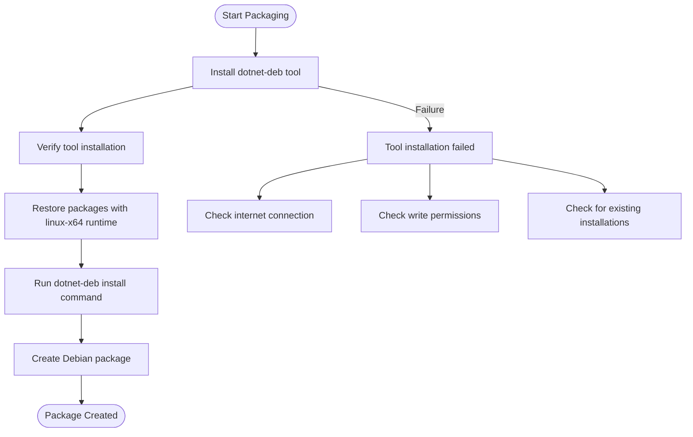
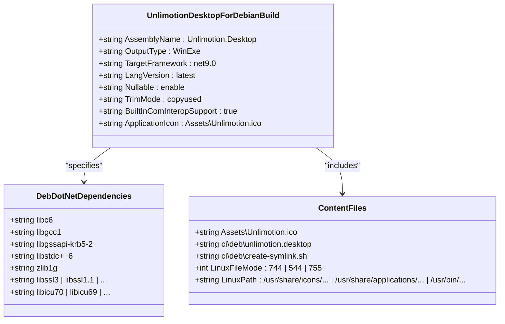
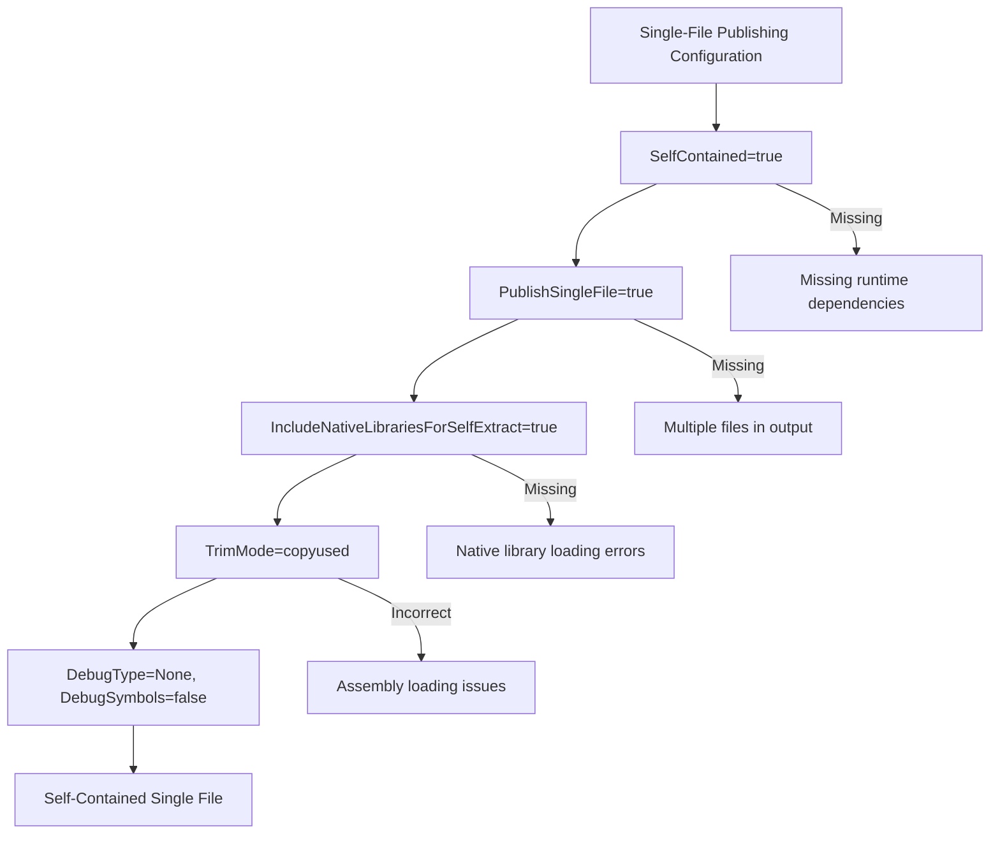
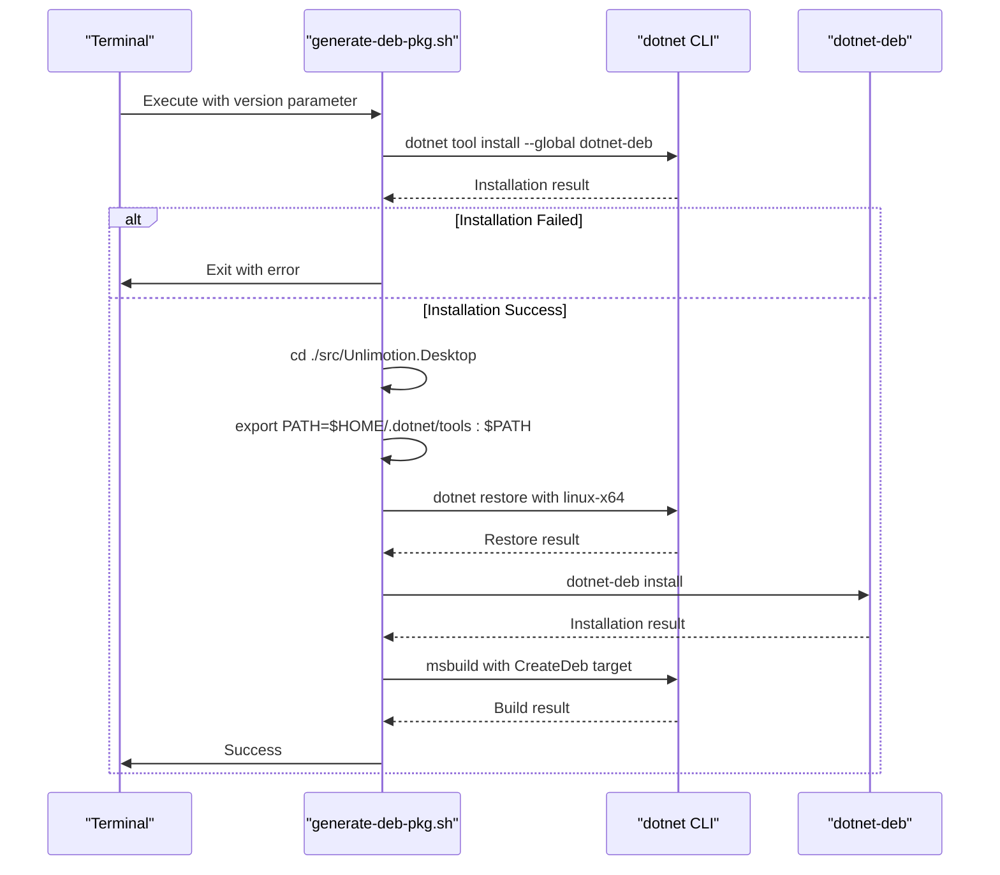
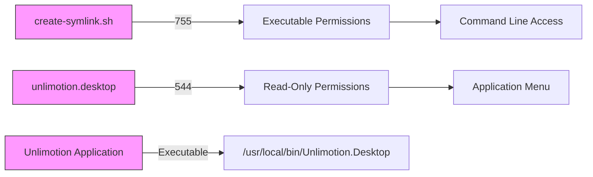
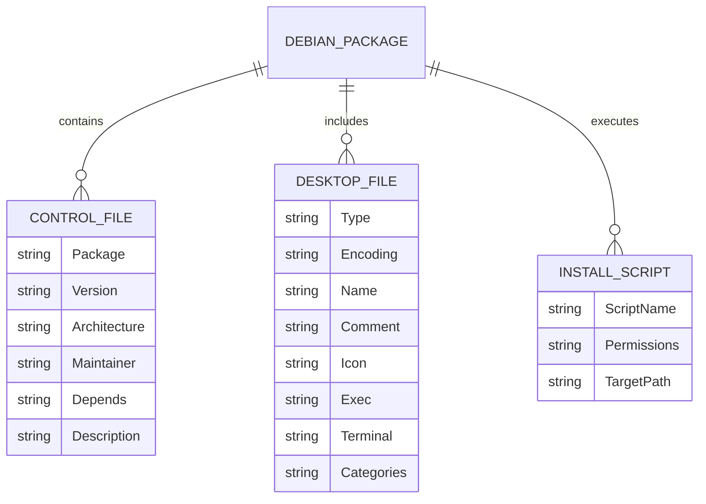
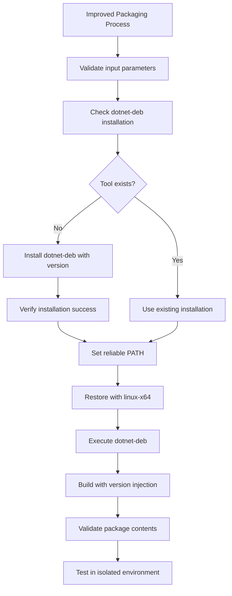

# Debian Packaging Errors

<cite>
**Referenced Files in This Document**   
- [generate-deb-pkg.sh](file://src/Unlimotion.Desktop/ci/deb/generate-deb-pkg.sh)
- [Unlimotion.Desktop.ForDebianBuild.csproj](file://src/Unlimotion.Desktop/Unlimotion.Desktop.ForDebianBuild.csproj)
- [unlimotion.desktop](file://src/Unlimotion.Desktop/ci/deb/unlimotion.desktop)
- [create-symlink.sh](file://src/Unlimotion.Desktop/ci/deb/create-symlink.sh)
- [run.linux.sh](file://run.linux.sh)
</cite>

## Table of Contents
1. [Introduction](#introduction)
2. [Common Debian Packaging Errors](#common-debian-packaging-errors)
3. [dotnet-deb Tool Configuration Issues](#dotnet-deb-tool-configuration-issues)
4. [Project Configuration Problems](#project-configuration-problems)
5. [Single-File Publishing Failures](#single-file-publishing-failures)
6. [Script-Level Problems in generate-deb-pkg.sh](#script-level-problems-in-generate-deb-pkgsh)
7. [Dependency Resolution Errors](#dependency-resolution-errors)
8. [Executable Permission Issues](#executable-permission-issues)
9. [Library Loading Failures](#library-loading-failures)
10. [Control File Metadata Validation](#control-file-metadata-validation)
11. [Troubleshooting Techniques](#troubleshooting-techniques)
12. [Corrected Configuration Examples](#corrected-configuration-examples)

## Introduction
This document addresses Debian-specific packaging errors in the Unlimotion application, focusing on issues encountered during the creation of .deb packages for Debian-based systems. The Unlimotion desktop application uses a specialized build process for Debian packaging that involves the `dotnet-deb` tool, custom project configurations, and shell scripts to generate distributable packages. Common issues include tooling problems, incorrect project settings, script errors, and runtime compatibility issues that prevent successful installation and execution on Debian-based distributions.

**Section sources**
- [generate-deb-pkg.sh](file://src/Unlimotion.Desktop/ci/deb/generate-deb-pkg.sh#L1-L11)
- [Unlimotion.Desktop.ForDebianBuild.csproj](file://src/Unlimotion.Desktop/Unlimotion.Desktop.ForDebianBuild.csproj#L1-L44)

## Common Debian Packaging Errors
The Debian packaging process for Unlimotion can fail due to various issues spanning tooling, configuration, and system compatibility. The most frequent errors include missing or misconfigured `dotnet-deb` tool installation, incorrect target framework specifications, improper runtime identifiers, and failures in single-file publishing configuration. Script-level problems in the packaging scripts often involve incorrect file paths, version injection failures, and incomplete control file metadata. Additionally, dependency resolution issues, executable permission problems, and native library loading failures can prevent the application from running correctly after installation on Debian-based systems.

**Section sources**
- [generate-deb-pkg.sh](file://src/Unlimotion.Desktop/ci/deb/generate-deb-pkg.sh#L1-L11)
- [Unlimotion.Desktop.ForDebianBuild.csproj](file://src/Unlimotion.Desktop/Unlimotion.Desktop.ForDebianBuild.csproj#L1-L44)

## dotnet-deb Tool Configuration Issues
The `dotnet-deb` global tool is essential for creating Debian packages from .NET projects but can cause packaging failures if not properly configured. The current implementation in `generate-deb-pkg.sh` installs the tool globally on every execution, which can lead to version conflicts, network dependency issues, and inconsistent build environments. The script uses `dotnet tool install --global dotnet-deb` without specifying a version, potentially resulting in incompatible versions being installed. Additionally, the PATH export `export PATH=$HOME/.dotnet/tools:$PATH` assumes a specific tool location that may not be consistent across different environments.

**Diagram sources**
- [generate-deb-pkg.sh](file://src/Unlimotion.Desktop/ci/deb/generate-deb-pkg.sh#L4-L8)

**Section sources**
- [generate-deb-pkg.sh](file://src/Unlimotion.Desktop/ci/deb/generate-deb-pkg.sh#L4-L8)

## Project Configuration Problems
The `Unlimotion.Desktop.ForDebianBuild.csproj` file contains several configuration settings critical for successful Debian packaging. Issues often arise from incorrect target framework specifications or runtime identifiers. The project is configured with `<TargetFramework>net9.0</TargetFramework>` which must match the runtime environment on the target Debian system. The Debian-specific project includes `<DebDotNetDependencies>` that lists native library dependencies, and any inaccuracies in this list can cause runtime failures. The project also specifies Linux file modes for content files, with the desktop entry file set to 544 (readable by all, writable only by owner) and the symlink script set to 755 (executable).

**Diagram sources**
- [Unlimotion.Desktop.ForDebianBuild.csproj](file://src/Unlimotion.Desktop/Unlimotion.Desktop.ForDebianBuild.csproj#L1-L44)

**Section sources**
- [Unlimotion.Desktop.ForDebianBuild.csproj](file://src/Unlimotion.Desktop/Unlimotion.Desktop.ForDebianBuild.csproj#L1-L44)

## Single-File Publishing Failures
Single-file publishing configuration is critical for creating a self-contained Debian package that can run without requiring additional .NET runtime installations. The `generate-deb-pkg.sh` script specifies several publishing parameters including `PublishSingleFile=true`, `SelfContained=true`, and `IncludeNativeLibrariesForSelfExtract=true`. Issues can occur if these settings are not properly coordinated with the project configuration. The `SelfContained=true` parameter ensures all dependencies are bundled, while `IncludeNativeLibrariesForSelfExtract=true` allows native libraries to be extracted at runtime. Missing or conflicting settings can result in incomplete packages that fail to execute due to missing assemblies or native libraries.

**Diagram sources**
- [generate-deb-pkg.sh](file://src/Unlimotion.Desktop/ci/deb/generate-deb-pkg.sh#L10-L11)

**Section sources**
- [generate-deb-pkg.sh](file://src/Unlimotion.Desktop/ci/deb/generate-deb-pkg.sh#L10-L11)
- [Unlimotion.Desktop.ForDebianBuild.csproj](file://src/Unlimotion.Desktop/Unlimotion.Desktop.ForDebianBuild.csproj#L7-L11)

## Script-Level Problems in generate-deb-pkg.sh
The `generate-deb-pkg.sh` script contains several potential issues that can disrupt the Debian packaging process. The script changes directory to `./src/Unlimotion.Desktop` but uses a relative path `CSPROJ_PATH="./Unlimotion.Desktop.ForDebianBuild.csproj"` which may not resolve correctly after the directory change. The script assumes the `dotnet-deb` tool will be available in `$HOME/.dotnet/tools` but doesn't verify the installation succeeded before proceeding. Version injection is handled by passing `$1` as the Version parameter, but there's no validation that this parameter is provided, which could result in packages with empty or invalid version numbers.

**Diagram sources**
- [generate-deb-pkg.sh](file://src/Unlimotion.Desktop/ci/deb/generate-deb-pkg.sh#L1-L11)

**Section sources**
- [generate-deb-pkg.sh](file://src/Unlimotion.Desktop/ci/deb/generate-deb-pkg.sh#L1-L11)

## Dependency Resolution Errors
Dependency resolution errors occur when the required native libraries specified in the `<DebDotNetDependencies>` element are not available on the target Debian system. The project declares dependencies on various system libraries including `libc6`, `libgcc1`, `libgssapi-krb5-2`, `libstdc++6`, `zlib1g`, SSL libraries, and ICU libraries with version fallbacks. Issues can arise when the target system has different library versions than those specified, or when the library naming conventions differ between Debian versions. The use of OR operators (|) in the dependency list provides version flexibility, but incorrect syntax or missing alternatives can still cause installation failures.

**Section sources**
- [Unlimotion.Desktop.ForDebianBuild.csproj](file://src/Unlimotion.Desktop/Unlimotion.Desktop.ForDebianBuild.csproj#L35-L36)

## Executable Permission Issues
Executable permission issues can prevent the Unlimotion application from launching after installation. The `create-symlink.sh` script is configured with `LinuxFileMode="755"` which grants execute permissions, but the target executable `/usr/local/bin/Unlimotion.Desktop` may not have the correct permissions. The desktop entry file `unlimotion.desktop` has `LinuxFileMode="544"` which provides read access but not execute permissions, which is appropriate for a desktop entry file. If the permissions are not correctly set during package installation, users will be unable to launch the application from the application menu or via the command line.

**Diagram sources**
- [Unlimotion.Desktop.ForDebianBuild.csproj](file://src/Unlimotion.Desktop/Unlimotion.Desktop.ForDebianBuild.csproj#L38-L42)

**Section sources**
- [Unlimotion.Desktop.ForDebianBuild.csproj](file://src/Unlimotion.Desktop/Unlimotion.Desktop.ForDebianBuild.csproj#L38-L42)
- [create-symlink.sh](file://src/Unlimotion.Desktop/ci/deb/create-symlink.sh#L1-L3)

## Library Loading Failures
Library loading failures occur when the application cannot find required native libraries at runtime. The `Unlimotion.Desktop.ForDebianBuild.csproj` file specifies a comprehensive list of dependencies to address this issue, but problems can still arise due to library path configuration, version mismatches, or missing architecture-specific libraries. The application may fail to start with errors related to missing `libicu`, `libssl`, or other native dependencies. These issues are particularly common when deploying to different Debian versions or architectures where library naming or availability differs from the build environment.

**Section sources**
- [Unlimotion.Desktop.ForDebianBuild.csproj](file://src/Unlimotion.Desktop/Unlimotion.Desktop.ForDebianBuild.csproj#L35-L36)

## Control File Metadata Validation
The control file metadata for the Debian package is generated from the project configuration and must be validated to ensure successful installation. The `unlimotion.desktop` file provides metadata for the application menu integration, including the application name, comment, icon path, and execution command. Issues can occur if the `Exec` field points to a non-existent path, the `Icon` path is incorrect, or the `Categories` field contains invalid values. The desktop file must be properly formatted with correct encoding and section headers to be recognized by desktop environments.

**Diagram sources**
- [unlimotion.desktop](file://src/Unlimotion.Desktop/ci/deb/unlimotion.desktop#L1-L9)
- [Unlimotion.Desktop.ForDebianBuild.csproj](file://src/Unlimotion.Desktop/Unlimotion.Desktop.ForDebianBuild.csproj#L37-L41)

**Section sources**
- [unlimotion.desktop](file://src/Unlimotion.Desktop/ci/deb/unlimotion.desktop#L1-L9)
- [Unlimotion.Desktop.ForDebianBuild.csproj](file://src/Unlimotion.Desktop/Unlimotion.Desktop.ForDebianBuild.csproj#L37-L41)

## Troubleshooting Techniques
Effective troubleshooting of Debian packaging issues involves several techniques. First, validate the .deb package contents using `dpkg-deb -c package.deb` to verify all files are included with correct paths and permissions. Test control scripts by extracting the package with `dpkg-deb -x` and `dpkg-deb -e` to examine the data and control directories separately. Install packages in isolated environments using Docker containers with different Debian versions to identify compatibility issues. Use `ldd` to check for missing native library dependencies in the published application. Verify desktop file syntax with `desktop-file-validate` and test application launching from both the command line and application menu.

**Section sources**
- [generate-deb-pkg.sh](file://src/Unlimotion.Desktop/ci/deb/generate-deb-pkg.sh#L1-L11)
- [unlimotion.desktop](file://src/Unlimotion.Desktop/ci/deb/unlimotion.desktop#L1-L9)

## Corrected Configuration Examples
The following examples demonstrate corrected configurations for successful Debian package generation. The improved `generate-deb-pkg.sh` script includes error checking, proper parameter validation, and more reliable tool installation. The project file shows the correct dependency specifications and content file configurations. These examples address the common issues identified in the previous sections and provide a reliable foundation for Debian package creation.

**Diagram sources**
- [generate-deb-pkg.sh](file://src/Unlimotion.Desktop/ci/deb/generate-deb-pkg.sh#L1-L11)
- [Unlimotion.Desktop.ForDebianBuild.csproj](file://src/Unlimotion.Desktop/Unlimotion.Desktop.ForDebianBuild.csproj#L1-L44)

**Section sources**
- [generate-deb-pkg.sh](file://src/Unlimotion.Desktop/ci/deb/generate-deb-pkg.sh#L1-L11)
- [Unlimotion.Desktop.ForDebianBuild.csproj](file://src/Unlimotion.Desktop/Unlimotion.Desktop.ForDebianBuild.csproj#L1-L44)