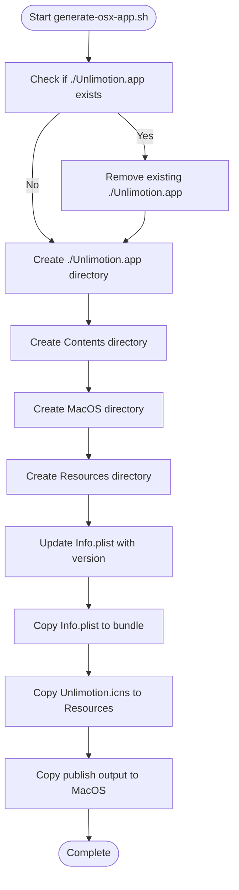
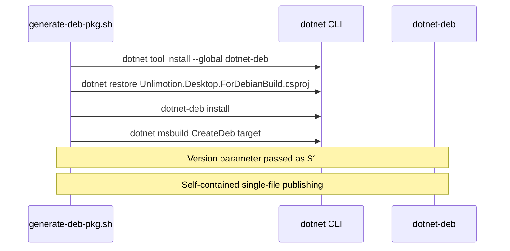
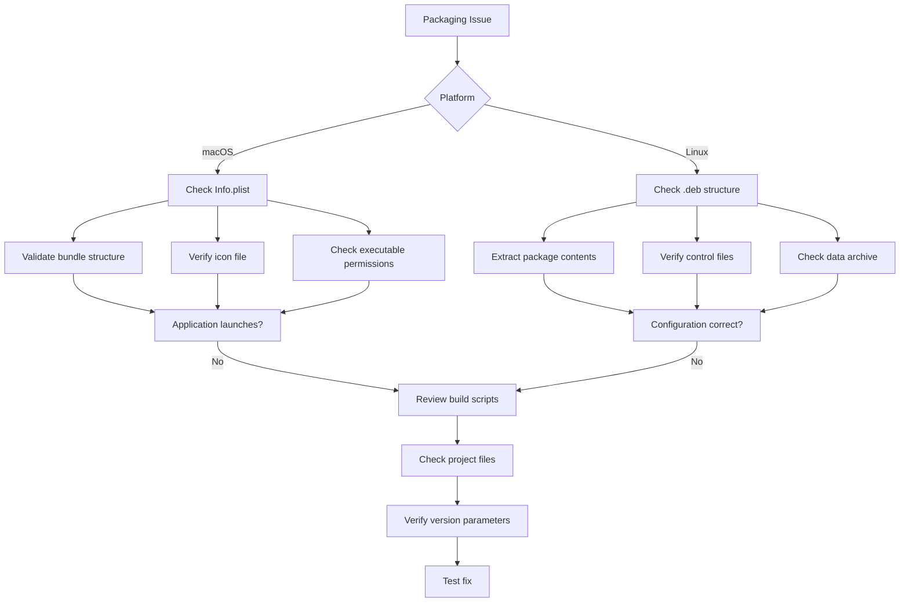

# Desktop Packaging Errors

<cite>
**Referenced Files in This Document**   
- [generate-osx-app.sh](file://src/Unlimotion.Desktop/ci/osx/generate-osx-app.sh)
- [generate-osx-publish.sh](file://src/Unlimotion.Desktop/ci/osx/generate-osx-publish.sh)
- [generate-deb-pkg.sh](file://src/Unlimotion.Desktop/ci/deb/generate-deb-pkg.sh)
- [Unlimotion.Desktop.ForDebianBuild.csproj](file://src/Unlimotion.Desktop/Unlimotion.Desktop.ForDebianBuild.csproj)
- [Unlimotion.Desktop.ForMacBuild.csproj](file://src/Unlimotion.Desktop/Unlimotion.Desktop.ForMacBuild.csproj)
- [Info.plist](file://src/Unlimotion.Desktop/ci/osx/Info.plist)
- [unlimotion.desktop](file://src/Unlimotion.Desktop/ci/deb/unlimotion.desktop)
- [create-symlink.sh](file://src/Unlimotion.Desktop/ci/deb/create-symlink.sh)
</cite>

## Table of Contents
1. [Introduction](#introduction)
2. [macOS Packaging Issues](#macos-packaging-issues)
3. [Debian Packaging Problems](#debian-packaging-problems)
4. [CI Script Errors](#ci-script-errors)
5. [Troubleshooting Common Issues](#troubleshooting-common-issues)
6. [Diagnostic Techniques](#diagnostic-techniques)

## Introduction
This document details common packaging and distribution errors encountered when building Unlimotion desktop applications for macOS and Linux platforms. The analysis focuses on configuration issues in platform-specific build scripts, project file misconfigurations, and CI/CD pipeline failures. The documentation provides insights into proper packaging workflows and troubleshooting methodologies for both macOS and Debian-based Linux distributions.

## macOS Packaging Issues

### Info.plist Misconfigurations
The macOS application bundle requires a properly configured Info.plist file that contains essential metadata about the application. The current implementation in `Info.plist` uses placeholder values for version strings (`CFBundleVersionExample` and `CFBundleShortVersionStringExample`) that must be replaced during the build process. The `generate-osx-app.sh` script performs this replacement using sed commands, but failures can occur if the placeholder strings are modified or if the file permissions prevent editing.

The Info.plist file must contain specific keys including `CFBundleName`, `CFBundleDisplayName`, `CFBundleIdentifier`, and `CFBundleExecutable` with correct values that match the application's actual configuration. Any mismatch between these values and the actual application files will prevent the application from launching properly.

**Section sources**
- [Info.plist](file://src/Unlimotion.Desktop/ci/osx/Info.plist#L1-L29)
- [generate-osx-app.sh](file://src/Unlimotion.Desktop/ci/osx/generate-osx-app.sh#L10-L11)

### Missing .icns Icon Files
The macOS application bundle requires a properly formatted .icns icon file located in the Resources directory. The build process expects the icon file at `Assets/Unlimotion.icns` and copies it to `Contents/Resources/Unlimotion.icns` within the application bundle. If this file is missing, renamed, or in an incorrect format, the application will still build but will display a generic icon in the Finder and Dock.

The `generate-osx-app.sh` script copies the icon file directly without validation, so any issues with the source file will result in a non-functional icon in the final application bundle. This can lead to user confusion and may prevent proper application recognition in the macOS system.

**Section sources**
- [generate-osx-app.sh](file://src/Unlimotion.Desktop/ci/osx/generate-osx-app.sh#L25)
- [Unlimotion.Desktop.ForMacBuild.csproj](file://src/Unlimotion.Desktop/Unlimotion.Desktop.ForMacBuild.csproj#L30)

### Incorrect Bundle Structure
The `generate-osx-app.sh` script is responsible for creating the proper macOS application bundle structure. The script creates the necessary directories (`Contents`, `Contents/MacOS`, and `Contents/Resources`) and copies the required files into their correct locations. Errors in this process can result in an invalid bundle structure that macOS will not recognize as a valid application.

The script uses hardcoded paths for the publish output directory and application name, which could lead to issues if the build configuration changes. Additionally, the script does not validate the existence of required directories or files before attempting to copy them, which could result in incomplete or corrupted application bundles.

**Diagram sources**
- [generate-osx-app.sh](file://src/Unlimotion.Desktop/ci/osx/generate-osx-app.sh#L1-L30)

### Framework Version Mismatches
The `generate-osx-publish.sh` script publishes the application for macOS using .NET 9.0 with the osx-x64 runtime identifier. Version mismatches can occur when the target framework in the build script does not match the framework specified in the `Unlimotion.Desktop.ForMacBuild.csproj` file. The current configuration targets net9.0, but if the .NET SDK version on the build machine does not support this target framework, the publish operation will fail.

Additionally, the script passes the version parameter to the dotnet publish command, but does not validate that the version format is correct for macOS bundle versioning requirements. Invalid version strings can result in a failed bundle creation process.

**Section sources**
- [generate-osx-publish.sh](file://src/Unlimotion.Desktop/ci/osx/generate-osx-publish.sh#L4-L8)
- [Unlimotion.Desktop.ForMacBuild.csproj](file://src/Unlimotion.Desktop/Unlimotion.Desktop.ForMacBuild.csproj#L5-L6)

## Debian Packaging Problems

### Missing dotnet-deb Tool Installation
The Debian packaging process requires the `dotnet-deb` global tool to be installed on the build system. The `generate-deb-pkg.sh` script attempts to install this tool using `dotnet tool install --global dotnet-deb`, but this operation can fail due to network issues, permission problems, or conflicts with existing tool installations. Without this tool, the subsequent `dotnet-deb` command will fail, preventing the creation of the Debian package.

The script does not include error handling for the tool installation step, so any failure will proceed to the next commands, resulting in confusing error messages that may not clearly indicate the root cause of the problem.

**Section sources**
- [generate-deb-pkg.sh](file://src/Unlimotion.Desktop/ci/deb/generate-deb-pkg.sh#L4)

### Incorrect Project Targeting
The `Unlimotion.Desktop.ForDebianBuild.csproj` file is specifically designed for Debian package creation, but contains a configuration issue in the OutputType property. Despite being used for Linux packaging, the project file specifies `<OutputType>WinExe</OutputType>`, which is Windows-specific. While this may not prevent the build from succeeding, it could lead to unexpected behavior or warnings during the packaging process.

The project file correctly specifies the target framework as net9.0 and includes the necessary runtime identifier for Linux-x64, but the Windows-specific output type suggests a potential configuration inconsistency that could cause issues in certain build environments.

**Section sources**
- [Unlimotion.Desktop.ForDebianBuild.csproj](file://src/Unlimotion.Desktop/Unlimotion.Desktop.ForDebianBuild.csproj#L4-L5)

### Failed Single-File Publishing
Both the macOS and Debian packaging scripts attempt to create single-file executables using the `-p:PublishSingleFile=true` and `-p:SelfContained=true` parameters. However, the `Unlimotion.Desktop.ForDebianBuild.csproj` file does not include the `Dotnet.Bundle` package that is present in the Mac build project, which may be necessary for proper single-file publishing on Linux.

The Debian packaging script uses `dotnet msbuild` with the CreateDeb target, but does not verify that the publish operation completed successfully before attempting to create the package. This could result in a Debian package containing an incomplete or corrupted application.

**Diagram sources**
- [generate-deb-pkg.sh](file://src/Unlimotion.Desktop/ci/deb/generate-deb-pkg.sh#L1-L12)
- [Unlimotion.Desktop.ForDebianBuild.csproj](file://src/Unlimotion.Desktop/Unlimotion.Desktop.ForDebianBuild.csproj#L1-L45)

## CI Script Errors

### Incorrect Publish Output Paths
The `generate-osx-app.sh` script uses a hardcoded publish output directory path (`./src/Unlimotion.Desktop/bin/Release/net9.0/osx-x64/publish/.`). This path assumes a specific build configuration and may not match the actual output path if the build parameters are changed. If the publish command outputs to a different directory, the script will fail to find the published files and create an incomplete application bundle.

Similarly, the Debian packaging script does not explicitly specify the output directory for the publish operation, relying on default locations that could vary between build environments. This lack of explicit path configuration can lead to inconsistent build results across different systems.

**Section sources**
- [generate-osx-app.sh](file://src/Unlimotion.Desktop/ci/osx/generate-osx-app.sh#L3)
- [generate-deb-pkg.sh](file://src/Unlimotion.Desktop/ci/deb/generate-deb-pkg.sh#L8)

### Version Injection Failures
The version injection process in the `generate-osx-app.sh` script uses sed commands to replace placeholder version strings in the Info.plist file. This approach is fragile and can fail if:
1. The placeholder strings are modified in the Info.plist file
2. The file encoding is not compatible with sed
3. The script is run on a system where sed behaves differently
4. The version string contains special characters that interfere with the sed command

The script does not validate that the replacement was successful or that the resulting Info.plist file is still a valid XML document, which could result in a corrupted application bundle that fails to launch.

**Section sources**
- [generate-osx-app.sh](file://src/Unlimotion.Desktop/ci/osx/generate-osx-app.sh#L10-L11)
- [Info.plist](file://src/Unlimotion.Desktop/ci/osx/Info.plist#L12-L13)

### Native Library Extraction Issues
Both packaging scripts use the `-p:IncludeNativeLibrariesForSelfExtract=true` parameter to include native libraries for self-extraction. However, the `Unlimotion.Desktop.ForDebianBuild.csproj` file does not include the `Dotnet.Bundle` package that is present in the Mac build project, which may be required for proper handling of native libraries on Linux.

The Debian packaging process also includes a `create-symlink.sh` script that creates a symbolic link to the application binary, but this script assumes the binary will be located at `/usr/local/bin/Unlimotion.Desktop`. If the installation path differs, the symlink will point to a non-existent location, preventing the application from launching.

**Section sources**
- [generate-osx-publish.sh](file://src/Unlimotion.Desktop/ci/osx/generate-osx-publish.sh#L8)
- [generate-deb-pkg.sh](file://src/Unlimotion.Desktop/ci/deb/generate-deb-pkg.sh#L11)
- [create-symlink.sh](file://src/Unlimotion.Desktop/ci/deb/create-symlink.sh#L3)

## Troubleshooting Common Issues

### Missing Runtime Assets
When publishing self-contained applications, it's essential to ensure all required runtime assets are included. For macOS, this includes the Info.plist file, .icns icon, and any platform-specific native libraries. For Debian packages, the required dependencies are specified in the `DebDotNetDependencies` item group in the project file.

Missing runtime assets can be diagnosed by examining the publish output directory and comparing it with the expected file structure. The `dotnet publish` command should be run with detailed logging to identify any missing assets or failed copy operations.

### Executable Permission Errors
On Linux systems, executable permission errors can prevent the application from launching. The `Unlimotion.Desktop.ForDebianBuild.csproj` file correctly specifies LinuxFileMode="744" for the icon file and "755" for the create-symlink.sh script, but does not explicitly set permissions for the main executable.

After installation, verify that the main application binary has execute permissions. If not, the package should be modified to ensure proper permissions are set during installation.

### Platform-Specific Dependency Loading Failures
Platform-specific dependencies may fail to load if there are version mismatches or missing system libraries. The Debian package specifies dependencies including libc6, libgcc1, libgssapi-krb5-2, libstdc++6, zlib1g, libssl, and libicu with version ranges. If the target system does not have compatible versions of these libraries, the application will fail to start.

For macOS, framework version mismatches can occur if the application is built with a newer .NET SDK than is available on the target system. Always verify that the target system has the required .NET runtime version installed.

## Diagnostic Techniques

### Analyzing Packaged Application Contents
To diagnose packaging issues, examine the contents of the generated packages:

For macOS .app bundles:
- Verify the directory structure follows the standard bundle format
- Check that Info.plist contains correct values for all keys
- Ensure the executable has proper permissions
- Validate that all required files are present in the Contents/MacOS directory

For Debian .deb packages:
- Extract the package using `ar x package.deb` to examine its contents
- Check the control.tar.gz archive for proper configuration files
- Verify the data.tar.gz archive contains all required application files
- Examine the postinst script for proper installation steps

### Validating Deployment Manifests
Deployment manifests should be validated against the expected structure:

For macOS Info.plist:
- Ensure all required keys are present and have valid values
- Verify version strings follow the format x.x.x
- Check that bundle identifiers use reverse domain name notation
- Validate that file paths and names match the actual application

For Debian desktop files:
- Verify the Exec path matches the installed application location
- Check that the Icon path points to the correct icon file
- Ensure the Categories field uses standard desktop entry categories
- Validate that the MIME type associations are correct

**Diagram sources**
- [generate-osx-app.sh](file://src/Unlimotion.Desktop/ci/osx/generate-osx-app.sh)
- [generate-deb-pkg.sh](file://src/Unlimotion.Desktop/ci/deb/generate-deb-pkg.sh)
- [Info.plist](file://src/Unlimotion.Desktop/ci/osx/Info.plist)
- [unlimotion.desktop](file://src/Unlimotion.Desktop/ci/deb/unlimotion.desktop)