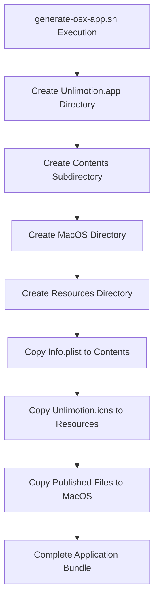
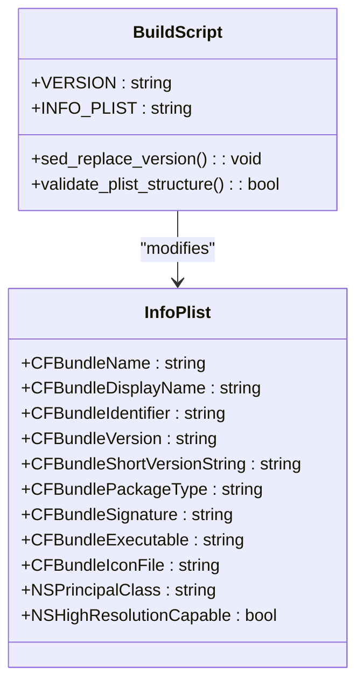
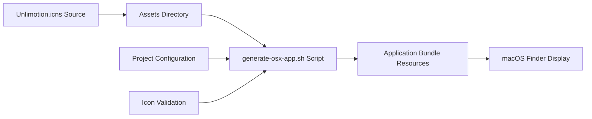
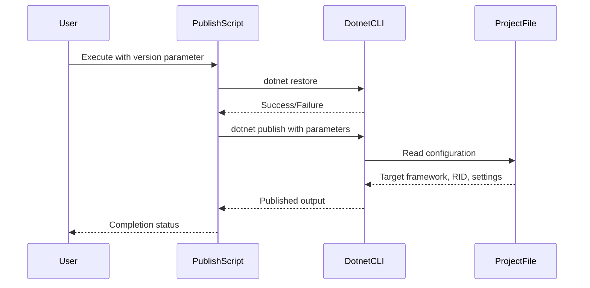
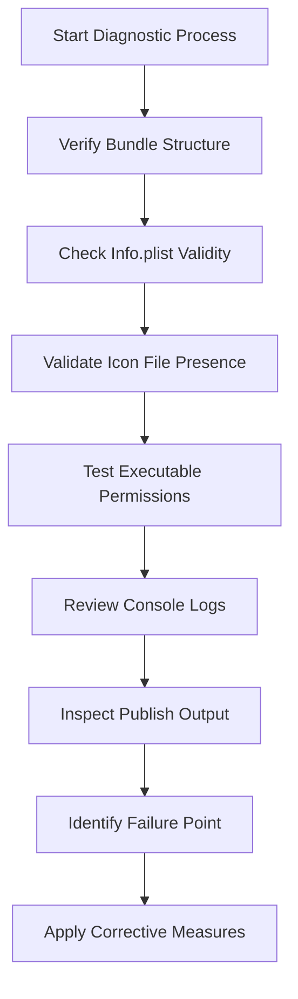
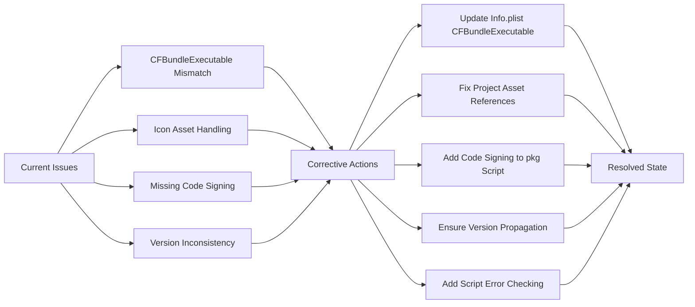

# macOS Packaging Errors

<cite>
**Referenced Files in This Document**   
- [generate-osx-app.sh](file://src/Unlimotion.Desktop/ci/osx/generate-osx-app.sh)
- [generate-osx-publish.sh](file://src/Unlimotion.Desktop/ci/osx/generate-osx-publish.sh)
- [generate-osx-pkg.sh](file://src/Unlimotion.Desktop/ci/osx/generate-osx-pkg.sh)
- [Info.plist](file://src/Unlimotion.Desktop/ci/osx/Info.plist)
- [Unlimotion.Desktop.ForMacBuild.csproj](file://src/Unlimotion.Desktop/Unlimotion.Desktop.ForMacBuild.csproj)
- [run.macos.sh](file://run.macos.sh)
</cite>

## Table of Contents
1. [Introduction](#introduction)
2. [Application Bundle Structure Issues](#application-bundle-structure-issues)
3. [Info.plist Configuration Errors](#infoplist-configuration-errors)
4. [Icon File and Asset Management](#icon-file-and-asset-management)
5. [Publishing Script Failures](#publishing-script-failures)
6. [.NET Runtime and Dependency Issues](#net-runtime-and-dependency-issues)
7. [Code Signing and Distribution Problems](#code-signing-and-distribution-problems)
8. [Bundle Validation and Diagnostic Procedures](#bundle-validation-and-diagnostic-procedures)
9. [Troubleshooting Launch Failures](#troubleshooting-launch-failures)
10. [Corrective Measures and Best Practices](#corrective-measures-and-best-practices)

## Introduction
This document addresses common macOS packaging errors encountered in the Unlimotion application build process. The focus is on issues related to the generate-osx-app.sh and generate-osx-publish.sh scripts, which are responsible for creating properly structured macOS application bundles and publishing self-contained executables. The documentation covers configuration errors in Info.plist, missing or invalid icon files, improper bundle structure, .NET runtime version mismatches, and code signing problems that prevent successful deployment and execution on macOS systems.

**Section sources**
- [generate-osx-app.sh](file://src/Unlimotion.Desktop/ci/osx/generate-osx-app.sh#L1-L29)
- [generate-osx-publish.sh](file://src/Unlimotion.Desktop/ci/osx/generate-osx-publish.sh#L1-L7)

## Application Bundle Structure Issues
The generate-osx-app.sh script is responsible for creating the proper macOS application bundle structure with the required Contents, MacOS, and Resources directories. Common structural issues include incorrect directory hierarchy, missing required subdirectories, or improper file placement within the bundle. The script creates the standard .app bundle format with Contents/MacOS containing the published .NET application and Contents/Resources containing assets like icon files. Errors in this process can result in macOS refusing to recognize the application bundle or failing to launch.

**Diagram sources**
- [generate-osx-app.sh](file://src/Unlimotion.Desktop/ci/osx/generate-osx-app.sh#L15-L28)

**Section sources**
- [generate-osx-app.sh](file://src/Unlimotion.Desktop/ci/osx/generate-osx-app.sh#L15-L28)

## Info.plist Configuration Errors
The Info.plist file contains critical metadata for macOS applications, including bundle identifiers, version information, and executable references. The generate-osx-app.sh script uses placeholder values (CFBundleVersionExample and CFBundleShortVersionStringExample) that are replaced with the actual version during the build process. Issues arise when these placeholders are not properly substituted, when the CFBundleIdentifier is incorrect or conflicts with existing applications, or when the CFBundleExecutable name does not match the actual published binary. The current configuration shows a discrepancy between the CFBundleExecutable value in Info.plist (Unlimotion.Desktop.ForMacBuild) and the project file (Unlimotion.Desktop.ForMacOSBuild), which would cause launch failures.

**Diagram sources**
- [Info.plist](file://src/Unlimotion.Desktop/ci/osx/Info.plist#L1-L28)
- [generate-osx-app.sh](file://src/Unlimotion.Desktop/ci/osx/generate-osx-app.sh#L10-L11)

**Section sources**
- [Info.plist](file://src/Unlimotion.Desktop/ci/osx/Info.plist#L1-L28)
- [generate-osx-app.sh](file://src/Unlimotion.Desktop/ci/osx/generate-osx-app.sh#L10-L11)

## Icon File and Asset Management
The application icon is specified in both the Info.plist file and the project configuration as Unlimotion.icns. The generate-osx-app.sh script attempts to copy this icon from ./src/Unlimotion.Desktop/Assets/Unlimotion.icns to the bundle's Resources directory. Common issues include missing icon files, incorrect file formats (non-ICNS format), or permission problems preventing file copying. The project file explicitly references the icon file but also excludes it from packaging (via the None Remove directive), creating a potential conflict in asset handling that could result in missing icons in the final application bundle.

**Diagram sources**
- [generate-osx-app.sh](file://src/Unlimotion.Desktop/ci/osx/generate-osx-app.sh#L9-L27)
- [Unlimotion.Desktop.ForMacBuild.csproj](file://src/Unlimotion.Desktop/Unlimotion.Desktop.ForMacBuild.csproj#L20-L21)

**Section sources**
- [generate-osx-app.sh](file://src/Unlimotion.Desktop/ci/osx/generate-osx-app.sh#L9-L27)
- [Unlimotion.Desktop.ForMacBuild.csproj](file://src/Unlimotion.Desktop/Unlimotion.Desktop.ForMacBuild.csproj#L20-L21)

## Publishing Script Failures
The generate-osx-publish.sh script orchestrates the .NET publishing process for macOS targets. It restores packages and publishes the application with specific parameters including self-contained deployment, single-file packaging, and native library inclusion. Failures in this script can stem from version parameter issues, incorrect project file paths, or incompatible publish settings. The script accepts a version parameter that should propagate to both the publish process and subsequent bundling steps, but any disruption in this chain can result in version mismatches between the published binary and the Info.plist configuration.

**Diagram sources**
- [generate-osx-publish.sh](file://src/Unlimotion.Desktop/ci/osx/generate-osx-publish.sh#L1-L7)

**Section sources**
- [generate-osx-publish.sh](file://src/Unlimotion.Desktop/ci/osx/generate-osx-publish.sh#L1-L7)

## .NET Runtime and Dependency Issues
The application targets .NET 9.0 with osx-x64 runtime identifier, requiring the appropriate .NET runtime to be available or bundled with the application. The publish configuration includes IncludeNativeLibrariesForSelfExtract=true to ensure native dependencies are properly packaged. Issues can arise from runtime version mismatches between development and target systems, missing native libraries required by Avalonia or other dependencies, or incorrect trimming settings that remove essential components. The current configuration uses TrimMode=copyused which may not be fully compatible with all Avalonia features, potentially causing runtime errors on target systems.

**Section sources**
- [Unlimotion.Desktop.ForMacBuild.csproj](file://src/Unlimotion.Desktop/Unlimotion.Desktop.ForMacBuild.csproj#L1-L46)

## Code Signing and Distribution Problems
The generate-osx-pkg.sh script uses the productbuild command to create a distributable .pkg installer from the application bundle. This process typically requires proper code signing certificates and entitlements to create a notarized package that macOS will allow users to install. The current implementation lacks code signing parameters, which would result in macOS flagging the installer as from an unidentified developer. Additionally, the Info.plist contains a placeholder signature (????) rather than a valid signature, which may affect the application's security context and entitlements on newer macOS versions with stricter security requirements.

**Section sources**
- [generate-osx-pkg.sh](file://src/Unlimotion.Desktop/ci/osx/generate-osx-pkg.sh#L1-L4)

## Bundle Validation and Diagnostic Procedures
To diagnose packaging issues, several validation steps should be performed. First, verify the application bundle structure contains all required directories and files. Use the plutil command to validate the Info.plist syntax and content. Check file permissions on the executable within the MacOS directory to ensure it is executable. Examine the console logs during application launch for error messages related to missing files, code signing issues, or runtime failures. The dotnet publish output should be inspected to confirm all dependencies are included and the single-file packaging completed successfully.

**Diagram sources**
- [generate-osx-app.sh](file://src/Unlimotion.Desktop/ci/osx/generate-osx-app.sh#L1-L29)
- [generate-osx-publish.sh](file://src/Unlimotion.Desktop/ci/osx/generate-osx-publish.sh#L1-L7)

**Section sources**
- [generate-osx-app.sh](file://src/Unlimotion.Desktop/ci/osx/generate-osx-app.sh#L1-L29)
- [generate-osx-publish.sh](file://src/Unlimotion.Desktop/ci/osx/generate-osx-publish.sh#L1-L7)

## Troubleshooting Launch Failures
When the application fails to launch on target systems, systematic troubleshooting should begin with examining the macOS Console application for error messages. Common issues include missing .NET runtime components, incorrect executable paths in Info.plist, or missing icon files that cause the application to fail during startup. Verify that the CFBundleExecutable value matches the actual published binary name in the MacOS directory. Check that the application has proper execute permissions (chmod +x). If the application crashes immediately, run it from the command line to capture any .NET runtime errors or exception stack traces that may not appear in the GUI error dialogs.

**Section sources**
- [Info.plist](file://src/Unlimotion.Desktop/ci/osx/Info.plist#L1-L28)
- [generate-osx-app.sh](file://src/Unlimotion.Desktop/ci/osx/generate-osx-app.sh#L1-L29)

## Corrective Measures and Best Practices
To resolve the identified packaging issues, several corrective measures should be implemented. First, fix the CFBundleExecutable inconsistency between the Info.plist and project file to ensure the executable name matches exactly. Implement proper error checking in the shell scripts to validate file existence before copying operations. Add code signing parameters to the pkg generation script for proper distribution. Ensure the icon file is properly included in the build process by correcting the asset handling in the project file. Implement version propagation from the publish script to the Info.plist modification step to maintain consistency across all version references.

**Diagram sources**
- [Info.plist](file://src/Unlimotion.Desktop/ci/osx/Info.plist#L1-L28)
- [Unlimotion.Desktop.ForMacBuild.csproj](file://src/Unlimotion.Desktop/Unlimotion.Desktop.ForMacBuild.csproj#L1-L46)
- [generate-osx-app.sh](file://src/Unlimotion.Desktop/ci/osx/generate-osx-app.sh#L1-L29)
- [generate-osx-publish.sh](file://src/Unlimotion.Desktop/ci/osx/generate-osx-publish.sh#L1-L7)

**Section sources**
- [Info.plist](file://src/Unlimotion.Desktop/ci/osx/Info.plist#L1-L28)
- [Unlimotion.Desktop.ForMacBuild.csproj](file://src/Unlimotion.Desktop/Unlimotion.Desktop.ForMacBuild.csproj#L1-L46)
- [generate-osx-app.sh](file://src/Unlimotion.Desktop/ci/osx/generate-osx-app.sh#L1-L29)
- [generate-osx-publish.sh](file://src/Unlimotion.Desktop/ci/osx/generate-osx-publish.sh#L1-L7)