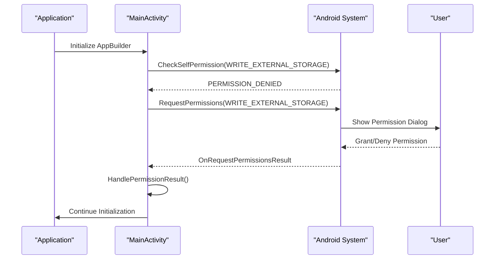
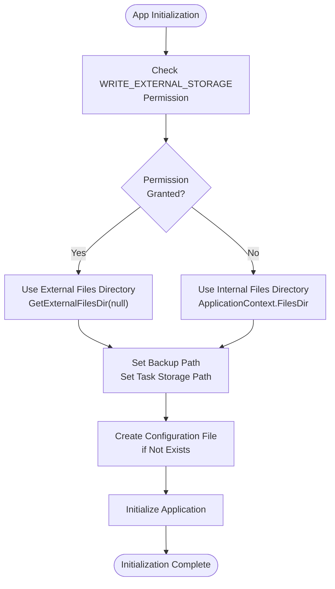
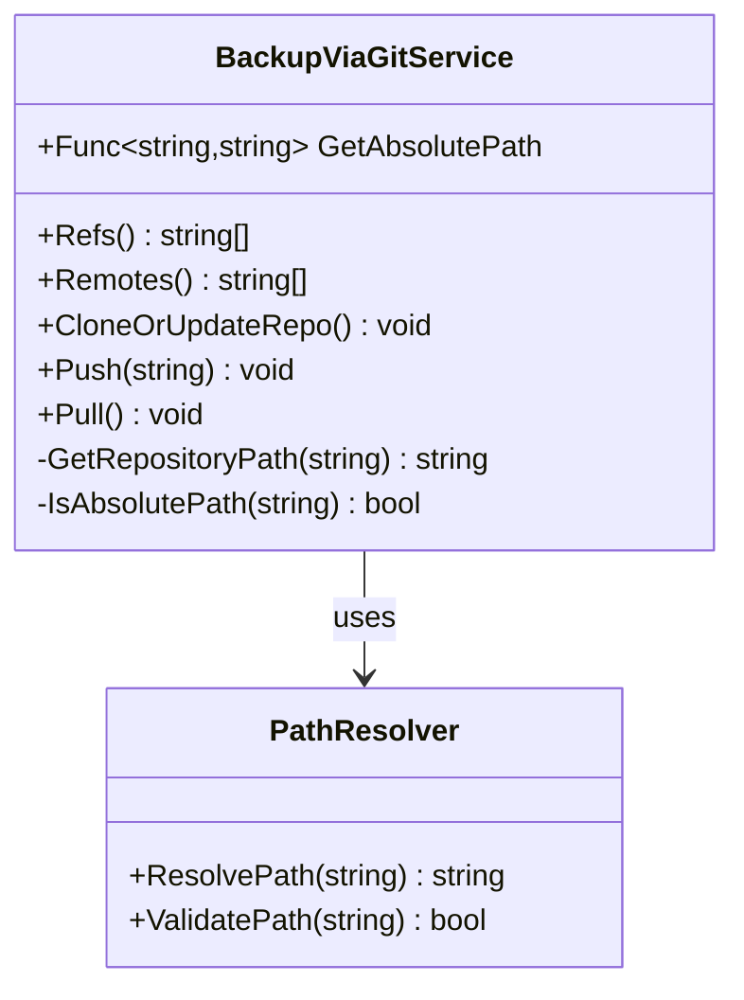
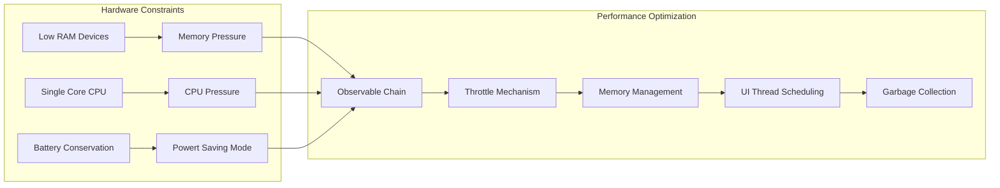

# Android Platform Errors

<cite>
**Referenced Files in This Document**
- [MainActivity.cs](file://src/Unlimotion.Android/MainActivity.cs)
- [AndroidManifest.xml](file://src/Unlimotion.Android/Properties/AndroidManifest.xml)
- [Unlimotion.Android.csproj](file://src/Unlimotion.Android/Unlimotion.Android.csproj)
- [BackupViaGitService.cs](file://src/Unlimotion\Services\BackupViaGitService.cs)
- [FileTaskStorage.cs](file://src\Unlimotion\FileTaskStorage.cs)
- [ObservableExceptionHandler.cs](file://src\Unlimotion.ViewModel\ObservableExceptionHandler.cs)
- [App.axaml.cs](file://src\Unlimotion\App.axaml.cs)
- [styles.xml](file://src\Unlimotion.Android\Resources\values\styles.xml)
- [splash_screen.xml](file://src\Unlimotion.Android\Resources\drawable\splash_screen.xml)
</cite>

## Table of Contents
1. [Introduction](#introduction)
2. [Common Android Platform Errors](#common-android-platform-errors)
3. [Runtime Permission Denial Issues](#runtime-permission-denial-issues)
4. [External Storage Access Problems](#external-storage-access-problems)
5. [Configuration File Management](#configuration-file-management)
6. [Git Backup Path Mapping](#git-backup-path-mapping)
7. [Hybrid UI Rendering Issues](#hybrid-ui-rendering-issues)
8. [Performance Considerations](#performance-considerations)
9. [Manifest Configuration Requirements](#manifest-configuration-requirements)
10. [Troubleshooting Guide](#troubleshooting-guide)
11. [Best Practices](#best-practices)
12. [Diagnostic Techniques](#diagnostic-techniques)

## Introduction

Unlimotion's Android implementation faces several platform-specific challenges that can lead to runtime errors and degraded user experience. This document provides comprehensive coverage of common Android platform errors, their causes, and proven solutions for the Unlimotion application.

The Android platform presents unique challenges including runtime permission management, external storage access limitations, file path resolution complexities, and performance considerations on lower-powered hardware. Understanding these issues is crucial for maintaining a reliable and responsive application.

## Common Android Platform Errors

### Runtime Permission System Failures

Android's runtime permission model requires explicit user consent for accessing sensitive resources. The most common failure occurs when storage permissions are denied, leading to application crashes or data loss.

**Primary Failure Modes:**
- Permission denial during initial app startup
- Missing permission callback handling
- Incorrect permission state checking
- Fallback strategies failing silently

### External Storage Access Issues

Modern Android versions impose strict restrictions on external storage access, particularly affecting applications targeting API level 29+.

**Common Problems:**
- Scoped storage compliance violations
- Incorrect directory path resolution
- Insufficient storage space detection
- Network storage accessibility issues

### File System Operation Failures

File operations on Android often encounter platform-specific limitations and require careful error handling.

**Typical Issues:**
- File locking conflicts
- Path resolution failures
- Directory creation errors
- File corruption detection

## Runtime Permission Denial Issues

### Permission Request Implementation

The Android platform requires runtime permission requests for accessing external storage. The current implementation demonstrates both correct and problematic approaches.



**Diagram sources**
- [MainActivity.cs](file://src\Unlimotion.Android\MainActivity.cs#L40-L69)

### Permission Callback Handling

The `OnRequestPermissionsResult` method handles user responses to permission requests. Proper implementation ensures graceful degradation when permissions are denied.

**Critical Implementation Points:**
- Verify request code matches expected identifier
- Check grant results length before accessing array
- Provide meaningful user feedback for denied permissions
- Implement fallback storage strategies

**Section sources**
- [MainActivity.cs](file://src\Unlimotion.Android\MainActivity.cs#L78-L95)

### Incorrect Permission State Checking

A common error occurs when permission state is checked multiple times without proper caching or state management. The current implementation redundantly checks permissions, which can lead to inconsistent behavior.

**Problematic Pattern:**
```csharp
// Redundant permission checks
if (ContextCompat.CheckSelfPermission(this, Manifest.Permission.WriteExternalStorage) != Permission.Granted)
{
    // Request permission
}
else
{
    // Assume granted
}

// Later in code...
if (ContextCompat.CheckSelfPermission(this, Manifest.Permission.WriteExternalStorage) != Permission.Granted)
{
    // Use internal storage fallback
}
else
{
    // Use external storage
}
```

**Recommended Solution:**
Store permission state in a class-level variable and reuse it throughout the lifecycle.

## External Storage Access Problems

### Storage Path Resolution Strategy

The application implements a sophisticated fallback mechanism for storage path resolution, prioritizing external storage when available and falling back to internal storage when permissions are denied.



**Diagram sources**
- [MainActivity.cs](file://src\Unlimotion.Android\MainActivity.cs#L40-L69)

### External Storage Availability Detection

The application must handle scenarios where external storage becomes unavailable during runtime, such as when a removable SD card is ejected.

**Detection Strategies:**
- Monitor storage mount/unmount events
- Validate directory accessibility before file operations
- Implement retry mechanisms for transient failures
- Provide user notifications for storage issues

### Scoped Storage Compliance

Modern Android versions enforce scoped storage, requiring applications to use the Storage Access Framework for external storage access.

**Compliance Requirements:**
- Use `GetExternalFilesDir()` instead of raw path construction
- Implement proper MediaStore integration for media files
- Handle `Environment.isExternalStorageEmulated()` scenarios
- Respect user storage preferences

**Section sources**
- [MainActivity.cs](file://src\Unlimotion.Android\MainActivity.cs#L40-L69)

## Configuration File Management

### Default Configuration Creation

The application creates a default configuration file if none exists, ensuring the application can initialize properly even on fresh installations.

**Configuration Management Issues:**
- Race conditions during concurrent access
- File permission conflicts
- Corrupted configuration file detection
- Migration from older configuration formats

### JSON Configuration Validation

The configuration system relies on JSON serialization, which can fail due to various reasons including malformed data or insufficient disk space.

**Validation Strategies:**
- Implement configuration schema validation
- Provide default values for missing properties
- Log configuration loading errors for debugging
- Support configuration migration between versions

**Section sources**
- [MainActivity.cs](file://src\Unlimotion.Android\MainActivity.cs#L68-L75)

## Git Backup Path Mapping

### Path Resolution for Git Operations

The `BackupViaGitService` uses a delegate-based approach for path resolution, allowing flexibility in storage location while maintaining consistency across the application.



**Diagram sources**
- [BackupViaGitService.cs](file://src\Unlimotion\Services\BackupViaGitService.cs#L15-L20)

### Git Repository Initialization

The Git service must handle various initialization scenarios including first-time setup, repository corruption, and network connectivity issues.

**Initialization Challenges:**
- Remote repository cloning failures
- Authentication credential management
- Local repository corruption detection
- Branch and remote configuration

**Section sources**
- [BackupViaGitService.cs](file://src\Unlimotion\Services\BackupViaGitService.cs#L70-L95)

## Hybrid UI Rendering Issues

### Avalonia Android Integration

Unlimotion uses Avalonia for cross-platform UI development, which introduces platform-specific rendering challenges on Android.

**Common UI Issues:**
- Layout calculation problems on different screen densities
- Touch input handling inconsistencies
- Animation performance on low-end devices
- Theme switching during runtime

### Reactive UI Performance

The application uses ReactiveUI for data binding, which can cause performance issues on lower-powered Android devices.

**Performance Bottlenecks:**
- Excessive property change notifications
- Complex observable chains
- Memory leaks in subscription management
- UI thread blocking during heavy computations

**Section sources**
- [MainActivity.cs](file://src\Unlimotion.Android\MainActivity.cs#L100-L105)

## Performance Considerations

### Reactive Data Binding Optimization

The application implements extensive reactive data binding, which requires careful optimization for mobile devices.



**Optimization Strategies:**
- Implement throttling for frequently changing properties
- Use weak references in observable subscriptions
- Optimize memory allocation patterns
- Reduce UI thread blocking operations

### File System Operation Performance

File operations on Android can be slow due to underlying storage technology and Android's file system overhead.

**Performance Improvements:**
- Batch file operations when possible
- Use asynchronous file I/O operations
- Implement file caching strategies
- Optimize directory traversal algorithms

**Section sources**
- [FileTaskStorage.cs](file://src\Unlimotion\FileTaskStorage.cs#L150-L180)

## Manifest Configuration Requirements

### Required Permissions

The Android manifest defines essential permissions for application functionality.

| Permission | Purpose | Rationale |
|------------|---------|-----------|
| `INTERNET` | Network communication | Git operations, remote backups |
| `READ_EXTERNAL_STORAGE` | File reading access | Task data retrieval |
| `WRITE_EXTERNAL_STORAGE` | File writing access | Task data modification |

### Activity Configuration

The main activity requires specific configuration for optimal Android integration.

**Configuration Attributes:**
- `MainLauncher = true`: Designates primary entry point
- `ResizeableActivity = true`: Supports multi-window mode
- `WindowSoftInputMode = AdjustResize`: Handles keyboard display
- `ConfigurationChanges`: Manages orientation and size changes

**Section sources**
- [AndroidManifest.xml](file://src\Unlimotion.Android\Properties\AndroidManifest.xml#L2-L5)
- [MainActivity.cs](file://src\Unlimotion.Android\MainActivity.cs#L25-L32)

### Target SDK Version Compatibility

The application targets Android API level 21+, requiring consideration of platform evolution.

**Compatibility Considerations:**
- Runtime permission system (API 23+)
- Scoped storage (API 29+)
- Background execution limits (API 26+)
- Battery optimization requirements (API 23+)

**Section sources**
- [Unlimotion.Android.csproj](file://src\Unlimotion.Android\Unlimotion.Android.csproj#L5-L6)

## Troubleshooting Guide

### Permission Denial Diagnosis

**Symptoms:**
- Application crashes during file operations
- Missing configuration file creation
- External storage path resolution failures

**Diagnostic Steps:**
1. Check permission status using `ContextCompat.CheckSelfPermission()`
2. Verify manifest declaration of required permissions
3. Review user permission history
4. Test on different Android versions

**Resolution Strategies:**
- Implement graceful permission denial handling
- Provide clear user guidance for enabling permissions
- Offer alternative functionality when permissions are denied
- Log permission-related errors for debugging

### Storage Access Issues

**Common Symptoms:**
- File creation failures
- Directory enumeration errors
- Disk space detection problems

**Troubleshooting Process:**
1. Verify storage availability using `Environment.getExternalStorageState()`
2. Check available disk space with `StatFs` equivalent
3. Validate directory permissions and ownership
4. Test with different storage locations

### Git Backup Failures

**Diagnosis Checklist:**
- Network connectivity verification
- Authentication credential validation
- Repository accessibility testing
- Branch and remote configuration review

**Recovery Procedures:**
- Implement automatic retry mechanisms
- Provide manual synchronization options
- Log detailed error information for support
- Offer repository repair utilities

**Section sources**
- [ObservableExceptionHandler.cs](file://src\Unlimotion.ViewModel\ObservableExceptionHandler.cs#L18-L30)

## Best Practices

### Permission Management

**Implementation Guidelines:**
- Store permission state in class members
- Use consistent permission request patterns
- Provide clear user rationale for permissions
- Implement appropriate fallback strategies

### Storage Path Management

**Best Practices:**
- Use Android's recommended storage APIs
- Implement robust path validation
- Handle storage unavailability gracefully
- Provide user feedback for storage issues

### Error Handling Strategy

**Comprehensive Error Management:**
- Implement centralized exception handling
- Provide meaningful error messages to users
- Log errors for debugging and analytics
- Enable error reporting for support teams

**Section sources**
- [ObservableExceptionHandler.cs](file://src\Unlimotion.ViewModel\ObservableExceptionHandler.cs#L10-L50)

## Diagnostic Techniques

### Logging and Monitoring

The application implements structured logging for Android-specific issues.

**Logging Categories:**
- Permission-related events
- Storage access operations
- Git backup activities
- UI rendering performance

### Performance Profiling

**Monitoring Tools:**
- Android Studio's profiling tools
- Memory usage monitoring
- CPU performance analysis
- Battery impact assessment

### User Experience Analytics

**Tracking Metrics:**
- Permission denial rates
- Storage access failures
- Git operation success rates
- UI responsiveness measurements

**Section sources**
- [ObservableExceptionHandler.cs](file://src\Unlimotion.ViewModel\ObservableExceptionHandler.cs#L18-L30)

## Conclusion

Android platform errors in Unlimotion primarily stem from runtime permission management, external storage access limitations, and performance considerations on diverse hardware configurations. By implementing the strategies and best practices outlined in this document, developers can significantly reduce error occurrences and improve overall application reliability.

The key to successful Android deployment lies in thorough testing across different device configurations, implementing robust error handling, and providing clear user guidance for permission management. Regular monitoring and analytics help identify emerging issues and track the effectiveness of implemented solutions.

Future improvements should focus on enhanced automated testing for Android-specific scenarios, expanded error reporting capabilities, and continued optimization for increasingly diverse Android device ecosystems.