# Mobile Platform Errors

<cite>
**Referenced Files in This Document**   
- [MainActivity.cs](file://src/Unlimotion.Android/MainActivity.cs)
- [AppDelegate.cs](file://src/Unlimotion.iOS/AppDelegate.cs)
- [App.axaml.cs](file://src/Unlimotion/App.axaml.cs)
- [BackupViaGitService.cs](file://src/Unlimotion/Services/BackupViaGitService.cs)
- [FileTaskStorage.cs](file://src/Unlimotion/FileTaskStorage.cs)
- [TaskStorages.cs](file://src/Unlimotion/TaskStorages.cs)
- [TaskStorageSettings.cs](file://src/Unlimotion.ViewModel/TaskStorageSettings.cs)
- [AndroidManifest.xml](file://src/Unlimotion.Android/Properties/AndroidManifest.xml)
</cite>

## Table of Contents
1. [Introduction](#introduction)
2. [Android-Specific Issues](#android-specific-issues)
3. [iOS-Specific Limitations](#ios-specific-limitations)
4. [Common Mobile Failure Modes](#common-mobile-failure-modes)
5. [Storage Permission Handling](#storage-permission-handling)
6. [File Access and Path Resolution](#file-access-and-path-resolution)
7. [Git Backup Path Resolution](#git-backup-path-resolution)
8. [Troubleshooting Guide](#troubleshooting-guide)
9. [Hybrid UI Rendering Issues](#hybrid-ui-rendering-issues)
10. [Performance Considerations](#performance-considerations)

## Introduction
This document provides comprehensive analysis of mobile-specific errors in Unlimotion, focusing on platform-specific issues that arise on Android and iOS devices. The application uses Avalonia UI framework for cross-platform development, which introduces unique challenges in mobile environments related to storage permissions, file system access, and lifecycle management. This documentation covers Android runtime permission denials, iOS sandboxing limitations, common failure modes in data directory initialization, and proper handling of mobile-specific functionality.

## Android-Specific Issues

### Runtime Permission Denials for External Storage
Unlimotion on Android requires explicit runtime permissions to access external storage for saving task data and configuration files. The application implements a permission request mechanism in MainActivity.cs that checks for WRITE_EXTERNAL_STORAGE permission during initialization. If permission is not granted, the app falls back to internal storage, which has limited capacity and may affect backup functionality.

The current implementation has a potential race condition where permission checks are performed multiple times in quick succession, potentially leading to inconsistent state management. The app requests permissions using ActivityCompat.RequestPermissions with a callback to OnRequestPermissionsResult, but there's no retry mechanism if the user initially denies permission and later wants to enable it through system settings.

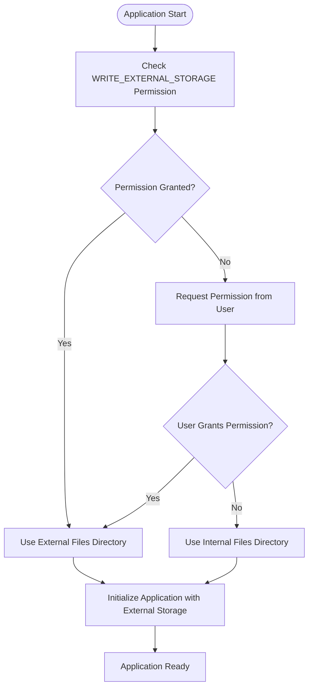

**Diagram sources**
- [MainActivity.cs](file://src/Unlimotion.Android/MainActivity.cs#L40-L69)

**Section sources**
- [MainActivity.cs](file://src/Unlimotion.Android/MainActivity.cs#L40-L111)
- [AndroidManifest.xml](file://src/Unlimotion.Android/Properties/AndroidManifest.xml#L1-L6)

### Failed File Path Resolution
Android file path resolution in Unlimotion depends on the storage permission state. When external storage permission is granted, the app uses GetExternalFilesDir to obtain the external files directory path. When permission is denied, it falls back to FilesDir for internal storage. This dual-path strategy can lead to issues when the app is updated or reinstalled, as data may be split between internal and external storage locations.

The path resolution occurs in the CustomizeAppBuilder method of MainActivity.cs, where dataDir is set based on permission status. This value is then used to set TaskStorages.DefaultStoragePath and configure the BackupViaGitService.GetAbsolutePath delegate. If the permission state changes between app sessions, the app may not properly migrate data between storage locations, leading to data loss or inconsistency.

### Improper Handling of Permission Result Callbacks
The OnRequestPermissionsResult implementation in MainActivity.cs contains a basic permission result handler that shows a toast notification when permission is denied. However, it lacks comprehensive error handling and user guidance. The current implementation only handles the RequestStorageId request code and provides minimal feedback to the user about the consequences of denying storage permission.

The callback properly calls the base method and checks the grantResults array, but it doesn't implement any fallback strategies beyond showing a toast message. There's no mechanism to re-attempt critical operations that require storage access, nor does it provide guidance on how to manually enable permissions through device settings.

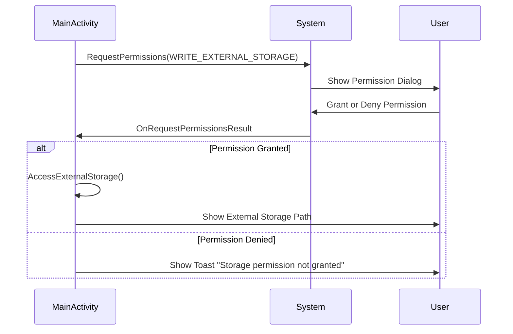

**Diagram sources**
- [MainActivity.cs](file://src/Unlimotion.Android/MainActivity.cs#L92-L111)

**Section sources**
- [MainActivity.cs](file://src/Unlimotion.Android/MainActivity.cs#L92-L111)

## iOS-Specific Limitations

### Sandboxed File System Access
iOS enforces strict sandboxing that limits Unlimotion's file system access to its designated container directory. Unlike Android, iOS does not have a concept of external storage that apps can freely access. The current AppDelegate.cs implementation does not explicitly configure any file system access beyond the default app container, which may limit the app's ability to share files with other applications or access documents from the Files app.

The iOS version lacks specific code for configuring document picker access or implementing file provider extensions that would allow users to save tasks to iCloud Drive or other cloud storage services. This limitation affects the Git backup functionality, as users cannot easily access the repository files for manual backup or inspection.

### Missing Resource Bundling
The iOS implementation in AppDelegate.cs is minimal and does not include proper resource bundling configuration. While the Android version explicitly handles resources through the Resources directory and manifest configuration, the iOS version does not demonstrate how assets such as splash screens, icons, or localized strings are bundled with the application.

This could lead to missing or incorrectly displayed assets on iOS devices, particularly when the app is installed on different device types with varying screen resolutions and display characteristics. The current implementation inherits basic Avalonia iOS functionality but does not customize the resource loading process to ensure all application assets are properly included and accessible.

### AppDelegate Lifecycle Integration with Avalonia
The AppDelegate.cs file shows a basic integration with Avalonia but lacks comprehensive lifecycle event handling. The CustomizeAppBuilder method simply returns the base configuration with custom font and ReactiveUI support, without implementing any iOS-specific lifecycle management.

Critical iOS lifecycle events such as applicationDidEnterBackground, applicationWillEnterForeground, or memory warning notifications are not handled, which could lead to data loss or performance issues. For example, when the app enters the background, there's no mechanism to ensure that pending Git operations are completed or that unsaved task changes are persisted.

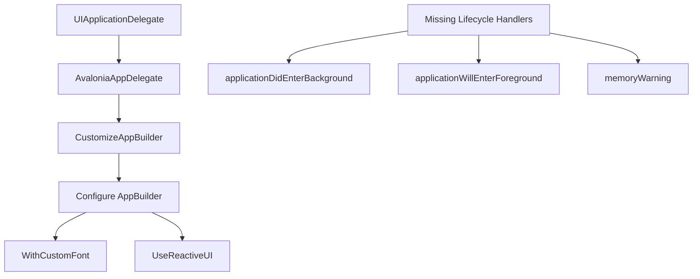

**Diagram sources**
- [AppDelegate.cs](file://src/Unlimotion.iOS/AppDelegate.cs#L1-L25)

**Section sources**
- [AppDelegate.cs](file://src/Unlimotion.iOS/AppDelegate.cs#L1-L25)

## Common Mobile Failure Modes

### Incorrect Data Directory Initialization
Both Android and iOS versions of Unlimotion face challenges with data directory initialization. On Android, the data directory path depends on runtime permission grants, creating a race condition during app startup. The current implementation in MainActivity.cs checks permission status and sets dataDir accordingly, but this logic is executed synchronously during app initialization, potentially blocking the UI thread.

The data directory is used to set TaskStorages.DefaultStoragePath and configure the BackupViaGitService.GetAbsolutePath delegate. If the permission check fails or returns an unexpected result, the app may initialize with an incorrect or null data directory, leading to subsequent file operations failing with null reference exceptions or directory not found errors.

### Missing Configuration File Creation
The configuration file creation process in MainActivity.cs implements a basic check for the existence of Settings.json, creating it with empty JSON content if missing. However, this implementation lacks error handling for file creation failures, which could occur due to storage limitations, permission issues, or file system errors.

The file creation uses File.CreateText followed by explicit Write and Close operations, which is not the most robust approach. If an exception occurs during writing, the file stream may not be properly closed, leading to resource leaks or corrupted files. A more reliable approach would use a using statement or try-catch block to ensure proper resource disposal.

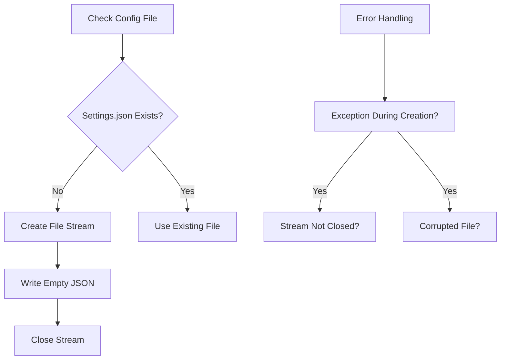

**Diagram sources**
- [MainActivity.cs](file://src/Unlimotion.Android/MainActivity.cs#L68-L75)

**Section sources**
- [MainActivity.cs](file://src/Unlimotion.Android/MainActivity.cs#L68-L75)
- [App.axaml.cs](file://src/Unlimotion/App.axaml.cs#L200-L232)

### Git Backup Path Resolution
The Git backup functionality relies on the BackupViaGitService.GetAbsolutePath delegate to resolve relative paths to absolute paths on the file system. This delegate is configured in MainActivity.cs based on the available storage location (external or internal). However, the implementation in BackupViaGitService.cs does not validate that the resulting path is accessible or writable before attempting Git operations.

The GetRepositoryPath method checks if the path is absolute and uses the GetAbsolutePath delegate if it's not, but it throws a generic Exception if GetAbsolutePath is null, which could occur if the Android activity is not properly initialized. This could lead to Git operations failing silently or with uninformative error messages.

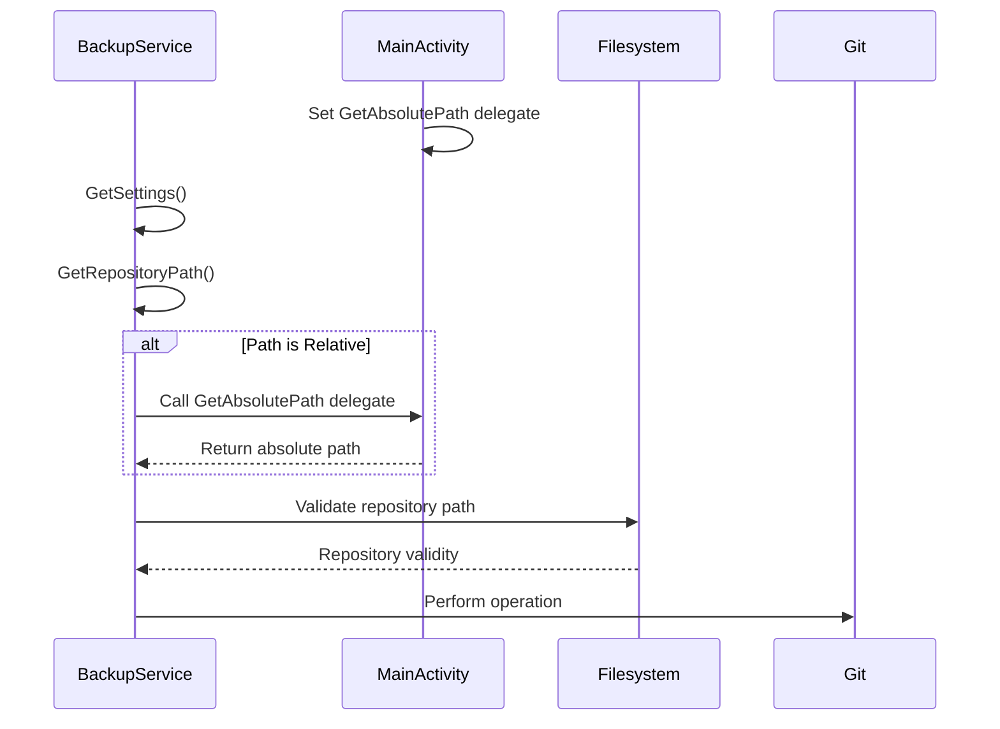

**Diagram sources**
- [BackupViaGitService.cs](file://src/Unlimotion/Services/BackupViaGitService.cs#L300-L320)
- [MainActivity.cs](file://src/Unlimotion.Android/MainActivity.cs#L60-L61)

**Section sources**
- [BackupViaGitService.cs](file://src/Unlimotion/Services/BackupViaGitService.cs#L300-L356)
- [MainActivity.cs](file://src/Unlimotion.Android/MainActivity.cs#L55-L65)

## Storage Permission Handling

### Android Permission Request Implementation
The Android permission handling in MainActivity.cs follows the standard Android runtime permission pattern but has several areas for improvement. The app requests WRITE_EXTERNAL_STORAGE permission, which also implies READ_EXTERNAL_STORAGE according to Android's permission grouping. The request is made with a specific RequestStorageId constant, allowing the result callback to identify the request.

However, the implementation does not check for "never ask again" scenarios where the user has permanently denied the permission. In such cases, the app should guide the user to manually enable permissions through system settings rather than repeatedly requesting permission.

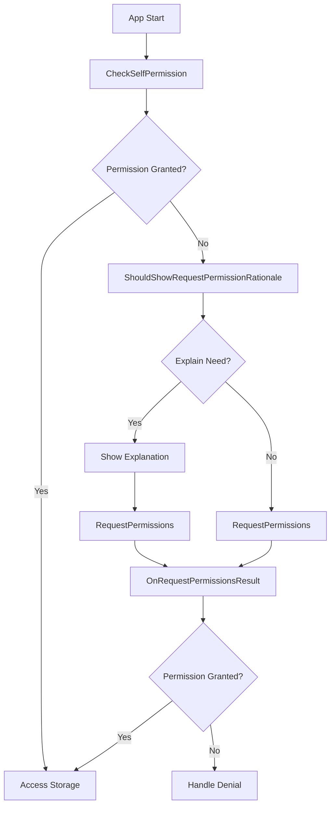

**Section sources**
- [MainActivity.cs](file://src/Unlimotion.Android/MainActivity.cs#L40-L69)
- [AndroidManifest.xml](file://src/Unlimotion.Android/Properties/AndroidManifest.xml#L1-L6)

### Fallback Strategies for Permission Denial
When storage permission is denied, Unlimotion implements a fallback to internal storage using ApplicationContext.FilesDir.AbsolutePath. This ensures basic functionality continues to work, but with significant limitations:

1. Internal storage capacity is limited and may fill up quickly with task data
2. Data is not accessible to other apps or backup tools
3. Data may be cleared when the app is uninstalled
4. No access to shared storage for Git repository operations

The fallback strategy is implemented in the dataDir assignment logic, where the app checks permission status twice - once before requesting permission and once after to determine the storage location. This redundant check could be optimized by storing the permission result and using it throughout the initialization process.

## File Access and Path Resolution

### External File Access on Android
External file access in Unlimotion is managed through the GetExternalFilesDir method, which returns a directory specific to the app but on external storage. This approach follows Android best practices by avoiding the deprecated external storage root directories.

The path resolution logic sets up two critical components:
1. TaskStorages.DefaultStoragePath for task data storage
2. BackupViaGitService.GetAbsolutePath delegate for Git repository path resolution

Both components use the same dataDir base path, ensuring consistency between regular task storage and Git backup operations. However, if the permission state changes between app sessions, there's no mechanism to migrate data from internal to external storage or vice versa.

### Path Resolution Failure Modes
Several failure modes can occur during path resolution:

1. **Null reference exceptions**: GetExternalFilesDir can return null if external storage is unavailable
2. **Permission race conditions**: Permission checks and requests happening in parallel
3. **Path validation issues**: No verification that the resolved path is writable
4. **Storage availability**: External storage may be mounted as read-only or disconnected

The current implementation does not include comprehensive error handling for these scenarios, potentially leading to application crashes or data loss when file operations fail.

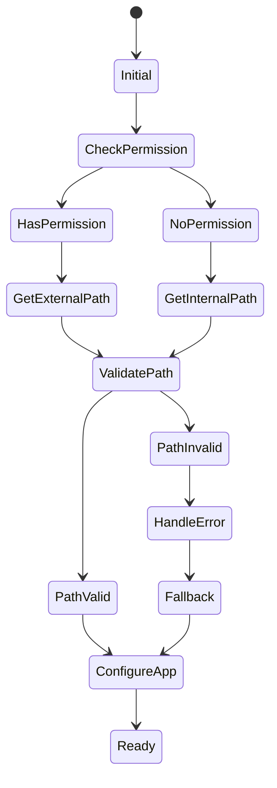

**Section sources**
- [MainActivity.cs](file://src/Unlimotion.Android/MainActivity.cs#L40-L69)
- [FileTaskStorage.cs](file://src/Unlimotion/FileTaskStorage.cs#L15-L457)

## Git Backup Path Resolution

### Relative vs Absolute Path Handling
The Git backup system in Unlimotion supports both relative and absolute paths through the GetRepositoryPath method in BackupViaGitService.cs. For relative paths, it uses the GetAbsolutePath delegate configured in MainActivity.cs to resolve the full path. For absolute paths, it uses the path directly.

This dual approach allows flexibility in configuration but introduces complexity in path validation and error handling. The IsAbsolutePath method checks if a path is rooted and has a non-empty root, but it doesn't validate that the path actually exists or is accessible.

### Path Resolution Dependencies
The path resolution system creates a dependency chain between components:

1. MainActivity.cs configures the GetAbsolutePath delegate
2. BackupViaGitService.cs uses the delegate to resolve paths
3. Git operations use the resolved paths for repository access

If any link in this chain fails (e.g., delegate not set, null path, inaccessible directory), Git operations will fail. The current implementation throws generic exceptions rather than specific path resolution errors, making troubleshooting difficult.

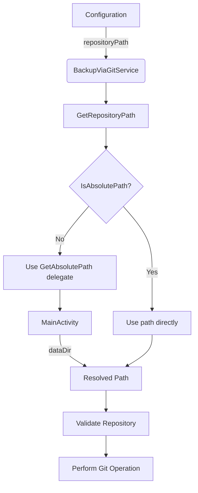

**Section sources**
- [BackupViaGitService.cs](file://src/Unlimotion/Services/BackupViaGitService.cs#L300-L320)
- [MainActivity.cs](file://src/Unlimotion.Android/MainActivity.cs#L55-L65)
- [TaskStorages.cs](file://src/Unlimotion/TaskStorages.cs#L15-L222)

## Troubleshooting Guide

### Storage Permission Request Issues
When users encounter storage permission issues, the following steps can help diagnose and resolve the problem:

1. **Check app permissions in system settings**: Ensure Unlimotion has storage permission enabled
2. **Verify permission request dialog appearance**: The app should show a system permission dialog on first launch
3. **Check for "never ask again" state**: If the user previously denied with "never ask again," the app cannot request permission again
4. **Test with internal storage fallback**: Even without external storage permission, basic functionality should work

The MainActivity.cs implementation should be checked to ensure the permission request is properly triggered and the result callback is correctly implemented.

### External File Access Problems
For external file access issues, consider the following diagnostic steps:

1. **Verify external storage availability**: Check if external storage is mounted and accessible
2. **Check path resolution**: Confirm that GetExternalFilesDir returns a valid path
3. **Test file operations**: Attempt to create and write to a test file in the external directory
4. **Review error logs**: Look for IOExceptions or SecurityExceptions in the application logs

The dataDir assignment logic in MainActivity.cs should be examined to ensure it properly handles null returns from GetExternalFilesDir.

### Toast Notification Debugging
Toast notifications in MainActivity.cs are used to provide feedback about storage permission status. When these notifications don't appear, check:

1. **Context validity**: Ensure the Activity context is valid when Toast is called
2. **UIThread execution**: Toasts must be shown on the UI thread
3. **Permission denial message**: Verify the message appears when permission is denied
4. **External storage path message**: Confirm the path display works when permission is granted

The AccessExternalStorage method contains the toast implementation that should be tested for proper message display.

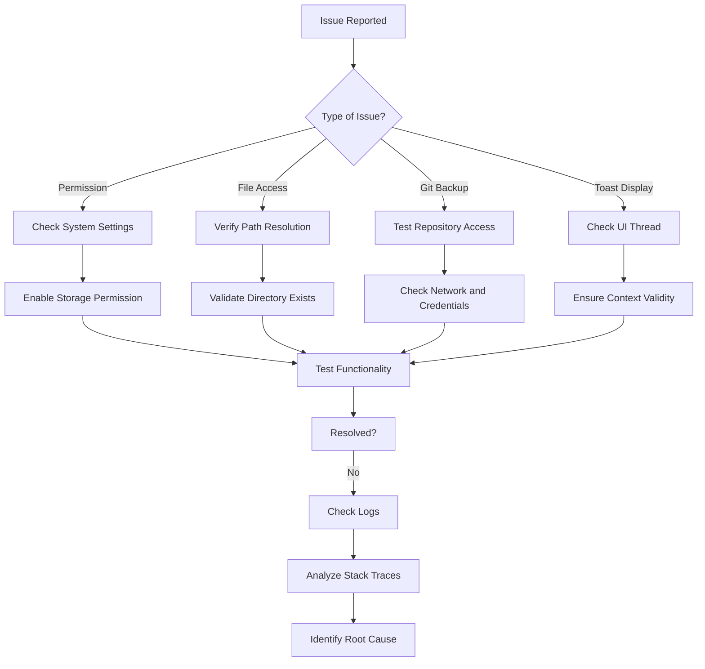

**Section sources**
- [MainActivity.cs](file://src/Unlimotion.Android/MainActivity.cs#L92-L111)
- [NotificationManagerWrapper.cs](file://src/Unlimotion/NotificationManagerWrapper.cs#L30-L46)

## Hybrid UI Rendering Issues

### Avalonia UI Framework Challenges
As a hybrid application using Avalonia UI framework, Unlimotion faces specific rendering challenges on mobile devices:

1. **Layout adaptation**: Ensuring UI elements properly adapt to different screen sizes and orientations
2. **Touch interface optimization**: Making controls appropriately sized for touch input
3. **Performance optimization**: Maintaining smooth animations and transitions on lower-powered devices
4. **Platform-specific styling**: Applying appropriate visual styles that match platform conventions

The current implementation uses a shared UI codebase between desktop and mobile, which may not fully optimize the mobile user experience.

### Reactive Data Binding Performance
The application uses ReactiveUI for data binding, which can impact performance on mobile devices with limited processing power. Complex view models with numerous observable properties may cause:

1. **Excessive UI updates**: Frequent property changes triggering layout recalculations
2. **Memory pressure**: Retained references in observable chains
3. **Battery consumption**: Continuous background processing for reactive streams
4. **Scrolling performance**: Frame rate drops when binding large collections

The MainWindowViewModel and TaskItemViewModel classes contain reactive properties that should be optimized for mobile performance, potentially using throttling or sampling for high-frequency updates.

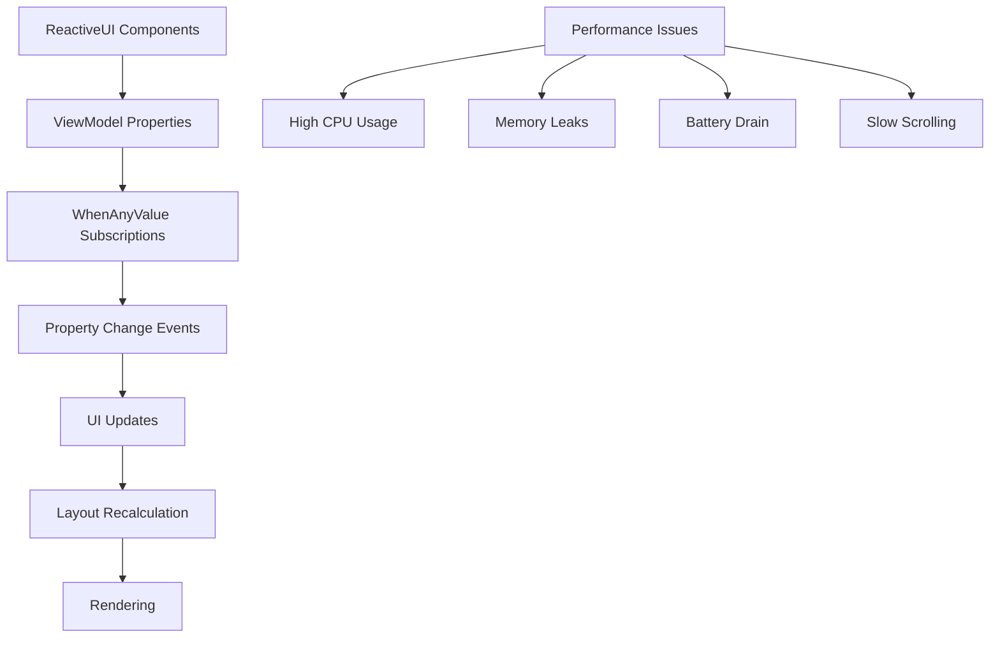

**Section sources**
- [MainWindowViewModel.cs](file://src/Unlimotion.ViewModel/MainWindowViewModel.cs)
- [TaskItemViewModel.cs](file://src/Unlimotion.ViewModel/TaskItemViewModel.cs)
- [App.axaml.cs](file://src/Unlimotion/App.axaml.cs#L1-L232)

## Performance Considerations

### Lower-Powered Hardware Optimization
Mobile devices, particularly budget models, have significantly less processing power and memory than desktop systems. Unlimotion should optimize for these constraints by:

1. **Reducing memory footprint**: Minimizing object allocations and efficiently managing collections
2. **Optimizing data loading**: Implementing pagination or virtualization for large task lists
3. **Efficient file operations**: Minimizing disk I/O and using appropriate buffering
4. **Background processing**: Offloading intensive operations to background threads

The FileTaskStorage class performs synchronous file operations during initialization, which could block the UI thread on slower devices. These operations should be moved to background threads with proper progress indication.

### Resource Management Best Practices
To ensure optimal performance on mobile devices, the following resource management practices should be followed:

1. **Proper disposal of resources**: Ensuring streams, database connections, and other disposable objects are properly disposed
2. **Memory leak prevention**: Avoiding long-lived references to UI elements or context objects
3. **Efficient data structures**: Using appropriate collections and algorithms for mobile scenarios
4. **Network optimization**: Minimizing data transfer for Git operations and server communications

The BackupViaGitService implementation should be reviewed for proper resource disposal, particularly in error handling paths where exceptions might prevent cleanup code from executing.

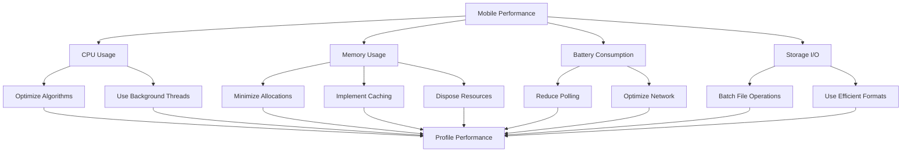

**Section sources**
- [FileTaskStorage.cs](file://src/Unlimotion/FileTaskStorage.cs#L15-L457)
- [BackupViaGitService.cs](file://src/Unlimotion/Services/BackupViaGitService.cs#L1-L356)
- [TaskStorages.cs](file://src/Unlimotion/TaskStorages.cs#L15-L222)