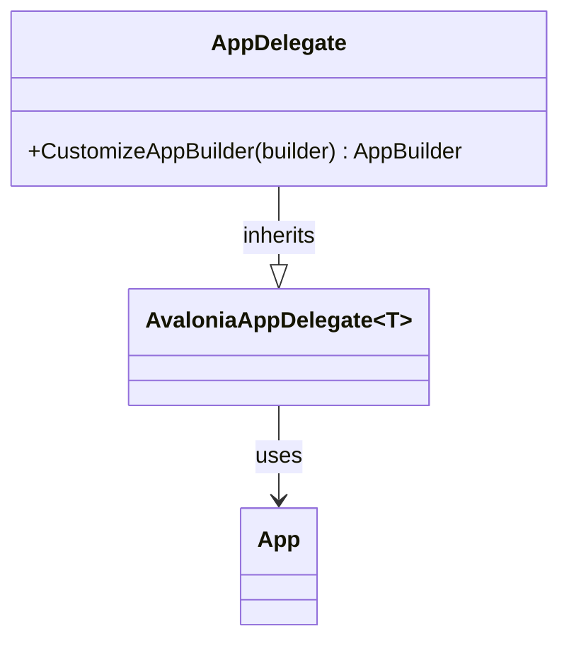
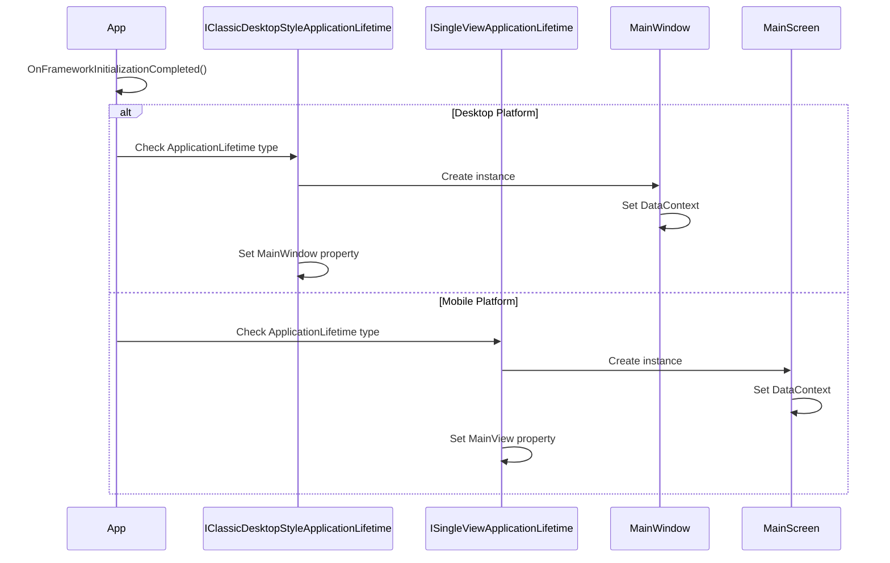
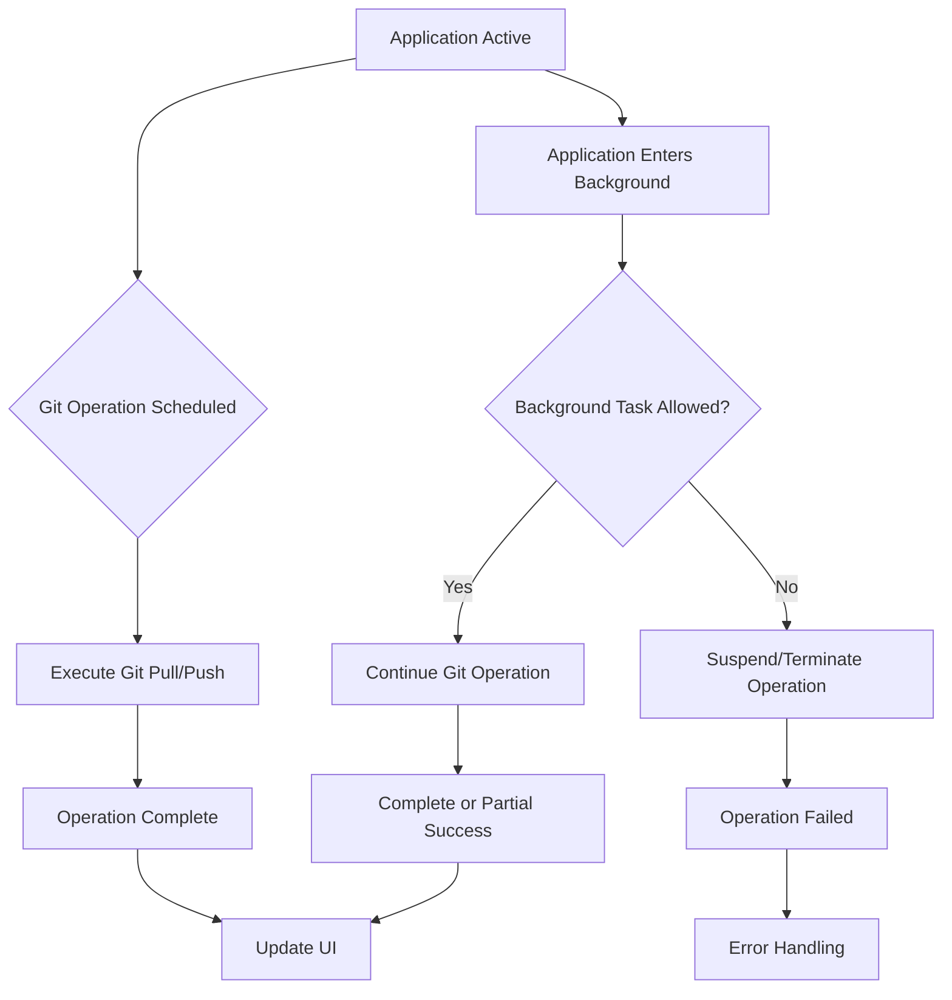

# iOS Platform Errors

<cite>
**Referenced Files in This Document**   
- [AppDelegate.cs](file://src/Unlimotion.iOS/AppDelegate.cs)
- [Main.cs](file://src/Unlimotion.iOS/Main.cs)
- [Unlimotion.iOS.csproj](file://src/Unlimotion.iOS/Unlimotion.iOS.csproj)
- [App.axaml.cs](file://src/Unlimotion/App.axaml.cs)
- [FileTaskStorage.cs](file://src/Unlimotion/FileTaskStorage.cs)
- [BackupViaGitService.cs](file://src/Unlimotion/Services/BackupViaGitService.cs)
- [TaskStorages.cs](file://src/Unlimotion/TaskStorages.cs)
- [GitPullJob.cs](file://src/Unlimotion/Scheduling/Jobs/GitPullJob.cs)
- [GitPushJob.cs](file://src/Unlimotion/Scheduling/Jobs/GitPushJob.cs)
</cite>

## Table of Contents
1. [Introduction](#introduction)
2. [Sandboxed File System Access Limitations](#sandboxed-file-system-access-limitations)
3. [Resource Bundling and Application Initialization](#resource-bundling-and-application-initialization)
4. [AppDelegate Lifecycle Integration with Avalonia](#appdelegate-lifecycle-integration-with-avalonia)
5. [Application Data Directory Initialization](#application-data-directory-initialization)
6. [Persistent Storage Path Resolution](#persistent-storage-path-resolution)
7. [Configuration File Creation in App Container](#configuration-file-creation-in-app-container)
8. [Hybrid UI Rendering Issues](#hybrid-ui-rendering-issues)
9. [Background Task Execution Limitations](#background-task-execution-limitations)
10. [Performance Considerations for Reactive Programming](#performance-considerations-for-reactive-programming)
11. [Debugging Native-Avalonia Interoperability](#debugging-native-avalonia-interoperability)

## Introduction
This document addresses iOS-specific errors in Unlimotion, a cross-platform application built with Avalonia UI framework. The focus is on platform-specific challenges that arise when deploying Avalonia-based applications to iOS, particularly concerning file system access, application lifecycle integration, background operations, and hybrid UI rendering. The analysis is based on the current implementation in the Unlimotion.iOS project and related components that interact with iOS-specific functionality.

## Sandboxed File System Access Limitations
iOS applications operate within a strict sandbox environment that restricts file system access to designated directories within the app container. The Unlimotion application must properly initialize and resolve paths within this constrained environment to avoid file access failures.

The iOS sandbox limits applications to specific directories:
- **Documents directory**: For user-generated content
- **Library directory**: For application support files
- **tmp directory**: For temporary files

Failure to properly resolve these paths can result in IOExceptions when attempting to read or write configuration files, task data, or backup repositories. The application must use iOS-specific APIs to obtain valid directory paths rather than relying on relative or hardcoded paths.

**Section sources**
- [AppDelegate.cs](file://src/Unlimotion.iOS/AppDelegate.cs#L1-L25)
- [FileTaskStorage.cs](file://src/Unlimotion/FileTaskStorage.cs#L1-L458)

## Resource Bundling and Application Initialization
Proper resource bundling is critical for iOS deployment. Missing or incorrectly configured resources can lead to runtime failures when the application attempts to load fonts, assets, or configuration files.

The current implementation includes custom font configuration through the `WithCustomFont` extension method, which specifies Roboto and Noto Color Emoji fonts from the application assets. If these resources are not properly bundled in the iOS application package, font loading will fail, potentially affecting UI rendering.

Resource access failures typically manifest as:
- Missing font glyphs or fallback to system fonts
- Failed asset loading for UI elements
- Configuration file not found exceptions
- Empty or malformed resource streams

**Section sources**
- [AppExtensions.cs](file://src/Unlimotion/AppExtensions.cs#L1-L33)
- [Unlimotion.iOS.csproj](file://src/Unlimotion.iOS/Unlimotion.iOS.csproj#L1-L17)

## AppDelegate Lifecycle Integration with Avalonia
The AppDelegate class serves as the bridge between iOS application lifecycle events and the Avalonia framework. Proper integration is essential for reliable application startup and event handling.

**Diagram sources**
- [AppDelegate.cs](file://src/Unlimotion.iOS/AppDelegate.cs#L1-L25)

The AppDelegate implementation must:
1. Inherit from `AvaloniaAppDelegate<App>` to integrate with the Avalonia framework
2. Override `CustomizeAppBuilder` to configure the application builder with platform-specific settings
3. Properly initialize the AppBuilder with necessary extensions like `WithCustomFont` and `UseReactiveUI`

Failure modes include:
- Application crashes during startup due to improper AppDelegate configuration
- Missing lifecycle event handling
- UI rendering failures due to incomplete framework initialization

**Section sources**
- [AppDelegate.cs](file://src/Unlimotion.iOS/AppDelegate.cs#L1-L25)
- [Main.cs](file://src/Unlimotion.iOS/Main.cs#L1-L15)

## Application Data Directory Initialization
Proper initialization of the application data directory is crucial for persistent storage on iOS. Unlike Android, iOS does not require runtime permissions for basic file operations within the app container, but the application must correctly identify and use the appropriate directories.

The current implementation lacks iOS-specific data directory initialization, which may lead to:
- Default storage paths pointing to invalid locations
- Configuration files created in non-persistent directories
- Data loss during application updates or reinstallation
- Inability to access previously saved task data

The application should initialize the data directory during startup by obtaining the Documents directory path through iOS APIs and setting it as the default storage path.

**Section sources**
- [TaskStorages.cs](file://src/Unlimotion/TaskStorages.cs#L1-L224)
- [FileTaskStorage.cs](file://src/Unlimotion/FileTaskStorage.cs#L1-L458)

## Persistent Storage Path Resolution
Persistent storage path resolution on iOS requires using platform-specific APIs to obtain valid directory paths within the app sandbox. The application must resolve paths for:
- Task storage directory
- Configuration files
- Git repository for backups
- Temporary files

The current implementation shows a pattern in the Android MainActivity where `GetAbsolutePath` is configured to resolve paths relative to the application's data directory. A similar mechanism should be implemented for iOS, but it is currently missing.

Without proper path resolution:
- File operations may fail with "directory not found" errors
- Data may be written to temporary locations that are not persistent
- Backup operations may fail to locate the Git repository
- Configuration changes may not be saved across application sessions

**Section sources**
- [BackupViaGitService.cs](file://src/Unlimotion/Services/BackupViaGitService.cs#L1-L357)
- [TaskStorages.cs](file://src/Unlimotion/TaskStorages.cs#L1-L224)

## Configuration File Creation in App Container
Configuration file creation within the iOS app container must follow platform-specific patterns to ensure files are created in the correct location and persist across application sessions.

The application initializes configuration through the `App.Init(configPath)` method, which expects a valid path to a JSON configuration file. On iOS, this file should be created in the Library directory or Documents directory, depending on whether it contains user-modifiable settings.

Failure modes include:
- Configuration file created in non-persistent locations
- Permission errors when attempting to write configuration
- Inability to locate configuration file on subsequent launches
- Data corruption due to improper file handling in the sandbox environment

The application should ensure that:
1. Configuration directory exists before attempting to create files
2. File operations use proper exception handling for sandbox restrictions
3. Configuration paths are resolved using iOS APIs rather than hardcoded values
4. File integrity is maintained through proper write and flush operations

**Section sources**
- [App.axaml.cs](file://src/Unlimotion/App.axaml.cs#L1-L233)
- [TaskStorages.cs](file://src/Unlimotion/TaskStorages.cs#L1-L224)

## Hybrid UI Rendering Issues
Hybrid UI rendering issues arise from the integration between native iOS views and Avalonia's cross-platform UI framework. These issues typically involve:
- View initialization timing mismatches
- Layout constraint conflicts
- Rendering artifacts in mixed native-Avalonia interfaces

The application uses different main view types based on the platform:
- `MainWindow` for desktop platforms (inherited from `Window`)
- `MainScreen` for mobile platforms (inherited from `UserControl`)

**Diagram sources**
- [App.axaml.cs](file://src/Unlimotion/App.axaml.cs#L50-L100)
- [MainWindow.axaml.cs](file://src/Unlimotion/Views/MainWindow.axaml.cs#L1-L13)
- [MainScreen.axaml.cs](file://src/Unlimotion/Views/MainScreen.axaml.cs#L1-L13)

Common failure modes:
- UI elements not rendering due to initialization order issues
- Layout constraints causing view clipping or improper sizing
- Touch event handling conflicts between native and Avalonia layers
- Performance issues from excessive layout recalculations

**Section sources**
- [App.axaml.cs](file://src/Unlimotion/App.axaml.cs#L50-L100)
- [MainWindow.axaml.cs](file://src/Unlimotion/Views/MainWindow.axaml.cs#L1-L13)
- [MainScreen.axaml.cs](file://src/Unlimotion/Views/MainScreen.axaml.cs#L1-L13)

## Background Task Execution Limitations
iOS imposes strict limitations on background task execution, which affects Unlimotion's Git synchronization and data backup operations. These limitations include:
- Limited execution time for background tasks
- No guaranteed execution of background operations
- Restrictions on network operations in the background
- App suspension when moved to background

The current implementation uses Quartz.NET for scheduling Git pull and push operations at regular intervals. However, on iOS, these background tasks may be suspended or terminated when the application enters the background, leading to:
- Incomplete Git operations
- Data synchronization failures
- Lost backup opportunities
- Stale data in the local repository

**Diagram sources**
- [GitPullJob.cs](file://src/Unlimotion/Scheduling/Jobs/GitPullJob.cs#L1-L20)
- [GitPushJob.cs](file://src/Unlimotion/Scheduling/Jobs/GitPushJob.cs#L1-L21)
- [BackupViaGitService.cs](file://src/Unlimotion/Services/BackupViaGitService.cs#L1-L357)

The application should:
1. Implement proper background task registration using iOS APIs
2. Handle partial completion of Git operations
3. Provide user notifications for background operation status
4. Implement retry mechanisms for failed background tasks
5. Offer manual backup options when automatic synchronization fails

**Section sources**
- [GitPullJob.cs](file://src/Unlimotion/Scheduling/Jobs/GitPullJob.cs#L1-L20)
- [GitPushJob.cs](file://src/Unlimotion/Scheduling/Jobs/GitPushJob.cs#L1-L21)
- [BackupViaGitService.cs](file://src/Unlimotion/Services/BackupViaGitService.cs#L1-L357)

## Performance Considerations for Reactive Programming
Reactive programming patterns, particularly with ReactiveUI, require careful consideration on iOS devices due to:
- Limited CPU and memory resources compared to desktop platforms
- Power consumption constraints affecting continuous observation
- UI thread responsiveness requirements for smooth animations
- Memory management challenges with observable chains

The application uses ReactiveUI extensively, as evidenced by:
- `ObservableForProperty` subscriptions in `TaskStorages.SetSettingsCommands`
- `ReactiveCommand` for UI actions
- RxApp.DefaultExceptionHandler configuration

Performance issues may manifest as:
- High CPU usage from continuous observable chains
- Memory leaks from unsubscribed observers
- UI jank due to heavy computations on the main thread
- Battery drain from frequent background operations

Optimization strategies should include:
- Proper disposal of subscriptions using `DisposeCollection`
- Throttling or debouncing high-frequency observables
- Offloading heavy computations to background threads
- Minimizing UI updates through efficient change detection

**Section sources**
- [App.axaml.cs](file://src/Unlimotion/App.axaml.cs#L1-L233)
- [TaskStorages.cs](file://src/Unlimotion/TaskStorages.cs#L1-L224)

## Debugging Native-Avalonia Interoperability
Debugging issues in the native-Avalonia interoperability layer requires specific techniques due to the hybrid nature of the application. Common challenges include:
- Tracing execution flow between native iOS code and managed C# code
- Identifying lifecycle event handling issues
- Diagnosing UI rendering problems in mixed environments
- Monitoring file system access within the sandbox

Effective debugging strategies:
1. Use comprehensive logging at integration points
2. Implement error handling with user-visible feedback
3. Utilize platform-specific debugging tools (Xcode, LLDB)
4. Monitor system logs for sandbox violations
5. Test on physical devices to catch simulator-specific issues

The application currently uses `Debug.WriteLine` for logging Git operations and error conditions, which should be enhanced with more structured logging and user feedback mechanisms.

**Section sources**
- [BackupViaGitService.cs](file://src/Unlimotion/Services/BackupViaGitService.cs#L1-L357)
- [AppDelegate.cs](file://src/Unlimotion.iOS/AppDelegate.cs#L1-L25)