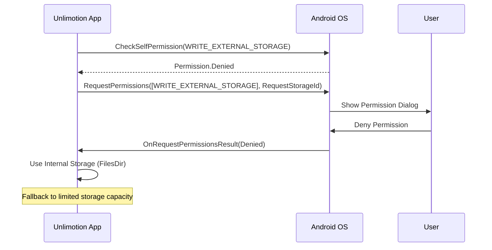
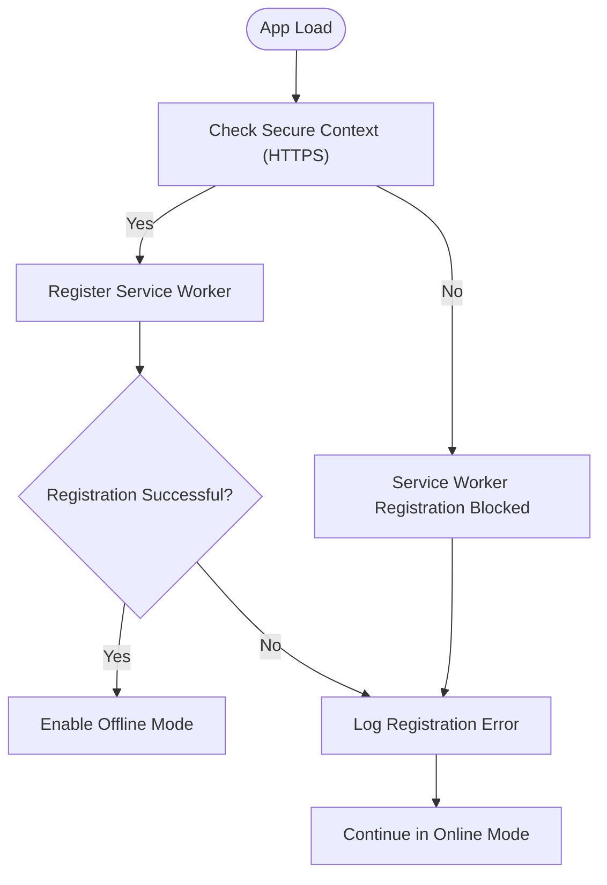
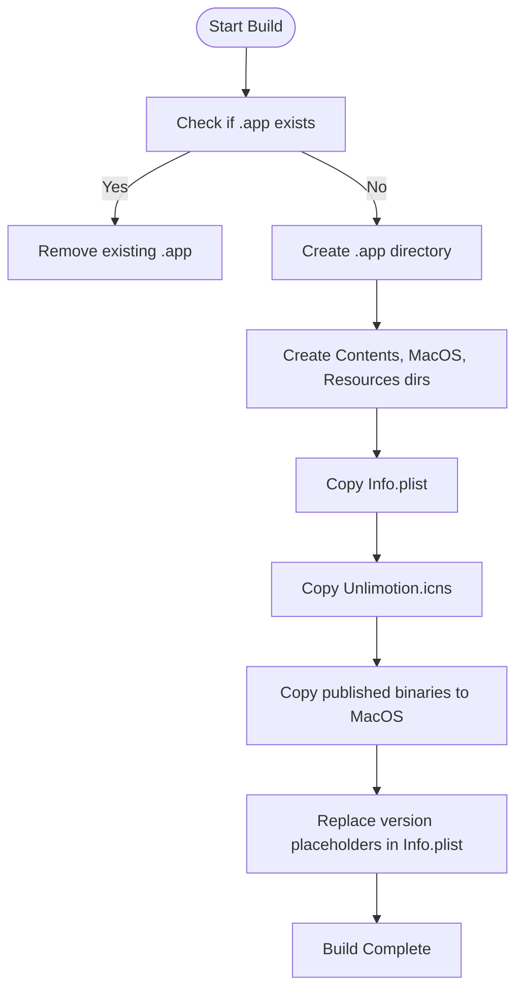

# Platform-Specific Errors

<cite>
**Referenced Files in This Document**  
- [MainActivity.cs](file://src/Unlimotion.Android/MainActivity.cs)
- [AppDelegate.cs](file://src/Unlimotion.iOS/AppDelegate.cs)
- [Program.cs](file://src/Unlimotion.Browser/Program.cs)
- [Program.cs](file://src/Unlimotion.Desktop/Program.cs)
- [NotificationManagerWrapper.cs](file://src/Unlimotion/NotificationManagerWrapper.cs)
- [Unlimotion.Android.csproj](file://src/Unlimotion.Android/Unlimotion.Android.csproj)
- [Unlimotion.iOS.csproj](file://src/Unlimotion.iOS/Unlimotion.iOS.csproj)
- [Unlimotion.Browser.csproj](file://src/Unlimotion.Browser/Unlimotion.Browser.csproj)
- [Unlimotion.Desktop.csproj](file://src/Unlimotion.Desktop/Unlimotion.Desktop.csproj)
- [AndroidManifest.xml](file://src/Unlimotion.Android/Properties/AndroidManifest.xml)
- [Unlimotion.csproj](file://src/Unlimotion/Unlimotion.csproj)
- [launchSettings.json](file://src/Unlimotion.Desktop/Properties/launchSettings.json)
- [launchSettings.json](file://src/Unlimotion.Browser/Properties/launchSettings.json)
- [generate-deb-pkg.sh](file://src/Unlimotion.Desktop/ci/deb/generate-deb-pkg.sh)
- [generate-osx-app.sh](file://src/Unlimotion.Desktop/ci/osx/generate-osx-app.sh)
</cite>

## Table of Contents
1. [Introduction](#introduction)
2. [Mobile Platform Errors](#mobile-platform-errors)
   - [Android: Permission and Storage Access Issues](#android-permission-and-storage-access-issues)
   - [iOS: Native Integration and Lifecycle Limitations](#ios-native-integration-and-lifecycle-limitations)
3. [Web Browser Compatibility Issues](#web-browser-compatibility-issues)
   - [JavaScript Execution and CSP Violations](#javascript-execution-and-csp-violations)
   - [Service Worker Registration Failures](#service-worker-registration-failures)
4. [Desktop Packaging and Deployment Errors](#desktop-packaging-and-deployment-errors)
   - [Debian Package Build Failures](#debian-package-build-failures)
   - [macOS Application Bundle Issues](#macos-application-bundle-issues)
5. [Hybrid UI and Cross-Platform Behavior Discrepancies](#hybrid-ui-and-cross-platform-behavior-discrepancies)
6. [Build Configuration and Manifest Errors](#build-configuration-and-manifest-errors)
7. [Troubleshooting Guide](#troubleshooting-guide)
8. [Conclusion](#conclusion)

## Introduction
Unlimotion is a cross-platform application built using Avalonia UI, targeting Android, iOS, WebAssembly, and desktop platforms (Windows, macOS, Linux). Due to the diverse nature of these platforms, various platform-specific errors can occur during development, build, and runtime. This document details common failure modes, diagnostic techniques, and troubleshooting steps for each platform, with a focus on native integration points, permission handling, packaging issues, and hybrid environment inconsistencies.

**Section sources**
- [Unlimotion.csproj](file://src/Unlimotion/Unlimotion.csproj)

## Mobile Platform Errors

### Android: Permission and Storage Access Issues
On Android, Unlimotion requires explicit permissions to access external storage for saving task data and configuration files. The `MainActivity.cs` file implements runtime permission requests for `WRITE_EXTERNAL_STORAGE`. If the user denies this permission, the app defaults to internal storage, which may limit data persistence and sharing capabilities.

A key failure mode occurs when the app fails to request or handle the permission result properly. The `OnRequestPermissionsResult` override in `MainActivity.cs` must correctly process the result code and update the storage path accordingly. Failure to do so results in data being saved to an incorrect location or access errors.

Additionally, the `AndroidManifest.xml` must declare the required permissions (`READ_EXTERNAL_STORAGE`, `WRITE_EXTERNAL_STORAGE`, `INTERNET`). Missing or incorrect declarations lead to runtime crashes or silent permission denials.

**Diagram sources**
- [MainActivity.cs](file://src/Unlimotion.Android/MainActivity.cs#L35-L75)
- [AndroidManifest.xml](file://src/Unlimotion.Android/Properties/AndroidManifest.xml#L2-L5)

**Section sources**
- [MainActivity.cs](file://src/Unlimotion.Android/MainActivity.cs#L1-L112)
- [AndroidManifest.xml](file://src/Unlimotion.Android/Properties/AndroidManifest.xml)

### iOS: Native Integration and Lifecycle Limitations
The iOS implementation in `AppDelegate.cs` is minimal, inheriting from `AvaloniaAppDelegate<App>` and customizing the app builder. However, iOS imposes strict background execution limitations. Tasks such as periodic Git synchronization (`GitPullJob`, `GitPushJob`) may be suspended when the app enters the background, leading to missed sync operations.

Push notifications are not implemented in the current `AppDelegate.cs`, which means the app cannot receive remote notifications to trigger background updates. To support this, the app would need to register for push notifications and handle incoming payloads, which requires additional entitlements and server-side infrastructure.

The `Info.plist` configuration (used in the macOS packaging script) indicates versioning and bundle structure, but iOS-specific entitlements (e.g., background modes, push notifications) are not present in the current project, limiting background functionality.

**Section sources**
- [AppDelegate.cs](file://src/Unlimotion.iOS/AppDelegate.cs#L1-L25)
- [generate-osx-app.sh](file://src/Unlimotion.Desktop/ci/osx/generate-osx-app.sh)

## Web Browser Compatibility Issues

### JavaScript Execution and CSP Violations
When running on WebAssembly via `Avalonia.Browser`, the app is subject to browser security policies. The `Program.cs` in `Unlimotion.Browser` configures the app to run in the browser environment, but certain operations may trigger Content Security Policy (CSP) violations.

For example, dynamic code evaluation or inline script execution is restricted in most CSP configurations. While Avalonia abstracts much of this, third-party libraries or custom JavaScript interop could introduce violations. Additionally, the app must be served with appropriate CSP headers to allow WebAssembly execution and network requests.

The `launchSettings.json` configures HTTPS and HTTP endpoints, but misconfiguration here can lead to mixed-content errors or failed service worker registration.

**Section sources**
- [Program.cs](file://src/Unlimotion.Browser/Program.cs#L1-L51)
- [launchSettings.json](file://src/Unlimotion.Browser/Properties/launchSettings.json)

### Service Worker Registration Failures
Service workers are essential for offline functionality and background sync in progressive web apps (PWAs). However, the current `Unlimotion.Browser` project does not include a service worker registration mechanism. Without a `service-worker.js` file and proper registration in the host page (`index.html`), features like offline task access or background synchronization will not function.

Additionally, service worker registration requires a secure context (HTTPS), which may not be available in development environments unless properly configured.

**Diagram sources**
- [Program.cs](file://src/Unlimotion.Browser/Program.cs#L1-L51)
- [index.html](file://landing/index.html)

**Section sources**
- [Program.cs](file://src/Unlimotion.Browser/Program.cs#L1-L51)
- [index.html](file://landing/index.html)

## Desktop Packaging and Deployment Errors

### Debian Package Build Failures
The Debian packaging process uses a shell script `generate-deb-pkg.sh` that relies on the `dotnet-deb` tool. Common failure points include:
- Missing `dotnet-deb` tool installation
- Incorrect runtime identifier (`linux-x64`) mismatch
- Missing publish flags such as `PublishSingleFile=true`, `SelfContained=true`
- Version parameter not passed correctly (`$1`)

The script restores and builds the `Unlimotion.Desktop.ForDebianBuild.csproj` project, which must be properly configured with the correct target framework (`net9.0`) and output type. Missing native libraries or incorrect extraction settings (`IncludeNativeLibrariesForSelfExtract`) can result in runtime DLL loading errors.

**Section sources**
- [generate-deb-pkg.sh](file://src/Unlimotion.Desktop/ci/deb/generate-deb-pkg.sh#L1-L11)
- [Unlimotion.Desktop.csproj](file://src/Unlimotion.Desktop/Unlimotion.Desktop.csproj)

### macOS Application Bundle Issues
The `generate-osx-app.sh` script constructs a macOS `.app` bundle by copying published binaries into a structured directory (`Contents/MacOS`, `Contents/Resources`). Key failure points include:
- Incorrect `PUBLISH_OUTPUT_DIRECTORY` path
- Missing or misnamed `Info.plist` and `Unlimotion.icns` files
- Version substitution failing due to `sed` command syntax (especially on macOS with BSD `sed`)
- Missing executable permissions on the main binary

The script modifies `Info.plist` to inject version numbers, but if the placeholder strings (`CFBundleVersionExample`) do not match, the version will not be updated, leading to deployment rejection from the App Store or user confusion.

**Diagram sources**
- [generate-osx-app.sh](file://src/Unlimotion.Desktop/ci/osx/generate-osx-app.sh#L1-L29)

**Section sources**
- [generate-osx-app.sh](file://src/Unlimotion.Desktop/ci/osx/generate-osx-app.sh#L1-L29)
- [Unlimotion.Desktop.csproj](file://src/Unlimotion.Desktop/Unlimotion.Desktop.csproj)

## Hybrid UI and Cross-Platform Behavior Discrepancies
Unlimotion uses Avalonia UI, which provides a shared XAML-based interface across platforms. However, subtle differences in rendering, input handling, and layout calculations can lead to UI inconsistencies. For example:
- Font rendering differences between platforms due to `WithCustomFont()` usage
- Touch vs. mouse input handling in `GraphControl.axaml.cs`
- Animation timing discrepancies in `AutoCompleteZeroMinimumPrefixLengthDropdownBehaviour.cs`

The `NotificationManagerWrapper.cs` abstracts toast notifications, but platform-specific behaviors (e.g., Android toast duration, desktop notification persistence) may vary. Diagnosing these issues requires platform-specific logging and visual inspection.

**Section sources**
- [NotificationManagerWrapper.cs](file://src/Unlimotion/NotificationManagerWrapper.cs#L1-L73)
- [Unlimotion.csproj](file://src/Unlimotion/Unlimotion.csproj)

## Build Configuration and Manifest Errors
Target framework mismatches are a common source of build errors. The platform projects specify different TFMs:
- Android: `net9.0-android`
- iOS: `net9.0-ios`
- Browser: `net9.0-browser`
- Desktop: `net9.0`

Referencing a library with an incompatible TFM (e.g., using a Windows-only API in the shared project) causes compilation failures. Additionally, missing or incorrect `PackageReference` entries in `.csproj` files lead to missing dependencies at runtime.

Native dependency loading errors occur when platform-specific binaries (e.g., `libgit2`) are not included in the publish output or are incompatible with the target architecture (x64 vs. ARM64).

**Section sources**
- [Unlimotion.Android.csproj](file://src/Unlimotion.Android/Unlimotion.Android.csproj)
- [Unlimotion.iOS.csproj](file://src/Unlimotion.iOS/Unlimotion.iOS.csproj)
- [Unlimotion.Browser.csproj](file://src/Unlimotion.Browser/Unlimotion.Browser.csproj)
- [Unlimotion.Desktop.csproj](file://src/Unlimotion.Desktop/Unlimotion.Desktop.csproj)
- [Unlimotion.csproj](file://src/Unlimotion/Unlimotion.csproj)

## Troubleshooting Guide
When encountering platform-specific errors:
1. **Check Target Framework**: Ensure all projects use compatible TFMs.
2. **Verify Permissions/Entitlements**: Android (`AndroidManifest.xml`), iOS (`Info.plist`).
3. **Inspect Build Scripts**: Validate paths, versions, and command-line arguments.
4. **Enable Logging**: Use `LogToTrace()` in debug builds to capture binding and rendering errors.
5. **Test on Target Platform**: Emulator/simulator vs. physical device behavior may differ.
6. **Validate Packaging**: Ensure all assets are included and structured correctly.

For runtime errors, examine the `NotificationManagerWrapper` for error toasts, which use red background messages with 7-second timeouts.

**Section sources**
- [Program.cs](file://src/Unlimotion.Desktop/Program.cs#L1-L93)
- [NotificationManagerWrapper.cs](file://src/Unlimotion/NotificationManagerWrapper.cs#L1-L73)

## Conclusion
Platform-specific errors in Unlimotion arise from differences in permission models, packaging requirements, runtime environments, and UI rendering. By understanding the native integration points in `MainActivity.cs` and `AppDelegate.cs`, addressing web security constraints, and ensuring correct desktop packaging configurations, developers can mitigate most cross-platform issues. Consistent use of shared abstractions like `TaskStorages` and `NotificationManagerWrapper` helps maintain functionality across platforms while allowing for necessary native customizations.