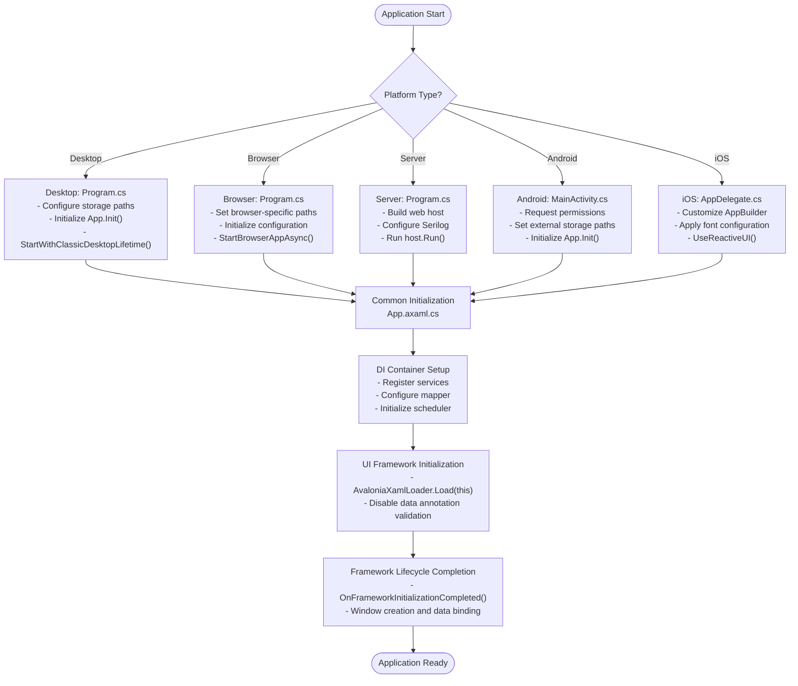
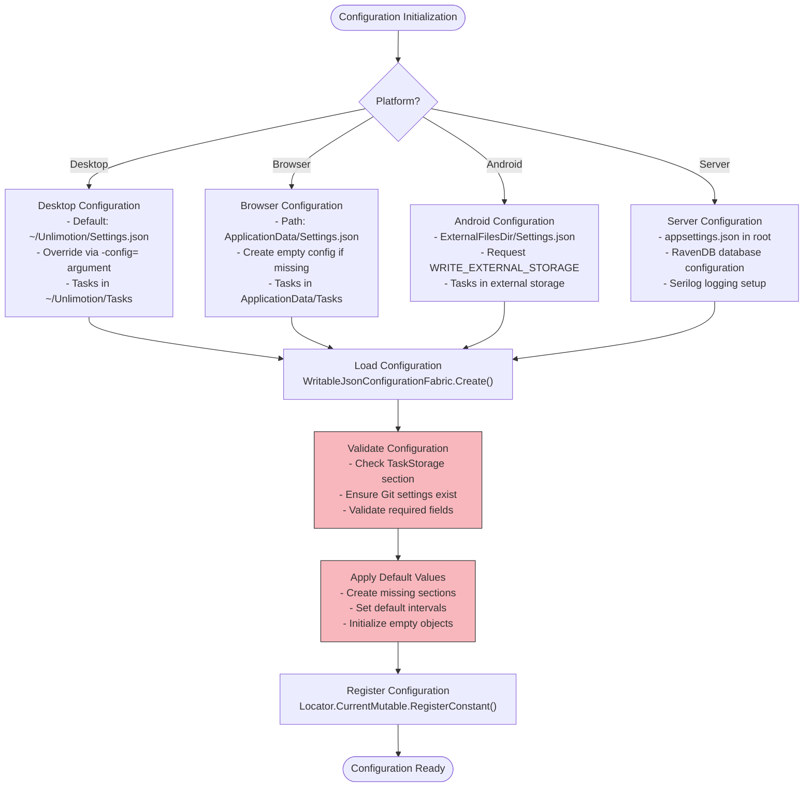
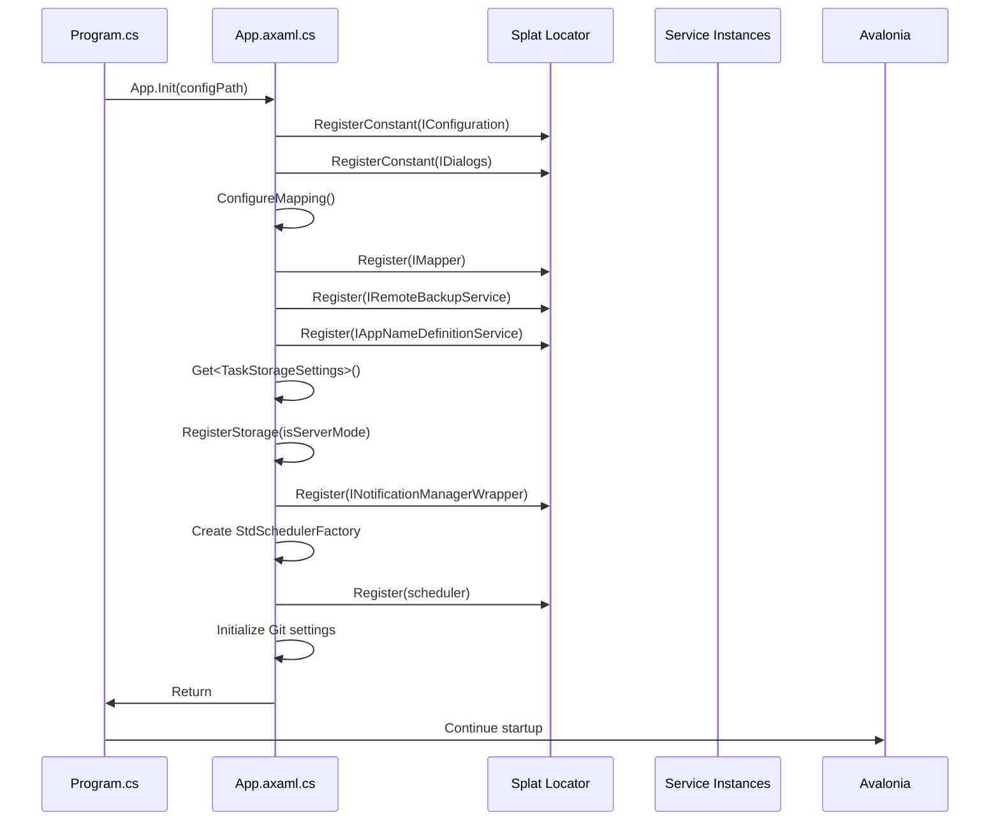
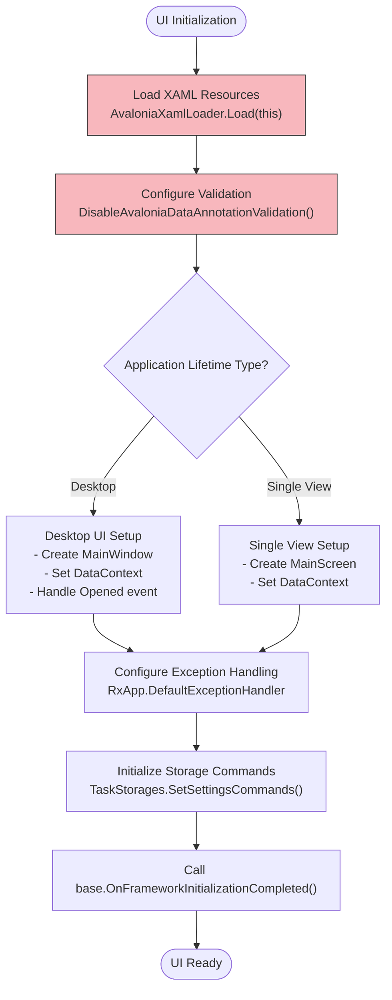
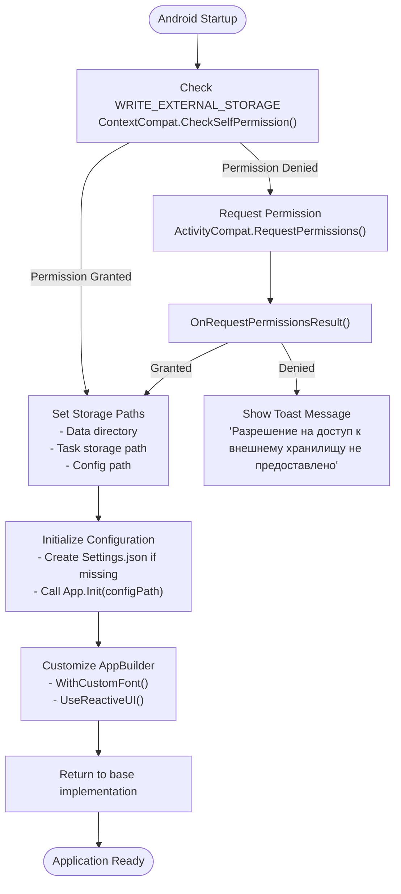
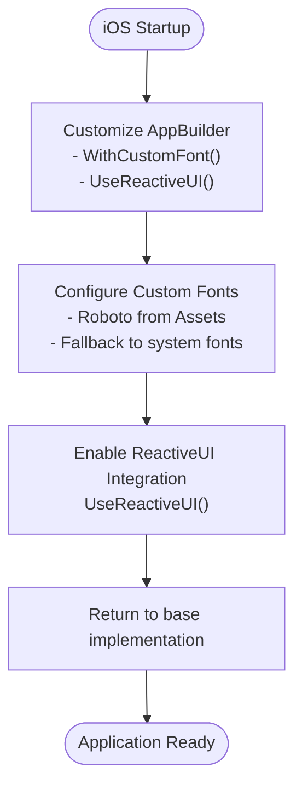
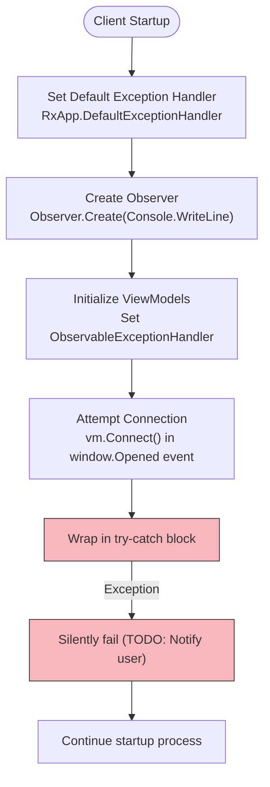

# Startup Issues

<cite>
**Referenced Files in This Document**   
- [App.axaml.cs](file://src/Unlimotion/App.axaml.cs)
- [Program.cs](file://src/Unlimotion.Desktop/Program.cs)
- [Program.cs](file://src/Unlimotion.Browser/Program.cs)
- [Program.cs](file://src/Unlimotion.Server/Program.cs)
- [MainActivity.cs](file://src/Unlimotion.Android/MainActivity.cs)
- [AppDelegate.cs](file://src/Unlimotion.iOS/AppDelegate.cs)
- [Startup.cs](file://src/Unlimotion.Server/Startup.cs)
- [appsettings.json](file://src/Unlimotion.Server/appsettings.json)
- [TaskStorages.cs](file://src/Unlimotion/TaskStorages.cs)
- [AppExtensions.cs](file://src/Unlimotion/AppExtensions.cs)
- [StartupExtensions.cs](file://src/Unlimotion.Server/StartupExtensions.cs)
</cite>

## Table of Contents
1. [Introduction](#introduction)
2. [Platform-Specific Startup Entry Points](#platform-specific-startup-entry-points)
3. [Configuration-Related Startup Errors](#configuration-related-startup-errors)
4. [Dependency Injection and Service Registration Failures](#dependency-injection-and-service-registration-failures)
5. [Avalonia UI Initialization and XAML Parsing Issues](#avalonia-ui-initialization-and-xaml-parsing-issues)
6. [Mobile Platform Startup Requirements](#mobile-platform-startup-requirements)
7. [Diagnostic Procedures and Logging Mechanisms](#diagnostic-procedures-and-logging-mechanisms)
8. [Conclusion](#conclusion)

## Introduction
Unlimotion is a cross-platform application built using Avalonia UI and .NET, supporting desktop, web, server, Android, and iOS environments. This document details common startup issues encountered during application launch across these platforms. The analysis focuses on initialization failures, configuration errors, dependency management, and platform-specific requirements. By examining entry point files such as Program.cs and App.axaml.cs, we trace the initialization flow and identify potential failure points in the startup process.

## Platform-Specific Startup Entry Points

Unlimotion implements distinct startup procedures for each target platform, with specific initialization sequences and error handling mechanisms. The application follows a modular architecture where each platform variant has its own entry point that configures the runtime environment before launching the core application logic.



**Diagram sources**
- [Program.cs](file://src/Unlimotion.Desktop/Program.cs#L1-L93)
- [Program.cs](file://src/Unlimotion.Browser/Program.cs#L1-L51)
- [Program.cs](file://src/Unlimotion.Server/Program.cs#L1-L49)
- [MainActivity.cs](file://src/Unlimotion.Android/MainActivity.cs#L1-L112)
- [AppDelegate.cs](file://src/Unlimotion.iOS/AppDelegate.cs#L1-L25)
- [App.axaml.cs](file://src/Unlimotion/App.axaml.cs#L1-L232)

**Section sources**
- [Program.cs](file://src/Unlimotion.Desktop/Program.cs#L1-L93)
- [Program.cs](file://src/Unlimotion.Browser/Program.cs#L1-L51)
- [Program.cs](file://src/Unlimotion.Server/Program.cs#L1-L49)
- [MainActivity.cs](file://src/Unlimotion.Android/MainActivity.cs#L1-L112)
- [AppDelegate.cs](file://src/Unlimotion.iOS/AppDelegate.cs#L1-L25)

## Configuration-Related Startup Errors

Configuration issues are a common cause of startup failures in Unlimotion applications. The system relies on JSON configuration files to determine storage locations, server settings, and synchronization parameters. Malformed configuration files or missing required settings can prevent successful application initialization.

The primary configuration file for the server component is `appsettings.json`, which contains critical settings for Serilog, RavenDB, and ServiceStack. For desktop and mobile clients, configuration is managed through `Settings.json` files that store task storage settings and Git synchronization parameters.



Common configuration-related startup issues include:
- Missing or inaccessible configuration files
- Malformed JSON syntax in settings files
- Invalid paths for task storage directories
- Missing required configuration sections (TaskStorage, Git)
- Incorrect data types in configuration values

The application implements defensive configuration loading by creating default values when sections are missing, but syntax errors in JSON files will cause startup failures.

**Diagram sources**
- [Program.cs](file://src/Unlimotion.Desktop/Program.cs#L1-L93)
- [Program.cs](file://src/Unlimotion.Browser/Program.cs#L1-L51)
- [MainActivity.cs](file://src/Unlimotion.Android/MainActivity.cs#L1-L112)
- [appsettings.json](file://src/Unlimotion.Server/appsettings.json#L1-L45)

**Section sources**
- [App.axaml.cs](file://src/Unlimotion/App.axaml.cs#L1-L232)
- [Program.cs](file://src/Unlimotion.Desktop/Program.cs#L1-L93)
- [Program.cs](file://src/Unlimotion.Browser/Program.cs#L1-L51)
- [MainActivity.cs](file://src/Unlimotion.Android/MainActivity.cs#L1-L112)

## Dependency Injection and Service Registration Failures

Unlimotion uses Splat as its dependency injection (DI) container, with services registered during the initialization phase in the `App.Init()` method. Failures in DI container setup can prevent the application from starting properly.

The initialization process registers several critical services:
- IConfiguration: Application configuration
- IMapper: AutoMapper instance for object mapping
- IRemoteBackupService: Git backup functionality
- IAppNameDefinitionService: Application name management
- INotificationManagerWrapper: Toast notification system
- IScheduler: Quartz.NET scheduler for background jobs



Common DI-related startup failures include:
- Service registration conflicts when reinitializing
- Missing required services in the container
- Failure to resolve dependencies during service creation
- Threading issues when accessing the locator from multiple contexts

The application uses `Locator.CurrentMutable` to register services, which allows for runtime registration changes. However, attempting to register services after the container has been frozen can lead to startup failures.

**Diagram sources**
- [App.axaml.cs](file://src/Unlimotion/App.axaml.cs#L1-L232)
- [Program.cs](file://src/Unlimotion.Desktop/Program.cs#L1-L93)

**Section sources**
- [App.axaml.cs](file://src/Unlimotion/App.axaml.cs#L1-L232)
- [TaskStorages.cs](file://src/Unlimotion/TaskStorages.cs#L1-L163)

## Avalonia UI Initialization and XAML Parsing Issues

Avalonia UI initialization is a critical phase in the Unlimotion startup process. The application inherits from `Application` and overrides `Initialize()` and `OnFrameworkInitializationCompleted()` methods to set up the UI framework.

The XAML parsing process can fail due to:
- Invalid XAML syntax in UI files
- Missing resource references
- Font loading failures
- Control template errors
- Data binding expression issues



The application specifically disables Avalonia's data annotation validation to avoid conflicts with other validation systems. This is done by removing `DataAnnotationsValidationPlugin` from `BindingPlugins.DataValidators`.

Common XAML-related startup issues include:
- Missing or incorrect assembly references in XAML
- Font loading failures, particularly for custom fonts
- Resource dictionary errors
- Control initialization exceptions
- Theme application failures

**Diagram sources**
- [App.axaml.cs](file://src/Unlimotion/App.axaml.cs#L1-L232)
- [AppExtensions.cs](file://src/Unlimotion/AppExtensions.cs#L1-L32)

**Section sources**
- [App.axaml.cs](file://src/Unlimotion/App.axaml.cs#L1-L232)

## Mobile Platform Startup Requirements

Mobile platforms (Android and iOS) have specific startup requirements and initialization procedures that differ from desktop and server environments.

### Android Startup Process
The Android variant uses `MainActivity` as its entry point, inheriting from `AvaloniaMainActivity<App>`. Key startup requirements include:



**Diagram sources**
- [MainActivity.cs](file://src/Unlimotion.Android/MainActivity.cs#L1-L112)

**Section sources**
- [MainActivity.cs](file://src/Unlimotion.Android/MainActivity.cs#L1-L112)

### iOS Startup Process
The iOS variant uses `AppDelegate` as its entry point, inheriting from `AvaloniaAppDelegate<App>`. The startup process is simpler than Android, with fewer platform-specific requirements:



**Diagram sources**
- [AppDelegate.cs](file://src/Unlimotion.iOS/AppDelegate.cs#L1-L25)

**Section sources**
- [AppDelegate.cs](file://src/Unlimotion.iOS/AppDelegate.cs#L1-L25)

## Diagnostic Procedures and Logging Mechanisms

Unlimotion implements several diagnostic procedures and logging mechanisms to capture early-stage failures during startup.

### Server-Side Logging
The server component uses Serilog for comprehensive logging, configured through `appsettings.json`:

```mermaid
flowchart TD
ServerStart([Server Startup]) --> SerilogConfig["Configure Serilog<br/>UseSerilog() in CreateWebHostBuilder"]
SerilogConfig --> ConsoleSink["Console Sink<br/>WriteTo.Console"]
SerilogConfig --> FileSink["File Sink<br/>WriteTo.File<br/>Path: Log\\log.txt<br/>RollingInterval: 4 (Daily)"]
SerilogConfig --> Enrich["Enrich Logs<br/>FromLogContext"]
ServerStart --> HostBuild["Build Web Host<br/>CreateWebHostBuilder(args).Build()"]
HostBuild --> RavenDBStart["Start RavenDB<br/>GetRequiredService<IAsyncDocumentSession>()"]
RavenDBStart --> HostRun["Run Web Host<br/>host.Run()"]
HostRun --> ExceptionCapture["Capture Exceptions<br/>try-catch around host.Run()"]
ExceptionCapture --> FatalLog["Log Fatal Errors<br/>Log.Fatal(ex, \"Host terminated unexpectedly\")"]
FatalLog --> CloseLog["Close and Flush Logs<br/>Log.CloseAndFlush()"]
CloseLog --> ReturnCode["Return exit code (0=success, 1=failure)"]
style ExceptionCapture fill:#f8b7bd,stroke:#333
style FatalLog fill:#f8b7bd,stroke:#33
```

**Diagram sources**
- [Program.cs](file://src/Unlimotion.Server/Program.cs#L1-L49)
- [appsettings.json](file://src/Unlimotion.Server/appsettings.json#L1-L45)

**Section sources**
- [Program.cs](file://src/Unlimotion.Server/Program.cs#L1-L49)
- [appsettings.json](file://src/Unlimotion.Server/appsettings.json#L1-L45)

### Client-Side Error Handling
Client applications (desktop, browser, mobile) implement error handling through ReactiveUI's exception handling mechanism:



**Diagram sources**
- [App.axaml.cs](file://src/Unlimotion/App.axaml.cs#L1-L232)
- [Program.cs](file://src/Unlimotion.Desktop/Program.cs#L1-L93)

**Section sources**
- [App.axaml.cs](file://src/Unlimotion/App.axaml.cs#L1-L232)

## Conclusion
Startup issues in Unlimotion can occur across multiple platforms and initialization phases. The most common failure points include configuration errors, dependency injection problems, UI framework initialization issues, and platform-specific requirements. Each platform variant has its own entry point and initialization sequence, but all share common initialization logic in the `App.axaml.cs` file.

To diagnose startup issues, developers should:
1. Check configuration files for syntax errors and missing required sections
2. Verify that all required dependencies are properly registered in the DI container
3. Examine platform-specific requirements, especially for mobile platforms
4. Review logging output, particularly from the server component's Serilog implementation
5. Validate that UI resources and XAML files are correctly formatted

The application implements defensive programming practices such as creating default configuration values and gracefully handling some exceptions, but certain errors (like malformed JSON or missing critical services) will still prevent successful startup. Understanding the initialization flow across different platforms is essential for troubleshooting and resolving startup issues effectively.