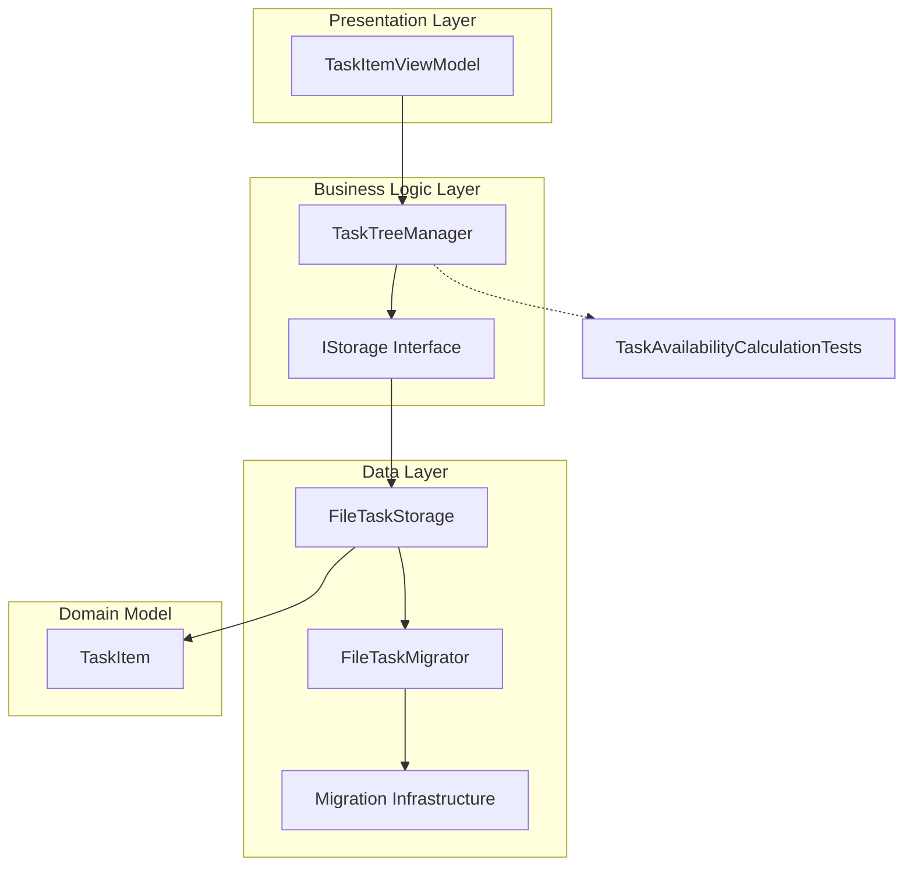
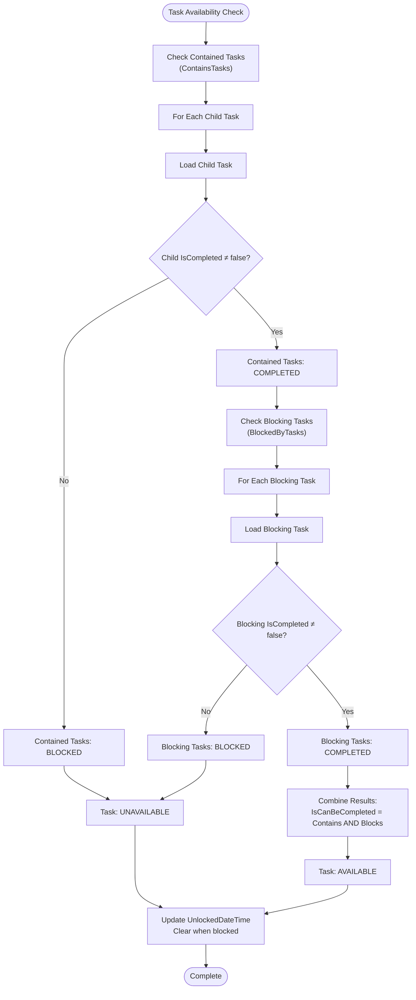
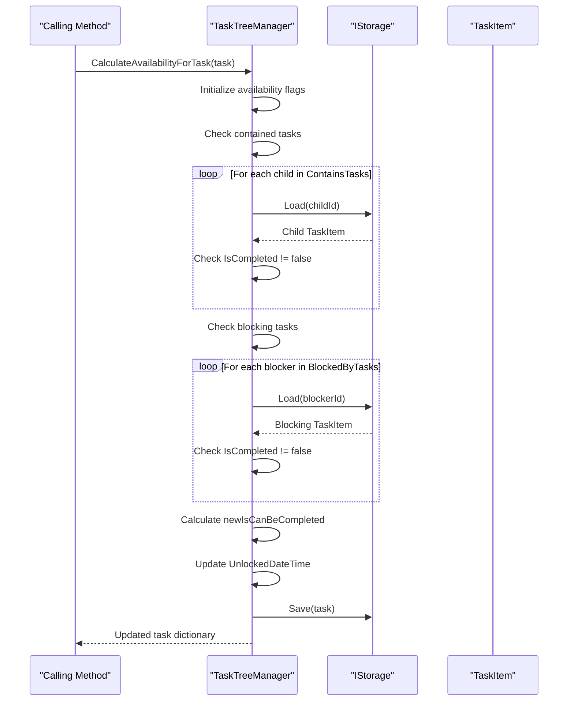
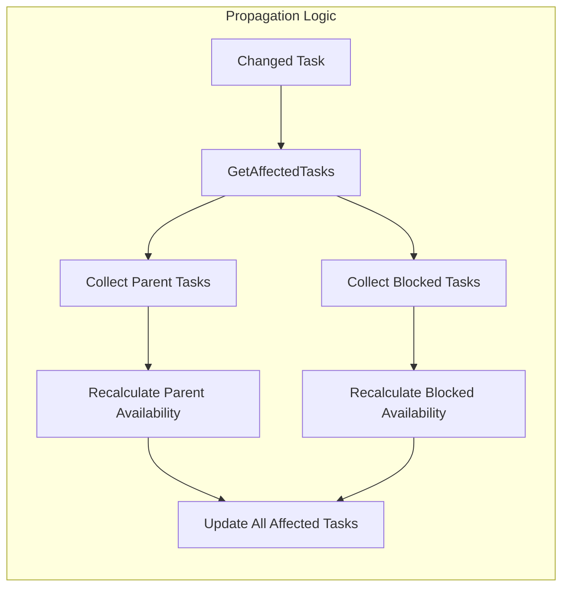
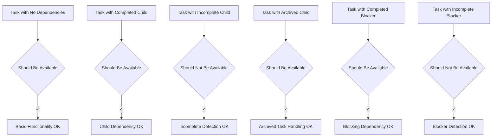
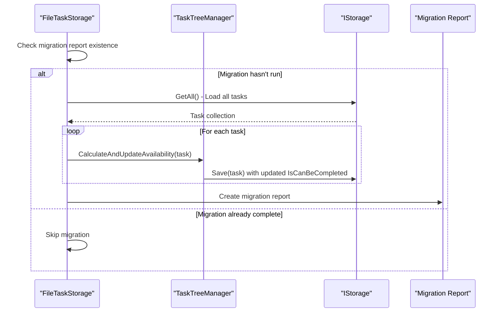
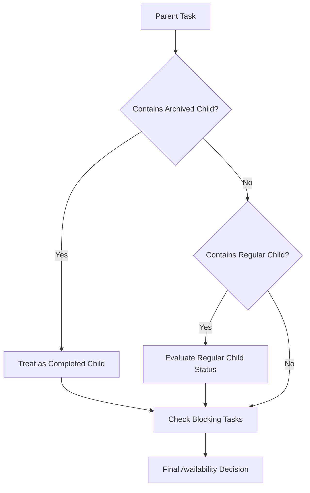

# Task Availability Issues

<cite>
**Referenced Files in This Document**
- [IMPLEMENTATION_SUMMARY.md](file://IMPLEMENTATION_SUMMARY.md)
- [TaskTreeManager.cs](file://src/Unlimotion.TaskTreeManager/TaskTreeManager.cs)
- [TaskAvailabilityCalculationTests.cs](file://src/Unlimotion.Test/TaskAvailabilityCalculationTests.cs)
- [FileTaskStorage.cs](file://src/Unlimotion/FileTaskStorage.cs)
- [TaskItem.cs](file://src/Unlimotion.Domain/TaskItem.cs)
- [InMemoryStorage.cs](file://src/Unlimotion.Test/InMemoryStorage.cs)
- [FileTaskMigrator.cs](file://src/Unlimotion/FileTaskMigrator.cs)
</cite>

## Table of Contents
1. [Introduction](#introduction)
2. [System Architecture Overview](#system-architecture-overview)
3. [Business Rules for Task Availability](#business-rules-for-task-availability)
4. [Core Calculation Logic](#core-calculation-logic)
5. [Common Availability Issues](#common-availability-issues)
6. [Diagnostic Procedures](#diagnostic-procedures)
7. [Recovery Procedures](#recovery-procedures)
8. [Edge Cases and Special Scenarios](#edge-cases-and-special-scenarios)
9. [Best Practices and Prevention](#best-practices-and-prevention)
10. [Troubleshooting Guide](#troubleshooting-guide)

## Introduction

Task availability in Unlimotion determines whether a task can be marked as completed based on its dependencies and blocking relationships. This system ensures that tasks are only available for completion when all prerequisite conditions are met, preventing premature completion of dependent tasks.

The availability calculation system operates on two primary business rules:
1. **Contained Task Dependencies**: All child tasks must be completed (IsCompleted ≠ false)
2. **Blocking Task Dependencies**: All blocking tasks must be completed (IsCompleted ≠ false)

When either condition fails, the task becomes unavailable for completion until the blocking conditions are resolved.

## System Architecture Overview

The task availability system follows a layered architecture with clear separation of concerns:

**Diagram sources**
- [TaskTreeManager.cs](file://src/Unlimotion.TaskTreeManager/TaskTreeManager.cs#L1-L50)
- [FileTaskStorage.cs](file://src/Unlimotion/FileTaskStorage.cs#L1-L50)
- [TaskItem.cs](file://src/Unlimotion.Domain/TaskItem.cs#L1-L33)

**Section sources**
- [IMPLEMENTATION_SUMMARY.md](file://IMPLEMENTATION_SUMMARY.md#L1-L30)
- [TaskTreeManager.cs](file://src/Unlimotion.TaskTreeManager/TaskTreeManager.cs#L1-L50)

## Business Rules for Task Availability

### Core Availability Calculation

The availability of a task is determined by evaluating two sets of dependencies:

**Diagram sources**
- [TaskTreeManager.cs](file://src/Unlimotion.TaskTreeManager/TaskTreeManager.cs#L645-L720)

### Completion State Interpretation

| IsCompleted Value | Meaning | Impact on Availability |
|-------------------|---------|----------------------|
| `true` | Completed | Counted as completed for availability checks |
| `false` | Active/Incomplete | Counted as uncompleted (blocks availability) |
| `null` | Archived | Treated as completed (does not block availability) |

### UnlockedDateTime Management

The system maintains an `UnlockedDateTime` property that tracks when a task became available:

| Event | Action | Result |
|-------|--------|--------|
| Task becomes available (false → true) | Set to current UTC time | `UnlockedDateTime = DateTimeOffset.UtcNow` |
| Task becomes blocked (true → false) | Clear to null | `UnlockedDateTime = null` |
| No change in availability | No action | `UnlockedDateTime` remains unchanged |

**Section sources**
- [IMPLEMENTATION_SUMMARY.md](file://IMPLEMENTATION_SUMMARY.md#L85-L105)
- [TaskTreeManager.cs](file://src/Unlimotion.TaskTreeManager/TaskTreeManager.cs#L680-L720)

## Core Calculation Logic

### CalculateAvailabilityForTask Method

The central calculation logic resides in the `CalculateAvailabilityForTask` method, which performs the core availability determination:

**Diagram sources**
- [TaskTreeManager.cs](file://src/Unlimotion.TaskTreeManager/TaskTreeManager.cs#L645-L720)

### Affected Tasks Propagation

When a task's availability changes, the system propagates recalculations to dependent tasks:

**Diagram sources**
- [TaskTreeManager.cs](file://src/Unlimotion.TaskTreeManager/TaskTreeManager.cs#L722-L770)

**Section sources**
- [TaskTreeManager.cs](file://src/Unlimotion.TaskTreeManager/TaskTreeManager.cs#L629-L720)
- [TaskTreeManager.cs](file://src/Unlimotion.TaskTreeManager/TaskTreeManager.cs#L722-L770)

## Common Availability Issues

### Incorrect Blocking States

#### Issue: Tasks Remain Unavailable Despite Meeting Criteria

**Symptoms:**
- Task shows as unavailable (IsCanBeCompleted = false)
- All child tasks are completed
- All blocking tasks are completed
- UnlockedDateTime is null

**Root Causes:**
1. **Corrupted Task Relationships**: ContainsTasks or BlockedByTasks lists contain invalid IDs
2. **Missing Task References**: Related tasks no longer exist in storage
3. **Circular Dependencies**: Complex dependency cycles causing infinite loops
4. **Archived Task Misinterpretation**: Archived tasks (IsCompleted = null) incorrectly affecting availability

**Diagnostic Approach:**
1. Verify all contained task IDs exist and are completed
2. Verify all blocking task IDs exist and are completed
3. Check for circular dependencies
4. Validate relationship integrity

### Perpetual Blocking Scenarios

#### Issue: Tasks Never Become Available

**Common Patterns:**
1. **Incomplete Child Tasks**: Child tasks remain in `IsCompleted = false` state
2. **Active Blocking Tasks**: Blocking tasks stay in `IsCompleted = false` state
3. **Archived Dependencies**: Tasks with `IsCompleted = null` incorrectly blocking
4. **Relationship Corruption**: Broken parent-child or blocking relationships

**Section sources**
- [TaskAvailabilityCalculationTests.cs](file://src/Unlimotion.Test/TaskAvailabilityCalculationTests.cs#L48-L120)
- [TaskAvailabilityCalculationTests.cs](file://src/Unlimotion.Test/TaskAvailabilityCalculationTests.cs#L163-L200)

## Diagnostic Procedures

### Unit Test-Based Diagnostics

The comprehensive test suite provides validation patterns for diagnosing availability issues:

#### Basic Availability Tests

**Diagram sources**
- [TaskAvailabilityCalculationTests.cs](file://src/Unlimotion.Test/TaskAvailabilityCalculationTests.cs#L15-L120)

#### Advanced Propagation Tests

The tests validate complex scenarios involving task movement and relationship changes:

| Test Scenario | Expected Behavior | Purpose |
|---------------|-------------------|---------|
| `MoveTaskWithChildToParent` | New parent blocked by incomplete child | Validates child transfer scenarios |
| `MoveTaskWithNestedChild` | Parent blocked by nested incomplete child | Tests multi-level dependency chains |
| `MoveBlockedTaskToNewParent` | New parent blocked by blocked task | Validates complex propagation |
| `UpdateTask_WithIsCompletedChange` | Parent becomes available when child completes | Tests reactive updates |

### Manual Diagnostic Steps

#### Step 1: Verify Task State
1. Check `IsCompleted` property values
2. Verify `IsCanBeCompleted` reflects expected state
3. Examine `UnlockedDateTime` for availability timing

#### Step 2: Validate Dependencies
1. Inspect `ContainsTasks` list for completeness
2. Check `BlockedByTasks` list for blockers
3. Verify all referenced task IDs exist

#### Step 3: Test Individual Calculations
Use the `CalculateAndUpdateAvailability` method to test specific tasks independently.

**Section sources**
- [TaskAvailabilityCalculationTests.cs](file://src/Unlimotion.Test/TaskAvailabilityCalculationTests.cs#L273-L420)
- [TaskAvailabilityCalculationTests.cs](file://src/Unlimotion.Test/TaskAvailabilityCalculationTests.cs#L421-L717)

## Recovery Procedures

### Migration-Based Recovery

The system includes automated migration logic to recover from corrupted availability states:

**Diagram sources**
- [FileTaskStorage.cs](file://src/Unlimotion/FileTaskStorage.cs#L115-L145)

### Manual Recovery Procedures

#### Procedure 1: Force Availability Recalculation

1. **Identify Problematic Tasks**: Locate tasks with incorrect availability states
2. **Trigger Recalculation**: Call `CalculateAndUpdateAvailability` for each affected task
3. **Verify Results**: Confirm availability state matches expectations
4. **Save Changes**: Persist updated task states

#### Procedure 2: Relationship Repair

1. **Validate Task References**: Check all ContainsTasks and BlockedByTasks IDs
2. **Remove Invalid References**: Clean up broken relationships
3. **Rebuild Dependencies**: Recreate proper parent-child and blocking relationships
4. **Recalculate Availability**: Trigger propagation for affected tasks

#### Procedure 3: Complete System Reset

1. **Backup Current State**: Export all task data
2. **Clear Migration Report**: Remove `availability.migration.report` file
3. **Restart Application**: Allow migration to rerun
4. **Validate Recovery**: Verify all tasks have correct availability states

**Section sources**
- [FileTaskStorage.cs](file://src/Unlimotion/FileTaskStorage.cs#L115-L145)
- [FileTaskMigrator.cs](file://src/Unlimotion/FileTaskMigrator.cs#L40-L194)

## Edge Cases and Special Scenarios

### Archived Tasks (IsCompleted = null)

Archived tasks present unique challenges in availability calculations:

#### Behavior Characteristics
- **Treated as Completed**: Archived tasks do not block availability
- **Preserve History**: Maintains completion history while allowing progress
- **Dependency Resolution**: Can be part of complex dependency chains

#### Impact on Availability

**Diagram sources**
- [TaskAvailabilityCalculationTests.cs](file://src/Unlimotion.Test/TaskAvailabilityCalculationTests.cs#L95-L120)

### Complex Dependency Chains

#### Nested Dependencies
Tasks can contain other tasks, creating multi-level dependency structures:

**Scenario**: Grandparent → Parent → Child
- Parent blocked by Child (IsCompleted = false)
- Grandparent blocked by Parent (due to blocked child)

#### Circular Dependencies
While the system prevents circular dependencies during creation, corruption can introduce them:

**Detection**: Recursive relationship checking during availability calculation
**Resolution**: Manual intervention required to break cycles

### Large Task Graphs

#### Performance Considerations
- **Propagation Depth**: Deep dependency chains require multiple recalculations
- **Storage Access**: Each dependency check requires database access
- **Memory Usage**: Large task collections consume memory during processing

#### Optimization Strategies
1. **Batch Processing**: Group related task updates
2. **Lazy Loading**: Load task dependencies only when needed
3. **Caching**: Store frequently accessed task states

**Section sources**
- [TaskAvailabilityCalculationTests.cs](file://src/Unlimotion.Test/TaskAvailabilityCalculationTests.cs#L95-L120)
- [TaskTreeManager.cs](file://src/Unlimotion.TaskTreeManager/TaskTreeManager.cs#L722-L770)

## Best Practices and Prevention

### Preventive Measures

#### Data Integrity
1. **Validation Rules**: Enforce task state consistency during creation
2. **Reference Checking**: Validate task IDs before establishing relationships
3. **Regular Audits**: Periodic verification of task dependency integrity

#### Monitoring and Alerting
1. **Availability Tracking**: Monitor tasks with unexpected availability states
2. **Dependency Analysis**: Track complex dependency patterns
3. **Performance Metrics**: Measure availability calculation performance

#### Maintenance Procedures
1. **Regular Migration**: Run availability migration periodically
2. **Backup Verification**: Ensure backup integrity for disaster recovery
3. **Testing Protocols**: Validate availability logic changes

### Development Guidelines

#### Task Creation
- Always validate child task completion before creating parent tasks
- Establish blocking relationships carefully to avoid unintended dependencies
- Use atomic operations for complex relationship changes

#### Relationship Management
- Prefer explicit relationship removal before deletion
- Validate relationship integrity after bulk operations
- Implement rollback mechanisms for failed operations

#### Testing Strategies
- Test edge cases with archived and incomplete tasks
- Validate propagation behavior with complex dependency chains
- Verify recovery procedures with corrupted data scenarios

**Section sources**
- [IMPLEMENTATION_SUMMARY.md](file://IMPLEMENTATION_SUMMARY.md#L150-L167)

## Troubleshooting Guide

### Common Error Patterns

#### Symptoms: Tasks Never Become Available
**Diagnosis Steps:**
1. Check all contained tasks for `IsCompleted = false` status
2. Verify blocking tasks are completed
3. Look for archived tasks in dependency chains
4. Validate relationship integrity

**Resolution Actions:**
- Complete pending child tasks
- Fix blocking task states
- Remove unnecessary dependencies

#### Symptoms: Tasks Permanently Blocked
**Diagnosis Steps:**
1. Examine `UnlockedDateTime` for recent activity
2. Check for circular dependencies
3. Verify task existence for all relationship references
4. Review recent task modifications

**Resolution Actions:**
- Break circular dependencies manually
- Restore missing task references
- Trigger availability recalculation

#### Symptoms: Performance Degradation
**Diagnosis Steps:**
1. Monitor availability calculation frequency
2. Check for excessive relationship changes
3. Analyze task graph complexity
4. Review storage access patterns

**Resolution Actions:**
- Optimize dependency structures
- Implement caching strategies
- Batch related operations

### Debug Information Collection

#### Essential Debug Data
- Task ID and current availability state
- ContainsTasks and BlockedByTasks lists
- Child and blocking task completion statuses
- Last modification timestamps
- Relationship change history

#### Logging Recommendations
- Enable detailed logging for availability calculations
- Track propagation events and affected tasks
- Monitor storage access patterns
- Record performance metrics for complex operations

### Recovery Checklist

#### Immediate Recovery
1. [ ] Stop all task modifications
2. [ ] Backup current task data
3. [ ] Clear migration report file
4. [ ] Restart application
5. [ ] Verify availability states

#### Thorough Investigation
1. [ ] Review task modification logs
2. [ ] Analyze relationship integrity
3. [ ] Test individual task availability
4. [ ] Validate propagation behavior
5. [ ] Document findings and resolution

**Section sources**
- [TaskAvailabilityCalculationTests.cs](file://src/Unlimotion.Test/TaskAvailabilityCalculationTests.cs#L1-L50)
- [FileTaskStorage.cs](file://src/Unlimotion/FileTaskStorage.cs#L115-L145)