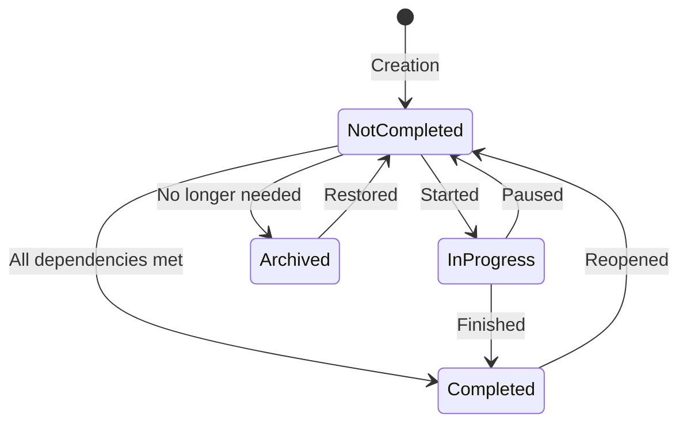
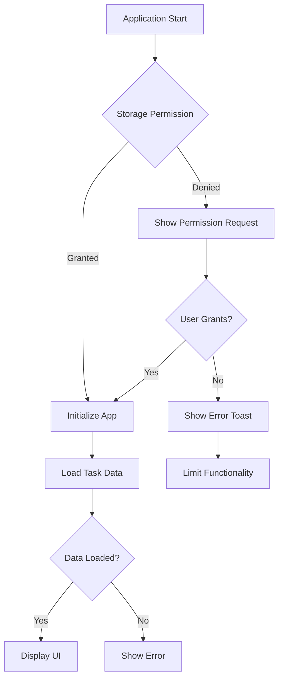

# Troubleshooting

<cite>
**Referenced Files in This Document**   
- [README.md](file://README.md)
- [IMPLEMENTATION_SUMMARY.md](file://IMPLEMENTATION_SUMMARY.md)
- [App.axaml.cs](file://src/Unlimotion/App.axaml.cs)
- [FileTaskStorage.cs](file://src/Unlimotion/FileTaskStorage.cs)
- [TaskStorages.cs](file://src/Unlimotion/TaskStorages.cs)
- [GitPullJob.cs](file://src/Unlimotion/Scheduling/Jobs/GitPullJob.cs)
- [GitPushJob.cs](file://src/Unlimotion/Scheduling/Jobs/GitPushJob.cs)
- [NotificationManagerWrapper.cs](file://src/Unlimotion/NotificationManagerWrapper.cs)
- [ObservableExceptionHandler.cs](file://src/Unlimotion.ViewModel/ObservableExceptionHandler.cs)
- [INotificationManagerWrapper.cs](file://src/Unlimotion.ViewModel/INotificationManagerWrapper.cs)
- [FileDbWatcher.cs](file://src/Unlimotion.ViewModel/FileDbWatcher.cs)
- [TaskAvailabilityCalculationTests.cs](file://src/Unlimotion.Test/TaskAvailabilityCalculationTests.cs)
- [MainWindowViewModelTests.cs](file://src/Unlimotion.Test/MainWindowViewModelTests.cs)
- [AndroidManifest.xml](file://src/Unlimotion.Android/Properties/AndroidManifest.xml)
- [MainActivity.cs](file://src/Unlimotion.Android/MainActivity.cs)
</cite>

## Table of Contents
1. [Application Startup Failures](#application-startup-failures)
2. [Database Connection Errors](#database-connection-errors)
3. [Synchronization Problems](#synchronization-problems)
4. [.NET Runtime Issues](#net-runtime-issues)
5. [Git Integration Problems](#git-integration-problems)
6. [Task Availability Calculation Issues](#task-availability-calculation-issues)
7. [Performance with Large Task Databases](#performance-with-large-task-databases)
8. [Mobile-Specific Issues](#mobile-specific-issues)
9. [Debugging Techniques](#debugging-techniques)
10. [Data Recovery Procedures](#data-recovery-procedures)
11. [Known Limitations and Workarounds](#known-limitations-and-workarounds)

## Application Startup Failures

Application startup failures in Unlimotion can occur due to missing dependencies, configuration issues, or file permission problems. The application requires the .NET 9.0 SDK to be installed on the system. When launching the application, ensure that the runtime environment is properly configured according to the operating system requirements specified in the README.md.

For macOS users, additional steps are required after installation due to Apple's security policy for unsigned applications. After installing on macOS, execute the command `sudo chmod -R 755 /Applications/Unlimotion.app` to grant the necessary rights, as they are not automatically granted. On Windows and Debian systems, no additional steps are required for correct installation.

The application initialization process begins in the App.axaml.cs file, where the framework initialization is completed and the main window view model is created. If the application fails to start, check the configuration path and ensure that the required services are properly registered in the dependency injection container. The Init method in App.axaml.cs initializes the configuration, mapper, and various services that are essential for the application to function correctly.

**Section sources**
- [README.md](file://README.md)
- [App.axaml.cs](file://src/Unlimotion/App.axaml.cs)

## Database Connection Errors

Database connection errors in Unlimotion typically stem from incorrect task storage configuration or file system permission issues. The application uses a file-based storage system where tasks are saved in JSON format in a specified directory. The TaskStorages.cs file handles the registration of storage providers and manages the connection between the application and the task storage.

When a database connection error occurs, first verify that the TaskStorage Path in the Settings is correctly configured. This path specifies the directory where task files will be saved and can be set as either an absolute or relative path. If no path is specified, tasks are saved in the "Tasks" directory created in the working directory from which the program was launched.

The FileTaskStorage.cs implementation includes error handling for file operations, but certain exceptions during file access may still cause connection issues. The RegisterFileTaskStorage method in TaskStorages.cs attempts to create a FileDbWatcher for monitoring file changes, and if this fails, it unregisters all IDatabaseWatcher instances. Check that the application has the necessary permissions to read and write to the specified storage directory.

**Section sources**
- [TaskStorages.cs](file://src/Unlimotion/TaskStorages.cs)
- [FileTaskStorage.cs](file://src/Unlimotion/FileTaskStorage.cs)

## Synchronization Problems

Synchronization problems between clients in Unlimotion primarily relate to the Git-based backup and synchronization system. The application uses Quartz.NET scheduler to periodically execute Git pull and push operations through GitPullJob.cs and GitPushJob.cs. These jobs run at intervals specified in the Git settings (PullIntervalSeconds and PushIntervalSeconds).

Synchronization issues can occur when the Git repository is not properly configured or when network connectivity problems prevent successful Git operations. The BackupViaGitService, registered in App.axaml.cs, handles the Git operations, and its functionality depends on correct Git settings including RemoteUrl, Branch, UserName, Password, and other repository-specific configurations.

When synchronization fails, check the Git settings in the application configuration and verify that the remote repository is accessible. The scheduler starts only when the application is not in server mode and after the task repository has been initiated. If the Git backup is enabled, the scheduler will start and execute the pull and push jobs according to the specified intervals.

**Section sources**
- [GitPullJob.cs](file://src/Unlimotion/Scheduling/Jobs/GitPullJob.cs)
- [GitPushJob.cs](file://src/Unlimotion/Scheduling/Jobs/GitPushJob.cs)
- [App.axaml.cs](file://src/Unlimotion/App.axaml.cs)

## .NET Runtime Issues

.NET runtime issues in Unlimotion are primarily related to missing or incompatible .NET SDK versions. The application requires .NET 9.0 SDK to be installed on the target system. When users encounter runtime errors, the most common cause is the absence of the required .NET runtime components.

To resolve .NET runtime issues, users should download and install the .NET 9.0 SDK from the official Microsoft website as specified in the README.md. After installation, restart the application to ensure that the runtime environment is properly loaded.

The application's build and execution process is designed to work with the specific version of .NET, and using an incompatible version may result in runtime exceptions or compilation errors. Developers working with the source code should ensure that their development environment matches the required .NET version to avoid build and execution problems.

**Section sources**
- [README.md](file://README.md)

## Git Integration Problems

Git integration problems in Unlimotion can manifest as authentication failures, merge conflicts, or repository permission errors. The application uses Git for backup and synchronization purposes, with operations managed through the BackupViaGitService and scheduled jobs.

Authentication failures typically occur when the Git credentials (UserName and Password) are incorrect or when the repository requires additional authentication methods not supported by the current implementation. Repository permission errors happen when the user account does not have sufficient privileges to read from or write to the remote repository.

Merge conflicts can arise when multiple clients modify the same tasks simultaneously and attempt to synchronize with the central repository. The current implementation does not provide automated conflict resolution, so users may need to manually resolve conflicts by pulling the latest changes, resolving conflicts in the JSON task files, and then pushing the updated files.

The Git settings are initialized in App.axaml.cs, where default values are set for various Git parameters including RemoteUrl, Branch, UserName, Password, and interval settings for pull and push operations.

**Section sources**
- [App.axaml.cs](file://src/Unlimotion/App.axaml.cs)
- [TaskStorages.cs](file://src/Unlimotion/TaskStorages.cs)

## Task Availability Calculation Issues

Task availability calculation issues in Unlimotion are related to the blocking logic that determines when a task can be completed. According to the IMPLEMENTATION_SUMMARY.md, a task can be completed when all contained tasks are completed (IsCompleted != false) and all blocking tasks are completed (IsCompleted != false).

The task availability logic has been extracted from the presentation layer to the domain business logic layer in TaskTreeManager, as documented in IMPLEMENTATION_SUMMARY.md. The CalculateAndUpdateAvailability method in TaskTreeManager is the main entry point for calculating availability, which checks all contained and blocking tasks and updates the IsCanBeCompleted property accordingly.

Issues with task availability calculations can occur when the availability cache is corrupted or when the migration process for existing tasks fails. The FileTaskStorage.cs includes a MigrateIsCanBeCompleted method that calculates availability for existing tasks during the first load, creating an availability.migration.report file to indicate that the migration has been completed.

Unit tests in TaskAvailabilityCalculationTests.cs verify various scenarios including tasks with no dependencies, tasks with completed or incomplete children, and tasks with blocking dependencies. These tests can be used as diagnostic tools to verify the correctness of the availability calculation logic.

**Diagram sources**
- [IMPLEMENTATION_SUMMARY.md](file://IMPLEMENTATION_SUMMARY.md)
- [TaskAvailabilityCalculationTests.cs](file://src/Unlimotion.Test/TaskAvailabilityCalculationTests.cs)

**Section sources**
- [IMPLEMENTATION_SUMMARY.md](file://IMPLEMENTATION_SUMMARY.md)
- [FileTaskStorage.cs](file://src/Unlimotion/FileTaskStorage.cs)
- [TaskAvailabilityCalculationTests.cs](file://src/Unlimotion.Test/TaskAvailabilityCalculationTests.cs)

## Performance with Large Task Databases

Performance issues with large task databases in Unlimotion can be addressed through optimization strategies such as efficient indexing and query optimization. The application stores tasks in JSON files, with each task saved as a separate file in the specified storage directory. As the number of tasks grows, file system operations can become a bottleneck.

The FileTaskStorage implementation uses a SourceCache from DynamicData to maintain an in-memory cache of TaskItemViewModel objects, which helps reduce the need for frequent file reads. However, operations that require loading all tasks, such as the GetAll method, can become slow with large datasets.

To optimize performance, consider the following strategies:
1. Ensure that the task storage directory is on a fast storage device
2. Limit the number of simultaneous file operations
3. Use the built-in throttling mechanism in TaskItemViewModel (DefaultThrottleTime) to batch updates
4. Regularly clean up completed or archived tasks that are no longer needed

The application's architecture separates business logic from the presentation layer, which helps maintain performance by minimizing reactive subscriptions in the ViewModel layer. The TaskTreeManager handles complex operations like adding child tasks or updating task relationships efficiently by identifying and recalculating only the affected tasks.

**Section sources**
- [FileTaskStorage.cs](file://src/Unlimotion/FileTaskStorage.cs)
- [TaskStorages.cs](file://src/Unlimotion/TaskStorages.cs)

## Mobile-Specific Issues

Mobile-specific issues in Unlimotion relate to platform permissions and notification functionality. The Android implementation requires specific permissions to access external storage and the internet, as defined in the AndroidManifest.xml file. These permissions include READ_EXTERNAL_STORAGE, WRITE_EXTERNAL_STORAGE, and INTERNET.

On Android devices, users must grant permission to access external storage before the application can save task data. The MainActivity.cs handles the permission request result in the OnRequestPermissionsResult method, displaying a toast message if permission is denied. If the user denies storage permission, the application cannot save or load tasks, leading to data persistence issues.

Push notification failures can occur if the notification system is not properly initialized or if the device's notification settings block the application. The NotificationManagerWrapper class handles toast notifications, creating messages with specific background colors for success (#008800) and error (#DC483D) states with a 7-second display duration.

The mobile implementation also needs to handle different screen sizes and orientations, though specific details about responsive design implementation are not available in the provided codebase.

**Diagram sources**
- [AndroidManifest.xml](file://src/Unlimotion.Android/Properties/AndroidManifest.xml)
- [MainActivity.cs](file://src/Unlimotion.Android/MainActivity.cs)
- [NotificationManagerWrapper.cs](file://src/Unlimotion/NotificationManagerWrapper.cs)

**Section sources**
- [AndroidManifest.xml](file://src/Unlimotion.Android/Properties/AndroidManifest.xml)
- [MainActivity.cs](file://src/Unlimotion.Android/MainActivity.cs)
- [NotificationManagerWrapper.cs](file://src/Unlimotion/NotificationManagerWrapper.cs)

## Debugging Techniques

Debugging techniques for Unlimotion include using unit tests as diagnostic tools and implementing effective logging strategies to capture problematic behavior. The application includes a comprehensive suite of unit tests in the Unlimotion.Test project that can help identify and diagnose issues.

The ObservableExceptionHandler in ObservableExceptionHandler.cs serves as a global exception handler that captures unhandled exceptions in the reactive programming pipeline. When an exception occurs, it displays an error toast with the exception message, file name, and line number, providing valuable information for debugging. The handler also includes debugger breakpoints when running in debug mode.

The NotificationManagerWrapper provides three types of user feedback: Ask (for confirmation dialogs), ErrorToast (for error messages), and SuccessToast (for success notifications). These can be used to trace application flow and identify where operations succeed or fail.

Unit tests in MainWindowViewModelTests.cs and TaskAvailabilityCalculationTests.cs can be used as diagnostic tools to verify specific functionality. For example, the TaskAvailabilityCalculationTests verify the correctness of task availability calculations under various conditions, while MainWindowViewModelTests validate user interactions like creating, renaming, and moving tasks.

The FileDbWatcher class includes a debug logger that can help track file system events and synchronization issues. When debugging file-related problems, this component can provide insights into when files are created, modified, or deleted.

**Section sources**
- [ObservableExceptionHandler.cs](file://src/Unlimotion.ViewModel/ObservableExceptionHandler.cs)
- [NotificationManagerWrapper.cs](file://src/Unlimotion/NotificationManagerWrapper.cs)
- [MainWindowViewModelTests.cs](file://src/Unlimotion.Test/MainWindowViewModelTests.cs)
- [TaskAvailabilityCalculationTests.cs](file://src/Unlimotion.Test/TaskAvailabilityCalculationTests.cs)

## Data Recovery Procedures

Data recovery procedures for Unlimotion involve handling corrupted task data and rebuilding the availability cache. The application stores tasks as individual JSON files, which makes it possible to recover data by manually editing or replacing corrupted files.

When task data becomes corrupted, the JsonRepairingReader.DeserializeWithRepair method in FileTaskStorage.cs attempts to repair and deserialize the JSON data. If repair is not possible, the method returns null, and the application may skip loading that particular task.

To rebuild the availability cache, the application includes a migration process in the MigrateIsCanBeCompleted method of FileTaskStorage.cs. This method calculates the IsCanBeCompleted status for all existing tasks and creates a migration report file (availability.migration.report) to prevent reprocessing on subsequent startups.

For severe data corruption, users can:
1. Locate the task storage directory specified in the settings
2. Backup the entire directory
3. Remove individual corrupted task files (identified by size zero or invalid JSON)
4. Restart the application to trigger the migration process
5. Verify that tasks are properly loaded and relationships are maintained

The application's use of Git for backup (when enabled) provides an additional recovery option. Users can clone the repository to a new location and use it as a clean data source if local data becomes corrupted.

**Section sources**
- [FileTaskStorage.cs](file://src/Unlimotion/FileTaskStorage.cs)

## Known Limitations and Workarounds

Known limitations in Unlimotion are documented in the README.md backlog, with several incomplete features that users should be aware of. These limitations include:

1. **Search functionality**: The application currently lacks a search feature for tasks, making it difficult to locate specific tasks in large collections. As a workaround, users can organize tasks hierarchically or use emoji filtering to categorize and find related tasks.

2. **Breadcrumb navigation**: Navigating through breadcrumb tasks is not implemented, limiting the ability to quickly jump to parent tasks in the hierarchy.

3. **Blocking propagation**: The "Block all subtasks of a blocked task" feature is not implemented, requiring users to manually block individual subtasks when a parent task is blocked.

4. **Planned period inheritance**: The planned period is not inherited for child tasks, requiring users to manually set duration and scheduling information for each task.

5. **File change watcher**: The file change watcher for tracking external modifications is not implemented, which can lead to synchronization issues when tasks are modified outside the application.

6. **Mass task operations**: Mass transfer of tasks is not supported, requiring users to move tasks individually.

7. **Mobile app limitations**: While mobile apps exist for Android and iOS, they may have reduced functionality compared to the desktop version.

8. **File attachments**: The ability to attach files to tasks is not implemented, limiting the application's utility for tasks that require supporting documents.

9. **Server-based storage**: A server for storing tasks centrally is not yet implemented, relying instead on Git-based synchronization for multi-device access.

10. **History and rollback**: Change history with the ability to roll back changes is not available, making it difficult to recover from accidental modifications.

Users should plan their workflows around these limitations and consider using external tools or manual processes to compensate for missing functionality.

**Section sources**
- [README.md](file://README.md)