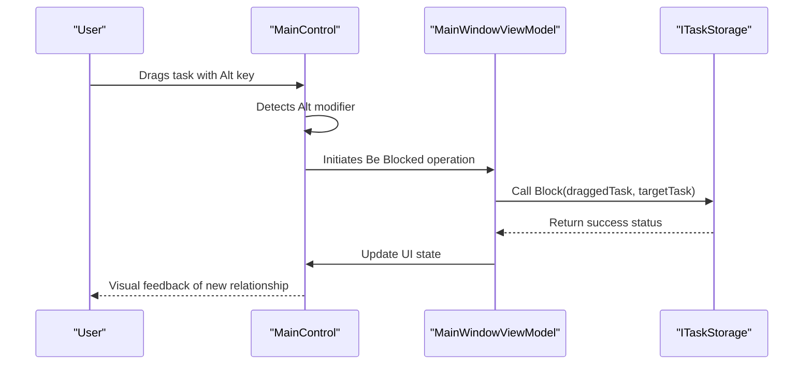
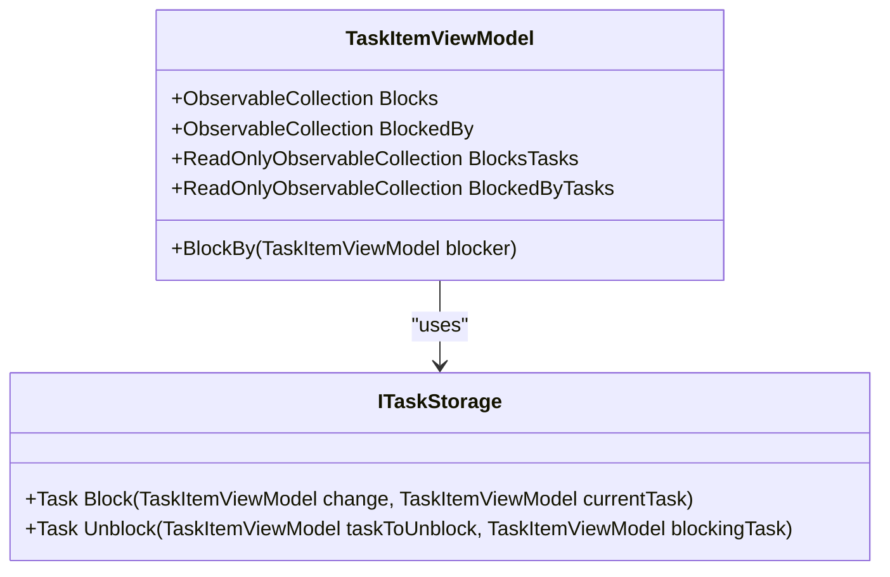
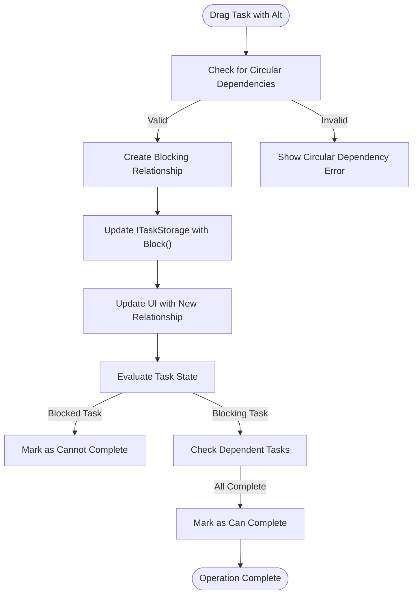

# Be Blocked Operation (Alt)

<cite>
**Referenced Files in This Document**   
- [MainWindowViewModel.cs](file://src/Unlimotion.ViewModel/MainWindowViewModel.cs)
- [ITaskStorage.cs](file://src/Unlimotion.ViewModel/ITaskStorage.cs)
- [TaskItemViewModel.cs](file://src/Unlimotion.ViewModel/TaskItemViewModel.cs)
- [MainControl.axaml.cs](file://src/Unlimotion/Views/MainControl.axaml.cs)
</cite>

## Table of Contents
1. [Introduction](#introduction)
2. [Be Blocked Operation Overview](#be-blocked-operation-overview)
3. [Implementation in MainWindowViewModel](#implementation-in-mainwindowviewmodel)
4. [Relationship Direction and Storage Updates](#relationship-direction-and-storage-updates)
5. [User Experience Aspects](#user-experience-aspects)
6. [Circular Dependency Prevention](#circular-dependency-prevention)
7. [Integration with Task State Evaluation](#integration-with-task-state-evaluation)
8. [Be Blocked vs Block Operations](#be-blocked-vs-block-operations)
9. [Conclusion](#conclusion)

## Introduction
The Be Blocked operation in Unlimotion's drag-and-drop functionality enables users to create dependency relationships between tasks using the Alt key modifier. This operation establishes a blocking relationship where the target task blocks the dragged task, making the dragged task dependent on the target's completion. This document details the implementation of this feature, focusing on how the Alt modifier creates blocking relationships through the ITaskStorage interface and MainWindowViewModel. The analysis covers the technical implementation, user experience aspects, validation mechanisms, and integration with the task state evaluation system.

## Be Blocked Operation Overview
The Be Blocked operation allows users to create a dependency relationship between tasks during drag-and-drop interactions by holding the Alt key. When a user drags a task (the dragged task) and drops it onto another task (the target task) while holding Alt, the target task becomes a blocker for the dragged task. This means the dragged task cannot be completed until the target task is completed.

This operation is implemented as part of the drag-and-drop functionality in the MainControl.axaml.cs file, where keyboard modifiers are detected during drag events. The Alt key modifier specifically triggers the "be blocked" behavior, which differs from other modifiers like Ctrl (which creates the opposite blocking relationship). The operation provides a intuitive way to establish task dependencies without requiring menu navigation or complex interactions.

**Section sources**
- [MainControl.axaml.cs](file://src/Unlimotion/Views/MainControl.axaml.cs#L224-L230)

## Implementation in MainWindowViewModel
The Be Blocked operation is handled through the MainWindowViewModel, which serves as the central coordinator for task management operations. When the Alt key is detected during a drag-and-drop operation, the MainWindowViewModel processes the interaction by calling the appropriate methods on the ITaskStorage interface.

The implementation follows a reactive programming pattern using ReactiveUI, where drag-and-drop events trigger commands that update the task relationships. The MainWindowViewModel maintains references to the current task repository and exposes commands for various operations, including blocking relationships. When the Alt key operation is detected, the ViewModel calls the Block method on the ITaskStorage interface, passing the appropriate task references to establish the blocking relationship.

The ViewModel also manages the UI state and ensures that the visual representation of task relationships is updated accordingly. This includes refreshing the task lists and updating any visual indicators that show blocking relationships between tasks.

**Diagram sources**
- [MainWindowViewModel.cs](file://src/Unlimotion.ViewModel/MainWindowViewModel.cs#L800-L1062)
- [MainControl.axaml.cs](file://src/Unlimotion/Views/MainControl.axaml.cs#L224-L230)

**Section sources**
- [MainWindowViewModel.cs](file://src/Unlimotion.ViewModel/MainWindowViewModel.cs#L800-L1062)

## Relationship Direction and Storage Updates
The Be Blocked operation creates a specific directional relationship between tasks, which is implemented through the ITaskStorage interface's blocking methods. When using the Alt key, the relationship direction is from the target task to the dragged task, meaning the target task blocks the dragged task.

This differs significantly from the Ctrl operation, which creates the opposite relationship (the dragged task blocks the target task). The distinction is implemented in the MainControl.axaml.cs file, where different code paths are executed based on the keyboard modifier:

- **Alt key**: `subItem.BlockBy(task)` - target task blocks dragged task
- **Ctrl key**: `task.BlockBy(subItem)` - dragged task blocks target task

The ITaskStorage interface defines the Block method that is used to establish these relationships. When a blocking relationship is created, the storage system updates the task models to reflect the new dependency. This involves modifying the BlockedBy collection of the dragged task to include the target task, and correspondingly updating the Blocks collection of the target task.

**Diagram sources**
- [ITaskStorage.cs](file://src/Unlimotion.ViewModel/ITaskStorage.cs#L25-L30)
- [TaskItemViewModel.cs](file://src/Unlimotion.ViewModel/TaskItemViewModel.cs#L300-L305)

**Section sources**
- [MainControl.axaml.cs](file://src/Unlimotion/Views/MainControl.axaml.cs#L224-L230)
- [ITaskStorage.cs](file://src/Unlimotion.ViewModel/ITaskStorage.cs#L25-L30)

## User Experience Aspects
The Be Blocked operation provides several user experience features to ensure intuitive interaction and clear feedback. When a user initiates a drag operation while holding the Alt key, the system provides visual feedback to indicate the type of operation being performed.

During the drag operation, the cursor changes to indicate that a "be blocked" relationship is being created. When hovering over potential target tasks, visual indicators appear to show where the relationship would be established if dropped. This immediate feedback helps users understand the consequences of their actions before completing the operation.

After successfully creating a blocking relationship, the UI updates to reflect the new dependency. This includes visual indicators on both the blocked task and the blocking task, making the relationship immediately apparent. The system also updates any relevant task lists and views to ensure consistency across the application.

The operation integrates with the application's undo/redo system, allowing users to reverse the operation if needed. Error handling is implemented to provide clear messages if the operation fails, such as when attempting to create circular dependencies.

**Section sources**
- [MainControl.axaml.cs](file://src/Unlimotion/Views/MainControl.axaml.cs#L224-L230)
- [MainWindowViewModel.cs](file://src/Unlimotion.ViewModel/MainWindowViewModel.cs#L800-L1062)

## Circular Dependency Prevention
The Be Blocked operation includes validation mechanisms to prevent circular dependencies, which could create unsolvable task blocking scenarios. Before establishing a blocking relationship, the system checks whether the proposed relationship would create a circular dependency.

The validation is implemented through the task relationship tracking system, which maintains collections of blocking and blocked tasks for each task. When a user attempts to create a blocking relationship using the Alt key, the system traverses the existing dependency graph to ensure that the target task is not already indirectly blocked by the dragged task.

If a circular dependency would be created, the operation is rejected, and the user is notified through a visual feedback mechanism. This prevents users from creating impossible task sequences while still allowing flexible dependency management. The validation occurs in real-time during the drag operation, providing immediate feedback when hovering over incompatible targets.

**Section sources**
- [TaskItemViewModel.cs](file://src/Unlimotion.ViewModel/TaskItemViewModel.cs#L700-L750)
- [MainControl.axaml.cs](file://src/Unlimotion/Views/MainControl.axaml.cs#L224-L230)

## Integration with Task State Evaluation
The Be Blocked operation is tightly integrated with the task state evaluation system, which determines when tasks can be completed based on their dependencies. After a blocking relationship is established using the Alt key, the task state evaluation system automatically updates the completion status of the affected tasks.

The system evaluates whether a task can be completed by checking both its direct completion status and its dependency status. A task cannot be marked as completed if it has any active blocking relationships (i.e., if it is blocked by incomplete tasks). This evaluation is performed reactively, meaning that when a blocking task is completed, all tasks that were blocked by it are automatically re-evaluated for completion eligibility.

The integration is implemented through observable collections and reactive programming patterns. Changes to task completion status trigger automatic updates to the IsCanBeCompleted property of all dependent tasks. This ensures that the UI accurately reflects the current state of task dependencies and completion eligibility.

**Diagram sources**
- [TaskItemViewModel.cs](file://src/Unlimotion.ViewModel/TaskItemViewModel.cs#L100-L150)
- [MainWindowViewModel.cs](file://src/Unlimotion.ViewModel/MainWindowViewModel.cs#L800-L1062)

**Section sources**
- [TaskItemViewModel.cs](file://src/Unlimotion.ViewModel/TaskItemViewModel.cs#L100-L150)

## Be Blocked vs Block Operations
Understanding the difference between "be blocked" (Alt) and "block" (Ctrl) operations is crucial for proper dependency management in Unlimotion. These operations create opposite directional relationships between tasks:

- **Be Blocked (Alt)**: The target task blocks the dragged task. The dragged task becomes dependent on the target task's completion.
- **Block (Ctrl)**: The dragged task blocks the target task. The target task becomes dependent on the dragged task's completion.

The choice between these operations depends on the desired workflow. Use "be blocked" when you want to make a task dependent on another task's completion, such as when a follow-up task should only be completed after its prerequisite. Use "block" when you want to prevent a task from being completed until another task is done, such as when a parent task should not be marked complete until all child tasks are finished.

Proper use of these operations ensures a logical task hierarchy and prevents workflow bottlenecks. The visual feedback and consistent keyboard shortcuts make it easy for users to establish the correct dependency relationships based on their project management needs.

**Section sources**
- [MainControl.axaml.cs](file://src/Unlimotion/Views/MainControl.axaml.cs#L224-L230)
- [ITaskStorage.cs](file://src/Unlimotion.ViewModel/ITaskStorage.cs#L25-L30)

## Conclusion
The Be Blocked operation using the Alt key provides a powerful and intuitive way to establish task dependencies in Unlimotion. By allowing users to create blocking relationships through simple drag-and-drop interactions, the system enhances productivity and workflow management. The implementation through MainWindowViewModel and ITaskStorage ensures consistent behavior across the application, while the integration with task state evaluation maintains data integrity. Understanding the distinction between "be blocked" and "block" operations enables users to create effective task hierarchies and manage complex project dependencies efficiently.