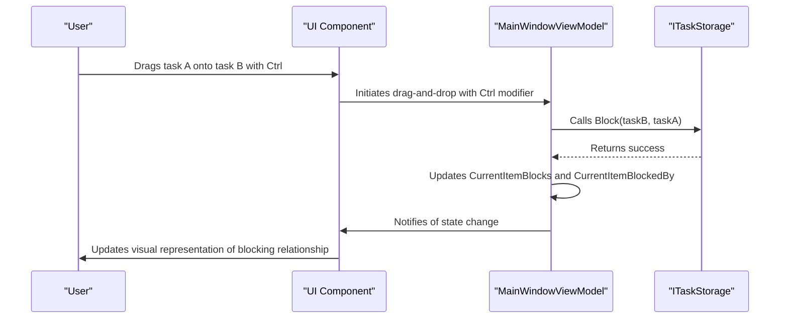

# Block Operation (Ctrl)

<cite>
**Referenced Files in This Document**   
- [MainWindowViewModel.cs](file://src/Unlimotion.ViewModel/MainWindowViewModel.cs)
- [MainControl.axaml.cs](file://src/Unlimotion/Views/MainControl.axaml.cs)
- [GraphControl.axaml.cs](file://src/Unlimotion/Views/GraphControl.axaml.cs)
- [BlockEdge.cs](file://src/Unlimotion/Views/Graph/BlockEdge.cs)
- [TaskItemViewModel.cs](file://src/Unlimotion.ViewModel/TaskItemViewModel.cs)
- [ITaskStorage.cs](file://src/Unlimotion.ViewModel/ITaskStorage.cs)
</cite>

## Table of Contents
1. [Introduction](#introduction)
2. [Block Operation Implementation](#block-operation-implementation)
3. [Drag-and-Drop with Ctrl Key](#drag-and-drop-with-ctrl-key)
4. [Task State Evaluation and UI Updates](#task-state-evaluation-and-ui-updates)
5. [Graph Visualization of Block Relationships](#graph-visualization-of-block-relationships)
6. [User Experience Considerations](#user-experience-considerations)
7. [Practical Examples of Task Blocking](#practical-examples-of-task-blocking)
8. [Conclusion](#conclusion)

## Introduction
The Block operation in Unlimotion enables users to establish dependency relationships between tasks using drag-and-drop functionality with the Ctrl key. When a user drags one task onto another while holding Ctrl, the dragged task becomes a blocker of the target task, preventing its completion until the blocker is completed. This feature implements a critical project management concept where certain tasks cannot proceed until prerequisite tasks are finished. The implementation spans multiple components including the view model, drag-and-drop handlers, and graph visualization, creating a cohesive system for managing task dependencies.

## Block Operation Implementation

The Block operation is implemented through a coordinated interaction between the MainWindowViewModel and the ITaskStorage interface. When a user performs a drag-and-drop operation with the Ctrl key, the system establishes a blocking relationship where the dragged task prevents the completion of the target task. This relationship is managed through the Block method in the ITaskStorage interface, which is called from the drag-and-drop handler in MainControl.axaml.cs.

The implementation follows a reactive pattern where changes to task relationships trigger updates throughout the application. The MainWindowViewModel serves as the central coordinator, managing the state of tasks and their relationships while delegating persistence operations to the ITaskStorage implementation. This separation of concerns allows for a clean architecture where business logic is separated from data storage concerns.

**Section sources**
- [MainWindowViewModel.cs](file://src/Unlimotion.ViewModel/MainWindowViewModel.cs#L544-L547)
- [ITaskStorage.cs](file://src/Unlimotion.ViewModel/ITaskStorage.cs#L28-L29)

## Drag-and-Drop with Ctrl Key

The drag-and-drop functionality with the Ctrl key is implemented in the MainControl.axaml.cs file, which handles the drag-over and drop events for task interactions. When a user holds the Ctrl key during a drag operation, the system interprets this as an intent to create a blocking relationship between tasks.

In the DragOver method, the system checks for the Ctrl key modifier and adjusts the drag effect accordingly:
```csharp
else if (e.KeyModifiers == KeyModifiers.Control)
{
    e.DragEffects &= DragDropEffects.Link;
}
```

When the drop operation occurs, the system creates the blocking relationship by calling the BlockBy method on the target task:
```csharp
else if (e.KeyModifiers == KeyModifiers.Control) //The dragged task blocks the target task
{
    e.DragEffects &= DragDropEffects.Link;
    task.BlockBy(subItem); //subItem блокирует task
    UpdateGraph(e.Source);
    e.Handled = true;
}
```

This implementation allows for intuitive creation of task dependencies where users can visually establish which tasks must be completed before others can proceed. The use of the Ctrl key as a modifier follows common UI conventions for creating links or relationships between items.

**Section sources**
- [MainControl.axaml.cs](file://src/Unlimotion/Views/MainControl.axaml.cs#L150-L153)
- [MainControl.axaml.cs](file://src/Unlimotion/Views/MainControl.axaml.cs#L220-L225)

## Task State Evaluation and UI Updates

The blocking relationship affects task state evaluation in the UI by preventing blocked tasks from being marked as completed. When a task is blocked by another task, its completion state is constrained by the state of its blocker. This relationship is reflected in the UI through visual indicators and interactive elements that communicate the dependency to the user.

The MainWindowViewModel manages the display of blocked tasks through dedicated collections that expose the blocking relationships to the UI:
- CurrentItemBlocks: Shows tasks that the current task blocks
- CurrentItemBlockedBy: Shows tasks that block the current task

These collections are updated reactively whenever blocking relationships change, ensuring that the UI remains synchronized with the underlying data model. The reactive pattern used in the implementation ensures that changes propagate efficiently through the system without requiring manual refresh operations.

When a task is blocked, the UI prevents users from marking it as completed, enforcing the dependency rule at the interface level. This creates a consistent user experience where the visual representation matches the functional constraints of the task management system.



**Diagram sources**
- [MainWindowViewModel.cs](file://src/Unlimotion.ViewModel/MainWindowViewModel.cs#L700-L730)
- [ITaskStorage.cs](file://src/Unlimotion.ViewModel/ITaskStorage.cs#L28-L29)

**Section sources**
- [MainWindowViewModel.cs](file://src/Unlimotion.ViewModel/MainWindowViewModel.cs#L700-L730)
- [TaskItemViewModel.cs](file://src/Unlimotion.ViewModel/TaskItemViewModel.cs#L544-L547)

## Graph Visualization of Block Relationships

The graph visualization of block relationships is implemented through the BlockEdge class and the GraphControl component. When tasks have blocking relationships, these are visually represented in the graph view using specialized edge types that distinguish blocking relationships from other task relationships.

The BlockEdge class extends the base Edge class from the AvaloniaGraphControl library:
```csharp
public class BlockEdge : Edge
{
    public BlockEdge(object tail, object head, object label = null, Symbol tailSymbol = Symbol.None, Symbol headSymbol = Symbol.Arrow) : base(tail, head, label, tailSymbol, headSymbol)
    {
    }
}
```

In the GraphControl, blocking relationships are added to the graph during the BuildFromTasks method:
```csharp
// Обработка задач, блокирующих текущую задачу
foreach (var blocks in task.TaskItem.BlocksTasks)
{
    // Добавление связи блокировки между текущей задачей и блокирующей задачей
    graph.Edges.Add(new BlockEdge(task.TaskItem, blocks));
    
    // Добавление блокирующей задачи и текущей задачи в список задач, имеющих связи
    haveLinks.Add(blocks);
    haveLinks.Add(task.TaskItem);
}
```

The visualization clearly shows the direction of the blocking relationship, with the arrow indicating that the source task blocks the target task. This visual representation helps users understand the flow of dependencies in their task network, making it easier to identify potential bottlenecks or circular dependencies.

```mermaid
classDiagram
class Edge {
+object Tail
+object Head
+object Label
+Symbol TailSymbol
+Symbol HeadSymbol
}
class BlockEdge {
+BlockEdge(tail, head, label, tailSymbol, headSymbol)
}
class ContainEdge {
+ContainEdge(tail, head, label, tailSymbol, headSymbol)
}
Edge <|-- BlockEdge
Edge <|-- ContainEdge
note right of BlockEdge
Represents blocking relationships
between tasks in the graph visualization
The tail task blocks the head task
end note
note right of ContainEdge
Represents containment relationships
between parent and child tasks
end note
```

**Diagram sources**
- [BlockEdge.cs](file://src/Unlimotion/Views/Graph/BlockEdge.cs#L1-L10)
- [GraphControl.axaml.cs](file://src/Unlimotion/Views/GraphControl.axaml.cs#L150-L155)

**Section sources**
- [BlockEdge.cs](file://src/Unlimotion/Views/Graph/BlockEdge.cs#L1-L10)
- [GraphControl.axaml.cs](file://src/Unlimotion/Views/GraphControl.axaml.cs#L140-L155)

## User Experience Considerations

The implementation of the Block operation includes several user experience considerations to ensure that task dependencies are intuitive and manageable. Visual indicators play a crucial role in communicating blocking relationships to users, with the graph visualization providing a clear representation of how tasks depend on each other.

One important consideration is the handling of circular blocking scenarios, where tasks indirectly block each other in a loop. While the current implementation does not explicitly prevent circular dependencies, the directional nature of the blocking relationships makes it possible to detect and warn users about such scenarios. The visualization in the graph view helps users identify potential circular dependencies by showing the flow of blocking relationships.

The impact on roadmap visualization is significant, as blocking relationships directly affect the execution sequence of tasks. Tasks that are blocked appear in the roadmap with visual indicators showing their dependency status, helping users plan their work more effectively. The system ensures that blocked tasks cannot be completed, enforcing the dependency rules at both the data and UI levels.

Additional user experience features include:
- Immediate visual feedback when creating blocking relationships
- Clear distinction between different types of task relationships in the graph view
- Consistent behavior across different views (list, graph, roadmap)
- Preservation of blocking relationships when tasks are moved or reorganized

**Section sources**
- [GraphControl.axaml.cs](file://src/Unlimotion/Views/GraphControl.axaml.cs#L140-L155)
- [MainWindowViewModel.cs](file://src/Unlimotion.ViewModel/MainWindowViewModel.cs#L700-L730)

## Practical Examples of Task Blocking

The Block operation can be used in various practical scenarios to create effective task dependencies and execution sequences. Here are several examples that demonstrate the utility of this feature:

**Software Development Workflow**
In a software development project, developers can use the Block operation to ensure that testing tasks cannot be completed before development tasks. For example, a "Write Unit Tests" task can be set to block the "Code Review" task, ensuring that code is properly tested before it is reviewed.

**Content Creation Process**
For content creators, the Block operation can enforce a proper workflow where editing tasks block publishing tasks. A "Copy Editing" task can block the "Publish to Website" task, preventing premature publication of content that hasn't been properly edited.

**Event Planning**
Event planners can use blocking relationships to ensure that critical preparations are completed before event execution. For instance, a "Venue Booking Confirmation" task can block the "Send Invitations" task, preventing invitations from being sent before the venue is confirmed.

**Research Projects**
In research projects, the Block operation can ensure that data collection is completed before analysis begins. A "Complete Survey Data Collection" task can block the "Analyze Survey Results" task, maintaining the integrity of the research process.

These examples illustrate how the Block operation supports proper sequencing of tasks, preventing premature completion of dependent tasks and ensuring that work flows according to the intended process.

**Section sources**
- [MainControl.axaml.cs](file://src/Unlimotion/Views/MainControl.axaml.cs#L220-L225)
- [TaskItemViewModel.cs](file://src/Unlimotion.ViewModel/TaskItemViewModel.cs#L544-L547)

## Conclusion
The Block operation in Unlimotion provides a powerful mechanism for establishing task dependencies through intuitive drag-and-drop interactions with the Ctrl key. By allowing users to visually create blocking relationships between tasks, the system enforces proper execution sequences and prevents premature completion of dependent tasks. The implementation spans multiple components, from the drag-and-drop handlers to the graph visualization, creating a cohesive and user-friendly experience. The reactive architecture ensures that changes to blocking relationships are immediately reflected throughout the application, maintaining consistency between the data model and the user interface. This feature significantly enhances the task management capabilities of Unlimotion, making it a valuable tool for managing complex workflows and project dependencies.