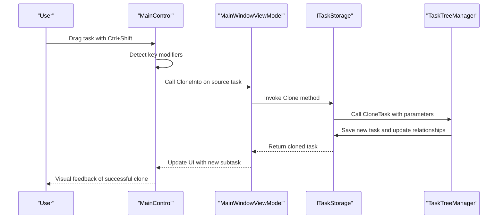
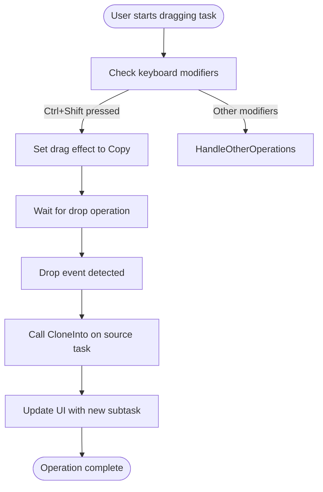
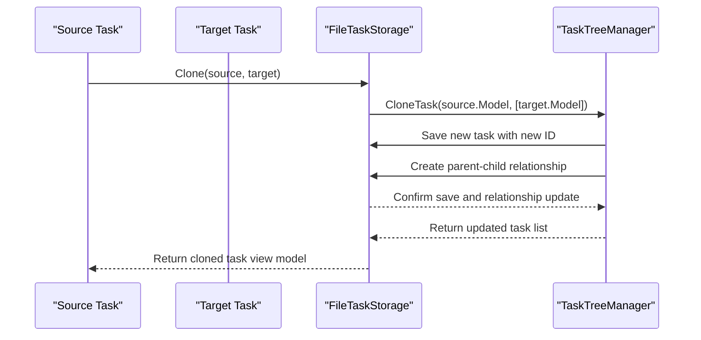
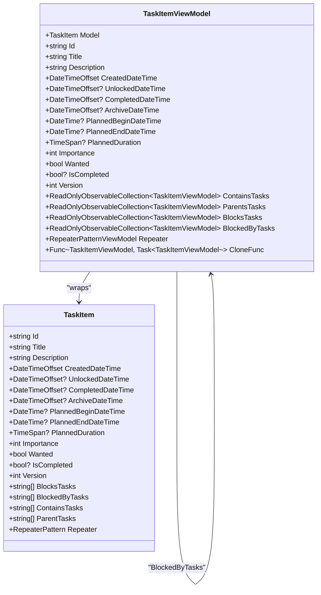

# Clone Operation (Ctrl+Shift)

<cite>
**Referenced Files in This Document**   
- [MainWindowViewModel.cs](file://src/Unlimotion.ViewModel/MainWindowViewModel.cs)
- [ITaskStorage.cs](file://src/Unlimotion.ViewModel/ITaskStorage.cs)
- [FileTaskStorage.cs](file://src/Unlimotion/FileTaskStorage.cs)
- [TaskTreeManager.cs](file://src/Unlimotion.TaskTreeManager/TaskTreeManager.cs)
- [TaskItemViewModel.cs](file://src/Unlimotion.ViewModel/TaskItemViewModel.cs)
- [MainControl.axaml.cs](file://src/Unlimotion/Views/MainControl.axaml.cs)
</cite>

## Table of Contents
1. [Introduction](#introduction)
2. [Implementation Overview](#implementation-overview)
3. [Core Components](#core-components)
4. [Drag-and-Drop Workflow](#drag-and-drop-workflow)
5. [Task Cloning Process](#task-cloning-process)
6. [Data Structure Duplication](#data-structure-duplication)
7. [User Experience Considerations](#user-experience-considerations)
8. [Performance Implications](#performance-implications)
9. [Best Practices](#best-practices)
10. [Conclusion](#conclusion)

## Introduction
The Clone operation in Unlimotion enables users to duplicate tasks through a drag-and-drop interface using the Ctrl+Shift key combination. This functionality creates a copy of the dragged task as a subtask of the target task while preserving the original task. The implementation involves multiple components working together to handle the cloning process, including task property duplication, relationship preservation, and proper storage management. This document details the technical implementation, workflow, and considerations for using this feature effectively.

## Implementation Overview
The clone operation is implemented through a coordinated interaction between the UI layer, view models, and storage components. When a user performs a drag-and-drop operation with Ctrl+Shift, the system identifies this as a cloning action and invokes the appropriate methods to create a duplicate task with the target task as its parent. The implementation follows a layered architecture where the UI captures user input, the view model coordinates the operation, and the storage layer handles the actual data manipulation.

**Diagram sources**
- [MainControl.axaml.cs](file://src/Unlimotion/Views/MainControl.axaml.cs#L179)
- [TaskItemViewModel.cs](file://src/Unlimotion.ViewModel/TaskItemViewModel.cs#L580)
- [ITaskStorage.cs](file://src/Unlimotion.ViewModel/ITaskStorage.cs#L28)
- [FileTaskStorage.cs](file://src/Unlimotion/FileTaskStorage.cs#L324)
- [TaskTreeManager.cs](file://src/Unlimotion.TaskTreeManager/TaskTreeManager.cs#L212)

## Core Components
The clone operation relies on several core components that work together to implement the functionality. The ITaskStorage interface defines the contract for task operations, including the Clone method that is central to this functionality. The FileTaskStorage class provides the concrete implementation of this interface, handling the actual storage operations. The TaskTreeManager class manages the hierarchical relationships between tasks, ensuring that parent-child connections are properly maintained during cloning operations.

**Section sources**
- [ITaskStorage.cs](file://src/Unlimotion.ViewModel/ITaskStorage.cs#L28)
- [FileTaskStorage.cs](file://src/Unlimotion/FileTaskStorage.cs#L324)
- [TaskTreeManager.cs](file://src/Unlimotion.TaskTreeManager/TaskTreeManager.cs#L212)

## Drag-and-Drop Workflow
The drag-and-drop workflow begins when a user initiates a drag operation on a task item. The MainControl class captures this event and monitors the keyboard modifiers. When the Ctrl+Shift combination is detected during a drag-over event, the system sets the drag effect to Copy, indicating that a cloning operation will occur if the drop is completed. Upon dropping the task onto a target, the Drop method is invoked, which calls the CloneInto method on the source task with the target task as a parameter.

**Diagram sources**
- [MainControl.axaml.cs](file://src/Unlimotion/Views/MainControl.axaml.cs#L150)
- [MainControl.axaml.cs](file://src/Unlimotion/Views/MainControl.axaml.cs#L220)

## Task Cloning Process
The task cloning process begins with the CloneInto method in the TaskItemViewModel class, which serves as the entry point for the operation. This method creates a new TaskItem with the same properties as the source task and then invokes the Clone method on the ITaskStorage interface. The FileTaskStorage implementation of this method calls the CloneTask method on the TaskTreeManager, which orchestrates the creation of the new task and establishment of the parent-child relationship. During this process, a new unique ID is generated for the cloned task, and the version number is reset to 1.

**Diagram sources**
- [TaskItemViewModel.cs](file://src/Unlimotion.ViewModel/TaskItemViewModel.cs#L580)
- [FileTaskStorage.cs](file://src/Unlimotion/FileTaskStorage.cs#L324)
- [TaskTreeManager.cs](file://src/Unlimotion.TaskTreeManager/TaskTreeManager.cs#L212)

## Data Structure Duplication
When a task is cloned, several aspects of its data structure are duplicated while maintaining appropriate relationships. The core properties such as title, description, planned duration, and repeater settings are copied directly from the source task to the clone. The ContainsTasks collection is duplicated, creating a hierarchical copy of the entire subtask structure. Blocking relationships (BlocksTasks and BlockedByTasks) are also preserved in the clone, ensuring that the task's dependencies are maintained. However, the parent relationships are modified to establish the target task as the sole parent of the cloned task.

**Diagram sources**
- [TaskItemViewModel.cs](file://src/Unlimotion.ViewModel/TaskItemViewModel.cs#L100)
- [TaskItemViewModel.cs](file://src/Unlimotion.ViewModel/TaskItemViewModel.cs#L580)

## User Experience Considerations
The clone operation provides several user experience features to ensure clarity and usability. Visual feedback is provided during the drag operation, with the cursor indicating a copy operation when Ctrl+Shift is pressed. After a successful clone, the UI automatically updates to show the new subtask under the target task. The original task remains unchanged, preserving its position and relationships in the task hierarchy. Task IDs are automatically generated for cloned tasks, ensuring uniqueness across the system. The operation maintains all metadata from the source task, including creation date, which helps users track the origin of cloned tasks.

**Section sources**
- [MainControl.axaml.cs](file://src/Unlimotion/Views/MainControl.axaml.cs#L150)
- [MainControl.axaml.cs](file://src/Unlimotion/Views/MainControl.axaml.cs#L220)
- [FileTaskStorage.cs](file://src/Unlimotion/FileTaskStorage.cs#L350)

## Performance Implications
The clone operation has several performance considerations, particularly when dealing with large task hierarchies. Cloning a task with many subtasks requires creating new IDs and saving each task to storage, which can be time-consuming for deep hierarchies. The operation is implemented with transactional integrity, ensuring that either all tasks in a hierarchy are successfully cloned or the operation is rolled back. The system uses efficient data structures and batch operations where possible to minimize database access. For very large task trees, users may experience a brief delay during the cloning process, but the UI remains responsive due to the asynchronous implementation.

**Section sources**
- [FileTaskStorage.cs](file://src/Unlimotion/FileTaskStorage.cs#L324)
- [TaskTreeManager.cs](file://src/Unlimotion.TaskTreeManager/TaskTreeManager.cs#L212)
- [TaskTreeManager.cs](file://src/Unlimotion.TaskTreeManager/TaskTreeManager.cs#L230)

## Best Practices
To effectively use the clone operation for replicating task templates or duplicating workflows, users should follow several best practices. For creating task templates, design a master task with all desired properties, subtasks, and relationships, then clone it whenever a new instance is needed. When duplicating workflows, ensure that the source task's blocking relationships are appropriate for the new context, as these are preserved in the clone. For recurring processes, combine cloning with the repeater functionality to automatically generate new instances at specified intervals. Avoid cloning extremely large task hierarchies unnecessarily, as this can impact performance and storage usage.

**Section sources**
- [TaskItemViewModel.cs](file://src/Unlimotion.ViewModel/TaskItemViewModel.cs#L580)
- [FileTaskStorage.cs](file://src/Unlimotion/FileTaskStorage.cs#L324)
- [TaskTreeManager.cs](file://src/Unlimotion.TaskTreeManager/TaskTreeManager.cs#L212)

## Conclusion
The Clone operation in Unlimotion provides a powerful mechanism for duplicating tasks and workflows through an intuitive drag-and-drop interface. By leveraging the Ctrl+Shift key combination, users can efficiently create copies of tasks as subtasks of target tasks while preserving the original. The implementation demonstrates a well-structured approach with clear separation of concerns between UI, view model, and storage layers. The operation carefully handles data duplication, relationship preservation, and performance considerations to provide a reliable and user-friendly experience. This functionality is particularly valuable for creating task templates and replicating complex workflows across different projects or time periods.